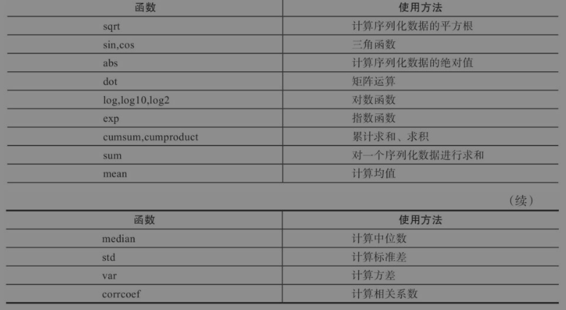
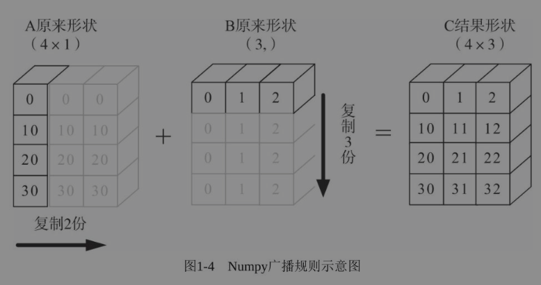



# Python 深度学习：基于 PyTorch

## 1 Numpy 基础

Python 本身含有列表（list）和数组（array），但对于大数据来说，这些结构是有很多不足的。由于列表的元素可以是任何对象，因此列表中所保存的是对象的指针。例如为了保存一个简单的[1,2,3]，都需要有 3 个指针和 3
个整数对象。对于数值运算来说，这种结构显然比较浪费内存和 CPU 等宝贵资源。至于 array 对象，它可以直接保存数值，和 C 语言的一维数组比较类似。但是由于它不支持多维，在上面的函数也不多，因此也不适合做数值运算

Numpy（Numerical Python 的简称）提供了两种基本的对象：ndarray（N-dimensional Array Object）和 ufunc（Universal Function Object）。ndarray
是存储单一数据类型的多维数组，而 ufunc 则是能够对数组进行处理的函数

Numpy 的主要特点：

1. ndarray，快速节省空间的多维数组，提供数组化的算术运算和高级的广播功能。
2. 使用标准数学函数对整个数组的数据进行快速运算，且不需要编写循环。
3. 读取/写入磁盘上的阵列数据和操作存储器映像文件的工具。
4. 线性代数、随机数生成和傅里叶变换的能力。
5. 集成 C、C++、Fortran 代码的工具

### 1.1 生成 Numpy 数组

```python
import numpy as np
```

导入 Numpy 后，可通过 np.+Tab 键，查看可使用的函数

运行如下命令，便可查看函数 abs 的详细帮助信息。

np.abs?

Numpy 封装了一个新的数据类型 ndarray（N-dimensional Array），它是一个多维数组对象。该对象封装了许多常用的数学运算函数，方便我们做数据处理、数据分析等

#### 1.1.1 　从已有数据中创建数组

1. 将列表转换成 ndarray

```python
import numpy as np

list1 = [1,3,4,5,6]
nd = np.array(list1)
```

2. 多维 ndarray 转换

```python
list2 = [[1,2,3,4],[5,6,7,8]]
nd2 = np.array(list2)
```

#### 1.1.2 　利用 random 模块生成数组

```python
nd3 = np.random.random([3,3])  # 生成3x3的随机矩阵
np.random.seed(123) #修改随机种子
nd4 = np.random.randn(2,3) #生成正态分布都2x3矩阵
np.random.shuffle(nd4) #打乱
```

#### 1.1.3 　创建特定形状的多维数组

全是 0 或 1 的数组或矩阵，这时我们可以利用 np.zeros、np.ones、np.diag 来实现

```python
import numpy as np

nd5 = np.zeros([3,3]) # 全0 3x3 矩阵
nd6 = np.ones([3,3]) # 全1 3x3 矩阵
nd7 = np.eys(3)  # 3阶单位矩阵
# [1,0,0]
# [0,1,0]
# [0,0,1]
nd8 = np.diag([1,2,3]) # 3阶对角矩阵
# [1,0,0]
# [0,2,0]
# [0,0,3]
```

#### 1.1.4 　利用 arange、linspace 函数生成数组

arange 是 numpy 模块中的函数，其格式为：

```python
np.arange([start,] stop[,step,], dtype=None)
np.linspace(start, stop, num=50, endpoint=True, retstep=False, dtype=None)
```

其中 start 与 stop 用来指定范围，step 用来设定步长。在生成一个 ndarray 时，start 默认为 0，步长 step 可为小数

linspace 可以根据输入的指定数据范围以及等份数量，自动生成一个线性等分向量，其中 endpoint（包含终点）默认为 True，等分数量 num 默认为 50。如果将 retstep 设置为 True，则会返回一个带步长的
ndarra

```python
import numpy as np
print(np.linspace(0, 1, 10))#[0. 0.11111111 0.22222222 0.33333333 0.44444444 0.55555556#0.66666667 0.77777778 0.88888889 1. ]
```

除了上面介绍到的 arange 和 linspace，Numpy 还提供了 logspace 函数，该函数的使用方法与 linspace 的使用方法一样

### 1.2 　获取元素

```python
import numpy as np

np.random.seed(2019)
nd11 = np.random.random([10])
# 获取第4个元素
nd11[3]
# 截取一段元素
nd11[3:6]
# 截取固定间隔数据
nd11[1:6:2]
# 倒序取数
nd11[::-2]

# 多维数组
nd12 = np.arange(25).reshape([5,5])
nd12[1:3,1:3]
# 取数值
nd12[(nd12>3)&(nd12<10)]
# 指定行列 2行3列
nd12[[1,2]]
nd12[:,1:3]

```

random.choice 函数从指定的样本中随机抽取数据

```python
import numpy as np
from numpy import random as nr
a=np.arange(1,25,dtype=float)
c1=nr.choice(a,size=(3,4)) #size指定输出数组形状
c2=nr.choice(a,size=(3,4),replace=False)#replace缺省为True，即可重复抽取。
#下式中参数p指定每个元素对应的抽取概率，缺省为每个元素被抽取的概率相同。
c3=nr.choice(a,size=(3,4),p=a / np.sum(a))
```

### 1.3 　 Numpy 的算术运算

#### 1.3.1 　对应元素相乘

np.multiply 函数用于数组或矩阵对应元素相乘，输出与相乘数组或矩阵的大小一致，其格式如下：

```python
numpy.multiply(x1, x2, /, out=None, *, where=True,casting='same_kind', order='K',dtype=None, subok=True[, signature, extobj])

A = np.array([[1, 2], [-1, 4]])
B = np.array([[2, 0], [3, 4]])
A*B #结果如下：array([[ 2, 0], [-3,16]])
#或另一种表示方法
np.multiply(A,B) #运算结果也是array([[ 2, 0], [-3, 16]])
A*2.0
```


Numpy 数组不仅可以和数组进行对应元素相乘，还可以和单一数值（或称为标量）进行运算

推而广之，数组通过一些激活函数后，输出与输入形状一致

```python
X = np.random.rand(2,3)
def softmoid(x):
    return 1/(1+np.exp(-x))

def relu(x):
    return np.maximum(0,x)

def softmax(x):
    return np.exp(x) / np.sum(np.exp(x))

X.shape # (2,3)
softmoid(X)
relu(X)
softmax(X)
```

#### 1.3.2 　点积运算

点积运算（Dot Product）又称为内积，在 Numpy 用 np.dot 表示，其一般格式为

```python
X1 = np.array([[1,2],[3,4]])
X2 = np.array([[5,6,7],[8,9,10]])
X3 = np.dot(X1,X2)
# [21 24 27]
# [47 54 61]
```


### 1.4 　数组变形

#### 1.4.1 　更改数组的形状


##### 1 reshape - 改变向量的维度（不修改向量本身）

```python
import numpy as np

arr = np.arrange(10) # [0 1 2 3 4 5 6 7 8 9]
arr.reshape(2,5)
# [0 1 2 3 4]
# [5 6 7 8 9]
arr.reshape(5,-1)
arr.reshape(-1,5)
```

##### 2 resize - 改变向量的维度（修改向量本身）

```python
arr.resize(2,5) # arr本身被修改了
```

##### 3 T - 转置

```python
arr = np.arrange(12).reshape(3,4)
arr.T # 4行3列
```

##### 4 ravel - 向量展平

```python
arr = np.arrange(6).reshape(2,-1)
# [0 1 2]
# [3 4 5]
print(arr.ravel('F')) # 按列优先展平 [0 3 1 4 2 5]
print(arr.ravel()) # 按行优先展平 [0 1 2 3 4 5]
```

##### 5 flatten - 矩阵转向量

```python
a = np.floor(10*np.random.random((3,4)))
# [4 0 8 5]
# [1 0 4 8]
# [8 2 3 7]
print(a.flatten())
# [4 0 8 5 1 0 4 8 8 2 3 7]
```

##### 6 squeeze - 降维函数

```python
arr =np.arange(3).reshape(3, 1)
print(arr.shape) #(3,1)
print(arr.squeeze().shape) #(3,)
arr1=np.arange(6).reshape(3,1,2,1)
print(arr1.shape) #(3, 1, 2, 1)
print(arr1.squeeze().shape) #(3,2)
```

7. transpose - 对高维矩阵进行轴对换，这个在深度学习中经常使用，比如把图片中表示颜色顺序的 RGB 改为 GBR

```python
arr2 = np.arange(24).reshape(2,3,4)
print(arr2.shape) #(2, 3, 4)
print(arr2.transpose(1,2,0).shape) #(3, 4, 2)
```

#### 1.4.2 　合并数组


1. append、concatenate 以及 stack 都有一个 axis 参数，用于控制数组的合并方式是按行还是按列
2. 对于 append 和 concatenate，待合并的数组必须有相同的行数或列数（满足一个即可）
3. stack、hstack、dstack，要求待合并的数组必须具有相同的形状（shape）

##### 1 append - 合并

```python
import numpy as np

a = np.array([1,2,3])
b = np.array([4,5,6])
c = np.append(a,b) # [1 2 3 4 5 6]

a =np.arange(4).reshape(2, 2)
b = np.arange(4).reshape(2, 2)
# 按行合并
c = np.append(a, b,axis=0)
# [0 1]
# [2 3]
# [0 1]
# [2 3]
# 按列合并
c = np.append(a,b,axis=1)
# [0 1 0 1]
# [2 3 2 3]
```

##### 2 concatenate - 连接

```python
a = np.array([1,2],[3,4])
b = np.array([[5,6]])

c = np.concatenate((a,b),axis=0)
# [1 2]
# [3 4]
# [5 6]
c = np.concatenate((a,b.T),axis=1)
# [1 2 5]
# [3 4 6]
```

##### 3 stack - 堆叠

```python
a = np.array([1,2],[3,4])
b = np.array([5,6],[7,8])
np.stack((a,b),axis=0)
# [[1 2]
#  [3 4]],
# [[5 6]
#  [7 8]]
```

### 1.5 　批量处理

如何把大数据拆分成多个批次呢？可采用如下步骤：

1）得到数据集

2）随机打乱数据

3）定义批量大小

4）批处理数据集

```python
import numpy as np

# 10000个2x3矩阵
data_train = np.random.randn(10000,2,3)
# 打乱
np.random.shuffle(data_train)
# 定义批量大小
batch_size = 100
# 批处理
for i in range(0,len(data_train),batch_size):
    x_batch_sum = np.sum(data_train[i:i+batch_size])
```

### 1.6 　通用函数

Numpy 提供了两种基本的对象，即 ndarray 和 ufunc 对象。

前文已经介绍了 ndarray，本节将介绍 Numpy 的另一个对象通用函数（ufunc）。

ufunc 是 universal function 的缩写，它是一种能对数组的每个元素进行操作的函数。许多 ufunc 函数都是用 C 语言级别实现的，因此它们的计算速度非常快



Numpy 的内建函数使用了 SIMD 指令，所以快。但是不支持 GPU

```python
import timeimport numpy as np
x1 = np.random.rand(1000000)
x2 = np.random.rand(1000000)
##使用循环计算向量点积
tic =time.process_time()
dot = 0
for i in range(len(x1)):
    dot+= x1[i]*x2[i]
    toc =time.process_time()
    print ("dot = " + str(dot) + "\n for loop----- Computation time = " +str(1000*(toc - tic)) + "ms")
##使用numpy函数求点积
tic = time.process_time()
dot = 0
dot =np.dot(x1,x2)
toc = time.process_time()print ("dot = " + str(dot) + "\n verctor version----Computation time = " + str(1000*(toc - tic)) + "ms")
# 结果差了400倍
```

### 1.7 　广播机制

当数组的 shape 不相等时，则会使用广播机制

调整数组使得 shape 一样，需要满足一定的规则

1. 让所有输入数组都向其中 shape 最长的数组看齐，不足的部分则通过在前面加 1 补齐，如：

   a：2×3×2

   b：3×2

   则 b 向 a 看齐，在 b 的前面加 1，变为：1×3×2

2. 输出数组的 shape 是输入数组 shape 的各个轴上的最大值

3. 如果输入数组的某个轴和输出数组的对应轴的长度相同或者某个轴的长度为 1 时，这个数组能被用来计算，否则出错

4. 当输入数组的某个轴的长度为 1 时，沿着此轴运算时都用（或复制）此轴上的第一组值

**示例**

目的：A+B，其中 A 为 4×1 矩阵，B 为一维向量（3,）

要相加，需要做如下处理：

根据规则 1，B 需要向看齐，把 B 变为（1,3）

根据规则 2，输出的结果为各个轴上的最大值，即输出结果应该为（4,3）矩阵，那么 A 如何由（4,1）变为（4,3）矩阵？B 又如何由（1,3）变为（4,3）矩阵？

根据规则 4，用此轴上的第一组值（要主要区分是哪个轴），进行复制（但在实际处理中不是真正复制，否则太耗内存，而是采用其他对象如 ogrid 对象，进行网格处理）即可，详细处理过程如图 1-4 所示。



## 2 PyTorch 基础

### 2.1 　为何选择 PyTorch

PyTorch 采用了动态计算图（Dynamic Computational Graph）结构，且基于 tape 的 Autograd 系统的深度神经网络。其他很多框架，比如 TensorFlow（TensorFlow2.0
也加入了动态网络的支持）、Caffe、CNTK、Theano 等，采用静态计算图。使用 PyTorch，通过一种称为 Reverse-mode
auto-differentiation（反向模式自动微分）的技术，可以零延迟或零成本地任意改变你的网络的行为

PyTorch 由 4 个主要的包组成：

- torch：类似于 Numpy 的通用数组库，可将张量类型转换为 torch.cuda.TensorFloat，并在 GPU 上进行计算。
- torch.autograd：用于构建计算图形并自动获取梯度的包。
- torch.nn：具有共享层和损失函数的神经网络库。
- torch.optim：具有通用优化算法（如 SGD、Adam 等）的优化包。

### 2.4 　 Numpy 与 Tensor

这节我们将介绍 PyTorch 的 Tensor，它可以是零维（又称为标量或一个数）、一维、二维及多维的数组。Tensor 自称为神经网络界的 Numpy，它与 Numpy
相似，二者可以共享内存，且之间的转换非常方便和高效。不过它们也有不同之处，最大的区别就是 Numpy 会把 ndarray 放在 CPU 中进行加速运算，而由 Torch 产生的 Tensor 会放在 GPU 中进行加速运算

#### 2.4.1 Tensor 概述

对 Tensor 的操作很多，从接口的角度来划分，可以分为两类：

1）torch.function，如 torch.sum、torch.add 等

2）tensor.function，如 tensor.view、tensor.add 等

如果从修改方式的角度来划分，可以分为以下两类：

1）不修改自身数据，如 x.add(y)，x 的数据不变，返回一个新的 Tensor

2）修改自身数据，如 x.add\_(y)（运行符带下划线后缀），运算结果存在 x 中，x 被修改

#### 2.4.2 创建 Tensor


```python
import torch

#根据list产生
t1 = torch.Tensor([1,2,3,4,5,6])
print(t1)
#指定形状
t2=torch.Tensor(2,3)
print(t2)
#指定矩阵
t = torch.Tensor([[1,2,3],[4,5,6]])
#shape和size同一个意思
print("size=",t.size(),"shape=",t.shape)
print(t)
#指定size
t3 = torch.Tensor(t.size())
print(t3)

print("单位矩阵",torch.eye(2,2))
print("全0矩阵",torch.zeros(2,3))
print("线段",torch.linspace(1,10,4))
print("均匀分布随机数",torch.rand(2,3))
print("标准分布随机数",torch.randn(2,3))
print("全0张量",torch.zeros_like(torch.rand(2,3)))

```

#### 2.4.3 修改 Tensor 形状


```python
X = torch.randn(2,3)
print("size=",X.size(),"dim=",X.dim(),"X=",X)
print("3x2矩阵",X.view(3,2))
y=X.view(-1)
print("1维向量",y)
#添加一个维度
z = torch.unsqueeze(y,0)
print(z)
```

torch.view()结果共享内存，torch.reshape()重新产生一个新的

#### 2.4.4 索引操作


```python
torch.manual_seed(100)
x = torch.randn(2,3)
print("x= ",x)
print("第1行",x[0,:],"最后1列",x[:,-1])


mask = x > 0
# 列出所有>0的值
print(">0 value",torch.masked_select(x,mask))
# 列出所有>0的索引
print(">0 index:",torch.nonzero(mask))

# Gather的规则
# out[i][j] = input[index[i][j]][j] # if dim=0
# out[i][j] = input[i][index[i][j]] # if dim=1
index = torch.LongTensor([[0,1,1]])
b = torch.gather(x,0,index)
print("b=",b)

index = torch.LongTensor([[0,1,1],[1,1,1]])
a = torch.gather(x,1,index)
print("a=",a)

z = torch.zeros(2,3)
z.scatter_(1,index,a)
print(z)
```

#### 2.4.6 　逐元素操作


```python
t = torch.randn(1, 3)
t1 = torch.randn(3, 1)
t2 = torch.randn(1, 3)
#t+0.1*(t1/t2)
torch.addcdiv(t, 0.1, t1, t2)
#计算sigmoid
torch.sigmoid(t)
#将t限制在[0,1]之间
torch.clamp(t,0,1)
#t+2进行就地运算
t.add_(2)
```

#### 2.4.7 　归并操作


#### 2.4.8 　比较操作


#### 2.4.9 　矩阵操作


1. Torch 的 dot 与 Numpy 的 dot 有点不同，Torch 中的 dot 是对两个为 1D 张量进行点积运算，Numpy 中的 dot 无此限制。
2. mm 是对 2D 的矩阵进行点积，bmm 对含 batch 的 3D 进行点积运算。
3. 转置运算会导致存储空间不连续，需要调用 contiguous 方法转为连续。

### 2.5 　 Tensor 与 Autograd

#### 2.5.1 　自动求导要点

1. 对每个 tensor，设置 requires_grad=True。
2. requires*grad*()修改 Tensor 的 requires_grad 属性。.detach()或 with torch.no_grad()，将不再计算张量的梯度，跟踪张量的历史记录
3. Tensor 会自动被赋予 grad_fn 属性。该属性表示梯度函数。叶子节点的 grad_fn 为 None。
4. 最后得到的 Tensor 执行 backward()函数，此时自动计算各变量的梯度，并将累加结果保存到 grad 属性中。计算完成后，非叶子节点的梯度自动释放
5. backward()函数接收参数，该参数应和调用 backward()函数的 Tensor 的维度相同，或者是可 broadcast 的维度。如果求导的 Tensor 为标量（即一个数字），则 backward 中的参数可省略。
6. 反向传播的中间缓存会被清空，如果需要进行多次反向传播，需要指定 backward 中的参数 retain_graph=True。多次反向传播时，梯度是累加的。
7. 非叶子节点的梯度 backward 调用后即被清空。
8. 可以通过用 torch.no_grad()包裹代码块的形式来阻止 autograd 去跟踪那些标记

#### 2.5.2 　计算图

z = wx+b 可以表达如下


#### 2.5.3 　标量反向传播


