

# 动手学深度学习

## 1. 引言

- 各种机器学习问题

  - 1. 监督学习

    - [1.1. 回归](https://zh-v2.d2l.ai/chapter_introduction/index.html#id10)
    - [1.2. 分类](https://zh-v2.d2l.ai/chapter_introduction/index.html#id11)
    - [1.3. 标记问题](https://zh-v2.d2l.ai/chapter_introduction/index.html#id12)
    - [1.4. 搜索](https://zh-v2.d2l.ai/chapter_introduction/index.html#id13)
    - [1.5. 推荐系统](https://zh-v2.d2l.ai/chapter_introduction/index.html#id14)
    - [1.6. 序列学习](https://zh-v2.d2l.ai/chapter_introduction/index.html#id15)

  - [2. 无监督学习](https://zh-v2.d2l.ai/chapter_introduction/index.html#id16)

  - [3. 与环境互动](https://zh-v2.d2l.ai/chapter_introduction/index.html#id17)

  - [4. 强化学习](https://zh-v2.d2l.ai/chapter_introduction/index.html#id18)

## 2. 预备知识

### 2.1. 数据操作

我们介绍 n 维数组，也称为*张量*（tensor）

_张量类_（在 MXNet 中为`ndarray`， 在 PyTorch 和 TensorFlow 中为`Tensor`）都与 Numpy 的`ndarray`类似

#### 2.1.1. 入门

```python
import torch

#使用 arange 创建一个行向量 x
x = torch.arange(12)  # tensor([ 0,  1,  2,  3,  4,  5,  6,  7,  8,  9, 10, 11])

#通过张量的shape属性来访问张量（沿每个轴的长度）的形状
x.shape  # torch.Size([12])

#张量中元素的总数
x.numel()   # 12

#改变一个张量的形状而不改变元素数量和元素值，可以调用reshape函数
X = x.reshape(3, 4)
# tensor([[ 0,  1,  2,  3],
#        [ 4,  5,  6,  7],
#        [ 8,  9, 10, 11]])
#可以用x.reshape(-1,4)或x.reshape(3,-1)来取代x.reshape(3,4),-1表示自动计算

#使用全0、全1、其他常量，或者从特定分布中随机采样的数字来初始化矩阵
torch.zeros((2, 3, 4))
#tensor([[[0., 0., 0., 0.],
#         [0., 0., 0., 0.],
#         [0., 0., 0., 0.]],

#        [[0., 0., 0., 0.],
#         [0., 0., 0., 0.],
#         [0., 0., 0., 0.]]])
torch.ones((2, 3, 4))  #全1
torch.randn(3, 4)  #随机
torch.tensor([[2, 1, 4, 3], [1, 2, 3, 4], [4, 3, 2, 1]]) #手动赋值
```

#### 2.1.2. 运算符

在数学表示法中，我们将通过符号$f: \mathbb{R} \rightarrow \mathbb{R}$来表示*一元*标量运算符（只接收一个输入）。 这意味着该函数从任何实数（$\mathbb{R}$）映射到另一个实数。

我们通过符号$f: \mathbb{R}, \mathbb{R} \rightarrow \mathbb{R}$表示*二元*标量运算符，这意味着该函数接收两个输入，并产生一个输出

对于任意具有相同形状的张量， 常见的标准算术运算符（`+`、`-`、`*`、`/`和`**`）都可以被升级为按元素运算

```python
x = torch.tensor([1.0, 2, 4, 8])
y = torch.tensor([2, 2, 2, 2])
x + y, x - y, x * y, x / y, x ** y  # **运算符是求幂运算
torch.exp(x)  # tensor([2.7183e+00, 7.3891e+00, 5.4598e+01, 2.9810e+03])

#多个张量连结, dim=0沿行 dim=1按列
X = torch.arange(12, dtype=torch.float32).reshape((3,4))
Y = torch.tensor([[2.0, 1, 4, 3], [1, 2, 3, 4], [4, 3, 2, 1]])
torch.cat((X, Y), dim=0)
# (tensor([[ 0.,  1.,  2.,  3.],
#          [ 4.,  5.,  6.,  7.],
#          [ 8.,  9., 10., 11.],
#          [ 2.,  1.,  4.,  3.],
#          [ 1.,  2.,  3.,  4.],
#          [ 4.,  3.,  2.,  1.]]),
torch.cat((X, Y), dim=1)
# tensor([[ 0.,  1.,  2.,  3.,  2.,  1.,  4.,  3.],
#         [ 4.,  5.,  6.,  7.,  1.,  2.,  3.,  4.],
#         [ 8.,  9., 10., 11.,  4.,  3.,  2.,  1.]]))

# 逻辑运算符
X == Y
# tensor([[False,  True, False,  True],
#         [False, False, False, False],
#         [False, False, False, False]])

# 对张量中的所有元素进行求和
X.sum()
# tensor(66.)
```

#### 2.1.3. 广播机制

即使形状不同，我们仍然可以通过调用 _广播机制_（broadcasting mechanism）来执行按元素操作。这种机制的工作方式如下：

1. 通过适当复制元素来扩展一个或两个数组，以便在转换之后，两个张量具有相同的形状；
2. 对生成的数组执行按元素操作。

```python
a = torch.arange(3).reshape((3, 1))
# (tensor([[0],
#          [1],
#          [2]]),
b = torch.arange(2).reshape((1, 2))
# tensor([[0, 1]]))
a + b
# 矩阵a将复制列， 矩阵b将复制行，然后再按元素相加
# tensor([[0, 1],
#         [1, 2],
#         [2, 3]])
```

#### 2.1.4. 索引和切片

张量中的元素可以通过索引访问。 与任何 Python 数组一样：第一个元素的索引是 0，最后一个元素索引是-1； 可以指定范围以包含第一个元素和最后一个之前的元素

```python
X[-1]  # 用[-1]选择最后一个元素
X[1:3] # 用[1:3]选择第二个和第三个元素
X[1, 2] = 9 # 指定索引来将元素写入矩阵
X[0:2, :] = 12 # 访问第1行和第2行，其中“:”代表沿轴1（列）的所有元素
# tensor([[12., 12., 12., 12.],
#         [12., 12., 12., 12.],
#         [ 8.,  9., 10., 11.]])
```

#### 2.1.5. 节省内存

运行一些操作可能会导致为新结果分配内存。 例如，如果我们用`Y = X + Y`，我们将取消引用`Y`指向的张量，而是指向新分配的内存处的张量

```python
before = id(Y)
Y = Y + X
id(Y) == before # False
```

如何不分配内存，直接把结果放入原来的矩阵

可以使用切片表示法将操作的结果分配给先前分配的数组，例如`Y[:] = <expression>`

```python
Z = torch.zeros_like(Y)
Z[:] = X + Y
X += Y  # 这个也不会变
```

#### 2.1.6. 转换为其他 Python 对象

```python
A = X.numpy()
B = torch.tensor(A)
type(A), type(B)
# (numpy.ndarray, torch.Tensor)

# 将大小为1的张量转换为Python标量
a = torch.tensor([3.5])
a			# (tensor([3.5000])
a.item()	# 3.5
float(a)	# 3.5
int(a)		# 3
```

### 2.2. 数据预处理

Python 中常用的数据分析工具中，我们通常使用`pandas`软件包

#### 2.2.1. 读取数据集

将数据集按行写入 CSV 文件中

```python
import os

os.makedirs(os.path.join('..', 'data'), exist_ok=True)
data_file = os.path.join('..', 'data', 'house_tiny.csv')
with open(data_file, 'w') as f:
    f.write('NumRooms,Alley,Price\n')  # 列名
    f.write('NA,Pave,127500\n')  # 每行表示一个数据样本
    f.write('2,NA,106000\n')
    f.write('4,NA,178100\n')
    f.write('NA,NA,140000\n')


import pandas as pd

data = pd.read_csv(data_file)
print(data)
# NumRooms Alley   Price
# 0       NaN  Pave  127500
# 1       2.0   NaN  106000
# 2       4.0   NaN  178100
# 3       NaN   NaN  140000
```

#### 2.2.2. 处理缺失值

为了处理缺失的数据，典型的方法包括*插值法*和*删除法*， 其中插值法用一个替代值弥补缺失值，而删除法则直接忽略缺失值

通过位置索引`iloc`，我们将`data`分成`inputs`和`outputs`， 其中前者为`data`的前两列，而后者为`data`的最后一列。 对于`inputs`中缺少的数值，我们用同一列的均值替换“NaN”项

```python
inputs, outputs = data.iloc[:, 0:2], data.iloc[:, 2]
inputs = inputs.fillna(inputs.mean())
print(inputs)
# NumRooms Alley
# 0       3.0  Pave
# 1       2.0   NaN
# 2       4.0   NaN
# 3       3.0   NaN
```

由于“Alley”列只接受两种类型的类别值“Pave”和“NaN”， `pandas`可以自动将此列转换为两列“Alley_Pave”和“Alley_nan”。 巷子类型为“Pave”的行会将“Alley_Pave”的值设置为
1，“Alley_nan”的值设置为 0

```python
inputs = pd.get_dummies(inputs, dummy_na=True)
print(inputs)
# NumRooms  Alley_Pave  Alley_nan
# 0       3.0           1          0
# 1       2.0           0          1
# 2       4.0           0          1
# 3       3.0           0          1
```

#### 2.2.3. 转换为张量格式

```python
import torch

X = torch.tensor(inputs.to_numpy(dtype=float))
y = torch.tensor(outputs.to_numpy(dtype=float))
X, y
# (tensor([[3., 1., 0.],
#          [2., 0., 1.],
#          [4., 0., 1.],
#          [3., 0., 1.]], dtype=torch.float64),
# tensor([127500., 106000., 178100., 140000.], dtype=torch.float64))
```

### 2.3. 线性代数

#### 2.3.1. 标量

标量由只有一个元素的张量表示

```python
import torch

x = torch.tensor(3.0)
y = torch.tensor(2.0)

x + y, x * y, x / y, x**y
```

#### 2.3.2. 向量

```python
x = torch.arange(4)
```

元素$x_i$是一个标量，所以我们在引用它时不会加粗。 大量文献认为列向量是向量的默认方向，在本书中也是如此。 在数学中，向量$\mathbf{x}$可以写为

$$\mathbf{x} =\begin{bmatrix}x_{1}  \\x_{2}  \\ \vdots  \\x_{n}\end{bmatrix},$$

##### 2.3.2.1. 长度、维度和形状

一个向量$\mathbf{x}$由$n$个实值标量组成，可以将其表示为$\mathbf{x}\in\mathbb{R}^n$。向量的长度通常称为向量的*维度*（dimension）

```python
len(x)  # 4
x.shape # 4
```

当用张量表示一个向量（只有一个轴）时，我们也可以通过`.shape`属性访问向量的长度。 形状（shape）是一个元素组，列出了张量沿每个轴的长度（维数）。 对于只有一个轴的张量，形状只有一个元素

#### 2.3.3. 矩阵

```python
A = torch.arange(20).reshape(5, 4)
# tensor([[ 0,  1,  2,  3],
#         [ 4,  5,  6,  7],
#         [ 8,  9, 10, 11],
#         [12, 13, 14, 15],
#         [16, 17, 18, 19]])

A.T # 转置矩阵
```

当我们交换矩阵的行和列时，结果称为矩阵的*转置*（transpose）。通常用$\mathbf{a}^\top$来表示矩阵的转置，如果$\mathbf{B}=\mathbf{A}^\top$，则对于任意$i$和$j$，都有$b_
{ij}=a_{ji}$。因此，A 的转置是一个形状为$4 \times 5$的矩阵：

作为方阵的一种特殊类型，[***对称矩阵*（symmetric matrix）$\mathbf{A}$等于其转置：$\mathbf{A} = \mathbf{A}^\top$**]。 这里定义一个对称矩阵$\mathbf{B}$：

```python
B = torch.tensor([[1, 2, 3], [2, 0, 4], [3, 4, 5]])
B == B.T
# tensor([[True, True, True],
#         [True, True, True],
#         [True, True, True]])
```

#### 2.3.4. 张量

张量（本小节中的“张量”指代数对象）是描述具有任意数量轴的$n$维数组的通用方法。例如，向量是一阶张量，矩阵是二阶张量。张量用特殊字体的大写字母表示（例如，$\mathsf{X}$、$\mathsf{Y}$和$\mathsf{Z}$），它们的索引机制（例如$x_{ijk}$和$[\mathsf{X}]_{1,2i-1,3}$）与矩阵类似

```python
X = torch.arange(24).reshape(2, 3, 4)
X
# tensor([[[ 0,  1,  2,  3],
#          [ 4,  5,  6,  7],
#          [ 8,  9, 10, 11]],

#         [[12, 13, 14, 15],
#          [16, 17, 18, 19],
#          [20, 21, 22, 23]]])
```

#### 2.3.5. 张量算法的基本性质

从按元素操作的定义中可以注意到，任何按元素的一元运算都不会改变其操作数的形状。 同样，给定具有**相同形状**的任意两个张量，任何按元素二元运算的结果都将是相同形状的张量

```python
A = torch.arange(20, dtype=torch.float32).reshape(5, 4)
B = A.clone()  # 通过分配新内存，将A的一个副本分配给B
A, A + B

A * B # 矩阵点积, 就是把AB的各个元素乘

a = 2
X = torch.arange(24).reshape(2, 3, 4)
a + X, (a * X).shape
```

$$
\mathbf{A} \odot \mathbf{B} =
\begin{bmatrix}
    a_{11}  b_{11} & a_{12}  b_{12} & \dots  & a_{1n}  b_{1n} \\
    a_{21}  b_{21} & a_{22}  b_{22} & \dots  & a_{2n}  b_{2n} \\
    \vdots & \vdots & \ddots & \vdots \\
    a_{m1}  b_{m1} & a_{m2}  b_{m2} & \dots  & a_{mn}  b_{mn}
\end{bmatrix}.
$$

将张量乘以或加上一个标量不会改变张量的形状

#### 2.3.6. 降维

对任意张量进行的一个有用的操作是计算其元素的和。数学表示法使用$\sum$符号表示求和。
为了表示长度为$d$的向量中元素的总和，可以记为$\sum_{i=1}^dx_i$

```python
x = torch.arange(4, dtype=torch.float32)
x, x.sum()

A.shape, A.sum()
# (torch.Size([5, 4]), tensor(190.))

A_sum_axis0 = A.sum(axis=0)
A_sum_axis0, A_sum_axis0.shape
# (tensor([40., 45., 50., 55.]), torch.Size([4]))

A_sum_axis1 = A.sum(axis=1)  # 按列求和
A_sum_axis1, A_sum_axis1.shape
# (tensor([ 6., 22., 38., 54., 70.]), torch.Size([5]))

A.sum(axis=[0, 1])  # 结果和A.sum()相同

#求平均数和求和类似
A.mean(), A.sum() / A.numel()
A.mean(axis=0), A.sum(axis=0) / A.shape[0]
```

调用求和函数会沿所有的轴降低张量的维度，使它变为一个标量。 我们还可以指定张量沿哪一个轴来通过求和降低维度。为了通过求和所有行的元素来降维（轴 0），可以在调用函数时指定`axis=0`。 由于输入矩阵沿 0
轴降维以生成输出向量，因此输入轴 0 的维数在输出形状中消失

##### 2.3.6.1. 非降维求和

```python
sum_A = A.sum(axis=1, keepdims=True)
sum_A

# tensor([[ 6.],
#         [22.],
#         [38.],
#         [54.],
#         [70.]])

A / sum_A  # 由于sum_A在对每行进行求和后仍保持两个轴，我们可以通过广播将A除以sum_A

A.cumsum(axis=0)  # 此函数不会沿任何轴降低输入张量的维度

# tensor([[ 0.,  1.,  2.,  3.],
#         [ 4.,  6.,  8., 10.],
#         [12., 15., 18., 21.],
#         [24., 28., 32., 36.],
#         [40., 45., 50., 55.]])
```

#### 2.3.7. 点积（Dot Product）

给定两个向量$\mathbf{x},\mathbf{y}\in\mathbb{R}^d$，它们的*点积*（dot product）$\mathbf{x}^\top\mathbf{y}$（或$\langle\mathbf{x},\mathbf{y}\rangle$）是相同位置的按元素乘积的和：$\mathbf{x}^\top \mathbf{y} = \sum_{i=1}^{d} x_i y_i$。

```python
y = torch.ones(4, dtype = torch.float32)
x, y, torch.dot(x, y)
# (tensor([0., 1., 2., 3.]), tensor([1., 1., 1., 1.]), tensor(6.))

# 点积也可以表达如下
torch.sum(x * y)
```

#### 2.3.8. 矩阵-向量积

我们将矩阵$\mathbf{A}$用它的行向量表示：

$$ \mathbf{A}= \begin{bmatrix} \mathbf{a}^\top_{1} \\ \mathbf{a}^\top_{2} \\ \vdots \\ \mathbf{a}^\top_m \\
\end{bmatrix}, $$

其中每个$\mathbf{a}^\top_{i} \in \mathbb{R}^n$都是行向量，表示矩阵的第$i$行。

[**矩阵向量积$\mathbf{A}\mathbf{x}$是一个长度为$m$的列向量，其第$i$个元素是点积$\mathbf{a}^\top_i \mathbf{x}$**]：

$$
\mathbf{A}\mathbf{x}
= \begin{bmatrix}
\mathbf{a}^\top_{1} \\
\mathbf{a}^\top_{2} \\
\vdots \\
\mathbf{a}^\top_m \\
\end{bmatrix}\mathbf{x}
= \begin{bmatrix}
 \mathbf{a}^\top_{1} \mathbf{x}  \\
 \mathbf{a}^\top_{2} \mathbf{x} \\
\vdots\\
 \mathbf{a}^\top_{m} \mathbf{x}\\
\end{bmatrix}.
$$

```python
A.shape, x.shape,
torch.mv(A, x)
# (torch.Size([5, 4]), torch.Size([4]), tensor([ 14.,  38.,  62.,  86., 110.]))
```

#### 2.3.9. 矩阵-矩阵乘法

假设有两个矩阵$\mathbf{A} \in \mathbb{R}^{n \times k}$和$\mathbf{B} \in \mathbb{R}^{k \times m}$：

$$ \mathbf{A}=\begin{bmatrix} a_{11} & a_{12} & \cdots & a_{1k} \\ a_{21} & a_{22} & \cdots & a_{2k} \\ \vdots & \vdots
& \ddots & \vdots \\ a_{n1} & a_{n2} & \cdots & a_{nk} \\ \end{bmatrix},\quad \mathbf{B}=\begin{bmatrix} b_{11} & b_{12}
& \cdots & b_{1m} \\ b_{21} & b_{22} & \cdots & b_{2m} \\ \vdots & \vdots & \ddots & \vdots \\ b_{k1} & b_{k2} & \cdots
& b_{km} \\ \end{bmatrix}. $$

用行向量$\mathbf{a}^\top_{i} \in \mathbb{R}^k$表示矩阵$\mathbf{A}$的第$i$行，并让列向量$\mathbf{b}_{j} \in
\mathbb{R}^k$作为矩阵$\mathbf{B}$的第$j$列。要生成矩阵积$\mathbf{C} =
\mathbf{A}\mathbf{B}$，最简单的方法是考虑$\mathbf{A}$的行向量和$\mathbf{B}$的列向量:

$$ \mathbf{A}= \begin{bmatrix} \mathbf{a}^\top_{1} \\ \mathbf{a}^\top_{2} \\ \vdots \\ \mathbf{a}^\top_n \\
\end{bmatrix}, \quad \mathbf{B}=\begin{bmatrix} \mathbf{b}_{1} & \mathbf{b}_{2} & \cdots & \mathbf{b}_{m} \\
\end{bmatrix}. $$

当我们简单地将每个元素$c_{ij}$计算为点积$\mathbf{a}^\top_i \mathbf{b}_j$:

$$ \mathbf{C} = \mathbf{AB} = \begin{bmatrix} \mathbf{a}^\top_{1} \\ \mathbf{a}^\top_{2} \\ \vdots \\ \mathbf{a}^\top_n
\\ \end{bmatrix} \begin{bmatrix} \mathbf{b}_{1} & \mathbf{b}_{2} & \cdots & \mathbf{b}_{m} \\ \end{bmatrix} =
\begin{bmatrix} \mathbf{a}^\top_{1} \mathbf{b}_1 & \mathbf{a}^\top_{1}\mathbf{b}_2& \cdots & \mathbf{a}^\top_{1}
\mathbf{b}_m \\ \mathbf{a}^\top_{2}\mathbf{b}_1 & \mathbf{a}^\top_{2} \mathbf{b}_2 & \cdots & \mathbf{a}^\top_{2}
\mathbf{b}_m \\ \vdots & \vdots & \ddots &\vdots\\ \mathbf{a}^\top_{n} \mathbf{b}_1 & \mathbf{a}^\top_{n}\mathbf{b}_2&
\cdots& \mathbf{a}^\top_{n} \mathbf{b}_m \end{bmatrix}. $$

```python
B = torch.ones(4, 3)
torch.mm(A, B)
```

#### 2.3.10. 范数

向量的*范数*是表示一个向量有多大。 这里考虑的*大小*（size）概念不涉及维度，而是分量的大小

把向量映射到标量（就是一个值）。给定任意向量 x，向量范数要满足一些属性

第一个性质是：如果我们按常数因子$\alpha$缩放向量的所有元素，其范数也会按相同常数因子的*绝对值*缩放：

$$f(\alpha \mathbf{x}) = |\alpha| f(\mathbf{x}).$$

第二个性质是熟悉的三角不等式:

$$f(\mathbf{x} + \mathbf{y}) \leq f(\mathbf{x}) + f(\mathbf{y}).$$

第三个性质简单地说范数必须是非负的:

$$f(\mathbf{x}) \geq 0.$$

最后一个性质要求范数最小为 0，当且仅当向量全由 0 组成。

$$\forall i, [\mathbf{x}]_i = 0 \Leftrightarrow f(\mathbf{x})=0.$$

范数听起来很像距离的度量。
欧几里得距离和毕达哥拉斯定理中的非负性概念和三角不等式可能会给出一些启发。
事实上，欧几里得距离是一个$L_2$范数：
假设$n$维向量$\mathbf{x}$中的元素是$x_1,\ldots,x_n$，其[**$L_2$*范数*是向量元素平方和的平方根：**]

(**$$\|\mathbf{x}\|_2 = \sqrt{\sum_{i=1}^n x_i^2},$$**)

其中，在$L_2$范数中常常省略下标$2$，也就是说$\|\mathbf{x}\|$等同于$\|\mathbf{x}\|_2$。

```python
u = torch.tensor([3.0, -4.0])
torch.norm(u)
# tensor(5.)

torch.abs(u).sum()  # L1范数

torch.norm(torch.ones((4, 9))) # 多维范数
```

深度学习中更经常地使用$L_2$范数的平方，也会经常遇到[**$L_1$范数，它表示为向量元素的绝对值之和：**]

(**$$\|\mathbf{x}\|_1 = \sum_{i=1}^n \left|x_i \right|.$$**)

与$L_2$范数相比，$L_1$范数受异常值的影响较小。
为了计算$L_1$范数，我们将绝对值函数和按元素求和组合起来。

$L_2$范数和$L_1$范数都是更一般的$L_p$范数的特例：

$$\|\mathbf{x}\|_p = \left(\sum_{i=1}^n \left|x_i \right|^p \right)^{1/p}.$$

类似于向量的$L_2$范数，[**矩阵**]$\mathbf{X} \in \mathbb{R}^{m \times n}$(**的*Frobenius 范数*（Frobenius norm）是矩阵元素平方和的平方根：**)

(**$$\|\mathbf{X}\|_F = \sqrt{\sum_{i=1}^m \sum_{j=1}^n x_{ij}^2}.$$**)

Frobenius 范数满足向量范数的所有性质，它就像是矩阵形向量的$L_2$范数。

##### 2.3.10.1. 范数和目标

在深度学习中，我们经常试图解决优化问题： *最大化*分配给观测数据的概率; *最小化*预测和真实观测之间的距离。 用向量表示物品（如单词、产品或新闻文章），以便最小化相似项目之间的距离，最大化不同项目之间的距离。 目标，或许是深度学习算法最重要的组成部分（除了数据），通常被表达为范数

### 2.4. 微积分

我们可以将拟合模型的任务分解为两个关键问题：

- _优化_（optimization）：用模型拟合观测数据的过程；
- _泛化_（generalization）：数学原理和实践者的智慧，能够指导我们生成出有效性超出用于训练的数据集本身的模型。

#### 2.4.1. 导数和微分

(**定义$u=f(x)=3x^2-4x$**)如下：

```python
%matplotlib inline
import numpy as np
from matplotlib_inline import backend_inline
from d2l import torch as d2l


def f(x):
    return 3 * x ** 2 - 4 * x
```

让我们熟悉一下导数的几个等价符号。
给定$y=f(x)$，其中$x$和$y$分别是函数$f$的自变量和因变量。以下表达式是等价的：

$$f'(x) = y' = \frac{dy}{dx} = \frac{df}{dx} = \frac{d}{dx} f(x) = Df(x) = D_x f(x),$$

其中符号$\frac{d}{dx}$和$D$是*微分运算符*，表示*微分*操作。我们可以使用以下规则来对常见函数求微分：

- $DC = 0$（$C$是一个常数）
- $Dx^n = nx^{n-1}$（_幂律_（power rule），$n$是任意实数）
- $De^x = e^x$
- $D\ln(x) = 1/x$

为了微分一个由一些常见函数组成的函数，下面的一些法则方便使用。假设函数$f$和$g$都是可微的，$C$是一个常数，则：

_常数相乘法则_
$$\frac{d}{dx} [Cf(x)] = C \frac{d}{dx} f(x),$$

_加法法则_

$$\frac{d}{dx} [f(x) + g(x)] = \frac{d}{dx} f(x) + \frac{d}{dx} g(x),$$

_乘法法则_

$$\frac{d}{dx} [f(x)g(x)] = f(x) \frac{d}{dx} [g(x)] + g(x) \frac{d}{dx} [f(x)],$$

_除法法则_

$$\frac{d}{dx} \left[\frac{f(x)}{g(x)}\right] = \frac{g(x) \frac{d}{dx} [f(x)] - f(x) \frac{d}{dx} [g(x)]}{[g(x)]^2}.$$

现在我们可以应用上述几个法则来计算$u'=f'(x)=3\frac{d}{dx}x^2-4\frac{d}{dx}x=6x-4$。令$x=1$，我们有$u'=2$：在这个实验中，数值结果接近$2$，

##### 如何画坐标图

为了对导数的这种解释进行可视化，我们将使用`matplotlib`， 这是一个 Python 中流行的绘图库。 要配置`matplotlib`生成图形的属性，我们需要定义几个函数。 在下面，`use_svg_display`
函数指定`matplotlib`软件包输出 svg 图表以获得更清晰的图像

注释`#@save`是一个特殊的标记，会将对应的函数、类或语句保存在`d2l`包中。 因此，以后无须重新定义就可以直接调用它们

```python
def use_svg_display():  #@save
    """使用svg格式在Jupyter中显示绘图"""
    backend_inline.set_matplotlib_formats('svg')
```

我们定义`set_figsize`函数来设置图表大小。 注意，这里可以直接使用`d2l.plt`，因为导入语句 `from matplotlib import pyplot as plt`已标记为保存到`d2l`包中

```python
def set_figsize(figsize=(3.5, 2.5)):  #@save
    """设置matplotlib的图表大小"""
    use_svg_display()
    d2l.plt.rcParams['figure.figsize'] = figsize
```

下面的`set_axes`函数用于设置由`matplotlib`生成图表的轴的属性

```python
#@save
def set_axes(axes, xlabel, ylabel, xlim, ylim, xscale, yscale, legend):
    """设置matplotlib的轴"""
    axes.set_xlabel(xlabel)
    axes.set_ylabel(ylabel)
    axes.set_xscale(xscale)
    axes.set_yscale(yscale)
    axes.set_xlim(xlim)
    axes.set_ylim(ylim)
    if legend:
        axes.legend(legend)
    axes.grid()
```

通过这三个用于图形配置的函数，定义一个`plot`函数来简洁地绘制多条曲线

```python
#@save
def plot(X, Y=None, xlabel=None, ylabel=None, legend=None, xlim=None,
         ylim=None, xscale='linear', yscale='linear',
         fmts=('-', 'm--', 'g-.', 'r:'), figsize=(3.5, 2.5), axes=None):
    """绘制数据点"""
    if legend is None:
        legend = []

    set_figsize(figsize)
    axes = axes if axes else d2l.plt.gca()

    # 如果X有一个轴，输出True
    def has_one_axis(X):
        return (hasattr(X, "ndim") and X.ndim == 1 or isinstance(X, list)
                and not hasattr(X[0], "__len__"))

    if has_one_axis(X):
        X = [X]
    if Y is None:
        X, Y = [[]] * len(X), X
    elif has_one_axis(Y):
        Y = [Y]
    if len(X) != len(Y):
        X = X * len(Y)
    axes.cla()
    for x, y, fmt in zip(X, Y, fmts):
        if len(x):
            axes.plot(x, y, fmt)
        else:
            axes.plot(y, fmt)
    set_axes(axes, xlabel, ylabel, xlim, ylim, xscale, yscale, legend)
```

现在我们可以[**绘制函数$u=f(x)$及其在$x=1$处的切线$y=2x-3$**]，其中系数$2$是切线的斜率

```python
x = np.arange(0, 3, 0.1)
plot(x, [f(x), 2 * x - 3], 'x', 'f(x)', legend=['f(x)', 'Tangent line (x=1)'])
```


#### 2.4.2. 偏导数

将微分的思想推广到*多元函数*（multivariate function）上

设$y = f(x_1, x_2, \ldots, x_n)$是一个具有$n$个变量的函数。$y$关于第$i$个参数$x_i$的*偏导数*（partial derivative）为：

$$ \frac{\partial y}{\partial x*i} = \lim*{h \rightarrow 0} \frac{f(x*1, \ldots, x*{i-1}, x*i+h, x*{i+1}, \ldots, x_n) -
f(x_1, \ldots, x_i, \ldots, x_n)}{h}.$$

为了计算$\frac{\partial y}{\partial x_i}$，我们可以简单地将$x_1, \ldots, x_{i-1}, x_{i+1}, \ldots, x_n$看作常数，并计算$y$关于$x_i$的导数。
对于偏导数的表示，以下是等价的：

$$\frac{\partial y}{\partial x_i} = \frac{\partial f}{\partial x_i} = f_{x_i} = f_i = D_i f = D_{x_i} f.$$

#### 2.4.3. 梯度

我们可以连结一个多元函数对其所有变量的偏导数，以得到该函数的*梯度*（gradient）向量。
具体而言，设函数$f:\mathbb{R}^n\rightarrow\mathbb{R}$的输入是一个$n$维向量$\mathbf{x}=[x_1,x_2,\ldots,x_n]^\top$，并且输出是一个标量。函数$f(\mathbf{x})$相对于$\mathbf{x}$的梯度是一个包含$n$个偏导数的向量:

$$\nabla_{\mathbf{x}} f(\mathbf{x}) = \bigg[\frac{\partial f(\mathbf{x})}{\partial x_1}, \frac{\partial f(\mathbf{x})}{\partial x_2}, \ldots, \frac{\partial f(\mathbf{x})}{\partial x_n}\bigg]^\top,$$

其中$\nabla_{\mathbf{x}} f(\mathbf{x})$通常在没有歧义时被$\nabla f(\mathbf{x})$取代。

假设$\mathbf{x}$为$n$维向量，在微分多元函数时经常使用以下规则:

- 对于所有$\mathbf{A} \in \mathbb{R}^{m \times n}$，都有$\nabla_{\mathbf{x}} \mathbf{A} \mathbf{x} = \mathbf{A}^\top$
- 对于所有$\mathbf{A} \in \mathbb{R}^{n \times m}$，都有$\nabla_{\mathbf{x}} \mathbf{x}^\top \mathbf{A} = \mathbf{A}$
- 对于所有$\mathbf{A} \in \mathbb{R}^{n \times n}$，都有$\nabla_{\mathbf{x}} \mathbf{x}^\top \mathbf{A} \mathbf{x} = (
  \mathbf{A} + \mathbf{A}^\top)\mathbf{x}$
- $\nabla_{\mathbf{x}} \|\mathbf{x} \|^2 = \nabla_{\mathbf{x}} \mathbf{x}^\top \mathbf{x} = 2\mathbf{x}$

同样，对于任何矩阵$\mathbf{X}$，都有$\nabla_{\mathbf{X}} \|\mathbf{X} \|_F^2 = 2\mathbf{X}$。正如我们之后将看到的，梯度对于设计深度学习中的优化算法有很大用处。

#### 2.4.4. 链式法则

链式法则可以被用来微分复合函数

让我们先考虑单变量函数。假设函数$y=f(u)$和$u=g(x)$都是可微的，根据链式法则：

$$\frac{dy}{dx} = \frac{dy}{du} \frac{du}{dx}.$$

现在考虑一个更一般的场景，即函数具有任意数量的变量的情况。假设可微分函数$y$有变量$u_1, u_2, \ldots, u_m$，其中每个可微分函数$u_i$都有变量$x_1, x_2, \ldots, x_n$。注意，$y$是$x_1, x_2， \ldots, x_n$的函数。对于任意$i = 1, 2, \ldots, n$，链式法则给出：

$$\frac{\partial y}{\partial x_i} = \frac{\partial y}{\partial u_1} \frac{\partial u_1}{\partial x_i} + \frac{\partial y}{\partial u_2} \frac{\partial u_2}{\partial x_i} + \cdots + \frac{\partial y}{\partial u_m} \frac{\partial u_m}{\partial x_i}$$

### 2.5. 自动微分

根据设计好的模型，系统会构建一个*计算图*（computational graph）， 来跟踪计算是哪些数据通过哪些操作组合起来产生输出。 自动微分使系统能够随后反向传播梯度。 这里，_反向传播_
（backpropagate）意味着跟踪整个计算图，填充关于每个参数的偏导数

#### 2.5.1. 一个简单的例子

(**假设我们想对函数$y=2\mathbf{x}^{\top}\mathbf{x}$关于列向量$\mathbf{x}$求导**)。首先，我们创建变量`x`并为其分配一个初始值

```python
import torch

x = torch.arange(4.0)
x
# tensor([0., 1., 2., 3.])
```

在我们计算 y 关于 x 的梯度之前，需要一个地方来存储梯度

```python
x.requires_grad_(True)  # 等价于x=torch.arange(4.0,requires_grad=True)
x.grad  # 默认值是None

y = 2 * torch.dot(x, x)
y # tensor(28., grad_fn=<MulBackward0>)

# 调用反向传播函数来自动计算y关于x每个分量的梯度，并打印这些梯度
y.backward()
x.grad
# tensor([ 0.,  4.,  8., 12.])

# 现在计算x的另一个函数
# 在默认情况下，PyTorch会累积梯度，我们需要清除之前的值
x.grad.zero_()
y = x.sum()
y.backward()
x.grad
# tensor([1., 1., 1., 1.])
```

#### 2.5.2. 非标量变量的反向传播

当`y`不是标量时，向量`y`关于向量`x`的导数的最自然解释是一个矩阵。 对于高阶和高维的`y`和`x`，求导的结果可以是一个高阶张量

```python
# 对非标量调用backward需要传入一个gradient参数，该参数指定微分函数关于self的梯度。
# 本例只想求偏导数的和，所以传递一个1的梯度是合适的
x.grad.zero_()
y = x * x
# 等价于y.backward(torch.ones(len(x)))
y.sum().backward()
x.grad
```

#### 2.5.3. 分离计算

有时，我们希望将某些计算移动到记录的计算图之外。 例如，假设`y`是作为`x`的函数计算的，而`z`则是作为`y`和`x`的函数计算的。 想象一下，我们想计算`z`关于`x`的梯度，但由于某种原因，希望将`y`视为一个常数， 并且只考虑到`x`在`y`被计算后发挥的作用

这里可以分离`y`来返回一个新变量`u`，该变量与`y`具有相同的值， 但丢弃计算图中如何计算`y`的任何信息。 换句话说，梯度不会向后流经`u`到`x`。 因此，下面的反向传播函数计算`z=u*x`关于`x`的偏导数，同时将`u`作为常数处理， 而不是`z=x*x*x`关于`x`的偏导数

```python
x.grad.zero_()
y = x * x
u = y.detach()
z = u * x

z.sum().backward()
x.grad == u
# tensor([True, True, True, True])

# 由于记录了y的计算结果，我们可以随后在y上调用反向传播， 得到y=x*x关于的x的导数，即2*x
x.grad.zero_()
y.sum().backward()
x.grad == 2 * x
```

#### 2.5.4. Python 控制流的梯度计算

即使构建函数的计算图需要通过 Python 控制流（例如，条件、循环或任意函数调用），我们仍然可以计算得到的变量的梯度。 在下面的代码中，`while`循环的迭代次数和`if`语句的结果都取决于输入`a`的值

```python
def f(a):
    b = a * 2
    while b.norm() < 1000:
        b = b * 2
    if b.sum() > 0:
        c = b
    else:
        c = 100 * b
    return c

# 计算梯度
a = torch.randn(size=(), requires_grad=True)
d = f(a)
d.backward()
```

### 2.6. 概率

#### 2.6.1. 基本概率论

对于每个骰子，我们将观察到{1,…,6}中的一个值。 对于每个值，一种自然的方法是将它出现的次数除以投掷的总次数， 即此*事件*（event）概率的*估计值*。 _大数定律_（law of large numbers）告诉我们：
随着投掷次数的增加，这个估计值会越来越接近真实的潜在概率。 让我们用代码试一试！

```python
%matplotlib inline
import torch
from torch.distributions import multinomial
from d2l import torch as d2l

# 传入一个概率向量。 输出是另一个相同长度的向量
fair_probs = torch.ones([6]) / 6
multinomial.Multinomial(1, fair_probs).sample()
# tensor([0., 0., 1., 0., 0., 0.])

# 10次抽样的结果
multinomial.Multinomial(10, fair_probs).sample()

# 将结果存储为32位浮点数以进行除法
counts = multinomial.Multinomial(1000, fair_probs).sample()
counts / 1000  # 相对频率作为估计值
# tensor([0.1550, 0.1820, 0.1770, 0.1710, 0.1600, 0.1550])

# 进行500组实验，每组抽取10个样本
counts = multinomial.Multinomial(10, fair_probs).sample((500,))
cum_counts = counts.cumsum(dim=0)
estimates = cum_counts / cum_counts.sum(dim=1, keepdims=True)

d2l.set_figsize((6, 4.5))
for i in range(6):
    d2l.plt.plot(estimates[:, i].numpy(),
                 label=("P(die=" + str(i + 1) + ")"))
d2l.plt.axhline(y=0.167, color='black', linestyle='dashed')
d2l.plt.gca().set_xlabel('Groups of experiments')
d2l.plt.gca().set_ylabel('Estimated probability')
d2l.plt.legend();
```

概率分布中抽取样本的过程称为*抽样*（sampling）。 笼统来说，可以把*分布*（distribution）看作对事件的概率分配， 稍后我们将给出的更正式定义。 将概率分配给一些离散选择的分布称为*多项分布*（multinomial distribution）


##### 2.6.1.1. 概率论公理

_概率_（probability）可以被认为是将集合映射到真实值的函数。 在给定的样本空间$\mathcal{S}$中，事件$\mathcal{A}$的概率，表示为$P(\mathcal{A})$，满足以下属性：

- 对于任意事件$\mathcal{A}$，其概率从不会是负数，即$P(\mathcal{A}) \geq 0$；
- 整个样本空间的概率为$1$，即$P(\mathcal{S}) = 1$；
- 对于*互斥*（mutually exclusive）事件（对于所有$i \neq j$都有$\mathcal{A}_i \cap \mathcal{A}_j = \emptyset$）的任意一个可数序列$\mathcal{A}_1,
  \mathcal{A}_2, \ldots$，序列中任意一个事件发生的概率等于它们各自发生的概率之和，即$P(\bigcup_{i=1}^{\infty} \mathcal{A}_i) = \sum_{i=1}^{\infty} P(
  \mathcal{A}_i)$。

##### 2.6.1.2. 随机变量

为了简化符号，一方面，我们可以将$P(X)$表示为随机变量$X$上的*分布*（distribution）：分布告诉我们$X$获得某一值的概率。
另一方面，我们可以简单用$P(a)$表示随机变量取值$a$的概率。
由于概率论中的事件是来自样本空间的一组结果，因此我们可以为随机变量指定值的可取范围。
例如，$P(1 \leq X \leq 3)$表示事件$\{1 \leq X \leq 3\}$，即$\{X = 1, 2, \text{or}, 3\}$的概率。等价地，$P(1 \leq X \leq 3)$表示随机变量$X$从$\{1, 2, 3\}$中取值的概率。

#### 2.6.2. 处理多个随机变量

##### 联合概率

第一个被称为*联合概率*（joint probability）$P(A=a,B=b)$。给定任意值$a$和$b$，联合概率可以回答：$A=a$和$B=b$同时满足的概率是多少？请注意，对于任何$a$和$b$的取值，$P(A = a, B=b) \leq P(A=a)$。

##### 条件概率

联合概率的不等式带给我们一个有趣的比率：
$0 \leq \frac{P(A=a, B=b)}{P(A=a)} \leq 1$。
我们称这个比率为*条件概率*（conditional probability），
并用$P(B=b \mid A=a)$表示它：它是$B=b$的概率，前提是$A=a$已发生。

##### 贝叶斯定理

使用条件概率的定义，我们可以得出统计学中最有用的方程之一：_Bayes 定理_（Bayes' theorem）。 根据*乘法法则*（multiplication rule ）可得到$P(A, B) = P(B \mid A) P(A)
$。根据对称性，可得到$P(A, B) = P(A \mid B) P(B)$。假设$P(B)>0$，求解其中一个条件变量，我们得到

$$P(A \mid B) = \frac{P(B \mid A) P(A)}{P(B)}.$$

请注意，这里我们使用紧凑的表示法：其中$P(A, B)$是一个*联合分布*（joint distribution），
$P(A \mid B)$是一个*条件分布*（conditional distribution）。这种分布可以在给定值$A = a, B=b$上进行求值。

##### 边际化

为了能进行事件概率求和，我们需要*求和法则*（sum rule），即$B$的概率相当于计算$A$的所有可能选择，并将所有选择的联合概率聚合在一起：

$$P(B) = \sum_{A} P(A, B),$$

这也称为*边际化*（marginalization）。边际化结果的概率或分布称为*边际概率*（marginal probability）或*边际分布*（marginal distribution）。

##### 独立性

另一个有用属性是*依赖*（dependence）与*独立*（independence）。如果两个随机变量$A$和$B$是独立的，意味着事件$A$的发生跟$B$事件的发生无关。在这种情况下，统计学家通常将这一点表述为$A \perp  B$。根据贝叶斯定理，马上就能同样得到$P(A \mid B) = P(A)$。在所有其他情况下，我们称$A$和$B$依赖。
由于$P(A \mid B) = \frac{P(A, B)}{P(B)} = P(A)$等价于$P(A, B) = P(A)P(B)$，因此两个随机变量是独立的，当且仅当两个随机变量的联合分布是其各自分布的乘积。同样地，给定另一个随机变量$C$时，两个随机变量$A$和$B$是*条件独立的*（conditionally independent），当且仅当$P(A, B \mid C) = P(A \mid C)P(B \mid C)$。这个情况表示为$A \perp B \mid C$。

### 2.7. 查阅文档

#### 2.7.1. 查找模块中的所有函数和类

为了知道模块中可以调用哪些函数和类，可以调用`dir`函数

```python
import torch

print(dir(torch.distributions))
```

#### 2.7.2. 查找特定函数和类的用法

有关如何使用给定函数或类的更具体说明，可以调用`help`函数

```python
help(torch.ones)
```

在 Jupyter 记事本中，我们可以使用`?`指令在另一个浏览器窗口中显示文档。 例如，`list?`指令将创建与`help(list)`指令几乎相同的内容

### 2.8 信息论

#### 熵（Entropy）

熵是信息论中的一个核心概念，用于衡量信息的不确定性或随机性。在信息论中，熵通常表示为*H*(_X_)，其中*X* 是一个离散随机变量。熵的公式定义为：

$H(X) = -\sum_{x \in X} p(x) \log p(x)$

其中 _p_(_x_) 是随机变量 _X_ 取特定值 _x_ 的概率，⁡log 是对数函数，通常以 2 为底。熵的单位是比特（bit）。

熵越高，表明随机变量的不确定性越大，携带的信息量也越大。例如，如果一个随机变量有两个等概率的可能值，那么它的熵为 1 比特。

#### 惊异（Surprisal）

惊异（有时也称为信息量或自信息）是衡量观察到某个特定事件的不确定性程度的量。对于一个离散随机变量 _X_，观察到特定值 _x_ 的惊异定义为：

$I(x) = -\log p(x)$

惊异与事件的概率成反比：一个不太可能发生的事件具有较高的惊异值，而一个很可能发生的事件具有较低的惊异值。

#### 交叉熵（Cross-Entropy）

交叉熵是衡量两个概率分布之间差异的一个指标。对于两个离散随机变量 _X_ 和 _Y_，具有概率分布 _p_(_x_) 和 _q_(_x_) 的交叉熵定义为：

$H(p, q) = -\sum_{x \in X} p(x) \log q(x)$

交叉熵可以被理解为当使用一种针对概率分布 _q_(_x_) 进行编码的方式来编码来自概率分布 _p_(_x_)
的消息时，所需的平均比特数。如果两个分布相同，则交叉熵等于熵。在机器学习中，交叉熵常用作损失函数，用于衡量模型预测的概率分布与真实分布之间的差异。

## 3 线性神经网络

### 3.1 线性回归

#### 3.1.1. 线性回归的基本元素

线性回归基于几个简单的假设： 首先，假设自变量 x 和因变量 y 之间的关系是线性的， 即 y 可以表示为 x 中元素的加权和，这里通常允许包含观测值的一些噪声； 其次，我们假设任何噪声都比较正常，如噪声遵循正态分布

##### 3.1.1.1. 线性模型

线性假设是指目标（房屋价格）可以表示为特征（面积和房龄）的加权和，如下面的式子：

$$\mathrm{price} = w_{\mathrm{area}} \cdot \mathrm{area} + w_{\mathrm{age}} \cdot \mathrm{age} + b.$$

$w_{\mathrm{area}}$和$w_{\mathrm{age}}$称为*权重*（weight），权重决定了每个特征对我们预测值的影响。$b$称为*偏置*（bias）、_偏移量_（offset）或*截距*（intercept）。

给定一个数据集，我们的目标是寻找模型的权重$\mathbf{w}$和偏置$b$，使得根据模型做出的预测大体符合数据里的真实价格。

当我们的输入包含$d$个特征时，我们将预测结果$\hat{y}$（通常使用“尖角”符号表示$y$的估计值）表示为：

$$\hat{y} = w_1  x_1 + ... + w_d  x_d + b.$$

将所有特征放到向量$\mathbf{x} \in \mathbb{R}^d$中，并将所有权重放到向量$\mathbf{w} \in \mathbb{R}^d$中，我们可以用点积形式来简洁地表达模型：

$$\hat{y} = \mathbf{w}^\top \mathbf{x} + b.$$

##### 3.1.1.2. 损失函数

平方误差可以定义为以下公式：

$$l^{(i)}(\mathbf{w}, b) = \frac{1}{2} \left(\hat{y}^{(i)} - y^{(i)}\right)^2.$$

我们需计算在训练集$n$个样本上的损失均值（也等价于求和）。

$$L(\mathbf{w}, b) =\frac{1}{n}\sum_{i=1}^n l^{(i)}(\mathbf{w}, b) =\frac{1}{n} \sum_{i=1}^n \frac{1}{2}\left(\mathbf{w}^\top \mathbf{x}^{(i)} + b - y^{(i)}\right)^2.$$

#### 3.1.2. 矢量化加速

就是批量处理样本

pytorch 对张量做计算的时候会有加速

### 3.2. 线性回归的从零开始实现

#### 3.2.1. 生成数据集

我们使用线性模型参数$\mathbf{w} = [2, -3.4]^\top$、$b = 4.2$ 和噪声项$\epsilon$生成数据集及其标签

$$\mathbf{y}= \mathbf{X} \mathbf{w} + b + \mathbf\epsilon.$$

假设$\epsilon$服从均值为 0 的正态分布，将标准差设为 0.01

```python
def synthetic_data(w, b, num_examples):  #@save
    """生成y=Xw+b+噪声"""
    X = torch.normal(0, 1, (num_examples, len(w)))
    y = torch.matmul(X, w) + b
    y += torch.normal(0, 0.01, y.shape)
    return X, y.reshape((-1, 1))

true_w = torch.tensor([2, -3.4])
true_b = 4.2
features, labels = synthetic_data(true_w, true_b, 1000)
```

features 表示输入特征值， labels 表示输出的结果

#### 3.2.2. 读取数据集

打乱数据集中的样本并以小批量方式获取数据

```python
def data_iter(batch_size, features, labels):
    num_examples = len(features)
    indices = list(range(num_examples))
    # 这些样本是随机读取的，没有特定的顺序
    random.shuffle(indices)
    for i in range(0, num_examples, batch_size):
        batch_indices = torch.tensor(indices[i: min(i + batch_size, num_examples)])
        yield features[batch_indices], labels[batch_indices]

batch_size = 10

for X, y in data_iter(batch_size, features, labels):
    print(X, '\n', y)
    break
```

#### 3.2.3. 初始化模型参数

从均值为 0、标准差为 0.01 的正态分布中采样随机数来初始化权重， 并将偏置初始化为 0

```python
w = torch.normal(0, 0.01, size=(2,1), requires_grad=True)
b = torch.zeros(1, requires_grad=True)
```

#### 3.2.4. 定义模型

```python
def linreg(X, w, b):  #@save
    """线性回归模型"""
    return torch.matmul(X, w) + b
```

#### 3.2.5. 定义损失函数

```python
def squared_loss(y_hat, y):  #@save
    """均方损失"""
    return (y_hat - y.reshape(y_hat.shape)) ** 2 / 2
```

y_hat 是预测值，y 是真实值

#### 3.2.6. 定义优化算法

梯度下降也可以批量来做

```python
def sgd(params, lr, batch_size):  #@save
    """小批量随机梯度下降"""
    with torch.no_grad():
        for param in params:
            param -= lr * param.grad / batch_size
            param.grad.zero_()
```

#### 3.2.7. 训练

我们将执行以下循环：

- 初始化参数
- 重复以下训练，直到完成
    - 计算梯度$\mathbf{g} \leftarrow \partial_{(\mathbf{w},b)} \frac{1}{|\mathcal{B}|} \sum_{i \in \mathcal{B}} l(
      \mathbf{x}^{(i)}, y^{(i)}, \mathbf{w}, b)$
    - 更新参数$(\mathbf{w}, b) \leftarrow (\mathbf{w}, b) - \eta \mathbf{g}$

在每个*迭代周期*（epoch）中，我们使用`data_iter`函数遍历整个数据集， 并将训练数据集中所有样本都使用一次（假设样本数能够被批量大小整除）。 这里的迭代周期个数`num_epochs`和学习率`lr`都是超参数，分别设为 3
和 0.03。

```python
lr = 0.03
num_epochs = 3
net = linreg
loss = squared_loss

for epoch in range(num_epochs):
    for X, y in data_iter(batch_size, features, labels):
        l = loss(net(X, w, b), y)  # X和y的小批量损失
        # 因为l形状是(batch_size,1)，而不是一个标量。l中的所有元素被加到一起，
        # 并以此计算关于[w,b]的梯度
        l.sum().backward()
        sgd([w, b], lr, batch_size)  # 使用参数的梯度更新参数
    with torch.no_grad():
        train_l = loss(net(features, w, b), labels)
        print(f'epoch {epoch + 1}, loss {float(train_l.mean()):f}')
```

### 3.3. 线性回归的简洁实现

#### 3.3.1. 生成数据集

和 3.2.1 一样

#### 3.3.2. 读取数据集

```python
def load_array(data_arrays, batch_size, is_train=True):  #@save
    """构造一个PyTorch数据迭代器"""
    dataset = data.TensorDataset(*data_arrays)
    return data.DataLoader(dataset, batch_size, shuffle=is_train)

batch_size = 10
data_iter = load_array((features, labels), batch_size)
```

#### 3.3.3. 定义模型

我们首先定义一个模型变量`net`，它是一个`Sequential`类的实例。 `Sequential`类将多个层串联在一起。 当给定输入数据时，`Sequential`实例将数据传入到第一层， 然后将第一层的输出作为第二层的输入

```python
# nn是神经网络的缩写
from torch import nn

net = nn.Sequential(nn.Linear(2, 1)) # 第一个指定输入特征形状=2，第二个指定输出特征形状=1
```

#### 3.3.4. 初始化模型参数

我们通过`net[0]`选择网络中的第一个图层， 然后使用`weight.data`和`bias.data`方法访问参数。 我们还可以使用替换方法`normal_`和`fill_`来重写参数值

```python
net[0].weight.data.normal_(0, 0.01)
net[0].bias.data.fill_(0)
```

#### 3.3.5. 定义损失函数

```python
loss = nn.MSELoss()
```

#### 3.3.6. 定义优化算法

小批量随机梯度下降算法是一种优化神经网络的标准工具， PyTorch 在`optim`模块中实现了该算法的许多变种。 当我们实例化一个`SGD`实例时，我们要指定优化的参数 （可通过`net.parameters()`
从我们的模型中获得）以及优化算法所需的超参数字典。 小批量随机梯度下降只需要设置`lr`值，这里设置为 0.03

```python
trainer = torch.optim.SGD(net.parameters(), lr=0.03)
```

#### 3.3.7. 训练

```python
num_epochs = 3
for epoch in range(num_epochs):
    for X, y in data_iter:
        l = loss(net(X) ,y)
        trainer.zero_grad()
        l.backward()
        trainer.step()
    l = loss(net(features), labels)
    print(f'epoch {epoch + 1}, loss {l:f}')
```

### 3.4. softmax 回归

逻辑回归问题

#### 3.4.1. 分类问题

独热编码表示不同的分类。独热编码是一个向量，它的分量和类别一样多。 类别对应的分量设置为 1，其他所有分量设置为 0

$$y \in \{(1, 0, 0), (0, 1, 0), (0, 0, 1)\}.$$

#### 3.4.2. 网络架构

由于我们有 4 个特征和 3 个可能的输出类别， 我们将需要 12 个标量来表示权重（带下标的 w）， 3 个标量来表示偏置（带下标的 b）

$$ \begin{aligned} o_1 &= x_1 w_{11} + x_2 w_{12} + x_3 w_{13} + x_4 w_{14} + b_1,\\

o_2 &= x_1 w_{21} + x_2 w_{22} + x_3 w_{23} + x_4 w_{24} + b_2,\\

o_3 &= x_1 w_{31} + x_2 w_{32} + x_3 w_{33} + x_4 w_{34} + b_3. \end{aligned} $$


#### 3.4.3. 全连接层的参数开销

对于任何具有$d$个输入和$q$个输出的全连接层，

参数开销为$\mathcal{O}(dq)$，这个数字在实践中可能高得令人望而却步。

幸运的是，将$d$个输入转换为$q$个输出的成本可以减少到$\mathcal{O}(\frac{dq}{n})$，其中超参数$n$可以由我们灵活指定

#### 对于二分类问题的 sigmoid 求法

sigmoid 函数

$$ \sigma(x) = \frac{1}{1+e^{-x}} \\ \sigma^`(x) = \sigma(x)(1-\sigma(x))
$$

Sigmoid 函数将输入映射到(0,1)区间，用于**二分类问题**。Softmax 函数是 Sigmoid 的推广，用于**多分类问**题，将输入映射到多个输出，每个输出表示属于某个类别的概率，并且所有输出的和为 1

**注意这里的 x 其实就是表示一个线性的输出，应该会长这样，这里是假设 0 和 1 的分界是一条直线**

$x=( {\theta_0}+{\theta_1}{x_1})$

然后通过 sigmoid 把这个分界线的函数转换成了一个概率函数, $\theta^\tau x$意味着用多个$\theta$系数表示一个曲线

$f_\theta (x) = \frac{1}{1+exp(-\theta^\tau x)}$

$$ P(y=1|x) = f_\theta (x) \\ P(y=0|x) = 1- f_\theta (x)
$$

根据$f_\theta (x)$的值来判断输出 y 是 1 还是 0

$$ y = \left\{ \begin{aligned} &1 & &(f_\theta (x) \geq 0.5 )  \\ & 0 & &(f_\theta (x) < 0.5)  \\ \end{aligned} \right.
$$

根据上面的式子

如果最终的输出值分类 y=1 的时候，$f_\theta (x)$需要尽可能大，就是$P(y=1|x)$尽可能大

如果是 y=0，$f_\theta (x)$需要尽可能小，就是$P(y=0|x)$尽可能大

L($\theta$) 被称为 Likelihood 函数，即在参数 θ 下观测到数据 X 和标签 Y 的联合概率，要求出$\theta$ 使得 L($\theta$)的值最大，则一般表达式如下

$$ L(\theta) = \prod^n_{i=1} P(y^i=1|x^i)^{y^i}P(y^i=0|x^i)^{1-y^i} $$

以上 n 表示有 n 个训练数据，$y^i$表示实际训练时得到的预测概率，只有 0 或 1。因为是独热编码，就表示只选一种

对 L($\theta$)去 log 后，可以把乘法变加法，但是单调性不会改变。这个函数就作**_目标函数_**

$$ \log L(\theta) = \sum^n_{i=1} (y^i \log f_\theta (x^i)+(1-y^i)\log (1-f_\theta (x^i)))
$$

求导的步骤，注意$$\log^`(x) = 1/x$$

$$
\begin{align} 设: \\ u & = \log L(\theta) \\ v & = f_\theta (x) \\ \frac{\partial u}{\partial v} & = \sum^n_{i=1} (
\frac{y^i}{v}-\frac{1-y^i}{1-v}) = \sum^n_{i=1} \frac{y^i-v}{v(1-v)} \\ \frac{\partial v}{\partial \theta_j} &= v(1-v)
\cdot x_j \\ \frac{\partial u}{\partial \theta_j} &= \sum^n_{j=1} (y^i - f_\theta (x^i)) x^i_j \\ \theta_j &:= \theta_j
+ \eta \sum^n_{j=1} (y^i - f_\theta (x^i)) x^i_j \end{align} $$

最后这个就是根据回归算出的，$\theta_j$的更新公式。似然函数的微分就是不停地求导。j 表示第几个训练数量，i 表示 y=1 的训练数量

#### 3.4.4. softmax 运算

softmax 函数能够将未规范化的预测变换为非负数并且总和为 1，同时让模型保持可导的性质。

为了完成这一目标，我们首先对每个未规范化的预测求幂，这样可以确保输出非负。

为了确保最终输出的概率值总和为 1，我们再让每个求幂后的结果除以它们的总和。如下式：

$$\hat{\mathbf{y}} = \mathrm{softmax}(\mathbf{o})\quad \text{其中}\quad \hat{y}_j = \frac{\exp(o_j)}{\sum_k \exp(o_k)}$$

这里，对于所有的$j$总有$0 \leq \hat{y}_j \leq 1$。因此，$\hat{\mathbf{y}}$可以视为一个正确的概率分布。k 表示几种结果的和，比如 3 个分类，k=3. j 表示是第几个分类，比如针对分类
1，j=1

尽管 softmax 是一个非线性函数，但 softmax 回归的输出仍然由输入特征的仿射变换决定。 因此，softmax 回归是一个*线性模型*（linear model）

#### 3.4.5. 小批量样本的矢量化

假设我们读取了一个批量的样本$\mathbf{X}$，其中特征维度（输入数量）为$d$，批量大小为$n$。此外，假设我们在输出中有$q$个类别。

那么小批量样本的特征为$\mathbf{X} \in \mathbb{R}^{n \times d}$，权重为$\mathbf{W} \in \mathbb{R}^{d \times q}$，偏置为$\mathbf{b} \in
\mathbb{R}^{1\times q}$。

softmax 回归的矢量计算表达式为：

$$ \begin{aligned} \mathbf{O} &= \mathbf{X} \mathbf{W} + \mathbf{b}, \\ \hat{\mathbf{Y}} & = \mathrm{softmax}(
\mathbf{O}). \end{aligned} $$

相对于一次处理一个样本，小批量样本的矢量化加快了$\mathbf{X}和\mathbf{W}$的矩阵-向量乘法。

**$\mathbf{X}$中的每一行代表一个数据样本**，那么 softmax 运算可以**按行**（rowwise）执行：对于$\mathbf{O}$的每一行，我们先对所有项进行幂运算，然后通过求和对它们进行标准化。

$\mathbf{X} \mathbf{W} + \mathbf{b}$的求和会使用广播机制，小批量的未规范化预测$\mathbf{O}$和输出概率$\hat{\mathbf{Y}}$都是形状为$n \times q$的矩阵。

#### 3.4.6. 损失函数

##### 3.4.6.1. 对数似然

softmax 函数给出了一个向量$\hat{\mathbf{y}}$，我们可以将其视为“对给定任意输入$\mathbf{x}$的每个类的条件概率”。

例如，$\hat{y}_1$=$P(y=\text{猫} \mid \mathbf{x})$。假设整个数据集$\{\mathbf{X}, \mathbf{Y}\}$具有$n$个样本，其中索引$i$的样本由特征向量$\mathbf{x}^{(
i)}$和独热标签向量$\mathbf{y}^{(i)}$组成。

下式表示 n 个训练数据的概率相乘

$$P(\mathbf{Y} \mid \mathbf{X}) = \prod_{i=1}^n P(\mathbf{y}^{(i)} \mid \mathbf{x}^{(i)}).$$

根据最大似然估计，我们最大化$P(\mathbf{Y} \mid \mathbf{X})$，相当于最小化负对数似然：

$$-\log P(\mathbf{Y} \mid \mathbf{X}) = \sum_{i=1}^n -\log P(\mathbf{y}^{(i)} \mid \mathbf{x}^{(i)})= \sum_{i=1}^n l(\mathbf{y}^{(i)}, \hat{\mathbf{y}}^{(i)}),$$

其中，对于任何标签$\mathbf{y}$和模型预测$\hat{\mathbf{y}}$，损失函数为：

$$ l(\mathbf{y}, \hat{\mathbf{y}}) = - \sum\_{j=1}^q y_j \log \hat{y}\_j. $$

通常被称为**交叉熵损失**（cross-entropy loss）。

由于$\mathbf{y}$是一个长度为$q$的独热编码向量，所以除了一个项以外的所有项$j$都消失了。

按照公式，本来应该是需要把一个训练数据的每个分类都算一遍 log(softmax(x))然后再加起来的，但是因为我们用了独热码，$y_j$表示实际这个分类应该是啥，只会有一个分类$y_j$=1，所以

$$ l(\mathbf{y}, \hat{\mathbf{y}}) = - \log \hat{y}\_j. $$

由于所有$\hat{y}_j$都是预测的概率，所以它们的对数永远不会大于$0$。因此，如果正确地预测实际标签，即如果实际标签$P(\mathbf{y} \mid \mathbf{x})=1$，

则损失函数不能进一步最小化。

##### 3.4.6.2. softmax 及其导数

利用 softmax 的定义，我们得到：

$$ \begin{aligned}

l(\mathbf{y}, \hat{\mathbf{y}}) &= - \sum_{j=1}^q y_j \log \frac{\exp(o_j)}{\sum_{k=1}^q \exp(o_k)} \\

&= \sum_{j=1}^q y_j \log \sum_{k=1}^q \exp(o_k) - \sum_{j=1}^q y_j o_j\\

&= \log \sum_{k=1}^q \exp(o_k) - \sum_{j=1}^q y_j o_j.

\end{aligned}
$$

考虑相对于任何未规范化的预测$o_j$的导数，我们得到：

$$\partial_{o_j} l(\mathbf{y}, \hat{\mathbf{y}}) = \frac{\exp(o_j)}{\sum_{k=1}^q \exp(o_k)} - y_j = \mathrm{softmax}(
\mathbf{o})_j - y_j.$$

换句话说，导数是我们 softmax 模型分配的概率与实际发生的情况（由独热标签向量表示）之间的差异。

从这个意义上讲，这与我们在回归中看到的非常相似，其中梯度是观测值$y$和估计值$\hat{y}$之间的差异。

### 3.5. 图像分类数据集

#### 3.5.1. 读取数据集

我们可以通过框架中的内置函数将 Fashion-MNIST 数据集下载并读取到内存中

```python
# 通过ToTensor实例将图像数据从PIL类型变换成32位浮点数格式，
# 并除以255使得所有像素的数值均在0～1之间
trans = transforms.ToTensor()
mnist_train = torchvision.datasets.FashionMNIST(root="../data", train=True, transform=trans, download=True)
mnist_test = torchvision.datasets.FashionMNIST(root="../data", train=False, transform=trans, download=True)
```

Fashion-MNIST 中包含的 10 个类别，分别为 t-shirt（T
恤）、trouser（裤子）、pullover（套衫）、dress（连衣裙）、coat（外套）、sandal（凉鞋）、shirt（衬衫）、sneaker（运动鞋）、bag（包）和 ankle boot（短靴）。
以下函数用于在数字标签索引及其文本名称之间进行转换。

```python
def get_fashion_mnist_labels(labels):  #@save
    """返回Fashion-MNIST数据集的文本标签"""
    text_labels = ['t-shirt', 'trouser', 'pullover', 'dress', 'coat','sandal', 'shirt', 'sneaker', 'bag', 'ankle boot']
    return [text_labels[int(i)] for i in labels]
```

我们现在可以创建一个函数来可视化这些样本。

```python
def show_images(imgs, num_rows, num_cols, titles=None, scale=1.5):  #@save
    """绘制图像列表"""
    figsize = (num_cols * scale, num_rows * scale)
    _, axes = d2l.plt.subplots(num_rows, num_cols, figsize=figsize)
    axes = axes.flatten()
    for i, (ax, img) in enumerate(zip(axes, imgs)):
        if torch.is_tensor(img):
            # 图片张量
            ax.imshow(img.numpy())
        else:
            # PIL图片
            ax.imshow(img)
        ax.axes.get_xaxis().set_visible(False)
        ax.axes.get_yaxis().set_visible(False)
        if titles:
            ax.set_title(titles[i])
    return axes
```

#### 3.5.2. 读取小批量

为了使我们在读取训练集和测试集时更容易，我们使用内置的数据迭代器，而不是从零开始创建。 回顾一下，在每次迭代中，数据加载器每次都会读取一小批量数据，大小为`batch_size`。 通过内置数据迭代器，我们可以随机打乱了所有样本，从而无偏见地读取小批量。

```python
batch_size = 256

def get_dataloader_workers():  #@save
    """使用4个进程来读取数据"""
    return 4

train_iter = data.DataLoader(mnist_train, batch_size, shuffle=True,num_workers=get_dataloader_workers())
```

#### 3.5.3. 整合所有组件

现在我们定义`load_data_fashion_mnist`函数，用于获取和读取 Fashion-MNIST 数据集。 这个函数返回训练集和验证集的数据迭代器。 此外，这个函数还接受一个可选参数`resize`
，用来将图像大小调整为另一种形状。

```python
def load_data_fashion_mnist(batch_size, resize=None):  #@save
    """下载Fashion-MNIST数据集，然后将其加载到内存中"""
    trans = [transforms.ToTensor()]
    if resize:
        trans.insert(0, transforms.Resize(resize))
    trans = transforms.Compose(trans)
    mnist_train = torchvision.datasets.FashionMNIST(root="../data", train=True, transform=trans, download=True)
    mnist_test = torchvision.datasets.FashionMNIST(root="../data", train=False, transform=trans, download=True)
    return (data.DataLoader(mnist_train, batch_size, shuffle=True,num_workers=get_dataloader_workers()),
            data.DataLoader(mnist_test, batch_size, shuffle=False,num_workers=get_dataloader_workers()))
```

### 3.6. softmax 回归的从零开始实现

导入数据

```python
import torch
from IPython import display
from d2l import torch as d2l

batch_size = 256
train_iter, test_iter = d2l.load_data_fashion_mnist(batch_size)
```

#### 3.6.1. 初始化模型参数

原始数据集中的每个样本都是 28×28 的图像。 本节将展平每个图像，把它们看作长度为 784 的向量

(**\*\*因为我们的数据集有 10 个类别，所以网络输出维度为 10\*\***)。

因此，权重将构成一个$784 \times 10$的矩阵，偏置将构成一个$1 \times 10$的行向量。

与线性回归一样，我们将使用正态分布初始化我们的权重`W`，偏置初始化为 0

```python
num_inputs = 784
num_outputs = 10

W = torch.normal(0, 0.01, size=(num_inputs, num_outputs), requires_grad=True)
b = torch.zeros(num_outputs, requires_grad=True)
```

#### 3.6.2. 定义 softmax 操作

sum()如何工作

```python
X = torch.tensor([[1.0, 2.0, 3.0], [4.0, 5.0, 6.0]])
X.sum(0, keepdim=True)  #列相加
# (tensor([[5., 7., 9.]])
X.sum(1, keepdim=True)  #行相加
# tensor([[ 6.],
#         [15.]]))
```

softmax 由三个步骤组成：

1. 对每个项求幂（使用`exp`）；
2. 对每一行求和（小批量中每个样本是一行），得到每个样本的规范化常数；
3. 将每一行除以其规范化常数，确保结果的和为 1。

每一行表示一个样本就是 i，每一列表示第几种分类就是 j，.k 表示一个样本的输入,比如 28x28 的图像，j 就是 784

$$\mathrm{softmax}(\mathbf{X})_{ij} = \frac{\exp(\mathbf{X}_{ij})}{\sum_k \exp(\mathbf{X}_{ik})}.$$

分母或规范化常数，有时也称为**配分函数**（其对数称为对数-配分函数）

```python
def softmax(X):
    X_exp = torch.exp(X)
    partition = X_exp.sum(1, keepdim=True)
    return X_exp / partition  # 这里应用了广播机制

X = torch.normal(0, 1, (2, 5))
X_prob = softmax(X)
X_prob
# (tensor([[0.1686, 0.4055, 0.0849, 0.1064, 0.2347],
#         [0.0217, 0.2652, 0.6354, 0.0457, 0.0321]]),
X_prob.sum(1)
# tensor([1.0000, 1.0000]))
```

#### 3.6.3. 定义模型

将数据传递到模型之前，我们使用`reshape`函数将每张原始图像展平为向量，就是把 28x28 的图像输入变成 1x784

```python
def net(X):
    return softmax(torch.matmul(X.reshape((-1, W.shape[0])), W) + b)  # softmax(wx+b)
```

#### 3.6.4. 定义损失函数

我们创建一个数据样本`y_hat`，其中包含 2 个样本在 3 个类别的预测概率， 以及它们对应的标签`y`。`y`表示哪个类别是正确的，我们知道在第一个样本中，第一类是正确的预测； 而在第二个样本中，第三类是正确的预测。 然后使用`y`
作为`y_hat`中概率的索引， 我们选择第一个样本中第一个类的概率和第二个样本中第三个类的概率

```python
y = torch.tensor([0, 2]) # 表示样本1的分类0正确，样本2的分类2正确
y_hat = torch.tensor([[0.1, 0.3, 0.6], [0.3, 0.2, 0.5]])
y_hat[[0, 1], y]  # tensor([0.1000, 0.5000])

# 交叉熵损失函数
def cross_entropy(y_hat, y):
    return - torch.log(y_hat[range(len(y_hat)), y])

cross_entropy(y_hat, y) # tensor([2.3026, 0.6931])
```

$$ l(\mathbf{y}, \hat{\mathbf{y}}) = - \log \hat{y}\_j. $$

这个损失函数，就是比如第一次预测完概率 y=[0.1,0.3,0.6]，实际这个分类应该是 1，那损失函数的值就=-log0.1

#### 3.6.5. 分类精度

当预测与标签分类`y`一致时，即是正确的。 分类精度即正确预测数量与总预测数量之比

取预测结果里最大的值，就是预测的分类，再和实际标签比较。对的就是 1，错的就是 0，再把所有结果加起来

```python
def accuracy(y_hat, y):  #@save
    """计算预测正确的数量"""
    if len(y_hat.shape) > 1 and y_hat.shape[1] > 1:
        y_hat = y_hat.argmax(axis=1)
    cmp = y_hat.type(y.dtype) == y
    return float(cmp.type(y.dtype).sum())

accuracy(y_hat, y) / len(y)  #上面那个例子就是0.5
```

对于任意数据迭代器`data_iter`可访问的数据集， 我们可以评估在任意模型`net`的精度。

```python
def evaluate_accuracy(net, data_iter):  #@save
    """计算在指定数据集上模型的精度"""
    if isinstance(net, torch.nn.Module):
        net.eval()  # 将模型设置为评估模式
    metric = Accumulator(2)  # 正确预测数、预测总数
    with torch.no_grad():
        for X, y in data_iter:
            metric.add(accuracy(net(X), y), y.numel())
    return metric[0] / metric[1]

# 这里定义一个实用程序类Accumulator，用于对多个变量进行累加
class Accumulator:  #@save
    """在n个变量上累加"""
    def __init__(self, n):
        self.data = [0.0] * n

    def add(self, *args):
        self.data = [a + float(b) for a, b in zip(self.data, args)]

    def reset(self):
        self.data = [0.0] * len(self.data)

    def __getitem__(self, idx):
        return self.data[idx]
```

#### 3.6.6. 训练

```python
def train_epoch_ch3(net, train_iter, loss, updater):  #@save
    """训练模型一个迭代周期（定义见第3章）"""
    # 将模型设置为训练模式
    if isinstance(net, torch.nn.Module):
        net.train()
    # 训练损失总和、训练准确度总和、样本数
    metric = Accumulator(3)
    for X, y in train_iter:
        # 计算梯度并更新参数
        y_hat = net(X)
        l = loss(y_hat, y) # cross_entropy这个函数
        if isinstance(updater, torch.optim.Optimizer):
            # 使用PyTorch内置的优化器和损失函数
            updater.zero_grad()
            l.mean().backward()
            updater.step()
        else:
            # 使用定制的优化器和损失函数
            # 这一章代码走这里，updater函数是SGD
            l.sum().backward()
            updater(X.shape[0])
        metric.add(float(l.sum()), accuracy(y_hat, y), y.numel())
    # 返回训练损失和训练精度
    return metric[0] / metric[2], metric[1] / metric[2]

def train_ch3(net, train_iter, test_iter, loss, num_epochs, updater):  #@save
    # """训练模型（定义见第3章）"""
    #这个Animator是动画展示，不用管
    animator = Animator(xlabel='epoch', xlim=[1, num_epochs], ylim=[0.3, 0.9],
                        legend=['train loss', 'train acc', 'test acc'])
    for epoch in range(num_epochs):
        train_metrics = train_epoch_ch3(net, train_iter, loss, updater)
        test_acc = evaluate_accuracy(net, test_iter)
        animator.add(epoch + 1, train_metrics + (test_acc,))
    train_loss, train_acc = train_metrics
    assert train_loss < 0.5, train_loss
    assert train_acc <= 1 and train_acc > 0.7, train_acc
    assert test_acc <= 1 and test_acc > 0.7, test_acc

lr = 0.1

# 就是批量做 w = w + lr * d（loss）/dw
def updater(batch_size):
    return d2l.sgd([W, b], lr, batch_size)

#训练模型10个迭代周期
num_epochs = 10
train_ch3(net, train_iter, test_iter, cross_entropy, num_epochs, updater)
```

### 3.7. softmax 回归的简洁实现

#### 3.7.2. 重新审视 Softmax 的实现

回想一下，softmax 函数$\hat y_j = \frac{\exp(o_j)}{\sum_k \exp(o_k)}$，其中$\hat y_j$是预测的概率分布。$o_j$是未规范化的预测$\mathbf{o}$的第$j$个元素。

如果$o_k$中的一些数值非常大，那么$\exp(o_k)$可能大于数据类型容许的最大数字，即**上溢**（overflow）。这将使分母或分子变为`inf`（无穷大），最后得到的是 0、`inf`或`nan`（不是数字）的$\hat
y_j$。在这些情况下，我们无法得到一个明确定义的交叉熵值。

解决这个问题的一个技巧是：在继续 softmax 计算之前，先从所有$o_k$中减去$\max(o_k)$。这里可以看到每个$o_k$按常数进行的移动不会改变 softmax 的返回值：

$$ \begin{aligned}

\hat y_j & = \frac{\exp(o_j - \max(o_k))\exp(\max(o_k))}{\sum_k \exp(o_k - \max(o_k))\exp(\max(o_k))} \\

& = \frac{\exp(o_j - \max(o_k))}{\sum_k \exp(o_k - \max(o_k))}.

\end{aligned} $$

在减法和规范化步骤之后，可能有些$o_j - \max(o_k)$具有较大的负值。由于精度受限，$\exp(o_j - \max(o_k))$将有接近零的值，即**下溢**（underflow）。

通过将 softmax 和交叉熵结合在一起，可以避免反向传播过程中可能会困扰我们的数值稳定性问题。如下面的等式所示，我们避免计算$\exp(o_j - \max(o_k))$，而可以直接使用$o_j - \max(o_k)
$，因为$\log(\exp(\cdot))$被抵消了。

$$ \begin{aligned}

\log{(\hat y_j)} & = \log\left( \frac{\exp(o_j - \max(o_k))}{\sum_k \exp(o_k - \max(o_k))}\right) \\

& = \log{(\exp(o_j - \max(o_k)))}-\log{\left( \sum_k \exp(o_k - \max(o_k)) \right)} \\

& = o_j - \max(o_k) -\log{\left( \sum_k \exp(o_k - \max(o_k)) \right)}.

\end{aligned}
$$

```python
import torch
from torch import nn
from d2l import torch as d2l

'''获取MNIST数据'''
batch_size = 256
train_iter, test_iter = d2l.load_data_fashion_mnist(batch_size)

'''3.7.1 初始化模型参数'''
# PyTorch不会隐式地调整输入的形状。因此，
# 我们在线性层前定义了展平层（flatten），来调整网络输入的形状
net = nn.Sequential(nn.Flatten(), nn.Linear(784, 10))

def init_weights(m):
    if type(m) == nn.Linear:
        nn.init.normal_(m.weight, std=0.01)

net.apply(init_weights);

'''3.7.2. 重新审视Softmax的实现'''
loss = nn.CrossEntropyLoss(reduction='none')

'''3.7.3. 优化算法'''
trainer = torch.optim.SGD(net.parameters(), lr=0.1)

'''3.7.4. 训练'''
num_epochs = 10
d2l.train_ch3(net, train_iter, test_iter, loss, num_epochs, trainer)
```

## 4 多层感知机

### 4.1. 多层感知机

#### 4.1.1. 隐藏层

softmax 回归的模型架构。 该模型通过单个仿射变换将我们的输入直接映射到输出，然后进行 softmax 操作

##### 4.1.1.1. 线性模型可能会出错

如何对猫和狗的图像进行分类呢？ 增加位置(13,17)处像素的强度是否总是增加（或降低）图像描绘狗的似然？ 对线性模型的依赖对应于一个隐含的假设， 即区分猫和狗的唯一要求是评估单个像素的强度。 在一个倒置图像后依然保留类别的世界里，这种方法注定会失败

##### 4.1.1.2. 在网络中加入隐藏层

我们可以把前 L−1 层看作表示，把最后一层看作线性预测器。 这种架构通常称为*多层感知机*（multilayer perceptron），通常缩写为*MLP*


这个多层感知机有 4 个输入，3 个输出，其隐藏层包含 5 个隐藏单元

##### 4.1.1.3. 从线性到非线性

X 表示输入，H 表示隐藏，O 表示输出

$$ \begin{aligned}

\mathbf{H} & = \mathbf{X} \mathbf{W}^{(1)} + \mathbf{b}^{(1)}, \\

\mathbf{O} & = \mathbf{H}\mathbf{W}^{(2)} + \mathbf{b}^{(2)}.

\end{aligned} $$

如果这样，都还是线性关系，就没必要添加隐藏层了

所以要在隐藏层添加一个非线性的激活函数$\sigma$

$$
\begin{aligned}
    \mathbf{H} & = \sigma(\mathbf{X} \mathbf{W}^{(1)} + \mathbf{b}^{(1)}), \\
    \mathbf{O} & = \mathbf{H}\mathbf{W}^{(2)} + \mathbf{b}^{(2)}.\\
\end{aligned}
$$

##### 4.1.1.4. 通用近似定理

使用更深（而不是更广）的网络，我们可以更容易地逼近许多函数

#### 4.1.2. 激活函数

_激活函数_（activation function）通过计算加权和并加上偏置来确定神经元是否应该被激活， 它们将输入信号转换为输出的**可微运算**。 大多数激活函数都是非线性的

##### 4.1.2.1. ReLU 函数

最受欢迎的激活函数是**修正线性单元**（Rectified linear unit，**ReLU**），因为它实现简单，同时在各种预测任务中表现良好。

给定元素$x$，ReLU 函数被定义为该元素与$0$的最大值：

${ReLU}(x) =\max(x,0)$

通俗地说，ReLU 函数通过将相应的活性值设为 0，仅保留正元素并丢弃所有负元素。

```python
x = torch.arange(-8.0, 8.0, 0.1, requires_grad=True)
y = torch.relu(x)
```


```python
y.backward(torch.ones_like(x), retain_graph=True)
```


使用 ReLU 的原因是，它求导表现得特别好：要么让参数消失，要么让参数通过

ReLU 函数有许多变体，包括**参数化 ReLU**（Parameterized ReLU，**pReLU**）

$$\operatorname{pReLU}(x) = \max(0, x) + \alpha \min(0, x).$$

##### 4.1.2.2. sigmoid 函数

sigmoid 通常称为**挤压函数**（squashing function）：它将范围（-inf, inf）中的任意输入压缩到区间（0, 1）中的某个值

$\operatorname{sigmoid}(x) =\frac{1}{1 +\exp(-x)}.$

```python
y = torch.sigmoid(x)
```


sigmoid 函数的导数为下面的公式：

$$\frac{d}{dx} \operatorname{sigmoid}(x) = \frac{\exp(-x)}{(1 + \exp(-x))^2} = \operatorname{sigmoid}(x)\left(
1-\operatorname{sigmoid}(x)\right).$$

```python
# 清除以前的梯度
x.grad.data.zero_()
y.backward(torch.ones_like(x),retain_graph=True)
```


##### 4.1.2.3. tanh 函数

与 sigmoid 函数类似，tanh(双曲正切)函数也能将其输入压缩转换到区间(-1, 1)上，tanh 函数的公式如下：

$\operatorname{tanh}(x) =\frac{1-\exp(-2x)}{1+\exp(-2x)}$

tanh 函数接近线性变换。 函数的形状类似于 sigmoid 函数， 不同的是 tanh 函数关于坐标系原点中心对称

```python
y = torch.tanh(x)
```


tanh 函数的导数是

$\frac{d}{dx} \operatorname{tanh}(x) = 1 - \operatorname{tanh}^2(x).$

```python
# 清除以前的梯度
x.grad.data.zero_()
y.backward(torch.ones_like(x),retain_graph=True)
```


### 4.2. 多层感知机的从零开始实现

继续使用 Fashion-MNIST 图像分类数据集

1. **输入** 28x28 = 784: X = 1x784 的向量 $w_1$ = 784x256 的矩阵 $b_1$ = 1x 256 的向量

2. **隐藏层** 256 个参数: H = 1x256 的向量 $w_2$ = 256x10 的矩阵 $b_2$ = 1x 10 的向量

3. **输出** 10 个分类: O = 1x10 的向量

就是先把输入分成了 256 类，再把这 256 类分成 10 类

```python
import torch
from torch import nn
from d2l import torch as d2l

'''引入数据'''
batch_size = 256
train_iter, test_iter = d2l.load_data_fashion_mnist(batch_size)

'''4.2.1. 初始化模型参数'''
num_inputs, num_outputs, num_hiddens = 784, 10, 256

W1 = nn.Parameter(torch.randn(
    num_inputs, num_hiddens, requires_grad=True) * 0.01)
b1 = nn.Parameter(torch.zeros(num_hiddens, requires_grad=True))

W2 = nn.Parameter(torch.randn(
    num_hiddens, num_outputs, requires_grad=True) * 0.01)
b2 = nn.Parameter(torch.zeros(num_outputs, requires_grad=True))

params = [W1, b1, W2, b2]

'''4.2.2. 激活函数'''
def relu(X):
    a = torch.zeros_like(X)
    return torch.max(X, a)

'''4.2.3. 模型'''
def net(X):
    X = X.reshape((-1, num_inputs))
    H = relu(X@W1 + b1)  # 这里“@”代表矩阵乘法
    return (H@W2 + b2)

'''4.2.4. 损失函数'''
loss = nn.CrossEntropyLoss(reduction='none')

'''4.2.5. 训练'''
num_epochs, lr = 10, 0.1
updater = torch.optim.SGD(params, lr=lr)
d2l.train_ch3(net, train_iter, test_iter, loss, num_epochs, updater)
```

### 4.3. 多层感知机的简洁实现

```python
import torch
from torch import nn
from d2l import torch as d2l

'''4.3.1. 模型 就这块改了'''
net = nn.Sequential(nn.Flatten(),
                    nn.Linear(784, 256),
                    nn.ReLU(),
                    nn.Linear(256, 10))

def init_weights(m):
    if type(m) == nn.Linear:
        nn.init.normal_(m.weight, std=0.01)

net.apply(init_weights);

```

### 4.4. 模型选择、欠拟合和过拟合

只能拟合训练数据的状态被称为过拟合， 用于对抗过拟合的技术称为*正则化*（regularization）

避免方法

- 增加全部训练数据的数量
- 使用简单的模型
- 正则化

#### 4.4.1. 训练误差和泛化误差

_训练误差_（training error）是指， 模型在训练数据集上计算得到的误差

_泛化误差_（generalization error）是指，模型训练完以后应用到测试数据的误差

##### 4.4.1.1. 统计学习理论

**_独立同分布假设_**（i.i.d. assumption）: 假设训练数据和测试数据都是从相同的分布中独立提取的。

##### 4.4.1.2. 模型复杂性

1. 可调整参数的数量。当可调整参数的数量（有时称为*自由度*）很大时，模型往往更容易过拟合。
2. 参数采用的值。当权重的取值范围较大时，模型可能更容易过拟合。
3. 训练样本的数量。即使模型很简单，也很容易过拟合只包含一两个样本的数据集。而过拟合一个有数百万个样本的数据集则需要一个极其灵活的模型。

#### 4.4.2. 模型选择

将我们的数据分成三份， 除了训练和测试数据集之外，还增加一个*验证数据集*（validation dataset）， 也叫*验证集*（validation set）。

**K 折交叉验证**。 这里，原始训练数据被分成 K 个不重叠的子集。 然后执行 K 次模型训练和验证，每次在 K−1 个子集上进行训练， 并在剩余的一个子集（在该轮中没有用于训练的子集）上进行验证

#### 4.4.3. 欠拟合还是过拟合

训练误差和验证误差都很严重， 但它们之间仅有一点差距。 如果模型不能降低训练误差，这可能意味着模型过于简单（即表达能力不足）

一个更复杂的模型降低训练误差。 这种现象被称为**欠拟合**

训练误差明显低于验证误差时要小心， 这表明严重的**_过拟合_**（overfitting）

**模型的影响**

我们试图找到下面的$d$阶多项式来估计标签$y$。

$$\hat{y}= \sum_{i=0}^d x^i w_i$$

就是 d 越大，越容易过拟合。d 就是后面说的阶数

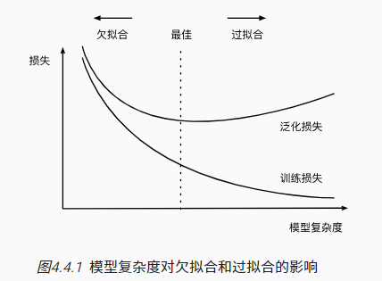

另一个重要因素是数据集的大小。 训练数据集中的样本越少，我们就越有可能（且更严重地）过拟合

#### 4.4.4. 多项式回归

使用下面这个公式来生成数据

$$y = 5 + 1.2x - 3.4\frac{x^2}{2!} + 5.6 \frac{x^3}{3!} + \epsilon \text{ where }\epsilon \sim \mathcal{N}(0, 0.1^2).$$

因为如果 x 的指数很大，会造成这个数很大，所以从$x^i$调整为$\frac{x^i}{i!}$

生成数据时，用到了 gamma 函数做重新缩放，其中$\Gamma(n)=(n-1)!$。

```python
import math
import numpy as np
import torch
from torch import nn
from d2l import torch as d2l

'''生成数据'''
max_degree = 20  # 多项式的最大阶数
n_train, n_test = 100, 100  # 训练和测试数据集大小
true_w = np.zeros(max_degree)  # 分配大量的空间
true_w[0:4] = np.array([5, 1.2, -3.4, 5.6])

features = np.random.normal(size=(n_train + n_test, 1))  # 表示x输入
np.random.shuffle(features)
poly_features = np.power(features, np.arange(max_degree).reshape(1, -1))  #表示x的不同阶层的向量
for i in range(max_degree):
    poly_features[:, i] /= math.gamma(i + 1)  # gamma(n)=(n-1)!
# labels的维度:(n_train+n_test,)
labels = np.dot(poly_features, true_w)
labels += np.random.normal(scale=0.1, size=labels.shape) #表示最终结果y

true_w, features, poly_features, labels = [torch.tensor(x, dtype=torch.float32) for x in [true_w, features, poly_features, labels]]

features[:2], poly_features[:2, :], labels[:2]
(tensor([[ 1.6580],
         [-1.6392]]),
 tensor([[ 1.0000e+00,  1.6580e+00,  1.3745e+00,  7.5967e-01,  3.1489e-01,
           1.0442e-01,  2.8855e-02,  6.8346e-03,  1.4165e-03,  2.6096e-04,
           4.3267e-05,  6.5217e-06,  9.0110e-07,  1.1493e-07,  1.3611e-08,
           1.5045e-09,  1.5590e-10,  1.5206e-11,  1.4006e-12,  1.2223e-13],
         [ 1.0000e+00, -1.6392e+00,  1.3435e+00, -7.3408e-01,  3.0082e-01,
          -9.8622e-02,  2.6944e-02, -6.3094e-03,  1.2928e-03, -2.3546e-04,
           3.8597e-05, -5.7516e-06,  7.8567e-07, -9.9066e-08,  1.1599e-08,
          -1.2676e-09,  1.2986e-10, -1.2522e-11,  1.1403e-12, -9.8378e-14]]),
 tensor([ 6.6262, -5.4505]))


 '''评估损失'''
 # 就是y均方差的和/y的个数
 def evaluate_loss(net, data_iter, loss):  #@save
    """评估给定数据集上模型的损失"""
    metric = d2l.Accumulator(2)  # 损失的总和,样本数量
    for X, y in data_iter:
        out = net(X)
        y = y.reshape(out.shape)
        l = loss(out, y)
        metric.add(l.sum(), l.numel())
    return metric[0] / metric[1]

'''训练'''
def train(train_features, test_features, train_labels, test_labels,
          num_epochs=400):
    loss = nn.MSELoss(reduction='none')
    input_shape = train_features.shape[-1]
    # 不设置偏置，因为我们已经在多项式中实现了它
    net = nn.Sequential(nn.Linear(input_shape, 1, bias=False))
    batch_size = min(10, train_labels.shape[0])
    train_iter = d2l.load_array((train_features, train_labels.reshape(-1,1)),batch_size)
    test_iter = d2l.load_array((test_features, test_labels.reshape(-1,1)),batch_size, is_train=False)
    trainer = torch.optim.SGD(net.parameters(), lr=0.01)
    animator = d2l.Animator(xlabel='epoch', ylabel='loss', yscale='log',xlim=[1, num_epochs], ylim=[1e-3, 1e2],
                            legend=['train', 'test'])
    for epoch in range(num_epochs):
        d2l.train_epoch_ch3(net, train_iter, loss, trainer)
        if epoch == 0 or (epoch + 1) % 20 == 0:
            animator.add(epoch + 1, (evaluate_loss(net, train_iter, loss),
                                     evaluate_loss(net, test_iter, loss)))
    print('weight:', net[0].weight.data.numpy())

'''三阶多项式函数拟合(正常)'''
train(poly_features[:n_train, :4], poly_features[n_train:, :4],labels[:n_train], labels[n_train:])

'''线性函数拟合(欠拟合'''
# 从多项式特征中选择前2个维度，即1和x
train(poly_features[:n_train, :2], poly_features[n_train:, :2],labels[:n_train], labels[n_train:])

'''高阶多项式函数拟合(过拟合)'''
# 从多项式特征中选取所有维度
train(poly_features[:n_train, :], poly_features[n_train:, :],labels[:n_train], labels[n_train:], num_epochs=1500)
```

相当于原始是 3 阶式子，用三阶去训练参数，得到的当然最好，如果指用 2 阶就太简单，用 20 阶就过拟合

正常

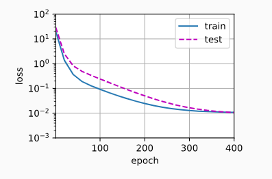

欠拟合

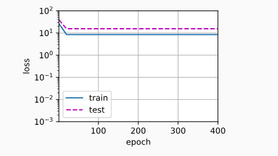

过拟合

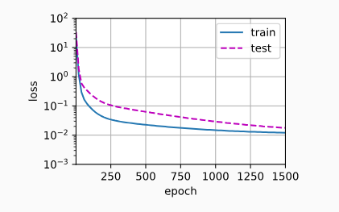

### 4.5. 权重衰减

如果有 k 个变量，总共有 d 个阶数，则有$C^{k-1}_{k-1+d} = \frac{(k-1+d)!}{(d)!(k-1)!}$种组合，比如 d=3,k=5。那么$x_1^2 x_2$和$x_3
x_5^2$都是一种组合。所以对于过拟合，简单的减少 x 的数目 k 并不是最好的办法，因为 d 的影响也很大

**权重衰减**（weight decay）是最广泛使用的正则化的技术之一，它通常也被称为$L_2$**正则化**。

线性回归本来的损失函数如下

$$L(\mathbf{w}, b) = \frac{1}{n}\sum_{i=1}^n \frac{1}{2}\left(\mathbf{w}^\top \mathbf{x}^{(i)} + b - y^{(i)}\right)^2.$$

现在再加上一个$L_2$范数做惩罚

$$L(\mathbf{w}, b) + \frac{\lambda}{2} \|\mathbf{w}\|^2,$$

所以更新系数的公式变成如下，对于 1 阶系数$w_0$ 不做惩罚

${\theta_0}:={\theta_0}-a\frac{1}{m}\sum\limits_{i=1}^{m}{(({h_\theta}({{x}^{(i)}})-{{y}^{(i)}})x_{0}^{(i)}})$

${\theta_j}:
={\theta_j}-a[\frac{1}{m}\sum\limits_{i=1}^{m}{(({h_\theta}({{x}^{(i)}})-{{y}^{(i)}})x_{j}^{\left( i \right)}}+\frac{\lambda }{m}{\theta_j}]
$

$for$ $j=1,2,...n$

**就是让高阶的系数不要沿梯度方向变化太大**

#### 4.5.1. 从零开始代码实现

数据生成公式

$$y = 0.05 + \sum_{i = 1}^d 0.01 x_i + \epsilon \text{ where }\epsilon \sim \mathcal{N}(0, 0.01^2).$$

将问题的维数增加到 d=200， 并使用一个只包含 20 个样本的小训练集

```python
%matplotlib inline
import torch
from torch import nn
from d2l import torch as d2l

'''1 数据生成'''
n_train, n_test, num_inputs, batch_size = 20, 100, 200, 5
true_w, true_b = torch.ones((num_inputs, 1)) * 0.01, 0.05
train_data = d2l.synthetic_data(true_w, true_b, n_train)
train_iter = d2l.load_array(train_data, batch_size)
test_data = d2l.synthetic_data(true_w, true_b, n_test)
test_iter = d2l.load_array(test_data, batch_size, is_train=False)


'''2 初始化模型参数'''
def init_params():
    w = torch.normal(0, 1, size=(num_inputs, 1), requires_grad=True)
    b = torch.zeros(1, requires_grad=True)
    return [w, b]

'''3 定义L2范数惩罚'''
def l2_penalty(w):
    return torch.sum(w.pow(2)) / 2

'''4 定义训练代码'''
def train(lambd):
    w, b = init_params()
    net, loss = lambda X: d2l.linreg(X, w, b), d2l.squared_loss
    num_epochs, lr = 100, 0.003
    animator = d2l.Animator(xlabel='epochs', ylabel='loss', yscale='log',
                            xlim=[5, num_epochs], legend=['train', 'test'])
    for epoch in range(num_epochs):
        for X, y in train_iter:
            # 增加了L2范数惩罚项，
            # 广播机制使l2_penalty(w)成为一个长度为batch_size的向量
            l = loss(net(X), y) + lambd * l2_penalty(w)
            l.sum().backward()
            d2l.sgd([w, b], lr, batch_size)
        if (epoch + 1) % 5 == 0:
            animator.add(epoch + 1, (d2l.evaluate_loss(net, train_iter, loss),
                                     d2l.evaluate_loss(net, test_iter, loss)))
    print('w的L2范数是：', torch.norm(w).item())

train(lambd=0) #结果如图1
train(lambd=2) #结果如图2
```

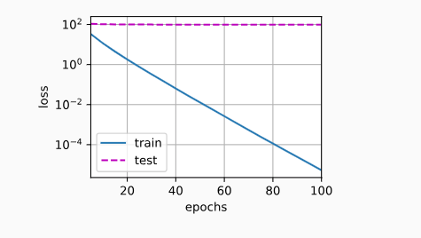

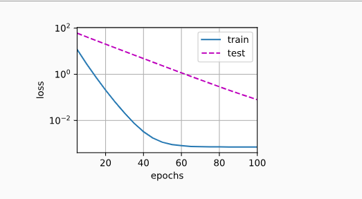

#### 4.5.2 简洁实现

在实例化优化器时直接通过`weight_decay`指定 weight decay 超参数。 默认情况下，PyTorch 同时衰减权重和偏移。 这里我们只为权重设置了`weight_decay`，所以偏置参数 b 不会衰减

```python
def train_concise(wd):
    net = nn.Sequential(nn.Linear(num_inputs, 1))
    for param in net.parameters():
        param.data.normal_()
    loss = nn.MSELoss(reduction='none')
    num_epochs, lr = 100, 0.003
    # 偏置参数没有衰减
    trainer = torch.optim.SGD([
        {"params":net[0].weight,'weight_decay': wd},
        {"params":net[0].bias}], lr=lr)
    animator = d2l.Animator(xlabel='epochs', ylabel='loss', yscale='log',
                            xlim=[5, num_epochs], legend=['train', 'test'])
    for epoch in range(num_epochs):
        for X, y in train_iter:
            trainer.zero_grad()
            l = loss(net(X), y)
            l.mean().backward()
            trainer.step()
        if (epoch + 1) % 5 == 0:
            animator.add(epoch + 1,
                         (d2l.evaluate_loss(net, train_iter, loss),
                          d2l.evaluate_loss(net, test_iter, loss)))
    print('w的L2范数：', net[0].weight.norm().item())
```

### 4.6 暂退法（Dropout）

之前都假设了权重的值取自均值为 0 的高斯分布，但事实上权重可能互相关联

#### 4.6.1. 重新审视过拟合

特征太多而样本太少 - 过拟合

泛化性和灵活性之间的这种基本权衡被描述为*偏差-方差权衡*（bias-variance tradeoff）。 线性模型有很高的偏差：它们只能表示一小类函数。 然而，这些模型的方差很低：它们在不同的随机数据样本上可以得出相似的结果。

深度神经网络位于偏差-方差谱的另一端。有很低的偏差但是方差很大，就是容易过拟合

#### 4.6.2. 扰动的稳健性

好的模型特点

1. 泛化，训练和测试性能差距小
2. 平滑，允许输入微小的变化

**暂退法**在前向传播过程中，计算每一内部层的同时注入噪声

噪音注入的方法，以一种*无偏向*（unbiased）的方式注入噪声

1. 在每次训练迭代中，他将从均值为零的分布$\epsilon \sim \mathcal{N}(0,\sigma^2)$ 采样噪声添加到输入$\mathbf{x}$，从而产生扰动点$\mathbf{x}' = \mathbf{x} + \epsilon$，预期是$E[\mathbf{x}'] = \mathbf{x}$。

2. 在标准暂退法正则化中，通过按保留（未丢弃）的节点的分数进行规范化来消除每一层的偏差。就是随机去掉一些中间节点

   换言之，每个中间活性值$h$以**暂退概率**$p$由随机变量$h'$替换，如下所示：

$$
\begin{aligned}

h' =

\begin{cases}

  0 & \text{ 概率为 } p \\

  \frac{h}{1-p} & \text{ 其他情况}

\end{cases}

\end{aligned} $$

​ 根据此模型的设计，其期望值保持不变，即$E[h'] = h$。

#### 4.6.3. 实践中的暂退法

就是退掉几个中间层

#### 4.6.4. 从零开始实现

要实现单层的暂退法函数， 我们从均匀分布 U[0,1]中抽取样本，样本数与这层神经网络的维度一致。 然后我们保留那些对应样本大于 p 的节点，把剩下的丢弃。

在下面的代码中，我们实现 `dropout_layer` 函数， 该函数以`dropout`的概率丢弃张量输入`X`中的元素， 如上所述重新缩放剩余部分：将剩余部分除以`1.0-dropout`

```python
import torch
from torch import nn
from d2l import torch as d2l


def dropout_layer(X, dropout):
    assert 0 <= dropout <= 1
    # 在本情况中，所有元素都被丢弃
    if dropout == 1:
        return torch.zeros_like(X)
    # 在本情况中，所有元素都被保留
    if dropout == 0:
        return X
    mask = (torch.rand(X.shape) > dropout).float()
    return mask * X / (1.0 - dropout)

X= torch.arange(16, dtype = torch.float32).reshape((2, 8))
print(X)
tensor([[ 0.,  1.,  2.,  3.,  4.,  5.,  6.,  7.],
        [ 8.,  9., 10., 11., 12., 13., 14., 15.]])
print(dropout_layer(X, 0.))
tensor([[ 0.,  1.,  2.,  3.,  4.,  5.,  6.,  7.],
        [ 8.,  9., 10., 11., 12., 13., 14., 15.]])
print(dropout_layer(X, 0.5))
tensor([[ 0.,  2.,  0.,  6.,  0.,  0.,  0., 14.],
        [16., 18.,  0., 22.,  0., 26., 28., 30.]])
print(dropout_layer(X, 1.))
tensor([[0., 0., 0., 0., 0., 0., 0., 0.],
        [0., 0., 0., 0., 0., 0., 0., 0.]])

'''1. 定义模型参数'''
'''引入Fashion-MNIST数据集'''
num_inputs, num_outputs, num_hiddens1, num_hiddens2 = 784, 10, 256, 256

'''2. 定义模型'''
dropout1, dropout2 = 0.2, 0.5
class Net(nn.Module):
    def __init__(self, num_inputs, num_outputs, num_hiddens1, num_hiddens2,
                 is_training = True):
        super(Net, self).__init__()
        self.num_inputs = num_inputs
        self.training = is_training
        self.lin1 = nn.Linear(num_inputs, num_hiddens1)
        self.lin2 = nn.Linear(num_hiddens1, num_hiddens2)
        self.lin3 = nn.Linear(num_hiddens2, num_outputs)
        self.relu = nn.ReLU()

    def forward(self, X):
        H1 = self.relu(self.lin1(X.reshape((-1, self.num_inputs))))
        # 只有在训练模型时才使用dropout
        if self.training == True:
            # 在第一个全连接层之后添加一个dropout层
            H1 = dropout_layer(H1, dropout1)
        H2 = self.relu(self.lin2(H1))
        if self.training == True:
            # 在第二个全连接层之后添加一个dropout层
            H2 = dropout_layer(H2, dropout2)
        out = self.lin3(H2)
        return out

net = Net(num_inputs, num_outputs, num_hiddens1, num_hiddens2)

'''3. 训练'''
num_epochs, lr, batch_size = 10, 0.5, 256
loss = nn.CrossEntropyLoss(reduction='none')
train_iter, test_iter = d2l.load_data_fashion_mnist(batch_size)
trainer = torch.optim.SGD(net.parameters(), lr=lr)
d2l.train_ch3(net, train_iter, test_iter, loss, num_epochs, trainer)
```

#### 4.6.5. 简洁实现

```python
net = nn.Sequential(nn.Flatten(),
        nn.Linear(784, 256),
        nn.ReLU(),
        # 在第一个全连接层之后添加一个dropout层
        nn.Dropout(dropout1),
        nn.Linear(256, 256),
        nn.ReLU(),
        # 在第二个全连接层之后添加一个dropout层
        nn.Dropout(dropout2),
        nn.Linear(256, 10))

def init_weights(m):
    if type(m) == nn.Linear:
        nn.init.normal_(m.weight, std=0.01)

net.apply(init_weights);

trainer = torch.optim.SGD(net.parameters(), lr=lr)
d2l.train_ch3(net, train_iter, test_iter, loss, num_epochs, trainer)
```

### 4.7. 前向传播、反向传播和计算图

这章内容其他地方都讲过

### 4.8. 数值稳定性和模型初始化

初始化方案的选择在神经网络学习中起着举足轻重的作用， 它对保持数值稳定性至关重要。

此外，这些初始化方案的选择可以与非线性激活函数的选择有趣的结合在一起。

我们选择哪个函数以及如何初始化参数可以决定优化算法收敛的速度有多快。 糟糕选择可能会导致我们在训练时遇到梯度爆炸或梯度消失

#### 4.8.1. 梯度消失和梯度爆炸

考虑一个具有$L$层、输入$\mathbf{x}$和输出$\mathbf{o}$的深层网络。每一层$l$由变换$f_l$定义，该变换的参数为权重$\mathbf{W}^{(l)}$，其隐藏变量是$\mathbf{h}^{(l)}$（令 $\mathbf{h}^{(0)} = \mathbf{x}$）。

我们的网络可以表示为：

$$\mathbf{h}^{(l)} = f_l (\mathbf{h}^{(l-1)}) \text{ 因此 } \mathbf{o} = f_L \circ \ldots \circ f_1(\mathbf{x}).$$

如果所有隐藏变量和输入都是向量，我们可以将$\mathbf{o}$关于任何一组参数$\mathbf{W}^{(l)}$的梯度写为下式：

$$\partial_{\mathbf{W}^{(l)}} \mathbf{o} = \underbrace{\partial_{\mathbf{h}^{(L-1)}} \mathbf{h}^{(L)}}_{ \mathbf{M}^{(L)} \stackrel{\mathrm{def}}{=}} \cdot \ldots \cdot \underbrace{\partial_{\mathbf{h}^{(l)}} \mathbf{h}^{(l+1)}}_{ \mathbf{M}^{(l+1)} \stackrel{\mathrm{def}}{=}} \underbrace{\partial_{\mathbf{W}^{(l)}} \mathbf{h}^{(l)}}_{ \mathbf{v}^{(l)} \stackrel{\mathrm{def}}{=}}.$$

换言之，该梯度是$L-l$个矩阵$\mathbf{M}^{(L)} \cdot \ldots \cdot \mathbf{M}^{(l+1)}$与梯度向量 $\mathbf{v}^{(l)}$的乘积。

梯*度爆炸*（gradient exploding）问题： 参数更新过大，破坏了模型的稳定收敛

_梯度消失_（gradient vanishing）问题： 参数更新过小，在每次更新时几乎不会移动，导致模型无法学习

##### 4.8.1.1. 梯度消失

sigmoid 函数会导致梯度消失

```python
%matplotlib inline
import torch
from d2l import torch as d2l

x = torch.arange(-8.0, 8.0, 0.1, requires_grad=True)
y = torch.sigmoid(x)
y.backward(torch.ones_like(x))

d2l.plot(x.detach().numpy(), [y.detach().numpy(), x.grad.numpy()],
         legend=['sigmoid', 'gradient'], figsize=(4.5, 2.5))
```

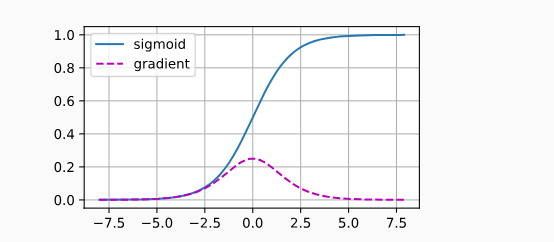

gradient 表示求导后的梯度，当 sigmoid 函数的输入很大或是很小时，它的梯度都会消失

##### 4.8.1.2. 梯度爆炸

生成 100 个高斯随机矩阵，并将它们与某个初始矩阵相乘。对于我们选择的尺度（方差$\sigma^2=1$），矩阵乘积发生爆炸

```python
M = torch.normal(0, 1, size=(4,4))
print('一个矩阵 \n',M)
tensor([[-0.7872,  2.7090,  0.5996, -1.3191],
        [-1.8260, -0.7130, -0.5521,  0.1051],
        [ 1.1213,  1.0472, -0.3991, -0.3802],
        [ 0.5552,  0.4517, -0.3218,  0.5214]])
for i in range(100):
    M = torch.mm(M,torch.normal(0, 1, size=(4, 4)))

print('乘以100个矩阵后\n', M)
tensor([[-2.1897e+26,  8.8308e+26,  1.9813e+26,  1.7019e+26],
        [ 1.3110e+26, -5.2870e+26, -1.1862e+26, -1.0189e+26],
        [-1.6008e+26,  6.4559e+26,  1.4485e+26,  1.2442e+26],
        [ 3.0943e+25, -1.2479e+26, -2.7998e+25, -2.4050e+25]])

```

##### 4.8.1.3. 打破对称性

神经网络设计中的另一个问题是其参数化所固有的对称性。 假设我们有一个简单的多层感知机，它有一个隐藏层和两个隐藏单元

那么这两个隐藏单元的系数没什么区别，可以互换

假设输出层将上述两个隐藏单元的多层感知机转换为仅一个输出单元。

想象一下，如果我们将隐藏层的所有参数初始化为$\mathbf{W}^{(1)} = c$，$c$为常量，会发生什么？　－　所有隐藏层单元都一模一样，好像只有一个单元

#### 4.8.2. 参数初始化

解决以上问题需要参数正确初始化

##### 4.8.2.1. 默认初始化

使用正态分布来初始化权重值。如果我们不指定初始化方法， 框架将使用默认的随机初始化方法，对于中等难度的问题，这种方法通常很有效。

### 4.8.2.2. Xavier 初始化

让我们看看某些**没有非线性**的全连接层输出（例如，隐藏变量）$o_{i}$的尺度分布。对于该层$n_\mathrm{in}$输入$x_j$及其相关权重$w_{ij}$，输出由下式给出

$$o_{i} = \sum_{j=1}^{n_\mathrm{in}} w_{ij} x_j.$$

权重$w_{ij}$都是从同一分布中独立抽取的。此外，让我们假设该分布具有零均值和方差$\sigma^2$。请注意，这并不意味着分布必须是高斯的，只是均值和方差需要存在。

现在，让我们假设层$x_j$的输入也具有零均值和方差$\gamma^2$，并且它们独立于$w_{ij}$并且彼此独立。

在这种情况下，我们可以按如下方式计算$o_i$的平均值和方差：

$$
\begin{aligned}

  E[o_i] & = \sum_{j=1}^{n_\mathrm{in}} E[w_{ij} x_j] \\&= \sum_{j=1}^{n_\mathrm{in}} E[w_{ij}] E[x_j] \\&= 0, \\

  \mathrm{Var}[o_i] & = E[o_i^2] - (E[o_i])^2 \\

​    & = \sum_{j=1}^{n_\mathrm{in}} E[w^2_{ij} x^2_j] - 0 \\

​    & = \sum_{j=1}^{n_\mathrm{in}} E[w^2_{ij}] E[x^2_j] \\

​    & = n_\mathrm{in} \sigma^2 \gamma^2.

\end{aligned}
$$

保持方差不变的一种方法是设置$n_\mathrm{in} \sigma^2 = 1$。

现在考虑反向传播过程，我们面临着类似的问题，尽管梯度是从更靠近输出的层传播的。

使用与前向传播相同的推断，我们可以看到，除非$n_\mathrm{out} \sigma^2 = 1$，否则梯度的方差可能会增大，其中$n_\mathrm{out}$是该层的输出的数量。这使得我们进退两难：我们不可能同时满足这两个条件。

相反，我们只需满足：

$$
\begin{aligned}

\frac{1}{2} (n_\mathrm{in} + n_\mathrm{out}) \sigma^2 = 1 \text{ 或等价于 }

\sigma = \sqrt{\frac{2}{n_\mathrm{in} + n_\mathrm{out}}}.

\end{aligned} $$

这就是现在标准且实用的**Xavier 初始化**的基础，

通常，Xavier 初始化从均值为零，方差$\sigma^2 = \frac{2}{n_\mathrm{in} + n_\mathrm{out}}$的高斯分布中采样权重。我们也可以利用 Xavier
的直觉来选择从均匀分布中抽取权重时的方差。注意均匀分布$U(-a, a)$的方差为$\frac{a^2}{3}$。将$\frac{a^2}{3}$代入到$\sigma^2$的条件中，将得到初始化值域：

$$U\left(-\sqrt{\frac{6}{n_\mathrm{in} + n_\mathrm{out}}}, \sqrt{\frac{6}{n_\mathrm{in} + n_\mathrm{out}}}\right).$$

## 5. 深度学习计算

### 5.1. 层和块

块由*类*（class）表示。 它的任何子类都必须定义一个将其输入转换为输出的前向传播函数， 并且必须存储任何必需的参数。

有些块不需要任何参数。

为了计算梯度，块必须具有反向传播函数。

下面的代码生成一个网络，其中包含一个具有 256 个单元和 ReLU 激活函数的全连接隐藏层， 然后是一个具有 10 个隐藏单元且不带激活函数的全连接输出层

```python
import torch
from torch import nn
from torch.nn import functional as F

net = nn.Sequential(nn.Linear(20, 256), nn.ReLU(), nn.Linear(256, 10))

X = torch.rand(2, 20)
net(X)
#tensor([[ 0.0343,  0.0264,  0.2505, -0.0243,  0.0945,  0.0012, -0.0141,  0.0666,
#         -0.0547, -0.0667],
#        [ 0.0772, -0.0274,  0.2638, -0.0191,  0.0394, -0.0324,  0.0102,  0.0707,
#         -0.1481, -0.1031]], grad_fn=<AddmmBackward0>)

```

`nn.Sequential`定义了一种特殊的`Module`， 即在 PyTorch 中表示一个块的类， 它维护了一个由`Module`组成的有序列表。 注意，两个全连接层都是`Linear`类的实例， `Linear`
类本身就是`Module`的子类。

我们一直在通过`net(X)`调用我们的模型来获得模型的输出。 这实际上是`net.__call__(X)`的简写

#### 5.1.1. 自定义块

```python
class MLP(nn.Module):
    # 用模型参数声明层。这里，我们声明两个全连接的层
    def __init__(self):
        # 调用MLP的父类Module的构造函数来执行必要的初始化。
        # 这样，在类实例化时也可以指定其他函数参数，例如模型参数params（稍后将介绍）
        super().__init__()
        self.hidden = nn.Linear(20, 256)  # 隐藏层
        self.out = nn.Linear(256, 10)  # 输出层

    # 定义模型的前向传播，即如何根据输入X返回所需的模型输出
    def forward(self, X):
        # 注意，这里我们使用ReLU的函数版本，其在nn.functional模块中定义。
        return self.out(F.relu(self.hidden(X)))

net = MLP()
net(X)
```

除非我们实现一个新的运算符， 否则我们不必担心反向传播函数或参数初始化， 系统将自动生成这些

#### 5.1.2. 顺序块

系统的`Sequential`类是如何工作的

```python
class MySequential(nn.Module):
    def __init__(self, *args):
        super().__init__()
        for idx, module in enumerate(args):
            # 这里，module是Module子类的一个实例。我们把它保存在'Module'类的成员
            # 变量_modules中。_module的类型是OrderedDict
            self._modules[str(idx)] = module

    def forward(self, X):
        # OrderedDict保证了按照成员添加的顺序遍历它们
        for block in self._modules.values():
            X = block(X)
        return X

net = MySequential(nn.Linear(20, 256), nn.ReLU(), nn.Linear(256, 10))
net(X)
```

#### 5.1.3. 在前向传播函数中执行代码

我们可能希望合并既不是上一层的结果也不是可更新参数的项，我们称之为**常数参数**（constant parameter）。

例如，我们需要一个计算函数$f(\mathbf{x},\mathbf{w}) = c \cdot \mathbf{w}^\top \mathbf{x}$的层，

其中$\mathbf{x}$是输入，$\mathbf{w}$是参数，$c$是某个在优化过程中没有更新的指定常量。

因此我们实现了一个`FixedHiddenMLP`类

```python
class FixedHiddenMLP(nn.Module):
    def __init__(self):
        super().__init__()
        # 不计算梯度的随机权重参数。因此其在训练期间保持不变
        self.rand_weight = torch.rand((20, 20), requires_grad=False)
        self.linear = nn.Linear(20, 20)

    def forward(self, X):
        X = self.linear(X)
        # 使用创建的常量参数以及relu和mm函数
        X = F.relu(torch.mm(X, self.rand_weight) + 1)
        # 复用全连接层。这相当于两个全连接层共享参数
        X = self.linear(X)
        # 控制流
        while X.abs().sum() > 1:
            X /= 2
        return X.sum()

net = FixedHiddenMLP()
net(X)

'''嵌套多个'''
class NestMLP(nn.Module):
    def __init__(self):
        super().__init__()
        self.net = nn.Sequential(nn.Linear(20, 64), nn.ReLU(),
                                 nn.Linear(64, 32), nn.ReLU())
        self.linear = nn.Linear(32, 16)

    def forward(self, X):
        return self.linear(self.net(X))

chimera = nn.Sequential(NestMLP(), nn.Linear(16, 20), FixedHiddenMLP())
chimera(X)
```

### 5.2. 参数管理

本章讲以下内容

- 访问参数，用于调试、诊断和可视化；
- 参数初始化；
- 在不同模型组件间共享参数。

```python
import torch
from torch import nn

net = nn.Sequential(nn.Linear(4, 8), nn.ReLU(), nn.Linear(8, 1))
X = torch.rand(size=(2, 4))
net(X)

'''5.2.1. 参数访问'''
print(net[2].state_dict())
# OrderedDict([('weight', tensor([[-0.0427, -0.2939, -0.1894,  0.0220, -0.1709, -0.1522, -0.0334, -0.2263]])), ('bias', tensor([0.0887]))])
'''5.2.1.1. 目标参数'''
print(type(net[2].bias))
print(net[2].bias)
print(net[2].bias.data)
#<class 'torch.nn.parameter.Parameter'>
#Parameter containing:
#tensor([0.0887], requires_grad=True)
#tensor([0.0887])
net[2].weight.grad == None
'''5.2.1.2. 一次性访问所有参数'''
print(*[(name, param.shape) for name, param in net[0].named_parameters()])
print(*[(name, param.shape) for name, param in net.named_parameters()])
#('weight', torch.Size([8, 4])) ('bias', torch.Size([8]))
#('0.weight', torch.Size([8, 4])) ('0.bias', torch.Size([8])) ('2.weight', torch.Size([1, 8])) ('2.bias', torch.Size([1]))
net.state_dict()['2.bias'].data

'''5.2.1.3. 从嵌套块收集参数'''
def block1():
    return nn.Sequential(nn.Linear(4, 8), nn.ReLU(),
                         nn.Linear(8, 4), nn.ReLU())

def block2():
    net = nn.Sequential()
    for i in range(4):
        # 在这里嵌套
        net.add_module(f'block {i}', block1())
    return net

rgnet = nn.Sequential(block2(), nn.Linear(4, 1))
rgnet(X)
print(rgnet)

Sequential(
  (0): Sequential(
    (block 0): Sequential(
      (0): Linear(in_features=4, out_features=8, bias=True)
      (1): ReLU()
      (2): Linear(in_features=8, out_features=4, bias=True)
      (3): ReLU()
    )
    (block 1): Sequential(
      (0): Linear(in_features=4, out_features=8, bias=True)
      (1): ReLU()
      (2): Linear(in_features=8, out_features=4, bias=True)
      (3): ReLU()
    )
    (block 2): Sequential(
      (0): Linear(in_features=4, out_features=8, bias=True)
      (1): ReLU()
      (2): Linear(in_features=8, out_features=4, bias=True)
      (3): ReLU()
    )
    (block 3): Sequential(
      (0): Linear(in_features=4, out_features=8, bias=True)
      (1): ReLU()
      (2): Linear(in_features=8, out_features=4, bias=True)
      (3): ReLU()
    )
  )
  (1): Linear(in_features=4, out_features=1, bias=True)
)
rgnet[0][1][0].bias.data

'''5.2.2. 参数初始化'''
'''默认情况下，PyTorch会根据一个范围均匀地初始化权重和偏置矩阵， 这个范围是根据输入和输出维度计算出的。 PyTorch的nn.init模块提供了多种预置初始化方法'''
def init_normal(m):
    if type(m) == nn.Linear:
        nn.init.normal_(m.weight, mean=0, std=0.01) #权重初始化为高斯随机变量
        nn.init.zeros_(m.bias)
net.apply(init_normal)
net[0].weight.data[0], net[0].bias.data[0]

def init_constant(m):
    if type(m) == nn.Linear:
        nn.init.constant_(m.weight, 1)	# 固定值1
        nn.init.zeros_(m.bias)
net.apply(init_constant)
net[0].weight.data[0], net[0].bias.data[0]


def init_xavier(m):
    if type(m) == nn.Linear:
        nn.init.xavier_uniform_(m.weight)
def init_42(m):
    if type(m) == nn.Linear:
        nn.init.constant_(m.weight, 42)

net[0].apply(init_xavier)
net[2].apply(init_42)
print(net[0].weight.data[0])
print(net[2].weight.data)

'''5.2.2.2. 自定义初始化'''
def my_init(m):
    if type(m) == nn.Linear:
        print("Init", *[(name, param.shape)
                        for name, param in m.named_parameters()][0])
        nn.init.uniform_(m.weight, -10, 10)
        m.weight.data *= m.weight.data.abs() >= 5

net.apply(my_init)
net[0].weight[:2]

'''5.2.3. 参数绑定'''
# 我们需要给共享层一个名称，以便可以引用它的参数
shared = nn.Linear(8, 8)
net = nn.Sequential(nn.Linear(4, 8), nn.ReLU(),
                    shared, nn.ReLU(),
                    shared, nn.ReLU(),
                    nn.Linear(8, 1))
net(X)
# 检查参数是否相同
print(net[2].weight.data[0] == net[4].weight.data[0])
net[2].weight.data[0, 0] = 100
# 确保它们实际上是同一个对象，而不只是有相同的值
print(net[2].weight.data[0] == net[4].weight.data[0])
```

### 5.3. 延后初始化

pytorch 使用 nn.LazyLinear 做延后初始化，但是 PyTorch 的这个功能正处于开发阶段。书里没讲

### 5.4. 自定义层

#### 5.4.1. 不带参数的层

```python
import torch
import torch.nn.functional as F
from torch import nn

# 输出 = 输入 - 均值
class CenteredLayer(nn.Module):
    def __init__(self):
        super().__init__()

    def forward(self, X):
        return X - X.mean()

layer = CenteredLayer()
layer(torch.FloatTensor([1, 2, 3, 4, 5]))
# tensor([-2., -1.,  0.,  1.,  2.])

net = nn.Sequential(nn.Linear(8, 128), CenteredLayer())
```

#### 5.4.2. 带参数的层

使用修正线性单元作为激活函数。 该层需要输入参数：`in_units`和`units`，分别表示输入数和输出数。

```python
class MyLinear(nn.Module):
    def __init__(self, in_units, units):
        super().__init__()
        self.weight = nn.Parameter(torch.randn(in_units, units))
        self.bias = nn.Parameter(torch.randn(units,))
    def forward(self, X):
        linear = torch.matmul(X, self.weight.data) + self.bias.data
        return F.relu(linear)

linear = MyLinear(5, 3)
linear.weight

Parameter containing:
tensor([[ 0.1775, -1.4539,  0.3972],
        [-0.1339,  0.5273,  1.3041],
        [-0.3327, -0.2337, -0.6334],
        [ 1.2076, -0.3937,  0.6851],
        [-0.4716,  0.0894, -0.9195]], requires_grad=True)
```

### 5.5. 读写文件

加载和存储权重向量和整个模型了

#### 5.5.1. 加载和保存张量

对于单个张量，我们可以直接调用`load`和`save`函数分别读写它们。 这两个函数都要求我们提供一个名称，`save`要求将要保存的变量作为输入。

```python
import torch
from torch import nn
from torch.nn import functional as F

x = torch.arange(4)
torch.save(x, 'x-file')

x2 = torch.load('x-file')

# 存储一个张量列表
y = torch.zeros(4)
torch.save([x, y],'x-files')
x2, y2 = torch.load('x-files')
(x2, y2)

# 字符串映射的字典
mydict = {'x': x, 'y': y}
torch.save(mydict, 'mydict')
mydict2 = torch.load('mydict')
mydict2
```

#### 5.5.2. 加载和保存模型参数

深度学习框架提供了内置函数来保存和加载整个网络。 **保存模型的参数而不是保存整个模型**。

恢复模型，我们需要用代码生成架构， 然后从磁盘加载参数

```python
class MLP(nn.Module):
    def __init__(self):
        super().__init__()
        self.hidden = nn.Linear(20, 256)
        self.output = nn.Linear(256, 10)

    def forward(self, x):
        return self.output(F.relu(self.hidden(x)))

net = MLP()
X = torch.randn(size=(2, 20))
Y = net(X)

#将模型的参数存储在一个叫做“mlp.params”的文件中
torch.save(net.state_dict(), 'mlp.params')

#恢复
clone = MLP()
clone.load_state_dict(torch.load('mlp.params'))
clone.eval()
```

### 5.6. GPU

#### 5.6.1. 计算设备

在 PyTorch 中，CPU 和 GPU 可以用`torch.device('cpu')` 和`torch.device('cuda')`表示。 应该注意的是，`cpu`设备意味着所有物理 CPU 和内存， 这意味着 PyTorch
的计算将尝试使用所有 CPU 核心。 然而，`gpu`设备只代表一个卡和相应的显存。 如果有多个 GPU，我们使用`torch.device(f'cuda:{i}')` 来表示第 i 块 GPU（i 从 0 开始）。 另外，`cuda:0`
和`cuda`是等价的

```python
import torch
from torch import nn

torch.device('cpu'), torch.device('cuda'), torch.device('cuda:1')
# (device(type='cpu'), device(type='cuda'), device(type='cuda', index=1))

torch.cuda.device_count()
# 2

def try_gpu(i=0):  #@save
    """如果存在，则返回gpu(i)，否则返回cpu()"""
    if torch.cuda.device_count() >= i + 1:
        return torch.device(f'cuda:{i}')
    return torch.device('cpu')

def try_all_gpus():  #@save
    """返回所有可用的GPU，如果没有GPU，则返回[cpu(),]"""
    devices = [torch.device(f'cuda:{i}')
             for i in range(torch.cuda.device_count())]
    return devices if devices else [torch.device('cpu')]

try_gpu(), try_gpu(10), try_all_gpus()
```

#### 5.6.2. 张量与 GPU

默认情况下，张量是在 CPU 上创建的

```python
x = torch.tensor([1, 2, 3])
x.device
# device(type='cpu')

'''5.6.2.1. 存储在GPU上'''
X = torch.ones(2, 3, device=try_gpu())

'''5.6.2.2. 复制'''
Z = X.cuda(1)	# 把X张量从GPU0移到GPU1

Y + Z
```

#### 5.6.3. 神经网络与 GPU

神经网络模型可以指定设备

```python
net = nn.Sequential(nn.Linear(3, 1))
net = net.to(device=try_gpu())
```

## 6. 卷积神经网络

### 6.1. 从全连接层到卷积

#### 6.1.1. 不变性

1. _平移不变性_（translation invariance）：不管检测对象出现在图像中的哪个位置，神经网络的前面几层应该对相同的图像区域具有相似的反应，即为“平移不变性”。
2. _局部性_（locality）：神经网络的前面几层应该只探索输入图像中的局部区域，而不过度在意图像中相隔较远区域的关系，这就是“局部性”原则。最终，可以聚合这些局部特征，以在整个图像级别进行预测。

#### 6.1.2. 多层感知机的限制

多层感知机的输入是二维图像$\mathbf{X}$，其隐藏表示$\mathbf{H}$在数学上是一个矩阵，在代码中表示为二维张量

使用$[\mathbf{X}]_{i, j}$**和**$[\mathbf{H}]_{i, j}$分别表示输入图像和隐藏表示中位置（$i$,$j$）处的像素

卷积范围限定在$|a|<=\Delta$或$|b|<=\Delta$的范围之之内

$$[\mathbf{H}]_{i, j} = u + \sum_{a = -\Delta}^{\Delta} \sum_{b = -\Delta}^{\Delta} [\mathbf{V}]_{a, b}  [\mathbf{X}]_{i+a, j+b}.$$

在深度学习研究社区中，$\mathbf{V}$被称为**卷积核**（convolution kernel）或者**滤波器**（filter），亦或简单地称之为该卷积层的**权重**，通常该权重是可学习的参数

#### 6.1.3. 卷积

在数学中，两个函数（比如$f, g: \mathbb{R}^d \to \mathbb{R}$）之间的“卷积”被定义为

$$(f * g)(\mathbf{x}) = \int f(\mathbf{z}) g(\mathbf{x}-\mathbf{z}) d\mathbf{z}.$$

也就是说，卷积是当把一个函数“翻转”并移位$\mathbf{x}$时，测量$f$和$g$之间的重叠。

当为离散对象时，积分就变成求和。例如，对于由索引为$\mathbb{Z}$的、平方可和的、无限维向量集合中抽取的向量，我们得到以下定义：

$$(f * g)(i) = \sum_a f(a) g(i-a).$$

对于二维张量，则为$f$的索引$(a, b)$和$g$的索引$(i-a, j-b)$上的对应加和：

$$(f * g)(i, j) = \sum_a\sum_b f(a, b) g(i-a, j-b).$$

因为有 RGB 3 个通道，所以上面还要加上通道这个维度

注意上面说的真正的卷积运算，包含了一个函数（或信号）通过另一个函数进行“翻转”和“滑动”的过程

1. **翻转（Flip）**：对于两个函数 f(t) 和 g(t)，在进行卷积之前，我们会先对其中一个函数（通常是 g(t)）进行时间轴上的翻转。也就是说，我们将 g(t) 替换为 g(−t)。这个操作在数学上被称为“翻转”。
2. **滑动（Slide）**：翻转之后，我们将翻转后的函数 g(−t) 沿着时间轴滑动，并且在每个位置上，计算 f(t) 和 g(−t+τ) 的乘积的积分（连续情况）或求和（离散情况）。这里的 τ
   表示滑动的量，也就是滑动过程中的时间偏移。这个操作在数学上被称为“滑动”或“卷积”。

### 6.2. 图像卷积

#### 6.2.1. 互相关运算

CNN 中的卷积不是真正的卷积，因为没有翻转和滑动的过程，直接对原数据进行操作。它所表达的运算其实是*互相关运算*（cross-correlation）

输入是高度为$3$、宽度为$3$的二维张量（即形状为$3 \times 3$）。卷积核的高度和宽度都是$2$，而卷积核窗口（或卷积窗口）的形状由内核的高度和宽度决定（即$2 \times 2$）

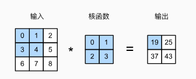

计算过程

$$
0\times0+1\times1+3\times2+4\times3=19,\\

1\times0+2\times1+4\times2+5\times3=25,\\

3\times0+4\times1+6\times2+7\times3=37,\\

4\times0+5\times1+7\times2+8\times3=43.
$$

输出大小等于输入大小$n_h \times n_w$减去卷积核大小$k_h \times k_w$，即：

$$(n_h-k_h+1) \times (n_w-k_w+1).$$

```python
mport torch
from torch import nn
from d2l import torch as d2l

def corr2d(X, K):  #@save
    """计算二维互相关运算"""
    h, w = K.shape
    Y = torch.zeros((X.shape[0] - h + 1, X.shape[1] - w + 1))
    for i in range(Y.shape[0]):
        for j in range(Y.shape[1]):
            Y[i, j] = (X[i:i + h, j:j + w] * K).sum()
    return Y

X = torch.tensor([[0.0, 1.0, 2.0], [3.0, 4.0, 5.0], [6.0, 7.0, 8.0]])	#输入
K = torch.tensor([[0.0, 1.0], [2.0, 3.0]])	#卷积核
corr2d(X, K)
```

#### 6.2.2. 卷积层

用类表示

```python
class Conv2D(nn.Module):
    def __init__(self, kernel_size):
        super().__init__()
        self.weight = nn.Parameter(torch.rand(kernel_size))
        self.bias = nn.Parameter(torch.zeros(1))

    def forward(self, x):
        return corr2d(x, self.weight) + self.bias
```

#### 6.2.3. 图像中目标的边缘检测

我们构造一个 6×8 像素的黑白图像。中间四列为黑色（0），其余像素为白色（1）

```python
X = torch.ones((6, 8))
X[:, 2:6] = 0
#tensor([[1., 1., 0., 0., 0., 0., 1., 1.],
#        [1., 1., 0., 0., 0., 0., 1., 1.],
#        [1., 1., 0., 0., 0., 0., 1., 1.],
#        [1., 1., 0., 0., 0., 0., 1., 1.],
#        [1., 1., 0., 0., 0., 0., 1., 1.],
#        [1., 1., 0., 0., 0., 0., 1., 1.]])

# 1x2的卷积核
K = torch.tensor([[1.0, -1.0]])

Y = corr2d(X, K)
#tensor([[ 0.,  1.,  0.,  0.,  0., -1.,  0.],
#        [ 0.,  1.,  0.,  0.,  0., -1.,  0.],
#        [ 0.,  1.,  0.,  0.,  0., -1.,  0.],
#        [ 0.,  1.,  0.,  0.,  0., -1.,  0.],
#        [ 0.,  1.,  0.,  0.,  0., -1.,  0.],
#        [ 0.,  1.,  0.,  0.,  0., -1.,  0.]])
```

#### 6.2.4. 学习卷积核

如何通过训练，学习卷积核

```python
# 构造一个二维卷积层，它具有1个输出通道和形状为（1，2）的卷积核
conv2d = nn.Conv2d(1,1, kernel_size=(1, 2), bias=False)

# 这个二维卷积层使用四维输入和输出格式（批量大小、通道、高度、宽度），
# 其中批量大小和通道数都为1
X = X.reshape((1, 1, 6, 8))
Y = Y.reshape((1, 1, 6, 7))
lr = 3e-2  # 学习率

for i in range(10):
    Y_hat = conv2d(X)
    l = (Y_hat - Y) ** 2
    conv2d.zero_grad()
    l.sum().backward()
    # 迭代卷积核
    conv2d.weight.data[:] -= lr * conv2d.weight.grad
    if (i + 1) % 2 == 0:
        print(f'epoch {i+1}, loss {l.sum():.3f}')
```

#### 6.2.6. 特征映射和感受野

卷积层有时被称为*特征映射*（feature map），因为它可以被视为一个输入映射到下一层的空间维度的转换器。

_感受野_（receptive field）是指在前向传播期间可能影响 x 计算的所有元素

### 6.3. 填充和步幅

原始图像的边界丢失了许多有用信息。而*填充*是解决此问题最有效的方法

我们可能希望大幅降低图像的宽度和高度。例如，如果我们发现原始的输入分辨率十分冗余。*步幅*则可以在这类情况下提供帮助

#### 6.3.1. 填充

将$3 \times 3$输入填充到$5 \times 5$，那么它的输出就增加为$4 \times 4$。阴影部分是第一个输出元素以及用于输出计算的输入和核张量元素：

$0\times0+0\times1+0\times2+0\times3=0$

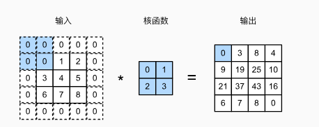

$p_h$行填充（大约一半在顶部，一半在底部）和$p_w$列填充（左侧大约一半，右侧一半），则输出形状将为

$$(n_h-k_h+p_h+1)\times(n_w-k_w+p_w+1)。$$

这意味着输出的高度和宽度将分别增加$p_h$和$p_w$。

在许多情况下，我们需要设置$p_h=k_h-1$和$p_w=k_w-1$，使输入和输出具有相同的高度和宽度

下面的代码输入 8x8，每边填充 1 行，输出也是 8x8

```python
import torch
from torch import nn


# 为了方便起见，我们定义了一个计算卷积层的函数。
# 此函数初始化卷积层权重，并对输入和输出提高和缩减相应的维数
def comp_conv2d(conv2d, X):
    # 这里的（1，1）表示批量大小和通道数都是1
    X = X.reshape((1, 1) + X.shape)
    Y = conv2d(X)
    # 省略前两个维度：批量大小和通道
    return Y.reshape(Y.shape[2:])

# 请注意，这里每边都填充了1行或1列，因此总共添加了2行或2列
conv2d = nn.Conv2d(1, 1, kernel_size=3, padding=1)
X = torch.rand(size=(8, 8))
comp_conv2d(conv2d, X).shape

# 宽高填充不同
conv2d = nn.Conv2d(1, 1, kernel_size=(5, 3), padding=(2, 1))
comp_conv2d(conv2d, X).shape
```

#### 6.3.2. 步幅

垂直步幅为$3$，水平步幅为$2$的二维互相关运算。

着色部分是输出元素以及用于输出计算的输入和内核张量元素：$0\times0+0\times1+1\times2+2\times3=8$、$0\times0+6\times1+0\times2+0\times3=6$。

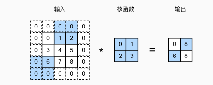

注意上图为了可以计算，在周围一圈加了 padding

当垂直步幅为$s_h$、水平步幅为$s_w$时，输出形状为

$$\lfloor(n_h-k_h+p_h+s_h)/s_h\rfloor \times \lfloor(n_w-k_w+p_w+s_w)/s_w\rfloor.$$

如果我们设置了$p_h=k_h-1$和$p_w=k_w-1$，则输出形状将简化为$\lfloor(n_h+s_h-1)/s_h\rfloor \times \lfloor(n_w+s_w-1)/s_w\rfloor$。

更进一步，如果输入的高度和宽度可以被垂直和水平步幅整除，则输出形状将为$(n_h/s_h) \times (n_w/s_w)$

```python
'''将高度和宽度的步幅设置为2，从而将输入的高度和宽度减半'''
conv2d = nn.Conv2d(1, 1, kernel_size=3, padding=1, stride=2)
comp_conv2d(conv2d, X).shape
```

### 6.4. 多输入多输出通道

#### 6.4.1. 多输入通道

多通道输入，最终将多个通道的结果相加，变成单通道输出

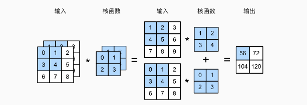

```python
import torch
from d2l import torch as d2l

def corr2d_multi_in(X, K):
    # 先遍历“X”和“K”的第0个维度（通道维度），再把它们加在一起
    return sum(d2l.corr2d(x, k) for x, k in zip(X, K))

X = torch.tensor([[[0.0, 1.0, 2.0], [3.0, 4.0, 5.0], [6.0, 7.0, 8.0]],
               [[1.0, 2.0, 3.0], [4.0, 5.0, 6.0], [7.0, 8.0, 9.0]]])
K = torch.tensor([[[0.0, 1.0], [2.0, 3.0]], [[1.0, 2.0], [3.0, 4.0]]])

corr2d_multi_in(X, K)
```

#### 6.4.2. 多输出通道

随着神经网络层数的加深，我们常会增加输出通道的维数，通过减少空间分辨率以获得更大的通道深度

用$c_i$和$c_o$分别表示输入和输出通道的数目，并让$k_h$和$k_w$为卷积核的高度和宽度。为了获得多个通道的输出，我们可以为每个输出通道创建一个形状为$c_i\times k_h\times k_w$的卷积核张量，这样卷积核的形状是$c_o\times c_i\times k_h\times k_w$。在互相关运算中，每个输出通道先获取所有输入通道，再以对应该输出通道的卷积核计算出结果

假设输入数据是一个 32x32x3 的彩色图像，我们使用 10 个 5x5x3 的卷积核进行卷积操作，不使用填充，步长为 1。那么，每个卷积核将生成一个 28x28 的特征图（因为 32−5+1=28），最终的输出将是一个 28x28x10
的多通道特征图。

对一个 5x5x3 的卷积核来说，输出是 3 个通道之和，有时候还会加偏置项，还会加上激活函数

```python
def corr2d_multi_in_out(X, K):
    # 迭代“K”的第0个维度，每次都对输入“X”执行互相关运算。
    # 最后将所有结果都叠加在一起
    return torch.stack([corr2d_multi_in(X, k) for k in K], 0)

'''过将核张量K与K+1（K中每个元素加）和K+2连接起来，构造了一个具有个输出通道的卷积核'''
K = torch.stack((K, K + 1, K + 2), 0)
K.shape

corr2d_multi_in_out(X, K)
```

#### 6.4.3. 1×1 卷积层

1x1 卷积主要用于多通道输出，相当于把每个通道像素相加作为 1 个通道输出。核函数相当于一个权重

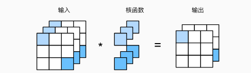

```python
def corr2d_multi_in_out_1x1(X, K):
    c_i, h, w = X.shape
    c_o = K.shape[0]
    X = X.reshape((c_i, h * w))
    K = K.reshape((c_o, c_i))
    # 全连接层中的矩阵乘法
    Y = torch.matmul(K, X)
    return Y.reshape((c_o, h, w))

X = torch.normal(0, 1, (3, 3, 3))
K = torch.normal(0, 1, (2, 3, 1, 1))

Y1 = corr2d_multi_in_out_1x1(X, K)
Y2 = corr2d_multi_in_out(X, K)
assert float(torch.abs(Y1 - Y2).sum()) < 1e-6
```

##### 1x1 卷积的作用

1. **通道数变换**：1x1 卷积可以改变输入特征图的通道数。例如，如果输入特征图有 256 个通道，而使用的 1x1 卷积核有 64 个输出通道，那么输出特征图将有 64 个通道。这种操作可以用于减少或增加特征图的维度，从而实现参数和计算量的减少或特征增强。
2. **增加非线性**：即使是 1x1 卷积，也可以在其后添加激活函数（如 ReLU），从而增加网络的非线性能力。
3. **跨通道信息整合**：1x1 卷积可以整合来自不同通道的信息，因为它对每个像素点的所有通道进行加权求和。这有助于在不同特征通道之间建立联系，从而提高特征的表达能力。
4. **计算成本降低**：在深度卷积网络中，通过使用 1x1 卷积来减少特征图的通道数，可以在后续的卷积层中显著降低计算成本。这是因为后续层的计算量与输入通道数成正比。
5. **网络深度增加**：1x1 卷积可以在不显著增加计算量的情况下增加网络的深度，从而有助于提高网络的学习能力。

##### 1x1**卷积的例子**

假设我们有一个输入特征图，其尺寸为 4x4x3（宽度为 4，高度为 4，通道数为 3）。我们想要使用一个 1x1 卷积核来减少通道数，将其从 3 通道减少到 2 通道。

###### 输入特征图 (4x4x3)

为了简化，我们将输入特征图的每个通道表示为一个 4x4 的矩阵：

```yaml
通道 1:       通道 2:       通道 3:
1 2 3 4       2 3 4 5       3 4 5 6
5 6 7 8       6 7 8 9       7 8 9 10
9 10 11 12    10 11 12 13   11 12 13 14
13 14 15 16   14 15 16 17   15 16 17 18
```

###### 1x1 卷积核 (1x1x3x2)

我们使用两个 1x1 卷积核，每个卷积核有三个权重，对应于输入特征图的三个通道：

```yaml
卷积核 1: [0.2, 0.3, 0.4]
卷积核 2: [0.1, 0.1, 0.1]
```

###### 输出特征图 (4x4x2)

通过对输入特征图的每个像素位置应用 1x1 卷积核，我们可以得到一个具有两个通道的输出特征图。每个输出通道的值是通过将输入通道的相应值乘以卷积核权重并求和得到的：

```markdown
输出通道 1: 输出通道 2:
(1*0.2 + 2*0.3 + 3*0.4) ... (1*0.1 + 2*0.1 + 3*0.1) ... ... ...
```

具体计算后的输出特征图为：

```yaml
输出通道 1:                      输出通道 2:
2.2  3.0  3.8  4.6               0.6  0.9  1.2  1.5
6.2  7.0  7.8  8.6               1.8  2.1  2.4  2.7
10.2 11.0 11.8 12.6              3.0  3.3  3.6  3.9
14.2 15.0 15.8 16.6              4.2  4.5  4.8  5.1
```

在这个例子中，1x1 卷积核有效地将输入特征图的通道数从 3 减少到了 2，同时保持了空间维度不变。这种操作可以用于特征降维、增加网络深度或整合跨通道信息。

### 6.5. 汇聚层

降低卷积层对位置的敏感性，同时降低对空间降采样表示的敏感性

#### 6.5.1. 最大汇聚层和平均汇聚层

计算汇聚窗口中所有元素的最大值或平均值。这些操作分别称为*最大汇聚层*（maximum pooling）和*平均汇聚层*（average pooling）

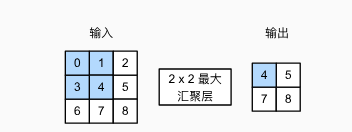

```python
import torch
from torch import nn
from d2l import torch as d2l

def pool2d(X, pool_size, mode='max'):
    p_h, p_w = pool_size
    Y = torch.zeros((X.shape[0] - p_h + 1, X.shape[1] - p_w + 1))
    for i in range(Y.shape[0]):
        for j in range(Y.shape[1]):
            if mode == 'max':
                Y[i, j] = X[i: i + p_h, j: j + p_w].max()
            elif mode == 'avg':
                Y[i, j] = X[i: i + p_h, j: j + p_w].mean()
    return Y

X = torch.tensor([[0.0, 1.0, 2.0], [3.0, 4.0, 5.0], [6.0, 7.0, 8.0]])
pool2d(X, (2, 2))

```

#### 6.5.2. 填充和步幅

```python
X = torch.arange(16, dtype=torch.float32).reshape((1, 1, 4, 4))
# tensor([[[[ 0.,  1.,  2.,  3.],
#           [ 4.,  5.,  6.,  7.],
#           [ 8.,  9., 10., 11.],
#           [12., 13., 14., 15.]]]])

pool2d = nn.MaxPool2d(3)
pool2d(X)
# tensor([[[[ 5.,  7.],
#           [13., 15.]]]])

pool2d = nn.MaxPool2d((2, 3), stride=(2, 3), padding=(0, 1))
pool2d(X)
# tensor([[[[ 5.,  7.],
#           [13., 15.]]]])
```

#### 6.5.3. 多个通道

汇聚层在每个输入通道上单独运算，而不是像卷积层一样在通道上对输入进行汇总。 这意味着汇聚层的输出通道数与输入通道数相同

```python
X = torch.cat((X, X + 1), 1)
# tensor([[[[ 0.,  1.,  2.,  3.],
#           [ 4.,  5.,  6.,  7.],
#           [ 8.,  9., 10., 11.],
#           [12., 13., 14., 15.]],

#          [[ 1.,  2.,  3.,  4.],
#           [ 5.,  6.,  7.,  8.],
#           [ 9., 10., 11., 12.],
#           [13., 14., 15., 16.]]]])
pool2d = nn.MaxPool2d(3, padding=1, stride=2)
pool2d(X)
# tensor([[[[ 5.,  7.],
#           [13., 15.]],

#          [[ 6.,  8.],
#           [14., 16.]]]])
```

### 6.6. 卷积神经网络（LeNet）

#### 6.6.1. LeNet

总体来看，LeNet（LeNet-5）由两个部分组成：

- 卷积编码器：由两个卷积层组成;
- 全连接层密集块：由三个全连接层组成。

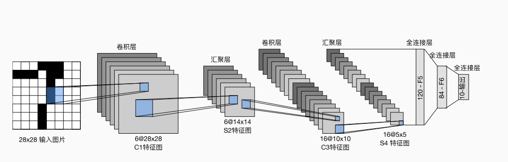

每个卷积块中的基本单元是一个卷积层、一个 sigmoid 激活函数和平均汇聚层。每个卷积层使用 5×5 卷积核和一个 sigmoid 激活函数。这些层将输入映射到多个二维特征输出，通常同时增加通道的数量。第一卷积层有 6
个输出通道，而第二个卷积层有 16 个输出通道。每个 2×2 池操作（步幅 2）通过空间下采样将维数减少 4 倍。

为了将卷积块的输出传递给稠密块，我们必须在小批量中展平每个样本。换言之，我们将这个四维输入转换成全连接层所期望的二维输入。这里的二维表示的第一个维度索引小批量中的样本，第二个维度给出每个样本的平面向量表示。LeNet
的稠密块有三个全连接层，分别有 120、84 和 10 个输出。因为我们在执行分类任务，所以输出层的 10 维对应于最后输出结果的数量。

```python
import torch
from torch import nn
from d2l import torch as d2l

net = nn.Sequential(
    nn.Conv2d(1, 6, kernel_size=5, padding=2), nn.Sigmoid(),
    nn.AvgPool2d(kernel_size=2, stride=2),
    nn.Conv2d(6, 16, kernel_size=5), nn.Sigmoid(),
    nn.AvgPool2d(kernel_size=2, stride=2),
    nn.Flatten(),
    nn.Linear(16 * 5 * 5, 120), nn.Sigmoid(),
    nn.Linear(120, 84), nn.Sigmoid(),
    nn.Linear(84, 10))
```

#### 6.6.2. 模型训练

```python
batch_size = 256
train_iter, test_iter = d2l.load_data_fashion_mnist(batch_size=batch_size)

def evaluate_accuracy_gpu(net, data_iter, device=None): #@save
    """使用GPU计算模型在数据集上的精度"""
    if isinstance(net, nn.Module):
        net.eval()  # 设置为评估模式
        if not device:
            device = next(iter(net.parameters())).device
    # 正确预测的数量，总预测的数量
    metric = d2l.Accumulator(2)
    with torch.no_grad():
        for X, y in data_iter:
            if isinstance(X, list):
                # BERT微调所需的（之后将介绍）
                X = [x.to(device) for x in X]
            else:
                X = X.to(device)
            y = y.to(device)
            metric.add(d2l.accuracy(net(X), y), y.numel())
    return metric[0] / metric[1]

@save
def train_ch6(net, train_iter, test_iter, num_epochs, lr, device):
    """用GPU训练模型(在第六章定义)"""
    def init_weights(m):
        if type(m) == nn.Linear or type(m) == nn.Conv2d:
            nn.init.xavier_uniform_(m.weight)
    net.apply(init_weights)
    print('training on', device)
    net.to(device)
    optimizer = torch.optim.SGD(net.parameters(), lr=lr)
    loss = nn.CrossEntropyLoss()
    animator = d2l.Animator(xlabel='epoch', xlim=[1, num_epochs],
                            legend=['train loss', 'train acc', 'test acc'])
    timer, num_batches = d2l.Timer(), len(train_iter)
    for epoch in range(num_epochs):
        # 训练损失之和，训练准确率之和，样本数
        metric = d2l.Accumulator(3)
        net.train()
        for i, (X, y) in enumerate(train_iter):
            timer.start()
            optimizer.zero_grad()
            X, y = X.to(device), y.to(device)
            y_hat = net(X)
            l = loss(y_hat, y)
            l.backward()
            optimizer.step()
            with torch.no_grad():
                metric.add(l * X.shape[0], d2l.accuracy(y_hat, y), X.shape[0])
            timer.stop()
            train_l = metric[0] / metric[2]
            train_acc = metric[1] / metric[2]
            if (i + 1) % (num_batches // 5) == 0 or i == num_batches - 1:
                animator.add(epoch + (i + 1) / num_batches,
                             (train_l, train_acc, None))
        test_acc = evaluate_accuracy_gpu(net, test_iter)
        animator.add(epoch + 1, (None, None, test_acc))
    print(f'loss {train_l:.3f}, train acc {train_acc:.3f}, '
          f'test acc {test_acc:.3f}')
    print(f'{metric[2] * num_epochs / timer.sum():.1f} examples/sec '
          f'on {str(device)}')

lr, num_epochs = 0.9, 10
train_ch6(net, train_iter, test_iter, num_epochs, lr, d2l.try_gpu())
```

## 7. 现代卷积神经网络

- AlexNet。它是第一个在大规模视觉竞赛中击败传统计算机视觉模型的大型神经网络；
- 使用重复块的网络（VGG）。它利用许多重复的神经网络块；
- 网络中的网络（NiN）。它重复使用由卷积层和 1×1 卷积层（用来代替全连接层）来构建深层网络;
- 含并行连结的网络（GoogLeNet）。它使用并行连结的网络，通过不同窗口大小的卷积层和最大汇聚层来并行抽取信息；
- 残差网络（ResNet）。它通过残差块构建跨层的数据通道，是计算机视觉中最流行的体系架构；
- 稠密连接网络（DenseNet）。它的计算成本很高，但给我们带来了更好的效果。

### 7.1. 深度卷积神经网络（AlexNet）

#### 7.1.1. 学习表征

他们认为特征本身应该被学习。此外，他们还认为，在合理地复杂性前提下，特征应该由多个共同学习的神经网络层组成，每个层都有可学习的参数。在机器视觉中，最底层可能检测边缘、颜色和纹理

#### 7.1.2. AlexNet

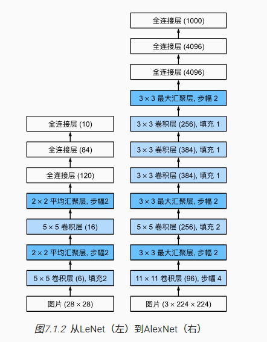

##### 7.1.2.1. 模型设计

在 AlexNet 的第一层，卷积窗口的形状是 11×11。 由于 ImageNet 中大多数图像的宽和高比 MNIST 图像的多 10 倍以上，因此，需要一个更大的卷积窗口来捕获目标。 第二层中的卷积窗口形状被缩减为 5×5，然后是
3×3。 此外，在第一层、第二层和第五层卷积层之后，加入窗口形状为 3×3、步幅为 2 的最大汇聚层。 而且，AlexNet 的卷积通道数目是 LeNet 的 10 倍。

在最后一个卷积层后有两个全连接层，分别有 4096 个输出。 这两个巨大的全连接层拥有将近 1GB 的模型参数

##### 7.1.2.2. 激活函数

此外，AlexNet 将 sigmoid 激活函数改为更简单的 ReLU 激活函数。

1. ReLU 激活函数的计算更简单
2. 当使用不同的参数初始化方法时，ReLU 激活函数使训练模型更加容易。 当 sigmoid 激活函数的输出非常接近于 0 或 1 时，这些区域的梯度几乎为 0，因此反向传播无法继续更新一些模型参数。 相反，ReLU
   激活函数在正区间的梯度总是 1。 因此，如果模型参数没有正确初始化，sigmoid 函数可能在正区间内得到几乎为 0 的梯度，从而使模型无法得到有效的训练。

##### 7.1.2.3. 容量控制和预处理

AlexNet 通过暂退法（ [4.6 节](https://zh-v2.d2l.ai/chapter_multilayer-perceptrons/dropout.html#sec-dropout)）控制全连接层的模型复杂度，而
LeNet 只使用了权重衰减

为了进一步扩充数据，AlexNet 在训练时增加了大量的图像增强数据，如翻转、裁切和变色。 这使得模型更健壮，更大的样本量有效地减少了过拟合

```python
import torch
from torch import nn
from d2l import torch as d2l

net = nn.Sequential(
    # 这里使用一个11*11的更大窗口来捕捉对象。
    # 同时，步幅为4，以减少输出的高度和宽度。
    # 另外，输出通道的数目远大于LeNet
    nn.Conv2d(1, 96, kernel_size=11, stride=4, padding=1), nn.ReLU(),
    nn.MaxPool2d(kernel_size=3, stride=2),
    # 减小卷积窗口，使用填充为2来使得输入与输出的高和宽一致，且增大输出通道数
    nn.Conv2d(96, 256, kernel_size=5, padding=2), nn.ReLU(),
    nn.MaxPool2d(kernel_size=3, stride=2),
    # 使用三个连续的卷积层和较小的卷积窗口。
    # 除了最后的卷积层，输出通道的数量进一步增加。
    # 在前两个卷积层之后，汇聚层不用于减少输入的高度和宽度
    nn.Conv2d(256, 384, kernel_size=3, padding=1), nn.ReLU(),
    nn.Conv2d(384, 384, kernel_size=3, padding=1), nn.ReLU(),
    nn.Conv2d(384, 256, kernel_size=3, padding=1), nn.ReLU(),
    nn.MaxPool2d(kernel_size=3, stride=2),
    nn.Flatten(),
    # 这里，全连接层的输出数量是LeNet中的好几倍。使用dropout层来减轻过拟合
    nn.Linear(6400, 4096), nn.ReLU(),
    nn.Dropout(p=0.5),
    nn.Linear(4096, 4096), nn.ReLU(),
    nn.Dropout(p=0.5),
    # 最后是输出层。由于这里使用Fashion-MNIST，所以用类别数为10，而非论文中的1000
    nn.Linear(4096, 10))

'''观察每一层形状变化'''
X = torch.randn(1, 1, 224, 224)
for layer in net:
    X=layer(X)
    print(layer.__class__.__name__,'output shape:\t',X.shape)


Conv2d output shape:         torch.Size([1, 96, 54, 54])
ReLU output shape:       	 torch.Size([1, 96, 54, 54])
MaxPool2d output shape:      torch.Size([1, 96, 26, 26])
Conv2d output shape:         torch.Size([1, 256, 26, 26])
ReLU output shape:   		 torch.Size([1, 256, 26, 26])
MaxPool2d output shape:      torch.Size([1, 256, 12, 12])
Conv2d output shape:         torch.Size([1, 384, 12, 12])
ReLU output shape:   		 torch.Size([1, 384, 12, 12])
Conv2d output shape:         torch.Size([1, 384, 12, 12])
ReLU output shape:   		 torch.Size([1, 384, 12, 12])
Conv2d output shape:         torch.Size([1, 256, 12, 12])
ReLU output shape:   		 torch.Size([1, 256, 12, 12])
MaxPool2d output shape:      torch.Size([1, 256, 5, 5])
Flatten output shape:        torch.Size([1, 6400])
Linear output shape:         torch.Size([1, 4096])
ReLU output shape:   		 torch.Size([1, 4096])
Dropout output shape:        torch.Size([1, 4096])
Linear output shape:         torch.Size([1, 4096])
ReLU output shape:   		 torch.Size([1, 4096])
Dropout output shape:        torch.Size([1, 4096])
Linear output shape:         torch.Size([1, 10])
```

#### 7.1.3 如何估算网络计算量

要估算 AlexNet 中各个部分所需的计算量，我们可以考虑卷积层和全连接层的计算开销，因为这两种类型的层通常是神经网络中计算量最大的部分。

##### 1. 卷积层的计算量

对于一个卷积层，其计算量（以乘-加操作数计算）可以通过以下公式估算：

计算量=输出特征图高度 × 输出特征图宽度 × 卷积核高度 × 卷积核宽度 × 输入通道数 × 输出通道数

##### 2. 全连接层的计算量

对于一个全连接层，其计算量可以通过以下公式估算：

计算量=输入特征数 × 输出特征数

##### 3. AlexNet 的具体计算

以 AlexNet 的第一个卷积层为例，其输入大小为 227×227（经过预处理后），有 3 个输入通道，96 个输出通道，使用的卷积核大小为 11×11，步长为 4。因此，该层的计算量大约为：

55×55×11×11×3×96≈105 百万次乘-加操作

其中，输出特征图的大小为 55×55（由输入大小和卷积核大小、步长共同决定）。

对于 AlexNet 的全连接层，例如第一个全连接层，其输入特征数为 9216（来自前一层的输出），输出特征数为 4096，因此该层的计算量大约为：

9216×4096≈38 百万次乘-加操作

激活函数和池化因为计算量很小，可以忽略

### 7.2. 使用块的网络（VGG）

#### 7.2.1. VGG 块

经典卷积神经网络的基本组成部分是下面的这个序列：

1. 带填充以保持分辨率的卷积层；
2. 非线性激活函数，如 ReLU；
3. 汇聚层，如最大汇聚层。

原始设计带有 3×3 卷积核、填充为 1（保持高度和宽度）的卷积层，和带有 2×2 汇聚窗口、步幅为 2（每个块后的分辨率减半）的最大汇聚层

```python
import torch
from torch import nn
from d2l import torch as d2l

def vgg_block(num_convs, in_channels, out_channels):
    layers = []
    for _ in range(num_convs):
        layers.append(nn.Conv2d(in_channels, out_channels,
                                kernel_size=3, padding=1))
        layers.append(nn.ReLU())
        in_channels = out_channels
    layers.append(nn.MaxPool2d(kernel_size=2,stride=2))
    return nn.Sequential(*layers)
```

#### 7.2.2. VGG 网络

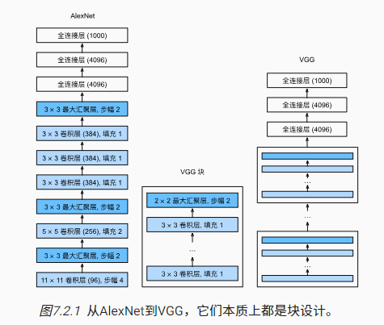

VGG 神经网络连接 [图 7.2.1](https://zh-v2.d2l.ai/chapter_convolutional-modern/vgg.html#fig-vgg)的几个 VGG 块（在`vgg_block`
函数中定义）。其中有超参数变量`conv_arch`。该变量指定了每个 VGG 块里卷积层个数和输出通道数。全连接模块则与 AlexNet 中的相同

原始 VGG 网络有 5 个卷积块，其中前两个块各有一个卷积层，后三个块各包含两个卷积层。 第一个模块有 64 个输出通道，每个后续模块将输出通道数量翻倍，直到该数字达到 512。由于该网络使用 8 个卷积层和 3
个全连接层，因此它通常被称为 VGG-11

```python
conv_arch = ((1, 64), (1, 128), (2, 256), (2, 512), (2, 512))

def vgg(conv_arch):
    conv_blks = []
    in_channels = 1
    # 卷积层部分
    for (num_convs, out_channels) in conv_arch:
        conv_blks.append(vgg_block(num_convs, in_channels, out_channels))
        in_channels = out_channels

    return nn.Sequential(
        *conv_blks, nn.Flatten(),
        # 全连接层部分
        nn.Linear(out_channels * 7 * 7, 4096), nn.ReLU(), nn.Dropout(0.5),
        nn.Linear(4096, 4096), nn.ReLU(), nn.Dropout(0.5),
        nn.Linear(4096, 10))

net = vgg(conv_arch)

'''查看形状'''
X = torch.randn(size=(1, 1, 224, 224))
for blk in net:
    X = blk(X)
    print(blk.__class__.__name__,'output shape:\t',X.shape)

Sequential output shape:     torch.Size([1, 64, 112, 112])
Sequential output shape:     torch.Size([1, 128, 56, 56])
Sequential output shape:     torch.Size([1, 256, 28, 28])
Sequential output shape:     torch.Size([1, 512, 14, 14])
Sequential output shape:     torch.Size([1, 512, 7, 7])
Flatten output shape:        torch.Size([1, 25088])
Linear output shape:         torch.Size([1, 4096])
ReLU output shape:  		 torch.Size([1, 4096])
Dropout output shape:        torch.Size([1, 4096])
Linear output shape:         torch.Size([1, 4096])
ReLU output shape:   		 torch.Size([1, 4096])
Dropout output shape:        torch.Size([1, 4096])
Linear output shape:         torch.Size([1, 10])
```

深层且窄的卷积（即 3×3）比较浅层且宽的卷积更有效

#### 7.2.3 VGG-19

1. **VGG-19**：顾名思义，VGG-19 有 19 层，其中包括 16 个卷积层和 3 个全连接层。VGG-19 的结构是：`[2, 2, 4, 4, 4]`，这意味着第一个卷积块有 2 个卷积层，第二个卷积块也有 2 个卷积层，第三个卷积块有 4 个卷积层，依此类推。
2. **VGG-11**：VGG-11 有 11 层，包括 8 个卷积层和 3 个全连接层。VGG-11 的结构是：`[1, 1, 2, 2, 2]`，这意味着前两个卷积块各有 1 个卷积层，后三个卷积块各有 2 个卷积层。

### 7.3. 网络中的网络（NiN）

LeNet、AlexNet 和 VGG 都有一个共同的设计模式：卷积+汇聚获取特征，全连接层处理特征

NiN 是想在一开始就用全连接层

#### 7.3.1. NiN 块

NiN 的想法是在每个像素位置（针对每个高度和宽度）应用一个全连接层。 如果我们将权重连接到每个空间位置，我们可以将其视为 1×1
卷积层（如 [6.4 节](https://zh-v2.d2l.ai/chapter_convolutional-neural-networks/channels.html#sec-channels)中所述），或作为在每个像素位置上独立作用的全连接层

相当于对每个输入通道 x 权重+激活函数， 然后再求和变成 1 个输出通道。原本最后全连接层会把每个像素点都加一个系数，现在相当于按照通道加系数

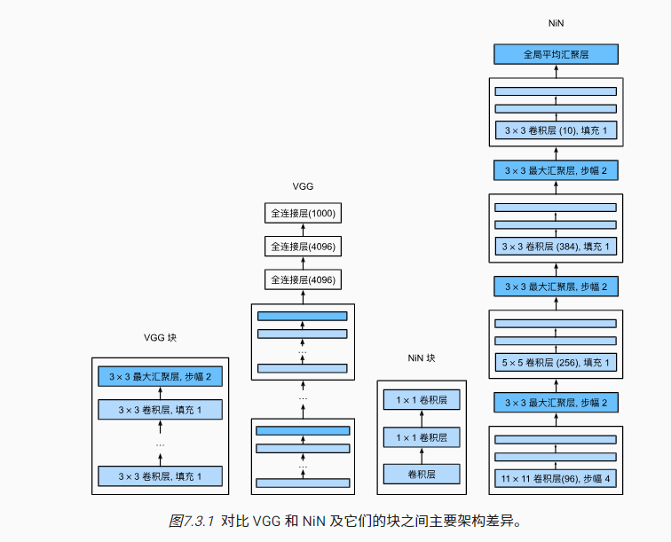

```python
import torch
from torch import nn
from d2l import torch as d2l

# 1x1输出的通道数不变
def nin_block(in_channels, out_channels, kernel_size, strides, padding):
    return nn.Sequential(
        nn.Conv2d(in_channels, out_channels, kernel_size, strides, padding),
        nn.ReLU(),
        nn.Conv2d(out_channels, out_channels, kernel_size=1), nn.ReLU(),
        nn.Conv2d(out_channels, out_channels, kernel_size=1), nn.ReLU())
```

#### 7.3.2. NiN 模型

NiN 使用窗口形状为 11×11、5×5 和 3×3 的卷积层，输出通道数量与 AlexNet 中的相同。 每个 NiN 块后有一个最大汇聚层，汇聚窗口形状为 3×3，步幅为 2。

NiN 和 AlexNet 之间的一个显著区别是 NiN 完全取消了全连接层。 相反，NiN 使用一个 NiN 块，**其输出通道数等于标签类别的数量**。最后放一个*全局平均汇聚层*（global average pooling
layer），生成一个对数几率 （logits）。NiN 设计的一个优点是，它显著减少了模型所需参数的数量。然而，在实践中，这种设计有时会增加训练模型的时间

```python
net = nn.Sequential(
    nin_block(1, 96, kernel_size=11, strides=4, padding=0),
    nn.MaxPool2d(3, stride=2),
    nin_block(96, 256, kernel_size=5, strides=1, padding=2),
    nn.MaxPool2d(3, stride=2),
    nin_block(256, 384, kernel_size=3, strides=1, padding=1),
    nn.MaxPool2d(3, stride=2),
    nn.Dropout(0.5),
    # 标签类别数是10
    nin_block(384, 10, kernel_size=3, strides=1, padding=1),
    nn.AdaptiveAvgPool2d((1, 1)),
    # 将四维的输出转成二维的输出，其形状为(批量大小,10)
    nn.Flatten())

X = torch.rand(size=(1, 1, 224, 224))
for layer in net:
    X = layer(X)
    print(layer.__class__.__name__,'output shape:\t', X.shape)

Sequential output shape:     torch.Size([1, 96, 54, 54])
MaxPool2d output shape:      torch.Size([1, 96, 26, 26])
Sequential output shape:     torch.Size([1, 256, 26, 26])
MaxPool2d output shape:      torch.Size([1, 256, 12, 12])
Sequential output shape:     torch.Size([1, 384, 12, 12])
MaxPool2d output shape:      torch.Size([1, 384, 5, 5])
Dropout output shape:        torch.Size([1, 384, 5, 5])
Sequential output shape:     torch.Size([1, 10, 5, 5])
AdaptiveAvgPool2d output shape:      torch.Size([1, 10, 1, 1])
Flatten output shape:        torch.Size([1, 10])
```

#### 7.3.3. 训练模型

```python
lr, num_epochs, batch_size = 0.1, 10, 128
train_iter, test_iter = d2l.load_data_fashion_mnist(batch_size, resize=224)
d2l.train_ch6(net, train_iter, test_iter, num_epochs, lr, d2l.try_gpu())
```

### 7.4. 含并行连结的网络（GoogLeNet）

#### 7.4.1. Inception 块

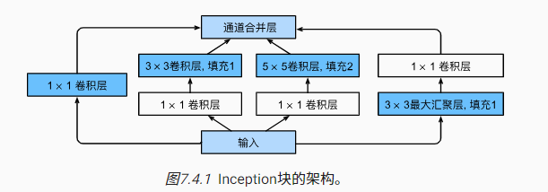

```python
import torch
from torch import nn
from torch.nn import functional as F
from d2l import torch as d2l


class Inception(nn.Module):
    # c1--c4是每条路径的输出通道数,可调
    def __init__(self, in_channels, c1, c2, c3, c4, **kwargs):
        super(Inception, self).__init__(**kwargs)
        # 线路1，单1x1卷积层
        self.p1_1 = nn.Conv2d(in_channels, c1, kernel_size=1)
        # 线路2，1x1卷积层后接3x3卷积层
        self.p2_1 = nn.Conv2d(in_channels, c2[0], kernel_size=1)
        self.p2_2 = nn.Conv2d(c2[0], c2[1], kernel_size=3, padding=1)
        # 线路3，1x1卷积层后接5x5卷积层
        self.p3_1 = nn.Conv2d(in_channels, c3[0], kernel_size=1)
        self.p3_2 = nn.Conv2d(c3[0], c3[1], kernel_size=5, padding=2)
        # 线路4，3x3最大汇聚层后接1x1卷积层
        self.p4_1 = nn.MaxPool2d(kernel_size=3, stride=1, padding=1)
        self.p4_2 = nn.Conv2d(in_channels, c4, kernel_size=1)

    def forward(self, x):
        p1 = F.relu(self.p1_1(x))
        p2 = F.relu(self.p2_2(F.relu(self.p2_1(x))))
        p3 = F.relu(self.p3_2(F.relu(self.p3_1(x))))
        p4 = F.relu(self.p4_2(self.p4_1(x)))
        # 在通道维度上连结输出
        return torch.cat((p1, p2, p3, p4), dim=1)
```

#### 7.4.2. GoogLeNet 模型

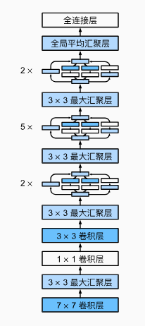

一开始类似 VGG 块，卷积+汇聚

然后是 inception 块

最后是全局汇聚

```python
# 7x7 卷积 + 3x3 汇聚
b1 = nn.Sequential(nn.Conv2d(1, 64, kernel_size=7, stride=2, padding=3),
                   nn.ReLU(),
                   nn.MaxPool2d(kernel_size=3, stride=2, padding=1))

# 1x1 卷积 + 3x3 卷积 + 3x3 汇聚
b2 = nn.Sequential(nn.Conv2d(64, 64, kernel_size=1),
                   nn.ReLU(),
                   nn.Conv2d(64, 192, kernel_size=3, padding=1),
                   nn.ReLU(),
                   nn.MaxPool2d(kernel_size=3, stride=2, padding=1))

# 1st Inception 输出通道 64 + 128 + 32 + 32 = 256
# 2nd Inception 输出通道 128 + 192 + 96 + 64 = 480
b3 = nn.Sequential(Inception(192, 64, (96, 128), (16, 32), 32),
                   Inception(256, 128, (128, 192), (32, 96), 64),
                   nn.MaxPool2d(kernel_size=3, stride=2, padding=1))

# 5个Inception输出依次为512，512，512，528，832
b4 = nn.Sequential(Inception(480, 192, (96, 208), (16, 48), 64),
                   Inception(512, 160, (112, 224), (24, 64), 64),
                   Inception(512, 128, (128, 256), (24, 64), 64),
                   Inception(512, 112, (144, 288), (32, 64), 64),
                   Inception(528, 256, (160, 320), (32, 128), 128),
                   nn.MaxPool2d(kernel_size=3, stride=2, padding=1))

# 2个Inception输出依次为832，1024
b5 = nn.Sequential(Inception(832, 256, (160, 320), (32, 128), 128),
                   Inception(832, 384, (192, 384), (48, 128), 128),
                   nn.AdaptiveAvgPool2d((1,1)),
                   nn.Flatten())

net = nn.Sequential(b1, b2, b3, b4, b5, nn.Linear(1024, 10))

X = torch.rand(size=(1, 1, 96, 96))
for layer in net:
    X = layer(X)
    print(layer.__class__.__name__,'output shape:\t', X.shape)

Sequential output shape:     torch.Size([1, 64, 24, 24])
Sequential output shape:     torch.Size([1, 192, 12, 12])
Sequential output shape:     torch.Size([1, 480, 6, 6])
Sequential output shape:     torch.Size([1, 832, 3, 3])
Sequential output shape:     torch.Size([1, 1024])
Linear output shape:         torch.Size([1, 10])

lr, num_epochs, batch_size = 0.1, 10, 128
train_iter, test_iter = d2l.load_data_fashion_mnist(batch_size, resize=96)
d2l.train_ch6(net, train_iter, test_iter, num_epochs, lr, d2l.try_gpu())
```

### 7.5 批量规范化

批量规范化使得研究人员能够训练 100 层以上的网络

#### 7.5.1. 训练深层网络

**批量规范化的原因**

1. 标准化可以让参数的量级统一
2. 每一层的输出变化范围会不一样
3. 正则化防止过拟合

**做法**

在每次训练迭代中，我们首先规范化输入，即通过减去其均值并除以其标准差，其中两者均基于当前小批量处理。 接下来，我们应用比例系数和比例偏移。 正是由于这个基于*批量*统计的*标准化*，才有了*批量规范化*的名称

批量大小选择很重要

从形式上来说，用$\mathbf{x} \in \mathcal{B}$表示一个来自小批量$\mathcal{B}$的输入，批量规范化$\mathrm{BN}$根据以下表达式转换$\mathbf{x}$：

$$\mathrm{BN}(\mathbf{x}) = \boldsymbol{\gamma} \odot \frac{\mathbf{x} - \hat{\boldsymbol{\mu}}_
\mathcal{B}}{\hat{\boldsymbol{\sigma}}_\mathcal{B}} + \boldsymbol{\beta}.$$

上式中，$\hat{\boldsymbol{\mu}}_\mathcal{B}$是小批量$\mathcal{B}$的样本均值，$\hat{\boldsymbol{\sigma}}_
\mathcal{B}$是小批量$\mathcal{B}$的样本标准差。应用标准化后，生成的小批量的平均值为 0 和单位方差为 1。

由于单位方差（与其他一些魔法数）是一个主观的选择，因此我们通常包含**拉伸参数**（scale）$\boldsymbol{\gamma}$和*偏移参数*
（shift）$\boldsymbol{\beta}$，它们的形状与$\mathbf{x}$相同。请注意，$\boldsymbol{\gamma}$和$\boldsymbol{\beta}$是需要与其他模型参数一起学习的参数。

上式中的$\hat{\boldsymbol{\mu}}_\mathcal{B}$和${\hat{\boldsymbol{\sigma}}_\mathcal{B}}$如下计算：

$$
\begin{aligned} \hat{\boldsymbol{\mu}}_\mathcal{B} &= \frac{1}{|\mathcal{B}|} \sum_{\mathbf{x} \in \mathcal{B}} \mathbf{x},\\

\hat{\boldsymbol{\sigma}}_\mathcal{B}^2 &= \frac{1}{|\mathcal{B}|} \sum_{\mathbf{x} \in \mathcal{B}} (\mathbf{x} - \hat{\boldsymbol{\mu}}_{\mathcal{B}})^2 + \epsilon.\end{aligned}
$$

请注意，我们在方差估计值中添加一个小的常量$\epsilon > 0$，以确保我们永远不会尝试除以零，即使在经验方差估计值可能消失的情况下也是如此。估计值$\hat{\boldsymbol{\mu}}_\mathcal{B}$和${\hat{\boldsymbol{\sigma}}_\mathcal{B}}$通过使用平均值和方差的噪声（noise）估计来抵消缩放问题。

#### 7.5.2. 批量规范化层

**全连接层**

通常，我们将批量规范化层置于全连接层中的仿射变换和激活函数之间。设全连接层的输入为
x，权重参数和偏置参数分别为$\mathbf{W}$和$\mathbf{b}$，激活函数为$\phi$，批量规范化的运算符为$\mathrm{BN}$。那么，使用批量规范化的全连接层的输出的计算详情如下：

$$\mathbf{h} = \phi(\mathrm{BN}(\mathbf{W}\mathbf{x} + \mathbf{b}) ).$$

回想一下，均值和方差是在应用变换的"相同"小批量上计算的。

**卷积层**

同样，对于卷积层，我们可以在卷积层之后和非线性激活函数之前应用批量规范化。 当卷积有多个输出通道时，我们需要对这些通道的“每个”输出执行批量规范化，每个通道都有自己的拉伸（scale）和偏移（shift）参数，这两个参数都是标量。

**预测过程**

不需要在均方差里加噪声

#### 7.5.3. 从零实现

$moving\_mean = p* moving\_mean + (1.0 - p) * mean$

$X\_hat = \frac{X - mean}{\sqrt{var+\epsilon}}$

$Y = \gamma * X\_hat + \beta$

```python
import torch
from torch import nn
from d2l import torch as d2l

'''eps - 噪声'''
'''momentum - 更新均值和方差的系数'''
def batch_norm(X, gamma, beta, moving_mean, moving_var, eps, momentum):
    # 通过is_grad_enabled来判断当前模式是训练模式还是预测模式
    if not torch.is_grad_enabled():
        # 如果是在预测模式下，直接使用传入的移动平均所得的均值和方差
        X_hat = (X - moving_mean) / torch.sqrt(moving_var + eps)
    else:
        assert len(X.shape) in (2, 4)
        if len(X.shape) == 2:
            # 使用全连接层的情况，计算特征维上的均值和方差
            mean = X.mean(dim=0)
            var = ((X - mean) ** 2).mean(dim=0)
        else:
            # 使用二维卷积层的情况，计算通道维上（axis=1）的均值和方差。
            # 这里我们需要保持X的形状以便后面可以做广播运算
            mean = X.mean(dim=(0, 2, 3), keepdim=True)
            var = ((X - mean) ** 2).mean(dim=(0, 2, 3), keepdim=True)
        # 训练模式下，用当前的均值和方差做标准化
        X_hat = (X - mean) / torch.sqrt(var + eps)
        # 更新移动平均的均值和方差
        moving_mean = momentum * moving_mean + (1.0 - momentum) * mean
        moving_var = momentum * moving_var + (1.0 - momentum) * var
    Y = gamma * X_hat + beta  # 缩放和移位
    return Y, moving_mean.data, moving_var.data

class BatchNorm(nn.Module):
    # num_features：完全连接层的输出数量或卷积层的输出通道数。
    # num_dims：2表示完全连接层，4表示卷积层
    def __init__(self, num_features, num_dims):
        super().__init__()
        if num_dims == 2:
            shape = (1, num_features)
        else:
            shape = (1, num_features, 1, 1)
        # 参与求梯度和迭代的拉伸和偏移参数，分别初始化成1和0
        self.gamma = nn.Parameter(torch.ones(shape))
        self.beta = nn.Parameter(torch.zeros(shape))
        # 非模型参数的变量初始化为0和1
        self.moving_mean = torch.zeros(shape)
        self.moving_var = torch.ones(shape)

    def forward(self, X):
        # 如果X不在内存上，将moving_mean和moving_var
        # 复制到X所在显存上
        if self.moving_mean.device != X.device:
            self.moving_mean = self.moving_mean.to(X.device)
            self.moving_var = self.moving_var.to(X.device)
        # 保存更新过的moving_mean和moving_var
        Y, self.moving_mean, self.moving_var = batch_norm(
            X, self.gamma, self.beta, self.moving_mean,
            self.moving_var, eps=1e-5, momentum=0.9)
        return Y
```

#### 7.5.4. 使用批量规范化层的 LeNet

```python
net = nn.Sequential(
    nn.Conv2d(1, 6, kernel_size=5), BatchNorm(6, num_dims=4), nn.Sigmoid(),
    nn.AvgPool2d(kernel_size=2, stride=2),
    nn.Conv2d(6, 16, kernel_size=5), BatchNorm(16, num_dims=4), nn.Sigmoid(),
    nn.AvgPool2d(kernel_size=2, stride=2), nn.Flatten(),
    nn.Linear(16*4*4, 120), BatchNorm(120, num_dims=2), nn.Sigmoid(),
    nn.Linear(120, 84), BatchNorm(84, num_dims=2), nn.Sigmoid(),
    nn.Linear(84, 10))

lr, num_epochs, batch_size = 1.0, 10, 256
train_iter, test_iter = d2l.load_data_fashion_mnist(batch_size)
d2l.train_ch6(net, train_iter, test_iter, num_epochs, lr, d2l.try_gpu())
```

#### 7.5.5. 简明实现

```python
net = nn.Sequential(
    nn.Conv2d(1, 6, kernel_size=5), nn.BatchNorm2d(6), nn.Sigmoid(),
    nn.AvgPool2d(kernel_size=2, stride=2),
    nn.Conv2d(6, 16, kernel_size=5), nn.BatchNorm2d(16), nn.Sigmoid(),
    nn.AvgPool2d(kernel_size=2, stride=2), nn.Flatten(),
    nn.Linear(256, 120), nn.BatchNorm1d(120), nn.Sigmoid(),
    nn.Linear(120, 84), nn.BatchNorm1d(84), nn.Sigmoid(),
    nn.Linear(84, 10))

d2l.train_ch6(net, train_iter, test_iter, num_epochs, lr, d2l.try_gpu())
```

### 7.6. 残差网络（ResNet）

#### 1. 残差学习

在传统的深度网络中，每一层都直接学习输入到输出的映射。而在 ResNet 中，每一层（或一组层）学习的是残差映射，即输入和输出之间的差异。具体来说，如果我们将一层（或一组层）的输入表示为 _x_，期望的输出表示为*H*(_x_)
，那么这一层需要学习的残差映射表示为 _F_(_x_)=_H_(_x_)−*x*。因此，期望的输出可以表示为：

_H_(_x_)=_F_(_x_)+_x_

这里的 _F_(_x_)+_x_ 即为残差连接，其中*F*(_x_) 通过卷积层学习，而 _x_ 通过跳跃连接（skip connection）直接相加。

#### 2. 梯度反向传播

残差连接的一个关键优势在于它们改善了梯度的反向传播。在反向传播过程中，梯度可以通过跳跃连接直接传递到更早的层，从而缓解了梯度消失的问题。这使得训练更深层的网络变得更加可行。

#### 3. 网络层堆叠

ResNet 通过堆叠多个残差块（residual blocks）来构建深度网络。每个残差块包含几个卷积层，以及一个将输入直接连接到输出的跳跃连接。这种设计使得网络可以通过增加更多的残差块来增加深度，而不会导致训练困难增加。

#### 4. 恒等映射和非线性激活

在 ResNet 中，跳跃连接通常实现为恒等映射（identity mapping），即直接将输入添加到输出。此外，残差块中的卷积层通常后跟非线性激活函数（如 ReLU），以增加网络的非线性表达能力。

#### 7.6.2. 残差块

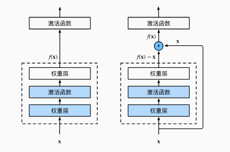

```python
import torch
from torch import nn
from torch.nn import functional as F
from d2l import torch as d2l


class Residual(nn.Module):  #@save
    def __init__(self, input_channels, num_channels,
                 use_1x1conv=False, strides=1):
        super().__init__()
        self.conv1 = nn.Conv2d(input_channels, num_channels,
                               kernel_size=3, padding=1, stride=strides)
        self.conv2 = nn.Conv2d(num_channels, num_channels,
                               kernel_size=3, padding=1)
        if use_1x1conv:
            self.conv3 = nn.Conv2d(input_channels, num_channels,
                                   kernel_size=1, stride=strides)
        else:
            self.conv3 = None
        self.bn1 = nn.BatchNorm2d(num_channels)
        self.bn2 = nn.BatchNorm2d(num_channels)

    def forward(self, X):
        Y = F.relu(self.bn1(self.conv1(X)))
        Y = self.bn2(self.conv2(Y))
        if self.conv3:
            X = self.conv3(X)
        Y += X
        return F.relu(Y)

blk = Residual(3,3)
X = torch.rand(4, 3, 6, 6)
Y = blk(X)
Y.shape
'''torch.Size([4, 3, 6, 6])'''

blk = Residual(3,6, use_1x1conv=True, strides=2)
blk(X).shape
'''torch.Size([4, 6, 3, 3])'''
```

上面的程序表示如下两种 ResNet 块

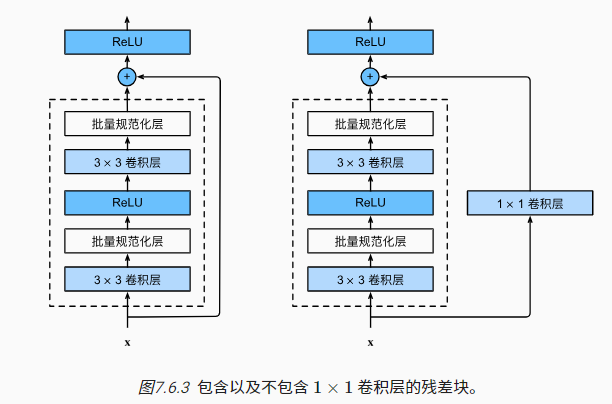

#### 7.6.3. ResNet 模型

ResNet 的前两层跟之前介绍的 GoogLeNet 中的一样： 在输出通道数为 64、步幅为 2 的 7×7 卷积层后，接步幅为 2 的 3×3 的最大汇聚层。 不同之处在于 ResNet 每个卷积层后增加了批量规范化层

```python
b1 = nn.Sequential(nn.Conv2d(1, 64, kernel_size=7, stride=2, padding=3),
                   nn.BatchNorm2d(64), nn.ReLU(),
                   nn.MaxPool2d(kernel_size=3, stride=2, padding=1))

def resnet_block(input_channels, num_channels, num_residuals,
                 first_block=False):
    blk = []
    for i in range(num_residuals):
        if i == 0 and not first_block:
            blk.append(Residual(input_channels, num_channels,
                                use_1x1conv=True, strides=2))
        else:
            blk.append(Residual(num_channels, num_channels))
    return blk

b2 = nn.Sequential(*resnet_block(64, 64, 2, first_block=True))
b3 = nn.Sequential(*resnet_block(64, 128, 2))
b4 = nn.Sequential(*resnet_block(128, 256, 2))
b5 = nn.Sequential(*resnet_block(256, 512, 2))

net = nn.Sequential(b1, b2, b3, b4, b5,
                    nn.AdaptiveAvgPool2d((1,1)),
                    nn.Flatten(), nn.Linear(512, 10))

X = torch.rand(size=(1, 1, 224, 224))
for layer in net:
    X = layer(X)
    print(layer.__class__.__name__,'output shape:\t', X.shape)

Sequential output shape:     torch.Size([1, 64, 56, 56])
Sequential output shape:     torch.Size([1, 64, 56, 56])
Sequential output shape:     torch.Size([1, 128, 28, 28])
Sequential output shape:     torch.Size([1, 256, 14, 14])
Sequential output shape:     torch.Size([1, 512, 7, 7])
AdaptiveAvgPool2d output shape:      torch.Size([1, 512, 1, 1])
Flatten output shape:        torch.Size([1, 512])
Linear output shape:         torch.Size([1, 10])
```

### 7.7. 稠密连接网络（DenseNet）

#### 7.7.1. 从 ResNet 到 DenseNet

任意函数的泰勒展开式（Taylor expansion），它把这个函数分解成越来越高阶的项。在$x$接近 0 时，

$$f(x) = f(0) + f'(0) x + \frac{f''(0)}{2!} x^2 + \frac{f'''(0)}{3!} x^3 + \ldots.$$

ResNet 相当于只加了一次项，DenseNet 会加多个项

稠密网络主要由 2 部分构成：_稠密块_（dense block）和*过渡层*（transition layer）。 前者定义如何连接输入和输出，而后者则控制通道数量

#### 7.7.2. 稠密块体

```python
import torch
from torch import nn
from d2l import torch as d2l


def conv_block(input_channels, num_channels):
    return nn.Sequential(
        nn.BatchNorm2d(input_channels), nn.ReLU(),
        nn.Conv2d(input_channels, num_channels, kernel_size=3, padding=1))

//num_convs 几个block
class DenseBlock(nn.Module):
    def __init__(self, num_convs, input_channels, num_channels):
        super(DenseBlock, self).__init__()
        layer = []
        for i in range(num_convs):
            layer.append(conv_block(
                num_channels * i + input_channels, num_channels))
        self.net = nn.Sequential(*layer)

    def forward(self, X):
        for blk in self.net:
            Y = blk(X)
            # 连接通道维度上每个块的输入和输出
            X = torch.cat((X, Y), dim=1)
        return X

#2个输出通道数为10的DenseBlock。 使用通道数为3的输入时.会得到通道数为3+2x10=23
blk = DenseBlock(2, 3, 10)
X = torch.randn(4, 3, 8, 8)
Y = blk(X)
Y.shape
'''torch.Size([4, 23, 8, 8])'''
```

#### 7.7.3. 过渡层

由于每个稠密块都会带来通道数的增加，使用过多则会过于复杂化模型。 而过渡层可以用来控制模型复杂度。 它通过 1×1 卷积层来减小通道数，并使用步幅为 2 的平均汇聚层减半高和宽，从而进一步降低模型复杂度。

```python
def transition_block(input_channels, num_channels):
    return nn.Sequential(
        nn.BatchNorm2d(input_channels), nn.ReLU(),
        nn.Conv2d(input_channels, num_channels, kernel_size=1),
        nn.AvgPool2d(kernel_size=2, stride=2))

'''输出使用通道数为10的过渡层。 此时输出的通道数减为10'''
blk = transition_block(23, 10)
blk(Y).shape
```

#### 7.7.4. DenseNet 模型

```python
b1 = nn.Sequential(
    nn.Conv2d(1, 64, kernel_size=7, stride=2, padding=3),
    nn.BatchNorm2d(64), nn.ReLU(),
    nn.MaxPool2d(kernel_size=3, stride=2, padding=1))

'''DenseNet使用的是4个稠密块。 与ResNet类似，我们可以设置每个稠密块使用多少个卷积层。 这里我们设成4'''
'''稠密块里的卷积层通道数（即增长率）设为32，所以每个稠密块将增加128个通道'''
'''在每个模块之间，ResNet通过步幅为2的残差块减小高和宽，DenseNet则使用过渡层来减半高和宽，并减半通道数'''
# num_channels为当前的通道数
num_channels, growth_rate = 64, 32
num_convs_in_dense_blocks = [4, 4, 4, 4]
blks = []
for i, num_convs in enumerate(num_convs_in_dense_blocks):
    blks.append(DenseBlock(num_convs, num_channels, growth_rate))
    # 上一个稠密块的输出通道数
    num_channels += num_convs * growth_rate
    # 在稠密块之间添加一个转换层，使通道数量减半
    if i != len(num_convs_in_dense_blocks) - 1:
        blks.append(transition_block(num_channels, num_channels // 2))
        num_channels = num_channels // 2

net = nn.Sequential(
    b1, *blks,
    nn.BatchNorm2d(num_channels), nn.ReLU(),
    nn.AdaptiveAvgPool2d((1, 1)),
    nn.Flatten(),
    nn.Linear(num_channels, 10))

lr, num_epochs, batch_size = 0.1, 10, 256
train_iter, test_iter = d2l.load_data_fashion_mnist(batch_size, resize=96)
d2l.train_ch6(net, train_iter, test_iter, num_epochs, lr, d2l.try_gpu())
```

## 常用 pytorch 的命令

### 1 unsqueeze

用于在张量的指定位置增加一个维度（即增加一个大小为 1 的维度）

#### 功能

`torch.unsqueeze` 允许你在张量的指定位置添加一个新的轴，这可以帮助你将一个低维张量转化为更高维的表示。例如，将一个长度为 `n` 的一维张量变形为 `1 x n` 或 `n x 1` 的二维张量。

#### 用法

`torch.unsqueeze` 需要两个参数：

1. 输入张量。
2. 插入新维度的索引
3. 可以使用负数索引来指定从末尾开始的位置

```python
import torch

# 创建一个一维张量
x = torch.tensor([1, 2, 3, 4])

# 在第0维增加一个维度
y = torch.unsqueeze(x, 0)
print(y)  # 输出: tensor([[1, 2, 3, 4]])

# 在第1维增加一个维度
z = torch.unsqueeze(x, 1)
print(z)  # 输出: tensor([[1], [2], [3], [4]])

假设 context 的形状为 [N, D]，其中 N 是样本数，D 是特征或维度数。

经过 torch.unsqueeze(x, dim=1) 处理后的 x 形状为 [N, 1]。
现在，将 context（形状为 [N, D]）和 unsqueeze 后的 x（形状为 [N, 1]）进行拼接。
```

### 2 squeeze

该函数移除张量中的单一维度（**即大小为 1 的维度**）。这对于消除在张量操作过程中产生的多余维度非常有用

```python
import torch

# 创建一个形状为 [2, 3, 1] 的张量
x = torch.randn(2, 3, 1)

# 使用 squeeze(-1) 移除最后一个维度
y = torch.squeeze(x, -1)

# 显示原始和处理后的张量形状
print("Original shape:", x.shape)  # 输出: Original shape: torch.Size([2, 3, 1])
print("After squeeze(-1):", y.shape)  # 输出: After squeeze(-1): torch.Size([2, 3])

```

### 3 cat

cat([A,B],dim=-1)

是将 `A` 张量和`B` 张量在指定维度上进行拼接

假设 A = NxD，B= Nx1 ， 因为 dim= -1，拼接最后一个维度，输出就是[N,D+1]

#### 参数列表

- `tensors` (sequence of tensors): 要拼接的张量序列。这些张量除了在拼接维度上可以有不同的大小外，其他维度的大小必须相同。
- `dim` (int): 拼接的维度。

#### 功能和用法

`torch.cat` 允许你将多个张量沿指定的维度合并成一个更大的张量。假设你有多个形状相同或在拼接维度上大小不同的张量，你可以使用 `torch.cat` 来将它们合并为一个单一的张量。

```python
import torch

# 假设我们有三个形状为 [10, 3] 的张量
tensor1 = torch.randn(10, 3)
tensor2 = torch.randn(10, 3)
tensor3 = torch.randn(10, 3)

# 将这些张量放在一个列表中
outputs = [tensor1, tensor2, tensor3]

# 沿着第一个维度（行）拼接这些张量
combined_tensor = torch.cat(outputs, dim=0)

# 打印结果张量的形状
print("Combined tensor shape:", combined_tensor.shape)
# combined_tensor 的形状将是 [30, 3]
```

### 4 广播求和

广播求和，我们需要确保在每个维度上，它们的大小要么相同，要么至少一个为 1

如果维度，一个张量是 1，另一个是 10。在广播规则下，1 可以扩展到 10

### 5 nn.Linear

全连接输出

在 PyTorch 中，`nn.Linear` 是一个非常基础且广泛使用的模块，它实现了一个线性变换（也就是全连接层或密集层），广泛应用于神经网络的构建。这个模块对输入数据应用一个线性函数，从而将输入数据映射到新的空间。

#### 功能说明

`nn.Linear` 模块的功能是对输入的数据进行线性变换，其数学表达式为：

$𝑦=𝑥𝐴^𝑇+𝑏$

其中：

- 𝑥 是输入数据。
- 𝐴 是模块的权重矩阵。
- 𝑏 是偏置向量（可选，如果 `bias=True`）。
- 𝑦 是变换后的输出。

#### 参数

`nn.Linear` 在初始化时需要指定几个参数：

- `in_features`: 输入特征的数量（即输入向量的维度）。
- `out_features`: 输出特征的数量（即输出向量的维度）。
- `bias`: 一个布尔值，指定是否添加偏置项 𝑏*b*。默认为 `True`。

```python
import torch
import torch.nn as nn

# 创建输入张量
input_tensor = torch.randn(2, 3, 4)

# 定义线性层
linear_layer = nn.Linear(4, 8)

# 应用线性层
output_tensor = linear_layer(input_tensor)

print("Input tensor shape:", input_tensor.shape)    # 输出: Input tensor shape: torch.Size([2, 3, 4])
print("Output tensor shape:", output_tensor.shape)  # 输出: Output tensor shape: torch.Size([2, 3, 8])

```

由于 `nn.Linear` 仅处理最后一个维度，而保持其他维度不变，所以输出张量的形状将会是 `[2, 3, 8]`。这里，每个原来的 `[2, 3, 4]` 形状中的 4 维向量现在都扩展为了 8 维向量

### 6 transpose

交换张量的两个维度，使用 `torch.transpose` 不会修改原始张量的数据，而是返回一个新的张量视图，这意味着新的张量与原始张量共享数据。

#### 功能解释

- **`torch.transpose`**: 这个函数接受三个参数：输入张量 `input`，要交换的第一个维度 `dim0`，和要交换的第二个维度 `dim1`。它返回一个新的张量，其维度 `dim0` 和 `dim1` 被交换了。

#### 参数

- `input`: 要交换维度的输入张量。
- `dim0`: 第一个要交换的维度。
- `dim1`: 第二个要交换的维度。

```python
import torch

# 创建一个形状为 [2, 3, 4] 的张量
x = torch.randn(2, 3, 4)

# 交换第一个维度和第三个维度
y = torch.transpose(x, 0, 2)

# 显示原始和变换后的张量形状
print("Original shape:", x.shape)  # 输出: Original shape: torch.Size([2, 3, 4])
print("After transpose(0, 2):", y.shape)  # 输出: After transpose(0, 2): torch.Size([4, 3, 2])

```

### 7 nn.Embedding(嵌入层)

将离散的数字标签（如词汇索引）映射到一个连续的密集向量,主要接收两个参数：

- `num_embeddings`：嵌入字典的大小，即最大的整数索引 + 1。
- `embedding_dim`：每个嵌入向量的维数。

#### **工作原理**

1. **初始化**：

    - 嵌入层首先初始化一个随机矩阵 _E_。这个矩阵的大小为 *V*×*D*：
        - _V_ 是词汇表的大小（即嵌入层的 `num_embeddings` 参数）。
        - _D_ 是嵌入向量的维度（即嵌入层的 `embedding_dim` 参数）。
    - 每一行 _E_[*i*,:] 代表词汇表中第*i* 个词的嵌入向量

2. **查找操作**：

    - 当神经网络接收到一个整数索引*j* 时（或一个整数索引的批次），嵌入层简单地返回这个索引对应的行 _E_[*j*,:] 作为该词的嵌入向量。
    - 如果是一批索引，例如一个大小为*B* 的批次，其中包含了索引$[j_1,j_2,…,j_B]$，嵌入层将返回一个大小为 *B*×*D* 的矩阵，其中的每一行 $E[j_k,:]$ 是对应词的嵌入向量。

3. **学习过程**：

   - 在训练过程中，这些嵌入向量会根据损失函数和网络的其他部分的反向传播计算进行更新，以便更好地捕捉词汇的语义特征。

   - 更新通常使用梯度下降或其变种进行，更新规则可以表述为：

     $E[j,:]←E[j,:]−η⋅\frac{∂Loss}{∂E[j,:]}$

     其中*η* 是学习率

### 8 torch.permute

指定一个新的维度顺序，通过传递维度的索引来重新排列原始张量的维度

```python
import torch

# 创建一个3x2x4的张量
x = torch.randn(3, 2, 4)

# 改变维度的顺序
y = x.permute(2, 0, 1)  # 结果张量的形状将是(4, 3, 2)

```

在这个例子中，原始张量 `x` 的形状是 `(3, 2, 4)`，通过 `permute(2, 0, 1)`，我们将最后一个维度移到前面，原来的第一个维度（3）移到中间，第二个维度（2）移到最后，所以新的张量 `y` 的形状是 `(4, 3, 2)`

### 9 reshape

#### 功能解释

`torch.reshape` 允许您将现有张量重新形状化为指定的新维度，前提是新形状与原始张量包含的元素总数一致。

#### 参数

- `input` (Tensor): 要被重新形状化的输入张量。
- `shape` (tuple of python:ints): 新张量的形状。 -1 会自动计算需要的大小

#### 使用示例

假设您有一个形状为 `[4, 5]` 的二维张量，您希望将其重新形状化为形状 `[2, 10]`：

```python
import torch

# 创建一个形状为 [4, 5] 的张量
x = torch.randn(4, 5)

# 使用 reshape 将其改变为 [2, 10]
y = torch.reshape(x, (2, 10))

print("Original shape:", x.shape)  # 输出: Original shape: torch.Size([4, 5])
print("Reshaped tensor:", y.shape)  # 输出: Reshaped tensor: torch.Size([2, 10])
```

这里，张量 `x` 被重新形状化为 `y`，后者的形状是 `[2, 10]`。这种变换只是改变了数据的视图，而不改变底层数据本身。

#### 注意事项

- 新形状的总元素数量必须与原始张量的总元素数量相同。
- `reshape` 可能会返回原始数据的视图或副本，这取决于内存布局。如果可能，它会返回一个视图。

#### 更多例子

##### 1. Flatten a Tensor

通常在将特征图输入到全连接层之前需要将其展平（flatten）：

```python
# 创建一个形状为 [2, 3, 4] 的三维张量
z = torch.randn(2, 3, 4)

# 展平张量
flat_z = torch.reshape(z, (2, -1))  # -1 会自动计算需要的大小

print("Flattened shape:", flat_z.shape)  # 输出: Flattened shape: torch.Size([2, 12])
```

##### 2. 更改数据维度

在处理图像数据时，您可能需要将批量大小、通道数、高度和宽度重新排序：

```python
# 创建一个形状为 [100, 32, 32, 3] 的张量（例如100个 32x32 RGB图像）
img = torch.randn(100, 32, 32, 3)

# 改变通道维度的顺序
reordered_img = torch.reshape(img, (100, 3, 32, 32))

print("Reordered shape:", reordered_img.shape)  # 输出: Reordered shape: torch.Size([100, 3, 32, 32])
```

`torch.reshape` 是 PyTorch 中用于处理和变换张量形状的非常灵活和强大的工具，非常适合用于数据预处理、模型构建和其他各种场景。

### 10 repeat_interleave

在 PyTorch 中，`torch.repeat_interleave` 函数是用来重复张量中的元素的。这个函数提供了一种高级的重复机制，可以指定每个元素重复的次数，从而创建一个新的张量。这在数据处理和增强、模型预测时处理输出等场景中非常有用。

#### 功能解释

`torch.repeat_interleave` 允许对张量中的元素进行重复，根据提供的重复次数参数来生成新的张量。与 `torch.repeat` 相比，`repeat_interleave` 允许更精细的控制每个元素的重复次数。

#### 参数

- `input` (Tensor): 要重复的输入张量。
- `repeats` (int or Tensor): 每个元素重复的次数。如果是单一整数，则每个元素重复相同的次数；如果是张量，则指定每个元素的重复次数。
- `dim` (int, optional): 要重复的维度。如果未指定，则输入张量被展平。

#### 使用示例

下面是几个 `torch.repeat_interleave` 的使用示例，说明了如何在不同情况下使用这个函数。

##### 示例 1: 在指定维度上重复

假设你有一个形状为 `[2, 3]` 的张量，你想在第一个维度（dim=0）上重复每个元素 3 次：

```python
import torch

# 创建一个形状为 [2, 3] 的张量
x = torch.tensor([[1, 2, 3], [4, 5, 6]])

# 在第0维上重复每个元素3次
y = torch.repeat_interleave(x, 3, dim=0)

print(x)
print("After repeat_interleave:", y)
```

输出将是：

```lua
codetensor([[1, 2, 3],
        [4, 5, 6]])
After repeat_interleave: tensor([[1, 2, 3],
                                [1, 2, 3],
                                [1, 2, 3],
                                [4, 5, 6],
                                [4, 5, 6],
                                [4, 5, 6]])
```

#### 示例 2: 使用动态重复次数

你可以根据另一个张量指定每个元素的重复次数：

```python
repeats = torch.tensor([1, 2])  # 指定每行的重复次数

y = torch.repeat_interleave(x, repeats, dim=0)

print("Dynamic repeats:", y)
```

输出将是：

```lua
Dynamic repeats: tensor([[1, 2, 3],
                         [4, 5, 6],
                         [4, 5, 6]])
```

## 8. 循环神经网络 RNN

卷积神经网络可以有效地处理空间信息， 那么本章的*循环神经网络*（recurrent neural network，RNN）则可以更好地处理序列信息。 循环神经网络通过引入状态变量存储过去的信息和当前的输入，从而可以确定当前的输出

### 8.1. 序列模型

序列数据的特点就是数据的排序是有相关性的，不像图像把 1 个图像移动到另外一个位置没有关系

#### 8.1.1. 统计工具

对于如下的一个函数

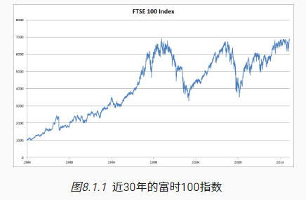

如果要预测 t 时刻的价格$X_t$，需要根据之前所有时刻推测出概率。写成公式如下

$$x_t \sim P(x_t \mid x_{t-1}, \ldots, x_1)$$

##### 8.1.1.1. 自回归模型

输入是$X_{t-1},...,X_1$，但是因为这个 t 会一直变，导致输入的数据量是不固定的。要把这个转成回归模型，有两种策略

1. 自回归模型

   假设只有最近的一段时间$\tau$里的数据是有效的，只用$X_{t-1},...,X_{t-\tau}$的数据训练

2. 隐变量回归模型

   总结一个新的基于 t 的函数$h_t$, $h_t = g(h_{t-1},x_{t-1})$ , $\hat{x}_t = P(x_t \mid h_{t})$估计$x_t$

   

这里有一个统计学假设，假设随时间变化，统计的性质不变。就是说均值和方差不变

$$P(x_1, \ldots, x_T) = \prod_{t=1}^T P(x_t \mid x_{t-1}, \ldots, x_1)$$

这个公式的含义是：序列中每个元素的出现都可能依赖于前面所有元素的情况，因此计算整个序列出现的概率时，需要将序列中每个元素在给定前面元素的情况下出现的概率相乘

##### 8.1.1.2. 马尔可夫模型

马尔可夫假设（Markov assumption）是一种统计假设，它指出一个系统的未来状态仅依赖于其当前状态，而与更早的状态无关

**一阶马尔可夫链**

对于一阶马尔可夫链，每个状态只依赖于它之前的一个状态：

$P(X_{n+1} = x | X_1 = x_1, X_2 = x_2, \ldots, X_n = x_n) = P(X_{n+1} = x | X_n = x_n)$

**高阶马尔可夫链**

对于二阶马尔可夫链，每个状态依赖于之前的两个状态：

$P(X_{n+1} = x | X_1 = x_1, X_2 = x_2, \ldots, X_n = x_n) = P(X_{n+1} = x | X_{n-1} = x_{n-1}, X_n = x_n)$

#### 8.1.2. 训练

使用 1 个正弦函数产生数据，然后用模型来推测后面的结果

```python
'''用正弦+噪音产生训练数据'''
T = 1000  # 总共产生1000个点
time = torch.arange(1, T + 1, dtype=torch.float32)
x = torch.sin(0.01 * time) + torch.normal(0, 0.2, (T,))
d2l.plot(time, [x], 'time', 'x', xlim=[1, 1000], figsize=(6, 3))

'''features - 输入 996x4, 这里4行，是因为要用t之前4个时刻的数据推测出t。每一行是代表t-1,t-2,t-3,t-4'''
'''labels - 输出 996x1'''
tau = 4
features = torch.zeros((T - tau, tau))
for i in range(tau):
    features[:, i] = x[i: T - tau + i]
labels = x[tau:].reshape((-1, 1))

batch_size, n_train = 16, 600
# 只有前n_train个样本用于训练
train_iter = d2l.load_array((features[:n_train], labels[:n_train]),
                            batch_size, is_train=True)


# 初始化网络权重的函数
def init_weights(m):
    if type(m) == nn.Linear:
        nn.init.xavier_uniform_(m.weight)

# 一个简单的多层感知机
def get_net():
    net = nn.Sequential(nn.Linear(4, 10),
                        nn.ReLU(),
                        nn.Linear(10, 1))
    net.apply(init_weights)
    return net

# 平方损失。注意：MSELoss计算平方误差时不带系数1/2
loss = nn.MSELoss(reduction='none')

def train(net, train_iter, loss, epochs, lr):
    trainer = torch.optim.Adam(net.parameters(), lr)
    for epoch in range(epochs):
        for X, y in train_iter:
            trainer.zero_grad()
            l = loss(net(X), y)
            l.sum().backward()
            trainer.step()
        print(f'epoch {epoch + 1}, '
              f'loss: {d2l.evaluate_loss(net, train_iter, loss):f}')
'''训练'''
net = get_net()
train(net, train_iter, loss, 5, 0.01)
'''推理'''
onestep_preds = net(features)
d2l.plot([time, time[tau:]],
         [x.detach().numpy(), onestep_preds.detach().numpy()], 'time',
         'x', legend=['data', '1-step preds'], xlim=[1, 1000],
         figsize=(6, 3))
```

4 步推理的话，那么预测未来 4 步以后的结果就不准

如果步数变大，比如 64 步，那整个曲线就会不准

### 8.2. 文本预处理

#### token

词元，就是把一个文本拆成 1 个个单词，每个单词就叫 1 个 token

#### Vocab

词表，维护 1 个数组，每个 token 放在数组里，有 1 个 idx。整个数组按照 token 出现频率的降序排列

从文本中获取每个单词出现的频率，作为输入

```python
'''读取数据'''
d2l.DATA_HUB['time_machine'] = (d2l.DATA_URL + 'timemachine.txt',
                                '090b5e7e70c295757f55df93cb0a180b9691891a')

def read_time_machine():  #@save
    """将时间机器数据集加载到文本行的列表中"""
    with open(d2l.download('time_machine'), 'r') as f:
        lines = f.readlines()
    return [re.sub('[^A-Za-z]+', ' ', line).strip().lower() for line in lines]

lines = read_time_machine()
print(f'# 文本总行数: {len(lines)}')
print(lines[0])
print(lines[10])

'''词元化，把文本拆成单词'''
def tokenize(lines, token='word'):  #@save
    """将文本行拆分为单词或字符词元"""
    if token == 'word':
        return [line.split() for line in lines]
    elif token == 'char':
        return [list(line) for line in lines]
    else:
        print('错误：未知词元类型：' + token)

tokens = tokenize(lines)
# for i in range(11):
#     print(tokens[i])

'''词表，统计每个词出现的频率'''
class Vocab:  #@save
    """文本词表"""
    def __init__(self, tokens=None, min_freq=0, reserved_tokens=None):
        if tokens is None:
            tokens = []
        if reserved_tokens is None:
            reserved_tokens = []
        # 按出现频率排序
        counter = count_corpus(tokens)
        self._token_freqs = sorted(counter.items(), key=lambda x: x[1],
                                   reverse=True)
        # 未知词元的索引为0
        self.idx_to_token = ['<unk>'] + reserved_tokens
        self.token_to_idx = {token: idx
                             for idx, token in enumerate(self.idx_to_token)}
        for token, freq in self._token_freqs:
            if freq < min_freq:
                break
            if token not in self.token_to_idx:
                self.idx_to_token.append(token)
                self.token_to_idx[token] = len(self.idx_to_token) - 1

    def __len__(self):
        return len(self.idx_to_token)

    def __getitem__(self, tokens):
        if not isinstance(tokens, (list, tuple)):
            return self.token_to_idx.get(tokens, self.unk)
        return [self.__getitem__(token) for token in tokens]

    def to_tokens(self, indices):
        if not isinstance(indices, (list, tuple)):
            return self.idx_to_token[indices]
        return [self.idx_to_token[index] for index in indices]

    @property
    def unk(self):  # 未知词元的索引为0
        return 0

    @property
    def token_freqs(self):
        return self._token_freqs

def count_corpus(tokens):  #@save
    """统计词元的频率"""
    # 这里的tokens是1D列表或2D列表
    if len(tokens) == 0 or isinstance(tokens[0], list):
        # 将词元列表展平成一个列表
        tokens = [token for line in tokens for token in line]
    # collections.Counter(a)是标准python库，统计数组a中每个字符串出现的次数，并且统计成字典
    return collections.Counter(tokens)

vocab = Vocab(tokens)
print(list(vocab.token_to_idx.items())[:10])

for i in [0, 10]:
    print('文本:', tokens[i])
    print('索引:', vocab[tokens[i]])

'''合在一起使用'''
def load_corpus_time_machine(max_tokens=-1):  #@save
    """返回时光机器数据集的词元索引列表和词表"""
    lines = read_time_machine()
    tokens = tokenize(lines, 'char')
    vocab = Vocab(tokens)
    # 因为时光机器数据集中的每个文本行不一定是一个句子或一个段落，
    # 所以将所有文本行展平到一个列表中
    # 下面是个二重循环，先是从tokens中遍历line，再从line中遍历每个字符，变成token
    # vocab[token]返回的是这个字符串出现的频率，corpus就是一个所有字符串出现频率的list
    corpus = [vocab[token] for line in tokens for token in line]
    if max_tokens > 0:
        corpus = corpus[:max_tokens]
    return corpus, vocab

corpus, vocab = load_corpus_time_machine()
len(corpus), len(vocab)
```

### 8.3. 语言模型和数据集

可以将一句话看成是一个长度为$\Tau$的序列$x_1,x_2,...,x_{\tau}$。联合概率是$P(x_1, x_2, \ldots, x_T).$

那么第 t 个词的预测可以表达为$x_t \sim P(x_t \mid x_{t-1}, \ldots, x_1)$

#### 8.3.1. 学习语言模型

基本概率规则：

$$P(x_1, x_2, \ldots, x_T) = \prod_{t=1}^T P(x_t \mid x_1, \ldots, x_{t-1})$$

例如，包含了四个单词的一个文本序列的概率是：

$$ P(\text{deep}, \text{learning}, \text{is}, \text{fun}) = P(\text{deep}) P(\text{learning} \mid \text{deep}) P(
\text{is} \mid \text{deep}, \text{learning}) P(\text{fun} \mid \text{deep}, \text{learning}, \text{is})
$$

因为对于很多低频的词，类似 deep learning 这样的词，出现概率很低。所以用*拉普拉斯平滑*（Laplace smoothing）， 具体方法是在所有计数中添加一个小常量。 用 n 表示训练集中的单词总数，用 m
表示唯一单词的数量。 此解决方案有助于处理单元素问题

$$ \begin{aligned}

\hat{P}(x) & = \frac{n(x) + \epsilon_1/m}{n + \epsilon_1}, \\

\hat{P}(x' \mid x) & = \frac{n(x, x') + \epsilon_2 \hat{P}(x')}{n(x) + \epsilon_2}, \\

\hat{P}(x'' \mid x,x') & = \frac{n(x, x',x'') + \epsilon_3 \hat{P}(x'')}{n(x, x') + \epsilon_3}.

\end{aligned}
$$

其中，$\epsilon_1,\epsilon_2$和$\epsilon_3$是超参数。以$\epsilon_1$为例：当$\epsilon_1 = 0$时，不应用平滑；当$\epsilon_1$接近正无穷大时，$\hat{P}(x)$接近均匀概率分布$1/m$

$n(x)$和$n(x, x')$分别是单个单词和连续单词对的出现次数

#### 8.3.2. 马尔可夫模型与 n 元语法

如果$P(x_{t+1} \mid x_t, \ldots, x_1) = P(x_{t+1} \mid x_t)$，则序列上的分布满足一阶马尔可夫性质。

阶数越高，对应的依赖关系就越长。这种性质推导出了许多可以应用于序列建模的近似公式：

$$
\begin{aligned}

P(x_1, x_2, x_3, x_4) &=  P(x_1) P(x_2) P(x_3) P(x_4),\\

P(x_1, x_2, x_3, x_4) &=  P(x_1) P(x_2  \mid  x_1) P(x_3  \mid  x_2) P(x_4  \mid  x_3),\\

P(x_1, x_2, x_3, x_4) &=  P(x_1) P(x_2  \mid  x_1) P(x_3  \mid  x_1, x_2) P(x_4  \mid  x_2, x_3).

\end{aligned}
$$

通常，涉及一个、两个和三个变量的概率公式分别被称为**一元语法**（unigram）、**二元语法**（bigram）和**三元语法**（trigram）模型。

#### 8.3.3. 自然语言统计

根据下图统计可以看到，最流行的词看起来很无聊， 这些词通常被称为*停用词*（stop words），因此可以被过滤掉。 尽管如此，它们本身仍然是有意义的，我们仍然会在模型中使用它们。 此外，还有个明显的问题是词频衰减的速度相当地快。
例如，最常用单词的词频对比，第 10 个还不到第 1 个的 1/5。


第$i$个最常用单词的频率$n_i$为：

$$n_i \propto \frac{1}{i^\alpha},$$

等价于

$$\log n_i = -\alpha \log i + c,$$

其中$\alpha$是刻画分布的指数，$c$是常数。

齐普夫定律预测，排名第一的单词（即最常见的单词）的出现频率将是排名第二的单词的两倍，是排名第三的单词的三倍，依此类推

一元语法、二元语法和三元语法的对比图如下


1. 除了一元语法词，单词序列似乎也遵循齐普夫定律，
   尽管公式 [(8.3.7)](https://zh-v2.d2l.ai/chapter_recurrent-neural-networks/language-models-and-dataset.html#equation-eq-zipf-law)中的指数
   n 更小 （指数的大小受序列长度的影响）；
2. 词表中 n 元组的数量并没有那么大，这说明语言中存在相当多的结构， 这些结构给了我们应用模型的希望；
3. 很多 n 元组很少出现，这使得拉普拉斯平滑非常不适合语言建模。 作为代替，我们将使用基于深度学习的模型。

#### 8.3.4. 读取长序列数据

从什么偏移获取序列，有两种策略。_随机采样_（random sampling）和 _顺序分区_（sequential partitioning）

##### 8.3.4.1. 随机采样

```python
def seq_data_iter_random(corpus, batch_size, num_steps):  #@save
    """使用随机抽样生成一个小批量子序列"""
    # 从随机偏移量开始对序列进行分区，随机范围包括num_steps-1
    corpus = corpus[random.randint(0, num_steps - 1):]
    # 减去1，是因为我们需要考虑标签
    num_subseqs = (len(corpus) - 1) // num_steps
    # 长度为num_steps的子序列的起始索引
    initial_indices = list(range(0, num_subseqs * num_steps, num_steps))
    # 在随机抽样的迭代过程中，
    # 来自两个相邻的、随机的、小批量中的子序列不一定在原始序列上相邻
    random.shuffle(initial_indices)

    def data(pos):
        # 返回从pos位置开始的长度为num_steps的序列
        return corpus[pos: pos + num_steps]

    num_batches = num_subseqs // batch_size
    for i in range(0, batch_size * num_batches, batch_size):
        # 在这里，initial_indices包含子序列的随机起始索引
        initial_indices_per_batch = initial_indices[i: i + batch_size]
        X = [data(j) for j in initial_indices_per_batch]
        Y = [data(j + 1) for j in initial_indices_per_batch]
        yield torch.tensor(X), torch.tensor(Y)

my_seq = list(range(35))
for X, Y in seq_data_iter_random(my_seq, batch_size=2, num_steps=5):
    print('X: ', X, '\nY:', Y)

X:  tensor([[13, 14, 15, 16, 17],
       		[28, 29, 30, 31, 32]])
Y: tensor([[14, 15, 16, 17, 18],
           [29, 30, 31, 32, 33]])
X:  tensor([[ 3,  4,  5,  6,  7],
         	[18, 19, 20, 21, 22]])
Y: tensor([[ 4,  5,  6,  7,  8],
           [19, 20, 21, 22, 23]])
X:  tensor([[ 8,  9, 10, 11, 12],
       	    [23, 24, 25, 26, 27]])
Y: tensor([[ 9, 10, 11, 12, 13],
           [24, 25, 26, 27, 28]])
```

##### 8.3.4.2. 顺序分区

```python
def seq_data_iter_sequential(corpus, batch_size, num_steps):  #@save
    """使用顺序分区生成一个小批量子序列"""
    # 从随机偏移量开始划分序列
    offset = random.randint(0, num_steps)
    num_tokens = ((len(corpus) - offset - 1) // batch_size) * batch_size
    Xs = torch.tensor(corpus[offset: offset + num_tokens])
    Ys = torch.tensor(corpus[offset + 1: offset + 1 + num_tokens])
    Xs, Ys = Xs.reshape(batch_size, -1), Ys.reshape(batch_size, -1)
    num_batches = Xs.shape[1] // num_steps
    for i in range(0, num_steps * num_batches, num_steps):
        X = Xs[:, i: i + num_steps]
        Y = Ys[:, i: i + num_steps]
        yield X, Y
for X, Y in seq_data_iter_sequential(my_seq, batch_size=2, num_steps=5):
    print('X: ', X, '\nY:', Y)

X:  tensor([[ 0,  1,  2,  3,  4],
        [17, 18, 19, 20, 21]])
Y: tensor([[ 1,  2,  3,  4,  5],
        [18, 19, 20, 21, 22]])
X:  tensor([[ 5,  6,  7,  8,  9],
        [22, 23, 24, 25, 26]])
Y: tensor([[ 6,  7,  8,  9, 10],
        [23, 24, 25, 26, 27]])
X:  tensor([[10, 11, 12, 13, 14],
        [27, 28, 29, 30, 31]])
Y: tensor([[11, 12, 13, 14, 15],
        [28, 29, 30, 31, 32]])
```

两种方法包装到一个类里

```python
class SeqDataLoader:  #@save
    """加载序列数据的迭代器"""
    def __init__(self, batch_size, num_steps, use_random_iter, max_tokens):
        if use_random_iter:
            self.data_iter_fn = d2l.seq_data_iter_random
        else:
            self.data_iter_fn = d2l.seq_data_iter_sequential
        self.corpus, self.vocab = d2l.load_corpus_time_machine(max_tokens)
        self.batch_size, self.num_steps = batch_size, num_steps

    def __iter__(self):
        return self.data_iter_fn(self.corpus, self.batch_size, self.num_steps)

def load_data_time_machine(batch_size, num_steps,  #@save
                           use_random_iter=False, max_tokens=10000):
    """返回时光机器数据集的迭代器和词表"""
    data_iter = SeqDataLoader(
        batch_size, num_steps, use_random_iter, max_tokens)
    return data_iter, data_iter.vocab
```

### 8.4. 循环神经网络 RNN

使用隐变量模型，就是用一个隐状态替代概率

$$P(x_t \mid x_{t-1}, \ldots, x_1) \approx P(x_t \mid h_{t-1})$$

其中$h_{t-1}$是**隐状态**（hidden state），也称为**隐藏变量**（hidden variable），它存储了到时间步$t-1$的序列信息。

通常，我们可以基于当前输入$x_{t}$和先前隐状态$h_{t-1}$，来计算时间步$t$处的任何时间的隐状态：

$$h_t = f(x_{t}, h_{t-1})$$

值得注意的是，隐藏层和隐状态指的是两个截然不同的概念。 如上所述，隐藏层是在从输入到输出的路径上（以观测角度来理解）的隐藏的层， 而隐状态则是在给定步骤所做的任何事情（以技术角度来定义）的*输入*， 并且这些状态只能通过先前时间步的数据来计算

#### 8.4.1. 无隐状态的神经网络

设隐藏层的激活函数为$\phi$，给定一个小批量样本$\mathbf{X} \in \mathbb{R}^{n \times d}$，其中批量大小为$n$，输入维度为$d$，则隐藏层的输出$\mathbf{H} \in \mathbb{R}^{n \times h}$通过下式计算：

$$\mathbf{H} = \phi(\mathbf{X} \mathbf{W}_{xh} + \mathbf{b}_h)$$

上式我们拥有的隐藏层权重参数为$\mathbf{W}_{xh} \in \mathbb{R}^{d \times h}$，偏置参数为$\mathbf{b}_h \in \mathbb{R}^{1 \times h}$，以及隐藏单元的数目为$h$。

将隐藏变量$\mathbf{H}$用作输出层的输入。输出层由下式给出：

$$\mathbf{O} = \mathbf{H} \mathbf{W}_{hq} + \mathbf{b}_q$$

其中，$\mathbf{O} \in \mathbb{R}^{n \times q}$是输出变量，$\mathbf{W}_{hq} \in \mathbb{R}^{h \times q}$是权重参数，$\mathbf{b}_q \in \mathbb{R}^{1 \times q}$是输出层的偏置参数。

如果是分类问题，我们可以用$\text{softmax}(\mathbf{O})$来计算输出类别的概率分布。

#### 8.4.2. 有隐状态的循环神经网络

假设我们在时间步$t$有小批量输入$\mathbf{X}_t \in \mathbb{R}^{n \times d}$。对于$n$个序列样本的小批量，$\mathbf{X}_t$的每一行对应于来自该序列的时间步$t$处的一个样本。接下来，用$\mathbf{H}_t  \in \mathbb{R}^{n \times h}$表示时间步$t$的隐藏变量。

与多层感知机不同的是，我们在这里保存了前一个时间步的隐藏变量$\mathbf{H}_{t-1}$，并引入了一个新的权重参数$\mathbf{W}_{hh} \in \mathbb{R}^{h \times h}$，来描述如何在当前时间步中使用前一个时间步的隐藏变量。

具体地说，当前时间步隐藏变量由当前时间步的输入与前一个时间步的隐藏变量一起计算得出：

$$\mathbf{H}_t = \phi(\mathbf{X}_t \mathbf{W}_{xh} + \mathbf{H}_{t-1} \mathbf{W}_{hh}  + \mathbf{b}_h).$$

对比上面的公式，多了$\mathbf{H}_{t-1} \mathbf{W}_{hh}$，这样的隐藏变量被称为**隐状态**（hidden state）。

由于在当前时间步中，隐状态使用的定义与前一个时间步中使用的定义相同，计算是**循环的**（recurrent）。

于是基于循环计算的隐状态神经网络被命名为**循环神经网络**（recurrent neural network）。

在循环神经网络中执行 $H_t$计算的层称为**循环层**（recurrent layer）。

对于时间步$t$，输出层的输出类似于多层感知机中的计算：

$$\mathbf{O}_t = \mathbf{H}_t \mathbf{W}_{hq} + \mathbf{b}_q.$$

循环神经网络的参数包括隐藏层的权重$\mathbf{W}_{xh} \in \mathbb{R}^{d \times h}, \mathbf{W}_{hh} \in \mathbb{R}^{h \times h}$和偏置$\mathbf{b}_h \in \mathbb{R}^{1 \times h}$，以及输出层的权重$\mathbf{W}_{hq} \in \mathbb{R}^{h \times q}$和偏置$\mathbf{b}_q \in \mathbb{R}^{1 \times q}$。

不同的时间步，循环神经网络也总是使用这些模型参数。因此，循环神经网络的参数开销不会随着时间步的增加而增加。

下图展示了循环神经网络在三个相邻时间步的计算逻辑。


在任意时间步$t$，隐状态的计算可以被视为：

1. 拼接当前时间步$t$的输入$\mathbf{X}*_t$和前一时间步$t-1$的隐状态$\mathbf{H}_*{t-1}$；
2. 将拼接的结果送入带有激活函数$\phi$的全连接层。全连接层的输出是当前时间步$t$的隐状态$\mathbf{H}_t$。

#### 8.4.3. 基于 RNN 的字符级语言模型

使用的批量大小为$n>1$，每个词元都由一个$d$维向量表示。因此，在时间步$t$输入$\mathbf X_t$将是一个$n\times d$矩阵

#### 8.4.4. 困惑度（Perplexity）

我们可以通过一个序列中所有的 n 个词元的交叉熵损失的平均值来衡量语言模型的质量

$$\frac{1}{n} \sum_{t=1}^n -\log P(x_t \mid x_{t-1}, \ldots, x_1)$$

其中 P 由语言模型给出， $x_t$是在时间步 t 从该序列中观察到的实际词元

**困惑度**（perplexity）

$$\exp\left(-\frac{1}{n} \sum_{t=1}^n \log P(x_t \mid x_{t-1}, \ldots, x_1)\right)$$

困惑度的最好的理解是“下一个词元的实际选择数的调和平均数”。

- 在最好的情况下，模型总是完美地估计标签词元的概率为 1。 在这种情况下，模型的困惑度为 1。
- 在最坏的情况下，模型总是预测标签词元的概率为 0。 在这种情况下，困惑度是正无穷大。
- 在基线上，该模型的预测是词表的所有可用词元上的均匀分布

### 8.5. 循环神经网络的从零开始实现

```python
batch_size, num_steps = 32, 35
train_iter, vocab = d2l.load_data_time_machine(batch_size, num_steps)
```

#### 8.5.1. 独热编码

正常情况下，如果一共有 N 个词(len(vocab))，那么独热向量就是 1xN 的一维向量，其他都是 0，第 i 个为 1 表示第 i 个词

但现在因为要看之前几个词(时间步数 s)，一次又要推导出多个词(批量大小 b)。所以变成 sxbxN 的 3 维张量

```python
X = torch.arange(10).reshape((2, 5)) #输入的时候，行代表批量b,列代表时间步数s
F.one_hot(X.T, 28).shape
# torch.Size([5, 2, 28])
```

#### 8.5.2. 初始化模型参数

隐藏单元数`num_hiddens`是一个可调的超参数。 当训练语言模型时，输入和输出来自相同的词表。 因此，它们具有相同的维度，即词表的大小

```python
def get_params(vocab_size, num_hiddens, device):
    num_inputs = num_outputs = vocab_size

    def normal(shape):
        return torch.randn(size=shape, device=device) * 0.01

    # 隐藏层参数
    W_xh = normal((num_inputs, num_hiddens))
    W_hh = normal((num_hiddens, num_hiddens))
    b_h = torch.zeros(num_hiddens, device=device)
    # 输出层参数
    W_hq = normal((num_hiddens, num_outputs))
    b_q = torch.zeros(num_outputs, device=device)
    # 附加梯度
    params = [W_xh, W_hh, b_h, W_hq, b_q]
    for param in params:
        param.requires_grad_(True)
    return params
```

#### 8.5.3. 循环神经网络模型

这个函数的返回是一个张量，张量全用 0 填充， 形状为 批量大小 x 隐藏单元数

```py
def init_rnn_state(batch_size, num_hiddens, device):
    return (torch.zeros((batch_size, num_hiddens), device=device), )
```

使用 tanh 函数作为激活函数。 如 [4.1 节](https://zh-v2.d2l.ai/chapter_multilayer-perceptrons/mlp.html#sec-mlp)所述， 当元素在实数上满足均匀分布时，tanh
函数的平均值为 0

```python
def rnn(inputs, state, params):
    # inputs的形状：(时间步数量，批量大小，词表大小)
    W_xh, W_hh, b_h, W_hq, b_q = params
    H, = state
    outputs = []
    # X的形状：(批量大小，词表大小)
    for X in inputs:
        H = torch.tanh(torch.mm(X, W_xh) + torch.mm(H, W_hh) + b_h)
        Y = torch.mm(H, W_hq) + b_q
        outputs.append(Y)
    return torch.cat(outputs, dim=0), (H,)

class RNNModelScratch: #@save
    """从零开始实现的循环神经网络模型"""
    def __init__(self, vocab_size, num_hiddens, device,
                 get_params, init_state, forward_fn):
        self.vocab_size, self.num_hiddens = vocab_size, num_hiddens
        self.params = get_params(vocab_size, num_hiddens, device)
        self.init_state, self.forward_fn = init_state, forward_fn

    def __call__(self, X, state):
        X = F.one_hot(X.T, self.vocab_size).type(torch.float32)
        return self.forward_fn(X, state, self.params)

    def begin_state(self, batch_size, device):
        return self.init_state(batch_size, self.num_hiddens, device)

# 检查形状
num_hiddens = 512
net = RNNModelScratch(len(vocab), num_hiddens, d2l.try_gpu(), get_params,
                      init_rnn_state, rnn)
state = net.begin_state(X.shape[0], d2l.try_gpu())
# 这里X是上面独热编码定义的2x5(bxs)
# new_state是隐藏层输出
Y, new_state = net(X.to(d2l.try_gpu()), state)
Y.shape
'''(torch.Size([10, 28]) sxn'''
len(new_state)
'''1'''
new_state[0].shape
'''torch.Size([2, 512])) bx隐藏层数'''
```

#### 8.5.4. 预测

预热期其实就是先拿输入的几个词来产生隐藏层的输出，再拿这个输出最后做预测

```python
def predict_ch8(prefix, num_preds, net, vocab, device):  #@save
    """在prefix后面生成新字符"""
    state = net.begin_state(batch_size=1, device=device)
    outputs = [vocab[prefix[0]]]
    get_input = lambda: torch.tensor([outputs[-1]], device=device).reshape((1, 1))
    for y in prefix[1:]:  # 预热期
        _, state = net(get_input(), state)
        outputs.append(vocab[y])
    for _ in range(num_preds):  # 预测num_preds步
        y, state = net(get_input(), state)
        outputs.append(int(y.argmax(dim=1).reshape(1)))
    return ''.join([vocab.idx_to_token[i] for i in outputs])

predict_ch8('time traveller ', 10, net, vocab, d2l.try_gpu())
'time traveller aaaaaaaaaa'
```

#### 8.5.5. 梯度裁剪

如果我们很少得到很大的梯度，这个时候又不想通过降低学习率$\eta$。这个时候可以假设一个很大的值$\theta$, 把得出梯度 g 按以下公式缩减

$g = g * \frac{\theta}{\|\mathbf{g}\|}$

```python
def grad_clipping(net, theta):  #@save
    """裁剪梯度"""
    if isinstance(net, nn.Module):
        params = [p for p in net.parameters() if p.requires_grad]
    else:
        params = net.params
    norm = torch.sqrt(sum(torch.sum((p.grad ** 2)) for p in params))
    if norm > theta:
        for param in params:
            param.grad[:] *= theta / norm
```

#### 8.5.6. 训练

在训练模型之前，让我们定义一个函数在一个迭代周期内训练模型。
它与我们训练 [3.6 节](https://zh-v2.d2l.ai/chapter_linear-networks/softmax-regression-scratch.html#sec-softmax-scratch)模型的方式有三个不同之处。

1. 序列数据的不同采样方法（随机采样和顺序分区）将导致隐状态初始化的差异。
2. 我们在更新模型参数之前裁剪梯度。 这样的操作的目的是，即使训练过程中某个点上发生了梯度爆炸，也能保证模型不会发散。
3. 我们用困惑度来评价模型。如 [8.4.4 节](https://zh-v2.d2l.ai/chapter_recurrent-neural-networks/rnn.html#subsec-perplexity)所述，
   这样的度量确保了不同长度的序列具有可比性。

```python
#@save
# 返回的是困惑度
def train_epoch_ch8(net, train_iter, loss, updater, device, use_random_iter):
    """训练网络一个迭代周期（定义见第8章）"""
    state, timer = None, d2l.Timer()
    metric = d2l.Accumulator(2)  # 训练损失之和,词元数量
    for X, Y in train_iter:
        if state is None or use_random_iter:
            # 在第一次迭代或使用随机抽样时初始化state
            state = net.begin_state(batch_size=X.shape[0], device=device)
        else:
            if isinstance(net, nn.Module) and not isinstance(state, tuple):
                # state对于nn.GRU是个张量
                state.detach_()
            else:
                # state对于nn.LSTM或对于我们从零开始实现的模型是个张量
                for s in state:
                    s.detach_()
        y = Y.T.reshape(-1)
        X, y = X.to(device), y.to(device)
        y_hat, state = net(X, state)
        l = loss(y_hat, y.long()).mean()
        if isinstance(updater, torch.optim.Optimizer):
            updater.zero_grad()
            l.backward()
            grad_clipping(net, 1)
            updater.step()
        else:
            l.backward()
            grad_clipping(net, 1)
            # 因为已经调用了mean函数
            updater(batch_size=1)
        metric.add(l * y.numel(), y.numel())
    return math.exp(metric[0] / metric[1]), metric[1] / timer.stop()

#@save
# 这里设损失函数，初始化预测方式和更新方式
def train_ch8(net, train_iter, vocab, lr, num_epochs, device,
              use_random_iter=False):
    """训练模型（定义见第8章）"""
    loss = nn.CrossEntropyLoss()
    animator = d2l.Animator(xlabel='epoch', ylabel='perplexity',
                            legend=['train'], xlim=[10, num_epochs])
    # 初始化
    if isinstance(net, nn.Module):
        updater = torch.optim.SGD(net.parameters(), lr)
    else:
        updater = lambda batch_size: d2l.sgd(net.params, lr, batch_size)
    predict = lambda prefix: predict_ch8(prefix, 50, net, vocab, device)
    # 训练和预测
    for epoch in range(num_epochs):
        ppl, speed = train_epoch_ch8(
            net, train_iter, loss, updater, device, use_random_iter)
        if (epoch + 1) % 10 == 0:
            print(predict('time traveller'))
            animator.add(epoch + 1, [ppl])
    print(f'困惑度 {ppl:.1f}, {speed:.1f} 词元/秒 {str(device)}')
    print(predict('time traveller'))
    print(predict('traveller'))

num_epochs, lr = 500, 1
net = RNNModelScratch(len(vocab), num_hiddens, d2l.try_gpu(), get_params,
                      init_rnn_state, rnn)
train_ch8(net, train_iter, vocab, lr, num_epochs, d2l.try_gpu())
```

### 8.6. 循环神经网络的简洁实现

```python
batch_size, num_steps = 32, 35
train_iter, vocab = text_rnn_82.load_data_time_machine(batch_size, num_steps)

num_hiddens = 256
rnn_layer = nn.RNN(len(vocab), num_hiddens)

state = torch.zeros((1, batch_size, num_hiddens))
print(state.shape)
'''torch.Size([1, 32, 256])'''

X = torch.rand(size=(num_steps, batch_size, len(vocab)))
Y, state_new = rnn_layer(X, state)
print(Y.shape, state_new.shape)
'''(torch.Size([35, 32, 256]), torch.Size([1, 32, 256]))'''

class RNNModel(nn.Module):
    """循环神经网络模型"""
    def __init__(self, rnn_layer, vocab_size, **kwargs):
        super(RNNModel, self).__init__(**kwargs)
        self.rnn = rnn_layer
        self.vocab_size = vocab_size
        self.num_hiddens = self.rnn.hidden_size
        # 如果RNN是双向的（之后将介绍），num_directions应该是2，否则应该是1
        if not self.rnn.bidirectional:
            self.num_directions = 1
            self.linear = nn.Linear(self.num_hiddens, self.vocab_size)
        else:
            self.num_directions = 2
            self.linear = nn.Linear(self.num_hiddens * 2, self.vocab_size)

    def forward(self, inputs, state):
        X = F.one_hot(inputs.T.long(), self.vocab_size)
        X = X.to(torch.float32)
        Y, state = self.rnn(X, state)
        # 全连接层首先将Y的形状改为(时间步数*批量大小,隐藏单元数)
        # 它的输出形状是(时间步数*批量大小,词表大小)。
        output = self.linear(Y.reshape((-1, Y.shape[-1])))
        return output, state

    def begin_state(self, device, batch_size=1):
        if not isinstance(self.rnn, nn.LSTM):
            # nn.GRU以张量作为隐状态
            return  torch.zeros((self.num_directions * self.rnn.num_layers,
                                 batch_size, self.num_hiddens),
                                device=device)
        else:
            # nn.LSTM以元组作为隐状态
            return (torch.zeros((
                self.num_directions * self.rnn.num_layers,
                batch_size, self.num_hiddens), device=device),
                    torch.zeros((
                        self.num_directions * self.rnn.num_layers,
                        batch_size, self.num_hiddens), device=device))

device = d2l.try_gpu()
net = RNNModel(rnn_layer, vocab_size=len(vocab))
net = net.to(device)
rnn_scratch_85.predict_ch8('time traveller', 10, net, vocab, device)

num_epochs, lr = 500, 1
rnn_scratch_85.train_ch8(net, train_iter, vocab, lr, num_epochs, device)
```

### 8.7. 通过时间反向传播

因为 RNN 的前向传播多一个变量输入 state，所以如果要做反向传播的话，计算量非常大

#### 8.7.1. 循环神经网络的梯度分析

RNN 的简化基本公式，时间步$t$的隐状态表示为$h_t$，输入表示为$x_t$，输出表示为$o_t$。$w_h$和$w_o$来表示隐藏层和输出层的权重

$$ \begin{aligned}h_t &= f(x_t, h_{t-1}, w_h),\\ o_t &= g(h_t, w_o),\end{aligned} $$

在 T 个时间步内的损失函数如下，l(y,o)表示某个点的损失函数

$$L(x_1, \ldots, x_T, y_1, \ldots, y_T, w_h, w_o) = \frac{1}{T}\sum_{t=1}^T l(y_t, o_t)$$

计算目标函数$L$关于参数$w_h$的梯度

$$ \begin{aligned}\frac{\partial L}{\partial w_h} & = \frac{1}{T}\sum_{t=1}^T \frac{\partial l(y_t, o_t)}{\partial w_h}
\\& = \frac{1}{T}\sum_{t=1}^T \frac{\partial l(y_t, o_t)}{\partial o_t} \frac{\partial g(h_t, w_o)}{\partial h_t}
\frac{\partial h_t}{\partial w_h}\end{aligned} $$

其中$\partial h_t/\partial w_h$比较难计算，$h_t$既依赖于$h_{t-1}$又依赖于$w_h$

$$
\frac{\partial h_t}{\partial w_h}= \frac{\partial f(x_{t},h_{t-1},w_h)}{\partial w_h} +\frac{\partial f(x_{t},h_{t-1},w_h)}{\partial h_{t-1}} \frac{\partial h_{t-1}}{\partial w_h}
$$

所以如果要递归地计算下去

$$ \frac{\partial h_t}{\partial w_h}=\frac{\partial f(x_{t},h_{t-1},w_h)}{\partial w_h}+\sum_{i=1}^{t-1}\left(\prod_
{j=i+1}^{t} \frac{\partial f(x_{j},h_{j-1},w_h)}{\partial h_{j-1}} \right) \frac{\partial f(x_{i},h_{i-1},w_h)}{\partial
w_h} $$

为了计算这个有 3 种方式

1. 完全计算 - 基本不用

2. 截断时间步 - 在$\tau$步后截断，将求和终止为$\partial h_{t-\tau}/\partial w_h$

3. 随机截断 - 用一个随机变量替换$\partial h_t/\partial w_h$，这个随机变量是通过使用序列$\xi_t$来实现的，序列预定义了$0 \leq \pi_t \leq 1$，

   其中$P(\xi_t = 0) = 1-\pi_t$且$P(\xi_t = \pi_t^{-1}) = \pi_t$，因此$E[\xi_t] = 1$​。用它来替换

   梯度$\partial h_t/\partial w_h$得到：

   $$
   z_t= \frac{\partial f(x_{t},h_{t-1},w_h)}{\partial w_h} +\xi_t \frac{\partial f(x_{t},h_{t-1},w_h)}{\partial h_{t-1}} \frac{\partial h_{t-1}}{\partial w_h}
   $$

#### 8.7.2. 通过时间反向传播的细节

时间步 3 的隐状态$\mathbf{h}_3$的计算取决于模型参数$\mathbf{W}_{hx}$和$\mathbf{W}_{hh}$，以及最终时间步的隐状态$\mathbf{h}_2$。以及当前时间步的输入$\mathbf{x}_
3$。


## 9. 现代循环神经网络

循环神经网络在实践中一个常见问题是数值不稳定性。引入两个广泛使用的网络， 即*门控循环单元*（gated recurrent units，GRU）和 _长短期记忆网络_（long short-term memory，LSTM）

### 9.1. 门控循环单元（GRU）

几种异常情况需要处理

1. 某些观测值对结果的影响特别大，需要制定一个非常大的梯度
2. 某些词元需要跳过隐状态
3. 序列的各个部分之间存在逻辑中断，需要重置内部状态

#### 9.1.1. 门控隐状态

支持控制隐状态

##### 9.1.1.1. 重置门和更新门

重置门允许我们控制“可能还想记住”的过去状态的数量

更新门将允许我们控制新状态中有多少个是旧状态的副本

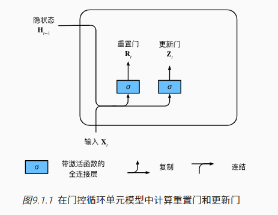

公式如下，这里$\sigma()$用的是 sigmoid 函数

$$ \begin{aligned} \mathbf{R}_t = \sigma(\mathbf{X}_t \mathbf{W}_{xr} + \mathbf{H}_{t-1} \mathbf{W}_{hr} + \mathbf{b}_r)
,\\ \mathbf{Z}_t = \sigma(\mathbf{X}_t \mathbf{W}_{xz} + \mathbf{H}_{t-1} \mathbf{W}_{hz} + \mathbf{b}_z), \end{aligned}
$$

##### 9.1.1.2. 候选隐状态

时间步$t$的**候选隐状态**（candidate hidden state）$\tilde{\mathbf{H}}_t \in \mathbb{R}^{n \times h}$。符号$\odot$是 Hadamard
积（按元素乘积）运算符

$$\tilde{\mathbf{H}}_t = \tanh(\mathbf{X}_t \mathbf{W}_{xh} + \left(\mathbf{R}_t \odot \mathbf{H}_{t-1}\right)
\mathbf{W}_{hh} + \mathbf{b}_h),$$

$\mathbf{R}_t$和$\mathbf{H}_{t-1}$的元素相乘可以减少以往状态的影响。每当重置门$\mathbf{R}_t$中的项接近$1$时，我们恢复一个普通的循环神经网络。

对于重置门$\mathbf{R}_t$中所有接近$0$的项，候选隐状态是以$\mathbf{X}_t$作为输入的多层感知机的结果。因此，任何预先存在的隐状态都会被**重置**为默认值。


##### 9.1.1.3. 隐状态

上面只是候选隐状态，还要和更新门$Z_i$结合转换成真正的隐状态输出

$$\mathbf{H}_t = \mathbf{Z}_t \odot \mathbf{H}_{t-1}  + (1 - \mathbf{Z}_t) \odot \tilde{\mathbf{H}}_t.$$

每当更新门$\mathbf{Z}_t$接近$1$时，模型就倾向只保留旧状态。此时，来自$\mathbf{X}_t$的信息基本上被忽略，从而有效地跳过了依赖链条中的时间步$t$。

相反，当$\mathbf{Z}_t$接近$0$时，新的隐状态$\mathbf{H}_t$就会接近候选隐状态$\tilde{\mathbf{H}}_t$。


#### 9.1.2. 从零开始实现

```python
batch_size, num_steps = 32, 35
train_iter, vocab = d2l.load_data_time_machine(batch_size, num_steps)

def get_params(vocab_size, num_hiddens, device):
    num_inputs = num_outputs = vocab_size

    def normal(shape):
        return torch.randn(size=shape, device=device)*0.01

    def three():
        return (normal((num_inputs, num_hiddens)),
                normal((num_hiddens, num_hiddens)),
                torch.zeros(num_hiddens, device=device))

    W_xz, W_hz, b_z = three()  # 更新门参数
    W_xr, W_hr, b_r = three()  # 重置门参数
    W_xh, W_hh, b_h = three()  # 候选隐状态参数
    # 输出层参数
    W_hq = normal((num_hiddens, num_outputs))
    b_q = torch.zeros(num_outputs, device=device)
    # 附加梯度
    params = [W_xz, W_hz, b_z, W_xr, W_hr, b_r, W_xh, W_hh, b_h, W_hq, b_q]
    for param in params:
        param.requires_grad_(True)
    return params

def init_gru_state(batch_size, num_hiddens, device):
    return (torch.zeros((batch_size, num_hiddens), device=device), )

def gru(inputs, state, params):
    W_xz, W_hz, b_z, W_xr, W_hr, b_r, W_xh, W_hh, b_h, W_hq, b_q = params
    H, = state
    outputs = []
    for X in inputs:
        Z = torch.sigmoid((X @ W_xz) + (H @ W_hz) + b_z)
        R = torch.sigmoid((X @ W_xr) + (H @ W_hr) + b_r)
        H_tilda = torch.tanh((X @ W_xh) + ((R * H) @ W_hh) + b_h)
        H = Z * H + (1 - Z) * H_tilda
        Y = H @ W_hq + b_q
        outputs.append(Y)
    return torch.cat(outputs, dim=0), (H,)

vocab_size, num_hiddens, device = len(vocab), 256, d2l.try_gpu()
num_epochs, lr = 500, 1
model = rnn_scratch_85.RNNModelScratch(len(vocab), num_hiddens, device, get_params,
                            init_gru_state, gru)
rnn_scratch_85.train_ch8(model, train_iter, vocab, lr, num_epochs, device)
```

### 9.2. 长短期记忆网络（LSTM）

#### 9.2.1. 门控记忆元

长短期记忆网络引入了*记忆元*（memory cell），或简称为*单元*（cell）

为了控制记忆元，我们需要许多门。 其中一个门用来从单元中输出条目，我们将其称为*输出门*（output gate）。 另外一个门用来决定何时将数据读入单元，我们将其称为*输入门*（input gate）。 我们还需要一种机制来重置单元的内容，由*遗忘门*（forget gate）来管理

##### 9.2.1.1. 输入门、忘记门和输出门

由三个具有 sigmoid 激活函数的全连接层处理， 以计算输入门、遗忘门和输出门的值

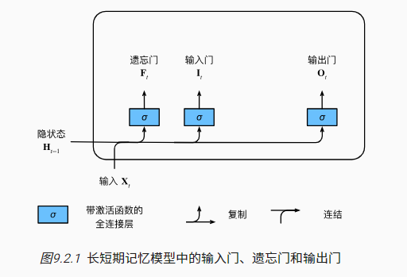

$$
\begin{aligned}
\mathbf{I}_t &= \sigma(\mathbf{X}_t \mathbf{W}_{xi} + \mathbf{H}_{t-1} \mathbf{W}_{hi} + \mathbf{b}_i),\\
\mathbf{F}_t &= \sigma(\mathbf{X}_t \mathbf{W}_{xf} + \mathbf{H}_{t-1} \mathbf{W}_{hf} + \mathbf{b}_f),\\
\mathbf{O}_t &= \sigma(\mathbf{X}_t \mathbf{W}_{xo} + \mathbf{H}_{t-1} \mathbf{W}_{ho} + \mathbf{b}_o),
\end{aligned}
$$

##### 9.2.1.2. 候选记忆元

**候选记忆元**（candidate memory cell）$\tilde{\mathbf{C}}_t \in \mathbb{R}^{n \times h}$。下面导出在时间步$t$处的方程：

$$\tilde{\mathbf{C}}_t = \text{tanh}(\mathbf{X}_t \mathbf{W}_{xc} + \mathbf{H}_{t-1} \mathbf{W}_{hc} + \mathbf{b}_c),$$


##### 9.2.1.3. 记忆元

输入门$\mathbf{I}_t$控制采用多少来自$\tilde{\mathbf{C}}_t$的新数据，而遗忘门$\mathbf{F}_t$控制保留多少过去的记忆元$\mathbf{C}_{t-1} \in \mathbb{R}^{n \times h}$的内容。

使用按元素乘法，得出：

$$\mathbf{C}_t = \mathbf{F}_t \odot \mathbf{C}_{t-1} + \mathbf{I}_t \odot \tilde{\mathbf{C}}_t.$$

如果遗忘门始终为$1$且输入门始终为$0$，则过去的记忆元$\mathbf{C}_{t-1}$将随时间被保存并传递到当前时间步。


##### 9.2.1.4. 隐状态

隐状态$\mathbf{H}_t \in \mathbb{R}^{n \times h}$，在长短期记忆网络中，它仅仅是记忆元的$\tanh$的门控版本。这就确保了$\mathbf{H}_t$的值始终在区间$(-1, 1)$内：

$$\mathbf{H}_t = \mathbf{O}_t \odot \tanh(\mathbf{C}_t).$$

只要输出门接近$1$，我们就能够有效地将所有记忆信息传递给预测部分，而对于输出门接近$0$，我们只保留记忆元内的所有信息，而不需要更新隐状态。

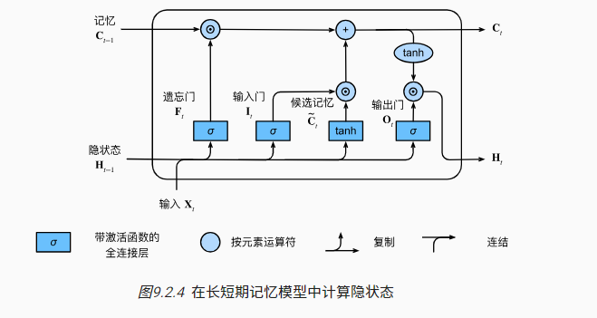

#### 9.2.2. 从零开始实现

```python
import torch
from torch import nn
from d2l import torch as d2l

batch_size, num_steps = 32, 35
train_iter, vocab = d2l.load_data_time_machine(batch_size, num_steps)

'''num_hiddens定义隐藏单元数量'''
def get_lstm_params(vocab_size, num_hiddens, device):
    num_inputs = num_outputs = vocab_size

    def normal(shape):
        return torch.randn(size=shape, device=device)*0.01

    def three():
        return (normal((num_inputs, num_hiddens)),
                normal((num_hiddens, num_hiddens)),
                torch.zeros(num_hiddens, device=device))

    W_xi, W_hi, b_i = three()  # 输入门参数
    W_xf, W_hf, b_f = three()  # 遗忘门参数
    W_xo, W_ho, b_o = three()  # 输出门参数
    W_xc, W_hc, b_c = three()  # 候选记忆元参数
    # 输出层参数
    W_hq = normal((num_hiddens, num_outputs))
    b_q = torch.zeros(num_outputs, device=device)
    # 附加梯度
    params = [W_xi, W_hi, b_i, W_xf, W_hf, b_f, W_xo, W_ho, b_o, W_xc, W_hc,
              b_c, W_hq, b_q]
    for param in params:
        param.requires_grad_(True)
    return params

'''定义模型'''
def init_lstm_state(batch_size, num_hiddens, device):
    return (torch.zeros((batch_size, num_hiddens), device=device),
            torch.zeros((batch_size, num_hiddens), device=device))

def lstm(inputs, state, params):
    [W_xi, W_hi, b_i, W_xf, W_hf, b_f, W_xo, W_ho, b_o, W_xc, W_hc, b_c,
     W_hq, b_q] = params
    (H, C) = state
    outputs = []
    for X in inputs:
        I = torch.sigmoid((X @ W_xi) + (H @ W_hi) + b_i)
        F = torch.sigmoid((X @ W_xf) + (H @ W_hf) + b_f)
        O = torch.sigmoid((X @ W_xo) + (H @ W_ho) + b_o)
        C_tilda = torch.tanh((X @ W_xc) + (H @ W_hc) + b_c)
        C = F * C + I * C_tilda
        H = O * torch.tanh(C)
        Y = (H @ W_hq) + b_q
        outputs.append(Y)
    return torch.cat(outputs, dim=0), (H, C)

'''训练'''
vocab_size, num_hiddens, device = len(vocab), 256, d2l.try_gpu()
num_epochs, lr = 500, 1
model = d2l.RNNModelScratch(len(vocab), num_hiddens, device, get_lstm_params,
                            init_lstm_state, lstm)
d2l.train_ch8(model, train_iter, vocab, lr, num_epochs, device)

```

#### 9.2.3. 简洁实现

```py
num_inputs = vocab_size
lstm_layer = nn.LSTM(num_inputs, num_hiddens)
model = d2l.RNNModel(lstm_layer, len(vocab))
model = model.to(device)
d2l.train_ch8(model, train_iter, vocab, lr, num_epochs, device)
```

### 9.3. 深度循环神经网络

具有 L 个隐藏层的深度循环神经网络， 每个隐状态都连续地传递到当前层的下一个时间步和下一层的当前时间步


#### 9.3.1. 函数依赖关系

假设在时间步$t$有一个小批量的输入数据$\mathbf{X}_t \in \mathbb{R}^{n \times d}$（样本数：$n$，每个样本中的输入数：$d$）。同时，将$l^\mathrm{th}$隐藏层（$l=1,\ldots,L$）的隐状态设为$\mathbf{H}_t^{(l)}  \in \mathbb{R}^{n \times h}$（隐藏单元数：$h$），输出层变量设为$\mathbf{O}_t \in \mathbb{R}^{n \times q}$（输出数：$q$）。设置$\mathbf{H}_t^{(0)} = \mathbf{X}_t$，第$l$个隐藏层的隐状态使用激活函数$\phi_l$，则：

$$\mathbf{H}_t^{(l)} = \phi_l(\mathbf{H}_t^{(l-1)} \mathbf{W}_{xh}^{(l)} + \mathbf{H}_{t-1}^{(l)} \mathbf{W}_{hh}^{(l)}  + \mathbf{b}_h^{(l)}),$$

其中，权重$\mathbf{W}_{xh}^{(l)} \in \mathbb{R}^{h \times h}$，$\mathbf{W}_{hh}^{(l)} \in \mathbb{R}^{h \times h}$和偏置$\mathbf{b}_h^{(l)} \in \mathbb{R}^{1 \times h}$都是第$l$个隐藏层的模型参数。

最后，输出层的计算仅基于第$l$个隐藏层最终的隐状态：

$$\mathbf{O}_t = \mathbf{H}_t^{(L)} \mathbf{W}_{hq} + \mathbf{b}_q,$$

其中，权重$\mathbf{W}_{hq} \in \mathbb{R}^{h \times q}$和偏置$\mathbf{b}_q \in \mathbb{R}^{1 \times q}$都是输出层的模型参数。

#### 9.3.2. 简洁实现

```python
import torch
from torch import nn
from d2l import torch as d2l

batch_size, num_steps = 32, 35
train_iter, vocab = d2l.load_data_time_machine(batch_size, num_steps)

vocab_size, num_hiddens, num_layers = len(vocab), 256, 2
num_inputs = vocab_size
device = d2l.try_gpu()
lstm_layer = nn.LSTM(num_inputs, num_hiddens, num_layers)
model = d2l.RNNModel(lstm_layer, len(vocab))
model = model.to(device)

num_epochs, lr = 500, 2
d2l.train_ch8(model, train_iter, vocab, lr*1.0, num_epochs, device)
```

### 9.4. 双向循环神经网络

#### 9.4.1. 隐马尔可夫模型中的动态规划

动态规划的核心就是把一个复杂问题拆成几个小问题

隐马尔可夫模型（Hidden Markov Model, HMM）是一种统计模型，用于描述一个含有隐藏未知状态的马尔可夫过程。在这个模型中，状态序列本身不是直接可见的，但可以通过观察每个状态产生的一系列可见输出（观测序列）来间接推断状态序列

**前向算法（评估问题）**

前向算法用于计算给定模型参数和观测序列 $O=o_1,o_2,…,o_T $的情况下，观测序列的概率*P*(*O*∣*λ*)。前向概率 $α_t(i)$表示在时间 t 观测到序列 $o_1,o_2,…,o_t $并且状态为 i 的概率

**初始化：**

$$
\alpha_1(i) = \pi_i b_i(o_1) \quad \text{for all } i
$$

**递推（递归更新前向概率）：**

$$
\alpha_{t+1}(j) = \left[ \sum_{i=1}^{N} \alpha_t(i) a_{ij} \right] b_j(o_{t+1}) \quad \text{for all } j, 1 \leq t \leq T-1
$$

**终止：**

$$
P(O|\lambda) = \sum_{i=1}^{N} \alpha_T(i)
$$

#### 9.4.2. 双向模型

_双向循环神经网络_（bidirectional RNNs）
添加了反向传递信息的隐藏层，以便更灵活地处理此类信息。 [图 9.4.2](https://zh-v2.d2l.ai/chapter_recurrent-modern/bi-rnn.html#fig-birnn)描述了具有单个隐藏层的双向循环神经网络的架构


##### 9.4.2.1. 定义

对于任意时间步$t$，给定一个小批量的输入数据$\mathbf{X}_t \in \mathbb{R}^{n \times d}$（样本数$n$，每个示例中的输入数$d$），并且令隐藏层激活函数为$\phi$。

在双向架构中，我们设该时间步的前向和反向隐状态分别为$\overrightarrow{\mathbf{H}}_t  \in \mathbb{R}^{n \times h}$和$\overleftarrow{\mathbf{H}}_t  \in \mathbb{R}^{n \times h}$，其中$h$是隐藏单元的数目。

前向和反向隐状态的更新如下：

$$
\begin{aligned}

\overrightarrow{\mathbf{H}}_t &= \phi(\mathbf{X}_t \mathbf{W}_{xh}^{(f)} + \overrightarrow{\mathbf{H}}_{t-1} \mathbf{W}_{hh}^{(f)}  + \mathbf{b}_h^{(f)}),\\

\overleftarrow{\mathbf{H}}_t &= \phi(\mathbf{X}_t \mathbf{W}_{xh}^{(b)} + \overleftarrow{\mathbf{H}}_{t+1} \mathbf{W}_{hh}^{(b)}  + \mathbf{b}_h^{(b)}),

\end{aligned}
$$

其中，权重$\mathbf{W}*_{xh}^{(f)} \in \mathbb{R}^{d \times h}, \mathbf{W}_*{hh}^{(f)} \in \mathbb{R}^{h \times h}, \mathbf{W}*_{xh}^{(b)} \in \mathbb{R}^{d \times h}, \mathbf{W}_*{hh}^{(b)} \in \mathbb{R}^{h \times h}$和偏置$\mathbf{b}_h^{(f)} \in \mathbb{R}^{1 \times h}, \mathbf{b}_h^{(b)} \in \mathbb{R}^{1 \times h}$都是模型参数。

接下来，将前向隐状态$\overrightarrow{\mathbf{H}}_t$和反向隐状态$\overleftarrow{\mathbf{H}}_t$连接起来，获得需要送入输出层的隐状态$\mathbf{H}_t \in \mathbb{R}^{n \times 2h}$。在具有多个隐藏层的深度双向循环神经网络中，该信息作为输入传递到下一个双向层。最后，输出层计算得到的输出为$\mathbf{O}_t \in \mathbb{R}^{n \times q}$（$q$是输出单元的数目）：

$$\mathbf{O}_t = \mathbf{H}_t \mathbf{W}_{hq} + \mathbf{b}_q.$$

这里，权重矩阵$\mathbf{W}_{hq} \in \mathbb{R}^{2h \times q}$和偏置$\mathbf{b}_q \in \mathbb{R}^{1 \times q}$是输出层的模型参数。事实上，这两个方向可以拥有不同数量的隐藏单元。

### 9.5. 机器翻译与数据集

```python
import os
import torch
from d2l import torch as d2l

'''9.5.1. 下载和预处理数据集'''
#@save
d2l.DATA_HUB['fra-eng'] = (d2l.DATA_URL + 'fra-eng.zip',
                           '94646ad1522d915e7b0f9296181140edcf86a4f5')

#@save
def read_data_nmt():
    """载入“英语－法语”数据集"""
    data_dir = d2l.download_extract('fra-eng')
    with open(os.path.join(data_dir, 'fra.txt'), 'r',
             encoding='utf-8') as f:
        return f.read()

raw_text = read_data_nmt()
print(raw_text[:75])

#@save
def preprocess_nmt(text):
    """预处理“英语－法语”数据集"""
    def no_space(char, prev_char):
        return char in set(',.!?') and prev_char != ' '

    # 使用空格替换不间断空格
    # 使用小写字母替换大写字母
    text = text.replace('\u202f', ' ').replace('\xa0', ' ').lower()
    # 在单词和标点符号之间插入空格
    out = [' ' + char if i > 0 and no_space(char, text[i - 1]) else char
           for i, char in enumerate(text)]
    return ''.join(out)

text = preprocess_nmt(raw_text)
print(text[:80])

'''9.5.2. 词元化'''
#@save
def tokenize_nmt(text, num_examples=None):
    """词元化“英语－法语”数据数据集"""
    source, target = [], []
    for i, line in enumerate(text.split('\n')):
        if num_examples and i > num_examples:
            break
        parts = line.split('\t')
        if len(parts) == 2:
            source.append(parts[0].split(' '))
            target.append(parts[1].split(' '))
    return source, target

source, target = tokenize_nmt(text)
source[:6], target[:6]

#@save
def show_list_len_pair_hist(legend, xlabel, ylabel, xlist, ylist):
    """绘制列表长度对的直方图"""
    d2l.set_figsize()
    _, _, patches = d2l.plt.hist(
        [[len(l) for l in xlist], [len(l) for l in ylist]])
    d2l.plt.xlabel(xlabel)
    d2l.plt.ylabel(ylabel)
    for patch in patches[1].patches:
        patch.set_hatch('/')
    d2l.plt.legend(legend)

show_list_len_pair_hist(['source', 'target'], '# tokens per sequence',
                        'count', source, target);

'''9.5.3 词表'''
src_vocab = d2l.Vocab(source, min_freq=2,
                      reserved_tokens=['<pad>', '<bos>', '<eos>'])
len(src_vocab)

'''9.5.4. 加载数据集'''
#  num_steps（时间步数或词元数量）
#@save
def truncate_pad(line, num_steps, padding_token):
    """截断或填充文本序列"""
    if len(line) > num_steps:
        return line[:num_steps]  # 截断
    return line + [padding_token] * (num_steps - len(line))  # 填充

truncate_pad(src_vocab[source[0]], 10, src_vocab['<pad>'])

#@save
def build_array_nmt(lines, vocab, num_steps):
    """将机器翻译的文本序列转换成小批量"""
    lines = [vocab[l] for l in lines]
    lines = [l + [vocab['<eos>']] for l in lines]
    array = torch.tensor([truncate_pad(
        l, num_steps, vocab['<pad>']) for l in lines])
    valid_len = (array != vocab['<pad>']).type(torch.int32).sum(1)
    return array, valid_len

'''9.5.5. 训练模型'''
#@save
def load_data_nmt(batch_size, num_steps, num_examples=600):
    """返回翻译数据集的迭代器和词表"""
    text = preprocess_nmt(read_data_nmt())
    source, target = tokenize_nmt(text, num_examples)
    src_vocab = d2l.Vocab(source, min_freq=2,
                          reserved_tokens=['<pad>', '<bos>', '<eos>'])
    tgt_vocab = d2l.Vocab(target, min_freq=2,
                          reserved_tokens=['<pad>', '<bos>', '<eos>'])
    src_array, src_valid_len = build_array_nmt(source, src_vocab, num_steps)
    tgt_array, tgt_valid_len = build_array_nmt(target, tgt_vocab, num_steps)
    data_arrays = (src_array, src_valid_len, tgt_array, tgt_valid_len)
    data_iter = d2l.load_array(data_arrays, batch_size)
    return data_iter, src_vocab, tgt_vocab

'''读出“英语－法语”数据集中的第一个小批量数据'''
train_iter, src_vocab, tgt_vocab = load_data_nmt(batch_size=2, num_steps=8)
for X, X_valid_len, Y, Y_valid_len in train_iter:
    print('X:', X.type(torch.int32))
    print('X的有效长度:', X_valid_len)
    print('Y:', Y.type(torch.int32))
    print('Y的有效长度:', Y_valid_len)
    break

X: tensor([[ 7, 43,  4,  3,  1,  1,  1,  1],
        [44, 23,  4,  3,  1,  1,  1,  1]], dtype=torch.int32)
X的有效长度: tensor([4, 4])
Y: tensor([[ 6,  7, 40,  4,  3,  1,  1,  1],
        [ 0,  5,  3,  1,  1,  1,  1,  1]], dtype=torch.int32)
Y的有效长度: tensor([5, 3])


```

### 9.6. 编码器-解码器架构

第一个组件是一个*编码器*（encoder）： 它接受一个长度可变的序列作为输入， 并将其转换为具有固定形状的编码状态。 第二个组件是*解码器*（decoder）： 它将固定形状的编码状态映射到长度可变的序列。 这被称为*编码器-解码器*
（encoder-decoder）架构


#### 9.6.1. 编码器

指定长度可变的序列作为编码器的输入`X`

```python
from torch import nn


#@save
class Encoder(nn.Module):
    """编码器-解码器架构的基本编码器接口"""
    def __init__(self, **kwargs):
        super(Encoder, self).__init__(**kwargs)

    def forward(self, X, *args):
        raise NotImplementedError
```

#### 9.6.2. 解码器

`init_state`函数， 用于将编码器的输出（`enc_outputs`）转换为编码后的状态

```python
#@save
class Decoder(nn.Module):
    """编码器-解码器架构的基本解码器接口"""
    def __init__(self, **kwargs):
        super(Decoder, self).__init__(**kwargs)

    def init_state(self, enc_outputs, *args):
        raise NotImplementedError

    def forward(self, X, state):
        raise NotImplementedError
```

#### 9.6.3. 合并编码器和解码器

```python
#@save
class EncoderDecoder(nn.Module):
    """编码器-解码器架构的基类"""
    def __init__(self, encoder, decoder, **kwargs):
        super(EncoderDecoder, self).__init__(**kwargs)
        self.encoder = encoder
        self.decoder = decoder

    def forward(self, enc_X, dec_X, *args):
        enc_outputs = self.encoder(enc_X, *args)
        dec_state = self.decoder.init_state(enc_outputs, *args)
        """decoder根据encoder输出初始化状态，再输入enc"""
        return self.decoder(dec_X, dec_state)
```

### 9.7. 序列到序列学习（seq2seq）

输入序列 -> encoder -> 隐状态 - - - - > decoder -> 结果

​ 已生成词元 - -|

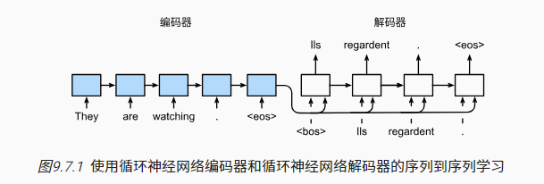

“<eos>”表示序列结束词元

“<bos>”表示序列开始词元

#### 9.7.1. 编码器

在时间步$t$，循环神经网络将词元$x_t$的输入特征向量$\mathbf{x}_t$和$\mathbf{h} _{t-1}$（即上一时间步的隐状态）转换为$\mathbf{h}_t$（即当前步的隐状态）

$$\mathbf{h}_t = f(\mathbf{x}_t, \mathbf{h}_{t-1}). $$

隐状态转换为上下文变量

$$\mathbf{c} =  q(\mathbf{h}_1, \ldots, \mathbf{h}_T).$$

以下代码

```python
#@save
class Seq2SeqEncoder(d2l.Encoder):
    """用于序列到序列学习的循环神经网络编码器"""
    def __init__(self, vocab_size, embed_size, num_hiddens, num_layers,
                 dropout=0, **kwargs):
        super(Seq2SeqEncoder, self).__init__(**kwargs)
        # 嵌入层
        self.embedding = nn.Embedding(vocab_size, embed_size)
        self.rnn = nn.GRU(embed_size, num_hiddens, num_layers,
                          dropout=dropout)

    def forward(self, X, *args):
        # 输出'X'的形状：(batch_size,num_steps,embed_size)
        X = self.embedding(X)
        # 在循环神经网络模型中，第一个轴对应于时间步
        X = X.permute(1, 0, 2)
        # 如果未提及状态，则默认为0
        output, state = self.rnn(X)
        # output的形状:(num_steps,batch_size,num_hiddens)
        # state的形状:(num_layers,batch_size,num_hiddens)
        return output, state

encoder = Seq2SeqEncoder(vocab_size=10, embed_size=8, num_hiddens=16,
                         num_layers=2)
encoder.eval()
X = torch.zeros((4, 7), dtype=torch.long) #batch = 4, num_steps = 7 ,矩阵的每个值表示idx
output, state = encoder(X)
output.shape #torch.Size([7, 4, 16])
```

#### 9.7.2. 解码器

在输出序列上的任意时间步$t^\prime$，循环神经网络将来自上一时间步的输出$y_{t^\prime-1}$和上下文变量$\mathbf{c}$作为其输入，然后在当前时间步将它们和上一隐状态$\mathbf{s}_{t^\prime-1}$转换为隐状态$\mathbf{s}_{t^\prime}$。因此，可以使用函数$g$来表示解码器的隐藏层的变换：

$\mathbf{s}_{t^\prime} = g(y_{t^\prime-1}, \mathbf{c}, \mathbf{s}_{t^\prime-1}).$$

```python
class Seq2SeqDecoder(d2l.Decoder):
    """用于序列到序列学习的循环神经网络解码器"""
    def __init__(self, vocab_size, embed_size, num_hiddens, num_layers,
                 dropout=0, **kwargs):
        super(Seq2SeqDecoder, self).__init__(**kwargs)
        self.embedding = nn.Embedding(vocab_size, embed_size)
        self.rnn = nn.GRU(embed_size + num_hiddens, num_hiddens, num_layers,
                          dropout=dropout)
        self.dense = nn.Linear(num_hiddens, vocab_size)

    def init_state(self, enc_outputs, *args):
        return enc_outputs[1]

    def forward(self, X, state):
        # 输出'X'的形状：(batch_size,num_steps,embed_size)
        X = self.embedding(X).permute(1, 0, 2)
        # 广播context，使其具有与X相同的num_steps
        context = state[-1].repeat(X.shape[0], 1, 1)
        X_and_context = torch.cat((X, context), 2)
        output, state = self.rnn(X_and_context, state)
        output = self.dense(output).permute(1, 0, 2)
        # output的形状:(batch_size,num_steps,vocab_size)
        # state的形状:(num_layers,batch_size,num_hiddens)
        return output, state

decoder = Seq2SeqDecoder(vocab_size=10, embed_size=8, num_hiddens=16,
                         num_layers=2)
decoder.eval()
state = decoder.init_state(encoder(X))
output, state = decoder(X, state)
output.shape, state.shape    # (torch.Size([4, 7, 10]), torch.Size([2, 4, 16]))
```


#### 9.7.3. 损失函数

在 9.5 里，为了保证输入序列长度是 num_step，填了很多 padding。需要通过`sequence_mask`函数 零值化屏蔽不相关的项

```python
#@save
def sequence_mask(X, valid_len, value=0):
    """在序列中屏蔽不相关的项"""
    maxlen = X.size(1)
    mask = torch.arange((maxlen), dtype=torch.float32,
                        device=X.device)[None, :] < valid_len[:, None]
    X[~mask] = value
    return X

X = torch.tensor([[1, 2, 3], [4, 5, 6]])
sequence_mask(X, torch.tensor([1, 2]))

tensor([[1, 0, 0],
        [4, 5, 0]])
```

通过扩展 softmax 交叉熵损失函数来遮蔽不相关的预测

```python
#@save
class MaskedSoftmaxCELoss(nn.CrossEntropyLoss):
    """带遮蔽的softmax交叉熵损失函数"""
    # pred的形状：(batch_size,num_steps,vocab_size)
    # label的形状：(batch_size,num_steps)
    # valid_len的形状：(batch_size,)
    def forward(self, pred, label, valid_len):
        weights = torch.ones_like(label)
        weights = sequence_mask(weights, valid_len)
        self.reduction='none'
        unweighted_loss = super(MaskedSoftmaxCELoss, self).forward(
            pred.permute(0, 2, 1), label)
        weighted_loss = (unweighted_loss * weights).mean(dim=1)
        return weighted_loss

loss = MaskedSoftmaxCELoss()
loss(torch.ones(3, 4, 10), torch.ones((3, 4), dtype=torch.long),
     torch.tensor([4, 2, 0]))

tensor([2.3026, 1.1513, 0.0000])
```

#### 9.7.4. 训练

```python
#@save
def train_seq2seq(net, data_iter, lr, num_epochs, tgt_vocab, device):
    """训练序列到序列模型"""
    def xavier_init_weights(m):
        if type(m) == nn.Linear:
            nn.init.xavier_uniform_(m.weight)
        if type(m) == nn.GRU:
            for param in m._flat_weights_names:
                if "weight" in param:
                    nn.init.xavier_uniform_(m._parameters[param])

    net.apply(xavier_init_weights)
    net.to(device)
    optimizer = torch.optim.Adam(net.parameters(), lr=lr)
    loss = MaskedSoftmaxCELoss()
    net.train()
    animator = d2l.Animator(xlabel='epoch', ylabel='loss',
                     xlim=[10, num_epochs])
    for epoch in range(num_epochs):
        timer = d2l.Timer()
        metric = d2l.Accumulator(2)  # 训练损失总和，词元数量
        for batch in data_iter:
            optimizer.zero_grad()
            X, X_valid_len, Y, Y_valid_len = [x.to(device) for x in batch]
            bos = torch.tensor([tgt_vocab['<bos>']] * Y.shape[0],
                          device=device).reshape(-1, 1)
            dec_input = torch.cat([bos, Y[:, :-1]], 1)  # 强制教学
            Y_hat, _ = net(X, dec_input, X_valid_len)
            l = loss(Y_hat, Y, Y_valid_len)
            l.sum().backward()      # 损失函数的标量进行“反向传播”
            d2l.grad_clipping(net, 1)
            num_tokens = Y_valid_len.sum()
            optimizer.step()
            with torch.no_grad():
                metric.add(l.sum(), num_tokens)
        if (epoch + 1) % 10 == 0:
            animator.add(epoch + 1, (metric[0] / metric[1],))
    print(f'loss {metric[0] / metric[1]:.3f}, {metric[1] / timer.stop():.1f} '
        f'tokens/sec on {str(device)}')

embed_size, num_hiddens, num_layers, dropout = 32, 32, 2, 0.1
batch_size, num_steps = 64, 10
lr, num_epochs, device = 0.005, 300, d2l.try_gpu()

train_iter, src_vocab, tgt_vocab = d2l.load_data_nmt(batch_size, num_steps)
encoder = Seq2SeqEncoder(len(src_vocab), embed_size, num_hiddens, num_layers,
                        dropout)
decoder = Seq2SeqDecoder(len(tgt_vocab), embed_size, num_hiddens, num_layers,
                        dropout)
net = d2l.EncoderDecoder(encoder, decoder)
train_seq2seq(net, train_iter, lr, num_epochs, tgt_vocab, device)
```

#### 9.7.5. 预测


```python
#@save
def predict_seq2seq(net, src_sentence, src_vocab, tgt_vocab, num_steps,
                    device, save_attention_weights=False):
    """序列到序列模型的预测"""
    # 在预测时将net设置为评估模式
    net.eval()
    src_tokens = src_vocab[src_sentence.lower().split(' ')] + [
        src_vocab['<eos>']]
    enc_valid_len = torch.tensor([len(src_tokens)], device=device)
    src_tokens = d2l.truncate_pad(src_tokens, num_steps, src_vocab['<pad>'])
    # 添加批量轴
    enc_X = torch.unsqueeze(
        torch.tensor(src_tokens, dtype=torch.long, device=device), dim=0)
    enc_outputs = net.encoder(enc_X, enc_valid_len)
    dec_state = net.decoder.init_state(enc_outputs, enc_valid_len)
    # 添加批量轴
    dec_X = torch.unsqueeze(torch.tensor(
        [tgt_vocab['<bos>']], dtype=torch.long, device=device), dim=0)
    output_seq, attention_weight_seq = [], []
    for _ in range(num_steps):
        Y, dec_state = net.decoder(dec_X, dec_state)
        # 我们使用具有预测最高可能性的词元，作为解码器在下一时间步的输入
        dec_X = Y.argmax(dim=2)
        pred = dec_X.squeeze(dim=0).type(torch.int32).item()
        # 保存注意力权重（稍后讨论）
        if save_attention_weights:
            attention_weight_seq.append(net.decoder.attention_weights)
        # 一旦序列结束词元被预测，输出序列的生成就完成了
        if pred == tgt_vocab['<eos>']:
            break
        output_seq.append(pred)
    return ' '.join(tgt_vocab.to_tokens(output_seq)), attention_weight_seq
```

#### 9.7.6. 预测序列的评估 - BLEU

$$ \exp\left(\min\left(0, 1 - \frac{\mathrm{len}_{\text{label}}}{\mathrm{len}_{\text{pred}}}\right)\right)
\prod\_{n=1}^k p_n^{1/2^n},$$

其中$\mathrm{len}_{\text{label}}$表示标签序列中的词元数和，$\mathrm{len}_{\text{pred}}$表示预测序列中的词元数，$k$是用于匹配的最长的$n$元语法。

另外，用$p_n$表示$n$元语法的精确度，它是两个数量的比值：

第一个是预测序列与标签序列中匹配的$n$元语法的数量，第二个是预测序列中$n$元语法的数量的比率。

具体地说，给定标签序列$A$、$B$、$C$、$D$、$E$、$F$和预测序列$A$、$B$、$B$、$C$、$D$，我们有$p_1 = 4/5$ 就是 1 个字母几个对的、$p_2 = 3/4$ 2 个字母几个对的、$p_3 =
1/3$和$p_4 = 0$。

```python
def bleu(pred_seq, label_seq, k):  #@save
    """计算BLEU"""
    pred_tokens, label_tokens = pred_seq.split(' '), label_seq.split(' ')
    len_pred, len_label = len(pred_tokens), len(label_tokens)
    score = math.exp(min(0, 1 - len_label / len_pred))
    for n in range(1, k + 1):
        num_matches, label_subs = 0, collections.defaultdict(int)
        for i in range(len_label - n + 1):
            label_subs[' '.join(label_tokens[i: i + n])] += 1
        for i in range(len_pred - n + 1):
            if label_subs[' '.join(pred_tokens[i: i + n])] > 0:
                num_matches += 1
                label_subs[' '.join(pred_tokens[i: i + n])] -= 1
        score *= math.pow(num_matches / (len_pred - n + 1), math.pow(0.5, n))
    return score

engs = ['go .', "i lost .", 'he\'s calm .', 'i\'m home .']
fras = ['va !', 'j\'ai perdu .', 'il est calme .', 'je suis chez moi .']
for eng, fra in zip(engs, fras):
    translation, attention_weight_seq = predict_seq2seq(
        net, eng, src_vocab, tgt_vocab, num_steps, device)
    print(f'{eng} => {translation}, bleu {bleu(translation, fra, k=2):.3f}')
```

## 10. 注意力机制

### 10.1. 注意力提示

人类的视觉神经系统大约每秒收到 108 位的信息， 这远远超过了大脑能够完全处理的水平。 幸运的是，人类的祖先已经从经验（也称为数据）中认识到 “并非感官的所有输入都是一样的”。
在整个人类历史中，这种只将注意力引向感兴趣的一小部分信息的能力， 使人类的大脑能够更明智地分配资源来生存、成长和社交

#### 10.1.1. 生物学中的注意力提示

非自主性提示是基于环境中物体的突出性和易见性

_自主性提示_ 有选择地引导注意力的焦点

#### 10.1.2. 查询、键和值

key 就是所有输入

值就是训练完对应每个输入的每个输出

查询就是训练时的具体某个输入


#### 10.1.3. 注意力的可视化

横坐标 key，纵坐标 query，颜色表示 value

```python
import torch
from d2l import torch as d2l

#@save
def show_heatmaps(matrices, xlabel, ylabel, titles=None, figsize=(2.5, 2.5),
                  cmap='Reds'):
    """显示矩阵热图"""
    d2l.use_svg_display()
    num_rows, num_cols = matrices.shape[0], matrices.shape[1]
    fig, axes = d2l.plt.subplots(num_rows, num_cols, figsize=figsize,
                                 sharex=True, sharey=True, squeeze=False)
    for i, (row_axes, row_matrices) in enumerate(zip(axes, matrices)):
        for j, (ax, matrix) in enumerate(zip(row_axes, row_matrices)):
            pcm = ax.imshow(matrix.detach().numpy(), cmap=cmap)
            if i == num_rows - 1:
                ax.set_xlabel(xlabel)
            if j == 0:
                ax.set_ylabel(ylabel)
            if titles:
                ax.set_title(titles[j])
    fig.colorbar(pcm, ax=axes, shrink=0.6);

attention_weights = torch.eye(10).reshape((1, 1, 10, 10))
show_heatmaps(attention_weights, xlabel='Keys', ylabel='Queries')
```


### 10.2. 注意力汇聚：Nadaraya-Watson 核回归

#### 10.2.1. 生成数据集

根据下面的非线性函数生成一个人工数据集，其中加入的噪声项为$\epsilon$：

$$y_i = 2\sin(x_i) + x_i^{0.8} + \epsilon,$$

其中$\epsilon$服从均值为$0$和标准差为$0.5$的正态分布。

```python
n_train = 50  # 训练样本数
x_train, _ = torch.sort(torch.rand(n_train) * 5)   # 排序后的训练样本

def f(x):
    return 2 * torch.sin(x) + x**0.8

y_train = f(x_train) + torch.normal(0.0, 0.5, (n_train,))  # 训练样本的输出
x_test = torch.arange(0, 5, 0.1)  # 测试样本
y_truth = f(x_test)  # 测试样本的真实输出
n_test = len(x_test)  # 测试样本数
```

#### 10.2.2. 平均汇聚

就是查询的时候，只选择输出的平均值

$$f(x) = \frac{1}{n}\sum_{i=1}^n y_i,$$

```python
y_hat = torch.repeat_interleave(y_train.mean(), n_test)
```


#### 10.2.3. 非参数注意力汇聚

根据输入的位置对输出$y_i$进行加权：

$$f(x) = \sum_{i=1}^n \frac{K(x - x_i)}{\sum_{j=1}^n K(x - x_j)} y_i,$$

- _K_ 是核函数，常见的核函数有高斯核、均匀核、三角核等

- 分子部分是所有$y_i$ 和它们相应的核权重的乘积之和
- 分母部分是所有核权重的总和，这保证了权重的归一化

核函数 K 根据 x 与每个$x_i$ 之间的距离产生权重，权重越大表示$x_i$对于估计$y(x)$ 的影响越大

下面考虑一个**高斯核**（Gaussian kernel），其定义为：

$$K(u) = \frac{1}{\sqrt{2\pi}} \exp(-\frac{u^2}{2}).$$

将高斯核代入

$$\begin{aligned} f(x) &=\sum_{i=1}^n \alpha(x, x_i) y_i\\ &= \sum_{i=1}^n \frac{\exp\left(-\frac{1}{2}(x - x_i)^2\right)}{\sum_{j=1}^n \exp\left(-\frac{1}{2}(x - x_j)^2\right)} y_i \\&= \sum_{i=1}^n \mathrm{softmax}\left(-\frac{1}{2}(x - x_i)^2\right) y_i. \end{aligned}$$

```python
# X_repeat的形状:(n_test,n_train),
# 每一行都包含着相同的测试输入（例如：同样的查询）
X_repeat = x_test.repeat_interleave(n_train).reshape((-1, n_train))
# x_train包含着键。attention_weights的形状：(n_test,n_train),
# 每一行都包含着要在给定的每个查询的值（y_train）之间分配的注意力权重
attention_weights = nn.functional.softmax(-(X_repeat - x_train)**2 / 2, dim=1)
# y_hat的每个元素都是值的加权平均值，其中的权重是注意力权重
y_hat = torch.matmul(attention_weights, y_train)
plot_kernel_reg(y_hat)
```

#### 10.2.4. 带参数注意力汇聚

在下面的查询$x$和键$x_i$之间的距离乘以可学习参数$w$：

$$\begin{aligned}f(x) &= \sum_{i=1}^n \alpha(x, x_i) y_i \\&= \sum_{i=1}^n \frac{\exp\left(-\frac{1}{2}((x - x_i)w)
^2\right)}{\sum_{j=1}^n \exp\left(-\frac{1}{2}((x - x_j)w)^2\right)} y_i \\&= \sum_{i=1}^n \mathrm{softmax}\left(
-\frac{1}{2}((x - x_i)w)^2\right) y_i.\end{aligned}$$

**注意力公式的含义，就是给定一个输入 x，注意力就是表示这个输入 x(query)和 所有其他可能的输入$x_i$(key)和对应输出$y_i$(value)的关系**

##### 10.2.4.1. 批量矩阵乘法

torch.bmm (X, Y) 表示矩阵 X 和 Y 的相乘

`torch.unsqueeze` 需要两个参数：

1. 输入张量。
2. 插入新维度的索引。

返回一个新的张量，原始数据不变，仅在指定的位置增加了一个维度。

##### 10.2.4.2. 定义模型

```python
class NWKernelRegression(nn.Module):
    def __init__(self, **kwargs):
        super().__init__(**kwargs)
        self.w = nn.Parameter(torch.rand((1,), requires_grad=True))

    def forward(self, queries, keys, values):
        # queries和attention_weights的形状为(查询个数，“键－值”对个数)
        queries = queries.repeat_interleave(keys.shape[1]).reshape((-1, keys.shape[1]))
        self.attention_weights = nn.functional.softmax(
            -((queries - keys) * self.w)**2 / 2, dim=1)
        # values的形状为(查询个数，“键－值”对个数)
        return torch.bmm(self.attention_weights.unsqueeze(1),
                         values.unsqueeze(-1)).reshape(-1)

'''训练'''
# X_tile的形状:(n_train，n_train)，每一行都包含着相同的训练输入
X_tile = x_train.repeat((n_train, 1))
# Y_tile的形状:(n_train，n_train)，每一行都包含着相同的训练输出
Y_tile = y_train.repeat((n_train, 1))
# keys的形状:('n_train'，'n_train'-1)
keys = X_tile[(1 - torch.eye(n_train)).type(torch.bool)].reshape((n_train, -1))
# values的形状:('n_train'，'n_train'-1)
values = Y_tile[(1 - torch.eye(n_train)).type(torch.bool)].reshape((n_train, -1))

net = NWKernelRegression()
loss = nn.MSELoss(reduction='none')
trainer = torch.optim.SGD(net.parameters(), lr=0.5)
animator = d2l.Animator(xlabel='epoch', ylabel='loss', xlim=[1, 5])

for epoch in range(5):
    trainer.zero_grad()
    l = loss(net(x_train, keys, values), y_train)
    l.sum().backward()
    trainer.step()
    print(f'epoch {epoch + 1}, loss {float(l.sum()):.6f}')
    animator.add(epoch + 1, float(l.sum()))
```

#### 10.3. 注意力评分函数

上面那个式子中 高斯核指数部分可以视为*注意力评分函数*（attention scoring function）简称*评分函数*（scoring function）

$a(q,k_i) = -\frac{1}{2}((x - x_i)w)^2$

$\alpha(q,k_i) = softmax(a(q,k_i))$

注意力汇聚函数 f 就可以表示为

$f(q) = \sum_{i=1}^n \alpha(q,k_i) v_i$

所以本质上，就是注意力评分函数，把当前输入 q 和所有可能的输入 k 映射成了一个参数向量，然后把所有问题都变成了一个多分类问题

##### 10.3.1. 掩蔽 softmax 操作

如何屏蔽掉那些超出指定范围的词

```python
#@save
def masked_softmax(X, valid_lens):
    """通过在最后一个轴上掩蔽元素来执行softmax操作"""
    # X:3D张量，valid_lens:1D或2D张量
    if valid_lens is None:
        return nn.functional.softmax(X, dim=-1)
    else:
        shape = X.shape
        if valid_lens.dim() == 1:
            valid_lens = torch.repeat_interleave(valid_lens, shape[1])
        else:
            valid_lens = valid_lens.reshape(-1)
        # 最后一轴上被掩蔽的元素使用一个非常大的负值替换，从而其softmax输出为0
        X = d2l.sequence_mask(X.reshape(-1, shape[-1]), valid_lens,
                              value=-1e6)
        return nn.functional.softmax(X.reshape(shape), dim=-1)

```

由两个 2×4 矩阵表示的样本， 这两个样本的有效长度分别为 2 和 3。 经过掩蔽 softmax 操作，超出有效长度的值都被掩蔽为 0

```python
masked_softmax(torch.rand(2, 2, 4), torch.tensor([2, 3]))  #[2,3]表示第1个2x4矩阵有效列数是2，第2个是3

tensor([[[0.5980, 0.4020, 0.0000, 0.0000],
         [0.5548, 0.4452, 0.0000, 0.0000]],

        [[0.3716, 0.3926, 0.2358, 0.0000],
         [0.3455, 0.3337, 0.3208, 0.0000]]])

masked_softmax(torch.rand(2, 2, 4), torch.tensor([[1, 3], [2, 4]])) # [1,3] 表示第1个2x4矩阵的第1行有效列数是1，第2行是3

tensor([[[1.0000, 0.0000, 0.0000, 0.0000],
         [0.4125, 0.3273, 0.2602, 0.0000]],

        [[0.5254, 0.4746, 0.0000, 0.0000],
         [0.3117, 0.2130, 0.1801, 0.2952]]])
```

##### 10.3.2. 加性注意力

当查询和键是不同长度的矢量时，可以使用加性注意力作为评分函数。其实就是增加了一个 h 的维度。把 q 变成 hx1，k 也变成 hx1。然后 a(q,k)变成 hxh 的矩阵

给定查询$\mathbf{q} \in \mathbb{R}^q$和键$\mathbf{k} \in \mathbb{R}^k$，**加性注意力**（additive attention）的评分函数为

$$a(\mathbf q, \mathbf k) = \mathbf w_v^\top \text{tanh}(\mathbf W_q\mathbf q + \mathbf W_k \mathbf k) \in \mathbb{R},$$

其中可学习的参数是$\mathbf W_q\in\mathbb R^{h\times q}$、$\mathbf W_k\in\mathbb R^{h\times k}$和$\mathbf w_v\in\mathbb R^{h}$。

```python
#@save
class AdditiveAttention(nn.Module):
    """加性注意力"""
    def __init__(self, key_size, query_size, num_hiddens, dropout, **kwargs):
        super(AdditiveAttention, self).__init__(**kwargs)
        self.W_k = nn.Linear(key_size, num_hiddens, bias=False)
        self.W_q = nn.Linear(query_size, num_hiddens, bias=False)
        self.w_v = nn.Linear(num_hiddens, 1, bias=False)
        self.dropout = nn.Dropout(dropout)

    def forward(self, queries, keys, values, valid_lens):
        queries, keys = self.W_q(queries), self.W_k(keys)
        # 在维度扩展后，
        # queries的形状：(batch_size，查询的个数，1，num_hidden)
        # key的形状：(batch_size，1，“键－值”对的个数，num_hiddens)
        # 使用广播方式进行求和
        features = queries.unsqueeze(2) + keys.unsqueeze(1)
        features = torch.tanh(features)
        # self.w_v仅有一个输出，因此从形状中移除最后那个维度。
        # scores的形状：(batch_size，查询的个数，“键-值”对的个数)
        scores = self.w_v(features).squeeze(-1)
        self.attention_weights = masked_softmax(scores, valid_lens)
        # values的形状：(batch_size，“键－值”对的个数，值的维度)
        return torch.bmm(self.dropout(self.attention_weights), values)

```

以下例子查询、键和值的形状为（批量大小，步数或词元序列长度，特征大小）， 实际输出为$(2,1,20)$、$(2,10,2)$和$(2,10,4)$。 注意力汇聚输出的形状为（批量大小，查询的步数，值的维度）

```python
queries, keys = torch.normal(0, 1, (2, 1, 20)), torch.ones((2, 10, 2))
# values的小批量，两个值矩阵是相同的
values = torch.arange(40, dtype=torch.float32).reshape(1, 10, 4).repeat(
    2, 1, 1)
valid_lens = torch.tensor([2, 6])

attention = AdditiveAttention(key_size=2, query_size=20, num_hiddens=8,
                              dropout=0.1)
attention.eval()
attention(queries, keys, values, valid_lens)

tensor([[[ 2.0000,  3.0000,  4.0000,  5.0000]],

        [[10.0000, 11.0000, 12.0000, 13.0000]]])
```

##### 10.3.3. 缩放点积注意力

查询和键具有相同的长度$d$，**缩放点积注意力**（scaled dot-product attention）评分函数为：

$$a(\mathbf q, \mathbf k) = \mathbf{q}^\top \mathbf{k}  /\sqrt{d}.$$

```python
#@save
class DotProductAttention(nn.Module):
    """缩放点积注意力"""
    def __init__(self, dropout, **kwargs):
        super(DotProductAttention, self).__init__(**kwargs)
        self.dropout = nn.Dropout(dropout)

    # queries的形状：(batch_size，查询的个数，d)
    # keys的形状：(batch_size，“键－值”对的个数，d)
    # values的形状：(batch_size，“键－值”对的个数，值的维度)
    # valid_lens的形状:(batch_size，)或者(batch_size，查询的个数)
    def forward(self, queries, keys, values, valid_lens=None):
        d = queries.shape[-1]
        # 设置transpose_b=True为了交换keys的最后两个维度
        scores = torch.bmm(queries, keys.transpose(1,2)) / math.sqrt(d)
        self.attention_weights = masked_softmax(scores, valid_lens)
        return torch.bmm(self.dropout(self.attention_weights), values)

queries = torch.normal(0, 1, (2, 1, 2))
attention = DotProductAttention(dropout=0.5)
attention.eval()
attention(queries, keys, values, valid_lens)

tensor([[[ 2.0000,  3.0000,  4.0000,  5.0000]],

        [[10.0000, 11.0000, 12.0000, 13.0000]]])
```

#### 10.4. Bahdanau 注意力

针对翻译问题，之前编码器将一个序列变成了一个固定长度的变量，然后解码器再根据这个变量产生输出。

Bahdanau 就是把这个变量当成注意力处理

##### 10.4.1. 模型

在任何解码时间步$t'$都会被$\mathbf{c}_{t'}$替换。$\mathbf{c}_{t'}$表示解码结果这个变量

假设输入序列中有$T$个词元，解码时间步$t'$的上下文变量是注意力集中的输出：

$$\mathbf{c}_{t'} = \sum_{t=1}^T \alpha(\mathbf{s}_{t' - 1}, \mathbf{h}_t) \mathbf{h}_t,$$

其中，时间步$t' - 1$时的解码器隐状态$\mathbf{s}_{t' - 1}$是查询，编码器隐状态$\mathbf{h}_t$既是键，也是值，注意力权重$\alpha$使用加性注意力评分函数


##### 代码实现

```python
'''10.4.2 注意力解码器'''
#@save
# 通用接口
class AttentionDecoder(d2l.Decoder):
    """带有注意力机制解码器的基本接口"""
    def __init__(self, **kwargs):
        super(AttentionDecoder, self).__init__(**kwargs)

    @property
    def attention_weights(self):
        raise NotImplementedError


class Seq2SeqAttentionDecoder(AttentionDecoder):
    def __init__(self, vocab_size, embed_size, num_hiddens, num_layers,
                 dropout=0, **kwargs):
        super(Seq2SeqAttentionDecoder, self).__init__(**kwargs)
        self.attention = d2l.AdditiveAttention(
            num_hiddens, num_hiddens, num_hiddens, dropout)
        self.embedding = nn.Embedding(vocab_size, embed_size)
        self.rnn = nn.GRU(
            embed_size + num_hiddens, num_hiddens, num_layers,
            dropout=dropout)
        self.dense = nn.Linear(num_hiddens, vocab_size)

    def init_state(self, enc_outputs, enc_valid_lens, *args):
        # outputs的形状为(batch_size，num_steps，num_hiddens).
        # hidden_state的形状为(num_layers，batch_size，num_hiddens)
        outputs, hidden_state = enc_outputs
        return (outputs.permute(1, 0, 2), hidden_state, enc_valid_lens)

    def forward(self, X, state):
        # enc_outputs的形状为(batch_size,num_steps,num_hiddens).
        # hidden_state的形状为(num_layers,batch_size,
        # num_hiddens)
        enc_outputs, hidden_state, enc_valid_lens = state
        # 输出X的形状为(num_steps,batch_size,embed_size)
        X = self.embedding(X).permute(1, 0, 2)
        """之前的做法是把这个X直接输入self.rnn"""
        outputs, self._attention_weights = [], []
        # 1个个token计算
        for x in X:
            # query的形状为(batch_size,1,num_hiddens)
            query = torch.unsqueeze(hidden_state[-1], dim=1)
            # context的形状为(batch_size,1,num_hiddens)
            context = self.attention(
                query, enc_outputs, enc_outputs, enc_valid_lens)
            # 在特征维度上连结
            x = torch.cat((context, torch.unsqueeze(x, dim=1)), dim=-1)
            # 将x变形为(1,batch_size,embed_size+num_hiddens)
            out, hidden_state = self.rnn(x.permute(1, 0, 2), hidden_state)
            outputs.append(out)
            self._attention_weights.append(self.attention.attention_weights)
        # 全连接层变换后，outputs的形状为
        # (num_steps,batch_size,vocab_size)
        # outputs是一张量列表，用torch.cat在维度0把这个表拼接起来
        outputs = self.dense(torch.cat(outputs, dim=0))
        return outputs.permute(1, 0, 2), [enc_outputs, hidden_state,
                                          enc_valid_lens]

    @property
    def attention_weights(self):
        return self._attention_weights


'''使用包含7个时间步的4个序列输入的小批量测试Bahdanau注意力解码器'''
encoder = d2l.Seq2SeqEncoder(vocab_size=10, embed_size=8, num_hiddens=16,
                             num_layers=2)
encoder.eval()
decoder = Seq2SeqAttentionDecoder(vocab_size=10, embed_size=8, num_hiddens=16,
                                  num_layers=2)
decoder.eval()
X = torch.zeros((4, 7), dtype=torch.long)  # (batch_size,num_steps)
state = decoder.init_state(encoder(X), None)
output, state = decoder(X, state)
output.shape, len(state), state[0].shape, len(state[1]), state[1][0].shape

(torch.Size([4, 7, 10]), 3, torch.Size([4, 7, 16]), 2, torch.Size([4, 16]))

'''10.4.3 训练'''
embed_size, num_hiddens, num_layers, dropout = 32, 32, 2, 0.1
batch_size, num_steps = 64, 10
lr, num_epochs, device = 0.005, 250, d2l.try_gpu()

train_iter, src_vocab, tgt_vocab = d2l.load_data_nmt(batch_size, num_steps)
encoder = d2l.Seq2SeqEncoder(
    len(src_vocab), embed_size, num_hiddens, num_layers, dropout)
decoder = Seq2SeqAttentionDecoder(
    len(tgt_vocab), embed_size, num_hiddens, num_layers, dropout)
net = d2l.EncoderDecoder(encoder, decoder)
d2l.train_seq2seq(net, train_iter, lr, num_epochs, tgt_vocab, device)
```

#### 10.5. 多头注意力

相当于先把多个输入的 q,k,v 分别做全连接，然后获取注意力汇聚，最后多个注意力汇聚再做一次全连接

下面的图有点错误，是先把 q,k,v 做全连接，然后再拆成多头


##### 10.5.1 模型

给定查询$\mathbf{q} \in \mathbb{R}^{d_q}$、键$\mathbf{k} \in \mathbb{R}^{d_k}$和值$\mathbf{v} \in \mathbb{R}^{d_v}$，每个注意力头$\mathbf{h}_i$（$i = 1, \ldots, h$）的计算方法为：

$$\mathbf{h}_i = f(\mathbf W_i^{(q)}\mathbf q, \mathbf W_i^{(k)}\mathbf k,\mathbf W_i^{(v)}\mathbf v) \in \mathbb R^{p_v},$$

其中，可学习的参数包括$\mathbf W_i^{(q)}\in\mathbb R^{p_q\times d_q}$、$\mathbf W_i^{(k)}\in\mathbb R^{p_k\times d_k}$和$\mathbf W_i^{(v)}\in\mathbb R^{p_v\times d_v}$，以及代表注意力汇聚的函数$f$。

多头注意力的输出需要经过另一个线性转换，它对应着$h$个头连结后的结果，因此其可学习参数是$\mathbf W_o\in\mathbb R^{p_o\times h p_v}$：

$$\mathbf W_o \begin{bmatrix}\mathbf h_1\\\vdots\\\mathbf h_h\end{bmatrix} \in \mathbb{R}^{p_o}.$$

##### 10.5.2. 实现

```python
#@save
def transpose_qkv(X, num_heads):
    """为了多注意力头的并行计算而变换形状"""
    # 输入X的形状:(batch_size，查询或者“键－值”对的个数，num_hiddens)
    # 输出X的形状:(batch_size，查询或者“键－值”对的个数，num_heads，num_hiddens/num_heads)
    X = X.reshape(X.shape[0], X.shape[1], num_heads, -1)

    # 输出X的形状:(batch_size，num_heads，查询或者“键－值”对的个数,num_hiddens/num_heads)
    X = X.permute(0, 2, 1, 3)

    # 最终输出的形状:(batch_size*num_heads,查询或者“键－值”对的个数,num_hiddens/num_heads)
    return X.reshape(-1, X.shape[2], X.shape[3])


#@save
def transpose_output(X, num_heads):
    """逆转transpose_qkv函数的操作"""
    X = X.reshape(-1, num_heads, X.shape[1], X.shape[2])
    X = X.permute(0, 2, 1, 3)
    return X.reshape(X.shape[0], X.shape[1], -1)

#@save
class MultiHeadAttention(nn.Module):
    """多头注意力"""
    def __init__(self, key_size, query_size, value_size, num_hiddens,
                 num_heads, dropout, bias=False, **kwargs):
        super(MultiHeadAttention, self).__init__(**kwargs)
        self.num_heads = num_heads
        self.attention = d2l.DotProductAttention(dropout)
        self.W_q = nn.Linear(query_size, num_hiddens, bias=bias)
        self.W_k = nn.Linear(key_size, num_hiddens, bias=bias)
        self.W_v = nn.Linear(value_size, num_hiddens, bias=bias)
        self.W_o = nn.Linear(num_hiddens, num_hiddens, bias=bias)

    def forward(self, queries, keys, values, valid_lens):
        # queries，keys，values的形状:
        # (batch_size，查询或者“键－值”对的个数，num_hiddens)
        # valid_lens　的形状:
        # (batch_size，)或(batch_size，查询的个数)
        # 经过变换后，输出的queries，keys，values　的形状:
        # (batch_size*num_heads，查询或者“键－值”对的个数，num_hiddens/num_heads)
        queries = transpose_qkv(self.W_q(queries), self.num_heads)
        keys = transpose_qkv(self.W_k(keys), self.num_heads)
        values = transpose_qkv(self.W_v(values), self.num_heads)

        if valid_lens is not None:
            # 在轴0，将第一项（标量或者矢量）复制num_heads次，
            # 然后如此复制第二项，然后诸如此类。
            valid_lens = torch.repeat_interleave(
                valid_lens, repeats=self.num_heads, dim=0)

        # output的形状:(batch_size*num_heads，查询的个数，
        # num_hiddens/num_heads)
        output = self.attention(queries, keys, values, valid_lens)

        # output_concat的形状:(batch_size，查询的个数，num_hiddens)
        output_concat = transpose_output(output, self.num_heads)
        return self.W_o(output_concat)


num_hiddens, num_heads = 100, 5
attention = MultiHeadAttention(num_hiddens, num_hiddens, num_hiddens,
                               num_hiddens, num_heads, 0.5)
attention.eval()

MultiHeadAttention(
  (attention): DotProductAttention(
    (dropout): Dropout(p=0.5, inplace=False)
  )
  (W_q): Linear(in_features=100, out_features=100, bias=False)
  (W_k): Linear(in_features=100, out_features=100, bias=False)
  (W_v): Linear(in_features=100, out_features=100, bias=False)
  (W_o): Linear(in_features=100, out_features=100, bias=False)
)


batch_size, num_queries = 2, 4
num_kvpairs, valid_lens =  6, torch.tensor([3, 2])
X = torch.ones((batch_size, num_queries, num_hiddens))
Y = torch.ones((batch_size, num_kvpairs, num_hiddens))
attention(X, Y, Y, valid_lens).shape

torch.Size([2, 4, 100])
```

#### 10.6. 自注意力和位置编码

自注意力就是把一个 token 序列同时作为 q,k,v 输入注意力

##### 10.6.1. 自注意力

给定一个由词元组成的输入序列$\mathbf{x}_1, \ldots, \mathbf{x}_n$，其中任意$\mathbf{x}_i \in \mathbb{R}^d$（$1 \leq i \leq n$）。d 表示一个 token
是用 1 个 d 维向量表示。该序列的自注意力输出为一个长度相同的序列$\mathbf{y}_1, \ldots, \mathbf{y}_n$，其中：

$$\mathbf{y}_i = f(\mathbf{x}_i, (\mathbf{x}_1, \mathbf{x}_1), \ldots, (\mathbf{x}_n, \mathbf{x}_n)) \in \mathbb{R}^d$$

$f$是注意力汇聚函数

下面的代码片段是基于多头注意力对一个张量完成自注意力的计算，张量的形状为（批量大小，时间步的数目或词元序列的长度，$d$）。

输出与输入的张量形状相同。

```python
num_hiddens, num_heads = 100, 5
attention = d2l.MultiHeadAttention(num_hiddens, num_hiddens, num_hiddens,
                                   num_hiddens, num_heads, 0.5)
attention.eval()

MultiHeadAttention(
  (attention): DotProductAttention(
    (dropout): Dropout(p=0.5, inplace=False)
  )
  (W_q): Linear(in_features=100, out_features=100, bias=False)
  (W_k): Linear(in_features=100, out_features=100, bias=False)
  (W_v): Linear(in_features=100, out_features=100, bias=False)
  (W_o): Linear(in_features=100, out_features=100, bias=False)
)

batch_size, num_queries, valid_lens = 2, 4, torch.tensor([3, 2])
X = torch.ones((batch_size, num_queries, num_hiddens))
attention(X, X, X, valid_lens).shape

torch.Size([2, 4, 100])
```

##### 10.6.2. 比较卷积神经网络、循环神经网络和自注意力


**计算矩阵乘法算法复杂度的方法**

假设有两个矩阵 _A_ 和 _B_，其中 _A_ 是一个 *m*×*p* 矩阵，𝐵*B* 是一个 *p*×*n* 矩阵。矩阵 𝐴*A* 和矩阵 𝐵*B* 的乘积 _C_ 将是一个 *m*×*n* 矩阵。

在最传统的矩阵乘法中，每个元素 $c\_{ij} $的计算需要执行 _p_ 次乘法和 *p*−1 次加法。因此，整个矩阵 _C_ 的计算涉及:

- **乘法次数**：每个元素 $c_{ij}$需要 p* 次乘法，所以总共是 *m*×*n*×*p\* 次乘法。
- **加法次数**：每个元素需要 *p*−1 次加法，所以总共是 *m*×*n*×(*p*−1) 次加法。

因此，如果只考虑乘法操作（通常是计算量最大的操作），矩阵乘法的时间复杂度可以表示为*O*(_mnp_)。

上面几种比较假设输入序列长度都是 n,输入输出通道数都是 d

1. 卷积网络

   卷积核大小为 𝑘 的卷积层，计算复杂度是$O(knd^2)$。因为卷积是分层的，所以有$O(1)$个顺序操作。最长路径是$O(n/k)$

2. RNN

   dxd 的权重矩阵和 d 维隐状态乘法，计算复杂度是$O(d^2)$。序列长度是 n，所以最后的复杂度是$O(nd^2)$。因为 n 个 token 都是顺序执行的，所以最大路径也是 O(n)

3. 自注意力机制

   q,k,v 都是 nxd 矩阵，是 nxd 乘以 dxn.所以计算复杂度是$O(n^2d)$。消耗的算力小。而且都是并行的，最长路径就是 O(1)

##### 10.6.3. 位置编码

因为自注意力是并行操作，丢失了字符的位置信息。所以要在输入序列里加入 _位置编码_（positional encoding）。以下是基于余弦和正弦的位置编码

假设输入表示$\mathbf{X} \in \mathbb{R}^{n \times d}$包含一个序列中$n$个词元的$d$维嵌入表示。位置编码使用相同形状的位置嵌入矩阵$\mathbf{P} \in \mathbb{R}^{n
\times d}$输出$\mathbf{X} + \mathbf{P}$，

矩阵第$i$行、第$2j$列和$2j+1$列上的元素为，i 就表示第几个 token,j 表示这个 token 的一个维度特征。越后面的 token，频率越高：

$$ \begin{aligned} p_{i, 2j} &= \sin\left(\frac{i}{10000^{2j/d}}\right)\\

p_{i, 2j+1} &= \cos\left(\frac{i}{10000^{2j/d}}\right).\end{aligned} $$

```python
#@save
class PositionalEncoding(nn.Module):
    """位置编码"""
    def __init__(self, num_hiddens, dropout, max_len=1000):
        super(PositionalEncoding, self).__init__()
        self.dropout = nn.Dropout(dropout)
        # 创建一个足够长的P
        self.P = torch.zeros((1, max_len, num_hiddens))
        X = torch.arange(max_len, dtype=torch.float32).reshape(
            -1, 1) / torch.pow(10000, torch.arange(
            0, num_hiddens, 2, dtype=torch.float32) / num_hiddens)
        self.P[:, :, 0::2] = torch.sin(X)
        self.P[:, :, 1::2] = torch.cos(X)

    def forward(self, X):
        X = X + self.P[:, :X.shape[1], :].to(X.device)
        return self.dropout(X)

encoding_dim, num_steps = 32, 60
pos_encoding = PositionalEncoding(encoding_dim, 0)
pos_encoding.eval()
X = pos_encoding(torch.zeros((1, num_steps, encoding_dim)))
P = pos_encoding.P[:, :X.shape[1], :]
d2l.plot(torch.arange(num_steps), P[0, :, 6:10].T, xlabel='Row (position)',
         figsize=(6, 2.5), legend=["Col %d" % d for d in torch.arange(6, 10)])
```

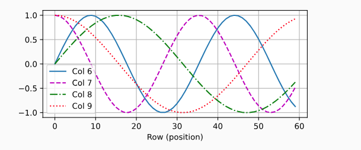

这种位置既可以表示绝对位置，也可以表示相对位置

#### 10.7. Transformer

##### 10.7.1. 模型

Transformer 的编码器和解码器是基于自注意力的模块叠加而成的，源（输入）序列和目标（输出）序列的*嵌入*（embedding）表示将加上*位置编码*（positional encoding），再分别输入到编码器和解码器中

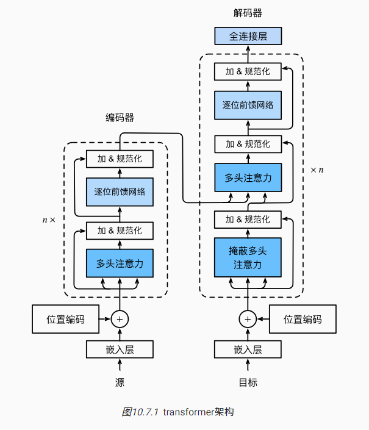

图中虚线框部分就是一个子层。

编码器：

​ 第一个子层是*多头自注意力*（multi-head self-attention）汇聚；第二个子层是*基于位置的前馈网络*（positionwise feed-forward
network）。具体来说，在计算编码器的自注意力时，查询、键和值都来自前一个编码器层的输出。每个子层都采用了*残差连接*（residual connection）。在 Transformer
中，对于序列中任何位置的任何输入$\mathbf{x} \in \mathbb{R}^d$，都要求满足$\mathrm{sublayer}(\mathbf{x}) \in \mathbb{R}^d$，以便残差连接满足$\mathbf{x}
+ \mathrm{sublayer}(\mathbf{x}) \in \mathbb{R}^d$。在残差连接的加法计算之后，紧接着应用**层规范化**（layer
normalization）。因此，输入序列对应的每个位置，Transformer 编码器都将输出一个$d$维表示向量。

解码器:

​ 除了编码器中描述的两个子层之外，解码器还在这两个子层之间插入了第三个子层，称为*编码器－解码器注意力*（encoder-decoder
attention）层。在编码器－解码器注意力中，查询来自前一个解码器层的输出，而键和值来自整个编码器的输出。在解码器自注意力中，查询、键和值都来自上一个解码器层的输出。但是，解码器中的每个位置只能考虑该位置之前的所有位置。这种*掩蔽*
（masked）注意力保留了*自回归*（auto-regressive）属性，确保预测仅依赖于已生成的输出词元

​ 就是先用 mask 只保留之前所有位置的注意力，再用这个结果最为 Q，编码器结果最为 K,V。再过和编码器一样的层

##### 10.7.2. 基于位置的前馈网络

输入`X`的形状（批量大小，时间步数或序列长度，隐单元数或特征维度）将被一个两层的感知机转换成形状为（批量大小，时间步数，`ffn_num_outputs`）的输出张量

```python
#@save
class PositionWiseFFN(nn.Module):
    """基于位置的前馈网络"""
    def __init__(self, ffn_num_input, ffn_num_hiddens, ffn_num_outputs,
                 **kwargs):
        super(PositionWiseFFN, self).__init__(**kwargs)
        self.dense1 = nn.Linear(ffn_num_input, ffn_num_hiddens)
        self.relu = nn.ReLU()
        self.dense2 = nn.Linear(ffn_num_hiddens, ffn_num_outputs)

    def forward(self, X):
        return self.dense2(self.relu(self.dense1(X)))

ffn = PositionWiseFFN(4, 4, 8)
ffn.eval()
ffn(torch.ones((2, 3, 4)))[0]

tensor([[-0.8290,  1.0067,  0.3619,  0.3594, -0.5328,  0.2712,  0.7394,  0.0747],
        [-0.8290,  1.0067,  0.3619,  0.3594, -0.5328,  0.2712,  0.7394,  0.0747],
        [-0.8290,  1.0067,  0.3619,  0.3594, -0.5328,  0.2712,  0.7394,  0.0747]],
       grad_fn=<SelectBackward0>)
```

##### 10.7.3. 残差连接和层规范化

批量规范化在计算机视觉中被广泛应用，但在自然语言处理任务中（输入通常是变长序列）批量规范化通常不如层规范化的效果好

```python
ln = nn.LayerNorm(2)
bn = nn.BatchNorm1d(2)
X = torch.tensor([[1, 2], [2, 3]], dtype=torch.float32)
# 在训练模式下计算X的均值和方差
print('layer norm:', ln(X), '\nbatch norm:', bn(X))

#@save
class AddNorm(nn.Module):
    """残差连接后进行层规范化"""
    def __init__(self, normalized_shape, dropout, **kwargs):
        super(AddNorm, self).__init__(**kwargs)
        self.dropout = nn.Dropout(dropout)
        self.ln = nn.LayerNorm(normalized_shape)

    def forward(self, X, Y):
        return self.ln(self.dropout(Y) + X)

add_norm = AddNorm([3, 4], 0.5)
add_norm.eval()
add_norm(torch.ones((2, 3, 4)), torch.ones((2, 3, 4))).shape
```

##### 10.7.4. 编码器

```python
#@save
class EncoderBlock(nn.Module):
    """Transformer编码器块"""
    def __init__(self, key_size, query_size, value_size, num_hiddens,
                 norm_shape, ffn_num_input, ffn_num_hiddens, num_heads,
                 dropout, use_bias=False, **kwargs):
        super(EncoderBlock, self).__init__(**kwargs)
        self.attention = d2l.MultiHeadAttention(
            key_size, query_size, value_size, num_hiddens, num_heads, dropout,
            use_bias)
        self.addnorm1 = AddNorm(norm_shape, dropout)
        self.ffn = PositionWiseFFN(
            ffn_num_input, ffn_num_hiddens, num_hiddens)
        self.addnorm2 = AddNorm(norm_shape, dropout)

    def forward(self, X, valid_lens):
        Y = self.addnorm1(X, self.attention(X, X, X, valid_lens))
        return self.addnorm2(Y, self.ffn(Y))

X = torch.ones((2, 100, 24))
valid_lens = torch.tensor([3, 2])
encoder_blk = EncoderBlock(24, 24, 24, 24, [100, 24], 24, 48, 8, 0.5)
encoder_blk.eval()
encoder_blk(X, valid_lens).shape
# torch.Size([2, 100, 24])

#@save
class TransformerEncoder(d2l.Encoder):
    """Transformer编码器"""
    def __init__(self, vocab_size, key_size, query_size, value_size,
                 num_hiddens, norm_shape, ffn_num_input, ffn_num_hiddens,
                 num_heads, num_layers, dropout, use_bias=False, **kwargs):
        super(TransformerEncoder, self).__init__(**kwargs)
        self.num_hiddens = num_hiddens
        self.embedding = nn.Embedding(vocab_size, num_hiddens)
        self.pos_encoding = d2l.PositionalEncoding(num_hiddens, dropout)
        self.blks = nn.Sequential()
        for i in range(num_layers):
            self.blks.add_module("block"+str(i),
                EncoderBlock(key_size, query_size, value_size, num_hiddens,
                             norm_shape, ffn_num_input, ffn_num_hiddens,
                             num_heads, dropout, use_bias))

    def forward(self, X, valid_lens, *args):
        # 因为位置编码值在-1和1之间，
        # 因此嵌入值乘以嵌入维度的平方根进行缩放，
        # 然后再与位置编码相加。
        X = self.pos_encoding(self.embedding(X) * math.sqrt(self.num_hiddens))
        self.attention_weights = [None] * len(self.blks)
        for i, blk in enumerate(self.blks):
            X = blk(X, valid_lens)
            self.attention_weights[
                i] = blk.attention.attention.attention_weights
        return X

encoder = TransformerEncoder(200, 24, 24, 24, 24, [100, 24], 24, 48, 8, 2, 0.5)
encoder.eval()
encoder(torch.ones((2, 100), dtype=torch.long), valid_lens).shape
# torch.Size([2, 100, 24])
```

##### 10.7.5. 解码器

在训练阶段，其输出序列的所有位置（时间步）的词元都是已知的；然而，在预测阶段，其输出序列的词元是逐个生成的。

```python
class DecoderBlock(nn.Module):
    """解码器中第i个块"""
    def __init__(self, key_size, query_size, value_size, num_hiddens,
                 norm_shape, ffn_num_input, ffn_num_hiddens, num_heads,
                 dropout, i, **kwargs):
        super(DecoderBlock, self).__init__(**kwargs)
        self.i = i
        self.attention1 = d2l.MultiHeadAttention(
            key_size, query_size, value_size, num_hiddens, num_heads, dropout)
        self.addnorm1 = AddNorm(norm_shape, dropout)
        self.attention2 = d2l.MultiHeadAttention(
            key_size, query_size, value_size, num_hiddens, num_heads, dropout)
        self.addnorm2 = AddNorm(norm_shape, dropout)
        self.ffn = PositionWiseFFN(ffn_num_input, ffn_num_hiddens,
                                   num_hiddens)
        self.addnorm3 = AddNorm(norm_shape, dropout)

    def forward(self, X, state):
        enc_outputs, enc_valid_lens = state[0], state[1]
        # 训练阶段，输出序列的所有词元都在同一时间处理，
        # 因此state[2][self.i]初始化为None。
        # 预测阶段，输出序列是通过词元一个接着一个解码的，
        # 因此state[2][self.i]包含着直到当前时间步第i个块解码的输出表示
        if state[2][self.i] is None:
            key_values = X
        else:
            key_values = torch.cat((state[2][self.i], X), axis=1)
        state[2][self.i] = key_values
        if self.training:
            batch_size, num_steps, _ = X.shape
            # dec_valid_lens的开头:(batch_size,num_steps),
            # 其中每一行是[1,2,...,num_steps]
            dec_valid_lens = torch.arange(1, num_steps + 1, device=X.device).repeat(batch_size, 1)
        else:
            dec_valid_lens = None

        # 自注意力
        X2 = self.attention1(X, key_values, key_values, dec_valid_lens)
        Y = self.addnorm1(X, X2)
        # 编码器－解码器注意力。
        # enc_outputs的开头:(batch_size,num_steps,num_hiddens)
        Y2 = self.attention2(Y, enc_outputs, enc_outputs, enc_valid_lens)
        Z = self.addnorm2(Y, Y2)
        return self.addnorm3(Z, self.ffn(Z)), state

decoder_blk = DecoderBlock(24, 24, 24, 24, [100, 24], 24, 48, 8, 0.5, 0)
decoder_blk.eval()
X = torch.ones((2, 100, 24))
state = [encoder_blk(X, valid_lens), valid_lens, [None]]
decoder_blk(X, state)[0].shape
# torch.Size([2, 100, 24])

class TransformerDecoder(d2l.AttentionDecoder):
    def __init__(self, vocab_size, key_size, query_size, value_size,
                 num_hiddens, norm_shape, ffn_num_input, ffn_num_hiddens,
                 num_heads, num_layers, dropout, **kwargs):
        super(TransformerDecoder, self).__init__(**kwargs)
        self.num_hiddens = num_hiddens
        self.num_layers = num_layers
        self.embedding = nn.Embedding(vocab_size, num_hiddens)
        self.pos_encoding = d2l.PositionalEncoding(num_hiddens, dropout)
        self.blks = nn.Sequential()
        for i in range(num_layers):
            self.blks.add_module("block"+str(i),
                DecoderBlock(key_size, query_size, value_size, num_hiddens,
                             norm_shape, ffn_num_input, ffn_num_hiddens,
                             num_heads, dropout, i))
        self.dense = nn.Linear(num_hiddens, vocab_size)

    def init_state(self, enc_outputs, enc_valid_lens, *args):
        return [enc_outputs, enc_valid_lens, [None] * self.num_layers]

    def forward(self, X, state):
        X = self.pos_encoding(self.embedding(X) * math.sqrt(self.num_hiddens))
        self._attention_weights = [[None] * len(self.blks) for _ in range (2)]
        for i, blk in enumerate(self.blks):
            X, state = blk(X, state)
            # 解码器自注意力权重
            self._attention_weights[0][i] = blk.attention1.attention.attention_weights
            # “编码器－解码器”自注意力权重
            self._attention_weights[1][i] = blk.attention2.attention.attention_weights
        return self.dense(X), state

    @property
    def attention_weights(self):
        return self._attention_weights
```

##### 10.7.6. 训练

```python
num_hiddens, num_layers, dropout, batch_size, num_steps = 32, 2, 0.1, 64, 10
lr, num_epochs, device = 0.005, 200, d2l.try_gpu()
ffn_num_input, ffn_num_hiddens, num_heads = 32, 64, 4
key_size, query_size, value_size = 32, 32, 32
norm_shape = [32]

train_iter, src_vocab, tgt_vocab = d2l.load_data_nmt(batch_size, num_steps)

encoder = TransformerEncoder(
    len(src_vocab), key_size, query_size, value_size, num_hiddens,
    norm_shape, ffn_num_input, ffn_num_hiddens, num_heads,
    num_layers, dropout)
decoder = TransformerDecoder(
    len(tgt_vocab), key_size, query_size, value_size, num_hiddens,
    norm_shape, ffn_num_input, ffn_num_hiddens, num_heads,
    num_layers, dropout)
net = d2l.EncoderDecoder(encoder, decoder)
d2l.train_seq2seq(net, train_iter, lr, num_epochs, tgt_vocab, device)
```

## 11. 优化算法

### 11.1. 优化和深度学习

- 最小化训练误差并*不能*保证我们找到最佳的参数集来最小化泛化误差。

- 优化问题可能有许多局部最小值。

  

- 一个问题可能有很多的鞍点，因为问题通常不是凸的。

  

  _鞍点_（saddle point）是指函数的所有梯度都消失但既不是全局最小值也不是局部最小值的任何位置。考虑这个函数$𝑓(𝑥)=𝑥^3$。它的一阶和二阶导数在 𝑥=0 时消失，但不是最小值

- 梯度消失可能会导致优化停滞，重参数化通常会有所帮助。对参数进行良好的初始化也可能是有益的。

  假设我们想最小化函数 𝑓(𝑥)=tanh⁡(𝑥)，然后我们恰好从 𝑥=4 开始。正如我们所看到的那样，𝑓 的梯度接近零。更具体地说，$𝑓′(𝑥)=1−tanh^2⁡(𝑥)$，因此是 𝑓′(4)
  =0.0013。因此，在我们取得进展之前，优化将会停滞很长一段时间

  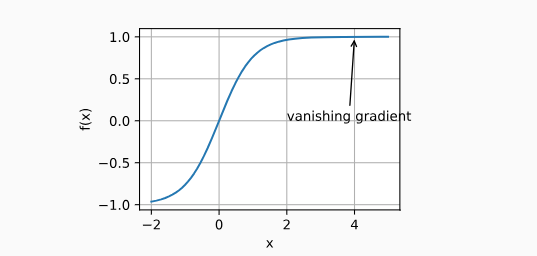

### 11.2. 凸性

#### 11.2.1. 定义

在进行凸分析之前，我们需要定义*凸集*（convex sets）和*凸函数*（convex functions）。

##### 11.2.1.1. 凸集

_凸集_（convex set）是凸性的基础。 简单地说，如果对于任何 𝑎,𝑏∈𝑋，连接 𝑎 和 𝑏 的线段也位于 𝑋 中，则向量空间中的一个集合 𝑋 是*凸*（convex）的。 在数学术语上，这意味着对于所有
𝜆∈[0,1]，我们得到

$$\lambda a + (1-\lambda)  b \in \mathcal{X} \text{ 当 } a, b \in \mathcal{X}$$


假设$\mathcal{X}$和$\mathcal{Y}$是凸集，那么$\mathcal {X} \cap \mathcal{Y}$也是凸集

深度学习中的问题是在凸集上定义的。 例如，$𝑅^𝑑$，即实数的 𝑑-维向量的集合是凸集（毕竟 𝑅𝑑 中任意两点之间的线存在$𝑅^𝑑$）中

##### 11.2.1.2. 凸函数

给定一个凸集$\mathcal{X}$，如果对于所有$x, x' \in \mathcal{X}$和所有$\lambda \in [0, 1]$，函数$f: \mathcal{X} \to \mathbb{R}$是凸的，我们可以得到

$$\lambda f(x) + (1-\lambda) f(x') \geq f(\lambda x + (1-\lambda) x')$$

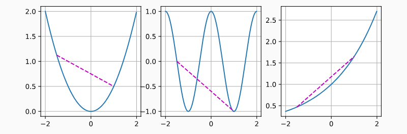

余弦函数为非凸的，而抛物线函数和指数函数为凸的

##### 11.2.1.3. 詹森不等式

**詹森不等式**（Jensen's inequality）。它是凸性定义的一种推广：

$$ \sum_i \alpha_i f(x_i)  \geq f\left(\sum_i \alpha_i x_i\right) \text{ and } E_X[f(X)] \geq f\left(E_X[X]\right)
$$

其中$\alpha_i$是满足$\sum_i \alpha_i = 1$的非负实数，$X$是随机变量。Ex 表示凸函数的期望

**定义**

假设 _f_ 是定义在区间 _I_ 上的凸函数。如果 $𝑥_1,𝑥_2,…,𝑥_𝑛$是 _I_ 上的任意点，且 $𝜆_1,𝜆_2,…,𝜆_𝑛$是非负实数满足 $𝜆_1+𝜆_2+…+𝜆_
𝑛=1$（即它们构成一个概率分布），则詹森不等式断言：

$$ 𝑓(𝜆_1𝑥_1+𝜆_2𝑥_2+…+𝜆_𝑛𝑥_𝑛)≤𝜆_1𝑓(𝑥_1)+𝜆_2𝑓(𝑥_2)+…+𝜆_𝑛𝑓(𝑥_𝑛)
$$

**凸函数**

函数 _f_ 被称为凸函数，如果对于所有*x*,_y_ 在定义域 𝐼 内，以及对于所有*t* 在闭区间 [0, 1] 内，都有：

$$ 𝑓(𝑡𝑥+(1−𝑡)𝑦)≤𝑡𝑓(𝑥)+(1−𝑡)𝑓(𝑦)
$$

这个性质表明，凸函数图形上的任意两点之间的线段总是位于或以上函数的图形。

**詹森不等式的意义和应用**

1. **期望值**：当 $𝜆_𝑖$解释为概率时，詹森不等式可以应用于随机变量。如果$𝑋$是一个随机变量，𝐸 表示期望，那么不等式变为：

   $$ 𝑓(𝐸[𝑋])≤𝐸[𝑓(𝑋)]
   $$

   这意味着凸函数的期望值的函数值小于或等于函数值的期望。

2. **度量风险和不确定性**：在金融和经济学中，詹森不等式用来度量风险和不确定性。例如，它可以用来证明某些风险度量的性质，如方差和其他风险指标。

3. **信息论**：在信息论中，詹森不等式用于证明诸如熵和互信息等重要属性。

4. **优化**：在优化理论中，詹森不等式帮助分析和证明最优解的存在性和性质。

###### 期望值

期望值（Expected Value，简称 EV）表示在一个随机试验中每次可能结果的概率加权平均值。期望值给出了一个随机变量的平均值或中心位置的度量，是理解和分析随机现象的关键工具。

**定义**

对于一个离散随机变量 𝑋*X*，其期望值定义为：

$𝐸(𝑋)=\sum_{𝑖=1}^{𝑛}𝑥_𝑖𝑝_𝑖$

其中 $𝑥_𝑖$ 是随机变量 𝑋 的可能值，而 $𝑝_𝑖$是对应的概率，满足 $𝑝_𝑖≥0$ 且$∑𝑝_𝑖=1$

对于一个连续随机变量，期望值定义为：

$$
E(X) = \int_{-\infty}^{\infty} x f(x) \, dx
$$

这里 𝑓(𝑥)是随机变量 𝑋 的概率密度函数。

**直观理解**

期望值可以理解为随机变量在多次试验中的“平均”结果。例如，如果你掷一个公平的六面骰子，每个面朝上的概率都是 1661，则骰子的期望值为：

$$ 𝐸(𝑋)=1⋅\frac{1}{6}+2⋅\frac{1}{6}+3⋅\frac{1}{6}+4⋅\frac{1}{6}+5⋅\frac{1}{6}+6⋅\frac{1}{6}=3.5 $$

这意味着如果你掷很多次骰子，平均结果会趋近于 3.5。

**期望值的性质**

- **线性**：期望值具有线性特性，即 𝐸(𝑎𝑋+𝑏𝑌)=𝑎𝐸(𝑋)+𝑏𝐸(𝑌)，其中 𝑋 和 𝑌 是随机变量，𝑎 和 𝑏 是常数。
- **独立性**：如果两个随机变量 𝑋 和 𝑌 独立，则 𝐸(𝑋𝑌)=𝐸(𝑋)𝐸(𝑌)。

#### 11.2.2. 性质

凸函数的局部极小值也是全局极小值

凸函数的*子集*（below sets）定义凸集

如果一个函数二阶导数存在，二阶导数=0 就表示是凸函数

#### 11.2.3. 约束

凸函数可以在约束条件下找到最小值

### 11.3. 梯度下降

- 学习率的大小很重要：学习率太大会使模型发散，学习率太小会没有进展。
- 梯度下降会可能陷入局部极小值，而得不到全局最小值。

#### 11.3.3. 自适应方法

##### 11.3.3.1. 牛顿法

常规函数的**泰勒展开式**

$$ f(x+\eta) = f(x) + \eta ^ T \nabla f(x) + \frac{1}{2} \eta ^ T \nabla ^2 f(x) \eta + O(||\eta||^3)
$$

**Hessian 矩阵**

给定一个从 $𝑅^𝑛$到 𝑅 的二次可微函数 $𝑓:𝑅^𝑛→𝑅$，该函数的 Hessian 矩阵 𝐻 通常定义为其所有二阶偏导数的方阵。如果 𝑓 是在点 𝑥 的函数，其 Hessian 矩阵 𝐻 通常定义为：

$$ H(f)(x)= \begin{bmatrix} \frac{\partial^2 f}{\partial x_1^2} & \frac{\partial^2 f}{\partial x_1 \partial x_2} &
\cdots & \frac{\partial^2 f}{\partial x_1 \partial x_n} \\ \frac{\partial^2 f}{\partial x_2 \partial x_1} &
\frac{\partial^2 f}{\partial x_2^2} & \cdots & \frac{\partial^2 f}{\partial x_2 \partial x_n} \\ \vdots & \vdots &
\ddots & \vdots \\ \frac{\partial^2 f}{\partial x_n \partial x_1} & \frac{\partial^2 f}{\partial x_n \partial x_2} &
\cdots & \frac{\partial^2 f}{\partial x_n^2} \end{bmatrix} $$

考虑一个简单的二元函数 $ f(x, y) = x^2 + 3xy + y^2 $，计算其 Hessian 矩阵：

$$ H(f)(x, y) = \begin{bmatrix} \frac{\partial^2 f}{\partial x^2} & \frac{\partial^2 f}{\partial x \partial y} \\
\frac{\partial^2 f}{\partial y \partial x} & \frac{\partial^2 f}{\partial y^2} \end{bmatrix} = \begin{bmatrix} 2 & 3 \\
3 & 2 \end{bmatrix} $$

𝑓 的最小值满足 ∇𝑓=0。 通过取 𝜖 的导数， 再忽略不重要的高阶项

$$ \nabla f(x) + H \eta = 0 =>  \eta = - H^{-1} \nabla f(x)
$$

举一个简单的例子，对于$𝑓(𝑥)=\frac{1}{2}𝑥^2$，我们有 ∇𝑓(𝑥)=𝑥 和 𝐻=1。 因此，对于任何 𝑥，我们可以获得 𝜖=−𝑥。 一步就足以完美地收敛，而无须任何调整。
我们在这里比较幸运：泰勒展开式是确切的，因为$𝑓(𝑥+𝜖)=\frac{1}{2}𝑥^2+𝜖𝑥+\frac{1}{2}𝜖^2$

但是如果是一个非凸的函数，比如$f(x) = x cos(cs)$，这么做会导致 f 增加

##### 11.3.3.2. 收敛性分析

用$𝑥^{(𝑘)}$表示 𝑥 在第$𝑘^{th}$次迭代时的值, 假设$|f'''(\eta^k)|/(2f''x^{(k)})\le c$, 可以得出二次递减误差

$$ |e^{(k+1)}| \le c(e^k)^2 $$

##### 11.3.3.3. 预处理

计算和存储完整的 Hessian 非常昂贵，而改善这个问题的一种方法是“预处理”。 它回避了计算整个 Hessian，而只计算“对角线”项，即如下的算法更新

$$ x <- x - \eta diag(H)^{-1} \nabla f(x)
$$

### 11.4. 随机梯度下降

#### 11.4.1. 随机梯度更新 SGD

为了降低计算量，把平均梯度改成随机梯度。就用 1 个随即输入求梯度

#### 11.4.2. 动态学习率

三种方式

$$ \begin{aligned} \eta(t) & = \eta_i \text{ if } t_i \leq t \leq t_{i+1} && \text{分段常数} \\ \eta(t) & = \eta_0 \cdot
e^{-\lambda t} && \text{指数衰减} \\ \eta(t) & = \eta_0 \cdot (\beta t + 1)^{-\alpha} && \text{多项式衰减} \end{aligned} $$

_分段常数_（piecewise constant）场景中，我们会降低学习率，例如，每当优化进度停顿时。这是训练深度网络的常见策略。

_指数衰减_（exponential decay）来更积极地减低它。不幸的是，这往往会导致算法收敛之前过早停止。

一个受欢迎的选择是 𝛼=0.5 的*多项式衰减*（polynomial decay）

### 11.5. 小批量随机梯度下降

#### 11.5.1. 向量化和缓存

四种策略

1. 我们可以通过点积进行逐元素计算 - 慢
2. 我们可以一次计算一列 - 可以缓存 1 个列向量
3. 我们可以简单地计算 𝐴=𝐵𝐶 - 最快但放不下
4. 我们可以将 𝐵 和 𝐶 分成较小的区块矩阵，然后一次计算 𝐴 的一个区块 - 最常用的方法

#### 11.5.2. 小批量

我们可以通过将其应用于一个小批量观测值来提高此操作的*计算*效率

#### 11.5.3. 读取数据集

需要把输入数据减去均值并且除以方差

#### 11.5.5. 简洁实现

```python
#@save
d2l.DATA_HUB['airfoil'] = (d2l.DATA_URL + 'airfoil_self_noise.dat',
                           '76e5be1548fd8222e5074cf0faae75edff8cf93f')

#@save
def get_data_ch11(batch_size=10, n=1500):
    data = np.genfromtxt(d2l.download('airfoil'),
                         dtype=np.float32, delimiter='\t')
    data = torch.from_numpy((data - data.mean(axis=0)) / data.std(axis=0))
    data_iter = d2l.load_array((data[:n, :-1], data[:n, -1]),
                               batch_size, is_train=True)
    return data_iter, data.shape[1]-1

def sgd(params, states, hyperparams):
    for p in params:
        p.data.sub_(hyperparams['lr'] * p.grad)
        p.grad.data.zero_()

#@save
def train_concise_ch11(trainer_fn, hyperparams, data_iter, num_epochs=4):
    # 初始化模型
    net = nn.Sequential(nn.Linear(5, 1))
    def init_weights(m):
        if type(m) == nn.Linear:
            torch.nn.init.normal_(m.weight, std=0.01)
    net.apply(init_weights)

    optimizer = trainer_fn(net.parameters(), **hyperparams)
    loss = nn.MSELoss(reduction='none')
    animator = d2l.Animator(xlabel='epoch', ylabel='loss',
                            xlim=[0, num_epochs], ylim=[0.22, 0.35])
    n, timer = 0, d2l.Timer()
    for _ in range(num_epochs):
        for X, y in data_iter:
            optimizer.zero_grad()
            out = net(X)
            y = y.reshape(out.shape)
            l = loss(out, y)
            l.mean().backward()
            optimizer.step()
            n += X.shape[0]
            if n % 200 == 0:
                timer.stop()
                # MSELoss计算平方误差时不带系数1/2
                animator.add(n/X.shape[0]/len(data_iter),
                             (d2l.evaluate_loss(net, data_iter, loss) / 2,))
                timer.start()
    print(f'loss: {animator.Y[0][-1]:.3f}, {timer.avg():.3f} sec/epoch')

data_iter, _ = get_data_ch11(10)
train_concise_ch11('sgd', {'learning_rate': 0.05}, data_iter)
```

### 11.6. 动量法

动量法就是除了更新导数外，还加上了上一次的值乘$\beta$。其中 g 表示导数

$v_t = \beta v_{t-1} + g_{t,t-1}$

对于例子 $f(x) = 0.1x_1^2 + 2x_2^2$

如果用随机梯度下降代码如下，结果在 x1 方向收敛的很缓慢

```python
%matplotlib inline
import torch
from d2l import torch as d2l

eta = 0.4
def f_2d(x1, x2):
    return 0.1 * x1 ** 2 + 2 * x2 ** 2
def gd_2d(x1, x2, s1, s2):
    return (x1 - eta * 0.2 * x1, x2 - eta * 4 * x2, 0, 0)

d2l.show_trace_2d(f_2d, d2l.train_2d(gd_2d))
```

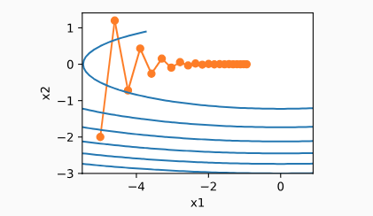

动量法如下，收敛很快

```python
def momentum_2d(x1, x2, v1, v2):
    v1 = beta * v1 + 0.2 * x1
    v2 = beta * v2 + 4 * x2
    return x1 - eta * v1, x2 - eta * v2, v1, v2

eta, beta = 0.6, 0.5
d2l.show_trace_2d(f_2d, d2l.train_2d(momentum_2d))
```


##### 11.6.2.2. 简洁实现

```python
trainer = torch.optim.SGD
d2l.train_concise_ch11(trainer, {'lr': 0.005, 'momentum': 0.9}, data_iter)
```

**动量法的实现非常简单，但它需要我们存储额外的状态向量（动量 𝑣）**

### 11.7. AdaGrad 算法

#### 11.7.1. 稀疏特征和学习率

我们大多希望在训练的过程中降低学习率，速度通常为$\mathcal{O}(t^{-\frac{1}{2}})$或更低

对于特征值偶尔出现的模型，例如自然语言模型。会发现常见特征的参数相当迅速地收敛到最佳值，而对于不常见的特征，我们仍缺乏足够的观测以确定其最佳值

解决此问题的一个方法是记录我们看到特定特征的次数，然后将其用作调整学习率。即我们可以使用大小为$\eta_i = \frac{\eta_0}{\sqrt{s(i, t) + c}}$的学习率，而不是$\eta = \frac{\eta_0}{\sqrt{t + c}}$。

在这里$s(i, t)$计下了我们截至$t$时观察到功能$i$的次数

AdaGrad 算法通过将粗略的计数器$s(i, t)$替换为先前观察所得梯度的平方之和来解决这个问题。

它使用$s(i, t+1) = s(i, t) + \left(\partial_i f(\mathbf{x})\right)^2$来调整学习率。

#### 11.7.2. 预处理

没看懂。。。

#### 11.7.3. 算法

我们使用变量$\mathbf{s}_t$来累加过去的梯度方差，如下所示：

$$
\begin{aligned}

  \mathbf{g}_t & = \partial_{\mathbf{w}} l(y_t, f(\mathbf{x}_t, \mathbf{w})), \\

  \mathbf{s}_t & = \mathbf{s}_{t-1} + \mathbf{g}_t^2, \\

  \mathbf{w}_t & = \mathbf{w}_{t-1} - \frac{\eta}{\sqrt{\mathbf{s}_t + \epsilon}} \cdot \mathbf{g}_t.

\end{aligned}
$$

与之前一样，$\eta$是学习率，$\epsilon$是一个为维持数值稳定性而添加的常数，用来确保我们不会除以$0$。最后，我们初始化$\mathbf{s}_0 = \mathbf{0}$。

用这个函数$f(x) = 0.1x_1^2 + 2x_2^2$举例，$\eta = 0.4$

```python
%matplotlib inline
import math
import torch
from d2l import torch as d2l

def adagrad_2d(x1, x2, s1, s2):
    eps = 1e-6
    g1, g2 = 0.2 * x1, 4 * x2
    s1 += g1 ** 2
    s2 += g2 ** 2
    x1 -= eta / math.sqrt(s1 + eps) * g1
    x2 -= eta / math.sqrt(s2 + eps) * g2
    return x1, x2, s1, s2

def f_2d(x1, x2):
    return 0.1 * x1 ** 2 + 2 * x2 ** 2

eta = 0.4
d2l.show_trace_2d(f_2d, d2l.train_2d(adagrad_2d))
```

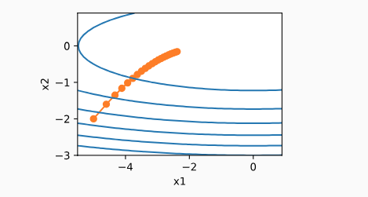

如果$\eta=2$，结果如下


#### 11.7.5. 简洁实现

```python
trainer = torch.optim.Adagrad
d2l.train_concise_ch11(trainer, {'lr': 0.1}, data_iter)
```

- AdaGrad 算法会在单个坐标层面动态降低学习率。
- AdaGrad 算法利用梯度的大小作为调整进度速率的手段：用较小的学习率来补偿带有较大梯度的坐标。
- 在深度学习问题中，由于内存和计算限制，计算准确的二阶导数通常是不可行的。梯度可以作为一个有效的代理。
- 如果优化问题的结构相当不均匀，AdaGrad 算法可以帮助缓解扭曲。
- AdaGrad 算法对于**稀疏特征**特别有效，在此情况下由于不常出现的问题，学习率需要更慢地降低。
- 在深度学习问题上，AdaGrad
  算法有时在降低学习率方面可能过于剧烈。我们将在 [11.10 节](https://zh-v2.d2l.ai/chapter_optimization/adam.html#sec-adam)一节讨论缓解这种情况的策略。

### 11.8. RMSProp 算法

因为 Adagrad 算法将梯度$𝑔_𝑡$的平方累加成状态矢量$𝑠_𝑡=𝑠_{𝑡−1}+𝑔_𝑡^2$。 因此，由于缺乏规范化，没有约束力，$𝑠_𝑡$持续增长，几乎上是在算法收敛时呈线性递增

为了限制$S_t$增长，可以用$S_t/t$，但是生效慢。还有种方法按动量法中的方式使用泄漏平均值，即$𝑠_𝑡←𝛾𝑠_{𝑡−1}+(1−𝛾)𝑔_𝑡^2$，其中参数 𝛾>0。 保持所有其它部分不变就产生了 RMSProp
算法

#### 11.8.1. 算法

$$
\begin{aligned}

  \mathbf{s}_t & \leftarrow \gamma \mathbf{s}_{t-1} + (1 - \gamma) \mathbf{g}_t^2, \\

  \mathbf{x}_t & \leftarrow \mathbf{x}_{t-1} - \frac{\eta}{\sqrt{\mathbf{s}_t + \epsilon}} \odot \mathbf{g}_t.

\end{aligned}
$$

常数$\epsilon > 0$通常设置为$10^{-6}$，以确保我们不会因除以零或步长过大而受到影响。

#### 11.8.2. 从零开始实现

用这个函数$f(x) = 0.1x_1^2 + 2x_2^2$举例，当我们使用学习率为 0.4 的 Adagrad 算法时，变量在算法的后期阶段移动非常缓慢，因为学习率衰减太快。 RMSProp 算法中不会发生这种情况，因为 𝜂
是单独控制的

```python
def rmsprop_2d(x1, x2, s1, s2):
    g1, g2, eps = 0.2 * x1, 4 * x2, 1e-6
    s1 = gamma * s1 + (1 - gamma) * g1 ** 2
    s2 = gamma * s2 + (1 - gamma) * g2 ** 2
    x1 -= eta / math.sqrt(s1 + eps) * g1
    x2 -= eta / math.sqrt(s2 + eps) * g2
    return x1, x2, s1, s2

def f_2d(x1, x2):
    return 0.1 * x1 ** 2 + 2 * x2 ** 2

eta, gamma = 0.4, 0.9
d2l.show_trace_2d(f_2d, d2l.train_2d(rmsprop_2d))
```


#### 11.8.3. 简洁实现

```python
trainer = torch.optim.RMSprop
d2l.train_concise_ch11(trainer, {'lr': 0.01, 'alpha': 0.9},data_iter)
```

- RMSProp 算法与 Adagrad 算法非常相似，因为两者都使用梯度的平方来缩放系数。
- RMSProp 算法与动量法都使用泄漏平均值。但是，RMSProp 算法使用该技术来调整按系数顺序的预处理器。
- 在实验中，学习率需要由实验者调度。
- 系数 𝛾 决定了在调整每坐标比例时历史记录的时长。

### 11.9. Adadelta

#### 11.9.1. Adadelta 算法

以下是 Adadelta 的技术细节

$$ \begin{aligned}

\mathbf{s}_t & = \rho \mathbf{s}_{t-1} + (1 - \rho) \mathbf{g}_t^2.

\end{aligned} $$

与 RMSProp 算法区别是我们使用重新缩放的梯度$\mathbf{g}_t'$执行更新，即

$$ \begin{aligned}

\mathbf{x}_t & = \mathbf{x}_{t-1} - \mathbf{g}_t'. \\

\end{aligned} $$

那么，调整后的梯度$\mathbf{g}_t'$是什么？我们可以按如下方式计算它：

$$
\begin{aligned}

  \mathbf{g}_t' & = \frac{\sqrt{\Delta\mathbf{x}_{t-1} + \epsilon}}{\sqrt{{\mathbf{s}_t + \epsilon}}} \odot \mathbf{g}_t, \\

\end{aligned}
$$

其中$\Delta \mathbf{x}_{t-1}$是重新缩放梯度的平方$\mathbf{g}_t'$的泄漏平均值。我们将$\Delta \mathbf{x}_{0}$初始化为$0$，然后在每个步骤中使用$\mathbf{g}_t'$更新它，即

$$
\begin{aligned}

  \Delta \mathbf{x}_t & = \rho \Delta\mathbf{x}_{t-1} + (1 - \rho) {\mathbf{g}_t'}^2,

\end{aligned}
$$

和$\epsilon$（例如$10^{-5}$这样的小值）是为了保持数字稳定性而加入的。

#### 11.9.2. 代码实现

```python
%matplotlib inline
import torch
from d2l import torch as d2l


def init_adadelta_states(feature_dim):
    s_w, s_b = torch.zeros((feature_dim, 1)), torch.zeros(1)
    delta_w, delta_b = torch.zeros((feature_dim, 1)), torch.zeros(1)
    return ((s_w, delta_w), (s_b, delta_b))

def adadelta(params, states, hyperparams):
    rho, eps = hyperparams['rho'], 1e-5
    for p, (s, delta) in zip(params, states):
        with torch.no_grad():
            # In-placeupdatesvia[:]
            s[:] = rho * s + (1 - rho) * torch.square(p.grad)
            g = (torch.sqrt(delta + eps) / torch.sqrt(s + eps)) * p.grad
            p[:] -= g
            delta[:] = rho * delta + (1 - rho) * g * g
        p.grad.data.zero_()

ata_iter, feature_dim = d2l.get_data_ch11(batch_size=10)
d2l.train_ch11(adadelta, init_adadelta_states(feature_dim),{'rho': 0.9}, data_iter, feature_dim);

'''简洁实现'''
trainer = torch.optim.Adadelta
d2l.train_concise_ch11(trainer, {'rho': 0.9}, data_iter)
```

- Adadelta 没有学习率参数。相反，它使用参数本身的变化率来调整学习率。
- Adadelta 需要两个状态变量来存储梯度的二阶导数和参数的变化。
- Adadelta 使用泄漏的平均值来保持对适当统计数据的运行估计。

### 11.10. Adam 算法

Adam 算法 ([Kingma and Ba, 2014](https://zh-v2.d2l.ai/chapter_references/zreferences.html#id83))将所有这些技术汇总到一个高效的学习算法中

#### 11.10.1. 算法

$$
\begin{aligned}

  \mathbf{v}_t & \leftarrow \beta_1 \mathbf{v}_{t-1} + (1 - \beta_1) \mathbf{g}_t, \\

  \mathbf{s}_t & \leftarrow \beta_2 \mathbf{s}_{t-1} + (1 - \beta_2) \mathbf{g}_t^2.

\end{aligned}
$$

这里$\beta_1$和$\beta_2$是非负加权参数。常将它们设置为$\beta_1 = 0.9$和$\beta_2 = 0.999$。也就是说，方差估计的移动远远慢于动量估计的移动。

注意，如果我们初始化$\mathbf{v}_0 = \mathbf{s}_0 = 0$，就会获得一个相当大的初始偏差。

我们可以通过使用$\sum_{i=0}^t \beta^i = \frac{1 - \beta^t}{1 - \beta}$来解决这个问题。相应地，标准化状态变量由下式获得

$$\hat{\mathbf{v}}_t = \frac{\mathbf{v}_t}{1 - \beta_1^t} \text{ and } \hat{\mathbf{s}}_t = \frac{\mathbf{s}_t}{1 - \beta_2^t}$$

有了正确的估计，我们现在可以写出更新方程。

首先，我们以非常类似于 RMSProp 算法的方式重新缩放梯度以获得

$$\mathbf{g}_t' = \frac{\eta \hat{\mathbf{v}}_t}{\sqrt{\hat{\mathbf{s}}_t} + \epsilon}$$

与 RMSProp 不同，我们的更新使用动量$\hat{\mathbf{v}}_t$而不是梯度本身。此外，由于使用$\frac{1}{\sqrt{\hat{\mathbf{s}}_t} +
\epsilon}$而不是$\frac{1}{\sqrt{\hat{\mathbf{s}}_t + \epsilon}}$进行缩放，两者会略有差异。前者在实践中效果略好一些，因此与 RMSProp
算法有所区分。通常，我们选择$\epsilon = 10^{-6}$，这是为了在数值稳定性和逼真度之间取得良好的平衡。

最后，我们简单更新：

$$\mathbf{x}_t \leftarrow \mathbf{x}_{t-1} - \mathbf{g}_t'$$

#### 11.10.2. 实现

```python
%matplotlib inline
import torch
from d2l import torch as d2l


def init_adam_states(feature_dim):
    v_w, v_b = torch.zeros((feature_dim, 1)), torch.zeros(1)
    s_w, s_b = torch.zeros((feature_dim, 1)), torch.zeros(1)
    return ((v_w, s_w), (v_b, s_b))

def adam(params, states, hyperparams):
    beta1, beta2, eps = 0.9, 0.999, 1e-6
    for p, (v, s) in zip(params, states):
        with torch.no_grad():
            v[:] = beta1 * v + (1 - beta1) * p.grad
            s[:] = beta2 * s + (1 - beta2) * torch.square(p.grad)
            v_bias_corr = v / (1 - beta1 ** hyperparams['t'])
            s_bias_corr = s / (1 - beta2 ** hyperparams['t'])
            p[:] -= hyperparams['lr'] * v_bias_corr / (torch.sqrt(s_bias_corr) + eps)
        p.grad.data.zero_()
    hyperparams['t'] += 1

data_iter, feature_dim = d2l.get_data_ch11(batch_size=10)
d2l.train_ch11(adam, init_adam_states(feature_dim),{'lr': 0.01, 't': 1}, data_iter, feature_dim);

'''简洁用法'''
trainer = torch.optim.Adam
d2l.train_concise_ch11(trainer, {'lr': 0.01}, data_iter)
```

#### 11.10.3. Yogi

Adam 算法也存在一些问题： 即使在凸环境下，当$𝑠_𝑡$的二次矩估计值爆炸时，它可能无法收敛

重写 Adam 算法更新如下：

$$\mathbf{s}_t \leftarrow \mathbf{s}_{t-1} + (1 - \beta_2) \left(\mathbf{g}_t^2 - \mathbf{s}_{t-1}\right)$$

每当$\mathbf{g}_t^2$具有值很大的变量或更新很稀疏时，$\mathbf{s}_t$可能会太快地“忘记”过去的值。一个有效的解决方法是将$\mathbf{g}_t^2 - \mathbf{s}_
{t-1}$替换为$\mathbf{g}_t^2 \odot \mathop{\mathrm{sgn}}(\mathbf{g}_t^2 - \mathbf{s}_{t-1})$。

这就是 Yogi 更新，现在更新的规模不再取决于偏差的量。

$$\mathbf{s}_t \leftarrow \mathbf{s}_{t-1} + (1 - \beta_2) \mathbf{g}_t^2 \odot \mathop{\mathrm{sgn}}(\mathbf{g}_t^2 -
\mathbf{s}_{t-1})$$

```python
def yogi(params, states, hyperparams):
    beta1, beta2, eps = 0.9, 0.999, 1e-3
    for p, (v, s) in zip(params, states):
        with torch.no_grad():
            v[:] = beta1 * v + (1 - beta1) * p.grad
            s[:] = s + (1 - beta2) * torch.sign(
                torch.square(p.grad) - s) * torch.square(p.grad)
            v_bias_corr = v / (1 - beta1 ** hyperparams['t'])
            s_bias_corr = s / (1 - beta2 ** hyperparams['t'])
            p[:] -= hyperparams['lr'] * v_bias_corr / (torch.sqrt(s_bias_corr)
                                                       + eps)
        p.grad.data.zero_()
    hyperparams['t'] += 1

data_iter, feature_dim = d2l.get_data_ch11(batch_size=10)
d2l.train_ch11(yogi, init_adam_states(feature_dim),
               {'lr': 0.01, 't': 1}, data_iter, feature_dim);
```

### 11.11. 学习率调度器

之前说的都是权重更新的算法，但是学习率是多少也很重要

- 首先，学习率的大小很重要。如果它太大，优化就会发散；如果它太小，训练就会需要过长时间，或者我们最终只能得到次优的结果。
- 其次，衰减速率同样很重要。如果学习率持续过高，我们可能最终会在最小值附近弹跳，从而无法达到最优解。
-
另一个同样重要的方面是初始化。这既涉及参数最初的设置方式（详情请参阅 [4.8 节](https://zh-v2.d2l.ai/chapter_multilayer-perceptrons/numerical-stability-and-init.html#sec-numerical-stability)），又关系到它们最初的演变方式。这被戏称为*预热*（warmup），即我们最初开始向着解决方案迈进的速度有多快。一开始的大步可能没有好处，特别是因为最初的参数集是随机的。最初的更新方向可能也是毫无意义的。
- 最后，还有许多优化变体可以执行周期性学习率调整。

#### 11.11.1. 一个简单的问题

```python
%matplotlib inline
import math
import torch
from torch import nn
from torch.optim import lr_scheduler
from d2l import torch as d2l


def net_fn():
    model = nn.Sequential(
        nn.Conv2d(1, 6, kernel_size=5, padding=2), nn.ReLU(),
        nn.MaxPool2d(kernel_size=2, stride=2),
        nn.Conv2d(6, 16, kernel_size=5), nn.ReLU(),
        nn.MaxPool2d(kernel_size=2, stride=2),
        nn.Flatten(),
        nn.Linear(16 * 5 * 5, 120), nn.ReLU(),
        nn.Linear(120, 84), nn.ReLU(),
        nn.Linear(84, 10))

    return model

loss = nn.CrossEntropyLoss()
device = d2l.try_gpu()

batch_size = 256
train_iter, test_iter = d2l.load_data_fashion_mnist(batch_size=batch_size)

# 代码几乎与d2l.train_ch6定义在卷积神经网络一章LeNet一节中的相同
def train(net, train_iter, test_iter, num_epochs, loss, trainer, device,
          scheduler=None):
    net.to(device)
    animator = d2l.Animator(xlabel='epoch', xlim=[0, num_epochs],
                            legend=['train loss', 'train acc', 'test acc'])

    for epoch in range(num_epochs):
        metric = d2l.Accumulator(3)  # train_loss,train_acc,num_examples
        for i, (X, y) in enumerate(train_iter):
            net.train()
            trainer.zero_grad()
            X, y = X.to(device), y.to(device)
            y_hat = net(X)
            l = loss(y_hat, y)
            l.backward()
            trainer.step()
            with torch.no_grad():
                metric.add(l * X.shape[0], d2l.accuracy(y_hat, y), X.shape[0])
            train_loss = metric[0] / metric[2]
            train_acc = metric[1] / metric[2]
            if (i + 1) % 50 == 0:
                animator.add(epoch + i / len(train_iter),
                             (train_loss, train_acc, None))

        test_acc = d2l.evaluate_accuracy_gpu(net, test_iter)
        animator.add(epoch+1, (None, None, test_acc))

        if scheduler:
            if scheduler.__module__ == lr_scheduler.__name__:
                # UsingPyTorchIn-Builtscheduler
                scheduler.step()
            else:
                # Usingcustomdefinedscheduler
                for param_group in trainer.param_groups:
                    param_group['lr'] = scheduler(epoch)

    print(f'train loss {train_loss:.3f}, train acc {train_acc:.3f}, '
          f'test acc {test_acc:.3f}')

lr, num_epochs = 0.3, 30
net = net_fn()
trainer = torch.optim.SGD(net.parameters(), lr=lr)
train(net, train_iter, test_iter, num_epochs, loss, trainer, device)
```

设学习率为 0.3 并训练 30 次迭代。 留意在超过了某点、测试准确度方面的进展停滞时，训练准确度将如何继续提高。 两条曲线之间的间隙表示过拟合

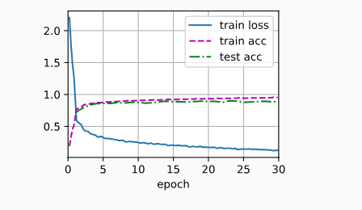

#### 11.11.2. 学习率调度器

可以在每个迭代轮数（甚至在每个小批量）之后向下调整学习率。定义一个调度器。 当调用更新次数时，它将返回学习率的适当值。 让我们定义一个简单的方法，将学习率设置为$𝜂=𝜂_0(𝑡+1)^{−\frac{1}{2}}$。

```python
class SquareRootScheduler:
    def __init__(self, lr=0.1):
        self.lr = lr

    def __call__(self, num_update):
        return self.lr * pow(num_update + 1.0, -0.5)

scheduler = SquareRootScheduler(lr=0.1)
d2l.plot(torch.arange(num_epochs), [scheduler(t) for t in range(num_epochs)])
net = net_fn()
trainer = torch.optim.SGD(net.parameters(), lr)
train(net, train_iter, test_iter, num_epochs, loss, trainer, device,scheduler)
```


#### 11.11.3. 策略

##### **单因子调度器**

多项式衰减的一种替代方案是乘法衰减，即$𝜂_{𝑡+1}←𝜂_𝑡⋅𝛼其中𝛼∈(0,1)$。 为了防止学习率衰减到一个合理的下界之下， 更新方程经常修改为$𝜂_{𝑡+1}←max⁡(𝜂_{min},𝜂_𝑡⋅𝛼)$。

```python
class FactorScheduler:
    def __init__(self, factor=1, stop_factor_lr=1e-7, base_lr=0.1):
        self.factor = factor
        self.stop_factor_lr = stop_factor_lr
        self.base_lr = base_lr

    def __call__(self, num_update):
        self.base_lr = max(self.stop_factor_lr, self.base_lr * self.factor)
        return self.base_lr

scheduler = FactorScheduler(factor=0.9, stop_factor_lr=1e-2, base_lr=2.0)
d2l.plot(torch.arange(50), [scheduler(t) for t in range(50)])
```

##### **多因子调度器**

训练深度网络的常见策略之一是保持学习率为一组分段的常量，并且不时地按给定的参数对学习率做乘法衰减。 具体地说，给定一组降低学习率的时间点，例如 𝑠={5,10,20}， 每当 𝑡∈𝑠 时，降低$𝜂_{𝑡+1}←𝜂_𝑡⋅𝛼$。
假设每步中的值减半，我们可以按如下方式实现这一点

```python
net = net_fn()
trainer = torch.optim.SGD(net.parameters(), lr=0.5)
scheduler = lr_scheduler.MultiStepLR(trainer, milestones=[15, 30], gamma=0.5)

def get_lr(trainer, scheduler):
    lr = scheduler.get_last_lr()[0]
    trainer.step()
    scheduler.step()
    return lr

d2l.plot(torch.arange(num_epochs), [get_lr(trainer, scheduler) for t in range(num_epochs)])
```

##### **余弦调度器**

它所依据的观点是：我们可能不想在一开始就太大地降低学习率，而且可能希望最终能用非常小的学习率来“改进”解决方案。 这产生了一个类似于余弦的调度，函数形式如下所示，学习率的值在 𝑡∈[0,𝑇]之间。

$$\eta_t = \eta_T + \frac{\eta_0 - \eta_T}{2} \left(1 + \cos(\pi t/T)\right)$$

这里$\eta_0$是初始学习率，$\eta_T$是当$T$时的目标学习率。此外，对于$t > T$，我们只需将值固定到$\eta_T$而不再增加它。在下面的示例中，我们设置了最大更新步数$T = 20$。

```python
class CosineScheduler:
    def __init__(self, max_update, base_lr=0.01, final_lr=0,
               warmup_steps=0, warmup_begin_lr=0):
        self.base_lr_orig = base_lr
        self.max_update = max_update
        self.final_lr = final_lr
        self.warmup_steps = warmup_steps
        self.warmup_begin_lr = warmup_begin_lr
        self.max_steps = self.max_update - self.warmup_steps

    def get_warmup_lr(self, epoch):
        increase = (self.base_lr_orig - self.warmup_begin_lr) \
                       * float(epoch) / float(self.warmup_steps)
        return self.warmup_begin_lr + increase

    def __call__(self, epoch):
        if epoch < self.warmup_steps:
            return self.get_warmup_lr(epoch)
        if epoch <= self.max_update:
            self.base_lr = self.final_lr + (
                self.base_lr_orig - self.final_lr) * (1 + math.cos(
                math.pi * (epoch - self.warmup_steps) / self.max_steps)) / 2
        return self.base_lr

scheduler = CosineScheduler(max_update=20, base_lr=0.3, final_lr=0.01)
d2l.plot(torch.arange(num_epochs), [scheduler(t) for t in range(num_epochs)])
```

##### 预热

使用预热期，在此期间学习率将增加至初始最大值，然后冷却直到优化过程结束。 为了简单起见，通常使用线性递增

```python
scheduler = CosineScheduler(20, warmup_steps=5, base_lr=0.3, final_lr=0.01)
d2l.plot(torch.arange(num_epochs), [scheduler(t) for t in range(num_epochs)])
```

## 12. 计算性能

### 12.1. 编译器和解释器

常规的编程是命令式编程

#### 12.1.1. 符号式编程

_号式编程_（symbolic programming），即代码通常只在完全定义了过程之后才执行计算。这个策略被多个深度学习框架使用，包括 Theano 和 TensorFlow（后者已经获得了命令式编程的扩展）。一般包括以下步骤：

1. 定义计算流程；
2. 将流程编译成可执行的程序；
3. 给定输入，调用编译好的程序执行。

#### 12.1.2. 混合式编程

大部分深度学习框架都在命令式编程与符号式编程之间进行选择。例如，Theano、TensorFlow（灵感来自前者）、Keras 和 CNTK 采用了符号式编程。相反地，Chainer 和 PyTorch 采取了命令式编程

#### 12.1.3. `Sequential`的混合式编程

torch.jit.script()来转换模型

```python
import torch
from torch import nn
from d2l import torch as d2l


# 生产网络的工厂模式
def get_net():
    net = nn.Sequential(nn.Linear(512, 256),
            nn.ReLU(),
            nn.Linear(256, 128),
            nn.ReLU(),
            nn.Linear(128, 2))
    return net

x = torch.randn(size=(1, 512))
net = get_net()
net(x)

net = torch.jit.script(net)
net(x)

#@save
class Benchmark:
    """用于测量运行时间"""
    def __init__(self, description='Done'):
        self.description = description

    def __enter__(self):
        self.timer = d2l.Timer()
        return self

    def __exit__(self, *args):
        print(f'{self.description}: {self.timer.stop():.4f} sec')

net = get_net()
with Benchmark('无torchscript'):
    for i in range(1000): net(x)

net = torch.jit.script(net)
with Benchmark('有torchscript'):
    for i in range(1000): net(x)

无torchscript: 0.1361 sec
有torchscript: 0.1204 sec
```

### 12.2. 异步计算

PyTorch 则使用了 Python 自己的调度器来实现不同的性能权衡。对 PyTorch 来说 GPU 操作在默认情况下是异步的。当调用一个使用 GPU
的函数时，操作会排队到特定的设备上，但不一定要等到以后才执行。这允许我们并行执行更多的计算，包括在 CPU 或其他 GPU 上的操作

#### 12.2.1. 通过后端异步处理

比较 Numpy 和 PyTorch

```python
# GPU计算热身
device = d2l.try_gpu()
a = torch.randn(size=(1000, 1000), device=device)
b = torch.mm(a, a)

with d2l.Benchmark('numpy'):
    for _ in range(10):
        a = numpy.random.normal(size=(1000, 1000))
        b = numpy.dot(a, a)

with d2l.Benchmark('torch'):
    for _ in range(10):
        a = torch.randn(size=(1000, 1000), device=device)
        b = torch.mm(a, a)

numpy: 1.0704 sec
torch: 0.0013 sec       # 这个不准，因为pytorch是异步的
#需要加上这句做个同步
torch.cuda.synchronize(device)
Done: 0.0049 sec
```

PyTorch 程序的执行主要发生在
C++实现的后端。由前端语言发出的操作被传递到后端执行。后端管理自己的线程，这些线程不断收集和执行排队的任务。请注意，要使其工作，后端必须能够跟踪计算图中各个步骤之间的依赖关系。因此，不可能并行化相互依赖的操作

一个 pytorch 执行的例子

```python
x = torch.ones((1, 2), device=device)
y = torch.ones((1, 2), device=device)
z = x * y + 2
z
```


每当 Python 前端线程执行前三条语句中的一条语句时，它只是将任务返回到后端队列。当最后一个语句的结果需要被打印出来时，Python 前端线程将等待 C++后端线程完成变量`z`的结果计算


### 12.3. 自动并行

#### 12.3.1. 基于 GPU 的并行计算

下面的`run`函数将执行 10 次*矩阵－矩阵*乘法时需要使用的数据分配到两个变量（`x_gpu1`和`x_gpu2`）中，这两个变量分别位于选择的不同设备上

```python
devices = d2l.try_all_gpus()
def run(x):
    return [x.mm(x) for _ in range(50)]

x_gpu1 = torch.rand(size=(4000, 4000), device=devices[0])
x_gpu2 = torch.rand(size=(4000, 4000), device=devices[1])

# 预热设备，先清空
run(x_gpu1)
run(x_gpu2)  # 预热设备
torch.cuda.synchronize(devices[0])
torch.cuda.synchronize(devices[1])

with d2l.Benchmark('GPU1 time'):
    run(x_gpu1)
    torch.cuda.synchronize(devices[0])

with d2l.Benchmark('GPU2 time'):
    run(x_gpu2)
    torch.cuda.synchronize(devices[1])

GPU1 time: 0.4600 sec
GPU2 time: 0.4706 sec

# 在2个设备上并行执行
with d2l.Benchmark('GPU1 & GPU2'):
    run(x_gpu1)
    run(x_gpu2)
    torch.cuda.synchronize()

GPU1 & GPU2: 0.4580 sec
```

#### 12.3.2. 并行计算与通信

在 GPU 上计算，然后将结果复制回 CPU 来模拟这个过程

```python
def copy_to_cpu(x, non_blocking=False):
    return [y.to('cpu', non_blocking=non_blocking) for y in x]

with d2l.Benchmark('在GPU1上运行'):
    y = run(x_gpu1)
    torch.cuda.synchronize()

with d2l.Benchmark('复制到CPU'):
    y_cpu = copy_to_cpu(y)
    torch.cuda.synchronize()

在GPU1上运行: 0.4608 sec
复制到CPU: 2.3504 sec

'''复用copy时间'''
with d2l.Benchmark('在GPU1上运行并复制到CPU'):
    y = run(x_gpu1)
    y_cpu = copy_to_cpu(y, True)
    torch.cuda.synchronize()

在GPU1上运行并复制到CPU: 1.7703 sec
```

### 12.5. 多 GPU 训练

#### 12.5.1. 问题拆分

1. 在多个 GPU 之间**拆分网络**。 也就是说，每个 GPU 将流入特定层的数据作为输入，跨多个后续层对数据进行处理，然后将数据发送到下一个 GPU。 与单个 GPU 所能处理的数据相比，我们可以用更大的网络处理数据。 此外，每个
   GPU 占用的*显存*（memory footprint）可以得到很好的控制，虽然它只是整个网络显存的一小部分
2. **拆分层**内的工作。 例如，将问题分散到 4 个 GPU，每个 GPU 生成 16 个通道的数据，而不是在单个 GPU 上计算 64 个通道。 对于全连接的层，同样可以拆分输出单元的数量
3. 跨多个 GPU 对**数据**进行拆分 - 这种方式更快，但是不能训练更大的模型


#### 12.5.2. 数据并行性


一般来说，𝑘 个 GPU 并行训练过程如下：

- 在任何一次训练迭代中，给定的随机的小批量样本都将被分成 𝑘 个部分，并均匀地分配到 GPU 上；
- 每个 GPU 根据分配给它的小批量子集，计算模型参数的损失和梯度；
- 将 𝑘 个 GPU 中的局部梯度聚合，以获得当前小批量的随机梯度；
- 聚合梯度被重新分发到每个 GPU 中；
- 每个 GPU 使用这个小批量随机梯度，来更新它所维护的完整的模型参数集。

#### 12.5.3. 简单网络

LeNet

```python
# 初始化模型参数
scale = 0.01
W1 = torch.randn(size=(20, 1, 3, 3)) * scale
b1 = torch.zeros(20)
W2 = torch.randn(size=(50, 20, 5, 5)) * scale
b2 = torch.zeros(50)
W3 = torch.randn(size=(800, 128)) * scale
b3 = torch.zeros(128)
W4 = torch.randn(size=(128, 10)) * scale
b4 = torch.zeros(10)
params = [W1, b1, W2, b2, W3, b3, W4, b4]

# 定义模型
def lenet(X, params):
    h1_conv = F.conv2d(input=X, weight=params[0], bias=params[1])
    h1_activation = F.relu(h1_conv)
    h1 = F.avg_pool2d(input=h1_activation, kernel_size=(2, 2), stride=(2, 2))
    h2_conv = F.conv2d(input=h1, weight=params[2], bias=params[3])
    h2_activation = F.relu(h2_conv)
    h2 = F.avg_pool2d(input=h2_activation, kernel_size=(2, 2), stride=(2, 2))
    h2 = h2.reshape(h2.shape[0], -1)
    h3_linear = torch.mm(h2, params[4]) + params[5]
    h3 = F.relu(h3_linear)
    y_hat = torch.mm(h3, params[6]) + params[7]
    return y_hat

# 交叉熵损失函数
loss = nn.CrossEntropyLoss(reduction='none')
```

#### 12.5.4. 数据同步

1. 向多个设备分发参数并附加梯度（`get_params`）
2. 需要跨多个设备对参数求和，也就是说，需要一个`allreduce`函数

```python
def get_params(params, device):
    new_params = [p.to(device) for p in params]
    for p in new_params:
        p.requires_grad_()
    return new_params

new_params = get_params(params, d2l.try_gpu(0))
print('b1 权重:', new_params[1])
print('b1 梯度:', new_params[1].grad)
'''
b1 权重: tensor([0., 0., 0., 0., 0., 0., 0., 0., 0., 0., 0., 0., 0., 0., 0., 0., 0., 0., 0., 0.],device='cuda:0', requires_grad=True)
b1 梯度: None
'''

def allreduce(data):
    for i in range(1, len(data)):
        data[0][:] += data[i].to(data[0].device)
    for i in range(1, len(data)):
        data[i][:] = data[0].to(data[i].device)

data = [torch.ones((1, 2), device=d2l.try_gpu(i)) * (i + 1) for i in range(2)]
print('allreduce之前：\n', data[0], '\n', data[1])
allreduce(data)
print('allreduce之后：\n', data[0], '\n', data[1])
'''
allreduce之前：
 tensor([[1., 1.]], device='cuda:0')
 tensor([[2., 2.]], device='cuda:1')
allreduce之后：
 tensor([[3., 3.]], device='cuda:0')
 tensor([[3., 3.]], device='cuda:1')
'''
```

#### 12.5.5. 数据分发

```python
data = torch.arange(20).reshape(4, 5)
devices = [torch.device('cuda:0'), torch.device('cuda:1')]
split = nn.parallel.scatter(data, devices)
print('input :', data)
print('load into', devices)
print('output:', split)
'''
input : tensor([[ 0,  1,  2,  3,  4],
        [ 5,  6,  7,  8,  9],
        [10, 11, 12, 13, 14],
        [15, 16, 17, 18, 19]])
load into [device(type='cuda', index=0), device(type='cuda', index=1)]
output: (tensor([[0, 1, 2, 3, 4],
        [5, 6, 7, 8, 9]], device='cuda:0'), tensor([[10, 11, 12, 13, 14],
        [15, 16, 17, 18, 19]], device='cuda:1'))
'''

#@save
def split_batch(X, y, devices):
    """将X和y拆分到多个设备上"""
    assert X.shape[0] == y.shape[0]
    return (nn.parallel.scatter(X, devices),
            nn.parallel.scatter(y, devices))
```

#### 12.5.6. 训练

```python
def train_batch(X, y, device_params, devices, lr):
    X_shards, y_shards = split_batch(X, y, devices)
    # 在每个GPU上分别计算损失
    ls = [loss(lenet(X_shard, device_W), y_shard).sum()
          for X_shard, y_shard, device_W in zip(
              X_shards, y_shards, device_params)]
    for l in ls:  # 反向传播在每个GPU上分别执行
        l.backward()
    # 将每个GPU的所有梯度相加，并将其广播到所有GPU
    with torch.no_grad():
        for i in range(len(device_params[0])):
            allreduce([device_params[c][i].grad for c in range(len(devices))])
    # 在每个GPU上分别更新模型参数
    for param in device_params:
        d2l.sgd(param, lr, X.shape[0]) # 在这里，我们使用全尺寸的小批量

def train(num_gpus, batch_size, lr):
    train_iter, test_iter = d2l.load_data_fashion_mnist(batch_size)
    devices = [d2l.try_gpu(i) for i in range(num_gpus)]
    # 将模型参数复制到num_gpus个GPU
    device_params = [get_params(params, d) for d in devices]
    num_epochs = 10
    animator = d2l.Animator('epoch', 'test acc', xlim=[1, num_epochs])
    timer = d2l.Timer()
    for epoch in range(num_epochs):
        timer.start()
        for X, y in train_iter:
            # 为单个小批量执行多GPU训练
            train_batch(X, y, device_params, devices, lr)
            torch.cuda.synchronize()
        timer.stop()
        # 在GPU0上评估模型
        animator.add(epoch + 1, (d2l.evaluate_accuracy_gpu(
            lambda x: lenet(x, device_params[0]), test_iter, devices[0]),))
    print(f'测试精度：{animator.Y[0][-1]:.2f}，{timer.avg():.1f}秒/轮，'f'在{str(devices)}')


train(num_gpus=1, batch_size=256, lr=0.2)
'''测试精度：0.84，2.7秒/轮，在[device(type='cuda', index=0)]'''

train(num_gpus=2, batch_size=256, lr=0.2)
'''测试精度：0.83，3.6秒/轮，在[device(type='cuda', index=0), device(type='cuda', index=1)]'''
```

### 12.6. 多 GPU 的简洁实现

```python
'''12.6.1. 简单网络 ResNet-18'''
#@save
def resnet18(num_classes, in_channels=1):
    """稍加修改的ResNet-18模型"""
    def resnet_block(in_channels, out_channels, num_residuals,
                     first_block=False):
        blk = []
        for i in range(num_residuals):
            if i == 0 and not first_block:
                blk.append(d2l.Residual(in_channels, out_channels,
                                        use_1x1conv=True, strides=2))
            else:
                blk.append(d2l.Residual(out_channels, out_channels))
        return nn.Sequential(*blk)

    # 该模型使用了更小的卷积核、步长和填充，而且删除了最大汇聚层
    net = nn.Sequential(
        nn.Conv2d(in_channels, 64, kernel_size=3, stride=1, padding=1),
        nn.BatchNorm2d(64),
        nn.ReLU())
    net.add_module("resnet_block1", resnet_block(
        64, 64, 2, first_block=True))
    net.add_module("resnet_block2", resnet_block(64, 128, 2))
    net.add_module("resnet_block3", resnet_block(128, 256, 2))
    net.add_module("resnet_block4", resnet_block(256, 512, 2))
    net.add_module("global_avg_pool", nn.AdaptiveAvgPool2d((1,1)))
    net.add_module("fc", nn.Sequential(nn.Flatten(),
                                       nn.Linear(512, num_classes)))
    return net

'''12.6.2. 网络初始化'''
net = resnet18(10)
# 获取GPU列表
devices = d2l.try_all_gpus()
# 我们将在训练代码实现中初始化网络

'''12.6.3. 训练'''
def train(net, num_gpus, batch_size, lr):
    train_iter, test_iter = d2l.load_data_fashion_mnist(batch_size)
    devices = [d2l.try_gpu(i) for i in range(num_gpus)]
    def init_weights(m):
        if type(m) in [nn.Linear, nn.Conv2d]:
            nn.init.normal_(m.weight, std=0.01)
    net.apply(init_weights)
    # 在多个GPU上设置模型
    net = nn.DataParallel(net, device_ids=devices)
    trainer = torch.optim.SGD(net.parameters(), lr)
    loss = nn.CrossEntropyLoss()
    timer, num_epochs = d2l.Timer(), 10
    animator = d2l.Animator('epoch', 'test acc', xlim=[1, num_epochs])
    for epoch in range(num_epochs):
        net.train()
        timer.start()
        for X, y in train_iter:
            trainer.zero_grad()
            # 都汇聚到device[0]上
            X, y = X.to(devices[0]), y.to(devices[0])
            l = loss(net(X), y)
            l.backward()
            trainer.step()
        timer.stop()
        animator.add(epoch + 1, (d2l.evaluate_accuracy_gpu(net, test_iter),))
    print(f'测试精度：{animator.Y[0][-1]:.2f}，{timer.avg():.1f}秒/轮，'f'在{str(devices)}')
```

## 13. 计算机视觉

### 目标检测模型的常规步骤

训练的时候，模型会根据输入，产生不同分辨率下的锚框和偏移量

标定的数据只包含了物体的类别和边界框 bbox，也就是物体的中心坐标和长宽

因为模型固定，锚框的尺寸就是固定的。根据 IoU 的最大值，搜索到最重合 bbox 的锚框。计算 bbox 和这个锚框的偏移量。这个偏移量包含中心点和长宽

把和这个锚框重合度比较大的其他锚框都去除 - 非极大值抑制

训练的损失函数就是类别还有偏移的差

### 13.1. 图像增广

就是为了扩大训练集，对图像做预处理

#### 13.1.1. 常用的图像增广方法

初始准备

```python
d2l.set_figsize()
img = d2l.Image.open('../img/cat1.jpg')
d2l.plt.imshow(img);

'''定义一个可以多次操作图像的辅助函数'''
def apply(img, aug, num_rows=2, num_cols=4, scale=1.5):
    Y = [aug(img) for _ in range(num_rows * num_cols)]
    d2l.show_images(Y, num_rows, num_cols, scale=scale)

'''13.1.1.1. 翻转和裁剪'''
apply(img, torchvision.transforms.RandomHorizontalFlip())	#随机左右反转
apply(img, torchvision.transforms.RandomVerticalFlip())		#随机上下反转
shape_aug = torchvision.transforms.RandomResizedCrop((200, 200), scale=(0.1, 1), ratio=(0.5, 2))  #随机裁剪
apply(img, shape_aug)

'''13.1.1.2. 改变颜色'''
apply(img, torchvision.transforms.ColorJitter(brightness=0.5, contrast=0, saturation=0, hue=0)) #随机更改图像的亮度
apply(img, torchvision.transforms.ColorJitter(brightness=0, contrast=0, saturation=0, hue=0.5)) #随机更改图像的色调
color_aug = torchvision.transforms.ColorJitter(brightness=0.5, contrast=0.5, saturation=0.5, hue=0.5) #自定义
apply(img, color_aug)

'''13.1.1.3. 结合多种图像增广方法'''
augs = torchvision.transforms.Compose([torchvision.transforms.RandomHorizontalFlip(), color_aug, shape_aug])
apply(img, augs)
```

如何在训练中用图像增广的方法

```python
def load_cifar10(is_train, augs, batch_size):
    # transform=augs
    dataset = torchvision.datasets.CIFAR10(root="../data", train=is_train,transform=augs, download=True)
    dataloader = torch.utils.data.DataLoader(dataset, batch_size=batch_size,shuffle=is_train, num_workers=d2l.get_dataloader_workers())
    return dataloader
```

### 13.2. 微调(迁移学习)

_迁移学习_（transfer learning）将从*源数据集*学到的知识迁移到*目标数据集*

#### 13.2.1. 步骤

1. 在源数据集（例如 ImageNet 数据集）上预训练神经网络模型，即*源模型*。
2. 创建一个新的神经网络模型，即*目标模型*
   。这将复制源模型上的所有模型设计及其参数（输出层除外）。我们假定这些模型参数包含从源数据集中学到的知识，这些知识也将适用于目标数据集。我们还假设源模型的输出层与源数据集的标签密切相关；因此不在目标模型中使用该层。
3. 向目标模型添加输出层，其输出数是目标数据集中的类别数。然后随机初始化该层的模型参数。
4. 在目标数据集（如椅子数据集）上训练目标模型。**输出层将从头开始进行训练**，而所有其他层的参数将根据源模型的参数进行微调。


#### 13.2.2. 热狗识别

```python
'''13.2.2.1. 获取数据集'''
#@save
d2l.DATA_HUB['hotdog'] = (d2l.DATA_URL + 'hotdog.zip','fba480ffa8aa7e0febbb511d181409f899b9baa5')
data_dir = d2l.download_extract('hotdog')

train_imgs = torchvision.datasets.ImageFolder(os.path.join(data_dir, 'train'))
test_imgs = torchvision.datasets.ImageFolder(os.path.join(data_dir, 'test'))

# 使用RGB通道的均值和标准差，以标准化每个通道
normalize = torchvision.transforms.Normalize([0.485, 0.456, 0.406], [0.229, 0.224, 0.225])

# 将图像的高度和宽度都缩放到256像素，然后裁剪中央224x224区域作为输入
train_augs = torchvision.transforms.Compose([
    torchvision.transforms.RandomResizedCrop(224),
    torchvision.transforms.RandomHorizontalFlip(),
    torchvision.transforms.ToTensor(),
    normalize])

test_augs = torchvision.transforms.Compose([
    torchvision.transforms.Resize([256, 256]),
    torchvision.transforms.CenterCrop(224),
    torchvision.transforms.ToTensor(),
    normalize])

'''13.2.2.2. 定义和初始化模型'''
# pretrained=True以自动下载预训练的模型参数
pretrained_net = torchvision.models.resnet18(pretrained=True)

#替换掉最后一层输出层
finetune_net = torchvision.models.resnet18(pretrained=True)
finetune_net.fc = nn.Linear(finetune_net.fc.in_features, 2)
nn.init.xavier_uniform_(finetune_net.fc.weight);

'''13.2.2.3. 微调模型'''
# 如果param_group=True，输出层中的模型参数将使用十倍的学习率
def train_fine_tuning(net, learning_rate, batch_size=128, num_epochs=5,param_group=True):
    train_iter = torch.utils.data.DataLoader(torchvision.datasets.ImageFolder(
        os.path.join(data_dir, 'train'), transform=train_augs),
        batch_size=batch_size, shuffle=True)
    test_iter = torch.utils.data.DataLoader(torchvision.datasets.ImageFolder(
        os.path.join(data_dir, 'test'), transform=test_augs),
        batch_size=batch_size)
    devices = d2l.try_all_gpus()
    loss = nn.CrossEntropyLoss(reduction="none")
    if param_group:
        params_1x = [param for name, param in net.named_parameters() if name not in ["fc.weight", "fc.bias"]]
        trainer = torch.optim.SGD([{'params': params_1x},
                                   {'params': net.fc.parameters(),
                                    'lr': learning_rate * 10}], lr=learning_rate, weight_decay=0.001)
    else:
        trainer = torch.optim.SGD(net.parameters(), lr=learning_rate,
                                  weight_decay=0.001)
    d2l.train_ch13(net, train_iter, test_iter, loss, trainer, num_epochs,devices)

train_fine_tuning(finetune_net, 5e-5)
```

### 13.3. 目标检测和边界框

#### 13.3.1. 边界框 - bbox

边界框是矩形的

1. 两脚表示法 - 由矩形左上角的以及右下角的 𝑥 和 𝑦 坐标决定 [x1,y1,x2,y2]
2. 中心宽度表示法 - 是边界框中心的(𝑥,𝑦)轴坐标以及框的宽度和高度 [cx,cy,w,h]

### 13.4. 锚框

预测目标的*真实边界框*（ground-truth bounding box）

以每个像素为中心，生成多个缩放比和宽高比（aspect ratio）不同的边界框。 这些边界框被称为*锚框*（anchor box）

#### 13.4.1. 生成多个锚框

锚框会设置 n 个缩放比$s_1,...,s_n$，也会设 m 个宽高比$r_1,...,r_m$。所以同一个像素有 nxm-1 个锚框，一张 wxh 的图有 wh(n+m-1)个锚框

```python
#@save
# 画出所有锚框
def multibox_prior(data, sizes, ratios):
    """生成以每个像素为中心具有不同形状的锚框"""
    in_height, in_width = data.shape[-2:]
    device, num_sizes, num_ratios = data.device, len(sizes), len(ratios)
    boxes_per_pixel = (num_sizes + num_ratios - 1)
    size_tensor = torch.tensor(sizes, device=device)
    ratio_tensor = torch.tensor(ratios, device=device)

    # 为了将锚点移动到像素的中心，需要设置偏移量。
    # 因为一个像素的高为1且宽为1，我们选择偏移我们的中心0.5
    offset_h, offset_w = 0.5, 0.5
    steps_h = 1.0 / in_height  # 在y轴上缩放步长
    steps_w = 1.0 / in_width  # 在x轴上缩放步长

    # 生成锚框的所有中心点
    center_h = (torch.arange(in_height, device=device) + offset_h) * steps_h
    center_w = (torch.arange(in_width, device=device) + offset_w) * steps_w
    shift_y, shift_x = torch.meshgrid(center_h, center_w, indexing='ij')
    shift_y, shift_x = shift_y.reshape(-1), shift_x.reshape(-1)

    # 生成“boxes_per_pixel”个高和宽，
    # 之后用于创建锚框的四角坐标(xmin,xmax,ymin,ymax)
    w = torch.cat((size_tensor * torch.sqrt(ratio_tensor[0]),
                   sizes[0] * torch.sqrt(ratio_tensor[1:])))\
                   * in_height / in_width  # 处理矩形输入
    h = torch.cat((size_tensor / torch.sqrt(ratio_tensor[0]),
                   sizes[0] / torch.sqrt(ratio_tensor[1:])))
    # 除以2来获得半高和半宽
    anchor_manipulations = torch.stack((-w, -h, w, h)).T.repeat(
                                        in_height * in_width, 1) / 2

    # 每个中心点都将有“boxes_per_pixel”个锚框，
    # 所以生成含所有锚框中心的网格，重复了“boxes_per_pixel”次
    out_grid = torch.stack([shift_x, shift_y, shift_x, shift_y],
                dim=1).repeat_interleave(boxes_per_pixel, dim=0)
    output = out_grid + anchor_manipulations
    return output.unsqueeze(0)
#返回是(批量大小，锚框的数量，4)
```

#### 13.4.2. 交并比（IoU）

如何量化框的准不准

**杰卡德系数**（Jaccard）可以衡量两组之间的相似性。给定集合$\mathcal{A}$和$\mathcal{B}$，他们的杰卡德系数是他们交集的大小除以他们并集的大小：

$$J(\mathcal{A},\mathcal{B}) = \frac{\left|\mathcal{A} \cap \mathcal{B}\right|}{\left| \mathcal{A} \cup \mathcal{B}\right|}$$


#### 13.4.3. 在训练数据中标注锚框

为了训练目标检测模型，我们需要每个锚框的*类别*（class）和*偏移量*（offset）标签，其中前者是与锚框相关的对象的类别，后者是真实边界框相对于锚框的偏移量。 在预测时，我们为每个图像生成多个锚框，预测所有锚框的类别和偏移量

##### 13.4.3.1. 将真实边界框分配给锚框

其实就是先找到 IoU 最大的锚框，然后先把包含这个锚框的其他框都去掉。再选其余的锚框

假设锚框是$𝐴_1,𝐴_2,…,𝐴_{𝑛_𝑎}$，真实边界框是$𝐵_1,𝐵_2,…,𝐵_{𝑛_𝑏}$，其中$𝑛_𝑎≥𝑛_𝑏$。 让我们定义一个矩阵$𝑋∈𝑅^{𝑛_𝑎×𝑛_𝑏}$，其中第 𝑖 行、第
𝑗 列的元素$𝑥_{𝑖𝑗}$是锚框$𝐴_𝑖$和真实边界框$𝐵_𝑗$的 IoU

1. 先找最大 IoU 的$X_{i_1j_1}$，把对应的 B 替代 A，然后把这一行一列都丢掉
2. 再找第二大 IoU 的$X_{i_2j_2}$,用同样的方法
3. 一共找真实边界框数量$n_b$个框
4. 剩下的按照 IoU 阈值，确认是否要扔掉

##### 13.4.3.2. 标记类别和偏移量

锚框 A 如何被 B 替代

A 的类别标记为和 B 一样，A 的偏移量需要和真实框计算，然后在做下归一化

假设锚框 A，中心坐标是$(x_a,y_a)$，宽度是$w_a$，高度是$h_a$

假设真实框 B，中心坐标是$(x_b,y_b)$，宽度是$w_b$，高度是$h_b$

替换后 A 的偏移量为

$$ \left( \frac{ \frac{x_b - x_a}{w_a} - \mu_x }{\sigma_x},

\frac{ \frac{y_b - y_a}{h_a} - \mu_y }{\sigma_y},

\frac{ \log \frac{w_b}{w_a} - \mu_w }{\sigma_w},

\frac{ \log \frac{h_b}{h_a} - \mu_h }{\sigma_h}\right)
$$

其中$\mu$都是 0，$\sigma_x=\sigma_y=0.1 \sigma_w=\sigma_h=0.2$

```python
#@save
def multibox_target(anchors, labels):
    """使用真实边界框标记锚框"""
    batch_size, anchors = labels.shape[0], anchors.squeeze(0)
    batch_offset, batch_mask, batch_class_labels = [], [], []
    device, num_anchors = anchors.ctx, anchors.shape[0]
    for i in range(batch_size):
        label = labels[i, :, :]
        anchors_bbox_map = assign_anchor_to_bbox(
            label[:, 1:], anchors, device)
        bbox_mask = np.tile((np.expand_dims((anchors_bbox_map >= 0),
                                            axis=-1)), (1, 4)).astype('int32')
        # 将类标签和分配的边界框坐标初始化为零
        class_labels = np.zeros(num_anchors, dtype=np.int32, ctx=device)
        assigned_bb = np.zeros((num_anchors, 4), dtype=np.float32,
                                ctx=device)
        # 使用真实边界框来标记锚框的类别。
        # 如果一个锚框没有被分配，标记其为背景（值为零）
        indices_true = np.nonzero(anchors_bbox_map >= 0)[0]
        bb_idx = anchors_bbox_map[indices_true]
        class_labels[indices_true] = label[bb_idx, 0].astype('int32') + 1
        assigned_bb[indices_true] = label[bb_idx, 1:]
        # 偏移量转换
        offset = offset_boxes(anchors, assigned_bb) * bbox_mask
        batch_offset.append(offset.reshape(-1))
        batch_mask.append(bbox_mask.reshape(-1))
        batch_class_labels.append(class_labels)
    bbox_offset = np.stack(batch_offset)
    bbox_mask = np.stack(batch_mask)
    class_labels = np.stack(batch_class_labels)
    return (bbox_offset, bbox_mask, class_labels)
```

#### 13.4.4. 使用非极大值抑制预测边界框

是为了去除重叠的预测边界框

1. 按照预测边界框 𝐵 的*置信度*（confidence）p 排序，生成列表 L
2. 选 p 最高的预测边界看 B1 作为基准，其他预测边界框和 B1 的 IoU 超过一个阈值$\epsilon$就扔掉
3. 选 p 第二高的继续
4. 循环直到都选完

### 13.5. 多尺度目标检测

不可能用所有的像素中心点生成锚框

#### 13.5.1. 多尺度锚框

就是把图缩小成各种分辨率，然后取小分辨率下每个像素作为中心点，画锚框

#### 13.5.2. 多尺度检测

就是在不同分辨率下检测目标

### 13.7. 单发多框检测（SSD）

SSD(single shot multibox detector)是一种 one stage 模型，和 two stage 的区别是类别和边界框同时产生

#### 13.7.1. 模型

如下图，基础网络块输出宽高较大，用来检测尺寸较小的目标。多尺度特征块将上一层宽高减半，检测较大的物体。

单发多框检测生成不同大小的锚框，并通过预测**每个锚框**的类别和偏移量来检测大小不同的目标

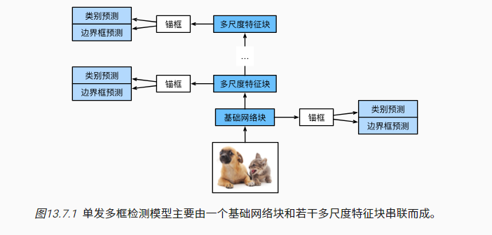

##### 13.7.1.1. 类别预测层

目标类别的数量为 𝑞。这样一来，锚框有 𝑞+1 个类别，其中 0 类是背景。 在某个尺度下，设特征图的高和宽分别为 ℎ 和 𝑤。 如果以其中每个单元为中心生成 𝑎 个锚框，那么我们需要对 ℎ𝑤𝑎 个锚框进行分类

用那个卷积来替代全连接，减少参数

输入和输出都是$x * y$分辨率，输出的通道数是 a(q+1)。就是每个像素点要有 a 个锚框，每个框分 q+1 类

```python
%matplotlib inline
import torch
import torchvision
from torch import nn
from torch.nn import functional as F
from d2l import torch as d2l


def cls_predictor(num_inputs, num_anchors, num_classes):
    return nn.Conv2d(num_inputs, num_anchors * (num_classes + 1),kernel_size=3, padding=1)
```

##### 13.7.1.2. 边界框预测层

输出是 4 个偏移点坐标

```python
def bbox_predictor(num_inputs, num_anchors):
    return nn.Conv2d(num_inputs, num_anchors * 4, kernel_size=3, padding=1)
```

##### 13.7.1.3. 连结多尺度的预测

对于不同分辨率的输入，会产生不同的输出。但是 batch 大小应该不变，所以把结果转成（批量大小，高 × 宽 × 通道数）的 2 维格式，这样就可以连接起来了

```python
def forward(x, block):
    return block(x)

Y1 = forward(torch.zeros((2, 8, 20, 20)), cls_predictor(8, 5, 10))
Y2 = forward(torch.zeros((2, 16, 10, 10)), cls_predictor(16, 3, 10))
Y1.shape, Y2.shape
'''(torch.Size([2, 55, 20, 20]), torch.Size([2, 33, 10, 10]))'''

def flatten_pred(pred):
    return torch.flatten(pred.permute(0, 2, 3, 1), start_dim=1)

def concat_preds(preds):
    return torch.cat([flatten_pred(p) for p in preds], dim=1)
```

##### 13.7.1.4. 高和宽减半块

2 个 pad=1 的 3x3 conv 不改变大小。再过 1 个 step 是 2 的 2x2 汇聚。最终实现宽高降一半

```python
def down_sample_blk(in_channels, out_channels):
    blk = []
    for _ in range(2):
        blk.append(nn.Conv2d(in_channels, out_channels,
                             kernel_size=3, padding=1))
        blk.append(nn.BatchNorm2d(out_channels))		#归一化
        blk.append(nn.ReLU())						    #残差
        in_channels = out_channels
    blk.append(nn.MaxPool2d(2))
    return nn.Sequential(*blk)
```

##### 13.7.1.5. 基本网络块

串联 3 个高和宽减半块，并逐步将通道数翻倍。 给定输入图像的形状为 256×256，此基本网络块输出的特征图形状为$32×32（256/2^3=32）$

```python
def base_net():
    blk = []
    num_filters = [3, 16, 32, 64]
    for i in range(len(num_filters) - 1):
        blk.append(down_sample_blk(num_filters[i], num_filters[i+1]))
    return nn.Sequential(*blk)

forward(torch.zeros((2, 3, 256, 256)), base_net()).shape
```

##### 13.7.1.6. 完整的模型

完整的单发多框检测模型由五个模块组成。每个块生成的特征图既用于生成锚框，又用于预测这些锚框的类别和偏移量。在这五个模块中，第一个是基本网络块，第二个到第四个是高和宽减半块，最后一个模块使用全局最大池将高度和宽度都降到 1。2-5
都是多尺度特征块

```python
def get_blk(i):
    if i == 0:
        blk = base_net()
    elif i == 1:
        blk = down_sample_blk(64, 128)
    elif i == 4:
        blk = nn.AdaptiveMaxPool2d((1,1))
    else:
        blk = down_sample_blk(128, 128)
    return blk

def blk_forward(X, blk, size, ratio, cls_predictor, bbox_predictor):
    Y = blk(X)
    anchors = d2l.multibox_prior(Y, sizes=size, ratios=ratio)
    cls_preds = cls_predictor(Y)
    bbox_preds = bbox_predictor(Y)
    return (Y, anchors, cls_preds, bbox_preds)

class TinySSD(nn.Module):
    def __init__(self, num_classes, **kwargs):
        super(TinySSD, self).__init__(**kwargs)
        self.num_classes = num_classes
        idx_to_in_channels = [64, 128, 128, 128, 128]
        for i in range(5):
            # 即赋值语句self.blk_i=get_blk(i)
            setattr(self, f'blk_{i}', get_blk(i))
            setattr(self, f'cls_{i}', cls_predictor(idx_to_in_channels[i],
                                                    num_anchors, num_classes))
            setattr(self, f'bbox_{i}', bbox_predictor(idx_to_in_channels[i],
                                                      num_anchors))

    def forward(self, X):
        anchors, cls_preds, bbox_preds = [None] * 5, [None] * 5, [None] * 5
        for i in range(5):
            # getattr(self,'blk_%d'%i)即访问self.blk_i
            X, anchors[i], cls_preds[i], bbox_preds[i] = blk_forward(
                X, getattr(self, f'blk_{i}'), sizes[i], ratios[i],
                getattr(self, f'cls_{i}'), getattr(self, f'bbox_{i}'))
        anchors = torch.cat(anchors, dim=1)
        cls_preds = concat_preds(cls_preds)
        cls_preds = cls_preds.reshape(
            cls_preds.shape[0], -1, self.num_classes + 1)
        bbox_preds = concat_preds(bbox_preds)
        return anchors, cls_preds, bbox_preds


```

#### 13.7.2. 训练模型

```python
'''13.7.2.1. 读取数据集和初始化'''
batch_size = 32
train_iter, _ = d2l.load_data_bananas(batch_size)

'''目标类别就1种'''
device, net = d2l.try_gpu(), TinySSD(num_classes=1)
trainer = torch.optim.SGD(net.parameters(), lr=0.2, weight_decay=5e-4)

'''13.7.2.2. 定义损失函数和评价函数'''
cls_loss = nn.CrossEntropyLoss(reduction='none')  # 分类问题里一直使用的交叉熵损失函数来计算
bbox_loss = nn.L1Loss(reduction='none') # 使用L1范数损失，即预测值和真实值之差的绝对值

# 掩码变量bbox_masks令负类锚框和填充锚框不参与损失的计算
def calc_loss(cls_preds, cls_labels, bbox_preds, bbox_labels, bbox_masks):
    batch_size, num_classes = cls_preds.shape[0], cls_preds.shape[2]
    cls = cls_loss(cls_preds.reshape(-1, num_classes),
                   cls_labels.reshape(-1)).reshape(batch_size, -1).mean(dim=1)
    bbox = bbox_loss(bbox_preds * bbox_masks,
                     bbox_labels * bbox_masks).mean(dim=1)
    return cls + bbox

def cls_eval(cls_preds, cls_labels):
    # 由于类别预测结果放在最后一维，argmax需要指定最后一维。
    return float((cls_preds.argmax(dim=-1).type(cls_labels.dtype) == cls_labels).sum())

def bbox_eval(bbox_preds, bbox_labels, bbox_masks):
    return float((torch.abs((bbox_labels - bbox_preds) * bbox_masks)).sum())

'''13.7.2.3. 训练模型'''
num_epochs, timer = 20, d2l.Timer()
animator = d2l.Animator(xlabel='epoch', xlim=[1, num_epochs],legend=['class error', 'bbox mae'])
net = net.to(device)
for epoch in range(num_epochs):
    # 训练精确度的和，训练精确度的和中的示例数
    # 绝对误差的和，绝对误差的和中的示例数
    metric = d2l.Accumulator(4)
    net.train()
    for features, target in train_iter:
        timer.start()
        trainer.zero_grad()
        X, Y = features.to(device), target.to(device)
        # 生成多尺度的锚框，为每个锚框预测类别和偏移量
        anchors, cls_preds, bbox_preds = net(X)
        # 为每个锚框标注类别和偏移量
        bbox_labels, bbox_masks, cls_labels = d2l.multibox_target(anchors, Y)
        # 根据类别和偏移量的预测和标注值计算损失函数
        l = calc_loss(cls_preds, cls_labels, bbox_preds, bbox_labels,bbox_masks)
        l.mean().backward()
        trainer.step()
        metric.add(cls_eval(cls_preds, cls_labels), cls_labels.numel(),
                   bbox_eval(bbox_preds, bbox_labels, bbox_masks),
                   bbox_labels.numel())
    cls_err, bbox_mae = 1 - metric[0] / metric[1], metric[2] / metric[3]
    animator.add(epoch + 1, (cls_err, bbox_mae))
print(f'class err {cls_err:.2e}, bbox mae {bbox_mae:.2e}')
print(f'{len(train_iter.dataset) / timer.stop():.1f} examples/sec on 'f'{str(device)}')
```

### 13.8. 区域卷积神经网络（R-CNN）

#### 13.8.1. R-CNN

*R-CNN*首先从输入图像中选取若干（例如 2000 个）_提议区域_（如锚框也是一种选取方法），并标注它们的类别和边界框（如偏移量）


1. R-CNN 是一种基于区域的对象检测方法。首先，它使用选择性搜索算法在输入图像中生成大约 2000 个候选区域（Region proposals）。
2. 然后，每个区域被缩放到固定大小，并输入到卷积神经网络中，以提取特征。
3. 提取的特征被送入一个 SVM（支持向量机）来进行对象分类。还有一个单独的线性回归模型用于精确的边界框回归。

##### 选择性搜索

选择性搜索（Selective Search）是一种用于从图像中生成高质量区域候选框的算法，它在 R-CNN（Regions with CNN）及其后续版本（如 Fast R-CNN 和 Faster R-CNN）中广泛使用来提取感兴趣的区域（Regions of Interest, RoIs）。选择性搜索的主要目的是减少需要处理的区域数量，同时保持重要的候选区域，从而提高对象检测任务的效率和准确性。

**工作原理**

选择性搜索算法的核心思想是基于图像分割的方法，将图像中相似的像素或区域合并，形成更大的区域，最终生成多尺度的、多样的候选区域。以下是其基本步骤：

1. **初始分割**：算法首先对图像执行粗粒度的分割，通常使用基于图的分割方法，如效率图分割（Efficient Graph-Based Segmentation）算法。这一步骤会生成许多小的连通区域。
2. **区域合并**：接下来，算法迭代地合并这些初始区域。合并的标准基于颜色、纹理、大小和形状兼容性等特征。选择性搜索尝试通过这些不同的维度和策略来探索区域合并的多样性。
3. **多尺度策略**：为了捕捉不同尺度的对象，选择性搜索采用不同的参数设置（如不同的颜色空间和相似度阈值），并重复分割和合并过程，以产生多尺度的候选区域。
4. **输出候选区域**：最终，算法输出一系列候选区域，这些区域代表了潜在的对象位置。这些候选区域被后续的 R-CNN 系统用于对象检测，通过卷积神经网络进一步分析和分类。

#### 13.8.2. Fast R-CNN

R-CNN 的主要性能瓶颈在于，对每个提议区域，卷积神经网络的前向传播是独立的，而没有共享计算。 由于这些区域通常有重叠，独立的特征抽取会导致重复的计算。 _Fast
R-CNN_ ([Girshick, 2015](https://zh-v2.d2l.ai/chapter_references/zreferences.html#id42))对 R-CNN
的主要改进之一，是仅在整张图象上执行卷积神经网络的前向传播

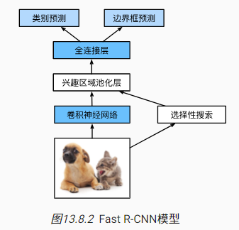

1. 与 R-CNN 相比，Fast R-CNN 用来提取特征的卷积神经网络的输入是整个图像，而不是各个提议区域。此外，这个网络通常会参与训练。设输入为一张图像，将卷积神经网络的输出的形状记为$1×𝑐×ℎ_1×𝑤_1$
2. 假设选择性搜索生成了 𝑛 个提议区域。这些形状各异的提议区域在卷积神经网络的输出上分别标出了形状各异的兴趣区域。然后，这些感兴趣的区域需要进一步抽取出形状相同的特征（比如指定高度 ℎ2 和宽度
   𝑤2），以便于连结后输出。为了实现这一目标，Fast R-CNN 引入了*兴趣区域汇聚层*（RoI pooling）：将卷积神经网络的输出和提议区域作为输入，输出连结后的各个提议区域抽取的特征，形状为$𝑛×𝑐×ℎ_2×𝑤_
   2$；
3. 通过全连接层将输出形状变换为 𝑛×𝑑，其中超参数 𝑑 取决于模型设计；
4. 预测 𝑛 个提议区域中每个区域的类别和边界框。更具体地说，在预测类别和边界框时，将全连接层的输出分别转换为形状为 𝑛×𝑞（𝑞 是类别的数量）的输出和形状为 𝑛×4 的输出。其中预测类别时使用 softmax 回归。

兴趣区域汇聚层对每个区域的输出形状是可以直接指定的，就是可以指定输入的区域。比如下图就只对 4x4 矩阵中黑框的 3x3 矩阵做最大化汇聚

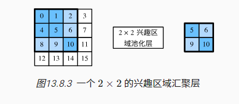

#### 13.8.3. Faster R-CNN

_Faster R-CNN_ ([Ren _et
al._, 2015](https://zh-v2.d2l.ai/chapter_references/zreferences.html#id137))提出将选择性搜索替换为*区域提议网络*（region proposal
network）RPN


1. 使用填充为 1 的 3×3 的卷积层变换卷积神经网络的输出，并将输出通道数记为 𝑐。这样，卷积神经网络为图像抽取的特征图中的每个单元均得到一个长度为 𝑐 的新特征。
2. 以特征图的每个像素为中心，生成多个不同大小和宽高比的锚框并标注它们。
3. 使用锚框中心单元长度为 𝑐 的特征，分别预测该锚框的二元类别（含目标还是背景）和边界框。
4. 使用非极大值抑制，从预测类别为目标的预测边界框中移除相似的结果。最终输出的预测边界框即是兴趣区域汇聚层所需的提议区域。

#### 13.8.4. Mask R-CNN

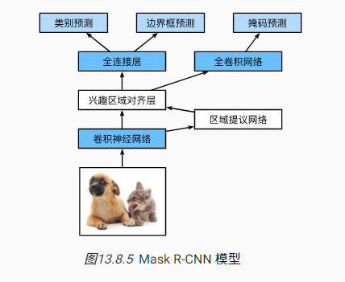

Mask R-CNN 将兴趣区域汇聚层替换为了 *兴趣区域对齐*层，使用*双线性插值*（bilinear interpolation）来保留特征图上的空间信息，从而更适于像素级预测

## 14. 自然语言处理：预训练

预训练就是把词元转成向量。word2vec，GloVe 或子词嵌入是把词元训练成固定的向量。BERT 把词元训练成根据上下文训练词元


### 14.1. 词嵌入（word2vec）

#### 14.1.1. 为何独热向量是一个糟糕的选择

无法反映词与词之前的关系，独热向量每个词与其他词的相似度是 0

#### 14.1.2. 自监督的 word2vec

word2vec 工具包含两个模型，即*跳元模型*（skip-gram） ([Mikolov _et
al._, 2013](https://zh-v2.d2l.ai/chapter_references/zreferences.html#id110))和*连续词袋*（CBOW） ([Mikolov _et
al._, 2013](https://zh-v2.d2l.ai/chapter_references/zreferences.html#id109))。

#### 14.1.3. 跳元模型（Skip-Gram）

就是用一句话的中心词，去预测其他词的条件概率


每个词元有 2 个 d 维向量表示。$v_i$用作中心词，$u_i$​ 表示上下文词。给定中心词$w_c$（词典中的索引$c$），生成任何上下文词$w_o$（词典中的索引$o$）的条件概率可以通过对向量点积的 softmax 操作来建模：

$$P(w_o \mid w_c) = \frac{\text{exp}(\mathbf{u}_o^\top \mathbf{v}_c)}{ \sum_{i \in \mathcal{V}} \text{exp}(\mathbf{u}_
i^\top \mathbf{v}_c)}$$


