
[TOC]

# 第一周

## 1 引言

### 1.2 什么是机器学习

一个程序被认为能从经验E中学习，解决任务T，达到性能度量值P，当且仅当，有了经验E后，经过P评判，程序在处理T时的性能有所提升

说人话就是让计算机可以通过学习做好一个任务

### 1.3 Supervised Learning 监督学习

特征： right answer given，即对每个样本只有一个特定的值

处理的问题

1. regression problem, 即预测连续的输出值，比如某个商品的价格
2. Classification problem，分类问题。即结果是个离散的值(0,1,2,3…)，要给出是0或1的概率

​     有限向量机算法用于处理很多的feature输入

### 1.4 Unsupervised Learning 无监督学习

只给出一个数据集，每个样本没有特定的含义。用聚类算法先分类，然后总结出某些结果

很好的例子:

​     有两个麦克风同时录下了两个人用不同语言数1-10，两段音频被叠加在了一起。通过无监督学习算法，判断出了这可能是两段录音并分隔出了两段录音

Octave框架下写上述问题的算法原型

​     [W,s,v] = svd((repmat(sum(x.*x,1),size(x,1),1).*x)*x`);

​     svd – 奇异值分解

## 2 单变量线性回归(Linear Regression with One Variable)

### 2.1 模型表示

​                               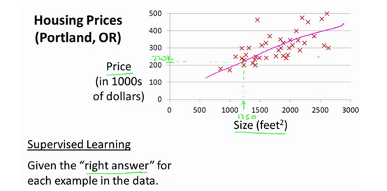

 m代表训练集中实例的数量

 x代表特征/输入变量

 y代表目标变量/输出变量

 (x,y)代表训练集中的实例

(x(i),y(i)) 代表第i 个观察实例

h 代表学习算法的解决方案或函数也称为假设（**hypothesis**）

$$
h_\theta (x) = \theta_0 + \theta_1 x
$$

### 2.2 代价函数

我们选择的参数决定了我们得到的直线相对于我们的训练集的准确程度，模型所预测的值与训练集中实际值之间的差距（下图中蓝线所指）就是**建模误差**（**modeling error**）。

 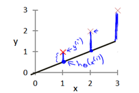

我们的目标便是选择出可以使得建模误差的平方和能够最小的模型参数。 即使得代价函数

 $J \left( \theta_0, \theta_1 \right) = \frac{1}{2m}\sum\limits_{i=1}^m \left( h_{\theta}(x^{(i)})-y^{(i)} \right)^{2}$

回归问题一般都用方差函数作为代价函数

### 2.3 代价函数的直观理解I

 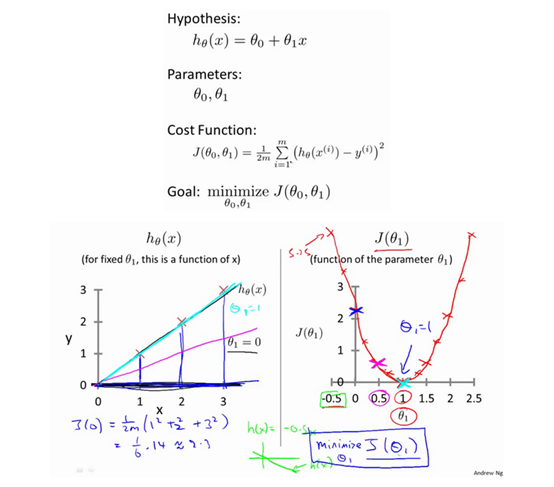

### 2.4 代价函数的直观理解II

 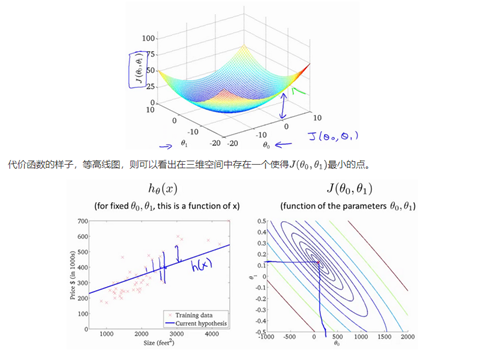

### 2.5 梯度下降

梯度下降是一个用来求函数最小值的算法，我们将使用梯度下降算法来求出代价函数 J(θ0,θ1)的最小值。

梯度下降背后的思想是：开始时我们随机选择一个参数的组合，计算代价函数，然后我们寻找下一个能让代价函数值下降最多的参数组合。

批量梯度下降（**batch gradient descent**）算法的公式为：

 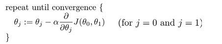

其中α是学习率（**learning rate**），它决定了我们沿着能让代价函数下降程度最大的方向向下迈出的步子有多大。详细步骤如下

 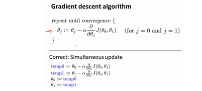

### 2.6 梯度下降的直观理解

 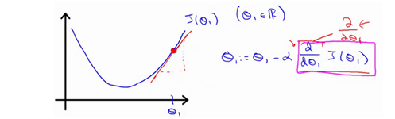

梯度下降算法的意义在于，对J(x)这个函数，在x=x1这个点上做切线。然后以这个切线为斜线，做一个等边直角三角形。直角边长是α* dJ(x1)/dx。

当一开始就选取最低点时，J(x)的导数=0。所以x就不变了。

### 2.7 梯度下降的线性回归

对于线性回归模型
$$
\frac{\partial }{\partial {{\theta }*{j}}}J({{\theta }*{0}},{{\theta }*{1}})=\frac{\partial }{\partial {{\theta }*{j}}}\frac{1}{2m}{{\sum\limits_{i=1}^{m}{\left( {{h}_{\theta }}({{x}^{(i)}})-{{y}^{(i)}} \right)}}^{2}}
$$
$j=0$ 时：$\frac{\partial }{\partial {{\theta }*{0}}}J({{\theta }*{0}},{{\theta }*{1}})=\frac{1}{m}{{\sum\limits*{i=1}^{m}{\left( {{h}_{\theta }}({{x}^{(i)}})-{{y}^{(i)}} \right)}}}$

$j=1$ 时：$\frac{\partial }{\partial {{\theta }*{1}}}J({{\theta }*{0}},{{\theta }*{1}})=\frac{1}{m}\sum\limits*{i=1}^{m}{\left( \left( {{h}_{\theta }}({{x}^{(i)}})-{{y}^{(i)}} \right)\cdot {{x}^{(i)}} \right)}$

所以代价函数是J(θ)，这个问题就变成了利用梯度下降算法求J(θ)的最小值

**Repeat {**

 ${\theta_{0}}:={\theta_{0}}-a\frac{1}{m}\sum\limits_{i=1}^{m}{ \left({{h}_{\theta }}({{x}^{(i)}})-{{y}^{(i)}} \right)}$

 ${\theta_{1}}:={\theta_{1}}-a\frac{1}{m}\sum\limits_{i=1}^{m}{\left( \left({{h}_{\theta }}({{x}^{(i)}})-{{y}^{(i)}} \right)\cdot {{x}^{(i)}} \right)}$

 **}**

这个算法称为*批量梯度下降算法*。这个名字指的是在梯度下降的每一步中，我们都用到了*所有的训练样本*，在梯度下降中，在计算微分求导项时，我们需要进行求和运算，所以，在每一个单独的梯度下降中，我们最终都要计算这样一个东西，这个项需要对所有个训练样本求和

## 3 线性代数回顾

### 3.1 矩阵和向量

矩阵的维数即行数×列数。以下是个4x2的矩阵
$$
A=\left[ 
\begin{matrix} 1402 & 191 \\ 1371 & 821 \\ 949 & 1437 \\ 147 & 1448 
\end{matrix} 
\right]
$$
矩阵元素（矩阵项）： 

Aij指第i行，第j列的元素。

向量是一种特殊的矩阵，讲义中的向量一般都是列向量，如：   $y=\left[ \begin{matrix} {460} \\ {232} \\ {315} \\ {178} \\ \end{matrix} \right]$

矩阵是一种多元方程的表示方法。行数表示有几个方程式，列数表示

变量个数，矩阵的每个值表示变量的系数。所以也可以把方程式映射到坐标轴上表示向量

### 3.2 加法和标量乘法

 

### 3.3 矩阵的向量乘法

 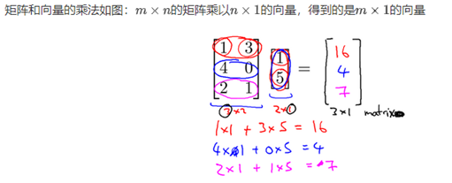

### 3.4 矩阵乘法

$m×n$矩阵乘以$n×o$矩阵，变成$m×o$矩阵

### 3.5 矩阵乘法性质

矩阵的乘法不满足交换律：$A×B≠B×A$

矩阵的乘法满足结合律。即：$A×(B×C)=(A×B)×C$ 

***单位矩阵***．它是个方阵，一般用 $I$ 或者 $E$ 表示，本讲义都用 $I$ 代表单位矩阵

$A{{A}^{-1}}={{A}^{-1}}A=I$

有$AI=IA=A$ 

### 3.6 逆、转置

***矩阵的逆***：如矩阵$A$是一个$m×m$矩阵（方阵），如果有逆矩阵，则：$A{{A}^{-1}}={{A}^{-1}}A=I$

***矩阵的转置***：设$A$为$m×n$阶矩阵（即$m$行$n$列），第$i $行$j $列的元素是$a(i,j)$，即：$A=a(i,j)$

定义$A$的转置为这样一个$n×m$阶矩阵$B$，满足$B=a(j,i)$，即 $b (i,j)=a(j,i)$（$B$的第$i$行第$j$列元素是$A$的第$j$行第$i$列元素），记${{A}^{T}}=B$。(有些书记为A'=B）

直观来看，将$A$的所有元素绕着一条从第1行第1列元素出发的右下方45度的射线作镜面反转，即得到$A$的转置。

例：

${{\left| \begin{matrix} a& b \\ c& d \\ e& f \\ \end{matrix} \right|}^{T}}=\left|\begin{matrix} a& c & e \\ b& d & f \\ \end{matrix} \right|$

矩阵的转置基本性质:
$$
{{\left( A\pm B \right)}^{T}}={{A}^{T}}\pm {{B}^{T}} \\
{{\left( A\times B \right)}^{T}}={{B}^{T}}\times {{A}^{T}} \\
{{\left( {{A}^{T}} \right)}^{T}}=A \\
{{\left( KA \right)}^{T}}=K{{A}^{T}}
$$

# 第二周

## 4 多变量线性回归

[等高线描述](#line)

### 4.3 特征缩放

如果$\theta_1$表示房屋尺寸0-2000，$\theta_2$表示房间数量。

$代价函数 J \left( \theta_0, \theta_1 \right) = \frac{1}{2m}\sum\limits_{i=1}^m \left( h_{\theta}(x^{(i)})-y^{(i)} \right)^{2} $

它的等高线图就是$J \left( \theta_0, \theta_1 \right)$等于不同的常数，画出来的各种圆。如果是椭圆，法线方向会不断变换，所以用梯度下降法会收敛很慢。***把所有特征的尺度缩放到(-1,1)之间***，这样椭圆变成了圆，变量收敛就会沿法线方向变换很快。

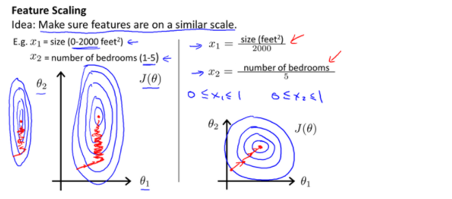

### 4.4 学习率

通常可以考虑尝试些学习率：α = 0.01，0.03，0.1，0.3，1，3，10

### 4.5 特征和多项式回归

有时候变量是多次方模型

$$h_{\theta}(x) = \theta_{0} + \theta_{1}(x^2) + \theta_{2}(x^3)$$

或者

$$h_{\theta}(x) = \theta_{0} + \theta_{1}(size) + \theta_{2}\sqrt{\text{size}}$$

可以令$x^2$变成x，来转成线性模型

### 4.6 正规方程

正规方程是通过求解下面的方程来找出使得代价函数最小的参数的：$\frac{\partial}{\partial\theta_{j}}J\left( \theta_{j} \right) = 0$ 

利用正规方程解出向量 $θ = (X^TX) ^{− 1}X^Ty $ 

| 梯度下降                      | 正规方程                                                     |
| ----------------------------- | ------------------------------------------------------------ |
| 需要选择学习率$\alpha$        | 不需要                                                       |
| 需要多次迭代                  | 一次运算得出                                                 |
| 当特征数量$n$大时也能较好适用 | 需要计算${{\left( {{X}^{T}}X \right)}^{-1}}$ 如果特征数量n较大则运算代价大，因为矩阵逆的计算时间复杂度为$O\left( {{n}^{3}} \right)$，通常来说当$n$小于10000 时还是可以接受的 |
| 适用于各种类型的模型          | 只适用于线性模型，不适合逻辑回归模型等其他模型               |

### 4.7 正规方程的推导及不可逆性

在大多数实现线性回归中，出现不可逆的问题不应该过多的关注$X^TX$是不可逆的

**推导过程**

$J\left( \theta  \right)=\frac{1}{2m}\sum\limits_{i=1}^{m}{{{\left( {h_{\theta}}\left( {x^{(i)}} \right)-{y^{(i)}} \right)}^{2}}}$

其中：${h_{\theta}}\left( x \right)={\theta^{T}}X={\theta_{0}}{x_{0}}+{\theta_{1}}{x_{1}}+{\theta_{2}}{x_{2}}+...+{\theta_{n}}{x_{n}}$

将向量表达形式转为矩阵表达形式，则有$J(\theta )=\frac{1}{2}{{\left( X\theta -y\right)}^{2}}$ ，其中$X$为$m$行$n$列的矩阵（$m$为样本个数，$n$为特征个数），$\theta$为$n$行1列的矩阵，$y$为$m$行1列的矩阵，对$J(\theta )$进行如下变换

$J(\theta )=\frac{1}{2}{{\left( X\theta -y\right)}^{T}}\left( X\theta -y \right)$

​     $=\frac{1}{2}\left( {{\theta }^{T}}{{X}^{T}}-{{y}^{T}} \right)\left(X\theta -y \right)$

​     $=\frac{1}{2}\left( {{\theta }^{T}}{{X}^{T}}X\theta -{{\theta}^{T}}{{X}^{T}}y-{{y}^{T}}X\theta -{{y}^{T}}y \right)$

接下来对$J(\theta )$偏导，需要用到以下几个矩阵的求导法则:

$\frac{dAB}{dB}={{A}^{T}}$ 

$\frac{d{{X}^{T}}AX}{dX}=2AX$                            

所以有:

$\frac{\partial J\left( \theta  \right)}{\partial \theta }=\frac{1}{2}\left(2{{X}^{T}}X\theta -{{X}^{T}}y -{}({{y}^{T}}X )^{T}-0 \right)$

$=\frac{1}{2}\left(2{{X}^{T}}X\theta -{{X}^{T}}y -{{X}^{T}}y -0 \right)$

​           $={{X}^{T}}X\theta -{{X}^{T}}y$

令$\frac{\partial J\left( \theta  \right)}{\partial \theta }=0$,

则有$\theta ={{\left( {X^{T}}X \right)}^{-1}}{X^{T}}y$

# 第三周 

# 6 逻辑回归

## 6.1 分类问题

我们将因变量(**dependent variable**)可能属于的两个类分别称为负向类（**negative class**）和正向类（**positive class**），则因变量 ，其中 0 表示负向类，1 表示正向类

## 6.2 假说表示

逻辑回归模型的假设是： $h_\theta \left( x \right)=g\left(\theta^{T}X \right)$
其中：
$X$ 代表特征向量
$g$ 代表逻辑函数（**logistic function**)是一个常用的逻辑函数为**S**形函数（**Sigmoid function**），公式为： $g\left( z \right)=\frac{1}{1+{{e}^{-z}}}$。

用Sigmoid函数是为了让函数值在0-1之间，就变成了概率问题

## 6.3 判断边界

有时候需要曲线做划分。这时会用到高次函数，如下面这种

${h_\theta}\left( x \right)=g\left( {\theta_0}+{\theta_1}{x_1}+{\theta_{2}}{x_{2}}+{\theta_{3}}x_{1}^{2}+{\theta_{4}}x_{2}^{2} \right)$是[-1 0 0 1 1]

## 6.4 代价函数

因为${h_\theta}\left( x \right)=\frac{1}{1+{e^{-\theta^{T}x}}}$是个非凸函数，如下所示

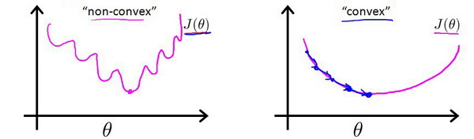

所以如果用线性回归的代价函数

$J\left( \theta  \right)=\frac{1}{m}\sum\limits_{i=1}^{m}{\frac{1}{2}{{\left( {h_\theta}\left({x}^{\left( i \right)} \right)-{y}^{\left( i \right)} \right)}^{2}}}$

代价函数有许多局部最小值，会影响梯度下降法寻找全局最小值

### 新的代价函数

我们重新定义逻辑回归的代价函数为：$J\left( \theta  \right)=\frac{1}{m}\sum\limits_{i=1}^{m}{{Cost}\left( {h_\theta}\left( {x}^{\left( i \right)} \right),{y}^{\left( i \right)} \right)}$，其中

${h_\theta}\left( x \right)$与 $Cost\left( {h_\theta}\left( x \right),y \right)$之间的关系如下图所示：

将构建的 $Cost\left( {h_\theta}\left( x \right),y \right)$简化如下： 
$Cost\left( {h_\theta}\left( x \right),y \right)=-y\times log\left( {h_\theta}\left( x \right) \right)-(1-y)\times log\left( 1-{h_\theta}\left( x \right) \right)$
带入代价函数得到：
$J\left( \theta  \right)=\frac{1}{m}\sum\limits_{i=1}^{m}{[-{{y}^{(i)}}\log \left( {h_\theta}\left( {{x}^{(i)}} \right) \right)-\left( 1-{{y}^{(i)}} \right)\log \left( 1-{h_\theta}\left( {{x}^{(i)}} \right) \right)]}$
即：$J\left( \theta  \right)=-\frac{1}{m}\sum\limits_{i=1}^{m}{[{{y}^{(i)}}\log \left( {h_\theta}\left( {{x}^{(i)}} \right) \right)+\left( 1-{{y}^{(i)}} \right)\log \left( 1-{h_\theta}\left( {{x}^{(i)}} \right) \right)]}$

### 梯度下降算法

求得能使代价函数最小的参数了。算法为：

**Repeat** {
$\theta_j := \theta_j - \alpha \frac{\partial}{\partial\theta_j} J(\theta)$
(**simultaneously update all** )
}

求导后得到：

**Repeat** {
$\theta_j := \theta_j - \alpha \frac{1}{m}\sum\limits_{i=1}^{m}{{\left( {h_\theta}\left( \mathop{x}^{\left( i \right)} \right)-\mathop{y}^{\left( i \right)} \right)}}\mathop{x}_{j}^{(i)}$ 
**(simultaneously update all** )
}

### 梯度下降算法之外的选择

* **共轭梯度**（**Conjugate Gradient**）
* **局部优化法**(**Broyden fletcher goldfarb shann,BFGS**)
* **有限内存局部优化法**(**LBFGS**) 

## 6.5 简化的成本函数和梯度下降

不管是线性回归还是逻辑回归，梯度下降法的更新函数如下

${\theta_j}:={\theta_j}-\alpha \frac{1}{m}\sum\limits_{i=1}^{m}{({h_\theta}({{x}^{(i)}})-{{y}^{(i)}}){{x}_{j}}^{(i)}}$

区别在于

对于线性回归假设函数：

${h_\theta}\left( x \right)={\theta^T}X={\theta_{0}}{x_{0}}+{\theta_{1}}{x_{1}}+{\theta_{2}}{x_{2}}+...+{\theta_{n}}{x_{n}}$

而现在逻辑函数假设函数：

${h_\theta}\left( x \right)=\frac{1}{1+{{e}^{-{\theta^T}X}}}$

所以之前线性回归用的优化方法都可以用在逻辑回归里。特征缩放，监控收敛

## 6.6 高级优化

**共轭梯度法 BFGS** (**变尺度法**) 和**L-BFGS** (**限制变尺度法**) 就是其中一些更高级的优化算法，它们需要有一种方法来计算 $J\left( \theta  \right)$，以及需要一种方法计算导数项，然后使用比梯度下降更复杂的算法来最小化代价函数

## 6.7 多类别分类

如果要分好几种类别怎么处理

假设有个3分类问题

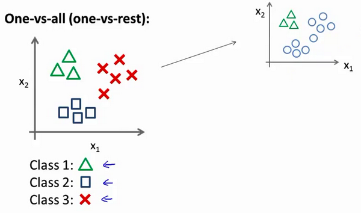

把它转换成2分类问题

用各种方法都转一次二分类问题

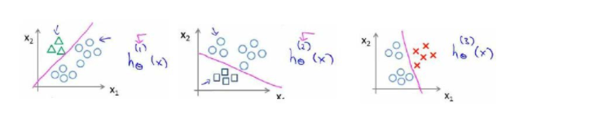

# 7 正则化

## 7.1 过拟合问题

多项式理解，x 的次数越高，拟合的越好，但相应的预测的能力就可能变差

如何处理？

1. 丢弃一些不能帮助我们正确预测的特征。可以是手工选择保留哪些特征，或者使用一些模型选择的算法来帮忙（例如PCA）
2. 正则化。 保留所有的特征，但是减少参数的大小（magnitude）。

## 7.2 代价函数

对高次系数增加惩罚系数

$\underset{\theta }{\mathop{\min }}\,\frac{1}{2m}[\sum\limits_{i=1}^{m}{{{\left( {{h}_{\theta }}\left( {{x}^{(i)}} \right)-{{y}^{(i)}} \right)}^{2}}+1000\theta _{3}^{2}+10000\theta _{4}^{2}]}$

一般化公式如下

$J\left( \theta  \right)=\frac{1}{2m}[\sum\limits_{i=1}^{m}{{{({h_\theta}({{x}^{(i)}})-{{y}^{(i)}})}^{2}}+\lambda \sum\limits_{j=1}^{n}{\theta_{j}^{2}}]}$

其中$\lambda $又称为正则化参数（**Regularization Parameter**）。 注：根据惯例，我们不对${\theta_{0}}$ 进行惩罚。经过正则化处理的模型与原模型的可能对比如下图所示：

如果选择的正则化参数$\lambda$ 过大，则会把所有的参数都最小化了，导致模型变成 ${h_\theta}\left( x \right)={\theta_{0}}$，也就是上图中红色直线所示的情况，造成欠拟合

如果我们令 $\lambda$ 的值很大的话，为了使**Cost Function** 尽可能的小，所有的 $\theta $ 的值（不包括${\theta_{0}}$）都会在一定程度上减小。
但若$\lambda$ 的值太大了，那么$\theta $（不包括${\theta_{0}}$）都会趋近于0，这样我们所得到的只能是一条平行于$x$轴的直线

## 7.3 正则化线性回归

因为我们未对$\theta_0$进行正则化，所以梯度下降算法将分两种情形：

$Repeat$  $until$  $convergence${

​                                                   ${\theta_0}:={\theta_0}-a\frac{1}{m}\sum\limits_{i=1}^{m}{(({h_\theta}({{x}^{(i)}})-{{y}^{(i)}})x_{0}^{(i)}})$ 

​                                                   ${\theta_j}:={\theta_j}-a[\frac{1}{m}\sum\limits_{i=1}^{m}{(({h_\theta}({{x}^{(i)}})-{{y}^{(i)}})x_{j}^{\left( i \right)}}+\frac{\lambda }{m}{\theta_j}]$ 

​                                                             $for$ $j=1,2,...n$

​                                                   }

正规方程如下

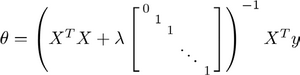

## 7.4 正则化的逻辑回归模型

代价函数：

$J\left( \theta  \right)=\frac{1}{m}\sum\limits_{i=1}^{m}{[-{{y}^{(i)}}\log \left( {h_\theta}\left( {{x}^{(i)}} \right) \right)-\left( 1-{{y}^{(i)}} \right)\log \left( 1-{h_\theta}\left( {{x}^{(i)}} \right) \right)]}+\frac{\lambda }{2m}\sum\limits_{j=1}^{n}{\theta _{j}^{2}}$

要最小化该代价函数，通过求导，得出梯度下降算法为：

$Repeat$  $until$  $convergence${

​                                                   ${\theta_0}:={\theta_0}-a\frac{1}{m}\sum\limits_{i=1}^{m}{(({h_\theta}({{x}^{(i)}})-{{y}^{(i)}})x_{0}^{(i)}})$

​                                                  ${\theta_j}:={\theta_j}-a[\frac{1}{m}\sum\limits_{i=1}^{m}{({h_\theta}({{x}^{(i)}})-{{y}^{(i)}})x_{j}^{\left( i \right)}}+\frac{\lambda }{m}{\theta_j}]$

​                                                 $for$ $j=1,2,...n$

​                                                 }

注：看上去同线性回归一样，但是知道 ${h_\theta}\left( x \right)=g\left( {\theta^T}X \right)$，所以与线性回归不同。

# 第四周

# 8 神经网络

## 8.1 非线性假设

线性回归或者逻辑回归的缺点是特征值太多的时候，计算量太大

## 8.2 神经元和大脑

## 8.3 模型表示1

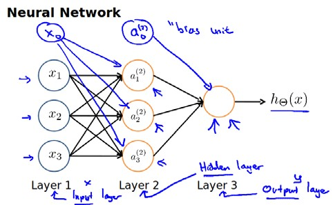

我们可以知道：每一个a都是由上一层所有的x和每一个x所对应的 $\theta$ 决定的。

我们把这样从左到右的算法称为**前向传播算法FORWARD PROPAGATION**

用矩阵表示： $\theta \cdot X=a$ 

## 8.4 模型表示2

( **FORWARD PROPAGATION** )
相对于使用循环来编码，利用向量化的方法会使得计算更为简便。以上面的神经网络为例，试着计算第二层的值：

其实神经网络就像是**logistic regression**，只不过我们把**logistic regression**中的输入向量$\left[ x_1\sim {x_3} \right]$ 变成了中间层的$\left[ a_1^{(2)}\sim a_3^{(2)} \right]$

我们可以把$a_0, a_1, a_2, a_3$看成更为高级的特征值，也就是$x_0, x_1, x_2, x_3$的进化体，并且它们是由 $x$与$\theta$决定的，因为是梯度下降的，所以$a$是变化的，并且变得越来越厉害，所以这些更高级的特征值远比仅仅将 $x$次方厉害，也能更好的预测新数据。
这就是神经网络相比于逻辑回归和线性回归的优势。

## 8.5 特征和直观理解1 - 表示逻辑运算

神经网络和线性回归的机器学习的区别，在于神经网络有中间层，中间层会学习输入的特征值

用单层神经元可以表示逻辑运算，AND或者OR

我们可以用这样的一个神经网络表示**AND** 函数：

其中$\theta_0 = -30, \theta_1 = 20, \theta_2 = 20$
我们的输出函数$h_\theta(x)$即为：$h_\Theta(x)=g\left( -30+20x_1+20x_2 \right)$

我们知道$g(x)$的图像是：

所以我们有：$h_\Theta(x) \approx \text{x}_1 \text{AND} \, \text{x}_2$

所以我们的：$h_\Theta(x) $

这就是**AND**函数。

## 8.6 特征和直观理解2 - 多层表示复杂逻辑运输

要实现XNOR功能

 $\text{XNOR}=( \text{x}_1\, \text{AND}\, \text{x}_2 )\, \text{OR} \left( \left( \text{NOT}\, \text{x}_1 \right) \text{AND} \left( \text{NOT}\, \text{x}_2 \right) \right)$

首先构造一个能表达$\left( \text{NOT}\, \text{x}_1 \right) \text{AND} \left( \text{NOT}\, \text{x}_2 \right)$部分的神经元：

然后将表示 **AND** 的神经元和表示$\left( \text{NOT}\, \text{x}_1 \right) \text{AND} \left( \text{NOT}\, \text{x}_2 \right)$的神经元以及表示 OR 的神经元进行组合：

我们就得到了一个能实现 $\text{XNOR}$ 运算符功能的神经网络。

## 8.7 多类分类

用多个输出层表示不同的分类。每一个数据在输出层都会出现${{\left[ a\text{ }b\text{ }c\text{ }d \right]}^{T}}$，且$a,b,c,d$中仅有一个为1，表示当前类。下面是该神经网络的可能结构示例：

神经网络算法的输出结果为四种可能情形之一：

# 第五周

# 9 神经网络学习

## 9.1 代价函数

新标记方法

| 符号  | 意义             |
| ----- | ---------------- |
| m     | 样本个数         |
| x     | 输入             |
| y     | 输出             |
| L     | 神经网络层数     |
| $S_i$ | 每层neuron个数   |
| $S_L$ | 输出层neuron个数 |

* 二类分类：$S_L=0, y=0\, or\, 1$表示哪一类；
* K类分类：$S_L=k, y_i = 1$表示分到第$i$类；$(k>2)$

逻辑回归问题中我们的代价函数为：

$  J\left(\theta \right)=-\frac{1}{m}\left[\sum_\limits{i=1}^{m}{y}^{(i)}\log{h_\theta({x}^{(i)})}+\left(1-{y}^{(i)}\right)log\left(1-h_\theta\left({x}^{(i)}\right)\right)\right]+\frac{\lambda}{2m}\sum_\limits{j=1}^{n}{\theta_j}^{2}  $

加号前面的是分类问题的代价函数，加号后面是高次输入的惩罚，为了正则化消除过拟合

在逻辑回归中，我们只有一个输出变量，又称标量（**scalar**），也只有一个因变量$y$，但是在神经网络中，我们可以有很多输出变量，我们的$h_\theta(x)$是一个维度为$K$的向量，并且我们训练集中的因变量也是同样维度的一个向量，因此我们的代价函数会比逻辑回归更加复杂一些，为:

$$h_\theta\left(x\right)\in \mathbb{R}^{K}$$ $${\left({h_\theta}\left(x\right)\right)}_{i}={i}^{th} \text{output}$$

$J(\Theta) = -\frac{1}{m} \left[ \sum\limits_{i=1}^{m} \sum\limits_{k=1}^{k} {y_k}^{(i)} \log {(h_\Theta(x^{(i)}))}_k + \left( 1 - y_k^{(i)} \right) \log \left( 1- {\left( h_\Theta \left( x^{(i)} \right) \right)}_k \right) \right] + \frac{\lambda}{2m} \sum\limits_{l=1}^{L-1} \sum\limits_{i=1}^{s_l} \sum\limits_{j=1}^{s_{l+1}} \left( \Theta_{ji}^{(l)} \right)^2$

对于每一行特征，我们都会给出$K$个预测，基本上我们可以利用循环，对每一行特征都预测$K$个不同结果，然后在利用循环在$K$个预测中选择可能性最高的一个，将其与$y$中的实际数据进行比较。

正则化的那一项只是排除了每一层$\theta_0$后，每一层的$\theta$ 矩阵的和。最里层的循环$j$循环所有的行（由$s_{l+1}$  层的激活单元数决定），循环$i$则循环所有的列，由该层（$s_l$层）的激活单元数所决定。即：$h_\theta(x)$与真实值之间的距离为每个样本-每个类输出的加和，对参数进行**regularization**的**bias**项处理所有参数的平方和。

## 9.2 反向传播算法

### 9.2.1 为什么要使用反向传播算法

《深度学习的数学》里面讲了为什么要用反向传播算法的过程。

#### 9.2.1.1 利用梯度下降法去寻找代价函数的最小值

∆z=f(x+∆x, y+∆y)-f(x, y)

$f(x+\Delta x,y+\Delta y) \approx f(x,y) + \frac{\partial{f(x,y)}}{\partial{x}} \Delta x + \frac{\partial{f(x,y)}}{\partial{y}} \Delta y  泰勒公式展开$

$\Delta z = \frac{\partial{f(x,y)}}{\partial{x}} \Delta x + \frac{\partial{f(x,y)}}{\partial{y}} \Delta y$

可以表示为两个向量的内积
$$
\Delta z = ( \frac{\partial{f(x,y)}}{\partial{x}}, \frac{\partial{f(x,y)}}{\partial{y}}) \cdot (\Delta x, \Delta y)
$$
​	要让函数z减小得最快，就是让Δz最大，也就是cosθ=1，两个向量夹角为180°

​	所以 (Δx, Δy) = - k $( \frac{\partial{f(x,y)}}{\partial{x}}, \frac{\partial{f(x,y)}}{\partial{y}})$ . k是常数

​	在梯度下降法中，k用η表示

​	所以对于每个参数$\theta$，

   ***要求每个神经元的参数，都需要用代价函数对该参数求偏导***

​    $\theta_j := \theta_j - \alpha \frac{\partial}{\partial\theta_j} J(\theta)$

#### 9.2.2.2 链式法则

对于神经网络，每一层都有很多参数。对每个参数求偏导使用链式法则

#### 9.2.1.3 正常计算参数

针对下图层2的$w_{11}$如果不用反向传播法，需要求多次偏导，每个参数都要求偏导

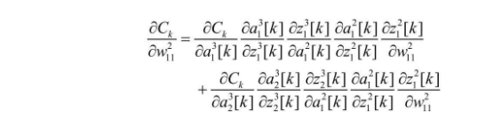

#### 9.2.1.4 单元误差$\delta^l_j$

$设 \delta^l_j = \frac{\partial C}{\partial{z^l_j}} (l=2.3.... 表示layer, j表示第j个神经元) $
$$
\begin{aligned}
& 因为 z_1^2 = w_{11}^2 x_1 + w_{12}^2 x_2 + ... + w_{112}^2 x_1 + b^2 \\
& \frac{\partial z^2_1}{\partial w_{11}^2} = x_1\\
& \frac{\partial C}{\partial{w_{11}^2}} = \frac{\partial C}{\partial{z_{1}^2}}\frac{\partial{z_{1}^2}}{\partial{w_{11}^2}} = \delta_1^2 x_1 \\
& 对于输入层，因为x_1 = a_1^1\\
& \frac{\partial C}{\partial{w_{11}^2}} = \delta_1^2 a_1 \\
& 同样可以推导出对偏置b得偏导 \\
& \frac{\partial C}{\partial{b_{1}^2}} = \delta_1^2  \\
\end{aligned}
$$
所以我们只要能求出每个神经元的误差$\delta^l_j$，就能求出梯度下降法要求的偏导

#### 9.2.1.5 输出层的$\delta^l_j$

$$
\delta^3_j = \frac{\partial C}{\partial{a_j^3}}*\frac{\partial{a_j^3}}{\partial{z_j^3}}=\frac{\partial C}{\partial{a_j^3}} a'(z_j^3)
$$

#### 9.2.1.6 中间层的$\delta^l_j$

$$
\delta^2_j = ({\delta_1^{3}w_{11}^3+\delta_2^3w_{21}^3}) a'(z_1^2)
$$

所以中间层只需要对这一个单元的激活函数求一次导，其他的都用输出层的误差算就好了。这样可以少求导

## 9.5 梯度检验

为了确认正对某一个参数$\theta$的偏导是否正确，可以试着将这个$\theta$改变一下大小，然后看代价函数$J(\theta)$的变化情况。比如对于$\theta _1$可以计算出如下的偏导值。然后再和反向传播算出的偏导值比较，确认是否正确。其中$\varepsilon $是一个非常小的值，通常选取 0.001

$$ \frac{\partial}{\partial\theta_1}=\frac{J\left(\theta_1+\varepsilon_1,\theta_2,\theta_3...\theta_n \right)-J \left( \theta_1-\varepsilon_1,\theta_2,\theta_3...\theta_n \right)}{2\varepsilon} $$

## 9.6 随机初始化

任何优化算法都需要一些初始的参数。到目前为止我们都是初始所有参数为0，这样的初始方法对于逻辑回归来说是可行的，但是对于神经网络来说是不可行的。如果我们令所有的初始参数都为0，这将意味着我们第二层的所有激活单元都会有相同的值。同理，如果我们初始所有的参数都为一个非0的数，结果也是一样的。

***我们通常初始参数为正负ε之间的随机值***

## 9.7 整体步骤

小结一下使用神经网络时的步骤：

网络结构：第一件要做的事是选择网络结构，即决定选择多少层以及决定每层分别有多少个单元。

第一层的单元数即我们训练集的特征数量。

最后一层的单元数是我们训练集的结果的类的数量。

如果隐藏层数大于1，确保每个隐藏层的单元个数相同，通常情况下隐藏层单元的个数越多越好。

我们真正要决定的是隐藏层的层数和每个中间层的单元数。

训练神经网络：

1. 参数的随机初始化
2. 利用正向传播方法计算所有的$h_{\theta}(x)$
3. 编写计算代价函数 $J$ 的代码
4. 利用反向传播方法计算所有偏导数
5. 利用数值检验方法检验这些偏导数
6. 使用优化算法来最小化代价函数

# 第六周

# 10 应用机器学习的建议

## 10.1 能够改善模型的措施

1. 获得更多的训练样本——通常是有效的，但代价较大，下面的方法也可能有效，可考虑先采用下面的几种方法。
2. 尝试减少特征的数量
3. 尝试获得更多的特征
4. 尝试增加多项式特征
5. 尝试减少正则化程度$\lambda$
6. 尝试增加正则化程度$\lambda$

## 10.2 评估一个假设

将训练集的数据分成训练集和测试集，计算误差

1. 对于线性回归模型，我们利用测试集数据计算代价函数$J$
2. 对于逻辑回归模型，我们除了可以利用测试数据集来计算代价函数外：

$$ J_{test}{(\theta)} = -\frac{1}{{m}_{test}}\sum_\limits{i=1}^{m_{test}}\log{h_{\theta}(x^{(i)}_{test})}+(1-{y^{(i)}_{test}})\log{h_{\theta}(x^{(i)}_{test})}$$

误分类的比率，对于每一个测试集样本，计算：

然后对计算结果求平均。

## 10.3 模型选择和交叉验证集

假设我们要在10个不同次数的二项式模型之间进行选择：

使用60%的数据作为训练集，使用 20%的数据作为交叉验证集，使用20%的数据作为测试集

模型选择的方法为：

1.  使用训练集训练出10个模型
2.  用10个模型分别对交叉验证集计算得出交叉验证误差（代价函数的值）
3.  选取代价函数值最小的模型
4.  用步骤3中选出的模型对测试集计算得出推广误差（代价函数的值）

1. ***Train/validation/test error***

   **Training error:**

$J_{train}(\theta) = \frac{1}{2m}\sum_\limits{i=1}^{m}(h_{\theta}(x^{(i)})-y^{(i)})^2$

**Cross Validation error:**

$J_{cv}(\theta) = \frac{1}{2m_{cv}}\sum_\limits{i=1}^{m}(h_{\theta}(x^{(i)}_{cv})-y^{(i)}_{cv})^2$

**Test error:**

$J_{test}(\theta)=\frac{1}{2m_{test}}\sum_\limits{i=1}^{m_{test}}(h_{\theta}(x^{(i)}_{cv})-y^{(i)}_{cv})^2$

## 10.4 诊断偏差和方差

偏差(bias)大 - 欠拟合

方差(variance)大 - 过拟合

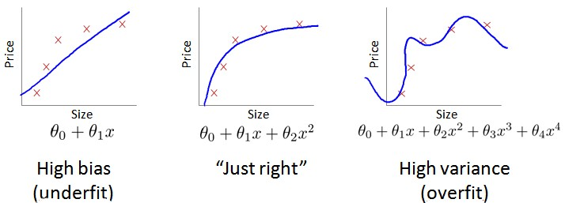

如何判断是过拟合还是欠拟合？将训练集和交叉验证集的代价函数误差与多项式的次数绘制在同一张图表上来帮助分析

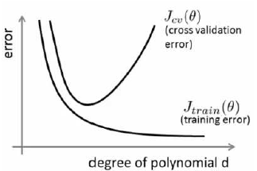

**Bias/variance**

**Training error:**				               $J_{train}(\theta) = \frac{1}{2m}\sum_\limits{i=1}^{m}(h_{\theta}(x^{(i)})-y^{(i)})^2$

**Cross Validation error:**				$J_{cv}(\theta) = \frac{1}{2m_{cv}}\sum_\limits{i=1}^{m}(h_{\theta}(x^{(i)}_{cv})-y^{(i)}_{cv})^2$

对于交叉验证集，当 $d$ 较小时，模型拟合程度低，误差较大；但是随着 $d$ 的增长，误差呈现先减小后增大的趋势，转折点是我们的模型开始过拟合训练数据集的时候。

**训练集误差和交叉验证集误差近似时：偏差/欠拟合**	
**交叉验证集误差远大于训练集误差时：方差/过拟合**

## 10.5 正则化和偏差/方差

我们选择一系列的想要测试的 $\lambda$ 值，通常是 0-10之间的呈现2倍关系的值（如：$0,0.01,0.02,0.04,0.08,0.15,0.32,0.64,1.28,2.56,5.12,10$共12个）。 我们同样把数据分为训练集、交叉验证集和测试集。

选择$\lambda$的方法为：

1. 使用训练集训练出12个不同程度正则化的模型
2. 用12个模型分别对交叉验证集计算的出交叉验证误差
3. 选择得出交叉验证误差**最小**的模型
4. 运用步骤3中选出模型对测试集计算得出推广误差，我们也可以同时将训练集和交叉验证集模型的代价函数误差与λ的值绘制在一张图表上：

• 当 $\lambda$ 较小时，训练集误差较小（过拟合）而交叉验证集误差较大
	
• 随着 $\lambda$ 的增加，训练集误差不断增加（欠拟合），而交叉验证集误差则是先减小后增加

## 10.6 学习曲线

如果我们有100行数据，我们从1行数据开始，逐渐学习更多行的数据。思想是：当训练较少行数据的时候，训练的模型将能够非常完美地适应较少的训练数据，但是训练出来的模型却不能很好地适应交叉验证集数据或测试集数据。

如何利用学习曲线识别高偏差/欠拟合：作为例子，我们尝试用一条直线来适应下面的数据，可以看出，无论训练集有多么大误差都不会有太大改观：

下图是高偏差/欠拟合的情况

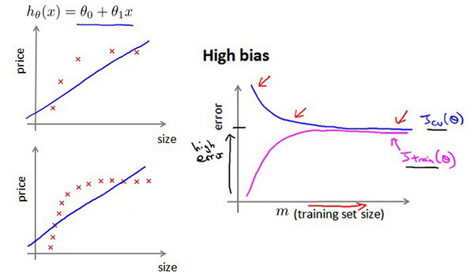

下图是高方差/过拟合情况

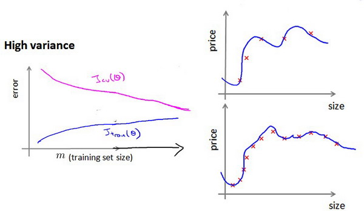

## 10.7 下一步做什么

1. 获得更多的训练样本——解决高方差
2. 尝试减少特征的数量——解决高方差
3. 尝试获得更多的特征——解决高偏差
4. 尝试增加多项式特征——解决高偏差
5. 尝试减少正则化程度λ——解决高偏差
6. 尝试增加正则化程度λ——解决高方差

使用较小的神经网络，类似于参数较少的情况，容易导致高偏差和欠拟合，但计算代价较小使用较大的神经网络，类似于参数较多的情况，容易导致高方差和过拟合
	
通常选择较大的神经网络并采用正则化处理会比采用较小的神经网络效果要好。

对于神经网络中的隐藏层的层数的选择，通常从一层开始逐渐增加层数，为了更好地作选择，可以把数据分为训练集、交叉验证集和测试集，针对不同隐藏层层数的神经网络训练神经网络，
然后选择交叉验证集代价最小的神经网络。

# 11 机器学习系统的设计

1 先确认最简单的算法，然后做误差分析

2 TP/TN/FP/FN 误差度量

3 Precision/Recall之间权衡

4 当我们的算法有足够多的特征值，那么测试数据越多，就越不会过拟合

# 第七周

# 12 支持向量机

## 12.1 优化目标

用于复杂的非线性方程的监督学习

逻辑回归函数代价函数如下：

$J\left( \theta  \right)=\frac{1}{m}\sum\limits_{i=1}^{m}{[-{{y}^{(i)}}\log \left( {h_\theta}\left( {{x}^{(i)}} \right) \right)-\left( 1-{{y}^{(i)}} \right)\log \left( 1-{h_\theta}\left( {{x}^{(i)}} \right) \right)]}+\frac{\lambda}{2m}\sum\limits_{j=1}^{n}\theta^2_j$

SVM的代价函数如下

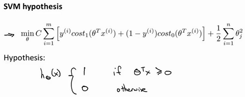

1. cost1和cost0函数是将逻辑回归的两种sigmoid函数简化，如下图所示

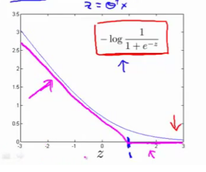

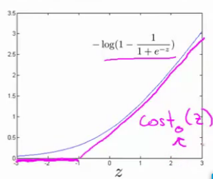

2. 取消1/m

3. 用C取代1/λ，把正则化的λ移到了前面

## 12.2 大边界的直观理解

**支持向量机是大间距分类器**

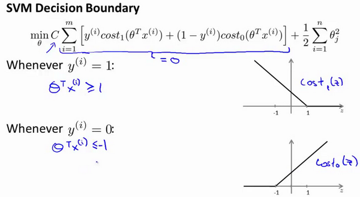

支持向量机会画出如下黑色的决策界

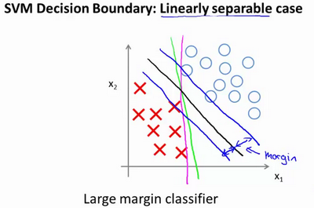

$C$ 较大时，相当于 $\lambda$ 较小，可能会导致过拟合，高方差。

$C$ 较小时，相当于$\lambda$较大，可能会导致低拟合，高偏差。

## 12.3 大边界分类背后的数学

1 分类问题决策界就是权重向量$\theta$ 的法线

2 权重向量$\theta$和输入向量x的内积就是$\theta^{\tau}x$ , 用向量图形表示，就是x在$\theta$上的投影$p^{(i)}$和$\theta$范数的乘积。

3 对于正样本而言，我们需要$p^{(i)}\cdot{\left\| \theta \right\|}>=1$，所以希望$p^{(i)}$最大。同时${{\theta }}$的范数最小，因为有正则项$\frac{1}{2}\sum\limits_{j=1}^{n}\theta^2_j$

## 12.4 核函数1

针对如下非线性分类问题

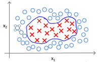

为了获得上图所示的判定边界，我们的模型可能是${{\theta }_{0}}+{{\theta }_{1}}{{x}_{1}}+{{\theta }_{2}}{{x}_{2}}+{{\theta }_{3}}{{x}_{1}}{{x}_{2}}+{{\theta }_{4}}x_{1}^{2}+{{\theta }_{5}}x_{2}^{2}+\cdots $的形式。

我们可以用一系列的新的特征$f$来替换模型中的每一项。例如令：
${{f}_{1}}={{x}_{1}},{{f}_{2}}={{x}_{2}},{{f}_{3}}={{x}_{1}}{{x}_{2}},{{f}_{4}}=x_{1}^{2},{{f}_{5}}=x_{2}^{2}$

...得到$h_θ(x)={{\theta }_{1}}f_1+{{\theta }_{2}}f_2+...+{{\theta }_{n}}f_n$。然而，除了对原有的特征进行组合以外，有没有更好的方法来构造$f_1,f_2,f_3$？我们可以利用核函数来计算出新的特征。

### 具体做法

1 选定地标**地标**(**landmarks**)$l^{(1)},l^{(2)},l^{(3)}$的近似程度来选取新的特征$f_1,f_2,f_3$。

2 选定一个核函数。比如选用高斯核函数。

${{f}_{1}}=similarity(x,{{l}^{(1)}})=e(-\frac{{{\left\| x-{{l}^{(1)}} \right\|}^{2}}}{2{{\sigma }^{2}}})$

${{\left\| x-{{l}^{(1)}} \right\|}^{2}}=\sum{_{j=1}^{n}}{{({{x}_{j}}-l_{j}^{(1)})}^{2}}$，为实例$x$中所有特征与地标$l^{(1)}$之间的距离的和

3 实际计算

在下图中，当样本处于洋红色的点位置处，因为其离$l^{(1)}$更近，但是离$l^{(2)}$和$l^{(3)}$较远，因此$f_1$接近1，而$f_2$,$f_3$接近0。因此$h_θ(x)=θ_0+θ_1f_1+θ_2f_2+θ_1f_3>0$，因此预测$y=1$。同理可以求出，对于离$l^{(2)}$较近的绿色点，也预测$y=1$，但是对于蓝绿色的点，因为其离三个地标都较远，预测$y=0$。

## 12.5 核函数2

1 如何选用地标

如果训练集中有$m$个样本，则我们选取$m$个地标，并且令:$l^{(1)}=x^{(1)},l^{(2)}=x^{(2)},.....,l^{(m)}=x^{(m)}$

2 选用核函数，计算f

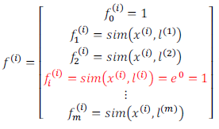

3 使用支持向量机的代价函数

$min C\sum\limits_{i=1}^{m}{[{{y}^{(i)}}cos {{t}_{1}}}( {{\theta }^{T}}{{f}^{(i)}})+(1-{{y}^{(i)}})cos {{t}_{0}}( {{\theta }^{T}}{{f}^{(i)}})]+\frac{1}{2}\sum\limits_{j=1}^{n=m}{\theta _{j}^{2}}$

下面是支持向量机的两个参数$C$和$\sigma$的影响：

$C=1/\lambda$

$C$ 较大时，相当于$\lambda$较小，可能会导致过拟合，高方差；

$C$ 较小时，相当于$\lambda$较大，可能会导致低拟合，高偏差；

$\sigma$较大时，可能会导致低方差，高偏差；

$\sigma$较小时，可能会导致低偏差，高方差。

# 第八周 无监督学习

# 13 聚类

## 13.1 无监督学习

对于无标签的训练数据，能够自动分类的方法叫做聚类

## 13.2 K-均值算法

**K-均值**是一个迭代算法，假设我们想要将数据聚类成n个组，其方法为:

1. 首先选择$K$个随机的点，称为**聚类中心**（**cluster centroids**）；

2. 每个数据找到离自己最近的中心点。
3. 同一中心点关联的所有点聚成一类

4. 计算每一个组的平均值，将该组所关联的中心点移动到平均值的位置。

重复步骤2-4直至中心点不再变化。

下面是一个聚类示例：

迭代 1 次

迭代 3 次

迭代 10 次

## 13.3 代价函数

K-均值最小化问题，是要最小化所有的数据点与其所关联的聚类中心点之间的距离之和，因此
K-均值的代价函数（又称**畸变函数** **Distortion function**）为：

$$J(c^{(1)},...,c^{(m)},μ_1,...,μ_K)=\dfrac {1}{m}\sum^{m}_{i=1}\left\| X^{\left( i\right) }-\mu_{c^{(i)}}\right\| ^{2}$$

其中${{\mu }_{{{c}^{(i)}}}}$代表与${{x}^{(i)}}$最近的聚类中心点。
我们的的优化目标便是找出使得代价函数最小的 $c^{(1)}$,$c^{(2)}$,...,$c^{(m)}$和$μ^1$,$μ^2$,...,$μ^k$：

## 13.4 随机初始化

1. 我们应该选择$K<m$，即聚类中心点的个数要小于所有训练集实例的数量

2. 随机选择$K$个训练实例，然后令$K$个聚类中心分别与这$K$个训练实例相等

**K-均值**的一个问题在于，它有可能会停留在一个局部最小值处，而这取决于初始化的情况。

为了解决这个问题，我们通常需要多次运行**K-均值**算法，每一次都重新进行随机初始化，最后再比较多次运行**K-均值**的结果，选择代价函数最小的结果。这种方法在$K$较小的时候（2--10）还是可行的，但是如果$K$较大，这么做也可能不会有明显地改善。

## 13.5 选择聚类数

***肘部法则***： 我们所需要做的是改变$K$值，也就是聚类类别数目的总数。我们用一个聚类来运行**K均值**聚类方法。这就意味着，所有的数据都会分到一个聚类里，然后计算成本函数或者计算畸变函数$J$。$K$代表聚类数字。

如果是如上图的例子，那么就选K=3

# 14 降维

## 14.1 降维的动机

1. 数据压缩
2. 数据可视化

## 14.2 主成分分析问题（PCA)

找到一个方向向量，把所有数据都投影到该向量时，平均均方误差尽可能小

投射误差是从特征向量向该方向向量作垂线的长度。

主成分分析与线性回归是两种不同的算法。主成分分析最小化的是投射误差（**Projected Error**），而线性回归尝试的是最小化预测误差。线性回归的目的是预测结果，而主成分分析不作任何预测。

![img(../image/吴恩达机器学习/7e1389918ab9358d1432d20ed20f8142.png)

左边是线性回归，误差是垂直于横轴投影

右边是PCA，垂直于红线投影

## 14.3 PCA算法步骤

**PCA** 减少$n$维到$k$维：

1. 是均值归一化。我们需要计算出所有特征的均值，然后令 $x_j= x_j-μ_j$。如果特征是在不同的数量级上，我们还需要将其除以标准差 $σ^2$。

2. 是计算**协方差矩阵**（**covariance matrix**）$Σ$：
   $\sum=\dfrac {1}{m}\sum^{n}_{i=1}\left( x^{(i)}\right) \left( x^{(i)}\right) ^{T}$

3. 是计算协方差矩阵$Σ$的**特征向量**（**eigenvectors**）:

在 **Octave** 里我们可以利用**奇异值分解**（**singular value decomposition**）来求解，`[U, S, V]= svd(sigma)`。

$$Sigma=\dfrac {1}{m}\sum^{n}_{i=1}\left( x^{(i)}\right) \left( x^{(i)}\right) ^{T}$$

对于一个 $n×n$维度的矩阵，上式中的$U$是一个具有与数据之间最小投射误差的方向向量构成的矩阵。如果我们希望将数据从$n$维降至$k$维，我们只需要从$U$中选取前$k$个向量，获得一个$n×k$维度的矩阵，我们用$U_{reduce}$表示，然后通过如下计算获得要求的新特征向量$z^{(i)}$:
$$z^{(i)}=U^{T}_{reduce}*x^{(i)}$$

其中$x$是$n×1$维的，因此结果为$k×1$维度。注，我们不对方差特征进行处理。

## 14.4 选择主成分的数量

主要成分分析是减少投射的平均均方误差：

训练集的方差为：$\dfrac {1}{m}\sum^{m}_{i=1}\left\| x^{\left( i\right) }\right\| ^{2}$

我们希望在平均均方误差与训练集方差的比例尽可能小的情况下选择尽可能小的$k$值。

如果我们希望这个比例小于1%，就意味着原本数据的偏差有99%都保留下来了，如果我们选择保留95%的偏差，便能非常显著地降低模型中特征的维度了。

我们可以先令$k=1$，然后进行主要成分分析，获得$U_{reduce}$和$z$，然后计算比例是否小于1%。如果不是的话再令$k=2$，如此类推，直到找到可以使得比例小于1%的最小$k$ 值（原因是各个特征之间通常情况存在某种相关性）。

还有一些更好的方式来选择$k$，当我们在**Octave**中调用“**svd**”函数的时候，我们获得三个参数：`[U, S, V] = svd(sigma)`。

其中的$S$是一个$n×n$的矩阵，只有对角线上有值，而其它单元都是0，我们可以使用这个矩阵来计算平均均方误差与训练集方差的比例：
$$\dfrac {\dfrac {1}{m}\sum^{m}_{i=1}\left\| x^{\left( i\right) }-x^{\left( i\right) }_{approx}\right\| ^{2}}{\dfrac {1}{m}\sum^{m}_{i=1}\left\| x^{(i)}\right\| ^{2}}=1-\dfrac {\Sigma^{k}_{i=1}S_{ii}}{\Sigma^{m}_{i=1}S_{ii}}\leq 1\%$$

也就是：$$\frac {\Sigma^{k}_{i=1}s_{ii}}{\Sigma^{n}_{i=1}s_{ii}}\geq0.99$$

在压缩过数据后，我们可以采用如下方法来近似地获得原有的特征：$$x^{\left( i\right) }_{approx}=U_{reduce}z^{(i)}$$

## 14.5 重建的压缩表示

$x$为2维，$z$为1维，$z=U^{T}_{reduce}x$，相反的方程为：$x_{appox}=U_{reduce}\cdot z$,$x_{appox}\approx x$。如图：

# 第九周

# 15 异常检测(Anomaly Detection)

## 15.1 问题的动机

确认数据集中的某些数据是异常的

上图中，在蓝色圈内的数据属于该组数据的可能性较高，而越是偏远的数据，其属于该组数据的可能性就越低。

这种方法称为密度估计，表达如下：

$$
if \quad p(x)
\begin{cases}
< \varepsilon & anomaly \\
> =\varepsilon & normal
\end{cases}
$$

欺诈检测：

$x^{(i)} = {用户的第i个活动特征}$

模型$p(x)$ 为我们其属于一组数据的可能性，通过$p(x) < \varepsilon$检测非正常用户。

## 15.2 高斯分布

通常如果我们认为变量 $x$ 符合高斯分布 $x \sim N(\mu, \sigma^2)$则其概率密度函数为：
$p(x,\mu,\sigma^2)=\frac{1}{\sqrt{2\pi}\sigma}\exp\left(-\frac{(x-\mu)^2}{2\sigma^2}\right)$
我们可以利用已有的数据来预测总体中的$μ$和$σ^2$的计算方法如下：
$\mu=\frac{1}{m}\sum\limits_{i=1}^{m}x^{(i)}$

$\sigma^2=\frac{1}{m}\sum\limits_{i=1}^{m}(x^{(i)}-\mu)^2$

高斯分布样例：

## 15.3 算法

选取不同的u,v。然后拟合出正态分布曲线，排除异常特征

## 15.4 具体步骤

1. 根据测试集数据，我们估计特征的平均值和方差并构建$p(x)$函数
2. 对交叉检验集，我们尝试使用不同的$\varepsilon$值作为阀值，并预测数据是否异常，根据$F1$值或者查准率与查全率的比例来选择 $\varepsilon$
3. 选出 $\varepsilon$ 后，针对测试集进行预测，计算异常检验系统的$F1$值，或者查准率与查全率之比

## 15.5 预处理特征

如果数据的分布不是高斯分布，异常检测算法也能够工作，但是最好还是将数据转换成高斯分布，例如使用对数函数：$x= log(x+c)$，其中 $c$ 为非负常数； 或者 $x=x^c$，$c$为 0-1 之间的一个分数，等方法

# 16 推荐系统

## 16.1 问题定义

假使我们是一个电影供应商，我们有 5 部电影和 4 个用户，我们要求用户为电影打分。

前三部电影是爱情片，后两部则是动作片，我们可以看出**Alice**和**Bob**似乎更倾向与爱情片， 而 **Carol** 和 **Dave** 似乎更倾向与动作片。并且没有一个用户给所有的电影都打过分。我们希望构建一个算法来预测他们每个人可能会给他们没看过的电影打多少分，并以此作为推荐的依据。

下面引入一些标记：

$n_u$ 代表用户的数量

$n_m$ 代表电影的数量

$r(i, j)$ 如果用户j给电影 $i$ 评过分则 $r(i,j)=1$

$y^{(i, j)}$ 代表用户 $j$ 给电影$i$的评分

$m_j$代表用户 $j$ 评过分的电影的总数

## 16.2 基于内容的推荐系统

在我们的例子中，我们可以假设每部电影都有两个特征，如$x_1$代表电影的浪漫程度，$x_2$ 代表电影的动作程度。

则每部电影都有一个特征向量，如$x^{(1)}$是第一部电影的特征向量为[0.9 0]。

下面我们要基于这些特征来构建一个推荐系统算法。

使用线性回归计算

$\theta^{(j)}$用户 $j$ 的参数向量

$x^{(i)}$电影 $i$ 的特征向量

对于用户 $j$ 和电影 $i$，我们预测评分为：$(\theta^{(j)})^T x^{(i)}$

代价函数

针对用户 $j$，该线性回归模型的代价为预测误差的平方和，加上正则化项：
$$
\min_{\theta (j)}\frac{1}{2}\sum_{i:r(i,j)=1}\left((\theta^{(j)})^Tx^{(i)}-y^{(i,j)}\right)^2+\frac{\lambda}{2}\left(\theta_{k}^{(j)}\right)^2
$$

其中 $i:r(i,j)$表示我们只计算那些用户 $j$ 评过分的电影。在一般的线性回归模型中，误差项和正则项应该都是乘以$1/2m$，在这里我们将$m$去掉。并且我们不对方差项$\theta_0$进行正则化处理。

上面的代价函数只是针对一个用户的，为了学习所有用户，我们将所有用户的代价函数求和：
$$
\min_{\theta^{(1)},...,\theta^{(n_u)}} \frac{1}{2}\sum_{j=1}^{n_u}\sum_{i:r(i,j)=1}\left((\theta^{(j)})^Tx^{(i)}-y^{(i,j)}\right)^2+\frac{\lambda}{2}\sum_{j=1}^{n_u}\sum_{k=1}^{n}(\theta_k^{(j)})^2
$$
如果我们要用梯度下降法来求解最优解，我们计算代价函数的偏导数后得到梯度下降的更新公式为：

$$
\theta_k^{(j)}:=\theta_k^{(j)}-\alpha\sum_{i:r(i,j)=1}((\theta^{(j)})^Tx^{(i)}-y^{(i,j)})x_{k}^{(i)} \quad (\text{for} \, k = 0)
$$

$$
\theta_k^{(j)}:=\theta_k^{(j)}-\alpha\left(\sum_{i:r(i,j)=1}((\theta^{(j)})^Tx^{(i)}-y^{(i,j)})x_{k}^{(i)}+\lambda\theta_k^{(j)}\right) \quad (\text{for} \, k\neq 0)
$$

## 16.3 协同过滤

如果我们拥有用户的参数，我们可以学习得出电影的特征。

$$
\mathop{min}\limits_{x^{(1)},...,x^{(n_m)}}\frac{1}{2}\sum_{i=1}^{n_m}\sum_{j{r(i,j)=1}}((\theta^{(j)})^Tx^{(i)}-y^{(i,j)})^2+\frac{\lambda}{2}\sum_{i=1}^{n_m}\sum_{k=1}^{n}(x_k^{(i)})^2
$$
但是如果我们既没有用户的参数，也没有电影的特征，这两种方法都不可行了。协同过滤算法可以同时学习这两者。

我们的优化目标便改为同时针对$x$和$\theta$进行。
$$
J(x^{(1)},...x^{(n_m)},\theta^{(1)},...,\theta^{(n_u)})=\frac{1}{2}\sum_{(i:j):r(i,j)=1}((\theta^{(j)})^Tx^{(i)}-y^{(i,j)})^2+\frac{\lambda}{2}\sum_{i=1}^{n_m}\sum_{k=1}^{n}(x_k^{(j)})^2+\frac{\lambda}{2}\sum_{j=1}^{n_u}\sum_{k=1}^{n}(\theta_k^{(j)})^2
$$

对代价函数求偏导数的结果如下：

$$
x_k^{(i)}:=x_k^{(i)}-\alpha\left(\sum_{j:r(i,j)=1}((\theta^{(j)})^Tx^{(i)}-y^{(i,j)}\theta_k^{j}+\lambda x_k^{(i)}\right)
$$

$$
\theta_k^{(i)}:=\theta_k^{(i)}-\alpha\left(\sum_{i:r(i,j)=1}((\theta^{(j)})^Tx^{(i)}-y^{(i,j)}x_k^{(i)}+\lambda \theta_k^{(j)}\right)
$$

注：在协同过滤从算法中，我们通常不使用方差项，如果需要的话，算法会自动学得。
协同过滤算法使用步骤如下：

1. 初始 $x^{(1)},x^{(1)},...x^{(nm)},\ \theta^{(1)},\theta^{(2)},...,\theta^{(n_u)}$为一些随机小值
2. 使用梯度下降算法最小化代价函数
3. 在训练完算法后，我们预测$(\theta^{(j)})^Tx^{(i)}$为用户 $j$ 给电影 $i$ 的评分

## 16.4 协同过滤算法

参考视频: 16 - 4 - Collaborative Filtering Algorithm (9 min).mkv

协同过滤优化目标：

给定$x^{(1)},...,x^{(n_m)}$，估计$\theta^{(1)},...,\theta^{(n_u)}$：
$$
\min_{\theta^{(1)},...,\theta^{(n_u)}}\frac{1}{2}\sum_{j=1}^{n_u}\sum_{i:r(i,j)=1}((\theta^{(j)})^Tx^{(i)}-y^{(i,j)})^2+\frac{\lambda}{2}\sum_{j=1}^{n_u}\sum_{k=1}^{n}(\theta_k^{(j)})^2
$$

给定$\theta^{(1)},...,\theta^{(n_u)}$，估计$x^{(1)},...,x^{(n_m)}$：

同时最小化$x^{(1)},...,x^{(n_m)}$和$\theta^{(1)},...,\theta^{(n_u)}$：
$$
J(x^{(1)},...,x^{(n_m)},\theta^{(1)},...,\theta^{(n_u)})=\frac{1}{2}\sum_{(i,j):r(i,j)=1}((\theta^{(j)})^Tx^{(i)}-y^{(i,j)})^2+\frac{\lambda}{2}\sum_{i=1}^{n_m}\sum_{k=1}^{n}(x_k^{(i)})^2+\frac{\lambda}{2}\sum_{j=1}^{n_u}\sum_{k=1}^{n}(\theta_k^{(j)})^2
$$

$$
\min_{x^{(1)},...,x^{(n_m)} \\\ \theta^{(1)},...,\theta^{(n_u)}}J(x^{(1)},...,x^{(n_m)},\theta^{(1)},...,\theta^{(n_u)})
$$

## 16.5 向量化：低秩矩阵分解

参考视频: 16 - 5 - Vectorization\_ Low Rank Matrix Factorization (8 min).mkv

在上几节视频中，我们谈到了协同过滤算法，本节视频中我将会讲到有关该算法的向量化实现，以及说说有关该算法你可以做的其他事情。

举例子：

1. 当给出一件产品时，你能否找到与之相关的其它产品。

2. 一位用户最近看上一件产品，有没有其它相关的产品，你可以推荐给他。

我将要做的是：实现一种选择的方法，写出协同过滤算法的预测情况。

我们有关于五部电影的数据集，我将要做的是，将这些用户的电影评分，进行分组并存到一个矩阵中。

我们有五部电影，以及四位用户，那么 这个矩阵 $Y$ 就是一个5行4列的矩阵，它将这些电影的用户评分数据都存在矩阵里：

| **Movie**            | **Alice (1)** | **Bob (2)** | **Carol (3)** | **Dave (4)** |
| -------------------- | ------------- | ----------- | ------------- | ------------ |
| Love at last         | 5             | 5           | 0             | 0            |
| Romance forever      | 5             | ?           | ?             | 0            |
| Cute puppies of love | ?             | 4           | 0             | ?            |
| Nonstop car chases   | 0             | 0           | 5             | 4            |
| Swords vs. karate    | 0             | 0           | 5             | ?            |

推出评分：

找到相关影片：

现在既然你已经对特征参数向量进行了学习，那么我们就会有一个很方便的方法来度量两部电影之间的相似性。例如说：电影 $i$ 有一个特征向量$x^{(i)}$，你是否能找到一部不同的电影 $j$，保证两部电影的特征向量之间的距离$x^{(i)}$和$x^{(j)}$很小，那就能很有力地表明电影$i$和电影 $j$ 在某种程度上有相似，至少在某种意义上，某些人喜欢电影 $i$，或许更有可能也对电影 $j$ 感兴趣。总结一下，当用户在看某部电影 $i$ 的时候，如果你想找5部与电影非常相似的电影，为了能给用户推荐5部新电影，你需要做的是找出电影 $j$，在这些不同的电影中与我们要找的电影 $i$ 的距离最小，这样你就能给你的用户推荐几部不同的电影了。

通过这个方法，希望你能知道，如何进行一个向量化的计算来对所有的用户和所有的电影进行评分计算。同时希望你也能掌握，通过学习特征参数，来找到相关电影和产品的方法。

## 16.6 推行工作上的细节：均值归一化

参考视频: 16 - 6 - Implementational Detail\_ Mean Normalization (9 min).mkv

让我们来看下面的用户评分数据：

如果我们新增一个用户 **Eve**，并且 **Eve** 没有为任何电影评分，那么我们以什么为依据为**Eve**推荐电影呢？

我们首先需要对结果 $Y $矩阵进行均值归一化处理，将每一个用户对某一部电影的评分减去所有用户对该电影评分的平均值：

然后我们利用这个新的 $Y$ 矩阵来训练算法。
如果我们要用新训练出的算法来预测评分，则需要将平均值重新加回去，预测$(\theta^{(j)})^T x^{(i)}+\mu_i$，对于**Eve**，我们的新模型会认为她给每部电影的评分都是该电影的平均分。

# 数学知识

## 1 等高线{#line}

梯度下降的方向与等高线的切线方向垂直

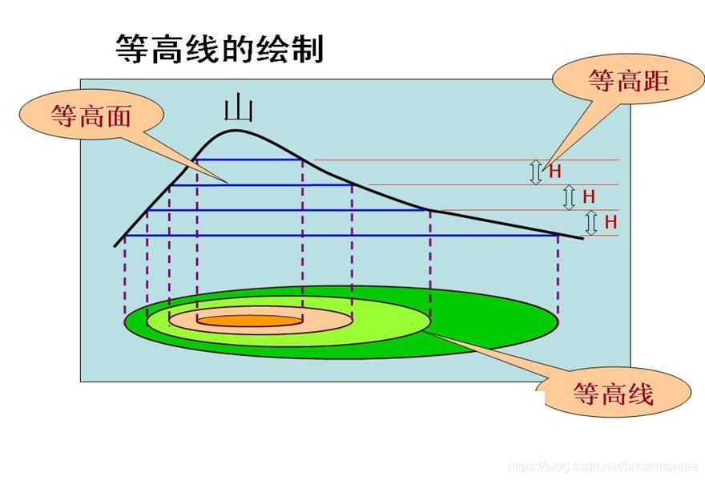

从上图可知，等高线就是一个函数在一个平面上的投影。把一个多维的问题转成了2维屏幕的问题。

### 梯度的定义

$grad(x_0,x_1,...,x_n) = (\frac{\partial f}{\partial{x_0}},...,\frac{\partial f}{\partial{x_i}},...\frac{\partial f}{\partial{x_n}})$

1. 梯度是一个向量，既有大小又有方向。
2. 梯度的方向是最大方向导数的方向。
3. 梯度的模是方向导数的最大值。

### 梯度方向与等高线切线方向垂直

设函数为 z = f(x,y)，这个三维曲面被平面z=c所截的方程如下。
$$
\left\{
\begin{aligned}
&z=f(x,y) \\
&z = c
\end{aligned}
\right .
$$
该曲线在xoy平面上的投影是一条曲线，假设该曲线为Q，在xoy平面上该曲线的方程为
$f(x,y)=c$

等高线f ( x , y ) = c上的任意一点p切线处的斜率为d y / d x
所以p点对应的法线的斜率如下

$-\frac{1}{\frac{dy}{dx}}=\frac{f_y}{f_x}$

梯度可以表示为向量

$(\frac{\partial f}{\partial x},\frac{\partial f}{\partial y})$

由此可见，梯度的方向与等高线切线的法向量方向是相同的

## 2 K-L散度(相对熵)

Kullback-Leibler Divergence，即K-L散度，是一种**量化两种概率分布P和Q之间差异**的方式，又叫相对熵

### 例子

假设在一个外星球，有一种动物，他的牙齿不会超过11颗，这种动物的牙齿数目概率分布如下

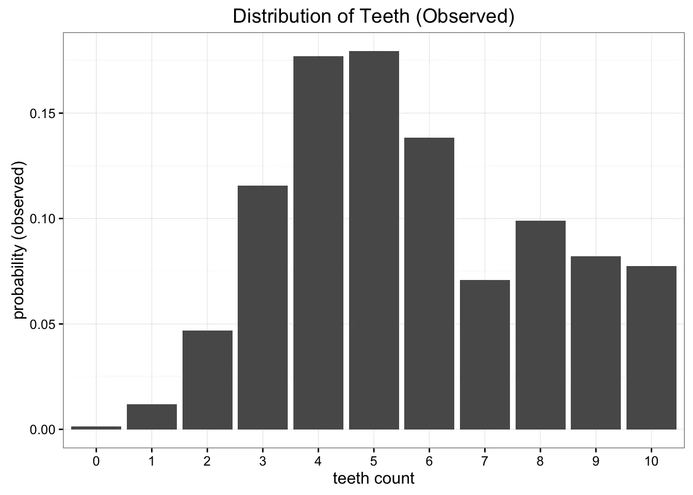

为了传输，如果用均分布模型代替，那么只需要传牙齿最大的数目11就可以。均分布图如下

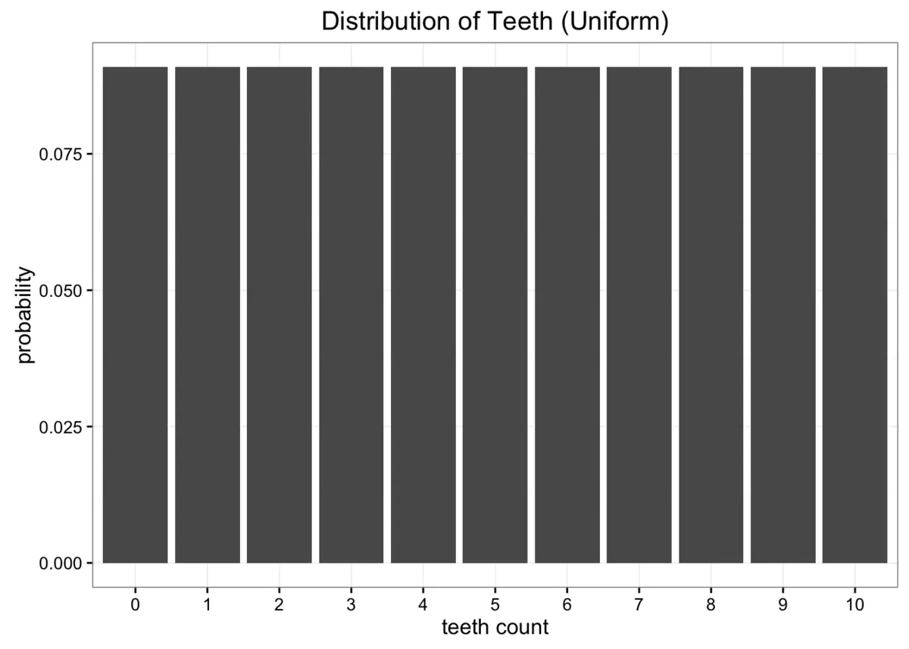

如果采用二项式分布

#### 二项式分布

1. 做某件事的次数是固定的，用n表示，且n次事件是相互独立的。
2. 每一件事件都有两个可能结果（成功 or 失败）
3. 每一次成功的概率都相等，成功的概率用p表示
4. 想知道成功k次的概率是多少

$P(X=r)=\frac{n!}{r!(n-r)!} *0.25^r*0.75^{n-r}$

推广到所有情况，每道题答对概率是p，每道题答错概率 q = 1-p

$P(X=r)=\frac{n!}{r!(n-r)!} *p^r*q^{n-r}$

用变量表示就是

$X~B(n,p)$

#### 期望和方差

**期望**

* 离散

  设随机变量X有概率分布$P_j = P(X=x_j),j=0,1,...$

  若$\displaystyle \sum_{j=0}^{\infty}|X_j|P_j < \infty$, 则称$E(X)=\displaystyle \sum_{j=0}^{\infty}|X_j|P_j$ 为X的期望

* 连续

  设连续随机变量X的概率密度函数f(x), 若$\displaystyle \int_{\infty}^{\infty}|x|f(x){dx} < \infty$

  则称$E(X)=\displaystyle \int_{\infty}^{\infty}|x|f(x){dx}$ 为X的期望

#### 二项式的期望和方差

E(X) =E(X1) +E(X2) +····+E(Xn) = n E(X) =np

Var(X) = E(X²)-E(X)² = p -p² =p(1-p) ==pq

Var(X) = Var(X1) + Var(X2)+·····+Var(Xn) = n Var(X) = npq

### 如何判别哪种分布更接近原始分布？

### 数据的熵

K-L散度源于信息论。信息论主要研究如何量化数据中的信息。最重要的信息度量单位是熵Entropy，一般用H表示。分布的熵的公式如下

$H=-\displaystyle \sum_{i=1}^{N}p(x_i)*\log p(x_i)$

上面对数没有确定底数，可以是2、e或10，等等。如果我们使用以2为底的对数计算H值的话，可以把这个值看作是编码信息所需要的最少二进制位个数bits

### K-L散度度量信息损失

只需要稍加修改熵H的计算公式就能得到K-L散度的计算公式。设p为观察得到的概率分布，q为另一分布来近似p，则p、q的K-L散度为

$D_{KL}(p||q)=\displaystyle \sum_{i=1}^{N} p(x_i)*(\log p(x_i)-\log q(x_i))$

下面公式以期望表达K-L散度

$D_{KL}(p||q)=E[\log p(x_i)-\log q(x_i)]$

## 3 先验分布/后验分布/估计似然

### 3.1 后验分布

小哥要去15公里外的一个公园，他可以选择**步行走路**，**骑自行车**或者**开辆车**，然后通过其中一种方式**花了一段时间**到达公园

假设我们**已经知道小哥花了1个小时到了公园**，那么你猜他是怎么去的

这种预先**已知结果**（路上花的时间），然后根据结果**估计**（猜）**原因**（交通方式）的概率分布即 **后验概率**。

例子问题公式化：
$P(交通方式∣花费的时间)$

修改成一般的公式：
$P(因∣果)$

公式正规化：
$P ( θ ∣ x ) $

（公式中的 “∣ |∣”读作 g i v e n ，即给定的意思。如P ( A ∣ B ) 即A given B 的概率）

## 3.2 先验分布

这个情景中隔壁小哥的交通工具选择与花费时间不再相关。因为我们是在结果发生前就开始猜的，根据历史规律确定原因 （交通方式）的概率分布即 先验概率。

例子问题公式化：
P ( 交 通 方 式 )

一般化：
P ( 因 ) 

正规化：
P ( θ ) 

## 3.3 似然估计（由因求果）

**根据原因来估计结果**的概率分布即 **似然估计**。根据原因来统计各种可能结果的概率即**似然函数**

似然函数问题公式化：
P ( 时 间 ∣ 交 通 方 式 )

一般化：
P ( 果 ∣ 因 ) 

正规化：
P ( x ∣ θ ) 

## 3.4 贝叶斯公式

我们熟知的贝叶斯公式是这样的：
$P ( A ∣ B ) = P ( B ∣ A ) ∗ P ( A ) P ( B ) P( A|B )=\frac{P(B|A) *P(A)}{P(B)}$

但在这里我们采用如下形式：
$P ( θ ∣ x ) = P ( x ∣ θ ) ∗ P ( θ ) P ( x ) P( \theta|x )=\frac{P(x|\theta) *P(\theta)}{P(x)}$

$后验概率 =\frac{似然估计 *先验概率}{evidence}$

P ( x )  即 e v i d e n c e 。隔壁小哥去公园很多次，忽略交通方式是什么，只统计每次到达公园的时间 x ，于是得到了一组时间的概率分布。这种不考虑原因，只看结果的概率分布即 e v i d e n c e ，它也称为样本发生的概率分布的证据
evidence 在故事中如下表示：
P ( 时 间 )
或
P ( 果 )

## 3.5 例题

在小哥面前有两个一模一样的宝箱，一号箱子里面有3颗水果糖和1颗巧克力糖；二号箱子里面有2颗水果糖和2颗巧克力糖。
(1) 现在小哥将随机选择一个箱子，从中摸出一颗糖。请问小哥选择一号箱子的概率有多大？
(2) 现在小哥将随机选择一个箱子，从中摸出一颗糖发现是水果糖。请问这颗水果糖来自一号箱子的概率有多大？

$P(θ∣x)=\frac{P(x∣\theta)*P(\theta)}{P(x)}$

[解释]：其中 x  是观测得到的结果数据。P ( x )是观测结果数据的概率分布。如下表：

| x    | 水果糖 | 巧克力糖 |
| ---- | ------ | -------- |
| p(X) | 5/8    | 3/8      |

[解释]：其中 θ 是决定观测结果数据分布的参数。P ( θ ) 是先验概率，没有观测数据的支持下 θ发生的概率。如下表：

| θ    | 一号箱 | 二号箱 |
| ---- | ------ | ------ |
| P(θ) | 1/2    | 1/2    |

[解释]：P ( θ ∣ x )是后验概率，有观测数据的支持下 θ  发生的概率。在上面的故事中第二问是小哥随机选择一个箱子，从中摸出一颗糖发现是水果糖。这颗水果糖来自一号箱子的概率就是后验概率：
$P(\theta =一号箱 | x = 水果糖)$

[解释]：P ( x ∣ θ )  是似然函数，给定某参数 θ 时结果数据的概率分布。

其中，P ( θ = 一 号 箱 )  就是先验概率，根据贝叶斯公式，需求证据 P ( x = 水 果 糖 )  和似然函数 P ( x = 水 果 糖 ∣ θ = 一 号 箱 ) 

$P(x=水果糖) = \displaystyle \sum_{i}P( x = 水果糖 | \theta =i 号箱)P(\theta = i)$
我们再考虑上面的计算：
(1) 现在小哥将随机选择一个箱子，从中摸出一颗糖。请问小哥选择一号箱子的概率。根据明显的先验知识我们就可以知道
$P ( θ = 一 号 箱 ) = 1 / 2 $

(2) 现在小哥将随机选择一个箱子，从中摸出一颗糖发现是水果糖。请问这颗水果糖来自一号箱子的概率。后验概率为
$ P( \theta =1|x=水果 )=\frac{P(x=水果|\theta =1) *P(\theta =1)}{P(x=水果)}$

$ P( \theta =1|x=水果 )=\frac{P(x=水果|\theta =1) *P(\theta =1)}{ \sum_{i}P( x = 水果糖 | \theta =i 号箱)P(\theta = i)}$

$P( \theta =1|x=水果 )=\frac{(3/4) *(1/2)}{ (3/4) *(1/2)+(2/4) *(1/2)}$

$P( \theta =1|x=水果 )=3/5$

## 3.6 贝叶斯估计ML/MAP

**最大似然估计（ML，Maximum Likelihood）**

可以估计模型的参数。其目标是找出一组参数 θ ，使得模型产生出观测数据 x 的概率最大：
$ \underset{\theta}{argmax} P(x|\theta)$
**最大后验估计MAP(Maxaposterior)**

优化的是一个后验概率，即给定了观测值后使概率最大

$ \underset{\theta}{argmax} P(\theta|x)=\underset{\theta}{argmax} \frac{P（x|\theta)*P(\theta)}{P(x)}$



