[TOC]

# 第一章 神经网络的思想

## 1.1 神经网络和深度学习

### 神经网络

1. 神经元形成网络。
2. 输入的和不超过阈值，则神经元不做出任何反应。
3. 输入的和超过阈值，则神经元做出反应（称为点火），向另外的神经元传递固定强度的信号
4. 在(2)和(3)中，每个输入对应的权重不一样。

## 1.2 神经元工作的数学表达

$$
\left\{
\begin{aligned}
& 无输出信号 (y=0): w_1x_1+w_2x_2+w_3x_3 < \theta \\
& 有输出信号 (y=1): w_1x_1+w_2x_2+w_3x_3 \geq \theta \
\end{aligned}
\right .
$$

$\theta$是神经元的阈值

转换成图形表示

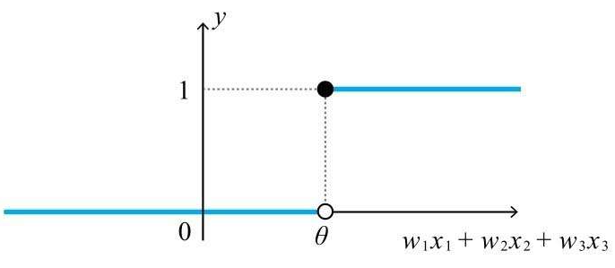

上式可以用单位跃阶函数表达
$$
u(z) = \left\{
\begin{aligned}
& 0 (z<0) \\
& 1 (z\geq0) \\
\end{aligned}
\right.\\
y = u(w_1x_1+w_2x_2+w_3x_3-\theta)
$$

## 1.3 激活函数

神经元简化图

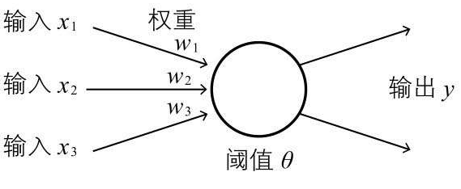

把上面的阶跃函数u(v)一般化
$$
y = a(w_1x_1+w_2x_2+w_3x_3-\theta) \\
a称为激活函数(activation function)
$$

### Sigmoid函数

把模型的描述函数用sigmoid函数表示
$$
f_\theta (x) = \frac{1}{1+exp(-\theta^\tau x)}
$$

该函数的好处是处处可导

### 偏置

因为表达式里面的$\theta$ 带有负号，所以将-θ替换成b。b称为偏置(bias)

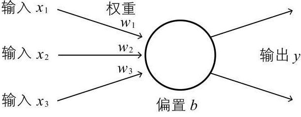

将b看成是常数为1的输入值。上式就可以改成向量的内积
$$
z = (w_1,w_2,w_3,b) \cdot (x_1,x_2,x_3,1)
$$

## 1.4 什么是神经网络

### 神经网络各层的职责

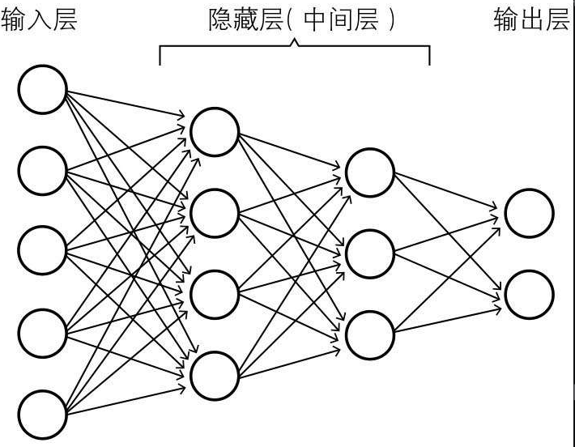

* ***输入层*** 负责读取输入信息，原样输出
* ***隐藏层/中间层*** 处理激活函数
* ***输出层*** 和隐藏层一样，但是输出结果

### 具体例子

4x3像素的图像，手写数字0和1。学习数据64张图象。每个像素只有1bit表示

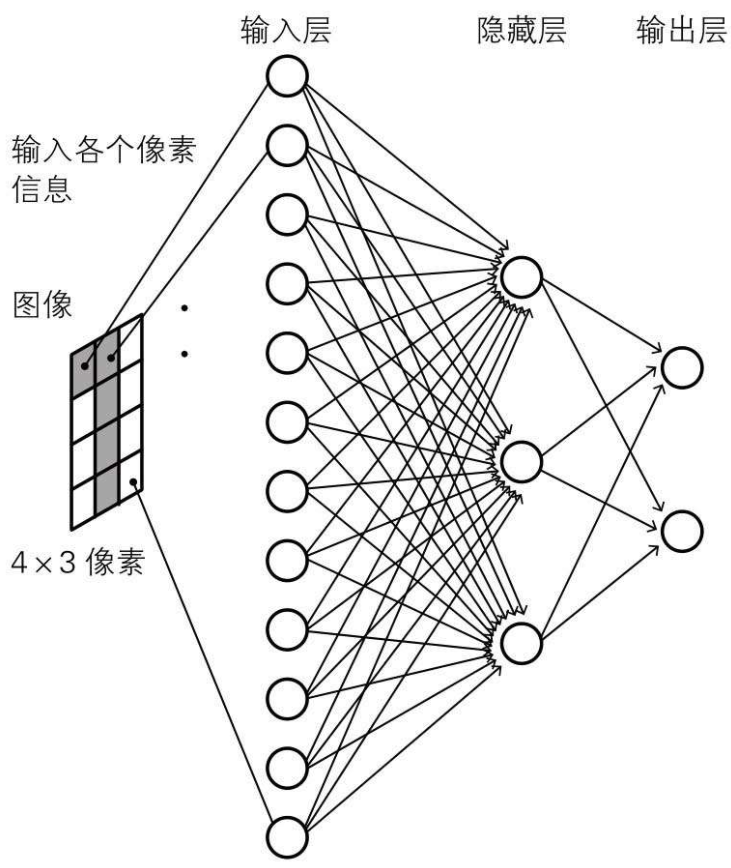

这个网络，前一层和下一层所有神经元都有箭头连接。称为全连接层(fully connected layer)。

* 输入层总归12个神经单元，表示12个像素的值
* 输出层2个神经元输出，一个表示0，一个表示1。哪个输出值大表示是0或者是1
* 隐藏层用于提取图像特征

# 第二章 神经网络的数学基础

## 2.1 神经网络所需的函数

### 正态分布的概率密度函数

$$
f(x) = \frac{1}{\sqrt{2\pi\sigma}} e ^{\frac{(x-u)^2}{2\sigma^2}}
$$

## 2.2 数列和递推关系式

就是说最后一层神经网络的结构，可以由之前几层数列之和求出来。

## 2.4 向量基础

### 张量(tensor)

法向量是垂直于面的向量，根据这个向量的方向（也就是法向），应力的方向和大小各不相同

当面的法向为x、y、z轴时，作用在面上的力依次用向量表示为
$$
\left(
\begin{matrix}
\tau_{11} \\ \tau_{21} \\ \tau_{31}
\end{matrix}
\right) ,
\left(
\begin{matrix}
\tau_{12} \\ \tau_{22} \\ \tau_{32}
\end{matrix}
\right) ,
\left(
\begin{matrix}
\tau_{13} \\ \tau_{23} \\ \tau_{33}
\end{matrix}
\right)
$$
将它们合并如下
$$
\left(
\begin{matrix}
\tau_{11} &\tau_{12} &\tau_{13}\\ \tau_{21} &\tau_{22} &\tau_{23}\\ \tau_{31} &\tau_{32} &\tau_{33}
\end{matrix}
\right)
$$
这个量叫张量。就是向量在各个坐标轴平面的投影

## 2.5 矩阵基础

* ***单位矩阵***

  它是对角线上的元素aii为1、其他元素为0的方阵，通常用E表示

$$
E=\left(
\begin{matrix}
1 &0 &0\\ 0 &1 &0\\ 0 &0 &1
\end{matrix}
\right)
$$

* ***矩阵乘积***

  

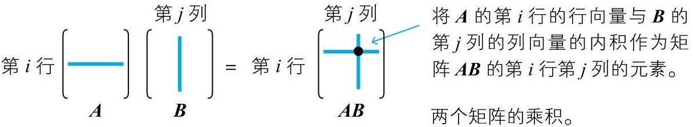

AB$\neq$ BA

AE=EA=A

* **Hadamard乘积**

  相同形状的矩阵A、B，将相同位置的元素相乘，由此产生的矩阵称为矩阵A、B的Hadamard乘积，用A⊙B表示

* **转置矩阵**

  矩阵A的第i行第j列的元素与第j行第i列的元素交换。$A^t$

  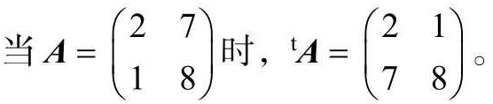

## 2.6 导数基础

### 常用导数公式

### 导数性质

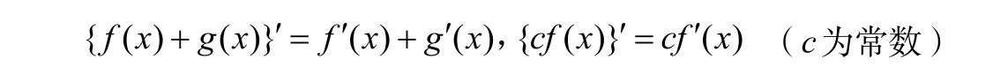

### 分数和Sigmoid函数的导数

​	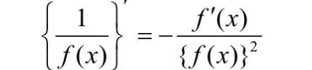
$$
\sigma(x) = \frac{1}{1+e^{-x}} \\
\sigma^`(x) = \sigma(x)(1-\sigma(x))
$$

## 2.7 偏导基础

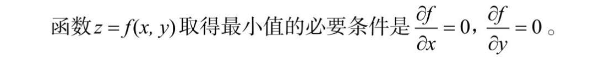

### 拉格朗日乘法

当x2+y2=1时，求x+y的最小值

L=f(x, y)-λg(x, y)=(x+y)-λ(x2+y2-1)

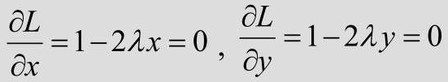

可得x=y=λ= ±1/ 2时，有最小值

## 2.8 误差反向传播法必需的链式法则

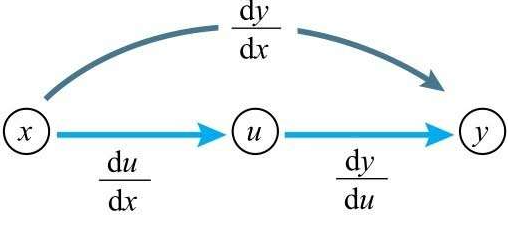

### 多变量情况

变量z为u、v的函数，如果u、v分别为x、y的函数，则z为x、y的函数

## 2.9 梯度下降法基础：多变量函数的近似公式

如果x作微小的变化，那么函数值y将会怎样变化

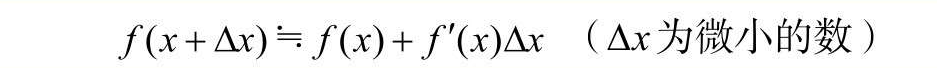

多变量情况

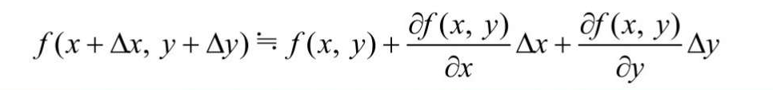

向量表示，3个变量的近似公式可以看成以下2个向量的内积

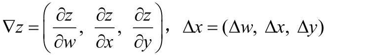

∇通常读作nabla

泰勒展开式

近似公式的一般化公式称为泰勒展开式。例如，在两个变量的情况下，这个公式如下所示

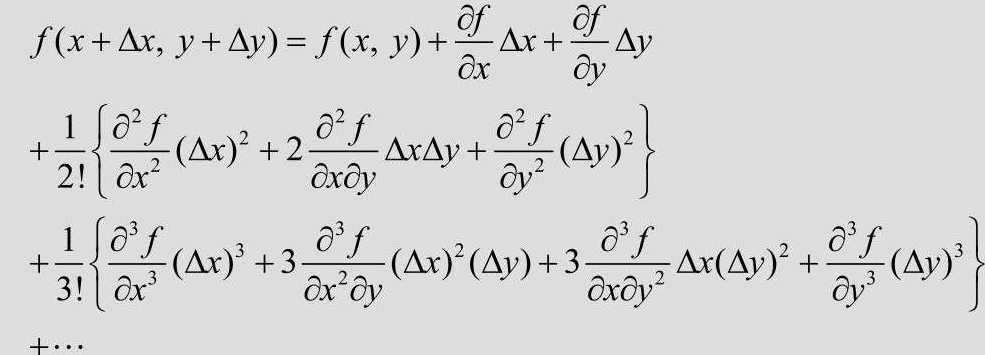

在泰勒展开式中，取出前三项，就得到以上的近似式

## 2.10 梯度下降法的含义与公式

函数z=f(x, y)中，当x改变∆x, y改变∆y时，我们来考察函数f(x, y)的值的变化∆z。

∆z=f(x+∆x, y+∆y)-f(x, y)

根据近似公式
$$
\Delta z = \frac{\partial{f(x,y)}}{\partial{x}} \Delta x + \frac{\partial{f(x,y)}}{\partial{y}} \Delta y
$$
可以表示为两个向量的内积
$$
\Delta z = ( \frac{\partial{f(x,y)}}{\partial{x}}, \frac{\partial{f(x,y)}}{\partial{y}}) \cdot (\Delta x, \Delta y)
$$
要让函数z减小得最快，就是让Δz最大，也就是cosθ=1，两个向量夹角为180°

所以 (Δx, Δy) = - k $( \frac{\partial{f(x,y)}}{\partial{x}}, \frac{\partial{f(x,y)}}{\partial{y}})$ . k是常数

在梯度下降法中，k用η表示

### 哈密顿算子$\nabla$

∇称为哈密顿算子，其定义如下所示
$$
\nabla f = (\frac{\partial{f}}{\partial{x_1}},\frac{\partial{f}}{\partial{x_2}},...,\frac{\partial{f}}{\partial{x_n}})
$$
所以
$$
(\Delta x_1,\Delta x_2,...,\Delta x_n) = - \eta \nabla f
$$

# 第三章 神经网络的最优化

## 3.1 神经网络的参数和变量

### 数学符号

以如下神经网络为例

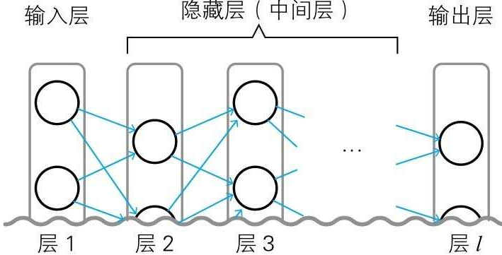

| 符号       | 含义                                                    |
| ---------- | ------------------------------------------------------- |
| $x_i$      | 表示输入层的输入和输出变量                              |
| $w^l_{ji}$ | l-1层的第i个神经元 $\rightarrow$ j层的第j个神经元的权重 |
| $z^l_j$    | l层第j个神经元的加权输入变量                            |
| $b^l_j$    | l层第j个神经元的偏置                                    |
| $a^l_j$    | l层第j个神经元的输出                                    |

各符号含义如下图表示

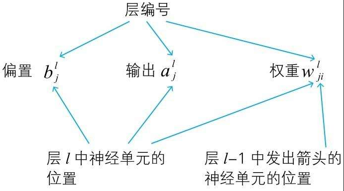

神经元$a^l_j = a(z^i_j)$  a(z)为激活函数

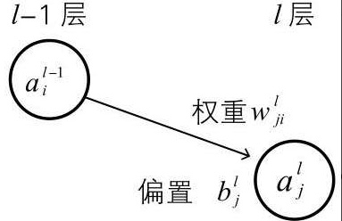

### 神经元的图示方法

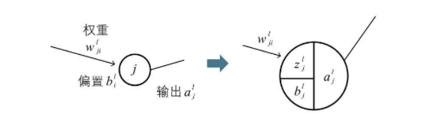

两个神经元的关系可以表示如下

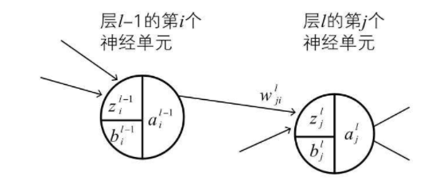

## 3.2 神经网络的变量关系式

### 输入层的关系式

$$
X_i = a^l_i
$$

### 隐藏层的关系式

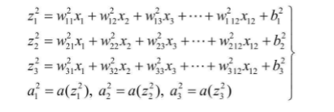

### 输出层的关系式

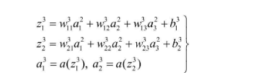

## 3.3 学习数据和正解

就是设置$t_1 ,t_2$来表示teacher，就是训练的结果

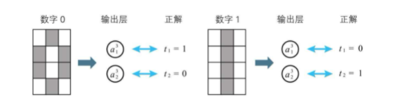

## 3.4 神经网络的代价函数

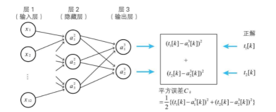

**全部数据的平方误差的总和就是代价函数**

### 参数和规模

以示例的神经网络模型为例

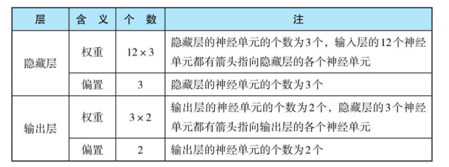

参数总数 = （12x3+3) + (3x2 +2)  = 47

**所以数据规模至少需要47个**

# 第四章 神经网络和误差反向传播法

## 4.2 梯度下降法回顾

因为如果参数很多，对代价函数求导再联立方程会非常复杂

比如上面那个例子，需要47个方程式

所以使用了梯度下降法

但是即使使用梯度下降法，还是需要对参数求偏导。如上式有47个参数，就要至少求47次偏导。还是计算量巨大

## 4.2 神经单元误差 $\delta^l_j$

### 引入符号$\delta^l_j$

$$
\begin{aligned}
& \delta^l_j = \frac{\partial C}{\partial{z^l_j}} (l=2.3.... 表示layer, j表示第j个神经元) \\
& 代价函数式平方差函数C: \\
& C = \frac{1}{2} \{(t_1-a^3_1)^2+(t_2-a^3_2)^2\} \\
& 所以可以推得 \\
& \delta^2_1 = \frac{\partial C}{\partial{z^2_1}} , \delta^3_2 = \frac{\partial C}{\partial{z^3_2}} 
\end{aligned}
$$

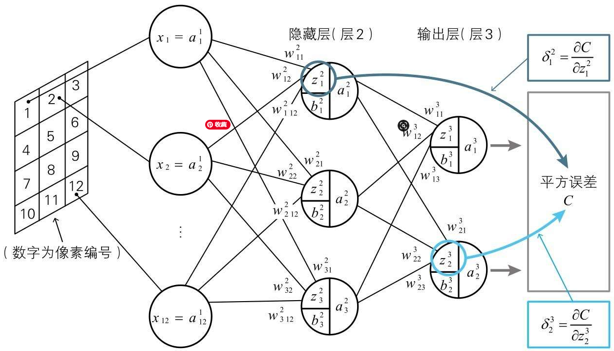

利用$\delta^l_j$ 可以简化参数的偏导公式
$$
\begin{aligned}
& 因为 z_1^2 = w_{11}^2 x_1 + w_{12}^2 x_2 + ... + w_{112}^2 x_1 + b^2 \\
& \frac{\partial z^2_1}{\partial w_{11}^2} = x_1\\
& \frac{\partial C}{\partial{w_{11}^2}} = \frac{\partial C}{\partial{z_{1}^2}}\frac{\partial{z_{1}^2}}{\partial{w_{11}^2}} = \delta_1^2 x_1 \\
& 对于输入层，因为x_1 = a_1^1\\
& \frac{\partial C}{\partial{w_{11}^2}} = \delta_1^2 a_1 \\
& 同样可以推导出对偏置b得偏导 \\
& \frac{\partial C}{\partial{b_{1}^2}} = \delta_1^2  \\
\end{aligned}
$$
所以我们只要能求出每个神经元得误差$\delta^l_j$，就能求出梯度下降法要求的偏导

### $\delta^l_j$的含义与神经单元误差

我们来考虑一下将$\delta^l_j$称为神经单元误差的含义。从这个定义可知，$\delta^l_j$表示神经单元的加权输入w给平方误差带成的变化率。可以认为$\delta^l_j$表示与符合数据的理想状态的偏差

## 4.3 神经网络和误差反向传播法

### 通过递推关系越过导数计算

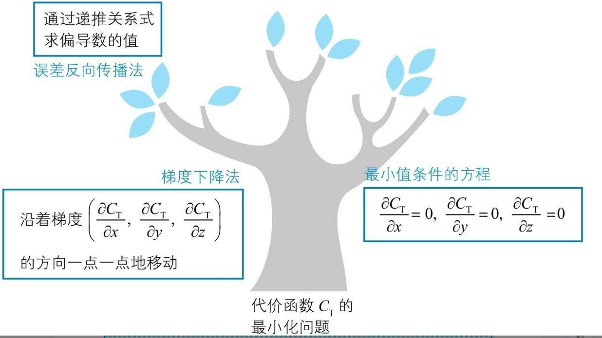

### 计算输出层的$\delta^l_j$

计算例子得输出层神经元误差
$$
\delta^3_j = \frac{\partial C}{\partial{a_j^3}}*\frac{\partial{a_j^3}}{\partial{z_j^3}}=\frac{\partial C}{\partial{a_j^3}} a'(z_j^3)
$$
也就是说是代价函数对第三层得激活函数求导，再乘以激活函数对输出求导

代入具体数值
$$
\begin{aligned}
& C = \frac{1}{2}\{(t_1-a_1^3)^2+(t_2-a_2^3)^2\} \\
& \frac{\partial C}{\partial{a_j^3}} = a_1^3 - t_1 \\
& \delta_1^3 = (a_1^3 - t_1)a'(z_1^3) \\
& 激活函数a为Sigmoid函数\sigma(z)\\
& a'(z^3_1) = \sigma(z^3_1)(1-\sigma(z^3_1)) \\
& \delta_1^3 = (a_1^3 - t_1)\sigma(z^3_1)(1-\sigma(z^3_1)) \\
\end{aligned}
$$

### 中间层$\delta_j^l$的反向递推关系式

$\delta_j^l$可以通过简单的关系式，和下一层的$\delta_j^{l+1}$联系起来

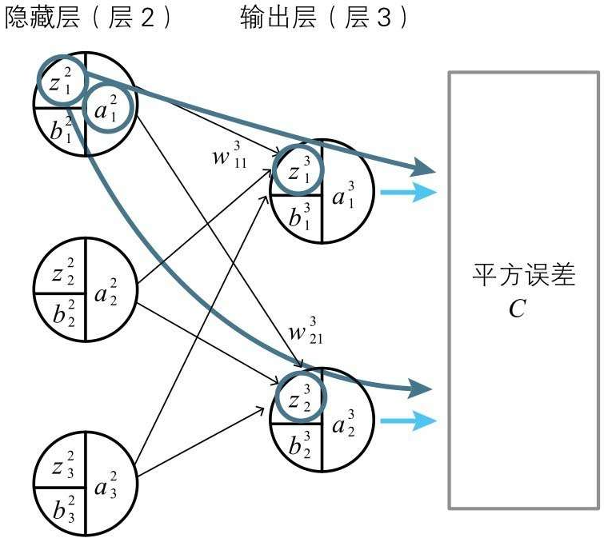

因为

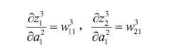

可以得出

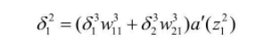

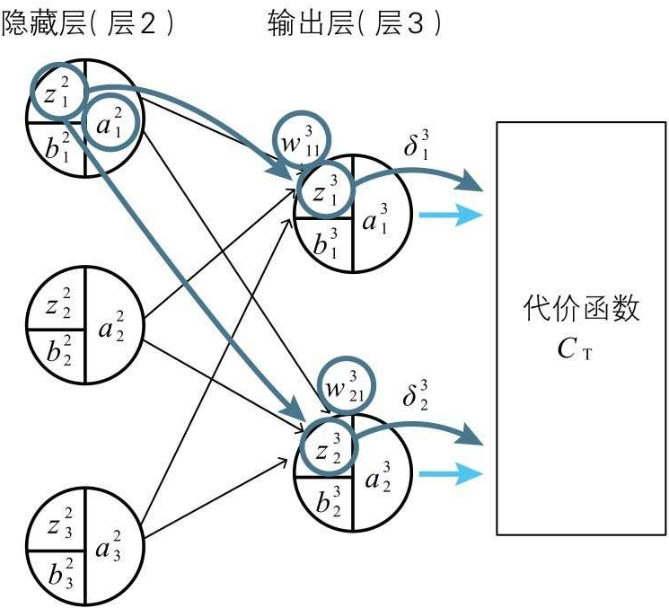

一般式如下

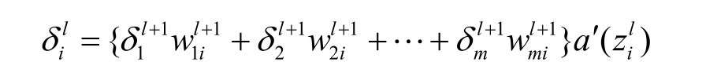

*m为层l+1的神经单元的个数。l为2以上的整数*

### 中间层的$\delta_j^l$不求导也可以得到值

先求出输出层$\delta_1^3,\delta_2^3$，在求出第2层$\delta_1^2,\delta_2^2,\delta_3^2$

这就是误差反向传播法

# 第五章 深度学习和卷积神经网络

## 5.1 基本原理

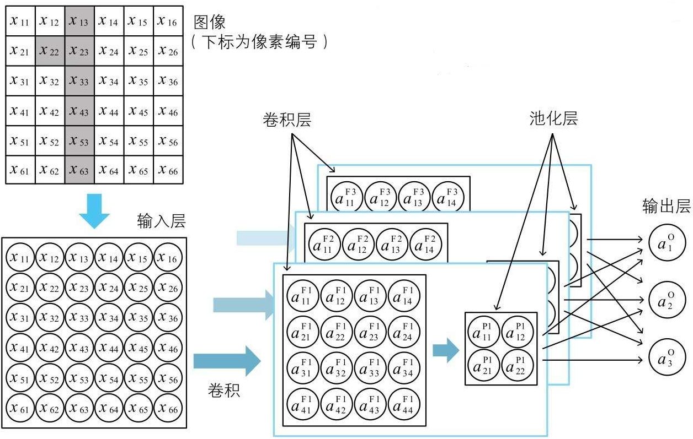

### 卷积层

假设过滤器如下

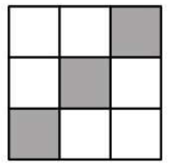

用过滤器S扫描图像，然后把相似度汇总。做特征映射

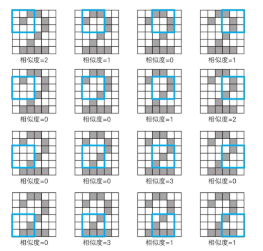

卷积层中的神经单元将这一卷积的结果作为输入信息。各神经单元将对应的卷积的值加上特征映射固有的偏置作为加权输入

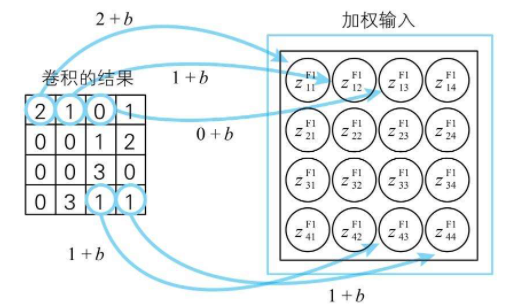

卷积层的各个神经单元通过激活函数来处理加权输入，并将处理结果作为神经单元的输出

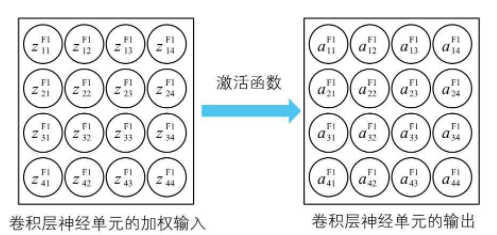

### 通过池化进行信息压缩

压缩的方法十分简单，只需要将卷积层神经单元划分为不重叠的2×2的区域，然后在各个区域中计算出代表值即可。本书中我们使用最有名的信息压缩方法最大池化（max pooling），就是取最大值。

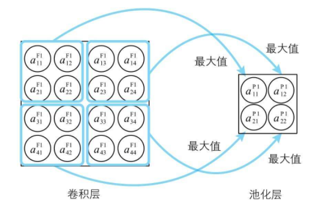

整体过程如下

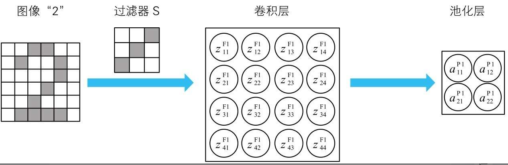

## 5.2 卷积神经网络的变量关系式

### 符号含义汇总表

| 位置     | 符号            | 含义                                                     |
| -------- | --------------- | -------------------------------------------------------- |
| 输入层   | $x_{ij}$        | i行j列的输入，和输出相同                                 |
| 过滤器   | $w^{Fk}_{ij}$   | 第k个特征映射的过滤器，i行j列的值                        |
| 卷积层   | $z^{Fk}_{ij}$   | 卷积层第k个子层，i行j列的加权输入                        |
|          | $b^{Fk}$        | 卷积层第k个子层，i行j列的偏置                            |
|          | $a^{Fk}_{ij}$   | 卷积层第k个子层，i行j列的输出                            |
| 池化层   | $z^{Pk}_{ij}$   | 池化层第k个子层，i行j列的输入                            |
|          | $a^{Pk}_{ij}$   | 池化层第k个子层，i行j列的输出                            |
| 输出层   | $w_{k-ij}^{On}$ | 从池化层第k个子层的i行j列 指向 输出层的第n个神经元的权重 |
|          | $z_n^o$         | 输出层第n个神经元的加权输入                              |
|          | $b_n^o$         | 输出层第n个神经元的偏置                                  |
|          | $a_n^o$         | 输出层第n个神经元的输出                                  |
| 学习数据 | $t_n$           |                                                          |

### 输入层

以下关系式成立（a的上标I为Input的首字母）
$$
a_{ij}^1 = x_{ij}
$$

### 过滤器和卷积层

3种过滤器，F是filter。过滤器也成为核(kernel)

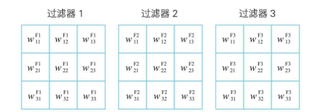

将输入层从左上角开始的3×3区域与过滤器1的对应分量相乘，得到下面的卷积值$c_{11}^{F1}$（c为convolution的首字母）

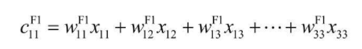

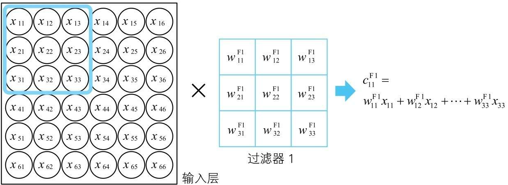

依次滑动过滤器，用同样的方式计算求得卷积值$c_{12}^{F1},c_{13}^{F1}...$。这样一来，我们就得到了使用过滤器1的卷积的结果

将过滤器输出+偏置 -> 卷积层输入 $Z^{Fk}_{ij}$

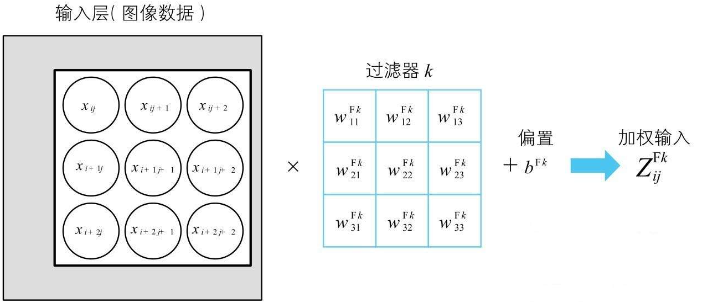

激励函数为a(z)，卷积层的神经元输出$a^{Fk}_{ij}=a(z^{Fk}_{ij})$。卷积层所有神经元表示如下

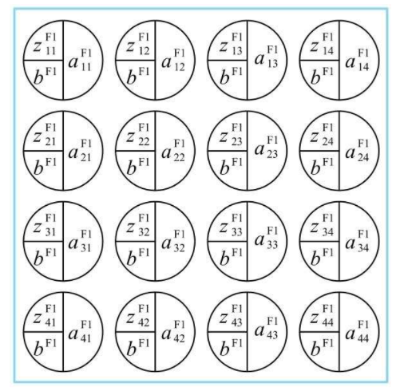

### 池化层

把2x2个神经单元压缩为1个，就形成了池化层

取2x2里面的最大值，就叫做最大池化法

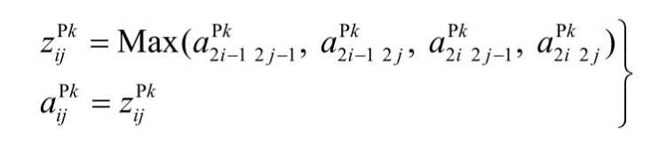

### 输出层{#out_layer}

输入

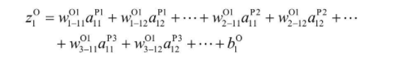

输出

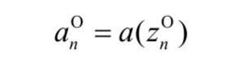

### 代价函数$C_\tau$​{#cost}

考虑3个输出的神经网络，设正解是$t_1,t_2,t_3$
$$
C = \frac{1}{2}\{(t_1 - a^o_1)^2+(t_2 - a^o_2)^2+(t_3 - a^o_3)^2\} \\
全体学习数据的总和就是C_\tau
C_\tau = sum^n_{i=1}Ci
$$

### 用$\delta^l_i$表示***==输出层==***的梯度分量

以池化层第2个子层，2行1列的神经元 -> 输出层1的偏导。如下图所示

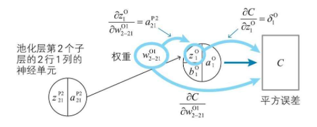
$$
\begin{aligned}
& \frac{\partial C}{\partial{w^{O1}_{2-21}}}=\frac{\partial C}{\partial{z^{O}_{1}}}\frac{\partial{z^{O}_{1}}}{\partial{w^{O1}_{2-21}}} = \delta_1^O a_{21}^{{P2}}\\
& \frac{\partial C}{\partial{b^{O}_{1}}} = \frac{\partial C}{\partial{z^{O}_{1}}}\frac{\partial{z^{O}_{1}}}{\partial{b^{O1}_{1}}} = \delta_1^O\\
\end{aligned}
$$
一般化如下式

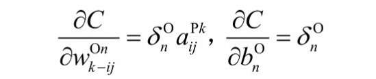

### 用$\delta^l_i$表示***==卷积层==***的梯度分量

卷积层的输出如下, 每一个输出等于图像移动出来该kernel的叉积：

每个输出对权重求偏导

代价函数对卷积层某一个权重求导，可以看成是对每个卷积层输出求全导，然后每个输出去对某个权重求偏导

代价函数对输出的偏导，就是误差$\delta_{ij}^{F1}$。所以上式可以改写成如下

整个过程的关系图如下

一般式如下

### 计算==输出层==的$\delta$

因为C表达式[如上](#cost)，所以对输出求偏导结果如下

综合上述2式，可得结果

### 卷积层$\delta$ 的反向递推公式

以第一层卷积层的1行1列$\delta$为例

关系图如下

提取公因式后如下

根据[如上公式](#out_layer)，输出层的输入z对pool层的输入a的偏导如下

因为池化层用的是最大池化法

所以

再把$\delta$ 代入

也就是说，通过后级的误差，推出前级的误差。这就是***误差反向传播法***

 
