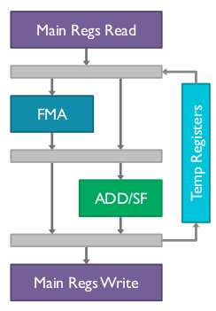



# 1 总体软件框架

# 2 GPU驱动内容

## 2.1 硬件架构

### 整体架构

下图就是Bifrost架构，Shader Core就相当于NVIDIA的SM，与NVIDIA不同的是，Mali的核心是可配置的，生产商可以根据需求自行设计自己的核数。同样的，各个core共享L2 cache，通过一个类似总线的GPU Fabric相连。

### Shader Core架构

对于每个Shader Core的架构如下。其中Execution Engine（以下简写为EE）就类似NVIDIA的SP，但是不同的是，每个核中的EE数量很少。 

主要单元有：

1.  Load/store unit 用于处理所有的内存的读写（除了纹理内存），包括16KB L1 data cache. 
2.  Varying unit 这是一个专门为运算单元加速的单元。 
3.  Texture unit 这个单元是用来访问纹理内存的。 
4.  ZS & blend unit 适用于某些特定的OpenGL ES的操作。 

### Execution Engine

下图就是主要的架构，每个计算单元能够承载4个线程（在G76中可以承载8个线程）操作，也就是说对于mali GPU的warp大小是变化的，这warp对于内存还有什么调度都是相同的。


