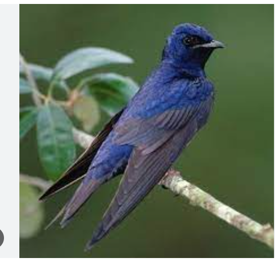
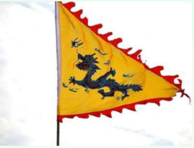
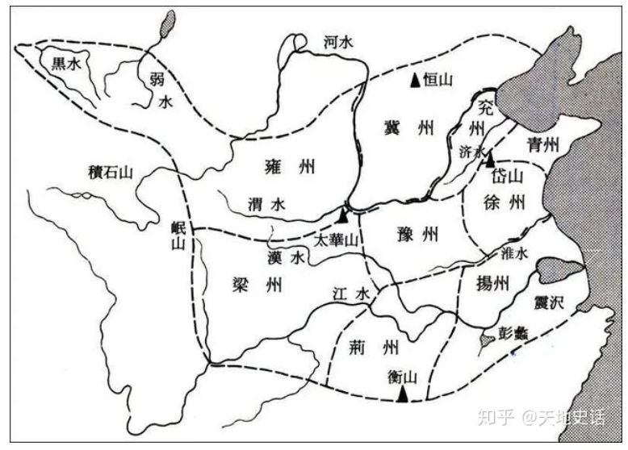



# 声律启蒙

一东：“东”指“东韵”，是宋金时期的“平水韵”（也叫“诗韵”）中的一个韵部。“东”叫韵目，即这个韵部的代表字。东韵中包含有许多字，它们的共同点便是韵母相同（当然是指隋唐五代两宋时期的读音），像下面的三段文字中，每个句号之前的那个字，即风、空、虫、弓、东、宫、红、翁、同、童、穷、铜、通、融、虹等 15字，尽管在现代汉语中的韵母并不完全相同，但都同属于东韵，如果是作格律诗，这些字就可以互相押韵。“一”，是指东韵在平水韵中的次序。平水韵按照平、上、去、人四个声调分为 106个韵部，其中因为平声的字较多，故分为上下两个部分，东韵是上平声中的第一个韵部。后面的“二冬”、“三江”等情况也相同

唐代以前，汉人对“东”、“冬”读音有区别：东读如dūng，而冬读如dōng

[**平水韵**]https://sou-yun.cn/qr.aspx

## 平仄格式

《声律启蒙》每韵3段，每段平仄基本格式为：

- **平对仄，仄对平。仄仄对平平。
  平平对仄仄，仄仄对平平。**
- **平仄仄，仄平平。仄仄对平平。
  平平平仄仄，仄仄仄平平。**
- **仄仄平平平仄仄，
  平平仄仄仄平平。**
- **仄仄平平，仄仄平平平仄仄；
  平平仄仄，平平仄仄仄平平。**

## 一东 - 云对雨

### 正文

云对雨，雪对风，

晚照对晴空。

来鸿对去燕，宿鸟对鸣虫。

三尺剑，六钧弓，岭北对江东。

人间清暑殿，天上广寒宫。

两岸晓烟杨柳绿，一园春雨杏花红。

两鬓风霜，途次早行之客；一蓑烟雨，溪边晚钓之翁

### 解释

#### 来鸿对去燕

　　“鸿”指的往往是大雁，而“燕”指的往往是梁间筑巢的小燕子，它们有着共同的特点就是寒暑交替的时候，会跟着气候进行迁徙，属于候鸟，但又有所不同。

　　鸿雁在野，一般的时候会象征着高远的志向和憧憬，所谓”鸿鹄之志“者，便是拥有着远大的抱负。

　　梁燕于宅，常常代表着安于现状，不思进取的思想状态，所谓”燕雀安知鸿鹄之志哉“。而”来“与”去“本身又是一对反意词，因此，可以相对。

#### 宿鸟对鸣虫

​		宿鸟，即是倦鸟。夕阳西下的时候，也正是倦鸟归巢的时候。所以，宿鸟也往往被指代疲于奔命而期望归宿的人。

　　鸣虫，便是指蟋蟀、蝉、蜂等等可以发出声音的草虫。它们往往于谷雨时分开始鸣叫，然后历经一个炎热的夏天，在霜降之时蛰伏或者死亡。而“鸣虫”也往往代表怀着忧虑心境享受短暂韶华的人们

#### 三尺剑，六钧弓

三尺剑，古剑长凡三尺，故称“三尺剑”，并不是随随便便取出来的名字，诗人常以“三尺剑”来表达自己的雄心壮志与报国豪情。《史记·高祖本纪》中有“吾以布衣提三尺剑取天下，此非天命乎？”这便是出处

“六钧弓”指强弓。“钧”在古代是重量单位，一钧相当于30斤，六钧即是180斤，就算古人神力，这也依然算是奇强之弓了，常引申为对武力武功的夸耀

#### 岭北对江东

岭北，泛指山的北面，泛指大庾、始安、临货、桂阳、揭阳五岭以北。尤其以大庾岭为首，此岭在今江西大庾，岭上多生梅花，又名梅岭。古人认为此岭是南北的分界线，因有十月北雁南归至此，不再过岭的传说

江东，泛指江河的东面。因长江在安徽境内向东北方向斜流，所以，在此特指从芜湖、南京到入海的长江以南地区，史称“江东”

#### 人间清暑殿，天上广寒**宫**。

《清暑殿》是宋朝著名文学家马之纯的代表诗作：“见说当持百尺梁，四围修竹翠云长。正当盛暑都无热，不有薰风亦自凉。那与人间同日月，直疑天上两阴阳。有时更取龙皮浸，凛凛如飞六月霜。”而真正的清暑殿，是东晋孝武帝司马曜建在南京鸡鸣山南的一座宫殿。“殿前重楼复道，通华林园，爽垲奇丽，天下无比。虽暑月，常有清风，故以为名。”

## 二冬 - 明对暗

### 正文

明对暗，淡对浓，			 # 正反意字对

上智对中庸。

镜奁对衣笥，野杵对村舂。

花灼烁，草蒙茸，			# 同旁对
九夏对三冬。

台高名戏马，斋小号蟠龙。

手擘蟹螯从毕卓，

身披鹤氅自王恭。

五老峰高，秀插云霄如玉笔；

三姑石大，响传风雨若金镛。　

### 韵脚

浓 庸 舂 茸 冬 龙 恭 镛 

### 解释

**镜奁（lián）** -  

**衣笥（sì）** -  

**野杵** - 村民用木棒舂米 

**村舂** - 

**九夏**　因夏季有三个月九十天，故谓“九夏”

**三冬**　因冬季有三个月，故谓“三冬”；或指冬季的第三个月，即十二月

**台高名戏马**　公元前206年，项羽灭秦后，自立为西楚霸王，定都彭城（今江苏徐州），于城南里许的南山上，构筑崇台，阅兵以观戏马，故名戏马台。虽然项羽后来在楚汉相争中一败涂地，但戏马台却成为西楚霸业千古雄风的遗迹

**斋小号蟠龙**　《晋书·刘毅传》记载：东晋权臣桓温修了一个精致的斋舍，还在墙上画上了龙，号称“蟠龙斋”。在古代，龙一直是中华民族的一个图腾的象征，也被各代的帝王作为自己的代表。古代的皇帝们常常称自己为真龙天子。桓温独揽朝政十余年。后来桓温的儿子桓玄叛乱，起兵造反，，有意夺取帝位。但最后以失败告终

**手擘蟹螯从毕卓**　毕卓，东晋官员。晋元帝太兴末年为吏部郎，因饮酒而废职。世说新语中记载，毕卓一生，酷爱喝酒，曾对人说，一手持蟹螯，一手持酒杯。拍浮酒池中，便足了一生。擘（四声），有分开，剥开的意思，蟹螯就是螃蟹的两个大前足。这句便是说他一生的愿望便是，一手拿着螃蟹腿，一手拿着酒杯，浮在酒池中，这一生便就足够了

**身披鹤氅自王恭**　这句说的是东晋大臣王恭，**世说新语**中记载。

王恭少年即有美誉，身形俊美，时人称赏他“濯濯（卓）如春月柳”。是形容他像春光下的杨柳般光亮。王恭曾经有一次乘高车、披鹤氅裘涉雪而行。鹤氅，便是用仙鹤羽毛织成的外套，在白茫茫的雪地中行走。被人看见，羡慕不已，感叹说：“此真神仙中人也！”

**五老峰高，秀插云霄如玉笔**　形容险峻高耸的五老峰，像是插入云霄中的碧绿玉笔。

五老峰，庐山最高的山峰，在庐山东南顾名思义，就是像五个老者并肩而立的山峰。唐代诗仙李白曾经结庐读书，并写诗赞美的庐山。。

李白《望庐山五老峰》诗云：

庐山东南五老峰，青天削出金芙蓉。

九江秀色可揽结，吾将此地巢云松。

**三姑石大，响传风雨若金镛**　 

武夷山换骨岩北面有石三块立于岩石顶上，即人们所说的三姑石。

相传宋治平年间，崇安大旱，田土龟裂，禾苗枯焦。有一天，武夷山农人在换骨岩下灌田，忽见三位道姑打扮的女子沿山径走来。她们见农人们灌田辛苦，便招农人上前，授以小葫芦和秘诀后便飘然而去。农人如法施行，顷刻间，乌云密布，大雨如注，救活了枯焦的禾苗。后来乡人为纪念这三位仙姑，便将换岩骨巅上的这三块巨石唤作为"三姑石"。

金镛，是一种金属做的大钟。因为三姑石形状像三座大钟,于是形容它像大钟一样在风雨中屹立千年。

## 二冬 - 仁对义

### 正文

仁对义，让对恭，

禹舜对羲农。

雪花对云叶，芍药对芙蓉。

陈后主，汉中宗，

绣虎对雕龙。

柳塘风淡淡，花圃月浓浓。

春日正宜朝看蝶，

秋风那更夜闻蛩。

战士邀功，必借干戈成勇武；

逸民适志，须凭诗酒养疏慵。

### 韵脚

恭 农 蓉 宗 龙 浓 蛩 慵

### 解释

#### **仁对义** 

三字经中说过，曰仁义，礼志信，此五常不容紊

#### **让对恭** 

对晚辈便是比自己小的人，有所礼让。恭说的是对长辈或师长，要有恭敬懂礼

#### **禹舜羲农**　

即上古时期的“三皇五帝”中的人

大禹、虞舜、伏羲氏和神农氏。三皇五帝率领民众开创了中华上古文明，是历史上公推的英明君主的代表。

虞舜德行高尚，通过了尧帝的三年考核，受尧禅让继位，他安排大禹治水，在大禹治水成功后，又禅让于大禹。

伏羲是古代传说中中华民族始祖，是中国古籍中记载的最早的王，是中国医药鼻祖之一。他根据天地万物的变化，发明创造了八卦，他又结绳为网，用来捕鸟打猎，并教会了人们渔猎的方法，还发明了瑟，创作了曲子……

神农氏是汉族民间传说中的农业和医药以及茶叶的发明者，传说他尝遍百草，教人医疗与农耕。

三字经中便有提及。自羲农 至黄帝

号三皇 居上世 唐有虞 号二帝。相揖逊 称盛世。

前面的仁义、恭让等美德，就是形容四位圣明的美好品德，也是对四位人物的共同评价

#### **芍药**

 

多年生草本植物，花大而美，供观赏。一名“可离”，故常作离别赠花

#### **芙蓉**　

也称“木莲”，其花八九月始开，耐寒不落，故亦名“拒霜”

唐诗中，芍药和芙蓉常有聚首，一来词性相对，二来，还有上一讲讲到的“同旁对”因素：

芍药和芙蓉两个字四个字，全部也都是草字头，这是代表的花名，也代表的是植物名

#### **陈后主**　

指南朝陈国末代皇帝陈叔宝， 三字经中提的，宋齐继，梁陈承 ，为南朝，都金陵————陈国的末代君主，

他生活侈靡，是个有名的昏君，在位时大建宫殿，生活奢侈，不理朝政，不顾国难。后被陈国被隋军所灭，陈国灭亡。

唐代著名诗人杜牧，便有诗在以此为讽：

烟笼寒水月笼沙，夜泊秦淮近酒家。

商女不知亡国恨，隔江犹唱后庭花。

#### **汉中宗**　

指西汉宣帝刘询。他年少不信，流落民间，了解了不少民间疾苦。刘询后来当了皇帝后，躬行节俭，励精图治，汉朝出现了“中兴盛世”局面

#### **绣虎**　

比喻才思敏捷的人 说的是三国曹植才思横溢，号为“绣虎”（“绣”是形容文章文采华美，“虎”是形容诗文风骨遒劲）。

据《世说新语·文学》记载：曹植的哥哥曹丕做了皇帝后，要想迫害曹植，于是命令曹植在走七步路的短时间内做一首诗，做不出来就杀头。结果曹植应声咏出这首以箕豆相煎为比喻，控诉骨肉兄弟相迫害的七步诗

#### **雕龙**　

雕镂龙文 《**文心雕龙**》，又称作《**文心**》，是[中国](https://zh.wikipedia.org/wiki/中国)第一部系统[文艺理论](https://zh.wikipedia.org/wiki/文学理论)巨著，是中国有史以来较为精密的[批评](https://zh.wikipedia.org/wiki/文学批评)著作之一，作者为[刘勰](https://zh.wikipedia.org/wiki/刘勰)，完书于中国[南齐](https://zh.wikipedia.org/wiki/南齊)时期。《文心雕龙》是刘勰在入[定林寺](https://zh.wikipedia.org/wiki/钟山定林寺)后期所写，是“齿在逾立”之年的作品，全书重点两个：一个是反对不切实用的浮靡文风；一个是主张实用的“攡文必在纬军国”之落实文风。刘勰把全部书都当成文学书来看，因此本书立论极为广泛。

#### **柳塘风淡淡，花圃月浓浓**　

这是北宋诗人晏殊《寓意》中“梨花院落溶溶月，柳絮池塘淡淡风”诗句的化用。

#### **蛩** 

虫

#### **干戈**

指代的两种兵器，指武器 

## 三江 - 楼对阁

### 正文

楼对阁，户对窗。

巨海对长江。

蓉裳对蕙帐，玉斝对银釭。

青布幔，碧油幢，

宝剑对金缸。

忠心安社稷，利口覆家邦。

世祖中兴延马武，桀王失道杀龙逄。

秋雨潇潇，漫烂黄花都满径；

春风袅袅，扶疏绿竹正盈窗。

### 韵脚

窗 江 釭 幢 缸 邦 逄 窗

### 解释

#### 楼对阁

楼是古建筑中两层以上的房屋，亦称重屋。

阁是指下部架空、底层高悬的建筑

​                                      						天一阁

#### 户对窗

说文解字中，对户这个字的解释是，一单曰户两扇曰门。我们看这个字的甲骨文的造型，就像半扇大门。古代的大门都是往两边开，所以两边打开的，我们叫门，而普通的像我们现在的住房一样，只开单边的，叫做是户。

大门对应的就是房子的窗户。我们现在来看窗户的窗字，分成上下两半，下面的这个字其实是我们说的烟囱的囱字，因为在古代窗这个字本意是天窗，也是透气的地方。后来在上面加了个宝盖头，再加上两撇，看起来是不是像房梁上垂下来两块帘子，罩住了墙上开的洞。变成了窗。

#### 蓉裳蕙帐

蓉裳 蓉便是芙蓉花。[战国]屈原便在《离骚》中有句“制芰荷以为衣兮，集芙蓉以为裳”。

裳（音cháng）古时下身穿着的裙装，男女都有穿。长这个字在现在我们经常把它念做shang，衣裳。所以看裳这个字，它的部首便是衣服的衣。蓉裳就是，用芙蓉花染色做成的裙装。古代的时候没有那么多的化学染料衣服，都是用植物花朵来染色的。

蕙帐 则是指用香蕙草薰的帐子。

香蕙 

古代一种香草，古代习俗烧蕙草以薰香，除灾邪之用。现在的端午节，南方还保有了在门上插艾草和蒲草的习俗。孩子们一定见过夏天挂着的防蚊虫的香包，也叫香囊，就是从古代就开始的一种习俗，用带有香味的中草药来驱赶蚊虫害虫，不生病保平安的一种吉祥物

#### 玉斝银釭

玉斝（音jiǎ）盛行于商周时代的三足圆口酒器

银釭（音gāng）银质的古代灯具

#### 青布幔

青布搭成的帐篷，又名“青庐”，是举行婚礼的地方。东汉至唐有此风俗。北方一带，拜堂举行婚礼，有在“青庐”中举行

#### 碧油幢 （zhuang）

碧油幢 挂有绿色油布帷幕的官车。唐代大臣出行的用车。

幢这个字，我们现在的意思是一幢房子。但是这个字在古时作为仪仗用的一种旗帜。念chuang ，作为车顶的布盖时候念zhuang。

油，这里不是我们炒菜的油，是用桐油加工过的布，可以防水，可以用在马车顶上，或是船上做遮雨用的。

#### 金缸

釭是金字旁，是金属制成的东西有关。则可解为金属铸造的箭镞。是射箭的箭头

#### 忠心安社稷

来自《孟子·尽心上》这本书中“有安社稷（泛指国家）臣者，以安社稷为悦（志趣）也”语句。

有尽心能安定国家的臣子，把安定国家当作的志向。

社稷，社为土神，稷为谷神。

社的右边是土，代表和土地有关。稷，左边是一个禾苗的禾。就是三字经中说的，稻粱菽，麦黍稷。此六谷，人所食。是一种谷物植物。人是一定要吃饭的，所以古代人最看中的就是土地是不是好，粮食是不是够吃。皇帝们也想要百姓种出够吃的粮食，每个人都有饭吃，才能保证国家稳定。所以君主为了祈求国事太平，五谷丰登，每年都要到郊外祭祀的土地和五谷神。社稷也就成了国家的象征。

#### 利口覆家邦

上句我们说原文来自孟子的书，孟子也是古代一个了不起的思想家，文学家。三字经第一句说的，人之初，性本善，就是孟子提出来的。后世把他称作亚圣，就是排名第二的圣人，那第一是谁呢？  当然就是之前说到的孔子了，利口覆家邦这句便是来自孔子的《论语·阳货》中说过的一句话“子（孔子）曰：‘恶利口之覆邦家者’”

利口在这句里头，指代能言善辩的人，以华而不实的巧言，只是用于取悦国君，会导致国家的覆灭。

家邦是指国家。

#### 世祖中兴延马武

汉朝的时候，王莽新朝末年，马武参加了绿林军起义，后投奔刘秀。这段便是三字经中说的，高祖兴 汉业建。至孝平 王莽篡，光武兴，为东汉。四百年，终于献。

光武帝刘秀建立东汉政权，年号世祖，任命马武为将军，为汉朝中兴屡建战功。

这里的“延”是引进、招揽的意思。

这句说，刘秀在大将军马武的帮助下，建立的东汉，让自己的国家兴盛繁荣

#### 桀王失道杀龙逄

桀王，夏桀，是夏朝最后一位君主，是历史上与商纣王齐名的大坏蛋。

他荒淫无道，不理朝政。坏事做尽，百姓们对这样的皇帝恨之入骨，夏桀自己还洋洋得意，

大臣关龙逄劝谏桀王说：“如今君上用钱挥霍无度，杀人没完没了，民心已经丧失，天命难以保佑。”

桀王却说：“我有天下，犹如天上有太阳，除非太阳亡了，我才会亡。”把自己比喻做太阳，除非太阳没了，自己才会完蛋。不但不听劝告，还杀死关龙逄。最后丧失道义民心的桀王最终被商汤推翻，夏朝也灭亡了

#### 潇潇

秋雨萧萧的潇是三点水，形容的是雨天时细细的雨声

#### 春风袅袅，扶疏绿竹正盈窗

扶疏：枝叶茂盛，高低疏密有致

袅字，是柔弱，缭绕的意思

## 三江 - 旌对旆

### 正文

旌(jīng)对旆(pèi)，盖对幢(chuáng)。

故国对他邦。

千山对万水，九泽对三江。

山岌(jí)岌，水淙(cóng)淙。鼓振对钟撞。

清风生酒舍，白月照书窗。

阵上倒戈辛纣战，道旁系颈子婴降。

夏日池塘，出没浴波鸥对对；春风帘幕，往来营垒燕双双。

### 韵脚

幢 邦 江 撞 窗 降 双

### 解释

#### **旌对旆**

旌和旆，都是旗帜上的装饰。**“旌”、“旆”二字完全相同的那个部分，就是“旗”的本字，甲骨文**就像在树杆上飞舞的飘带。旌”是旗的顶端装饰的五彩羽毛或是动物的尾巴，“旆”是旗帜尾部，形状像燕尾的垂旒(liú)。后来就用旌旆代指旗帜，诗文中的旌旆，多指战旗，成语“旌旆逶迤”，描绘的就是旌旗招展，绵延不绝的景象，非常有气势

#### **盖对幢**

盖在这里指的是车上的伞盖，有一个成语“倾盖如故”，就是说两个人在路上初相遇，彼此的伞盖倾斜过来靠在一起，一下子就聊得非常投机，就像老朋友一样。

幢”是车上的帷幕，“幢”字左边有个“巾”字旁，所以它的原意是跟布幔有关的

#### **九泽对三江**

九泽指大陆泽、[雷夏泽](https://baike.baidu.com/item/雷夏泽/6409069?fromModule=lemma_inlink)（雷泽）、[大野泽](https://baike.baidu.com/item/大野泽/2341418?fromModule=lemma_inlink)、孟潴泽（[孟渚泽](https://baike.baidu.com/item/孟渚泽/10409317?fromModule=lemma_inlink)）、[彭蠡泽](https://baike.baidu.com/item/彭蠡泽/5035831?fromModule=lemma_inlink)（鄱阳湖）、云梦泽（洞庭湖）、[菏泽](https://baike.baidu.com/item/菏泽/19703158?fromModule=lemma_inlink)（渮泽）、震泽（太湖）、荥泽

最早提出“三江”名称的应是在战国时期（公元前475年—前221年）的《[尚书](https://baike.baidu.com/item/尚书/6297?fromModule=lemma_inlink)》著作。《尚书》中有一篇[《禹贡》](https://baike.baidu.com/item/《禹贡》/9504477?fromModule=lemma_inlink)，记述了我国九州（即全国分为冀、兖、青、徐、扬、荆、豫、梁、雍九州）的方域、地质、物产、[贡赋](https://baike.baidu.com/item/贡赋/2121653?fromModule=lemma_inlink)、交通、政治、民族分布等，是我国最早的一篇[人文地理](https://baike.baidu.com/item/人文地理/333213?fromModule=lemma_inlink)的重要典籍。该书对[扬州](https://baike.baidu.com/item/扬州/8475769?fromModule=lemma_inlink)（九州之一，泛指[淮河](https://baike.baidu.com/item/淮河/230880?fromModule=lemma_inlink)以南，南海以北的广大地区，）地理的介绍为“三江即入，震泽（即[太湖](https://baike.baidu.com/item/太湖/112298?fromModule=lemma_inlink)）底定。”这里所指的“三江”，是指太湖附近的松江、[钱塘江](https://baike.baidu.com/item/钱塘江/389131?fromModule=lemma_inlink)、[浦阳江](https://baike.baidu.com/item/浦阳江/1800077?fromModule=lemma_inlink)

#### **山岌岌**

这个“岌”字看字形就很像悬崖峭壁，非常险峻的样子

#### 鼓振

古时作战，“闻鼓声而进，闻金声而退。”（《荀子·议兵》）战鼓敲响，就是进攻的信号，金钲响起，就要有秩序地撤退。这个金“钲”，样子跟古代的编钟很像

#### 钟撞

古代编钟，一种大型打击乐器

#### 阵上倒戈辛纣战

周武王伐纣，说的是公元前1046年的牧野之战，在这场战斗中，很多纣王的军队临阵倒戈，牧野之战，纣王彻底战败，在鹿台自焚殉国

商朝是我国历史上有文字记载的第一个朝代，辛纣是商朝最后一位帝王，纣是他的谥号。传说当中这位纣王非常暴虐，荒诞，是中国历史上最有名的暴君。古时候，一说起圣明的君主，就是尧舜禹，说起昏君暴君，首当其冲的就是这位纣王。

不过，**历史是由胜利者书写的，历史上的纣王到底是什么样子，我们已经很难知道了，纣王留下了千古骂名，但史书上也记载，他长得高大英俊，孔武有力，很有才干。**从有限的史料来看，武王伐纣也有好多疑点，**最可疑的是，周武王对商纣下的战书里面，并没有后来所传说的辛纣滥杀无辜，刑罚残忍的残暴事迹，主要的控诉有三点，一是商纣让他的王后妲己干预朝政，二是说他不好好祭祀祖先，三是说他重用奴隶，不任用自己的兄弟。**如果辛纣真是传说中那么暴虐，为何不在战书中声讨他呢，那不是更有说服力么？

从今天的观点看，这三点恰恰说明了纣王是个思想非常开明的君主，他允许女子参与政治事务，重人事，轻祭祀，不再杀死战败的俘虏，而是让他们从事生产，还重用有才干的奴隶，让他们做大官。

事实上，商朝文明程度非常高，也很富裕，今天，我们称从事贸易活动的人为商人，很有可能就是因为商朝人最早开始买卖商品，并且善于经营。周国最初只是西边文明程度较低，又比较穷苦的小国家，周灭商，可以说是落后文明取代先进文明。**商周之交，在我国历史上意义非凡，有机会大家以后可以好好研究一下。**

#### 道旁系颈子婴降

秦朝第三代帝王子婴，被汉高祖刘邦攻下洛阳后，他素车白马，在脖子上系上丝带，表示自己投降后会自杀，带上自己的黄帝印玺，符节等等献给刘邦。秦王子婴留下的史料不多，但形象不差，史书上的他有才干，有魄力，也有仁德之名，但他继位的时候，秦朝已经分崩离析，他没有称帝，只是称王，也终究无法阻止秦朝的灭亡

## 三江 - 铢对两

### 正文

铢对两，只对双， 

华岳对湘江。

车对禁鼓，宿火对寒釭。青琐闼，碧纱窗，

汉社对周邦。

笙箫鸣细细，钟鼓响摐摐。

主簿栖鸾名有览，

治中展骥姓惟庞。

苏武牧羊，雪屡餐于北海；庄周活鲋，水必决于西江

### 韵脚

双 江 釭 窗 邦 摐 庞 江

### 解释

#### 铢对两

铢和两都是古代重量单位。一冬中的六钧弓的钧，也是一个重量单位，《汉书·律历志》载：“二十四铢为两。十六两为斤。三十斤为钧。”铢两比喻极其轻微的分量。“权者，铢、两、斤、钧、石也”

成语里有“铢两相称”、“铢两悉称”两词，都是形容两者轻重相当，近义于半斤八两的意思。

[锱铢必较](https://baike.baidu.com/item/锱铢必较/557891) 锱铢，指很少的钱或很小的事情。 [1]

旧制锱为一两的四分之一，铢为一两的二十四分之一。比喻极其微小的数量

#### 华岳对湘江

华岳指的是西岳华山，在陕西华阴县境。素以高险著称。三字经里曾经说过，曰岱华，嵩恒衡。此五岳，山之名

湘江，长江流域洞庭湖水系，是湖南省最大河流

#### 朝车对禁鼓

朝车，指的是古代君臣，在举行典礼和宴席时，出入宫廷的用车。古代的皇帝每天和大臣们在宫殿里开会，商讨国家大事，那叫做上朝，那么去议事的大殿里坐的车便是朝车。

禁鼓，这个是皇宫城墙的城楼上的报时的大鼓，这里和二冬里头的暮鼓晨钟是类似的意思。

#### 宿火寒缸

宿火，宿有过夜的意思，或指的是寺庙里的香火，那就是指寺庙里一天到晚都点着的香火。

寒釭，釭是一种灯具，寒釭是指在寒冷夜里的灯光

#### 青锁闼，碧纱窗

青琐闼，是刻有青色连环花纹的宫门，在这里指宫廷华丽的建筑。闼是小门

碧纱窗，是装着绿色纱布的窗子，大门对窗户，青琐对碧纱，颜色相近，事物也相对

#### 汉社对周邦

汉社在这里指的是汉朝，社稷，就是代表国家的意思，就是汉朝的国家。

周邦则指的是周朝，就是夏商周的周朝，邦，是国家

#### 笙箫鸣细细

笙萧都是竹字头，这是两种竹子的乐器，都是吹奏的管乐器。细细是指吹乐器的声音，是个象声词。这句说的是笙箫吹奏的声音轻柔悠远

#### 响摐摐

响摐摐 钟鼓声洪亮。摐摐(chuāng)， 是形容撞击钟鼓声音的一个相声字

#### 主簿栖鸾名有览

这讲的是东汉名士仇览的故事。

后汉书中记载，东汉的仇览，曾经任蒲县的庭长，能够用道德教化民众。

东汉考城县令王涣，崇尚以严猛治政。听到仇览用道德感化人，便委任仇览当主簿，并对他说，你注重感化他人，莫非缺少雄鹰一样凶猛的心智吧，仇览却说，我以为雄鹰不如鸾鸟和凤凰。”王涣说：“我这小县衙不是你这大贤久留之地。”遂赠仇览路费，推荐他到京城太学发展。仇览后成为著名的贤人，被誉为方正之士。

主簿，汉代中央及郡县，官署中主管文书，办理事务的官员。

#### 治中展骥姓惟庞

这里讲的是三国时期的谋士庞统的故事，谋士，就是帮君王出主意，给意见出谋划策的人。当时的庞统，刚刚为刘备工作的时候，因为他其貌不扬，长相一般，刘备并没有重视他，只是任命庞统当了一个县的县令，是一个小官，庞统到任后就不管是什么事也不干，不久，别被罢官免职了。后来，东吴的大臣鲁肃，知道后，便写信给刘备说，庞统不只是个县令之才，得让他当州官，才能展现及骥足之才，骥足便是千里马的意思。这里说的意思是，如果只给千里马去拉车，那边是埋没了他的才能，应该让它去奔跑才能看出优劣。于是刘备听了鲁肃的话中重用了庞统，而庞统，也辅佐刘备，取得了西川，成为三国时期的一代霸主。治中，是一种古代的官职，相当于州长

展骥就是展示千里马的才能，比喻有才干

#### 苏武牧羊，雪屡餐于北海 

这讲的是汉朝名臣苏武的故事。

这里又说到了一个苏武牧羊的典故。

说的是汉朝的汉武帝时期，常年和塞外的匈奴，也就是当时的北方地区的少数民族部落打仗。

于是皇帝派出苏武，代表汉朝出使匈奴，想要义和，就是不要再打仗了。

可是没想到，苏武却被匈奴的国王的单于扣押了起来，单于用尽各种办法逼他投降，但最后都失败了。

于是匈奴把苏武放逐到北海，现在俄罗斯贝尔加湖的附近，这是北方的边界，非常的艰险困苦，寒冷无比，是一个没有人烟的地方。让他在那里去放牧羊群，并且说要等公羊生出小羊之后才能回去，这就是变相的逼他投降。

可是苏武哪怕饿了要吃草根，渴了喝雪水，也没有意思要投降的意思，一直不肯屈服。他拄着汉廷的符节牧羊，睡觉、起来都拿着，以致系在节上的牦牛尾毛全部脱尽。

苏武历尽艰辛，留居匈奴十九年持节不屈。直到19年后，直到汉昭帝即位，新的匈奴也向汉朝开始求和，这时候才把苏武放了回来了。

苏武去世后，汉宣帝将其列为麒麟阁十一功臣之一，彰显其节操。

#### 庄周活鲋，水必决于西江

这讲的是庄子编的一则寓言。也是成语“涸辙之鲋”的由来。

战国时期，宋国庄周家贫，常常是吃了上顿没有下顿。

有一次，庄周家里断粮了，无奈之下，他到监河侯那里去借粮米。监河侯听了，故作大方地说：“好啊，没有问题！不过，等我收了租地的租钱，才能借给你三百斤粮食，可以吗？”

庄周听了很生气，他也不直接戳穿对方的谎话，就讲了一个故事：昨天我在路上走，在路上听见救命声。我四处张望，原来是车辙里的一条鲋鱼。鲋鱼见了我，忙大声喊道：“老先生，救我！”我问它：“鲋鱼啊，你怎么啦？”它说：“我从东海被冲到这里。您能给我一桶水，救救我吗？”我慷慨地点头答应道：“没问题，我这就去南方劝说吴王和越王，引来西江的水救你，可以吗？那里是水乡泽国，水多得不得了。”

鲋鱼听了，非常生气地说：“您这是什么话！现在只要有一桶水就可以救活我，而您却要到南方之后，放西江的水来救我。到那时，您恐怕只有到干鱼店里来找我了！”

庄周讲完这个故事，就头也不回地走了

这两个典故，苏武牧羊，匈奴要等的公羊生下小羊。庄子要救鱼，必须等引来西江的水。这里引用这两个典故，代表的都是毫无诚意的表现，放在一起也是种巧妙的对仗

## 四支1 - 茶对酒

### 正文

茶对酒，赋对诗，

燕子对莺儿。

栽花对种竹，落絮对游丝。

四目颉，一足夔，

鸲鹆对鹭鸶。

半池红菡萏，一架白荼蘼。

几阵秋风能应候，

一犁春雨甚知时。

智伯恩深，国士吞变形之炭；

羊公德大，邑人竖堕泪之碑。

### 韵脚

诗 儿 竹 丝 鸶 蘼 时

### 解释

#### 赋对诗

赋，是一种古代的文体，也是诗歌的一种表现手法。在二东第三段的韵文里，最后一句便是，逸民适志，须凭诗酒养疏慵，古代的文人大诗人们，经常是诗酒不分家的，茶，更是文人雅客的必备之品，放在一起，有好茶，存美酒，那还担心没有精妙的诗词歌赋吗？

#### 燕子对莺儿(ní)

燕子对莺儿(ní)。同样是春天的鸟儿，常作为诗人写春光美景的代表。儿，在这里发古音儿(ní)，为的是和韵词押韵。唐代，杜牧《江南春》中便有诗云：“千里莺啼绿映红，水村山郭酒旗风”

#### 落絮对游丝

落絮，对游丝，落絮是指的是柳絮，是柳树的种子，有白色的绒毛，随风飘散如丝絮。游丝，是蜘蛛或者其他类似吐丝昆虫的丝，飞扬在空中，被称作游丝。游丝　春夏两季常见。［南朝梁］沈约《会圃临春风》诗云：“游丝暖如烟，落花氛如雾。”

提到落絮，也让人联想到一则，关于柳絮的典故，三字经里也曾提过，蔡文姬，能辨琴，谢道韫，能咏吟。

《世说新语》里记载了一则咏雪的故事：

东晋太傅谢安曾在一个寒冷的雪天与家人聚会，跟子侄辈的人讲论诗文。时逢雪下得很大，谢安就此为题说：“白雪纷纷何所似（这纷纷扬扬的雪像什么呢）?”他哥哥的长子谢朗接口说：“撒盐空中差可拟（跟在空中盐撒差不多吧）。”他哥哥的女儿谢道韫则说：“未若柳絮因风起（不如比作风吹柳絮满天飞舞）。”太傅大笑着非常满意。谢道韫也因此名动一时，成为东晋著名女诗人，世称“咏絮才”。

#### 四目颉，一足夔

又是两个人物的对应，四目颉，是传说中，创造了中国文字的一个人。他是黄帝的使臣，叫仓颉。

《姓氏谱》：“苍颉，上古人，生而神圣，有四目。”

传说中他长着四只眼睛，四目灵光，他因为看到地上鸟兽的足迹，发明了文字，就是我们现在是最早的甲骨文，最早用符号来记录的事情，后来慢慢也变成了现在的文字。

一足夔，传说，夔是《山海经》对里头说到的一种神兽，形状和牛一样，但是只有一只脚。

另外在古书上记载说，舜帝的乐工，乐官名字叫夔，他正六律，和五声，而天下大服。说的就是，舜帝让他出任乐官，让他主持和音律有关的工作，制定了现在的音律基准，舜帝很高兴，就说，有夔这样的能人，一个也足以成事了，那后来的人便称之为夔一足，后来慢慢误传成了，乐师夔只有一条腿。

无论是创立文字的四目颉，还是调整音律的一足夔，都是曾在古时候有大才能做个大事的人物，放在这里，对仗合理，相得益彰。

#### 鸲鹆对鹭鸶

鸲鹆，便是八哥，是种会学人说话的鸟。

鹭鸶说的是白鹭，两只黄鹂鸣翠柳，一行白鹭上青天，这里提到的就是这种白鹭。一黑一白，一个，机灵聪明，一个优雅轻盈，又是另外一种相辅相成。

#### 半池红菡萏，一架白荼蘼

菡萏这两个字都是草字头，也是一种植物，指的是荷花。

荼蘼也是草字头，这是一种白色的小花，带香气。上句说的是粉红色的荷花在池中开放，映衬着白色的荼蘼小花满园香，一架白荼蘼。唐代诗人李商隐，在诗里《赠荷花》中曾提过。唯有绿荷红菡萏，舒卷开合任天真。

宋代的苏轼，也曾为荼蘼提过诗，荼蘼不争春，寂寞开最晚。韵文在这里便是在对应着初夏，荷花开满池，指的盛夏要到来了，春末荼蘼香未散，春天就快要过去了。

名花榜上，有两种花最为神秘，一种是琼花，另一种是荼蘼。荼蘼在宋代辉煌一时，位居花中“一品”。其风头之盛甚至盖过牡丹和兰花。宋以后，又突然沉寂下来。它最早在王淇的《春暮游小园》一诗中出现。

春暮游小园

王淇

一丛梅粉褪残妆，涂抹新红上海棠。

开到荼蘼花事了，丝丝天棘出莓墙。

这首诗大意是：梅花零落，像少女卸去妆一样时，海棠花开了，它就像少女刚刚涂抹了新红一样艳丽。不多久，待荼蘼开花以后，一春的花事已告终结，惟有丝丝天棘又长出于莓墙之上了

它是春天的最后一种花，凋谢后即表示花季结束，所以有完结的意思

荼蘼花的花语是“末路之美”，因为它是春天最后开花的植物，它开了也就意味着春天结束了，其他花的花期结束了，因而它又被认为是伤感之花。用在感情方面，常表示感情的终结

#### 几阵秋风能应候

应候便是顺应时令，该什么季节，便做什么季节的事情，春天适宜播种，秋天当然是收获的时候，几阵秋风能应候。知时，也是适应季节，和上句的，应候都是一个意思。

#### 一犁春雨甚知时

春雨来得正当时，也是春耕的好时机，一犁春雨始之时。犁，是耕地的一种农具。

#### 智伯恩深，国士吞变形之炭

智伯恩深说的是一个比较悲剧的人物，在战国时期，韩赵魏三国，联合消灭了智氏家族，还杀了族长智伯，而这个家族里头有一个家臣，叫做豫让，他曾经受过智伯的恩情，于是立志要为智伯报仇，要准备刺杀赵家的族长，赵襄子，可是他的第一次刺杀行动就被抓了。但赵襄子觉得他是为旧主报仇，是个忠义之士，不忍杀他，就把他给放了。但豫让依然没有放弃，他怕被再被认出，用漆涂抹身体，使皮肤坏掉，脸认不出来，吞下烧红的木炭使声音变哑。再次准备刺杀赵襄子，可再次被抓。最后豫让请求赵襄子给他一件自己穿过的衣服，让他刺上几剑，表示已为智伯报仇。最后豫让举剑自尽，留下一句千古名言，士为知己者死，女为悦己者容。说的是义士，宁愿为了了解自己信用自己的人牺牲。

#### 羊公德大，邑人竖堕泪之碑

这里的典故讲的是西晋大臣羊祜，根据《晋书  羊祜传》中记载，西晋大臣羊祜镇守荆州。在任十年，勤政清明，深得百姓爱戴。他为官清俭，自谓“拜爵公朝，谢恩私门，吾所不取”。

羊祜的仁德流芳后世，在他死后，百姓为纪念他，特地在羊祜生前喜欢游息之地岘（xiàn）山建庙立碑，原名为晋征南大将军羊公祜之碑，简称羊公碑。此后每逢时节，当地的百姓都会祭拜他，睹碑生情，莫不流泪，羊祜的继任者、西晋名臣杜预因此把它称作堕泪碑。

邑人便是同乡的人，这就把豫让和羊祜两者放在一起对应，这也同样是在赞扬他们的德行品格，流芳百世，至今，还为人称道。

## 四支2 - 行对止

### 正文

行对止，速对迟，

舞剑对围棋。

花笺(jiān)对草字，竹简对毛锥。

汾(fén)水鼎，岘(xiàn)山碑，虎豹对熊罴(pí)。

花开红锦绣，水漾碧琉璃。去妇因探邻舍枣，

出妻为种后园葵。

笛韵和谐，仙管恰从云里降；

橹声咿轧(yī·yà)，渔舟正向雪中移。

### 韵脚

止 迟 棋 字 罴 璃 移

### 解释

#### 花笺对草字

花笺是一种特制的纸张，供人来写信，写诗时候的纸，尺寸小而精美，叫做花笺

草字指书法中的草书，三字经中曾经提过，有古文，大小篆，隶草继，不可乱。草书，作为一种书法字体，特点就是，狂乱不羁，随性而为，在这里，和提在花笺上的秀美端正的字体相比，又是各有特色

#### 竹简对毛锥

这是中国文化里很重要的两种器物，最早的竹简是指用来书写的竹片，用线串成一排，卷起来一卷，便是最早的书 。战国至魏晋时代的书写材料。

最早纸没有发明出来之前，所有重要的文化记录都是有竹简保留下来的。所以我们现在，才能了解到春秋战国时期，孔孟，老子，庄子的名家的思想。

毛锥就是毛笔，因为毛笔的笔头形状像锥子，故称毛锥。

#### 汾水鼎，岘山碑

传说汉武帝在汾水，得到了一个大鼎，视之国之重器，藏于甘泉宫，后来鼎便成为国家权力的象征，鼎最早出现在商周朝，用于煮或盛放物品，类似于现在的大锅，后来作为礼器，装饰有各种纹饰。三字经中便有，魏蜀吴，争汉鼎，号三国，迄两晋。争的这个汉鼎，便是指三国在争，汉朝的王位。

上一篇四支一里，羊功德大，邑人竖堕泪之碑，便是说安放在岘山的这块堕泪碑。

 这里头便是有国之重器和护国忠臣的相对应

#### 虎豹对熊罴

熊和罴都是野兽，罴就是棕熊。这里也指的是保卫国家的勇武军队

#### 花开红锦绣，水漾碧琉璃

锦绣指丝绸上绣出的图案，花纹精美的绸缎，琉璃，古代的琉璃都只比较透亮的东西，也可以说是指玻璃。园子里鲜花盛开，繁花似锦，像一卷艳丽的红绸布，水塘上碧波荡漾如透亮的琉璃

#### 去妇因探舍枣，出妻为种后园葵

去妇意思是和妻子离婚，离弃妻子。古时候社会男女不平等，丈夫可以因为妻子的过错，随意的离弃妻子，下一句的出妻也是这个意思。去妇这则典故说的是，汉朝有个叫王吉的人，他邻居家有种一棵枣树，枣树的树枝从墙的那一头伸到了王吉家的庭院，王吉的妻子采了几个枣子，想给她丈夫吃，结果王吉知道是邻居家的枣，觉得这是偷窃。大发雷霆，要把妻子赶走。邻居听了，觉得是自家枣树惹的祸，便要砍树。后来街坊邻居都劝这个人不要砍树，又劝王吉把妻子接了回家。

出妻为种后园葵。春秋时期，鲁国的公仪修，素来奉行法理，他的妻子在园里种了些葵菜，还自己纺织布匹，公仪修却觉得如果自己种地和织布，便不会再去买农民种的菜，和织妇纺的布了，便很生气的，拔掉了菜毁掉了织机，还把妻子赶走了。

#### 笛韵和谐，仙管恰从云里降

仙管就是笛子，是一种竹制的管乐器，笛声和谐优美，悠扬的乐声，恰似从云端降下

#### 橹声咿哑，渔舟正向雪中移

橹是船桨，咿哑是象声词，形容船桨划水的声音，渔舟摇橹，咿呀作响。孤舟一片，慢慢在雪中移动

## 四支3 - 戈对甲

### 正文

戈对甲，鼓对旗， 

紫燕对黄鹂。

梅酸对李苦，青眼对白眉。

三弄笛，一围棋，雨打对风吹。

海棠春睡早，杨柳昼眠迟。

张骏曾为槐树赋，

杜陵不作海棠诗。

晋士特奇，可比一斑之豹；

唐儒博识，堪为五总之龟。

### 韵脚

旗，鹂，笛，棋，迟，诗

### 解释

#### 戈对甲

戈是古代的一种武器，曾说过干戈这个词，便是发动战争的意思。

有战争有武器，那对应的甲就是盔甲，就是战士身上的盔甲。

#### 紫燕对黄鹂

紫燕就是二冬一里提过的衔泥双紫燕，是一种南方的燕子。黄鹂鸟，在诗中也经常出现，两只黄鹂鸣翠柳，一行白鹭上青天。

他们都是春天的鸟儿，并常用来取代春天。

#### 梅酸对李苦

这里说到的是两个有意思的典故，晋朝的《世说新语》里记载了这样一个故事。

魏武帝，就是，魏蜀吴里头的魏国的皇帝曹操，他曾经有一次率部行军。

带领军队长途行进，但长时间找不到水源，没有水喝，士兵们都很渴。眼看大家都没有精神，士气不振，曹操灵机一动，便谎称，前面有一大片梅林，梅子很多，味道甘酸，可以解渴。士兵们听了想到酸酸的梅子，口水都流出来了，大军凭借的这个办法，赶到了前面的水源。

这也是成语望梅止渴的由来。

李苦，也是来自《世说新语》里的一个故事。

讲的是西晋的，竹林七贤之一的王戎，他自幼聪慧。一次，他与一群孩童正在玩耍，他们看到路边的李子树上有很多的果子，大家都抢着去摘。唯独王戎却不动，有人问他为什么不摘？王戎却说，李子树长在人来人往的道旁。还能留下这么多的李子，这李子的味道一定是苦的，众人取来一尝，果真如此。

两者相对，除了字面上的意思相对，梅子对李子，甘酸对苦涩，更多说的是这两个典故后的人物，两个聪明过人的，古人的一个对仗。

#### 青眼对白眉

青眼相对的反意是白眼，青眼指的是人的眼珠在眼眶中间，表示看人的时候是直视人家的，表示对人的喜爱和重视。白眼，显示代表不重视，藐视他人。这里有一个青眼有加的成语，这是又是来自为晋朝的阮籍的故事，在一东中提过的阮途穷。

《晋书•阮籍传》：阮籍能为青白眼，对礼法之士以白眼，惟稽康造之，乃见青眼。

阮籍，一生蔑视礼俗，善待贤达，以白眼斜视礼俗之人，以青眼善待自己的朋友，有一次阮籍的母亲去世了，刺史嵇喜来吊丧拜访，阮籍，不喜欢嵇喜，便以白眼对待。把嵇喜给气走了。当竹林七贤之首的嵇康。他也是嵇喜的弟弟。来祭拜的时候，却受到阮籍的热情接待，以青眼相迎。

白眉。白色的眉毛，说的是三国时期的一位人物，叫做马良，他一共有五个兄弟，全部才华出众，其中以马良为最佳，马良的眉毛早变白，故后世称为，马式五常，白眉最佳，把马良叫做白眉。

#### 三弄笛，一围棋

三弄笛说到了东晋的桓伊。他喜欢乐曲，善于吹笛，时称江左第一，中国的古典名曲，梅花三弄，便是由他吹奏的笛子曲改编过来的。曲子里重复的整段主题旋律三次，每次都采用不同的泛音弹奏三次，故称为三弄，即梅花一弄，弄清风。梅花二弄，弄飞雪，梅花三弄，弄光阴。

一围棋。

关于围棋，这里有一个观棋烂柯的典故，说的是晋朝有个叫王质的人，他是山里的樵夫，有一天他去山里砍柴，看到溪边有一个童子和一个老翁在下棋，王质在一旁看得津津有味，其间他把砍柴的斧子放在溪边地上，驻足观看，看了多时，下棋的童子说：你该回家了。王质起身去拿斧子，可是一看斧柄（柯）竟然已经烂掉了，斧子也变得锈迹斑斑，王质非常奇怪，回到家才发现家乡已经大变样，原来自己误入了仙境，遇到的神仙，仙界一日，人间已过百年。后来人们也把烂柯，作为围棋的别称。

#### 海棠春睡早，杨柳昼眠迟

海棠讲的是唐朝杨贵妃杨玉环的故事。唐明皇李隆基，在沉香亭召见杨贵妃，可是杨玉环，春睡刚起，一副没睡够的样子，迷迷糊糊就来了，李隆基便开玩笑道，海棠春睡未足郁。意思是这是还没有睡够啊。后来人们便以海棠来比喻杨玉环。

杨柳昼眠迟，这是一个叫做人柳的典故，传说中古代有一棵柳树，形状很像人的形状。一日三眠三起，也就是说三次睡下去三次起来。

#### 张骏曾为槐树赋

槐树赋，说的是16国时期，前凉国的张骏，曾在河西，就是现在甘肃地区官方推广泛推广种植楸树，槐树，漆树和柏树，但是因为气候问题都没能种活，后来只剩下槐树种活了，于是后来便写了一篇槐序赋，来寄托感慨。

#### 杜陵不作海棠诗

杜陵不作海棠诗，唐代诗圣杜甫号，少陵野老，所以后人称他为杜少陵，或杜陵。说是杜甫因为母亲的名讳是海棠，于是就不做关于海棠的诗

#### 晋士特奇，可比一斑之豹

晋代的文士才华奇特，他们流传的轶事只表现了他们的一个侧面，就如同从竹管中看金钱豹，只能看到它身上的一块花纹一样。

这里说到的是一斑之豹的这个成语的典故，其实它是来自东晋的书法家，王羲之的儿子王献之。王献之从小聪慧，有一次他父亲的两个学生在玩一种下棋的游戏，他在旁边看了一会儿，便说其中一方南风不竞，这就是要输的样子。被说的人看他只是个年幼的孩子，便轻视他，说王献之，管中窥豹，时见一斑。就是说像是从管子里头看豹子，只看到豹子身上的一块花纹，看不到全部的豹子。后来管中窥豹，变成了一个成语，它有两种意思，一种形容，只看到事物的一部分，不全面，就妄下结论。那另一种形容只需要看到一点点就能知道大概，比喻有远见。正反两种意思就包含在同样一个词里，也是中国成语上的一种有趣的现象

#### 唐儒博识(Zhì)，堪为五总之龟

说的是唐代的大儒学家，殷践猷，这个人博学多识，被诗人贺知章称为五总龟，意思是，乌龟每200年生出两尾，称一总，到一千岁由住五总成一聚，所以用这个五总龟来比喻他，各种知识无所不通，无所不及，才学了得。

（识Zhì，在这里的意思是记住，不发知识的识。）晋士对唐儒，一斑之豹对应五总之龟

## 五微1 - 来对往

### 正文

来对往，密对稀，

燕舞对莺飞。

风清对月朗，露重对烟微。

霜菊瘦，雨梅肥，客路对渔矶。  

晚霞舒锦绣，朝露缀珠玑。

夏暑客思欹石枕，

秋寒妇念寄边衣。

春水才深，青草岸边渔父去；

夕阳半落，绿莎原上牧童归。

### 韵脚

稀 飞  微  肥  矶  衣 归 

### 解释

#### 露重对烟微

露是露水，晚上温度低，寒气重的凝结成露水往下沉，轻的形成雾气往上升，便叫做烟微

上句提的是夜晚，下句便转到了天色微微泛白的清晨

#### 霜菊瘦，雨梅肥

李清照在名作《醉花荫》里提到过，

东篱把酒黄昏后，有暗香盈袖。莫道不销魂，帘卷西风，人比黄花瘦。

 在东篱边饮酒直到黄昏以后，淡淡的黄菊清香溢满双袖。莫要说清秋不让人伤神，西风卷起珠帘，帘内的人儿比那黄花更加消瘦。

雨梅肥，

指的是雨后的梅子，果实肥壮。

作者在这里，用了霜菊配雨梅，形容黄花瘦，对着梅子肥，细看起来，别有趣味。

#### 客路对鱼矶

客路是旅途的意思，鱼矶是在水边给钓鱼人坐的大石头。两者相对，客路上行人不止，鱼矶处，闲散逸致。田园风光，尽收眼底

#### 晚霞舒锦绣，朝露缀珠玑

#### 夏暑客思欹石枕

炎炎夏日，游子们斜靠着石枕，思念家乡。欹，原意不正，倾斜。在这儿是斜靠着的意思。

古有唐诗云，

偶来松树下，高枕石头眠，山中无历日，寒尽不知年

#### 春水才深，青草岸边鱼父去

这句指的是春天，冰水融化，刚刚看出水的深浅，打鱼的人就要去捕鱼了。青草在这指的是一个地名，叫青草湖，这句来自唐诗《渔父歌》中的一句，

青草湖中月正圆，巴陵渔父棹歌还。

棹（照）就是划船。渔翁边划桨，边唱着山歌归来了

#### 夕阳半落。绿莎原上牧童归

绿莎，是一种生长在湿地，或者沼泽中的绿色莎草。莎这个字在这里读(suō)，指莎草

## 五微2 - 宽对猛

### 正文

宽对猛，是对非，

服美对乘肥。

珊瑚对玳瑁，锦绣对珠玑。

桃灼灼，柳依依，绿暗对红稀。

窗前莺并语，帘外燕双飞。

汉致太平三尺剑，周臻大定一戎衣。

吟成赏月之诗，只愁月堕；斟满送春之酒，惟憾春归

### 韵脚

非，肥，玑，稀，飞，衣，归

### 解释

#### 宽对猛

宽：宽容，宽大

猛：严厉，猛烈。有成语“宽猛相济”，指政治措施要宽和严互相补充。

《左传》中有《子产论政宽猛》一文，其中有“政宽则民慢，慢则纠之以猛。猛则民残，残则施之以宽。宽以济猛；猛以济宽，政是以和”的句子，意思是政策宽厚民众就怠慢，（民众）怠慢就用刚猛（的政策）来纠正。（政策）刚猛民众就受伤害，（民众受）伤害了就施与他们宽厚（的政策）。用宽大来调和严厉；用严厉来补充宽大，政治因此而调和

#### 服美对乘肥

乘chéng肥：乘坐着肥壮的马拉的车。肥，肥壮的马

语出《论语·雍也》：“赤之适齐也，乘肥马，衣轻裘。”故后世常以“乘肥衣轻”来代指奢华的生活，此处“服美”与“衣轻”同意

#### **珊瑚对玳瑁（dài mào），锦绣对珠玑**

珊珊：一种由海洋生物珊瑚虫分泌的石灰质外壳聚集而成的东西。化学成分以碳酸钙为主，同时还有一定数量的有机质，形态呈树枝状，颜色多为红色，也有白色、蓝色或黑色。由于珊瑚鲜艳美观，故常用来作饰品。

玳瑁：海洋中的一种动物，形状似大龟，背壳有花纹，四肢为鳍足状。长约60厘米。常出没于珊瑚礁中，因珊瑚礁中有许多洞穴可供玳瑁栖息，亦有充足的海底生物可供其捕食。玳瑁的甲壳呈黄褐色，有光泽和花纹，故可用作饰品，亦可入药。两者都是精美华丽的代表

珠矶，指的是珠宝，与锦绣相连，也用于形容文章才气，如锦绣文章，字字珠玑

#### 桃灼灼，柳依依，绿暗对红稀

桃灼灼上联出自《国风 ·周南 ·桃夭》，原文为：“桃之夭夭，灼灼其华。之子于归，宜其室家”（桃树长得多么茂盛呀，它的花开得像火焰一样。这位姑娘要出嫁，喜气洋洋归夫家）。夭：盛貌；灼：鲜明，灼灼：形容花开茂盛，鲜艳夺目的样子

柳依依出自《小雅·采薇》，原文为：“昔我往矣，杨柳依依。今我来思，雨雪霏霏。 行道迟迟，载渴载饥。我心伤悲，莫知我哀！”（以前我动身去打仗的时候，杨柳随风飘动。如今回来路途中，大雪纷纷满天飞。道路泥泞难行走，又渴又饥真劳累。满心伤感满腔悲。我的哀痛谁体会！）。依依：形容树枝柔弱，随风摇摆的样子

字面上桃红对柳绿，桃花灼灼对杨柳依依。读懂原文之后就能感受到，前一句描写姑娘出嫁，欢乐喜悦，美好之情溢于言表。后一句写士兵征战远离家乡，满怀伤痛，思念愁苦难以宣泄

“绿暗”指绿叶颜色变深，“红稀”指红花凋谢变少，这都是晚春到初夏的景色。绿和红分别代指绿树和红花，是修辞中的借代手法

#### 窗前莺并语，帘外燕双飞

黄莺和燕子成双成对的歌唱飞舞。并语：是聚在一起鸣叫的意思。出自唐代诗人杜牧的《为人题赠诗》：“绿树莺莺舞，平江燕燕飞”。比喻春光美好

#### 汉致太平三尺剑，周臻（zhēn）大定一戎衣

上联出自《史记·高祖本纪》，说的是汉高祖刘邦的故事，传说当年剑斩白蛇，举行了大泽乡起义，最后推翻了秦朝，他说，“吾以布衣提三尺剑取天下，此非天命乎。”意思说，他以布衣就是平民的身份，用武力，推翻了秦朝的统治，这难道不是上天赐予的使命吗

下联出自《尚书·武成》，书中说周朝“一戎衣，天下大定”，传统的解释是：周武王一穿上打仗的服装（戎衣），就消灭了商纣王，建立周朝，天下安定。臻：达到、达成。大定：一统天下

#### 吟成赏月之诗，只愁月堕；斟满送春之酒，惟憾春归

举杯邀明月，对影成三人。一轮圆月，还未细细观赏，便匆匆沉下，饮罢这杯暮春的酒，送别春天

## 五微3 - 声对色

### 正文

声对色，饱对饥，

虎节对龙旗。

杨花对桂叶，白简对朱衣。

尨也吠，燕于飞，荡荡对巍巍。

春暄资日气，秋冷借霜威。

出使振威冯奉世，治民异等尹翁归。

燕我弟兄，载咏棣棠韡韡；命伊将帅，为歌杨柳依依。

### 韵脚

旗 衣 飞 巍 威 归 韡 依

### 解释

#### 声对色

声：音乐。色：女色，舞女。声色犬马，声色俱厉

#### 虎节对龙旗

虎节：古代使节代表，出使他国所持的凭证，一种身份的象征。在《周礼》一书中，云：凡邦国之使节，山国用虎节。土国用人节，泽国用龙节。

意思是周朝个诸侯国的使节，到了山国，就是山地之国，用虎节。

土国代表平原之国，用人节。泽国代表水乡之国，用龙节。到了后的朝代，虎节，也是古代将士出兵打仗时用的兵符。调发军队时必须出示虎符才能生效

一般为铜铸，虎形。上面有铭文，分左右两半。

龙旗：古代画有龙形图纹的旗子。古代王侯出行，随行的仪仗总是会用有龙图纹的旗子。中国人以龙的传人自居，对龙的崇拜自古以贯之。龙旗的使用，从周就开始了

#### 杨花对桂叶

杨花，即柳絮。一般在4月中旬左右，柳絮便会漫天飞舞。

桂叶，即桂树的叶子。桂树秋天开花，芳香四溢，故称九里香。杨花和桂叶，在这里都是指，春秋两季时令植物的一个对仗。

#### 白简对朱衣

简，本为竹片或木片。在纸没有发明出来之前，都是用竹简，代替纸来使用。后来，纸质的书和信，通称为简。古代御史上奏给皇帝的奏章，皆用白简。

朱衣。朱，是指朱红色。唐宋时期，四品五品的官员，穿红色的官服。通称朱衣

相传，北宋大文豪欧阳修，时任翰林学士，主持贡院选拔考生。

每次查阅试卷，总觉得有一个穿着红色服装的人，站在他后面。注视着他手中的笔。

起初，欧阳修以为是侍从，站在他身后。但回头看时又无一人。

这穿朱衣的人头一点，他批阅的文章便是合格的，否则就不合格。

因此，欧阳修觉得非常的奇怪。

后来，他还为此留诗云。

“文章自古无凭据，

惟愿朱衣一点头。”

这事传开后，那些参加考试的人，心里常常暗暗的祈祷，“唯愿朱衣一点头”，就是希望自己的考卷合格，被录取。

这也是成语，朱衣点头的由来

#### 尨也吠，燕于飞

尨，多音字。此处读máng，意思是杂色的长毛狗。 吠就是狗叫的意思。

《召南·野有死麕（jūn）》这是一首优美的爱情诗

野有死麕，白茅包之。有女怀春，吉士诱之。

林有朴樕，野有死鹿。白茅纯束，有女如玉。

舒而脱脱兮！无感我帨兮！无使尨也吠！

诗的意思是

打死獐子在荒郊，我用白茅将它包。遇到少女春心动，走上前来把话挑。

林中丛生小树木，荒野有只小死鹿。白茅捆扎献给谁？有位少女颜如玉。

“请你慢慢来别着忙，别碰围裙莫慌张，别惹狗儿叫汪汪！

燕于飞。这是诗经里，一首写亲人送别的诗。

《邶风·燕燕》

燕燕于飞，差池其羽，

之子于归，远送于野。

诗的意思是，

燕子啊，飞来飞去。

带着剪刀一样的尾羽。

我的妹妹，要回娘家了。

我把她送到郊野才分离。

我翘首以望，直到看不到为止。

顿时悲从中来泪如雨。

后来人们便用燕于飞来形容送别亲人。

#### 荡荡对巍巍

荡荡是广大的意思，巍巍就是高的意思，形容做的事情或功绩崇高而伟大

荡荡是形容水奔突涌流。巍巍形容山

#### 春暄资日气，秋冷借霜威

暄：温暖

资：借助

#### 出使振威冯奉世

西汉宣帝时，有一个名将，冯奉世。

以卫侯使节身份，持节出使西大宛国时。遇上莎车国叛乱，叛军杀了汉朝使者。

他便劝说西域诸国，出兵莎车国，他率兵击破敌军，平定了当地的叛乱，威震西域。

巩固了汉朝在该地区的统治，得到了西域各国的敬重

#### 治民异等尹翁归

异等就是特等，特别优秀。

说的也是西汉的一个大臣，尹翁归。

他曾当任东海太守，在任时公正明察，清廉自守，去世时家无余财。

后来，被皇帝称赞，扶风尹翁归，廉平乡正，治民异等。

就是说他治理地区人民这方面，非常优秀。

#### 燕我弟兄，载咏棣棠韡韡

燕。在这里，和宴请，宴会的宴是一个意思。

这句韵文来自

《诗经·小雅·常棣》：

“常棣之华，鄂不韡韡；

凡今之人，莫如兄弟。”

韡韡（wěi wěi，形容花朵光明盛大的样子）。

“常棣”，是一种树的名字，后常用以指兄弟。

这是一首描写兄弟友爱的诗。棠棣花很艳丽，比喻兄弟们一起聚会喝酒，很亲近很快乐的意思。

“常棣之华，鄂不韡韡”，兴中有比；而诗人以常棣之花喻比兄弟，是因常棣花开每两三朵彼此相依而生发联想。

“凡今之人，莫如兄弟”，这寓议论于抒情的点题之笔，既是诗人对兄弟亲情的颂赞，也表现了华夏先民传统的人伦观念。

常又叫棠棣

#### 命伊将帅，为歌杨柳依依

命是下令。伊是他们，指将士们，唱起杨柳依依的歌。杨柳依依，来自

《诗经 小雅采薇》，

昔我往矣，杨柳依依，

今我来思，雨雪霏霏，

行道迟迟，载渴载饥，

我心伤悲，莫知我哀。

## 六鱼1 - 无对有

### 正文

无对有，实对虚，

作赋对观书。

绿窗对朱户，宝马对香车。

伯乐马，浩然驴，弋雁对求鱼。

分金齐鲍叔，奉璧蔺相如。

掷地金声孙绰赋，

回文锦字窦滔书。

未遇殷宗，胥靡困傅岩之筑；

既逢周后，太公舍渭水之渔。

### 韵脚

虚 书 车 驴 鱼 如 书 渔

### 解释

“六鱼”韵的第一自然段主要内容皆是围绕“伯乐”与“千里马”来写，无论是隐于江湖的能臣，还是受困于劳役的贤人，无论是天下第一名相管仲，还是完璧归赵的蔺相如，都曾困于世俗的微末之中，地位低下，名声无闻。他们是不幸的，身怀大才却要受苦厄的命运所束缚；他们又是幸运的，能够于万千人海中得到“伯乐”的赏识和举荐，以展露自己的才华和能力。

#### 绿窗对朱户

绿窗就是绿色的纱窗，文人常用绿窗比喻普通人家。朱户，朱是红色的，户是大门，也就是说上红色漆的大门。文人常用朱户，比喻，富家豪门

#### 宝马对香车

宝马，名贵的骏马，用珠宝装饰的马匹。香车，用香木做成的车子。宝马香车，指装饰华丽的车马。车在这里念ju。是为了文章押韵。至今中国的象棋里车还是叫，车马炮。

辛弃疾-[青玉案·元夕](https://so.gushiwen.cn/shiwenv_51aa3a553057.aspx)

东风夜放花千树，更吹落、星如雨。宝马雕车香满路。凤箫声动，玉壶光转，一夜鱼龙舞。
蛾儿雪柳黄金缕，笑语盈盈暗香去。众里寻他千百度，蓦然回首，那人却在，灯火阑珊处。

#### 伯乐马，浩然驴

古时有个善相马的人叫伯乐。

姓孙名阳，字伯乐。

是春秋中期秦穆公的家臣。我们在一冬的韵文。说过马空冀北这个典故。便是来自伯乐。

曾经唐代的文人韩愈，曾有文章云，

世有伯乐，然后有千里马，千里马常有，而伯乐不常有。故虽有名马，祇[zhǐ]辱于奴隶人之手，骈（pián）死于槽枥之间，不以千里称也。

文章说的是，世上（先）有伯乐，然后有千里马。千里马经常有，但是伯乐不常有。

所以即使有名贵的马，只是辱没在仆役的手中，（跟普通的马）一同死在槽枥[cáo lì] 之间，不以千里马著称。

浩然驴。

说的是唐代诗人孟浩然，曾骑驴。冒着雪到灞桥。（今天陕西长安县东）寻梅吟诗。

孟浩然曾说，吾诗思在风雪中驴背上。便是说，我写诗的灵感都是走在风雪中，骑在驴背上找到的。

春晓。便是孟浩然所作

#### 弋雁对求鱼

弋雁，指用系着绳子的箭射大雁，这样射中的大雁就易于捕获。弋雁这个典故来自孟子，

《孟子》这本书一共有七篇其中在《告子上》一篇中。它记载了这么一个故事。

弈秋是全国最会下棋的人.（有人）请他教两个人下棋,其中  。只听弈秋的教导；“专心致志，惟弈秋之为听。”

而另一个人虽然在听着,可是他心里总以为有天鹅要飞过来,想拿弓箭去射它.“有鸿鹄hóng hú将至，思援弓缴（zhuó）（弋射）。”

这样虽然他同前一个人一起学习,却学得不如前一个.能说这是因为他的聪明才智不如前一个人吗?不是这样的，做事情不能三心二意,要专心.

求鱼，有成语，缘木求鱼。

意思是爬到树上去捉活鱼，比喻方法不对，不可能达到目的，

也是出自孟子，《梁惠王上篇》，以若所为，求若所欲，犹缘木求鱼也。说的是指齐宣王想用武力扩张领土，满足这种愿望，就像是爬上树去抓鱼一样，是不可能达到的。便是说做事要讲究方法方式，如果方法是不对的，不可能达到目的。

#### 分金齐鲍叔

齐鲍叔，指春秋时期辅佐齐恒公称霸的齐国名臣，鲍叔牙。他是另外一位齐国名臣管仲的好友。

管仲早年家贫，与鲍叔牙一起做生意，分盈利分钱财时。

鲍叔牙总是多给管仲一些，不是因为管仲爱占便宜，而是鲍叔牙知道他家境贫寒，平日还要奉养母亲。

人们常常用“管鲍之交”，来形容自己与好朋友之间亲密无间、彼此信任的关系。

这句是宣扬朋友之间的慷慨仁义

后来管仲在鲍叔的举荐之下，做了齐桓公的宰相，辅佐桓公称霸，九合诸侯，一匡天下。当他成为一人之下万人之上的重臣之后，他曾说：**“事始困时，尝与鲍叔贾，分财利多自与，鲍叔不以我为贪，知我贫也……生我者父母，知我者鲍子也。”**

#### 奉璧蔺相如

这个典故和一个成语完璧归赵有关。

战国时期，赵惠文王得到一块无价之宝，和氏璧。这是一块非常大，通体透亮的碧玉。

秦昭王写信给赵王说，愿意秦国的十五个城池来换这块和氏璧。赵王怕受骗，犹豫不决。

这时便有一位文臣，叫蔺相如，说他愿意带着和氏璧去秦国换城。到了秦国后，相如捧璧呈献给秦王。

秦王非常高兴，把宝璧传着左右大臣看。

相如看出秦王没有用城池抵偿赵国的意思，便走上前去说：“璧上有个小斑点，让我指给大王看。”

秦王把璧交给他，相如于是手持璧玉退后几步靠在柱子上，怒发冲冠。

对秦王说：“我看大王没有给赵国十五城的诚意，所以我又取回宝璧。大王如果一定要逼我 ，我的头今天就同宝璧一起在柱子上撞碎！”

相如手持宝璧，斜视庭柱，就要向庭柱上撞去。

秦王怕他把宝璧撞碎，请求他不要如此。于是秦王只好先答应下来，愿意用十五座城来换和氏璧。

但是蔺相如，知道秦王的话不能当真，连夜把和氏璧送回了赵国。

当第二天秦王又向他讨和氏璧的时候，相如直接便说，只要您把十五座城池，给了赵国。我马上会把和氏璧带给您。

秦王最后还是没有办法得到和氏璧。

最终，蔺相如不辱使命，安然回到了赵国。这就是完璧归赵这个成语的由来。

这是宣扬名臣的智勇双全。

#### 掷地金声孙绰赋

东晋有一个文学家叫孙绰。

他爱隐居，以文才著名。能诗善赋。写的诗词和文章都是极美的。

他写过一篇游记《天台山赋》。后来他很自负的对好友说，

试掷地上，当作金石声。

便是说你试着把他丢在地上，会发出金石一样的声音。

金石，指用青铜铸造的钟，和石头雕刻的磐，都是乐器，声音清脆优美。

比喻文章言辞优美，语言铿锵有力。后来的人便用金石声，形容文章，写得好。

也衍生出成语，掷地有声，来形容文章或话语气势豪迈，坚定有力。

#### 回文锦字窦滔书

也是东晋的一个故事，东晋秦州刺史窦滔，被派遣到外地。

他的妻子苏蕙，因思念丈夫，用五彩的锦缎织成，一首八百四十字的回文璇玑图诗寄给窦涛。

这幅锦缎里头，写了一篇诗文，其诗顺利，回环皆成文，结构巧妙，而词凄婉，共840个字。

另一说法是，窦滔任安南将军，出镇襄阳，携宠妾赵阳台同行，去后，与其妻苏蕙音书两绝。苏惠悲伤愤恨，因织五彩锦作《回文璇玑图诗》，寄与窦滔。窦滔读后，感慨万端，与苏蕙复好如初。（见武则天《窦滔妻苏氏织锦回文记》）

回文诗是一种很特别的诗文的形式，便是说这个诗正着念，反着念，都能变成不同的诗句意思。其实也是一种非常巧妙的文字游戏

**《后园作回文诗》**

南北朝·王融

斜峰绕径曲，耸石带山连。

花馀拂戏鸟，树密隐鸣蝉。

【倒读】

蝉鸣隐密树，鸟戏拂馀花。

连山带石耸，曲径绕峰斜。

“璇玑图”流传到后世，令无数文人雅士绞尽脑汁。唐女皇武则天，从“璇玑图”中推求得二百余首诗。宋代高僧起宗，将其分解为十图，得诗三千七百五十二首。明代学者康万民，苦研一生，撰下《“璇玑图”读法》一书，说明原图的字迹分为五色，用以区别三、五、七言诗体，又研究出一套完整的阅读方法十二种之多，可得五言、六言、七言诗共四千二百零六首。

#### 未遇殷宗，胥靡困傅岩之筑

胥靡：古代服劳役的刑徒称为“胥靡”。

傅说本为犯人，在傅岩（今山西平陆县以东)，服劳役替人筑墙。

商朝皇帝殷高宗武丁，说上苍托梦引见一个可以辅政的贤人，就在王国之境中。

并叫人按其梦中所见贤人面貌神态画成了画像。便派大臣到处寻找。

结果在傅岩，找到一个相貌与梦中人相和的人，便是傅说。

后来傅说帮助商殷宗，实现了商朝兴盛。

#### 既逢周后，太公舍渭水之渔

周后指周文王姬发，太公即是太公望，就是姜子牙。

我们曾经在一东第一讲，一蓑烟雨，溪边晚钓之翁里讲过这个故事。

姜太公在渭水边隐居垂钓，周文王正好路过，与他交谈，发现他有治国的才能，便与太公同车而归，立他为国师。

既，是已经，周后，指周文王，上古时称君王为“后”。太公就是姜太公。

## 六鱼2 - 终对始

### 正文

终对始，疾对徐，
短褐对华裾。
六朝对三国，
天禄对石渠。
千字策，八行书，
有若对相如。
花残无戏蝶，
藻密有潜鱼。
落叶舞风高复下，
小荷浮水卷还舒。
爱见人长，共服宣尼休假盖；
恐彰己吝，谁知阮裕竟焚车。

### 韵脚

徐 裾 渠 书 如 鱼 舒 车

### 解释

#### 终对始，疾对徐

终是最终，终结的意思。始就是开始。

有成语：始终如一，自始自终一个样子，一直不变。

来自，《荀子·议兵》：

“虑必先事，而申之以敬，慎终如始，终始如一。”

在行动之前，我们需要深思熟虑，如同一位智者在策划一场大战。在谋划成熟之后，我们才能像猎豹一样迅猛出击。然而，当胜利在望时，我们要保持如履薄冰的谨慎，就像刚开始做这件事情一样，始终保持从头到尾的专注和细致。只有这样，我们才能像攀登高峰的勇士一样，成功地达到顶峰。

疾对徐，疾是快速，徐是缓慢的意思。这里是一个快慢的对比。

有一个词叫“不疾不徐”，它就像一位优雅的舞者，步伐不快不慢，恰到好处。

#### 短褐对华裾

短褐和华裾，这都是古时候人们穿的衣服，短褐，指的是古时，平民穷人用粗毛，或者粗麻制成的短衣，便于劳动。华裾，指的是华贵的服装。

褐，是一种用粗麻布制成的短衣，通常被视为贫寒的象征。在古代，褐是穷人的标志，因为只有贫穷的人才会穿这种简陋的衣服。

裾，则是衣服的下摆部分，通常是指衣服的边缘。裾的形状、长度和位置都会影响衣服的整体风格和美感。在古代，裾是身份地位的象征，只有贵族和富人才有资格穿着有长裾的衣服。

#### 六朝对三国

六朝对三国

三国指的是，三国时期的，魏蜀吴。

三字经中有题及，

**魏蜀吴,争汉鼎。**

**号三国,迄两晋。**

正好连着上一句的六朝。

指的是三字经中说的：

**宋齐继，梁陈承，**

**为南朝，都金陵。**

**北元魏，分东西，**

**宇文周， 与高齐。**

指先后建于南京的，吴，东晋，宋，齐，梁，陈，南朝六国。

和北六朝，指魏，晋和北朝的后魏，北齐，北周，以及隋，他们均建都于北方。

统称南北朝。

#### 天禄对石渠

指的是天禄阁和石渠阁。均为西汉长安皇宫之内的宫阁名，都是用来收藏国家图书典籍的地方。是两个皇家藏书阁，就是图书馆，一个在长安未央宫中，一个在未央宫北。。[新朝](https://baike.baidu.com/item/新朝/509546?fromModule=lemma_inlink)时期[王莽](https://baike.baidu.com/item/王莽/399974?fromModule=lemma_inlink)不重视档案文书作用，毁了天禄阁和[石渠阁](https://baike.baidu.com/item/石渠阁/9136971?fromModule=lemma_inlink)，作为铸币场所，天禄阁便只留下一个地名

#### 千字策，八行书

千字策，指旧时科举考试时，皇帝亲自向应试者发问，叫做策问。应试者的回答，叫对策。对策的文章，有一定的格式，文章不限字数。最短一千字为率，不及千字，已不入式论。就是说，最短要写一千字，这是最标准的，如果不到一千字，那就不合格。

八行书。在这儿指书信，旧时的书信，信纸一页多为八行，从右向左书写。又名八行笺。

#### 有若对相如

有若，他是孔子的得意门生。他身材魁梧，孔武有力，但言谈举止间却流露出一种与众不同的温文尔雅。他主张“礼之用，和为贵”，意思是说，礼的最大作用就是让人们之间的关系和睦。

就像一棵参天大树，有若的外表刚强，但内心却充满了对和谐的追求。他深深理解，礼并不是简单的形式，而是连接人与人之间的桥梁，是维护社会秩序的基石。他倡导的“和为贵”，就像春天的和风，温暖而包容，让人们感受到和谐的力量。

相如，我们上一篇说过，奉璧令相如，便是说的战国时期，赵国蔺相如.有勇有谋，出使秦国完璧归赵，而誉满天下。他是践行和为贵的思想代表人物。

#### 花残无戏蝶，藻密有潜鱼

悠悠水中鱼，出入藻与萍。

上一句来自元朝的一首，元曲山丹花中的一句。

**今朝花落委苍台，**

**不见蝴蝶来，蝴蝶来。**

**今朝花落苍台，不见蝴蝶翩翩舞。**

蝴蝶啊，你何去何踪？昔日繁华已逝，只留下空寂寥寥。犹如青春岁月，一去不返，徒留回忆在心间。

藻密有潜鱼，也来自元代的一首诗，

**悠悠水中鱼，出入藻与萍。**

在宽阔的水面上，浮萍与水草悠然漂浮，仿佛一片绿色的海洋。在这片绿色的世界里，鱼儿们穿梭其间，犹如精灵般自由自在。它们时而藏身于水草之中，时而跃出水面。鱼儿们，宛如水面上的舞者，优雅而又灵动，为这片宁静的水面增添了无尽的生机与活力。

#### 爱见人长， 共服宣尼休假盖

出自孔子家语。

看见的见，在这里读作现，是展现的意思。宣尼指的是孔子。

假在这，是借用的意思。盖，就是车顶上覆盖的遮盖物。

说的是一天，孔子和众弟子出游，忽然下雨，随行弟子建议住在附近的子夏，（孔子的一个弟子。）借个避雨的覆盖物。

孔子曾言，欲与人长久交好，需展现其长处而避其短处。正如子夏家境贫寒，若我向他借车盖，他不肯借，则显露出其吝啬之短。因此，我们应多宣扬他人的优点，少触及他人的缺点。

孔子將行，雨而無蓋。門人曰：「商也有之。」〈子夏名也。〉孔子曰：「商之為人也，甚恡於財，〈恡，嗇甚也。〉吾聞與人交，推其長者，違其短者故能久也。」

#### 恐彰己吝，谁知阮裕竟焚车

这个典故来自《世说新语》。

恐彰，恐怕显露的意思。

吝lin就是吝啬小气。

在东晋时期，有一位名叫阮裕的尚书郎，他拥有一辆极为漂亮的马车。这辆车不仅外观华丽，更代表着阮裕的尊贵身份。然而，阮裕并非是一个吝啬之人，每当有人向他借车，他总是慷慨地答应，从不拒绝。

有一天，有个人得知阮裕的车子漂亮又好用，便想借去为母亲办理丧事。然而，在那个时代，为母亲办理丧事被视为不吉利的事情，因此这个人犹豫再三，始终不敢开口向阮裕借车。

阮裕听说了这件事后，感叹道：“我有好车，却使人不敢借，还要这车子干什么？”于是，他一气之下，将那辆漂亮的马车烧掉了。

这个故事告诉我们，真正的慷慨与大方并非仅仅在于物质的给予，更在于心灵的开放与包容。阮裕虽然拥有那辆华丽的车子，但他更重视人与人之间的信任与理解。他用自己的行动告诉我们：真正的慷慨是无私的付出，而不是狭隘的占有。

这两句说到的都是古人为人处事时候。表现出来的一种舍身处地为人着想的品格和做派，直到今天依旧该为人所称颂。

## 六鱼3 - 麟对凤

### 正文

麟对凤，鳖对鱼，yu

内史对中书。shu

犁锄对耒（ lěi）耜（sì），

畎（quǎn）浍（kuài）对郊墟。xu

犀角带，象牙梳，shu

驷马对安车。ju

青衣能报赦，黄耳解传书。shu

庭畔有人持短剑，

门前无客曳长裾。ju

波浪拍船，骇舟人之水宿；

峰峦绕舍，乐yao隐者之山居。ju

### 韵脚

鱼 书 墟 梳 车 书 裾 居

### 解释

#### 麟对凤，鳖对鱼

麟是指，麒麟，古代传说中的一种动物。凤是指凤凰。

如果你仔细看麟这个字。有没有发现这个字的偏旁，是鹿，梅花鹿的鹿。 因为麒麟身体像鹿，头上有角，全身有鳞甲。

凤凰的凰，这个字的部首和风有关。凤凰的凰，中间的字是皇帝的皇，代表至高无上的意思，因为凤凰是百鸟之王。

在古代，麒麟和凤凰，被人认为是两种代表祥瑞的动物。也有成语，叫做凤毛麟角。便是用凤凰的羽毛，和麒麟的角，来代表很珍贵而稀少的东西或者人。

鳖，是指河里头的甲鱼。是一种类似乌龟的水生动物。鳖和鱼，在这儿就是指代比较常见的动物。鳖这个字，下半部分是个鱼字，代表它是在水里生活的一种动物。

#### 内史对中书

这两个都是古代官职的名字。各朝各代设置略有差别，但职务一般是处理朝廷政务和起草诏书之类的文书工作

#### 犁锄对耒耜

耒（ lěi）耜（sì）是一种比较原始的翻土用的农具。耒形状是弯曲的把柄。耜形状像铁楸，装在耒的下端，用来掘土。这两个字现在已经不常用了。但是耒，现在作为偏旁部首，依然在使用。

耕耘两个字，都是同样的偏旁，都是耒这个字。在这儿犁锄，耒耜 都是泛指农具。

#### 畎浍对郊墟

畎（quǎn）浍（kuài）对郊墟。也和农民种田有关， 畎是一个田字旁。指的是田中，灌溉排水用的用的水沟。浍（kuài）指的是田里浇水排灌用的大水渠。用到了三点水。

郊墟： 郊野村落。这里的“墟”不能作“废墟”理解，应该解为村落。

[晋]陶渊明《归园田居诗五首之一》诗里有句：

“暧暧ài ài远人村，依依墟里烟。”便是说，远远的看到村落里，冒出阵阵的炊烟。

#### 犀角带，象牙梳

犀角带，是用犀牛角做装饰的腰带。象牙梳，指用象牙制成的，华美的梳子。

上一句的犀角带，多是给古代官员，做的腰带上的装饰。

而象牙梳对应的是指，贵妇们用的梳子。犀牛角对应着象牙，本身就是两种动物身上取得的材料，制成的贵重物品。而装饰用的腰带对了古时候插在头上，做装饰的梳子。

#### 驷马对安车

古代四匹马拉一辆车，故称为，驷马，即可指车也指只拉车的马，此处是指车子。

古时贵族们所乘的，叫做“驷马高车”。

有成语“驷马难追”，意即一句话说出了口，就是套上四匹马拉的车也难追上。指话说出口，就不能再收回，一定要算数。小朋友们在爸爸妈妈答应你们做什么事情的时候，就可以用上，答应好了是不可以反悔的哦，一言既出，驷马难追。 

 对应的安车，一匹马拉的可以坐乘的小车。乘驷马车，似是站在车上驾车。乘安车时，是坐在车上的。较为舒适，多是贵妇人和告老还乡，不再当官要回家养老的官员，多乘座这种比较舒服的安车。

#### 青衣能报赦 

说的是，十六国前秦的皇帝，苻坚。有一天，他独自在房间里起草赦免犯人的文书。就是说这个皇帝一个人在写一份很重要的通知，结果有一只青蝇，就是青色的苍蝇，飞了进来，围着书桌转来转去，赶也赶不走。

后来符坚起草的诏书才写完，外头的百姓都传说，将有大赦令发布。苻坚很奇怪，自己才写完的通知，怎么就百姓知道了？于是追查谁在传播此事。人们都说有一个穿青色衣服的人在市场上，大声张扬。苻坚便说，这个人就是那只青蝇化作人而为

#### 黄耳解传书

西晋文学家陆机，有一只心爱的黄狗，名叫黄耳，陆机在京城洛阳当官。他的家在吴中，有段时间久不见家人来信。他就开玩笑的对黄耳说，你能为我送信取消息回来吗？黄耳，一边摇着尾巴一边叫，好像在说可以。陆机便把信装进竹筒，系在狗的脖子上，送狗上路。黄耳一直往南走，把信送到吴中他家，并将回信带回洛阳，送到陆机手中。解，在这儿是能够的意思，书代表书信

#### 庭畔有人持短剑

说的是战国末年，秦国强兵压境，燕国危在旦夕。壮士荆轲为报燕国太子丹的知遇之恩，决心不辞艰险去刺杀秦王。荆轲借着向秦王献地图的机会，把匕首，一种短剑，卷在地图内。当面对秦王展开地图时，图穷匕首现。荆轲拿起匕首，刺向秦王，却没有刺中。秦王便绕着宫殿的柱子躲避，最后，拔出背上的剑，斩杀了荆轲。

后世记载，荆轲在临行前。唱了一首短歌。风啸啸兮易水寒，壮士一去兮不复返。

风声萧萧地吹，易水寒气袭人，壮士在此远去呵，不完成使命誓不回！

表达了荆轲去刺杀秦王时的悲壮情怀和不完成任务誓不回还的坚定意志。

#### 门前无客曳长裾

西汉文学家邹阳。他本是吴王刘濞的门客，西汉初期，各诸侯王都招聘贤人治国。有钱有势利的人，都会在家里养些学识有本事的人，做自己的门客。当刘濞阴谋发动“七国之乱”时，就是想叛乱。邹阳上书劝阻刘濞。并说只要自己尽心竭力做事，“何王之门不可曳长裾？”指哪个诸侯王门前不能拖着长袍走来走去呢，比喻在权贵门下做食客。六鱼之二里说到的，短褐对华裾，长裾也指古代读书人爱穿的长衫。

#### 波浪拍船，骇舟人之水宿

水宿：在船中或水边过夜。

渔夫惯于在惊涛骇浪颠簸的渔船里，靠水边食宿，已经习惯了风浪里的生活。

宋朝蒲寿宬chéng《渔父》词中“琉璃为地水精天。一叶渔舟浪满颠。”就将这种浪尖生活描写得极其富有诗意。

#### 峰峦绕舍，乐yao隐者之山居

隐士乐于在峰峦绕舍的深山居住，非常享受于山居的清静。这里的乐，读作yao，是喜欢的意思。

山居是中国传统诗人田园梦的重要组成部分，历来多有名句名诗，最出名的一定是晋朝陶渊明的“采菊东篱下，悠然见南山”。

波浪拍船，骇舟人之水宿。波浪拍打着船舷，小船颠簸不止。有一种随波起伏，动荡不安的感觉。

峰峦绕舍，乐隐者之山居。把自己的家建在群山环绕的地方，隐居无人打扰的生活，是多么的安逸。

此两句的对应，在于各自安于不同的生活习惯，自得其乐。

## 七虞1 - 金对玉

### 正文

金对玉，宝对珠，

玉兔对金乌。

孤舟对短棹zhào，一雁对双凫。

横醉眼，捻吟须，李白对杨朱。

秋霜多过雁，夜月有啼乌。日暧园林花易赏，雪寒村舍酒难沽。

人处岭南，善探巨象口中齿；客居江右，偶夺骊lí龙颔hàn 下珠。

### 韵脚

珠 乌 凫 须 朱 乌 沽 珠

### 解释

#### 玉兔对金乌

在神话传说中，月亮上有如玉的白兔，是嫦娥仙子的宠物。故称月亮也叫玉兔。

晋朝的傅咸，在诗《拟问天》中有诗云，月中何有，玉兔捣药。月亮上有什么呢？有一只玉兔在捣药。

古朗月行

唐代：李白

小时不识月，呼作白玉盘。

又疑瑶台镜，飞在青云端。

仙人垂两足，桂树何团团。

白兔捣药成，问言与谁餐？

小时不识天上明月，把它称为白玉圆盘。怀疑它是瑶台仙镜，飞在夜空青云上边。

月中仙人垂下双脚？月中桂树多么圆圆！白兔捣成不老仙药，借问一声给谁用餐？

金乌，在神话传说里，太阳上有一只三只脚的乌鸦，三足乌鸦，古称太阳为金乌。它是中国古代神话中的神鸟。传说古代人看见太阳黑子，以为里面有黑色的鸟——乌鸦，又因为不同于自然中的乌鸦，加一脚以辨别，三足乌是神话传说中驾驭日车的神鸟名。

先秦古籍《山海经》中写到：**“汤谷上有扶桑木，一日方至，一日方出，皆载于乌。”**意思是，汤谷上长着一棵扶桑树，十个太阳就栖息在这株树上，一个太阳刚刚回来，另一个太阳则起身出去，十个太阳都是由乌鸦托载的，因而成为了太阳鸟的称谓。

#### **孤舟对短棹**

棹（zhào ）划船的一种工具，形状和桨差不多。这句说的是用短桨划船

#### 一雁对双凫

凫（fu），一种水鸟，俗称“野鸭”，常群游于湖泊之中，能飞。

**【双凫一雁】**

汉朝时，苏武出使匈奴，被羁留在塞外牧羊。这个我们在“苏武牧羊”的典故中讲过，就不重新再讲了。后来，他托使者带信飞雁传书于上林苑，终于返回故国。临归国之时，他在《苏武与李陵诗四首》中的一首诗中有：**“双凫俱北飞，一雁独南翔。”**后人也常常用“双凫一雁”的成语来感伤离别之情。

孤舟短棹，描写的是纵情山水的洒脱；一雁双凫，表达的是别离之际的伤感

#### 李白对杨朱

杨朱，战国初期魏国的哲学家。他主张“为我”，反对墨子的“兼爱”精神和儒家的“泛爱”思想。在**《孟子·尽心上》**中有：**“杨子取为我，拔一毛而利天下，不为也。”**说，杨朱这个人是取“为我”的思想，就算拔一根汗毛也能利天下，那么，他也不愿意去做。后来有个成语**“一毛不拔”**就是从这来的，形容这个人极度自私。

**“百斗未曾酣李白，一毛原不拔杨朱。”**——《樵孙茂斋芷香三明府更番治具招集鸿雪轩亦岁暮一乐也席上口占》清末·金武祥。

**【杨朱悲岐路】**

典出《荀子王霸》：“杨朱哭衢途曰：'此夫过举蹞步而觉跌千里者夫！’哀哭之。”谓在十字路口错走半步，到觉悟后就已经差之千里了，杨朱为此而哭泣。后常以“杨朱哭”、“世间歧路”、“泣歧路”等等，引作典故，用来表达对世道崎岖的担忧，以及担心误入歧途的感伤，或者是在歧路的离情别绪。

 **“人谁怜李白，我欲泣杨朱。”**——《寄杨州教胡石斋·其一》元·陈孚。

**“岐路杨朱泪，江湖李白杯。”**——《送李献吉归汴》明·穆孔晖。

“明月夜郎愁李白，飘风歧路泣杨朱。”——《落花次沈石田韵五首·其二》清末·曹家达。

而从字面意思上看呢，李白，杨朱，两者皆是人名，而同时，人名又都是植物名称加颜色组成的，因此，字面也很相对。

#### 秋霜多过雁，夜月有啼乌

**【白雁霜信】**

据宋朝沈括的《梦溪笔谈·杂志一》所记：**“北方有白雁，似雁而小，色白，秋深则来。白雁至则霜降，河北人谓之'霜信’，杜甫诗云：'故国霜前白雁来’，即此也。”**

是说，中国北方霜降前后便有鸿雁从塞北过境南飞，最早南飞的是白雁，这种白雁并非是大雁的白化个体，而是另一种雁，即今人所称的“雪雁”。在霜降前十日，白雁一过，则霜降将至，因此河北人称白雁为“霜信”。霜降后五日，则是鸿雁南飞。

啼叫的乌鸦。

在一千二百年前，湖北襄州（今湖北襄阳）才子张继满怀期待地进京赶考，却名落孙山。考场失意，是张继的不幸，却成为了苏州的大幸。落魄江湖载酒而行的张继途经苏州，在一个失眠的夜晚，将满怀愁绪合着寒山寺的夜半钟声，吟成了脍炙人口的千古绝句《枫桥夜泊》：**“月落乌啼霜满天，江枫渔火对愁眠。姑苏城外寒山寺，夜半钟声到客船。”**

#### 沽

买。辛弃疾词中有“提壶沽酒已多时，婆饼焦时须早去。”

#### 人处岭南，善探巨象口中齿

典故出自万震《南州异物志》载：**“象脱牙犹自爱惜，掘地藏之。人欲取，必作假牙代之，不令其见，见后则不藏故处。”**传说岭南地区的大象很爱惜自己的牙齿，要是牙齿脱落了，就找个隐蔽的地方埋起来，当地人想得到象牙，必须制作假象牙把真象牙换出来，还不能被大象发现，否则大象就不会把脱落的牙齿埋在以前的地方了。岭南：是我国南方五岭以南地区的概称，以五岭为界与内陆相隔。五岭由越城岭、都庞岭、萌渚岭、骑田岭、大庾岭五座山组成，大体分布在广西东部至广东东部和湖南、江西四省边界处。

#### 客居江左，偶夺骊龙颔下珠

第二个典故出自《庄子集释》，《杂篇·列御寇》中有：**“人有见宋王者，锡车十乘，以其十乘骄稚庄子。庄子曰：'河上有家贫恃纬萧而食者，其子没于渊，得千金之珠。其父谓其子曰：「取石来锻之！夫千金之珠，必在九重之渊而骊龙颔下，子能得珠者，必遭其睡也。使骊龙而寤，子尚奚微之有哉！」今宋国之深，非直九重之渊也；宋王之猛，非直骊龙也；子能得车者，必遭其睡也。使宋王而寤，子为齑粉夫！’。”**

说有个人拜会过宋王后，宋王赐给他车马十乘，他就依仗着这些车马在庄子面前炫耀。很善于讲寓言故事的庄子就给他讲了一个故事：传说江左地区有个贫穷的老人，靠编织苇席为生。一天，他的儿子潜入深潭，得到一枚价值千金的宝珠。父亲看到后生气地说，“快拿石头把它砸碎，千金之珠，必出潭底黑龙的下巴，你能取得这样的宝珠，一定是遇上黑龙睡着了，假如黑龙醒着，你还有一点生还的希望吗？”

庄子接着说：“如今宋国的险恶，远不只是深深的潭底，而宋王的凶残，也远非沉睡的黑龙可比。你能从宋王那里获得十乘车马，也一定是遇上宋王'睡着了’。倘若宋王一旦醒寤过来，你很可能也将要粉身碎骨了。”

这个故事告诉我们，冒险贪求，或者会因为一时的幸运而得到想得到的“宝物”，但是，运气往往是不可靠的，一旦运气不好，就可能连性命也不保了。

后世常用骊龙珠、探龙颔、骊龙睡、骊龙颔珠等等，来比喻因侥幸而获得机遇，或者是犯险贪求，自取其祸。

这两句的对应，讲的是，岭南人凭借规律和技巧获得象牙，江左之客却凭借运气和侥幸得到了龙珠，同样是收获，前者利用智慧，顺应自然规律，而后者却冒着莫大的风险。

## 七虞2 - 贤对圣

### 正文

贤对圣，智对愚，

傅粉对施朱。

名缰对利锁，挈榼qièkē对提壶。

鸠哺子，燕调雏，石帐对郇xún 厨。

烟轻笼岸柳，风急撼庭梧。

鸲qú眼一方端石砚，龙涎xián三炷博山垆。

曲沼鱼多，可使渔人结网；平田兔少，漫劳耕者守株。

### 韵脚

### 解释

#### 贤对圣

古人将每一个了不起的人物都用他们的理解来进行归纳，什么样的人才可以称为“圣人”，什么样的人才可以称为“贤人”，什么样的人才可以称为“哲人”，什么样的人才可以称为“君子”等等。当然也有不好的，负面的归类，比如“小人”，“鄙夫”等等。

古人觉得，只有人格达到最高尚，且有最高超的大智慧的人，并且可以帮助和影响很大一部分人的具有圣明的能力的人，才可以称为圣人。

“圣”字从又，从土，繁体从耳从口从王，无论是甲古文，金文，还是小篆的写法，都好像一个人在土地上挥手统率，引领众人。《说文解字》中有:“致力于地曰圣。”所以，我觉得，“圣”这个字属于土德，取“厚德载物”这一种道德方式，包容涵宏，带着与生俱来的博大慈悲。

因此，我也认同这种，只有能够为百姓，为全人类的思想，物质生活谋求过最大福利的人，才有可能被百姓列入“圣人”之列。但是，前题是，这个人一定要是一个充满大智慧，并且道德高尚之人。

孔夫子被后世尊为圣人，便是因为，他开创了“有教无类”的先河，让文化从贵族中走出来福泽平民，所以孔子被尊为“万世师表”。他的思想也成为一种体系，几千年来成为中华民族的精神核心，创造了整个华夏文明的文化堡垒。

据《史记》记载，孔子有弟子三千，其中精通六艺者七十二人，被称作“七十二贤人”。

“贤”字，从臣，从又，从贝。从臣，为辅佐之德，做事作人之前，要懂得自己的位置和价值，要懂得忠信，只有这样的人才堪为大用，才是国家的宝贝和栋梁。

《说文解字》中载:“多才也。”用我们现代话来讲，“二十一世纪，什么最可贵——人才。”好的人才，有道德，有才华的忠信臣子，才可以被称为“贤人”，所以我们有一句话叫“礼贤下士”。

因此，七十二贤纵然在历史中也有很多为后世做了大贡献，但在老师的面前，也只是有道德，有才华的辅佐之臣，包括孔子最喜爱的弟子颜回，配享孔子庙，也只能称为“亚圣”。

汉代东方朔在《七谏·其二·沉江》中有:“惟往古之得失兮，览私微之所伤。尧舜圣而慈仁兮，后世称而弗忘……修往古以行恩兮，封比干之丘垄。贤俊慕而自附兮，日浸淫而合同。”说，尧舜之德，是属于“圣而仁兮”，而比干之德，只可称为贤俊慕而合同。所以，这其中的区别是不言而喻的。

“周公下白屋，吐哺不及餐。一沐三握发，**后世称圣贤”**——《君子行》汉·乐府。

“禁旅下成列，炉香起中天。**辉辉睹明圣，济济行俊贤。**”----《观早朝》唐·韦应物。

“**天生圣明君，必资忠贤臣**。舜禹竭股肱，共佐尧为君。”——《感古四首·其一》唐·卢仝。

关于圣贤之说，也体现了中国传统文化之中的伦理道德，长幼有序，尊卑有别。这是外国人所难以理解的，他们父母祖孙之间完全可以直呼名讳，甚至同名，在中国不但名讳是有避忌的，直呼长辈名讳也是一件让人觉得非常没有教养的行为。当然，现代有许多家庭早忆西化，这个文化传统，也就不再那么严苛了。

#### 傅粉对施朱

傅粉对施朱，指女子搽粉和抹胭脂，进行梳妆打扮的意思。粉，是白色。朱，是红色的胭脂。

《世说新语笺疏》下卷《容止》篇中有:“何平叔美姿仪，面至白；魏明帝疑其傅粉。正夏月，与热汤饼。既啖，大汗出，以朱衣自拭，色转皎然。南朝梁·刘孝标注引《魏略》曰：「晏性自喜，动静粉帛不去手，行步顾影。」”

《太平御览》卷一百五十四《皇亲部二十·附马》中亦有载:“晋·裴启《语林》曰：ʻ何晏字平叔，以主婿拜驸马都尉，美姿仪，帝每疑其傅粉，后夏月赐以汤饼，大汗出，以朱衣自拭之，尤皎然。’”

魏朝附马都尉何晏，字平叔，容貌俊美，而且喜欢修饰打扮，面容细腻洁白，无与伦比。因此，魏明帝曹睿总是疑心他脸上搽了粉。一次，在盛夏之时，魏明帝把他找来，特意赐了热汤面给他吃。不一会儿，何晏便大汗淋漓，只好用自己穿的大红色的衣服擦汗。可是，擦完后，脸色显得更加白皙了，魏明帝方才相信他没有搽粉。

后人便把“傅粉何郎”作为典故，用来形容人面容白净漂亮，甚至用来形容一些洁白的物品。

**“何郎独在无恩泽，不似当初傅粉时。**”——《题丁家公主旧宅》唐·刘禹锡。

“晓日穿隙明，开帷理妆点。**傅粉贵重重，施朱怜冉冉。**”——《恨妆成》唐·元稹。

“**身似何郎全傅粉**，心如韩寿爱偷香。”——《忆江南·江南蝶》宋·欧阳修。

战国·楚·宋玉《登徒子好色赋》:“臣里之美者，莫若臣东家之子……著粉则太白，施朱则太赤。”“施朱”本意为涂以红色颜料，后世也以此做为涂脂抹粉，梳妆打扮之意。

《颜氏家训·勉学》中有：“无不熏衣刺面，傅粉施朱。”讽刺了南朝梁国的贵族子弟，不学无术，只会打扮，虚有其表。

“惟有春风不知老，**年年傅粉又施朱。**”——《丁卯元日十首》宋·刘克庄。

“**施朱傅粉**，丰肌清骨，容态尽天真。”——《少年游·铃斋无讼宴游频》宋·柳咏。

“浓妆勿草草，**傅粉更施朱**。贵客握琼玖，待汝系罗襦。”——《张烈妇》明·陆师道

#### 名缰对利锁

名缰，缰，指套劳马匹的缰绳，用来指挥和束缚马匹。名缰，指名声、名位如缰绳一般束缚人，不得自由。

利锁，指利益的枷锁。都泛指被功名利禄这些身外之物如缰绳和枷锁一样束缚与禁锢。

“**向此免名缰利锁**，虚废光阴。”—-《夏云峰宴堂深》宋·柳咏。

“**脱尽利名缰锁**。世界元来大。”——《桃源忆故人》宋·陆游。

“**利锁名缰身半老**，酒徒诗社意偏浓。”——《次韵宋永兄感旧五首》宋·黄公度。

“名缰利锁”原本就是一个成语，往往被文人诗家连用，从这些举出的例子便可以证明。世人皆知名缰利锁缚人，却偏偏甘心被这些缠扰，这便是一种最深的苦，真正能够舍得下这些身外之物的人，还是少数的，那需要很高的智慧和彻悟的本领。

#### 挈qiè榼kē对提壶

挈榼qièkē，挈，（音切），指提着。榼kē，指酒器，盛酒的器物。

挈榼提壶，都是指拿着酒器，提着酒壶的意思，形容嗜好饮酒。

晋朝刘伶最喜饮酒，《昭明文选》卷四十七《赞颂颂》中刘伶的《酒德颂》中有：“有大人先生，以天地为一朝，万期为须臾。日月为扃牖，八荒为庭衢。行无辙迹，居无室庐。幕天席地，纵意所如。止则操卮（zhī酒器）执觚（gū酒具），动而挈榼提壶，唯酒是务，焉知其余（无论动静行止，随时都是拿着酒具的，只晓得喝酒，哪管其他的事儿）。

刘伶这种在生活上不拘礼法，以饮酒为常，甚至达到了“病酒”的境地。表面上看，人如同酒鬼，骨子里是他崇尚自然，无为而治的老庄之学，是他独立人格和反抗精神的一种表达，后世以刘伶为篾视礼法，纵酒避世的典型。

“横山伺候不知数，**携壶挈榼相邀迎。**”——《出其东门行》宋·高斯得。

“官事渐稀农事丁，**携壶挈榼要容不**。”——《出郊再用韵赋三解》宋·吴潜。

“**携壶挈榼闲往来**，日日大醉春风台，何用感慨生悲哀。”——《大醉歌》元·王冕。

而总的来看，名缰利锁与挈榼qièkē提壶，是两种截然不同的生活态度。

#### 鸠哺子，燕调雏

鸠哺子，传说鸠鸟即笨又自私，夫妇不和，子女不孝，寄巢生子，不勤养育。因而自古有“鸠占鹊巢”的成语，形容以霸道强横的方式坐享他人成果。

燕调雏，相反燕子是非常尽职尽责的父母，春归后飞来飞去衔泥垒巢，生育调养雏燕亦夫妇和顺，分工明确，不辞辛劳。唐白居易《咏燕》中有：“四儿日夜长，索食声孜孜。青虫不易捕，黄口无饱期……辛勤三十日，母瘦雏渐肥。”

鸠鸟只知生养，不知培育；燕子却精心呵护，养育两全。两者的对应，是对待人生的两种不同选择与态度，也是育儿的正反两面的对比。

#### 石障对郇xún 厨

石障，也有写成“石帐”的，是指晋代荆州刺史石崇的锦步障。

西晋时期的石崇，靠劫掠客商成为世富，富可敌国。他也穷奢极欲，性情乖张，好与人斗富。《晋书》卷三十三《石苞列传》中所载，一次，“恺作紫丝布步障、碧绫四十里，石崇则作锦步障五十里以敌之。”令晋武帝的舅父王恺自叹不如。他也因斗富争胜而得罪了许多人，最终石崇遭人陷害，满门抄斩，家产也被尽数查抄。

郇xún 厨，有成语“郇厨既扰”，是受人招待时所说的客气话，意思是吃了人家的饭，叨扰了人家。

《新唐书·韦陟传》中有载，唐代韦陟zhì袭郇国公，其生活奢侈，穷治馔羞，厨中多美味佳肴，人称“郇公厨”。郇国公府上“厨中饮食，香味错杂，人入其中，多饱饫（yù饱食）而归。”后来书函中谢人筵宴就说“饱饫yù郇xún厨”，后世也用“郇公厨”来称赞膳食精美的人家。

石障对郇厨，同样是豪富奢华的生活，高调炫富和热情好客的两个例子，显然有着不同的口碑。

这节课的对句无一不从圣与贤，智与愚的方面来看待人生与品格，从小事小物中可以体悟到大智慧，从人们的生活方式和性情中，也可以看出一个人的生活态度和人格取向。所以，我们在生活中，不必只听别人怎么说，要看他到底是怎么做的，才能了解真正的人性。

#### 烟轻笼岸柳

烟轻笼岸柳，表面上看是指薄雾笼罩着堤岸上的杨柳树。其实，一般情况下，是指刚刚发芽的柳树像烟雾一样笼罩在堤岸上。

#### 鸲眼一方端石砚

鸲qú眼一方端石砚，鸲，指鸲鹆qúyù鸟，即俗称的八哥。鸲眼，指八哥眼睛，此处代表好端砚上的纹络，像八哥鸟的眼睛的形状，也是端砚的特点。

广东的端州（今肇庆）是中国传统名砚的产地。其出产的砚石质坚硬、细腻，发墨不损。端砚石上有圆形斑点，叫“鸲眼”，因类似八哥的眼睛而得名。由于是端州产区的砚台，所以通称“端砚”，是中国四大名砚之一。

中国四大名砚分别是:甘肃洮州的洮河砚，广东肇庆市的端砚，安徽歙县的歙砚，山西新绛县和山东泗水的鲁柘澄泥砚。也有人主张，用天然砚石雕制的鲁砚中的徐公石砚代替澄泥砚，以及山东青州的红丝砚合称四大名砚。

砚是我们书法的必备工具，为“文房四宝”之一，其不仅仅做为文房用具为人使用，其选材与雕刻的审美品味，还兼具艺术性和观赏性，更有收藏价值，被称做文人珍玩藏品。

#### 龙涎xián三炷博山垆

龙涎三炷博山垆，龙涎，是中药，也是一种名贵的香。龙涎香，又名灰琥珀，为抹香鲸的肠内分泌物的干燥品，呈蜡状的胶质硬块，色黑褐如琥珀，有时可见五彩斑纹。质脆而轻，能排出抹香鲸体外，故于海面可捞取。燃烧时发蓝色火焰，香气四溢，酷似麝香而幽雅，被熏过之物，能保持持久的香气。

博山炉是中国汉、晋时期民间常见的焚香器具。多为青铜器和陶瓷器，炉体呈豆形，上有盖，盖高而尖，镂空，呈山形，而山形重叠，其间雕有飞禽走兽，象征传说中的海上仙山——博山，因而得名。唐李白《杨叛儿》中有：“博山炉中沉香火，双烟一气凌紫霞。”

#### 曲沼鱼多，可使渔人结网；

曲沼鱼多，可使渔人结网。池中鱼多，但想要得到，应先结渔网。就是说，我们的目的是捕鱼，但与其站在河边空抱着幻想，不如先将目的放在一边，去“退”下来，先把能达到目的基础工作做好，比如先织渔网，这样才有可能会实现目标。

典出《汉书·董仲舒列传》：“古人有言曰ʻ临渊羡鱼，不如退而结网。’今临政而愿治七十余岁矣，不如退而更化；更化则可善治，善治则灾害日去，福禄日来。诗云:ʻ宜民宜人，受禄于天。’”是说当时的汉朝一直希望能够治理好国家，却一直不得其法，没有达到这个目的，原因在于应当改变思路却不肯改变，没能在思想观念上，以及制度上进行变革。于是董仲舒借用古人的话来告诫统治者，要治理好国家，必须抓住观念与制度这两个根本。

#### 平田兔少，漫劳耕者守株。

平田兔少，漫劳耕者守株。平田，指平坦的田地。漫劳，徒劳的意思。守株待兔，必徒劳无益。

《韩非子·五蠹dù （蛀虫）》里讲了一个守株待兔的寓言：“宋人有耕田者，田中有株，兔走，触株折颈而死，因释其耒而守株，冀复得兔，兔不可复得，而身为宋国笑。”说一个农夫的田中有一段砍伐后的树桩，偶遇一只仓皇的奔兔撞到树桩上折颈而死，从此农夫便放弃农耕，坐守其桩，希望能再次捡到撞死的野兔。结果这样偶然的好运再也没有出现，他却在等待中荒芜了自家的农田，徒留一段笑话在世间。

## 七虞3 - 秦对赵

### 正文

秦对赵，越对吴，

钓客对耕夫。

箕裘对杖履，杞梓对桑榆。

天欲晓，日将晴，狡兔对妖狐。

读书甘刺股，煮粥惜焚须。

韩信武能平四海，左思文足赋三都。

嘉遁幽人，适志竹篱茅舍

胜游公子，玩情柳陌花衢qú **。**

### 韵脚

### 解释

#### 秦对赵，

秦、赵、越、吴都是春秋战国时代的国家名称。而秦赵，也指战国时期的秦赵之争；越吴，指春秋末期的吴越争霸。

**【秦赵之争】**

秦始皇执政之后，整整用了10年时间兼并了六国，摧枯拉朽，除了赵国之外，齐国、楚国、燕国、韩国、魏国都打的非常容易，而在攻打赵国的这段期间，赵国共经历了四代君王，但最终还是被秦国吞并。

亡赵之战一共打了三场经典战役，第一仗长平之战，第二仗邯郸之战，第三仗亡国之战。

长平之战的爆发是因为秦国先占领了当时的野王（现今河南焦作）。这个地方直接切断了韩国的北部和南部的联系，当时韩国自知兵力远不如秦国，干脆就把那块地（上党郡）献给秦国，但当时上党郡的郡守是个很有头脑的人，他觉得与其将上党郡全部送给秦国，还不如直接给赵国，这样赵国就会和韩国联手对付秦国。赵孝成王欣然接受了，正所谓白要谁不要，于是派大将“廉颇”接收这块土地，结果这件事情激起了秦国的愤怒，当时秦国的国君是秦庄襄王，也就是秦始皇的父亲，他派兵去征战，“廉颇”采用只守不攻的方式和秦国整整耗了三年，秦国眼见迟迟不能攻占，便使用了反间计，诱使赵国召回了“廉颇”守城，派了的“纸上谈兵”的赵括前往替代。秦国又调兵遣将，换了著名的上将“白起”担任主帅，同时调运大量粮草决意和赵国生死一搏，长平之战拉开帷幕，秦国诱敌深入，“赵括”大败，四十万赵军投降，“白起”又将这些俘虏全部活埋，号称“人屠”，长平之战告一段落。

邯郸之战，信陵君窃符救赵，当赵国和秦国打的非常艰苦的时候，赵国的公子平原君“赵胜”出马，“赵胜”的夫人是魏国信陵君的姐姐，他主动找到了信陵君“魏无忌”，让魏国援助发兵，魏王原本准备派遣了十万大军去支援赵国，但碍于秦国的国势，命令其军队到边境线上后，止兵不进。信陵君眼见有兵无实，于是派人悄悄的偷了魏王的“虎符”（下军令的符石），同时杀了魏国的领兵的将领，夺了兵权。

毛遂自荐，脱颖而出，当时平原君除了去魏国搬救兵，同时还去楚国请求支援，他去楚国之时，有一位叫“毛遂”的人自荐跟往，起初平原君是不答应的，觉得此人在我帐下已有三年之久，毫无建树，但“毛遂”却说，你若带我去，肯定用的上，果然，到了楚国之后，楚王犹豫再三不肯出兵，“毛遂”一个箭步跳到楚王面前，想和其玉石俱焚，楚王立马答应了。赵魏楚三国兵力不久汇合，大败秦国，邯郸之战获胜，保存了赵国。

亡国之战，赵王迁是赵国的最后一任国君，他从北部边疆调来了战国四大名将之一的李牧，“李牧”长期驻守在秦赵边境抵抗匈奴，他能一次歼灭匈奴主力十几万人，“李牧”也是赵国后期的最后一位名将。秦军派“王翦”灭赵，结果“李牧”大胜，赵国得以暂时保存，随之“王翦”用了反间计，诬陷“李牧”有通敌卖赵的嫌疑，“李牧”被赵王迁暗杀，自毁长城。没过几个月，赵国被攻破，赵王迁被活捉，他的儿子“赵嘉”逃到代国，自立为王，几年后，又被灭亡，自此，赵国从地图上消失。

赵国的灭亡的原因是昏君无能，听信谗言，残害忠良，把手下的猛将能人全部杀害。俗话说，用人不疑，疑人不用，赵国自取灭亡，无人能救。

#### 越对吴

【吴越争霸】

吴越争霸是指历史上春秋时期吴越两国互相征伐的一段时期，主要的战争有“夫椒之战”，“笠泽之战”。

周景王元年（公元前544年），吴侵越时所获战俘剌死吴王余祭。周敬王十年（前510年），吴大举攻楚前，为解除后顾之忧，又曾攻越，占领檇李(今浙江嘉兴南）。

十五年，吴军主力在楚都郢时，越乘机侵入吴境，双方矛盾日趋激化。从地缘上看吴国欲争霸中原，必先征服越国，以解除其后方威胁；而越国欲北进中原，更必先征服吴国才能够打通北进中原的通道，因而引起延续二十余年的吴越战争。

两国相互征伐多年直至笠泽之战后，吴、越力量对比发生了根本变化，越已占有绝对优势。周元王元年（前475年），越再度攻吴。吴军无力迎战，据都城防守。越于吴都西南郊筑城，谋长期围困。吴数次遣使请和，均遭越拒绝。三年，城破，吴王夫差自杀，吴国灭亡。

其中还上演了“美人计”，“卧薪尝胆”等充满传奇的故事。而越国通过此次吞并吴国国力大增，盛极一时，而越王勾践也成为了春秋最后一位霸主。

#### 箕裘对杖履

箕裘，箕，边缘呈弓形的簸箕，。裘，指皮袍。

《礼记·学记》里说，“良冶之子，必学为裘。良弓之子，必学为箕。始驾马者反之，车在马前。君子察于此三者，可以有志于学矣。”做为良匠的儿子，想必也能学习补缀皮衣；善做良弓者的儿子，想必也能制作畚箕；刚学驾车的小马，都事先把小马系在车后，而车子就在马的前面，让小马跟着老马学习。君子观察这三件事，就可以立定求学的志向了。意思就是子弟由于耳濡目染，往往继承父兄的祖业。后因以“箕裘”比喻祖上的事业，以“弓箕”比喻父子世代相传的事业。

杖履，有三层意思，其一、拐杖与鞋。其二、代指老者、尊者。其三、拄杖漫步

两者常可相对，这两种意象也常常古典诗词歌赋中出现，往往除了字面本身意思以外，有更深的内含。箕裘，表示传承和发扬，有进仕的积极意义；杖履，表示隐退和避世，有隐逸的逍遥意境

#### 杞梓对桑榆

杞梓对桑榆，杞梓，本是两种优质木材，后世以“杞梓”比喻优秀人才。

《左传·襄公二十六年》云：“晋卿不如楚，其大夫则贤，皆卿材也。如杞梓、皮革，自楚往也。虽楚有材，晋实用之。”所以“楚材晋用”就表示自己国家的栋梁之才，却不去重视，所以造成这些人才外流，为他国之用。

桑榆，1、桑树和榆树。2、日落时光照在桑榆树端，因以指日暮。3、以喻事情处于最后阶段。4、比喻晚年，垂老之年。“桑榆晚景”。5、喻指隐居田园。

#### 日将晡

日将晡，指天快黑了。晡bū，指申时，下午三到五时

#### 读书甘刺股

第一个典故朋友们几乎都听说过，便是“头悬梁、锥刺股**”**这个成语中的“锥刺股”这个故事。

典出《战国策·秦策一》，原文是“读书欲睡，引锥自刺其股”，说的是战国时期著名的纵横家苏秦，年轻的时候，由于学问不深，求仕的过程中处处碰壁，就连家人也轻视于他。于是，他便决心发奋图强，常读书至深夜，每每打瞌睡想睡觉的时候，就拿一把锥子，往大腿上刺一下，以疼痛消除睡意，再继续坚持用功读书。

苏秦的潜心苦学，揣摩出一套纵横之术，游说于列国君王，最终成就了他“合纵抗秦”的丰功伟绩。并且于纷乱的战国时期，组建了合纵联盟，他任“从约长”，相当于“联合国主席”，兼佩六国相印，使秦国十五年不敢出函谷关。当然，据后来的考古认证，其实，苏秦并没有兼佩六国相印，虽然于战国时期取得了显著的成绩，但我们现在辩证地讲，他也延迟了天下统一的步伐，影响了历史的进步。

#### 煮粥惜焚须

煮粥惜焚须，是指唐朝开国大臣李勣jì，（原名徐世勣，唐高祖李渊赐其姓李，后避太宗李世民讳，改名为李勣。）孝悌仁爱，他姐姐生病时，他亲自为姐姐煮粥，可能是技法比较生疏，便被火燎坏了自己的胡须，令姐姐痛惜不已。古代呢，讲究“身体发肤受之父母，不敢损伤”，因此，姐弟两个都比较惶恐。这个完全有可能，或者他也像关羽一样，是个美髯公，也比较心疼这一把漂亮的胡须。总之，这个故事表现的是姐弟之间的友悌亲爱，以及手足情深。

#### 韩信武能平四海

第一个典故，讲的是韩信，他是西汉初期的开国功臣，极善于用兵，初时先后投在项羽和刘邦门下，皆未能得到重用。后来，发生“萧何月下追韩信”的故事后，再一次被萧何推荐给刘邦，辅佐其攻占关中地区，推翻秦朝统治，攻克项羽签订鸿沟协议，后带兵会师垓下，围歼楚军逼死项羽，平定四海，为汉朝的建立立下了不朽功勋。韩信也先后被封为齐王、楚王、淮阴侯，被楚汉之人誉为“国士无双”，“功高无二，略不世出”。

韩信熟谙兵法，自言用兵“多多益善”，作为战术家，为后世留下了大量的战术典故:明修栈道，暗渡陈仓、临晋设疑、夏阳偷渡、木罂渡军、背水为营、拔帜易帜、传檄而定、沉沙决水、半渡而击、四面楚歌、十面埋伏等等，用兵之道为历代兵家所推崇。作为军事家，韩信是继孙武，白起之后，最为卓越的将领。

#### 左思文足赋三都。

第二个典故，是说西晋文学家左思，他构思十年，终于著成了内容丰富、叙述详密的“三都赋”（即《蜀都赋》、《吴都赋》、《魏都赋》）。

左思貌丑口讷，不好交游，但辞藻壮丽，曾用一年时间写成《齐都赋》，然而全文如今已散失，仅有佚文散见于《水经注》及《太平御览》中。作品旧传有集五卷，今存者仅赋两篇，诗十四首。《三都赋》与《咏史》诗是其代表作。

**【洛阳纸贵】**

左思少时贪玩，父亲对他十分失望，一次与客人谈及，便叹气说，“此儿无才。”被左思听到，于是奋发图强，曾于一年之内写出大赋《齐都赋》，显示出了他在文学方面的才华。后来，他又以三国“魏蜀吴”首都的风土，人情，物产等为内容，撰写了《三都赋》。为了在内容，结构，语言诸多方面都能达到一定水平，他潜心研究，精心撰写，废寝忘食，用了整整十年。著成后，名动一时。

由于当时还没有印刷术，喜爱《三都赋》的人只能争相抄阅，“豪贵之家，竞相传写，洛阳为之纸贵。”就是说，这三部著作非常精彩，使当时的人们都争相传抄，由其是有身份有地位的人家，更是以拥有“三都赋”为荣，因此，洛阳的纸都不够用了，货源供给不足便涨价销售，还是供不应求，这便是“洛阳纸贵”这个成语的来历。

后世便以“洛阳纸贵”来形容著作有价值，风行一时，广为流传。

#### 嘉遁幽人，适志竹篱茅舍

第一句说的是，退隐的闲人隐士，往往甘心过着那种，居处简陋，生活清贫的生活。嘉遁，指的是退隐、隐居的意思。竹篱茅舍：指竹子围成的篱笆，茅草盖顶的房屋，指代清贫简陋的意思。宋朝王淇的《梅》诗中有：“不受尘埃半点侵，竹篱茅舍自甘心。”说的是梅花的品格，也是隐士的风骨。

**【开三径】**

《三辅决录》卷一中载:“蒋诩归乡里，荆棘塞门。舍中有三径，不出，惟求仲，羊仲从之游。”

蒋诩，字元卿，杜陵(今陕西西安)人，东汉时兖州刺史，以廉直著称。后因不满王莽专权而辞官退隐故里，闭门不出。在家门前开辟了三条小路，唯与高逸之士求仲，羊仲往来，一条给求仲走，一条给羊仲走，另一条留给自己走。后世，便用“三径”来比喻隐士的家园。

著名的魏晋隐士陶渊明，曾在《归去来辞》中写道:“三径就荒，松菊犹存”，便是用此典故。

#### 胜游公子，玩情柳陌花衢qú

胜，当极至，极度讲；衢，指四通八达的大路。

这一句是说，纨绔子弟都喜好去花街柳巷去寻欢作乐。柳陌花衢qú指的是妓院或者妓院聚集之地。宋朝罗烨《醉翁谈录·柳屯田耆qí卿》中有：“至今柳陌花衢，歌姬舞女凡吟咏讴唱，莫不以柳七官人为美谈。”

**【春风十里吊柳七】**

这个柳永，喜欢古典诗词的朋友应该没有不知道的，他的词可以说是，脍炙人口，家喻户晓，当时世称“凡有井水处，皆能歌柳词。”他是北宋时期福建崇安人，原名三变，字景庄，后改名为柳永，字耆卿。又因为排行第七，所以又称柳七。他是宋仁宗朝进士，曾官至屯田员外郎，因此，世人又称其为柳屯田。他是北宋时期著名词人，婉约派代表人物。

据说，宋仁宗通晓音律，早年亦颇好柳词，但因嫌柳永好作艳词，认为其格调不高。因此，当柳永进士放榜时，仁宗就引用柳永《鹤冲天·黄金榜上》词中的句子“忍把浮名，换了浅斟低唱”，意思是，既然想要“浅斟低唱”，也就是纵酒欢歌，那么又何必在意虚名，因此，便刻意将柳永的名字划掉。时人严有翼也记载了这件事，并且说，有人曾向仁宗推荐柳永，可仁宗回复“且去填词”。而自此后，柳永屡试不第，直到仁宗开恩科才终于考取，官至屯田员外郎，世称柳屯田。

柳永屡试不第，中举后也一直外放为官，未曾得志，遂常消愁出入于娼馆妓院之所，眠花宿柳，自号“奉旨填词柳三变”，并在词中以“白衣卿相”自诩xǔ。

歌姬妓女也成为了柳永词的主要歌咏对象，他存世的涉及歌妓情感的作品约有150多首，促成了他的创作风格，奠定了他的文学地位。据传，晚年的柳永穷困潦倒，死时一贫如洗，亦无亲人安葬祭奠。秦淮河两岸的歌姬舞妓，感念他的才学和痴情，凑钱为其安葬。每年清明，皆相约赴其坟前祭奠吊唁，春风十里，皆是脂粉香，一时成为美谈。而此种吊唁活动也沿续成为一种风俗，称之为“吊柳七”或者“吊柳会”，一直持续到北宋灭亡，宋室南渡，成为千古佳话。

## 八齐韵

齐黎犁梨妻[夫妻]萋凄堤低题提蹄啼鸡稽兮倪霓西栖犀嘶撕梯鼙赍迷泥溪蹊圭闺携畦嵇跻奚脐醯黧蠡醍鹈奎批砒睽荑篦齑藜猊蜺鲵羝

“八齐”韵的字，一共只有55个字，是比较少的韵部，而且其中有些字是比较不常用的，因此属于窄韵。但是，其韵部的应用并不是少的，还是比较常见于诗词

## 八齐1 - 岩对岫

### 正文

岩对岫xiù，涧对溪，远岸对危堤。鹤长对凫短，水雁对山鸡。星拱北，月流西，汉露对汤霓。桃林牛已放，虞坂马长嘶。叔侄去官闻广受，弟兄让国有夷齐。三月春浓，芍药丛中蝴蝶舞；五更天晓，海棠枝上子规啼。

### 解释

#### 岩对岫

岩，指岩石，峰峦与高峻的山崖：岩壁。岩壑。

岫，音xiù（秀），《说文解字》中注释为:“岫，山穴也。”与中国四大名玉之一的“岫玉”一个读音，岫玉产自辽宁省鞍山市岫岩。在这里，岫，指的是山洞，

#### 涧对溪

涧，形声字，从水，间声，《说文解字》中注释:“涧，山夹水也”，本义指夹在两山之间流水的水沟，溪涧，山涧。

溪，本作“谿”，“嵠”，《说文》中注释为:“嵠,山渎无所通者”。指山间不与外界相通的小河沟。

#### 远岸对危堤

远岸，指远方的水岸，水边。有一些时候是指水天一线的那“一线”，是一种视觉上的边缘，并非真正的岸边。唐杜甫《秋野五首》中有：“远岸秋沙白，连山晚照红。”

危堤，指很高的堤坝，危，高的意思。宋杨万里《宿湖甫山》中有：“夜泊湖甫山，绿杨护危堤。”

#### 鹤长对凫短

鹤，指仙鹤。长，是说仙鹤的腿很长。

凫，指水鸟，野鸭。短，是说野鸭的腿很短。

**【断鹤续凫】**

典故出自《庄子·骈pián拇》，其中说：“凫胫（小腿）虽短，续之则忧；鹤胫虽长，断之则悲。”意思就是说，鹤与凫，它们腿的长短是自然生长的结果，人为地给它们接长或截短，必然会成为悲剧。

#### 水雁对山鸡

水雁，指会浮水的大雁。唐李峤《和杜学士旅次淮口阴风》中：“水雁衔芦叶，沙欧隐荻苗。”

山鸡，指一种形似雉的禽类，但不善于飞翔。传说山鸡比较自爱其羽毛，常常照水而舞。唐李白《秋浦歌十七首》中有：“山鸡羞渌水，不敢照毛衣。”

#### 星拱北

星拱北，指天上的群星都环绕着北极星。

拱，指拱卫、环绕、簇拥。

拱北一词，特指众星环卫着北极星。地球自转轴指向北极星，故随着地球自转，满天繁星都随着改变方向，而北极星宛若不动，因此被称为众星拱北。

典故出自《论语·为政》：“为政以德，譬如北辰（北极星），居其所而众星共(通拱)之。”往往代指有仁德的国君在位，就像北斗星一样，能够得到天下臣民的拥戴。也指有仁德和学问的人，能够得到贤者与君子的尊敬和爱戴，因此心向往之。

#### 月流西

月流西，指月亮向西方沉落。

流，指向下运动，向下滑行。由于天体运行的变化，月亮是每天黄昏之时从东方的地平线上升起，到黎明时向西边地平线沉下，所以说月流西，基本是指代黎明时分的。月流西，指代黎明时分，多指无眠之夜，亲见明月西沉。有时也指早行之客，在黎明之前动身的辛苦情形。在意象上有时也指代太阳即将升起，光明即将来临。大家可根据行文来判断和理解

#### 汉露对汤霓

汉露对汤霓，是两个典故。

汉露，典出《三辅故事》，载：“建章宫承露盘，高二十丈，大七围，以铜为之，上有仙人掌承露。”是说汉武帝时期，武帝好道，迷信神仙之说，遍寻海外仙洲及甘液玉英以求“长生不死”，为求得和仙界达成一种神秘的通灵，便不惜斥重资在宫内修建一系列准备接待神仙的建筑，承露盘铜铸仙人像是其中一项规模较大的工程，用以承接天上降下来的甘露，用它来调玉屑，希望喝了能够长生不老。

**火烧柏梁台**

典故出自班固《汉武帝内传》记:“至太初元年，十一月乙酉，天火烧柏梁宫。”柏梁台因火灾毁于太初元年(公元前104年)十一月。这场天火，过去迷信的说法，认为是汉武帝穷兵黩武，淫酷自恣，违悖天意而得到的报应。这个所谓的“天火”，多半是柏梁台过高，因雷电而起火。

柏梁台，全部用上好的香柏所建，高二十丈，香传数十里。为此，汉武帝于建成柏梁台后，与众大臣赋诗以庆，并且新创一句一押韵的形式，称为“柏梁体”。承露盘修建于汉武帝的建章宫内，是神明台诸多建筑中的一部分，形状是一位仙人，舒开手掌(因此称为“仙人掌”，并非植物的仙人掌)，捧着铜盘玉杯，以承云表之露。

“天火”的降临，多半是原于汉代避雷设施并不完备，而武帝所建宫室又过于高耸，因此遭遇雷击。古人将罪过归于武帝，也多半是因其大兴土木，劳民伤财的行为而触恕民心。

**【望云霓】**

汤霓，典出《孟子·梁惠王下》，载：“汤一征。自葛始。天下信之。东面而征西夷怨。南面而征北狄怨。曰。奚为后我。民望之，若大旱之望云霓。”说，夏桀十分暴虐，为了削弱夏王朝的势力，排除灭夏的障碍，商汤第一个消灭的国家便是夏桀的耳目，紧邻商国的西方的葛国。于是，天下的百姓都开始信服商汤，追随着他挥师西讨，征伐方国。在夏朝统制下的百姓们，也盼望着商汤来解救自己，就像久旱的农人盼望着雨后的彩虹一样。

霓，指彩虹。柳永《竹马子》的注释中有：“虹双出，色鲜艳者为雄，色暗淡者为雌，雄曰虹，雌曰霓。”因此，霓往往指附依在虹旁的副虹，与虹一样，都代表雨后新晴。这句话，说明饱受夏桀暴政的百姓，像久旱盼雨一样地盼望着商汤这个救世主，及时雨的解救。后世便以“望云霓”，“久旱逢甘霖”等俗语来比喻在困苦中期盼帮助，以及得到救援。

#### 桃林牛已放

桃林牛以放，典出《尚书·武成》，“厥四月，哉生明，王来自商，至于丰。乃偃武修文，归马于华山之阳，放牛于桃林之野，示天下弗服。”

周武王灭商以后，四月时节，天气晴和，日月生辉，周武王自商归来，到了丰邑。于是，开始重视文化教育与发展，停止了战争的武备，将兵器都收入库房，战马放归华山的南边，将运输辎重的牛放归到桃林之野，向天下表示不再用它们打仗了。

因此“刀枪入库，马放南山”也成为了至今也在用的成语，以示天下从此安定太平，不再有战争。

#### 虞坂马长嘶

虞坂马长嘶，典出《战国策·楚四》，“君亦闻骥乎?夫骥之齿至矣，服盐车而上太行。蹄申膝折，尾湛胕溃，漉汁洒地，白汗交流，中阪迁延，负辕不能上。伯乐遭之。下车攀而哭之，解紵衣以冪之。骥于是俛而喷，仰而鸣，声达于天，若出金石声者，何也?彼见伯乐之知己也。”

说战国时期的相马大师伯乐，在路过太行山虞坂这个地方时，遇见一匹拉着盐车的千里马，上坡中途已无力再前进，累倒在地，不能够再支撑自己。伯乐下车走到马前，哭着抚摸它，并把自己的衣服盖在马身上。千马里见此仰而长嘶，“声达于天”，以谢伯乐的同情和理解，更多的是相知之情。

#### 叔侄去官闻广受

叔侄去官闻广受，典出《汉书·疏广传》，说汉代的疏广和其侄疏受都在朝廷任职，很受器重，一为太子太傅，一为太子少傅，官高位尊。每每太子上朝之时，太傅进见于前，少傅在后，叔侄皆为太子师，满朝皆以为荣。太子在位五年，以满十二岁，通《论语》，《孝经》后，广谓受曰：“吾闻’知足不辱，知止不殆’，’功遂身退，天之道’也。今仕官至二千石，宦成名立，如此不去，惧有后悔，岂如父子相随出关，归老故乡，以寿命终，不亦善乎？”受叩头曰：“从大人议。”即日父子俱移病。

疏广对疏受说：“我听说，知道满足就能不受侮辱，知道适可而止就能避免危险，功成身退是最符合自然规律的。如今我们的俸禄已经达到二千石了，功成名就，现在不退隐，将来必然后悔。不如，我们爷俩相随出关，告老还乡吧。”疏受听叔父如此说，叩头相从，于是叔侄俩同时称病辞官归乡，后世便将“二疏还乡”视为明哲保身的典范。去官的“去”字，为离开，离去的意思。

#### 弟兄让国有夷齐

弟兄让国有夷齐，夷齐指伯夷和叔齐，是商代孤竹君的两个儿子。典故出自《孟子·万章下》：“孟子曰：伯夷，目不视恶色，耳不听恶声。非其君，不事；非其民，不使。治则进，乱则退。横政之所出，横民之所止，不忍居也。思与乡人处，如以朝衣朝冠坐于涂炭也。当纣之时，居北海之滨，以待天下之清也。故闻伯夷之风者，顽夫廉，懦夫有立志。”

相传孤竹君临死遗命将君位传给小儿子叔齐，孤竹君死后，叔齐要将君位让给哥哥伯夷。伯夷拒不接受，叔齐也不愿意以弱临长，兄友弟恭，是悌道的模范。

孟子评价伯夷，眼睛不看不美的事物，耳朵不听不美好的声音。不是明君，不去为臣；不是良善之人，不去使役他们。太平盛世，便出来做官，乱世便退隐山林。所以，当纣王乱世之时，他们兄弟二人便隐居于北海之滨，等待天下太平。因此斯世有传，听说过伯夷高风亮节的人，贪婪也会变得廉洁，懦弱也会变成坚强而有志向，后世更是将伯夷叔齐视为道德高尚的典范。

#### 三月春浓，芍药丛中蝴蝶舞

古时春季分为三个月，即农历正月称孟春，二月称仲春，三月称季春，所以说“三月春浓”。三月春浓时节，芍药花丛中的蝴蝶翩翩起舞。芍药花的花期就在季春时节，芍药开完花，也就意味着春天快要结束了。宋赵长卿《蝶恋花·暮春》词中有：“芍药开残春已尽。红浅得干，蝶子迷花阵。”

**【花中丞相】**

传说中，牡丹和芍药都不是凡间的花种。有一年，人间瘟疫横行，花神为了拯救世人便盗了王母仙丹撒下人间，结果一些仙丹变成了木本的牡丹，另一些就变成了草本的芍药，解救了人间的百姓，所以至今芍药的名字中还带有“药”字。事实上，牡丹和芍药的花、叶、根茎都可以入药，白芍就是滋阴补血的常用药。

因为，两种花皆是仙丹所化，因此十分相似，而且，自古两者在花中的地位也明显高于其它花卉。牡丹被称为花中之王，芍药则为花中之相。宋人王质《蓦mò 山溪·咏茶》词有：“休说休说，世只两名花，芍药相，牡丹王，未尽人间舌。”

世人常以牡丹为尊称王，芍药为次称相，自古而然，芍药亦在百花谱中永远屈居于牡丹之下，唐刘禹锡《赏牡丹》诗中有：“庭前芍药妖无格，池上芙蕖净少情。唯有牡丹真国色，花开时节动京城。”就是最好的明证。

#### 五更天晓，海棠枝上子规啼

一夜有五更天，戌、亥、子、丑、寅，五更天晓指的是寅时天快亮的时候。

五更天明，海棠枝上的杜鹃鸟开始啼叫。子规，又称杜鹃，因其春天啼叫，声音如“布谷”，提醒农人耕作播谷，因此俗称布谷鸟。因布谷鸟关系农事，规劝劳作，又将其称作“子规”。

**【杜鹃啼血】**

典故出自《太平御览》卷一百六十六《州郡部剑南道益州》:“时巫山壅江蜀地洪水，望帝使鳌灵凿巫山，治水有功。望帝自以德薄，乃委国禅鳌灵，号曰开明，遂自亡去，化为子规。故蜀人闻鸣曰:ʻ我望帝也。ʻ”

传说，战国时期，蜀国君主名叫杜宇，号望帝。他命令鳌灵开凿巫山治水，鳌灵治水功高，望帝自以德薄，效法尧舜禅位于鳌灵，帝号“开明”，望帝便从此隐居于西山。

后来，鳌灵居功自傲，独断专行，以致失国。望帝痛悔而死，其魂魄化为鹃鸟，飞进帝都，登枝悲鸣，泪尽继而泣血。因为望帝姓杜，蜀民故称鹃鸟为“杜鹃”，映山红花也因染上了杜鹃鸟的血泪，才会开得殷红，因此后世便将映山红花也名为“杜鹃花”。

**【花中贵妃】**

牡丹为花王，芍药为花相，而海棠则常被称为“花中贵妃”，因海棠花姿妩媚潇洒，花开如锦，自古便是雅俗共赏的名花，素有“花中神仙”、“花中贵妃”、“花尊贵”之美称。皇家园林也常以玉兰、牡丹、桂花相配植，形成“玉棠富贵”之意。历代文人不乏诗赞，宋苏轼《海棠》诗中有：“只恐夜深花睡去，故烧高烛照红妆。”宋王诜《玉楼春·海棠》词中有：“海棠开后月明前，纵有千金无买处。”

而海棠之所以被称为“花中贵妃”，这个出处是因唐玄宗曾以海棠比喻过杨贵妃，这个典故我们在“海棠春睡早”中讲过了，这里就不重复讲了。而宋代王之道《浣溪沙·和张文伯海棠》词中有：“娇娆情态自天姿。新浴太真增艳丽，微风新燕斗清奇。”便是用了“海棠春睡”这个典故，也用杨太真的娇娆媚态来比作海棠花的艳丽多情。

## 八齐2 - 云对雨

### 正文

云对雨，水对泥，白璧对玄圭。

献瓜对投李，禁鼓对征鼙pí。

徐稚榻，鲁班梯，凤翥zhù对鸾栖。

有官清似水，无客醉如泥。

截发惟闻陶侃母，断机只有乐羊妻。

秋望佳人，目送楼头千里雁；

早行远客，梦惊枕上五更鸡。

### 解释

#### 云对雨

因云而雨，无水不成泥，这是一组相生因果对应，这是字面意思的相对关系，而字面深处的意思，又各自引申出一段故事。

**【云雨之爱】**

典故出自战国末期辞赋家宋玉的《高唐赋》，说楚怀王曾游览云梦台，累了便睡着了，梦见了一女子，自称是巫山神女，愿意将自己的枕头与席子借与楚王享用。楚王听懂了女子的弦外之音，便宠幸了那位女子。后世便将“自荐枕席”这句成语来形容女子委婉表达以身相许之意。

将要离别之际，巫山神女告诉楚怀王，再想找自己的话，就来巫山，“妾在巫山之阳，高丘之阻，旦为朝云，暮为行雨，朝朝暮暮，阳台之下。”因此，后世将“巫山云雨”这句成语来做为男女之爱的代词。

#### 水对泥

水对泥说的不是我们现在所知道的“混凝土”的那个水泥哦，大家需要注意，泥是土加入水搅拌在一起的状态，叫做泥。现代城市中出生的人比较不容易理解，我们小时候在农村，经常会和小伙伴一起用水和泥巴捏小人来玩儿的。不清楚的同学可以想一下我们所知道的陶瓷体验馆，做陶瓷的原材料就是一种特殊的粘土，和上水，经过反复的揉和，便成了我们要用来捏陶罐瓷器的泥了。

**【泥水深情】**

在元代有个大才子叫赵孟頫，诗文书画无所不精，他的书法被称为“赵体”与唐代欧阳询、颜真卿、柳公权三大家并列为“欧颜柳赵”四大门派，世称“上下五百年，纵横一万里”无敌手，对后世书法的影响极其深远重要。

其妻子管道升出身名门，才貌双全，两人恩爱情深，举案齐眉。

古代名士养姬纳妾，理所当然，而当赵孟頫产生纳妾的想法时，便写了段小词向妻子示意：“我为学士，你做夫人。岂不闻王学士有桃叶、桃根；苏学士有朝云、暮云；我便多娶几个吴姬、越女无过份，你年纪已四旬，只管占住玉堂春。”夫人管道升见词后便明白，丈夫嫌自己老，想要纳年轻美貌的姬妾了，便填了一首著名的《我侬词》送给丈夫：“你侬我侬，忒煞情多，情多处，热如火。把一块泥，捏一个你，塑一个我。将咱两个一起打破，用水调和，再捏一个你，塑一个我，我泥中有你，你泥中有我。与你生同一个衾，死同一个椁。”赵大学士看到夫人的词，无言以对，惭愧不已，只得打消了纳妾的念头。

#### 白璧对玄圭

白璧，指一种扁平，中间有孔的洁白的圆盘状美玉。多用来比喻完美、清白的人和事，比如“白璧无瑕”。李白《鞠歌行》中有：“楚国青蝇何太多，连城白璧遭谗毁。”

玄圭，玄，黑中带红的颜色。

有的《声律启蒙》会写成“元圭”，也没有错，那是因为作者车万育是清朝人，为避康熙帝玄烨的讳，时人以“元”代“玄”。玄圭，是一种黑色的玉器，上尖下方，因玄为天家之色，故用来赏赐建立特殊功绩的人。玄圭也是古代祭祀所用的重要礼器。

**【玄圭既赐】**

典故出自《书·禹贡》:“禹锡玄圭，告厥成功。”孔传:“玄，天色，禹功尽加于四海，故尧赐玄圭以彰显之，言天功成。” 是说大禹治水功成，造福于天下万民，尧帝便赐予玄圭以兹嘉奖。因为玄色也是天的颜色，所以赏赐他玄色玉圭，表示彰显天功。

#### 献瓜对投李

献瓜投李，指进献瓜果，赠送桃李，意思是男女思慕，互赠礼物。

典故出自《诗经·卫风·木瓜》：“投我以木瓜，报之以琼琚（赤玉）；投我以木李，报之以琼玖（墨玉）。”古代青年男女，在初春踏青之时，有互相赠送瓜果以表示好感之意。

**【掷果盈车】**

典故出自南朝宋·刘义庆的《世说新语·容止》：“潘岳妙有姿容，好神情。少时挟弹出洛阳道，妇人遇者，莫不连手共萦之。”刘孝标注引《语林》：“安仁至美，每行，老妪以果掷之满车。”

是说，魏晋时期的潘安，长得非常帅，神采飞扬。年少的时候驾车出游在洛阳的街道上，女人看见他，都拉着手拦截。就连老妇人也为之着迷，将水果往车里扔表示表睐，每每将车都扔得满满的。

**【投桃报李】**

《诗经·大雅·抑》：“投我以桃，报之以李。”而“投挑报李”这个成语也是源自这里，比喻礼尚往来，“来而不往非礼也”的意思，也是一种答报的情意象征。

#### 禁鼓对征鼙

禁鼓对征鼙pí，都是指鼓，只是用处不一样而已。

禁鼓，指设在宫城谯qiáo楼上报时的鼓。古时夜间禁止外出行走，到了“宵禁”的时辰便击鼓以示警。宵禁以后，如果百姓有未经允许而私自上街走动者，罪同贼寇与叛党。唐朝李频《寄曹邺》中有：“终南山是枕前云，禁鼓无因晓夜闻。”

征鼙，也叫“鼙鼓”，指古代军队出征时所击的鼓。

#### 徐稚榻

榻，一种长而矮的家具，可供坐卧。徐稚榻，为贤士徐稚而准备的榻，指代对贤人君子的特殊待遇与敬重。

**【一榻高悬】**

典出《后汉书·徐稚传》，《后汉书》卷五十三《周黄徐姜申屠列传·徐稚》:“徐稚字孺子，豫章南昌人也。家贫，常自耕稼，非其力不食。恭俭义让，所居服其德。屡辟公府，不起。……时陈蕃为太守，以礼请署功曹，稚不免之，既谒而退。蕃在郡不接宾客，唯稚来特设一榻，去则县之。后举有道，家拜太原太守，皆不就。”

说徐稚字孺子，东汉人，品行高尚，家中虽贫，却自食其力，多次谢绝朝廷的任命，隐居自耕为生。其品行恭俭仁义，时人皆称其德行高尚。其时，陈蕃做太守，以礼邀请当时的署官与名士，徐稚也难免要出席，不过是拜见一下便离开了。陈蕃平时是不筵接宾客的，却对徐稚极为敬重，特为他设置一坐榻，徐稚一离开，陈蕃便将此坐榻悬挂起来。

#### 鲁班梯

鲁班姓公输，名般，为春秋时期鲁国人，因此世人常以鲁班为称之。鲁班以木工为长，是中国古代著名的木工匠人，被后世尊为建筑以及木工匠人的祖师爷。

鲁班梯，是鲁班自己发明的一种云梯，可是延长固定，用于攻城的最佳工具。

**【鲁班造梯】**

典出《墨子·公输》:公输盘为楚造云梯之械，成，将以攻宋。子墨子闻之，起于齐，行十日十夜而至于郢，见公输盘。公输盘曰：“夫子何命焉为？”子墨子曰：“北方有侮臣，愿藉子杀之。”公输盘不说。子墨子曰：“请献十金。”公输盘曰：“吾义固不杀人。”子墨子起，再拜，曰：“请说之。吾从北方闻子为梯，将以攻宋，宋何罪之有？荆国有余于地，而不足于民，杀所不足，而争所有余，不可谓智。宋无罪而攻之，不可谓仁。知而不争，不可谓忠。争而不得，不可谓强。义不杀少而杀众，不可谓知类。”公输盘服。子墨子曰：“然，乎不已乎？”公输盘曰：“不可，吾既已言之王矣。”子墨子曰：“胡不见我于王？”公输盘曰：“诺。”

鲁班创造出了攻城的云梯，欲助楚国伐宋，被墨家的祖师墨子听说，便进行劝阻。当两人见面时，墨子说：“北方有一个人欺负我，我愿意出十镒黄金请你帮我杀了他。”鲁班说：“吾义，固不杀人。”我奉行仁义，是不会杀人的。墨子起身两拜说：“我听说您造了云梯，要助楚伐宋，宋有什么罪呢？楚国土地广阔，民众却少，如今要牺牲有限的民众去争夺并不缺少的土地，不能算是聪明。宋国无罪却要攻打它，不能算是仁义。懂得这个道理，却不据理力争，不能算是忠诚。争辩却没有结果，不能算是有能力。自己说讲道义，杀一个人尚且不愿意为之，却要助力去杀更多的人，不能算是明白事理。”

鲁班被墨子说服，于是将墨子引荐给楚王。墨子见到楚王后，又劝谏道：“有一个人舍弃自己华丽的车子，看到邻居的破车便想去偷；舍弃自己锦绣的衣裳，看到邻居的粗布衣服就想去抢；舍弃自己的白米肥肉，看到邻居有糟糠便想去占。这是个什么人？”楚王说：“这个人有病吧。”墨子接着说，“楚国的幅员辽阔，宋国只有五百里，就好像你穷困潦倒的邻居。楚国云梦大泽、长江、汉水，物产丰富，富甲一方；宋国却连野鸡、兔子、狐狸都少有，这就像美味佳肴与糟糠相比。楚国攻宋，岂不是与那个有病的人一样吗？如果您一定攻宋，有损道义，未必能成功占有宋国。”

楚王虽然觉得墨子说的有道理，但因有云梯发明在手，不想就此放弃。墨子便解下腰带围成城的样子，用木片作为守备的器械，然后请鲁班来模拟攻城。墨子一连九次化解了鲁班的进攻，鲁班的攻城器械都用尽了，墨子的守城办法还绰绰有余。最后墨子说道：“不要以为杀了我，宋国就没人能对抗云梯了，我有弟子二百人，已经手持我防御用的器械，在宋国的都城上等待楚国的军队了。”于是，楚王便放弃了攻打宋国的念头。

#### 凤翥对鸾栖

凤翥zhù对鸾栖，翥，意思是指鸟儿向上飞翔。凤翥鸾栖，指凤凰飞翔，鸾鸟栖止，动静皆美。常常用以比喻舞姿的漫妙婀娜，或者是书法笔势的挥洒多姿。

#### 有官清似水

有官清似水，有对无，是最完美的对仗词，在此基本上意义不大，把这两个字去掉完全不影响意思的表达，也不影响对仗的工整程度，所以，只是为了调整字数，力救文章的美观而已。

从字面上理解，就是说有一位官员清廉如水，延伸阅读，是有典可循的。

**【臣心如水】**

典出《汉书·盖诸葛刘郑孙毋将何传第四十七》，“尚书令赵昌佞谄，素害崇，知其见疏，因奏崇与宗族通，疑有奸，请治。上责崇曰：“君们人如市人，何以欲禁切主上？”崇对曰：“臣门如市，臣心如水，愿得考覆。”上怒，下崇狱，穷治，死狱中。”

说汉哀帝时，郑崇被任用为尚书仆射，曾多次向哀帝进谏。哀帝最初还是可以采纳的，后来，“哀帝郜封祖母傅太后从弟”，也就是汉哀帝想封赏傅太后的堂弟一事出来后，郑崇极力劝阻，因而得罪了傅太后和哀帝。

尚书令赵昌谄媚，平素便与郑崇不和想要加害于他，知太后与哀帝都对郑崇有了愤恨和疏远之心后，便上奏说郑崇与刘氏同宗的人交往，或者有什么见不得人的勾当，请求治他的罪。于是哀帝责问郑崇，“你门前来求见你的人，多的像市场上的人一样，你凭什么想要阻止我封赏外戚呢？”郑崇回答，“臣门如市，臣心如水。”说我的门前人多得虽然像市场一样，但我自己的心毫无偏私，清正廉明，洁净如水，希望皇上能够考查审核。

结果哀帝大怒，将郑崇下狱，进行了彻底整治处理，而郑崇一向中正，树敌过多，不但毫无救助，反而落井下石之人众多，便死于狱中。

### 无客醉如泥

无客醉如泥，“无”字与上文“有”字只是为了完成骈文的工整度，符合全文的字数要求，而并无实际意义。如果你一定要把这个“无”字加上，字面意思就是没有客人烂醉如泥，说是说得通，但对于文意的表达来讲，就会失色很多。反而将“无”忽略，才更符合作者的本意，便是有客烂醉如泥。有客才有故事，才能将上下文贯通起来。

**【山公倒载】**

典出《世说新语·任诞》，“山季伦为荆州，时出酣畅。人为之歌曰：“山公时一醉，径造高陽池。日莫倒载归，茗艼无所知。复能乘骏马，倒著白接䍠。举手问葛强，何如并州儿？”高陽池在襄陽。强是其爱将，并州人也。”

说晋代山涛的儿子山简(字季伦)镇守襄阳时，每次到岘山之南的高阳池，总是喝得大醉而还。襄阳百姓唱道“山公时一醉，径造高阳池。日莫（暮）倒载归，酩酊无所知……”就是唱他，经常喝得烂醉如泥，到天快黑的时候才被倒载于车中回家，有时候也能骑马，反戴着帽子，举着鞭子问自己的部下葛强，这襄阳比并州怎么样？

**【太常醉如泥】**

《后汉书·儒林列传下·周泽传》载，“常卧疾斋宫，其妻哀泽老病，窥问所苦。泽大怒，以妻干犯斋禁，遂收送诏狱谢罪。当世疑其诡激。时人为之语曰：ʻ生世不谐，作太常妻，一岁三百六十日，三百五十九日斋。’”

周泽身为太常卿，“清洁循行，尽敬宗庙，常卧斋宫”，他的妻子因怜其年老多病，便到他静休的斋宫去看望他。结果周泽大怒，以干犯斋禁为由，把妻子押送诏狱谢罪。当时的人都觉得他做得有些过份了，对这件事议论说:“生世不谐才作太常妻，一年有三百六十日，三百五十九日都在斋戒，就一日不斋还烂醉如泥。”后世便用“太常妻”、“醉如泥”等用作冷淡妻子的典故。

#### 截发惟闻陶侃母

截发惟闻陶侃母，字面意思是，截断自己的头发礼待客人这个故事，只听说过是陶侃的母亲湛氏，比喻世间这样的贤母亲罕有。

**【陶母截发】**

典出《晋书·六十六·列女传》，“鄱阳孝廉范逵寓宿于侃，时大雪，湛氏乃彻所卧亲荐，自锉给其马，又密截发卖与邻人，供肴馔。逵闻之，叹息曰：ʻ非此母不生此子！’侃竟以功名显。”

晋代陶侃，曾封长沙郡公，都督八州军事。贫贱之时，有鄱pó阳孝廉范逵来拜访陶侃，寄宿于陶家。当时下大雪，陶侃的母亲湛氏抽出自己垫床的稻草，切碎来喂范逵的马，偷偷地剪下自己的长发卖给邻居，换来酒食招待客人。范逵事后知道，赞道“非此母不生此子。”后世以此典为贤母的典范。

#### 断机只有乐羊妻

断机只有乐羊妻，字面意思是，截断织机上的布帛来劝戒丈夫向学这件壮举，只有乐羊子的妻子，同样也是贤女子的典范。

**【断织劝学】**

典出《后汉书·列女传》，“一年来归，妻跪问其故。羊子曰：“久行怀思，无它异也。”妻乃引刀趋机而言曰：ʻ此织生自蚕茧，成于机杼，一｛丝/丱｝而累，以至于寸，累寸不已，遂成丈匹。今若断斯织也，则捐失成功，稽废时月。夫子积学，当日知其所亡，(《论语》孔子曰：“君子日知其所亡，月无忘其所能。”亡，无也。)以就懿德。若中道而归，何异断斯织乎？’羊子感其言，复还终业，遂七年不反。”

东汉乐羊子，出门求学，一年后因思家辍学而归。其妻正在织布，见乐羊子无功而返，跪问其原故。乐羊子说:“因思念家乡，并没有其他的异常。”于是，妻子便持刀指着织布为喻，说，“这布源自蚕生丝做茧，成自织机的加工，由一根丝积累起来，慢慢变成一寸，由一寸寸织起来，才成了一丈一匹。现在，所织的布一旦剪断，就前功尽弃，再也不能恢复了。孔夫子做学问，也说过日积月累的圣言。你学习中途归来，跟中途剪断布帛有什么两样吗？于是真的剪断了还未织就的一匹布，使乐羊子为之动容惭愧，又出门求学，一去七年，终成学业。后世以此作为贤妻的典范。

## 八齐3 - 熊对虎

### 正文

熊对虎，象对犀，霹雳对虹霓。

杜鹃对孔雀，桂岭对梅溪。

萧史凤，宋宗鸡，远近对高低。

水寒鱼不跃，林茂鸟频栖。

杨柳和烟彭泽县，桃花流水武陵溪。

公子追欢，闲骤zhòu玉骢游绮qǐ陌；佳人倦绣，闷欹qī珊枕掩香闺。

### 解释

#### 熊对虎，

熊和虎都是猛兽，都以山林为家，爪利、凶猛、残忍。同时，熊与虎在古人的眼中，除了凶猛以外，还有着难以征服的崇拜，因此在古时常常用来代表圣贤之人或者勇武之士。

**【文王梦熊】**

典故出自《史记·齐太公世家》，载:“西伯将出猎，卜之，曰:ʻ所获非龙非彲，非虎非罴；所获霸王之辅’。”

故事说的是，商朝末年，当时身为西伯侯的姬昌急需要一个文武兼修的能人来辅佐自己，可是他苦苦寻找而不得。有一天，他做了一个梦，梦见一只生有双翅的异兽飞进自己的怀中。第二天，他便找人占卜，得出结论是“猎于郊可得贤人”。于是西伯侯便带着人马到渭水边去寻找，果然遇到了直钩垂钓的姜子牙，恰巧姜子牙的号便是“飞熊”。于是尊称其为“太公望”，当即随驾入朝。

熟知这段历史的朋友都知道，姜尚(字子牙)有伊尹之能，辅弼西伯侯父子两代，举王师讨伐无道商纣，解倒悬而抚黎民于水火之中，建立周朝八百年江山，堪称周兴第一功臣。功成后，被封在齐国，是齐国的第一代君主，因此我们看到春秋战国时的齐国的君主与贵族便是姜尚之后，包括最著名的春秋五霸之一齐桓公姜小白。

#### 象对犀，

象与犀可对应的特点是，两者皆以河泽为域，体形庞大、皮糙肉厚，且象牙与犀角都是极其珍贵的宝物，可用于制作各种装饰材料，因稀有而珍贵。

因此，“象犀”一词有时候往往指的就是象牙与犀角，代表的是富贵

#### 霹雳对虹霓。

霹雳，指又急又响的大雷电，是自然界因天气变化而形成的物理现象。在文学中常常用以形容声势迅猛、突发的惊人之状。李白《梦游天姥吟留别》中有：“列缺霹雳，丘峦崩摧。”

虹霓，古时亦称虹蜺，是雨后天晴时出现的水分子折射太阳光的现象。前面有讲解，就不再分析。宋朝黄庭坚《水调歌头·游览》词中有：“我欲穿花寻路，直入白云深处，浩气展虹霓。”

#### 桂岭对梅溪

桂岭，指长满桂树的山岭，具体是哪座山并无明确资料记载，有人说是“桂岭县”，有人认为是湘粤桂地区的五岭之一。唐代刘禹锡有诗《度桂岭歌》:“桂阳岭，下下复高高。人稀鸟兽骇，地远草木豪。寄言千金子，知余歌者劳。”

可以略为佐证，诗中有“桂阳岭”一说，可见古人所说的桂岭，应该多指“五岭”之一的“骑田岭”，是中国南岭山系里的历史名岭五岭中最小的一个。位于湖南省东南部郴州市的北湖区宜章县。古代名称不一:秦时名阳山；晋时名腊岭；又有桂阳岭，客岭山，黄岑岭，折岭等名。

梅溪，指岸边长着梅树的小溪。为浙江省兰江的最大支流，又名龙门水。唐代贾岛《冬夜送人》：“平明走马上村桥，花落梅溪雪未消。日短天寒愁送客，楚山无限路迢迢。”

**【梅溪忠文公】**

南宋著名政治家，诗人，爱国名臣王十朋，便出生于浙江省乐清市梅溪村，字龟龄，号梅溪。他自幼聪颖强记，七岁入塾，十四岁学通经史，诗文名闻远近，十七岁感时伤怀，悲叹靖康之难，十九岁写出“北斗城池增王气，东瓯山水发清辉”才动浙南诗坛，留下了关于梅溪的诗作不下数十首。三十三岁创办梅溪书院授徒，次年入太学。由于南宋政治腐败，屡试不第，绍兴二十五年，秦桧病逝，二十七年，四十六岁的王十朋以“揽权”中兴为对，被宋高宗亲擢为进士及第第一名(状元)。

因与主和派政见不和，被排挤出朝庭，出作饶州，湖州，泉州等地知州，离任之时皆得到当地百姓苦苦挽留，甚至拆断离任必经的桥梁，他只好绕道而去。泉州百姓后来重新修复的桥梁，便以王十朋的号“梅溪”为名。

乾道七年，王十朋被任命为太子詹事，旋即以龙图阁学士致仕。七月初三，王十朋在乐清县梅溪家中逝世，享年六十岁，宋光宗追赐谥号“忠文”，留有《梅溪集》等。泉州士民闻讯，会集在开元寺沉痛哀悼，又在东街建了一座王忠文祠，又名“梅溪祠”以为纪念。

另外，史达祖的号也是“梅谿”，因此，后世写文，“梅溪”一词有时也指代王十朋，或史达祖。

#### 萧史凤

这说的是一个春秋时期的爱情故事。

**【跨凤吹箫】**

萧史凤，典出《列仙传·上·萧史》载，“萧史者，秦穆公时人也，善吹箫，能致孔雀白鹤于庭。穆公有女字弄玉，好之。公遂以女妻焉，日数弄玉作凤鸣，居数年，吹似凤声，凤凰来止其屋。公为作凤台。夫妇止其上，不下数年，一旦皆偕随凤凰飞去。故秦人留作凤女祠于雍，宫中时有箫声而已。”

萧史为春秋时人，他善于吹箫，能引得孔雀与白鹤来到庭前。当时秦穆公有一个女儿，小字弄玉，非常喜欢他。于是，秦穆公便把女儿嫁给了萧史，弄玉喜欢听凤凰的叫声，萧史便开始练习，几年之后，终于可以吹出凤凰鸣叫的声音来，引得鸾凤聚止于屋前。秦穆公便为此建了一座凤凰台，赐其夫妇住于凤凰台上，又过了数年，这对神仙眷侣厌倦了世俗的生活，便吹箫引来龙凤，萧史乘龙，弄玉乘凤，一起飞升而去。成语“弄玉吹箫”、“乘龙快婿”皆出此典。

#### 宋宗鸡

宋宗指的是晋朝兖州刺史宋处宗

**【宋宗鸡窗】**

这个典出自《幽明录》，载:“晋兖州刺史沛国宋处宗，尝买得一长鸣鸡，爱养甚至，恒笼著窗间，鸡遂作人语，与处宗谈论，极有言智，终日不辍，处宗因此言巧大进。”

讲的是，晋朝年间，有一个叫宋处宗的人，做了兖州刺史。偶然间，他买了一只长鸣鸡，极其宠爱，专门为其定做了一个笼子挂在窗前。于是，这只鸡便开始说人话，与宋处宗交谈，且极有智慧，见解玄妙。宋处宗每天都与其讨论各种问题，因而学业大进，口材也越来越好。（这倒底是不是一只鸡啊？是神鸡？还是一只聪明的鹦鹉？）

《声律启蒙》的这一段“萧史凤，宋宗鸡”明显就是直接借用唐朝李瀚的《蒙求》而来，几乎完全搬用

“萧史凤台，宋宗鸡窗。”——《蒙求》唐·李瀚。

#### 水寒鱼不跃

由于天气寒冷，水里的游鱼都不愿意跳到水面上来了，这是从字面意思来理解。如果深入去推敲，可以引申为文人志士对自身命运的感怀。水寒代表外在的大环境，比如社会环境，政治环境等，比喻这些大环境都不利于自身的发展和理想的实现。

**【鱼跃龙门】**

典出《太平广记》卷四百六十六《水族三·龙门》中引述辛氏《三秦记》有载:“龙门山在河东界。禹凿山断门，阔一里余。黄河自中流下，两岸不通车马……每岁季春，有黄鲤鱼，自海及渚川争来赴之。一岁中，登龙门者，不过七十二。初登龙门，即有云雨随之，天火自后烧其尾，乃化为龙矣。”

汉代辛氏所著的《三秦记》这本书早已失传，只是在后世所著的《艺文类聚》或《太平广记》等书中偶有引述的断章可以了解一二。关于“鱼跃龙门”的记载和传说多有留传，主要的神话传说内容最早记载于《三秦记》，为汉民族的神话故事。

先秦大禹治水，为了输通黄河水患，于晋陕大峡谷处凿山建门，宽大约一里有余，称为龙门，亦称禹门口。黄河水从中间流过，两岸断山绝壁不通车马，十分险峻，鱼鳖之属皆不能上，上者便可以做龙了。每年到暮春时节，就会有一种黄色的鲤鱼，从江海之中逆流而上，而能够跃过龙门者，数量非常有限。当这些鱼跃过龙门之时，便会伴有天象异变，云雨相随，火从天而降，烧掉鱼的尾巴，于是这些鱼便化成了龙。

其实，后世以现代科学来分析，破解了“鲤鱼跃龙门”的谜团。说所谓的“鲤鱼”其实是“鲔鱼”或者称“鳣鱼”，又叫“鳇鱼”或者“黄鱼”，也就是我们现在称谓的“鲟鱼”。鲟鱼是江海回游性的鱼类，体长约两米，最大的可长五米以上。我国珍稀鱼类中华鲟、东北鲟、长江鲟都是这类鱼。由于古代大鲤也叫“鳣”，所以古人将“鲔鳣”与大鲤相混淆，传说成了“鲤鱼跃龙门”。

鲟鱼溯流而上也不是为了跃龙门，而是要繁衍后代，山、陕两省交界处的龙门一带正具备水温较低，流速较大，流态复杂，河道宽窄相间并具备石砾底质的急滩地带的环境，是鲟鱼集结产卵的理想场所。而“龙门赤河”的现象则是鲟鱼产卵前的鱼鳍充血，雌雄追逐，时常跳出水面的产生的。一时成千上万条大鲟鱼在河面翻动，远远望去，便是一片红光，因数量之多，有时可达数里之遥，便有“赤河三日”，或者“赤河三里”的奇特景观。

后来，科举考试的试验场正门都用“龙门”来称呼，举子入场都从“龙门”而入，取其“鲤鱼跃龙门”的吉祥寓意，期望都高中的意思。而能够考中，就是跃过龙门而化成龙了。

于是，古人常以“鱼跃龙门”来表示金榜题名、平步青云、飞黄腾达等学业、事业都很成功，出人头第的时刻。那么鱼不跃，便是指没有机会，或者由于大环境不好，使自己没有能力和力量去跃出水面，不能出头的意思。

#### 林茂鸟频栖

指林木茂盛，引得众鸟停驻栖息。而引申含义便是，社会环境与政治环境都很好，比较适合于出仕，于是，有志向有抱负的仁人志士们，就都出来做官，寻找好的平台来安顿自己，以图实现理想。

**【乌鹊绕枝】**

典出《昭明文选》中《诗戊·乐府上·乐府二首》中的《短歌行》，众所周知，这首诗是魏武帝曹操所写，我们上学的时候应该都背诵过的，我就不全篇引述了，只选可以说明这个典故的关键几句:“月明星稀，乌鹊南飞。绕树三匝，何枝可依？山不厌高，水不厌深。周公吐哺，天下归心。”

这首诗主要就是表达了曹操的爱才、惜才，甚至是求才若渴之心，正因为他有这样的心境，才会造成他求才而不问出身，不问德行的择人标准，为后世留下了垢病的话柄。他是怎么样的人，他怎么做事，我们都放在一边，主要就谈这首诗和典故之间的关联。

乌鹊就好比是人才，他在选择栖止的时候，一定会选择茂盛丰密的枝干来停靠，而人才也一定会选择适合自己发展，能够给自己的发展提供稳定支撑和空间的平台，这个道理是完全一样的。所以，我才会说，“林茂鸟频栖”的意象便是人才的去留和选择。

“水寒鱼不跃，林茂鸟频栖”这个对句的总体意象主要就是表达水寒林密，一切的自然都归于宁静和沉寂，有时候往往会兴起诗人思乡，或者志向无法得到支撑与满足的消极情绪。这种例句在古人的作品中还是屡见不鲜的。

#### 杨柳和烟彭泽县

东晋诗人陶潜（渊明），字元亮，著有《五柳先生传》称房前曾种有五棵大柳树，因号五柳先生。

**【五柳先生彭泽令】**

典故出自《宋书》卷九十三《隐逸列传·陶潜》:“潜少有高趣，尝著五柳先生传以自况，曰:ʻ先生不知何许人，不祥姓字，宅边有五柳树，因以为号焉。闲静少言，不慕荣利。好读书，不求甚解，每有会意，欣然忘食……”

很多同学一看到这句“好读书，不求甚解”就惊呼，老师，你看陶渊明也是如此，你刚刚还说这样不好。请大家不要断章取义好吗？你往下看，他不还是有一句跟在后面吗？他又接着说“每有会意，欣然忘食”对不对？人家在有了新的启发和感悟的时候，会经常兴奋得忘了饮食的，这个同学们能做到吗？所以说，人家说“好读书不求甚解”只是谦虚一下，与你的实话实说是有着本质区别的，不可同日而语。

于是，陶渊明便以五柳先生自居，后世每每提及柳的隐士意象，首先便会想到陶渊明。

而陶渊明也曾担任过彭泽县令，后因不愿受官场黑暗势力所胁迫，不愿同流合污，于是选择挂冠辞官，退隐林园。后来，五柳先生、彭泽令等都成为了陶渊明的代称。

#### 桃花流水武陵溪

而这句“桃花流水武陵溪”呢是原于陶渊明的另一篇著作《桃花源记》，原文就不给大家赘述了，有不会背的吗？有的话请回去背诵。虽然我不强求大家背诵《声律启蒙》以及“四书五经”等经典，但是这样的短篇的文言文一定要求背诵的，不仅仅有助于我们提高写作水平，对于语言表达能力也是一种积累。

《桃花源记》中载，晋武帝时，有一位武陵人以捕鱼为业，一天，渔人沿着武陵溪行舟，“忘路之远近，忽逢桃花林”，于是，好奇心驱使他向前，便意外地进入到了一个隐逸避世的天地，“豁然开朗。土地平旷，屋舍俨然，有良田美池桑竹之属”。而其中不知年代，没有纷争，人们都充满了安乐祥和的生活，“黄发垂髫，并怡然自乐”，是一处理想的世外仙境。人们得知他的到来，盛情款待了他，并嘱咐他千万不要对外人说起这里。而当他离开后，尽管做了许多记号以及努力，企图再来，却终究是寻而不得。

#### 公子追欢，闲骤zhòu玉骢游绮qǐ陌

玉骢，指骏马。绮陌，指繁华的街道，宋人多用以指花街柳巷。

王孙公子们，寻欢作乐，闲散地骑着骏马游逛在花街柳巷当中。代表的是满眼的繁华景象，仿佛是秦淮河畔的烟花胜地，欢歌宴饮，日夜不歇。

**【章台走马】**

典故出自《汉书》卷七十六《赵尹韩张两王列传·张敞》，其实这个出处同时还有另外一个典故就是“张敞画眉”，之前讲过了，就不再重复。今天着重讲一下“章台走马”。

文中载:“敞为京兆，朝廷每有大议，引古今，处便宜，公卿皆服，天子数从之。然敞无威仪，时罢朝会，过走马章台街，使御吏驱，自以便面拊马。又为妇画眉，长安中传张京兆眉怃。”

说张敞虽然很有能力，经略娴熟可以取信于天子，然而众同僚都觉得他为人不够端正，经常在上完朝之后，骑马穿行于花街柳巷，使门下的吏卒驱马，自己遮住脸面拍马而过，实在有失身份和体统。

章台街是汉代长安中的一条街道，多妓馆。后来就因为“走马章台”这个典故，便引申为涉足妓院，于娼妓间追欢买笑的行为。也指风流潇洒，不屑世俗的性情。李白就有“夫子红颜我少年，章台走马著金鞭”的诗句。

## 九佳1 - 河对海

### 正文

河对海，汉对淮，赤岸对朱崖。

鹭飞对鱼跃，宝钿对金钗。

鱼圉yǔ圉，鸟喈jiē喈，草履对芒鞋。

古贤崇笃厚，时辈喜诙谐。

孟训文公谈性善，颜师孔子问心斋。

缓抚琴弦，像流莺而并语；斜排筝柱，类过雁之相挨

### 解释

#### 河对海

河，往往特指黄河。

汉语中将河海连用的成语有很多，比如:河奔海聚、河清海晏、先河后海、河溓海夷、海沸河翻等等，最常用的当属“河清海晏”。

【河清海晏】

晏，指平静。就是指黄河的水清澈了，大海的波涛平静了，比喻天下太平，国泰民安，盛世之景的意思。

#### 汉对淮

汉，汉江，长江的最大支流。发源于陕西南部米仓山，流经陕西南部以及湖北，在武汉入长江，全长1532公里。

淮，淮河，位于长江与黄河中间，发源于河南省桐柏山，流经安徽，江苏两省，原来是黄河的支流，但后来黄河改道后注入洪泽湖，经高邮湖入长江，全长845公里。

汉对淮，通常是指汉水与淮河，在《水经注》中将长江、黄河、淮河、汉水并称为“江河淮汉”四大河流。

中国古代有五岳四渎，代表着山川河流，从周朝开始，五岳四渎就作为河川的代表，由君王来祭祀。
五岳大家都熟悉，是西岳华山，东岳泰山，北岳恒山，南岳衡山，中岳嵩山。
四渎是古代四条独立入海的河流，江，河、淮、济，即长江、黄河、淮河、济水

**【汉水沉碑】**

典故出自《晋书》卷三十四《杜预传》:“预好为后世名，常言「高岸为谷，深谷为陵」，刻石为二碑，纪其勋绩，一沈万山之下，一立岘山之上，曰：「焉知此后不为陵谷乎！」”

杜预好名，喜欢留名于后世，经常与人说道“高岸为谷，深谷为陵”。于是就命人刻了两座石碑，记录自己的功绩，一块埋在万山之下，一块立于岘山之上。他说:“焉知此后不为陵谷乎？”谁又知道此地以后不会高山变成深谷，深谷又变成丘陵呢？

#### 赤岸对朱崖。

赤岸，指土石呈现出红色的崖岸。在江苏六合的东南方，以及四川新都南方各有一座山名为赤岸，所以，也指红色土壤的山峰。明末清初江南歙县人，医者，画家胡春生，本姓吕，字夏昌，号赤岸。

朱崖，也是指红色的山崖，悬崖。在海南省海口市有一处地名就叫“珠崖”，宋苏轼曾贬官至海南，写有《伏波将军庙碑》：“自徐闻渡海适朱崖，南望连山，若有若无，杳杳一髮耳。”唐朝政治家，文学家李德裕，曾任崖州司户，故称朱崖。

#### 鹭飞对鱼跃

白鹭飞翔对鱼儿跳跃。这是唐代诗人张志和《渔歌子》中的意境：“西塞山前白鹭飞，桃花流水鳜guì鱼肥。”

#### 宝钿对金钗

宝钿，指以金银、珠玉等宝物镶嵌而制成的首饰。唐张柬之《东飞百劳歌》诗中：“谁家绝世绮帐前，艳粉芳脂映宝钿。”

金钗，指古代以贵重金属制成的首饰，多以黄金为材料，与簪子相似，但是双股。古人讲独枝为“簪”，双股为“钗”，用于固定发髻。

#### 鱼圉圉yǔ

鱼圉圉yǔ，像绕口令似的，指鱼儿被困住，不得舒展，不自由的样子。

**【欺以其方】**

典出《孟子·万章上》，曰:“昔者有馈生鱼于郑子产，子产使校人畜之池。校人烹之，反命曰：『始舍之，圉圉焉；少则洋洋焉，攸然而逝。』子产曰：『得其所哉！得其所哉！』校人出，曰：『孰谓子产智？予既烹而食之，曰，得其所哉，得其所哉。』故君子可欺以其方，难罔以非其道。”

说有人送了一条鲜活的鱼给郑国的宰相子产，子产要手下人养在池塘里。手下人却将鱼煮着吃了，然后回来欺骗子产说：“始舍之，圉圉焉，少则洋洋焉。攸然而逝。”就是说，刚放入池塘的时候，鱼慢慢地绕着圆圈游，有些踟蹰不前，过了一会儿就自由自在地了，最后就游得看不见了。

子产听了说:“真是得其所了。”手下人出去说:“都说子产智慧，我已经把鱼煮着吃了，他还说得其所哉。”所以，正人君子可以用合理的方法来欺骗他，不可以用不符合情理的事情来欺骗他。看来，骗人也是需要讲智慧的。

#### 鸟喈喈jiē

鸟喈喈jiē，指鸟合谐的叫声，喈喈是象声词，指鸟儿欢快的叫声。

**【喈喈黄鸟】**

出自《诗经·周南·葛覃》：“黄鸟于飞，集于灌木，其鸣喈喈。”《葛覃》是一首描写纺织女子们劳作的诗歌，抒发的是一种欢快的气氛。

在《诗经·小雅·出车》中有：“仓庚（布谷鸟）喈喈，采蘩祁祁”。《出车》描写的是将士凯旋归来的情景，同样也是欢乐热切的氛围。

#### 草履对芒鞋

草履，即草鞋。

芒鞋，即芒鞵，用芒草的叶子编织的草鞋。

“草履”与“芒鞋”都是指用植物的叶或杆编织的草鞋

#### 古贤崇笃厚

“崇”字在《声律启蒙》原著中写成“尝”，义通“常”当经常讲，可以解释成:古代的圣贤通尝都笃定忠厚。但与下联的“喜”在对仗关系上显得不是十分工整，因此依照“祝明”版本改作“崇”，与下联的“喜”对仗起来更为工整。

古贤崇笃厚，指古时贤士都崇尚一心一意笃定忠厚的品行道德。笃厚，指忠实厚道。

【**厚德载物**】

出自《易经·象传》:“地势坤，君子以厚德载物。”

古圣先贤崇尚自然，敬畏自然，相信世间万事万物皆是相生相长的，做事做人只要符合自然的规律，不做背理之思，便会成为君子。因此，敬天敬地，“天行健，君子以自强不息”，是积极向上，不折不挠，追求真理与理想的动力，这便是做事的态度；而“地势坤，君子以厚德载物”，是宽厚仁慈，含弘光大，奉行低调与谦卑的标准，这便是做人的态度。

所以，君子厚德。古圣先贤尤为看重，正心、修身、齐家，然后才可能治国，平天下，作人，这个顺序不能变。欲想成为圣贤，首先要向圣贤靠拢，追随圣贤的脚步向前。

#### 时辈喜诙谐

时，指时下，现下。诙谐，指幽默风趣。

时辈喜诙谐，指当代的人都喜欢风趣幽默的行事风格。这句话主要是针对上一句而来的，在对仗工整的基础上，形成比较鲜明的对比，略带有反讽的意味。

【**方朔诙谐**】

典故出自《汉书》的《东方朔列传》:“朔虽诙笑，然时观察颜色，直言切谏，上常用之。自公卿在位，朔皆敖弄，无所为屈。”说，东方朔虽然总是诙谐调笑着发表言论，但时时观察皇帝的脸色，适时直言切谏，武帝也经常采纳他的意见。从公卿到朝中群臣，东方朔都敢轻视嘲弄，没有什么人能使他肯于屈从。

#### 孟训文公谈性善

孟，指孟轲，即孟子；训，指训戒，训导，教育；文公，指战国中期滕国(位于今山东省的滕州市西南古滕国)的国君。

【孟训文公】

典故出自《孟子·滕文公上》，“滕文公为世子，将之楚，过宋而见孟子。孟子道性善，言必称尧舜。”

讲战国时期，滕文公做太子的时候，有一次到楚国去，途中路过宋国，便去拜见了孟子。向孟子请教，孟子句句不离圣王，以尧舜为榜样，与之谈论了“性本善”的问题。

#### 颜师孔子问心斋

颜，指颜渊，即颜回。师，名词作动词用，当拜某人为师，引申为向人学习。心斋，指心思清净纯洁，虚静纯一，摒弃一切思虑欲望的杂念，保持虚无空冥的心境，就叫“心斋”，即心灵的斋戒。

颜师孔子问心斋，是指，颜回以孔子为师请教关于如何使心境变得平和淡泊的问题。

出自《庄子·人间世》:

​    “颜回曰：ʻ吾无以进矣，敢问其方。’仲尼曰：ʻ斋，吾将语若。有心而为之，其易邪？易之者，皞天不宜。’颜回曰：ʻ回之家贫，唯不饮酒不茹荤者数月矣。如此则可以为斋乎？’曰：ʻ是祭祀之斋，非心斋也。’

　　回曰：ʻ敢问心斋。’仲尼曰：ʻ若一志，无听之以耳而听之以心 ；无听之以心而听之以气。听止于耳，心止于符。气也者，虚而待物者也。唯道集虚。虚者，心斋也’。”

讲春秋时期，卫国的国君无道，祸国殃民。孔子的弟子颜回曾向孔夫子请教治理卫国的办法。问夫子，“我已经不知如何处理了，请指教治理的方法。”孔子说：“你先去斋戒，回来我告诉你。用心做一件事情，很容易吗？如果很容易，就不符合自然规律了。”颜回又说:“我家里很贫穷，已有几个月不曾喝酒吃肉了，这样不算是斋戒吗？”夫子说:“这只不过是形式上的斋戒，并不是内心的斋戒。”

颜回又问何为“心斋”，孔子解释说：“意念要放空，保持纯正专一，不要用耳朵去听，而要用心灵去体会。也不仅仅是用心去体会，还要用意念的ʻ气’去感应，感悟。听只能达到耳朵这种感观的程度，心的智慧只能局限于事物的种种痕迹和形象，而气则是空冥无边，包罗万象的。只有ʻ道’才能平抚和协虚空的境界，而心境空灵，便是内心的斋戒。”

#### 缓抚琴弦，像流莺而并语

轻缓地抚弄琴弦，演奏出像流连于林间枝头的黄莺一般美妙婉转的声音。形容演奏技巧高深。

#### 斜排筝柱，类过雁之相挨

古筝上有二十一根弦，每根弦都有一个架弦的筝柱，斜斜的排列在筝面上，样子就像寒来暑往经过的大雁一般，相挨在一起成队成行。

这上下两句以乐器的琴、筝为中心进行对仗，不仅十分工整，还从意境上给人带来相当程度的美感。上联以听觉的享受为主，下联以视觉的感受为主，以比喻为手法来表现美好的情绪，是一种非常值得借鉴的方式。

## 九佳2 - 丰对俭

### 正文

丰对俭，等对差chāi，布袄对荆钗。

雁行对鱼阵，榆塞对兰崖。

挑荠女，采莲娃，菊径对苔阶。

诗成六义备，乐奏八音谐。

造律吏哀秦法酷，知音人说郑声哇。

天欲飞霜，塞上有鸿行已过；云将作雨，庭前多蚁阵先排

### 解释

#### 丰对俭

丰盛对俭朴，这是反意词相对。

丰代表丰盛、丰富，俭代表俭仆、俭素。

**【田豫俭素】**

《三国志·魏书·田豫传》有载:“「豫清俭约素，赏赐皆散之将士。每胡、狄私遗，悉簿藏官，不入家；家常贫匮。虽殊类，咸高豫节。」南朝宋·裴松之注引《魏略》：「鲜卑素利等数来客见，多以牛马遗豫；豫转送官。胡以为前所与豫物显露，不如持金。乃密怀金三十斤，谓豫曰：『愿避左右，我欲有所道。』豫从之，胡因跪曰：『我见公贫，故前后遗公牛马，公辄送官，今密以此上公，可以为家资。豫张袖受之，答其厚意。胡去之后，皆悉付外，具以状闻。于是诏褒之曰：『昔魏绛开怀以纳戎赂，今卿举袖以受狄金，朕甚嘉焉。』乃即赐绢五百匹。豫得赐，分以其半藏小府，后胡复来，以半与之。」

三国时魏并州刺史田豫为官清廉，所得到的赏赐，他都会分给旄下的将士军卒。每当外族人私下里赠送给他的东西，他都登记造册充公，因此家里很是贫寒。胡人以为之前所赠的东西都太过显眼，不方便私藏，不如送金子好。于是密秘地怀揣着三十斤金子，跟田豫说:“希望你让部下侍从都退下，我有话跟你说。”田豫便照办了，胡人跪下施礼说:“我见令公贫寒，所以之前送您牛马，可您都允公了。今天我私下里带了此金奉送给您，可以做为您自己的家资。”田豫便收藏了起来，并答谢了胡人的厚意。可是，等胡人走后，他又将这些金子全部拿了出来，并公告于众。

皇帝知道后，大加褒扬:“从前魏绛收受外族的贿赂从公，如今爱卿也如此高义，朕很高兴。”并且赏赐了五百匹绢。田豫得到赏赐后，依然将一半分给将士，一半收在家中，等后来胡人前来拜会的时候，将其送予了胡人

#### 等对差chāi

其这个“等”与“差”有两种意义的对偶关系。

其一，等待对差遣。等，是指等待，不主动做任何事情；差，是指差遣，也是被动地接受他人的支配。

其二，平等对差异。等，是指平等，相当，指两种事物或人可以形成对比，旗鼓相当，不相上下；差，是指差异，差别，指两种事物或人存在客观差距，有比较明显的不同。

#### 布袄对荆钗

布袄对荆钗，粗布作的袄对应荆棘枝作的钗，比喻贫困人家女子的简陋的装束。唐白居易《青冢》中有：“无辞插荆钗，嫁作贫家妇。”

**【布衣荆钗】**

布衣荆钗举案齐眉（说的是东汉贤士梁鸿的妻子孟光的故事）

元代杂剧《孟德耀举案齐眉》中有：“穿戴布袄荆钗，那其间方才与你成其夫妇也。”这个主要是讲孟光与梁鸿举案齐眉的故事。

典故出自《太平御览》卷七一八引《列女传》：“ 梁鸿妻孟光 ，荆釵布裙。”

东汉时期，平陵孟财主家有个女儿，长得肥胖，肤色黝黑，容貌丑陋，但是力气极大，能够举起石磨。她也是我国古代“四大丑女”之一。因她家境优渥，仍然有许多人为她作媒，却屡遭其谢绝，直到三十几岁仍然未嫁。父母问其缘故，她说：“非德如梁鸿者不嫁。”

梁鸿是当时有名的君子，博学多才，品德高尚。当他听说有女子这样敬慕自己的德行，而愿意以身相允时，便主动托媒行聘，娶了孟光过门。新婚初就，孟光也着意打扮，每天都涂脂抹粉，为取悦于夫君。可是没想到，梁鸿总不理她，她越是打扮得花枝招展，梁鸿越冷淡。最后，她终于忍不住问梁鸿是什么原因，让他总是冷落自己。

梁鸿说，当初你是因我的德行才愿意下嫁于我，而我也是因你有德行才愿意娶你，我注重的是你的内在美，而并非容貌，你不应该将我最可贵、最看重的优点放弃，而去修饰我最不在意的东西。

当孟光明白了丈夫的本心后，便脱去华衣美服，珠翠金玉，换成布衣荆钗，操持家务。抛弃了娘家富裕的生活，一直追随梁鸿过着漂泊隐居的生活，男耕女织，吟诗弹琴，清贫却美满的相守着。每每孟光做好饭菜，便会将饭菜用托盘举起直到眉毛的高度，以示对夫君的敬重。而梁鸿也会同样在齐眉的高度将托盘接过来，表示对妻子的感谢。因此，举案齐眉，就成为后世形容夫妻间互相敬重礼遇的形容词了。

#### 雁行对鱼阵

雁行，指大雁飞行时排成的队形，有时是“一”，有时是“人”，叫做“雁行”。

**【雁行】**

这是一个文典，出自《礼记·王制》:“父之齿随行，兄之齿雁行，朋友不相逾。”

这是一则关于行走在路上的礼仪。如果在路上行走，遇到和自己父亲年龄差不多的人，要让人家走在前边，自己随行；如果遇到和自己兄长年龄差不多的人，自己可以稍后一点，像大雁排成的队列一样，在斜后方而行；和朋友同行，不可争先恐后，超越过去也是失礼的表现。

鱼阵，指规模较大的鱼群，像旋窝一样，也像行军打仗所排布的阵法，所以叫鱼阵。

两者都代表着秩序井然

#### 榆塞对兰崖

榆塞对兰崖ái，榆塞，指以坚硬的榆木修建关塞，阻挡敌兵。榆塞因此也指代边塞。唐骆宾王《送郑少府入辽共赋侠客远从戎》诗中有：“边烽警榆塞，侠客度桑乾。”

兰崖，指以山崖做为天然的屏障，阻御敌人。

#### 挑荠女，采莲娃

挑荠女，荠是一种野菜，古人多在春天采摘食用，现在山里乡村之中也还是有采摘食用的习惯，味道甘美。挑荠女，指挖采荠菜的姑娘。

采莲娃，指采莲的小娃，或者少年

挑荠女与采莲娃都是纯朴自然，天真无邪的可爱形象

#### 菊径对苔阶

菊径对苔阶，菊径指栽满菊花的小径。唐杜牧《折菊》诗：“篱东菊径深，折得自孤吟。雨中夜半湿，拥鼻自知心。”

苔阶，指的是长满青苔的台阶。唐鱼玄机《感怀寄人》诗：“月色苔阶净，歌声竹院深。门前红叶地，不扫待知音。”

菊径与苔阶，指的都是幽静的隐逸风格，身在红尘之外的宁静与安稳

#### 诗成六义备

“诗”指的是《诗经》，这本经书的内容分为风、雅、颂三种体裁，郑樵云:“风土之音曰风；朝廷之音曰雅；宗庙之音曰颂。”

“风”为15国风，即15个国家的民间歌谣，记录了当时的风土人情，各国的大事件与民间故事；“

雅”分31篇大雅和74篇小雅(另有六首是只存题目，内容已经佚失)，大雅为歌功颂德之作，小雅多为讽刺之声。是周王朝的国家级歌曲，常用于王室与诸侯国，公卿贵族之间的宴饮社交，以及一些比较高雅的活动，民间是轻易不可以用来歌唱的；

颂”分为三部，分别是31篇周颂、4篇鲁颂、5篇商颂，是国家用于祭祀庙堂时的歌曲，而且仅用于祭祀活动。

《诗经》的表现手法有赋、比、兴。“赋”是铺陈叙述，是最基本的表现手法。朱熹《诗集传》中注释为:“赋者，敷也，敷陈其事而直言之也。”；“比”指借彼物比此物，即我们所说的比喻，分明喻和暗喻；“兴”指借物或事来起兴，表达感情。朱熹曰:“兴者，先言他物以引所咏之词也。”

在《诗经》的《大序》中说，“诗有六义焉：一曰风，二曰赋，三曰比，四曰兴，五曰雅，六曰颂。”就是说“风、雅、颂、赋、比、兴”便是《诗经》的“六义”。

#### 乐奏八音谐

综上所述，乐奏八音谐，是按照中国古代的关于乐器的分类来讲的，是按照制作材料来分的，包括八种：金（钟、铙náo等）、石（磬）、丝（琴、瑟）、竹（箫、笛等）、匏páo（笙、竽等）、土（埙、缶fǒu）、革（鼗táo、鼓）、木（柷zhù、敔 yǔ）。

八音是按照制作材料来分类的，是乐器的统称，后来，便常常用“八音”来指代音乐。

幼儿园一定背过《三字经》吧？先学了“三才”、“三光”、“四时”、“四方”、“五行”、“五常”、“六谷”、“六畜”、“七情”之后就是“八音”，原文是:“匏土革，木石金，丝与竹，乃八音。”

#### 造律吏哀秦法酷

提到律法严酷，懂一点儿历史知识的都会想到战国时期的秦国，秦国的强大也正因此而奠定了基础，才能够称霸诸侯，最终统一六国的。那么，秦国是如何开始变法的呢？这就要说到一个典故:

【商鞅徙木】

商鞅为了在秦国施行变法，法令已经俱备，但毕竟一些法令是要损害到贵族的利益，在没有发布之前，他担心百姓会不相信。于是，他便命人在襄阳城南门前立了一根三丈高的木杆，这便是“城门立杵”的故事，我们上小学的时候应该是学过的。木杆立后，粘贴榜文，若有能将此杆从南门移至北门者，赏十金。百姓都觉得奇怪，如此简单的工作，怎么会给这么丰厚的报酬呢？因此，百姓都不敢参与尝试。

于是，商鞅又命人重新张贴榜文，将赏金提升至五十金。重赏之下必有勇夫，真的有一人站出来，将木杆从南门搬到了北门，也果然得到了五十金的赏金。百姓便开始相信，政令是开始守信，不欺骗百姓了。这样，商鞅的法令才得以在秦国颁布实施。商鞅变法，使秦国在最短的时期达到强国的状态，成为强大的战争机器，成功统一六国。但是，秦法过于严酷，适应于乱世，却不适用于统一后的国家治理。最后，终于逼反了因暴雨延迟戍边的陈胜、吴广，掀开了武力反抗暴秦的序幕。也成功地逼反了私放劳役壮丁的沛县亭长刘邦，缔造了大秦帝国的掘墓人，造成了秦二世而亡的短暂的王朝悲剧。

其后，刘邦攻入咸阳，觉得秦朝法典繁杂且过于严酷，遂废除秦法，只“约法三章”：“杀人者死，伤人及盗抵罪”，一时传为美谈。当然，后来，这种简单粗暴的法律也是不能适应逐渐稳定和繁荣的大汉朝的，也不能准确惩戒奸恶之人，因此，又命萧何制定“九章律”，法律才走向逐渐完善的状态。

#### 知音人说郑声哇

知音人说郑声哇，典故出自《论语·卫灵公》：“颜渊问为邦。子曰：行夏之时，乘殷之辂ｌù，服周之冕，乐则韶舞。放郑声，远佞人。郑声淫，佞人殆。”

就是说，颜回问孔子如何治理国家，孔子说：“用夏代的历法，因为有利于农耕；乘殷商的车子，因为商朝的车子朴实适用；穿戴周朝的衣冠服制，因为周朝的衣冠典雅且合乎礼乐文明；演奏《韶》乐，因为这种音乐美妙动听且十分高雅，可以教化百姓。但是一定要禁绝郑国的声乐曲韵，疏远巧言令色的奸佞之人。因为郑国的乐曲浮靡不正，属于乱世的靡靡之音，容易使百姓变得浮躁而没有教养。而奸佞之人则太危险，容易引诱国君偏离正途。

## 九佳3 - 城对市

### 正文

城对市，巷对街，破屋对空阶。

桃枝对桂叶，砌蚓对墙蜗。

梅可望，橘堪怀，季路对高柴。

花藏沽酒市，竹映读书斋。

马首不容孤竹扣，车轮终就洛阳埋。

朝宰锦衣，贵束乌犀之带；宫人宝髻，宜簪白燕之钗。

### 解释

#### 城对市

城，原指都邑四周用作防御的高墙。一般情况下城分为两重，里面的内墙叫城，外面的外墙叫郭，后来泛指城市。

市，原指百姓进行货品买卖的地方，称为“市井”，我们现在叫“市场”。

#### 巷对街

巷，指房屋之间用于行人通行的狭小的道路，一般情况下不便于车马通过。有时泛指贫穷的乡里，民间，或者代指平民。例如:颜回乐陋巷，许由安贱贫。

街，是指两侧有房屋的比较宽敞的道路，一般情况下都是城市或者村落中的主要干道。泛指比较中心的行政单位，大都市，接近中央的地区，也代指贵族。例如:乌纱帽底青眸转，朱雀街头玉辔摇。

#### 破屋对空阶

破屋对空阶，破屋是指破旧简陋的房屋。

**【杜甫草堂】**

提到破屋，莫过于唐代大诗人杜甫在《茅屋为秋风所破歌》里所写到的那间破败不堪的茅草屋了，使我们不得不想到他流寓成都时的故居。杜甫先后在此居住近四年，创作诗歌240余首。唐末诗人韦庄寻得草堂遗址，重结茅屋，才得以保存，宋元明清历代都有修葺扩建。

唐肃宗乾元二年(公元759年)，杜甫为避“安史之乱”，携家带口由陇右(今甘肃省南部)入蜀，辗转来到成都。乾元三年（公元760年）春，杜甫得亲友资助，于成都西郊浣花溪畔修建一座茅草屋，以安顿家小，做为栖身之所。

不料到了翌年八月，猛烈的大风吹翻了草堂的屋盖，大雨又接踵而至。待天晴后，看着满目疮痍的破草房，正自愁闷，又来了许多不懂事的小童，到这里扯屋上的茅草嬉戏耍闹，并耻笑杜甫。

时逢安史之乱尚未平息，国难家难，于是，杜甫感慨万千，写下了《茅屋为秋风所破歌》这首流传千古，脍炙人口的的古风名篇。诗人将这首诗里抽象地抒情达意，寓情于客观的描写之中，表达了他自身悲苦的经历和场景，“南村群童欺我老无力，忍能对面为盗贼”，“床头屋漏无干处，雨脚如麻未断绝”。面对自然的无可奈何，面对顽童的恶意破坏，他都举手无措。并通过这些苦痛折射出那个时代里“天下寒士”的生存状态，客观地记录了社会和时代赋予人民的苦难。诗人能在“八月秋高风怒号，卷我屋上三重茅”的艰苦之中，感受到自己的苦，周围人的苦，以及战乱给天下人带来的苦难中，引发深思，而能写出最著名的句子“安得广厦千万间，大庇天下寒士俱欢颜”，人在最艰难的时候，看到的不是眼前的苦难，而是“天下”人的苦难。可谓字字铿锵，蝉联而下，表现出了他的阔大境界和积极乐观的推己及人的高尚品格，崇高理想，以及忧国忧民的家国情怀。

空阶，指空寂无人的台阶。

空阶与破屋都是指被冷落和无视的境况，表现的是伤感和惆怅的情怀。

#### 砌蚓对墙蜗

砌蚓对墙蜗，砌，指的就是台阶，砌蚓，便指的是台阶下的蚯蚓。

**【蚓曲】**

在古代有一种“蚓曲”的说法，说蚯蚓于夏夜能够发出鸣叫声，其鸣声像是在呼喊，便叫做“蚓曲”，也称为“蚓笛”。因其发出的声音极小极微，很难为人听到，所以才不为人知。也因为这个原故，古代文人墨客在表达自己的观点和发表见解时，常常自谦为“蚓曲”。

墙蜗，指的是墙上的蜗牛。蜗牛喜欢在阴暗潮湿的环境中活动，雨后空气湿度适宜，故墙上多见蜗牛在攀爬

#### 梅可望

梅可望，即“望梅止渴”，典故出自《世说新语·假诵》，这个故事我们之前“四支”韵时讲过的“梅酸对李苦”中已经讲过了。故事是说曹操带部队行军，道路缺水，士兵口渴走不动了。曹操便假说，前边有一个梅林，结了很多梅子，又甜又酸又解渴。士兵听后，口内生津，因而又坚持着继续前行，走出了缺水的地区。

#### 橘堪怀

橘堪怀，典出《三国志·吴志·陆绩传》，是著名的二十四孝之一。

【怀橘遗亲】

典故出自《三国志·吴志·陆绩传》：“绩年六岁，於九江见袁术。术出橘，绩怀三枚，去，拜辞堕地，术谓曰：' 陆郎作宾客而怀橘乎？’ 绩跪答曰：'欲归遗母。’ 术大奇之。”后以“怀橘”为思亲、孝亲的典故。

说陆绩六岁的时候，到九江拜见袁术。接见之时，袁术席间拿出的果品中有橘子，陆绩便偷偷地在怀中藏了三个。告辞下拜时，橘子不小心滚出来掉在了地上，袁术问他道，“陆郎到别人家作客偷了橘子吗？”陆绩马上跪下回答，“并非有意偷取，只因母亲爱吃橘子，故而想带回去给母亲吃。”袁术很奇异且赞赏，说他这么小就知道孝敬，长大后一定成才，后世便以“怀橘”作为孝敬父母的典型。

#### 季路对高柴

季路对高柴，季路是孔子的弟子，名仲曲，字子路，又字季路，是鲁国卞人。位列“孔门十哲”，受儒教祭祀。以政事见称，为人伉直，好勇力，跟随孔子周游列国，为孔门七十二贤之一。

**【食君之禄耽君之忧】**

典故出自《史记·仲尼弟子列传·子路》，卫国内乱，“出公奔鲁，而蒉聩入立，是为庄公。方孔悝作乱，子路在外，闻之而驰往。遇子羔出卫城门，谓子路曰:ʻ出公去矣，而门已闭，子可还矣，毋空受其祸。’子路曰:ʻ食其食者不避其难。’子羔卒去。有使者入城，城门开，子路随而入。造蒉聩，蒉聩与孔悝登台。子路曰:ʻ君焉用孔悝？请得而杀之。’蒉聩弗听。于是子路欲燔台，蒉聩惧，乃下石乞、壶黡攻子路，击断子路之缨。子路曰:ʻ君子死而不免。’遂结缨而死。”

子路时任卫国大夫，是孔悝的长官。蒉聩为前太子，归国联合孔悝谋反，将自己的儿子卫出公赶下了台。出公逃往鲁国，蒉聩自立继位，为卫庄公。叛乱之时，子路在外出公差，听闻此事，迅速驱车而回。在城外正好遇到子羔从城内出来，子羔对子路说；“出公已经逃走了，城门也已关闭，您可以走了，不要做无谓的牺牲。”子路却说:“食君之禄，当耽君之忧。”于是子羔便离开了。

正巧有使者入城，子路便杂入队伍跟着进了城。他找到蒉聩，蒉聩与孔悝登上高台。子路对着蒉聩说:“您怎么可以重用孔悝这样的小人？请把他交给我杀掉。”蒉聩不听，子路便要用火烧高台，蒉聩害怕了，命令属下将士攻击子路。在打斗中，子路的帽缨被打掉，子路说:“一个君即便是死也不应该失去礼节，身可以死，但冠不可以免。”于是，放下兵器用手正冠结缨之时被杀而死。

子路的这段故事，是其人生的结局，却散发出无尽的光芒，直至三千年后的今天，依然令人感慨唏嘘。回想子路的人生，对于勇的发问，对于孝的诠释，对于为官的态度……一个忠勇刚正的形象便跃然于眼前。而在他人生最后的时刻，又用大无畏的精神，告诉我们，君子当“食君之路耽君之忧”，当“身可死而冠不可免”，一则以忠义，一则以礼乐，皆是大仁大义的思想境界，是我辈所望尘莫及的人性光辉。

**【大智若愚】**

高柴，也是孔子的弟子，字子羔，又称子皋、季高等，齐国人。

《史记·仲尼弟子列传·高柴》中载:“高柴字子羔，少孔子三十岁。子羔长不盈五尺，受业孔子，孔子以为愚。子路使子羔为费郈宰，孔子曰:ʻ贼夫人之子！’子路曰:ʻ有民人焉，有社稷焉，何必读书然后为学！’孔子曰:ʻ是故恶夫佞者。’”

高柴身高不满五尺，孔子认为他憨直忠厚，为人性格直爽，与子路是好友。子路曾举荐其为费邑的长官。但孔子觉得子羔过于忠厚愚钝，不熟悉为官之道的圆滑，恐害了他。于是对子路说:“这是害人家的子弟啊！”子路回答说:“那里有百姓，有祭祀的庙宇，为什么一定要读书才叫做学问呢？”孔子说:“所以我厌恶用花言巧语谄媚的人。”于是，子羔便去卫国做了官。

子羔虽看起来笨笨的，但在做官上还是很有心得的，不仅官声很好，为民造福，而且很懂得明哲保身。孔门弟子中，他是从政次数最多、最长久、最公正廉明、最得民心的父母官。更是孔门弟子中最长寿、最大智若愚的贤孝之才，享年128岁。以尊老孝亲著称，拜孔子为师后，从未违背过礼仪。主要成就有《子羔》。

鲁哀公十五年，卫国政变，高柴急忙逃离卫国，并在城外遇到子路，劝子路不要回宫里去，子路不听劝阻，结果遇害。

#### 竹映读书斋

翠竹掩映着书房。

竹子与梅、兰、菊并称为“四君子”，其苍劲、长青、有节、虚空的个性，历来深受文人雅士所喜爱，比如“竹林七贤”，还有爱竹的“王家看竹”的王徽之等。加之其清凉养心的环境作用，文人多爱在书房窗外栽种修竹一丛，取其虚怀若谷，苍翠劲节的风骨。这样有风吹过，窗前竹影婆娑，也别有一翻情趣。正是“窗竹影摇书案上，野泉都入砚池中”。宋代苏东坡就曾有：“宁可食无肉，不可居无竹。无肉令人瘦，无竹令人俗。”的说词。

#### 马首不容孤竹扣

上联典故出自《孟子·万章下》，“其传曰：伯夷、叔齐，孤竹君之二子也。父欲立叔齐，及父卒，叔齐让伯夷。伯夷曰：「父命也。」遂逃去。叔齐亦不肯立而逃之。国人立其中子。于是伯夷、叔齐闻西伯昌善养老，盍往归焉。及至，西伯卒，武王载木主，号为文王，东伐纣。伯夷、叔齐叩马而谏曰：「父死不葬，爰及干戈，可谓孝乎？以臣弑君，可谓仁乎？」左右欲兵之。太公曰：「此义人也。」扶而去之。武王已平殷乱，天下宗周，而伯夷、叔齐耻之，义不食周粟，隐于首阳山，采薇而食之。及饿且死，作歌。其辞曰：「登彼西山兮，采其薇矣。以暴易暴兮，不知其非矣。神农、虞、夏忽焉没兮，我安适归矣？于嗟徂兮，命之衰矣！」遂饿死于首阳山。”

说孤竹君有两个儿子伯夷、叔齐，孤竹君打算立弟弟叔齐为继任君主，等孤竹君死后，叔齐便让位于哥哥伯夷。伯夷说，“这是父亲的遗命，我怎么能做违背父命的事情呢？”于是，就逃走了。而叔齐也不愿当君主，所以也逃出了王宫，国人没有办法，就立了他的儿子为君主。伯夷与叔齐两兄弟听说当时的西伯侯姬昌善待老人，便前往投奔于他。可等他们到了西伯侯的封地的时候，西伯侯姬昌已经去逝了，而他的儿子姬发，建立了周朝，自立为武王，尊父亲为文王，正准备东征讨伐商纣王。

于是，伯夷和叔齐便来到武王马前，拉住马缰绳，劝谏说，“父亲死了你却不以礼安葬，还要兴兵，大动干戈，这难道是孝吗？而以臣弑君，这难道是仁吗？”左右的将士听了都要上前杀了他们，但姜太公拦阻道，“这两位大贤大义之人，不可杀。”便命人搀扶着二人离去。

武王伐纣胜利，天下归周，而伯夷和叔齐两兄弟觉得周王朝以臣伐君，不合道义，耻于食周朝的粮食，遂隐居于首阳山，靠采摘野菜野果为生，最终饿死于首阳山。后世将他们忠君爱国的思想和气节操守，作为道德崇高的典范。

#### 车轮终就洛阳埋

下联典出《后汉书·张皓传》所附的《张纲传》。

**【张纲毁车】**

《后汉书·张王种陈列传·张纲》:“汉安元年，选遣八使徇行风俗，皆耆儒知名，多历显位，唯纲年少，官次最微。馀人受命之部，而纲独埋其车轮于洛阳都亭，曰：「豺狼当路，安问狐狸！」遂奏曰：「大将军冀，河南尹不疑，蒙外戚之援，荷国厚恩，以刍荛之资，居阿衡之任，不能敷扬五教，翼赞日月，而专为封豕长蛇，肆其贪叨，甘心好货，纵恣无底，多树谄谀，以害忠良。诚天威所不赦，不辟所宜加也。谨条其无君之心十五事，斯皆臣子所切齿者也。」书御，京师震竦。时冀妹为皇后，内宠方盛，诸梁姻族满朝，帝虽知纲言直，终不忍用。”

说东汉安帝元年，选派八人做御使巡视天下风俗吏治，都是很有名望的大儒，并且都曾在显赫的职位上做过官。其中只有张纲年龄最轻、职位最低。其他人得到命令都出发赴任了。而张纲刚出洛阳，就下车将车轮拆下，用土埋在了送别的长亭下，他说“豺狼当道，安问狐狸？”意思是，最大的奸臣像豺狼一样就在都城洛阳把持着朝政，为什么要到地方上去查像狐狸一样的小贪官呢？于是，立即上书弹劾当时位高权重的大将军梁冀及其弟梁不疑，奏书上达朝庭，朝野为之震动。而梁冀的妹妹是正宫皇后，正得皇上盛宠，而与梁家有姻亲的家族布满整个朝野。皇帝虽然知道张纲是直言上谏，但还是不肯再任用于他。

#### 朝宰锦衣**，**贵束乌犀之带

朝宰，指的是当朝执政者，并且是还在执行政务的高级官员。乌犀带，亦叫“犀角带”，犀牛角做的装饰，指古代朝廷高官官服上饰有犀牛角的腰带。

这句是说，当朝的宰职官员，显贵得束扎着乌犀角装饰的腰带。

**【犀带壮行】**

典故出自《新唐书》之第九十八《斐度列传》:“度请易其辞，窒疑间之嫌。于是表马总为宣慰副使，韩愈行军司马，李正封、冯宿、李宗闵备两使幕府。入对延英，曰：主忧臣辱，义在必死。贼未授首，臣无还期。”帝壮之，为流涕。及行，御通化门临遣，赐通天御带，发神策骑三百为卫。”

唐宪宗元和年间，淮西贼乱，朝廷军队屡遭挫败。众臣因官军死伤过重，纷纷上奏息兵撤军，裴度认为根本的祸患不除掉，终会酿成大祸。不除淮西之乱，两河流域的寇贼若是也效法淮西逆贼，那朝庭就更是腹背受敌，应接不暇了。于是宰相裴度坚持讨伐，并亲自请缨，誓死平乱。宪宗十分信赖裴度，便任命他亲征淮西，并在延英殿回答宪宗的策问，并陈情说:“君主忧虑，做臣子的就会感到耻辱，因为不能为主分忧，理当抱着必死的决心舍生取义。一日不能平乱，贼人一日不除，臣便决不返回朝庭。”

宪宗听了十分感动，潸然泪下。裴度临行前，宪宗亲自到通化门慰问三军，并为裴度壮行，赐裴度以通天犀角带，派三百名神策军骑士随从护卫，令他进讨淮西。

虽然宪宗御赐了通天犀带给裴度，但当裴度被人弹劾的时候，皇帝的心中还是有所怀疑的，并将裴度调离了京城，远放到外地。其实，君恩似水说的没错，即可以送你到辽阔的海洋，让你乘风破浪，又可以随时其你淹没，万劫不复。伴君如伴虎，虽然后来裴度还是以忠臣之名留芳后世，但再名贵的犀角带也掩饰不了帝王的凉薄。

#### 宫人宝髻，宜簪白燕之钗

白燕之钗，指雕刻成白燕形状的玉钗，这里指旧时宫中妃子头上戴的一种燕子形的宝钗。

这句是指，住在深宫的女子的发髻上，最宜簪戴着白玉的燕钗。

**【白燕玉钗】**

典故出自，旧题南朝梁·任昉的《述异记》卷下:“汉武帝元鼎元年，起招灵阁，有一神女，留一玉钗与帝，帝以赐赵婕妤。至昭帝元凤中，宫人见此钗，光莹甚异，共谋欲碎之。明视钗匣，唯见白燕，直升天去。后宫人常作玉钗，因名玉燕钗。”

原注说，《汉书》记载，汉武帝元鼎元年，修建了招灵阁，有一位神女来到，献了一支上面雕有燕子的白玉发钗给皇帝。后来到了汉成帝时期，成帝将这支玉钗赏给了婕妤赵飞燕。后来到了汉昭帝元凤年间，有一位宫人见到这枚玉钗，光洁润泽，异于寻常的美玉，便与人共谋将其打碎，却奇异的见到钗上的白燕化为真的白燕飞走了。后来宫人也常常会用白玉雕成发钗，便称为玉燕钗。

白玉燕钗，后来便带有时光流逝的意象，再美再辉煌的岁月也会慢慢远去。一支燕钗，历经了几代帝王，见证过多少流水一样的深宫佳人，以及她们不为人知的故事。哪怕像赵飞燕一样光耀一时，也不过是燕钗的一段经历。而最终，这支燕钗变成了一只真正的白燕，飞走了，时光也如飞走的白燕，再也不会回来。

这上下两联，无论是乌犀带，还是白燕钗，都是富贵荣宠的见证，然而也都会在岁月被遗忘，内中蕴藏的深意还要大家慢慢体会。

### 对偶的种类

对偶大体有四种类型:

1. 言对比较容易，比如“柳絮池塘，梨花庭院”，因为语言往往可以替换，更容易找到适当的对句；
2. 事对比较难，比如“孙康映雪，车胤聚萤”，因为不容易遇到凑巧相对的事情，即便是历史上的事件，也需要作者有很深的文化底蕴方可；
3. 反对比较优良，“吕望岂嫌垂钓老，西施不恨浣纱贫”，因为事理相反但旨趣相合的对偶比较耐人寻味；
4. 正对比较普通，比如“清辉悬素魄，皎色映冰魂”，因为事物虽然不同，但意思相类，这样的对句容易合掌，意思重叠缺少新意。

## 十灰1 - 增对损

### 正文

增对损，闭对开，碧草对苍苔。

书签对笔架，两曜对三台。

周召虎，宋桓魋，阆苑对蓬莱。

薰风生殿阁，皓月照楼台。

却马汉文思罢献，吞蝗唐太冀移灾。

照耀八荒，赫赫丽天秋日；震惊百里，轰轰出地春雷。

### 解释

#### 增对损

增加与损失。

《道德经》第四十八章中有“为学日益，为道日损”。

为学，就是指探求外物的知识来充实自己。益，就是指有所增加。为道，指通过学习丰富的知识而内充的过程中，自己会有所体会与感悟，从而所达到的某种境界。损，就是指减少。

#### 闭对开

#### 碧草对苍苔

碧草，指青草；

苍苔，指苍翠的苔藓。

#### 书签对笔架

#### 两曜对三台

两曜，指日和月。曜，是日、月、星的总称。

三台，星宿名，也称三阶、泰阶。

相传天上有三台六星，每一台有两颗，两两相连。起自文昌星，一直排列到太微星。又叫“天住星”，在人事上为三公，即:太师、太傅、太保。在天文上为三台，主管人间的道德法度，阻止小人和奸臣，即:西边靠近文昌星的两颗为“上台司命”，负责掌管人的寿命；其次的两颗叫“中台司中”，主管人间的宗室；东边的两颗叫“下台司禄”，主管军事。

另有一说，三台星是天之阶梯，太一星踏着这个阶梯上上下下，所以又叫“泰阶”。最上一阶，上面的星指天子，下面的星指天子之后；中间的一阶，上面的星为诸侯三公，下面的星为卿大夫；最下一阶，上面的星为士人，下面的星指庶民百姓。其作用是调和阴阳并理顺万物的关系。君与臣和睦相处，像人间的常态一样，如果有变化，便可称为天象示警，可以用占卜的形式来预测人事的变动以及吉凶。

#### 周召虎

周召虎，人名。周，指周朝；召虎，召穆公，名虎。

**【以子代死】**

《中国历代人名大辞典》中介绍说:“或作召伯虎。西周人，名虎。召公奭后裔。封于召。周厉王虐，虎谏，王不听，以卫巫监谤。虎再谏，又不听。终为国人所逐，流于彘。太子靖避居于召虎家，虎以己子替死。厉王死，拥立靖为宣王。时淮夷不服，宣王命虎率师讨平之。宣王加封申伯地，虎为之经营。卒谥穆，称召穆公。”

周召虎，亦可称为召伯虎。西周时期人，名字叫虎。是周朝召公奭的后裔，被封于召地，因此也称召。当时的周厉王暴虐无道，召虎劝谏，可是厉王不听从，以为他危言耸听。召虎继续进谏，厉王还是不听。后来，国人叛乱，围攻王室，厉王只好出逃，被国人放逐于彘这个地方。太子靖没有随厉王逃走，而是藏于大臣周召虎家中。有人来追捕，周召虎交出了自己的儿子代太子靖死。

朝中暂时无主，于是召公与周公(周公旦的后裔)出面共同摄政，史称“共和行政”。厉王死后，召公与周公也没有自立，而是选择拥立太子靖继位，是为周宣王。周宣王时期，淮夷叛乱不断，宣王任命召虎率军前去征讨长江和汉水流域的少数民族“淮夷之乱”，是兴衰拨乱之臣。在《诗经·江汉》中有:“江汉之浒，王命召虎。式辟四方，彻我疆土。”便是赞美召公的诗作。宣王加封申伯之地，召虎也将其经营得很好。召虎死后，谥穆，因此世称召穆公。

#### 宋桓魋

宋，指春秋时期的宋国。桓魋，人名，司马桓魋。

**【桓魋伐树】**

典故出自《史记》卷四十七《孔子世家》:“孔子去曹适宋，与弟子习礼大树下。宋司马桓魋欲杀孔子，拔其树。孔子去。弟子曰：「可以速矣。」孔子曰：「天生德于予，桓魋其如予何！」”

周敬王二十五年，孔子离开卫国，来到了宋国。与弟子们在一棵大树下研习礼仪时，宋国司马桓魋砍倒此树，欲加害孔子。随行弟子劝孔子快离开此地，孔子说:“上天赐德于我，自有我的福份和命数，桓魋能把我怎么样呢？”

“周召虎，宋桓魋”，周与宋皆为国名；召与桓皆为封地；虎与魋皆为人名，并且都是野兽的名称。因此，无论是字面意思还是隐含的意思，都是完全工整的对仗。而这两个人名对应的典故，一个是舍己救人，保护他人，维护正义正统的典型；一个是居心叵测，意欲害人的反面形象。**“反对为优，正对为劣”**在典故上也形成了非常完美精妙的反对对仗。

#### 阆苑对蓬莱

阆苑，与蓬莱一样是传说中的神仙住处。

传说昆仑山之巅有三级仙宫，最下一座为樊桐，也叫板桐；第二座叫玄圃，也叫阆风；第三座叫层城，也叫天庭，是太帝的居所。后来便以”阆风苑”、“昆山”、“层城”、“玄圃殿”、“阆风玄圃”等词汇来代指神仙居所。

**【蓬莱仙境】**

典故出自《拾遗记》卷一《高辛》:“三壶，则海中三山也。一曰方壶，则方丈也；二曰蓬壶，则蓬莱也；三曰瀛壶，则瀛洲也。”

神话传说中渤海里有仙人居住的三座神山，一为方丈，一为蓬莱，一为瀛洲。

自从秦朝的威王、宣王以及燕昭王的时期，便已开始派人乘船到海外去寻找蓬莱、方丈、瀛洲三座仙山了。这三座神山，传说在渤海之中，而且并不算很远，但是困难在于，每当快接近仙山的时候，就会有海风将船只吹离仙山。据说曾有人到过那里，众位仙人以及长生不死药也都在那里。仙山上的飞禽与走兽都是白色的，而建筑的宫殿都是黄金与白银所建。远远望去的时候，仙山像云雾一样缥缈，来到近前，仙山反而在海水之下。每每要到仙山的时候，总是被风吹离开来，始终也无法到达。世间的君主，都只能望洋兴叹。

到了秦始皇时代，天下一统，他便到海上去游览，向他谈及仙山的道士不计其数。秦始皇以为是自身亲到海上的原因，所以见不到仙山，于是便派人带着童男童女到海上去寻找。所有的船只到了海中，也都是因为风的原故，而没能到达，却都看到了仙山的样子。第二年，始皇再游海上，到了琅琊，路过恒山，从上党而回。三年后，又再次巡游碣石山，问询被派出去寻找仙山的道士，然后从上郡返回京城。五年后，始皇最后一次南巡湘山，登会稽山，再次入海，希望可以寻找到海上的三座神山，得到长生不死药，却始终未能如愿，在回来的路上病死于沙丘。

#### 薰风生殿阁

熏风，和暖的风，通常指初夏时的南风或东南风。

**【舜歌南风】**

典故出自《孔子家语·辩乐解》:“昔者舜弹五弦之琴，造南风之诗，其诗曰：『南风之薰兮，可以解吾民之愠兮，南风之时兮，可以阜吾民之财兮。』唯脩此化，故其兴也勃焉，德如泉流，至于今王公大人述而弗忘。”

说舜帝曾弹五弦古琴，创作了一首名为《南风》的诗歌，其中有“南风吹来，如此和薰温暖，可以体愠黎民的烦恼；南风吹来得如此适合时令，可以使黎民得到丰收。”只有像圣人这样，用这样的仁义爱民的方式感化百姓，才可能使国家兴盛蓬勃。圣王的德行就如同涓涓的清泉，直到今天也被王公大人，地位尊崇的人所传述和赞扬，从未忘记。

后世便以“薰风”、“南风”等来形容圣明的君主所提倡的有利于百姓的仁德的政策，以及国家施行的利国利民的政策。

#### 皓月照楼台

皓月，犹明月。

**【皓月牵吟】**

清代《分类字锦》中有:“李中诗皓月牵吟又入秋”。

这说的是唐代诗人李中的《海城秋日书怀寄朐山孙明府》中有:“青云展志知何日，皓月牵吟又入秋。”之句。皓月牵吟一句十分清雅脱俗，因此被推为佳句妙语。

**【皓月长歌】**

南朝谢庄的《月赋》通过假设曹植与王粲月夜吟游的故事，描写了月夜清丽的景色以及沐浴在月光当中的人们的种种情思。全赋写月神采飞扬，用笔柔和细腻，风格清雅秀美，历历如绘，意境悠远，余味绵长。其中有“情紆軫其何託，愬皓月而长歌”。

#### 却马汉文思罢献

**【文帝却马】**

典故出自《汉书》卷六十四下《严朱吾丘主父徐严终王贾列传·贾捐之》:“至孝文皇帝，闵中国未安，偃武行文，则断狱数百，民赋四十，丁男三年而一事。时有献千里马者，诏曰：「鸾旗在前，属车在后，吉行日五十里，师行三十里，朕乘千里之马，独先安之？」于是还马，与道里费，而下诏曰：「朕不受献也，其令四方毋求来献。」当此之时，逸游之乐绝，奇丽之赂塞，郑卫之倡微矣。”

说的是西汉文帝刘恒的故事，汉文帝刚即位，怜惜百姓，虽国家尚未安定，却已停止武装和战争，复兴文化礼教。因此民风淳朴，每年全国处理的案件只有几百起。老百姓每年交纳的税赋不过四十钱，男丁三年服一次徭役。当时，有地方官员欲向文帝献千里马。文帝想通过此事堵住官员向上级献礼的恶习，便下诏说，“我每当起驾之时，前有绣着鸾鸟的旗帜，后有侍从的车辆，天气好的时候，最多可以走五十里，要是队伍浩大也就能走三十里。我要是骑千里马的话，你让我独自一个人跑到哪里去啊？”于是将马还回去，还赐了送马人回程的路费，又再次下诏说:“我不接受贡奉的礼物，命令四方臣子都不要再来献礼了。”

#### 吞蝗唐太冀移灾

这是一段描写唐太宗爱民的故事。

【太宗吞蝗】

《贞观政要》和《资治通鉴》都有记载，唐代吴兢著有《唐太宗吞蝗》文:“贞观二年，京师旱，蝗虫大起。太宗入苑视禾，见蝗虫，掇数枚而曰:ʻ人以谷为命，而汝食之，是害于百姓。百姓有过，在予一人。尔其有灵，但当蚀我心，无害百姓。’将吞之，左右遽谏曰:ʻ恐诚疾，不可！’太宗:ʻ所冀移灾联躬，何疾之避！’遂吞之。”

贞观二年(公元628年)，京城长安大旱，蝗虫四起。唐太宗进入御苑查看禾苗，看到有蝗虫在禾苗上，便捉了几只言道:“百姓以粮食为身家性命，而你吃了它，这是在害百姓啊。百姓如果有罪，全在于我一个人的责任。你如果真的有灵的话，就吃了我的心，不要再害百姓了。”说完就要把蝗虫吞下肚。周围的人惊慌不已，忙劝道:“恐怕吃了要生病的！不能吃啊！”太宗说道:“我所希望的就是能把百姓的灾难转移到我的身上！为什么还要避忌疾病？”说完就把蝗虫吞了。据说这一年，果然蝗灾消退了。

#### 照耀八荒，赫赫丽天秋日

能够照耀到四面八方很荒远的地方的，是炎热炽烈的秋日。八荒，指普天之下的四面八方荒远的地方。《汉书·项籍传赞》：“并吞八荒之心。” 颜师古注：“八荒，八方荒忽极远之地也。”根据西汉刘向《说苑》的讲法，九州之外有四海，四海之外为八荒。

赫赫，形容炎热炽盛的样子，光明炫烂。

丽天，附着在天空上。因下联“出地”的“出”字为动词，所以此处的“丽”，做动词讲，当附着的意思。

**【离卦】**

出自《易经·离卦》:“离，丽也；日月丽于天，百谷草木丽乎土。”因此，这一句主要是以《易经》的离卦为根据而言的，以德备中正的离火为赫赫中天的太阳，附丽于天宇，拥有普照四方的力量。

《易经·离·象传》的经文为:“明两作，离。大人以继明照于四方。”太阳东升西落，循环不已，从而造化万物，泽被苍生。离卦的卦图是上火下火，重火为炎，为日。太阳每天都会从东方升起，相继不停，这便是离卦的卦象。做为一个君子，一个可以托付重任的人，在古时为王公贵族，统治者，在现代就是国之重器，公职人员。应该“继明照于四方”，要把前人的明德，世世代代继承下来，发扬光大，并把它普照于天下四方。

意象与上文贯通，便是赞扬圣德君主的仁政，如日中天，也如太阳一样，可以照耀到世间每一个荒远的角落，使百姓能够感受的光明和温暖。

#### 震惊百里，轰轰出地春雷

轰隆隆的春雷惊动百里大地。这是描写惊蛰时节，春回大地，雷醒万物的情景。

**【震卦】**

这也是出自《易经·震卦》的形象:“震惊百里，不丧匕鬯。”春天是阳气上升，阴气下沉的时节，阴阳二气相通，便人产生雷阵。春雷阵阵，正是万物复苏生发之时，代表的是萌动和生长，是会给人间带来福泽的。

《易经·震·象传》的经文是:“洊雷，震。君子以恐惧修省。”是说，震卦的卦图上重叠的雷，上卦与下卦都是雷卦，重雷为震。因此，巨雷连击，是震卦的卦象。君子观察此卦，便会从轰轰的雷声中感悟到自然之力，明白福泽的含义，从而戒恐戒惧，修省自身。身当重任之人，要有良好的心理素质和修养，才能够临危不惧，镇定自若，只有这样，才可以担负起使命和重担，才能在危难时刻力挽狂澜，扭转乾坤。

同样结合上文，可以看到，君王若是生恐惧心，担心自己的身体健康，便不能为百姓分忧，自然不能像春雷一样，催生福音，泽被万物

## 十灰2 - 沙对水

### 正文

沙对水，火对灰，雨雪对风雷。书淫对传癖，水浒对岩隈。歌旧曲，酿新醅，舞馆对歌台。春棠经雨放，秋菊傲霜开。作酒固难忘曲蘖，调羹必要用盐梅。月满庾楼，据胡床而可玩；花开唐苑，轰羯鼓以奚催。

### 解释

#### 书淫对传癖

书淫，指爱书入迷的人，旧时称赞好学不倦，嗜书成癖的人为“书淫”，这里的“淫”字，当过分地讲，是沉迷过度的意思。

《论语·八佾》中有:“子曰:《关雎》，乐而不淫，哀而不伤。”，便是指孔夫子评价《关雎》这首诗歌说，其诗中所表达的意象，虽然充满喜悦与快乐，却不是毫无节制的过份的追求极乐；其中蕴藏着悲哀的情绪，却也不是过份的使人感到伤心的悲哀。其中的“淫”字便是指过分，过度的意思。

**【燎麻照读】**

典故出自《南史·卷四十九·刘怀珍传附刘峻传》：“ 峻好学，寄人庑下，自课读书，常燎麻炬，从夕达旦。时或昏睡，爇其须发，及觉复读……清河崔慰祖谓之书淫。” 

刘峻，字孝标，南朝梁学者兼文学家。以注释刘义庆等编撰的《世说新语》而闻名于世。生平坎坷不得志，曾在东阳紫岩山(今浙江金华市金华山)讲过学，文章在南朝作家中颇有特色。其代表作《广绝交论》和《辨命论》在当时骈文中非常引人注目。

这个典故主要是讲刘峻少年家贫，寄人篱下，但却从小喜好读书。夜晚便烧麻杆为灯光照亮，一直读书到天亮。有时候困了容易昏睡，麻杆的火都烧到了他的头发，当他惊醒后，却继续读书。当时著名的藏书家，史学家崔慰祖称赞他为“书淫”。

刘峻燎麻，与孙康映雪、车胤囊萤、匡衡凿壁被称为中国古大**四大勤读楷模**

传癖，以热爱经典为癖好的人，好读《左传》成癖，比喻勤奋读书，喜欢钻研学问。

典故出自《晋书·杜预传》中说，西晋杜预，字元凯，极有政治才干，且“耽思经籍，为《春秋左氏经传集解》”，曾任征南大将军时灭掉孙吴，成为晋朝一统天下的开国元勋。他是一名儒将，痴迷于注解《左传》又作《盟会图》、《春秋长历》，备成一家之学。

同为晋朝名臣的王济善相马也甚爱马，和峤爱钱又聚敛成性，杜预便称二人为:“济有马癖，峤有钱癖。”晋武帝听闻后，便问他:“卿有何癖？”杜预回答说:“臣有《左传》癖。”

#### 歌旧曲

旧曲，往往指历史比较悠久的曲子。

**【南朝旧曲】**

典故出自《陈书·卷一·皇后列传》:“后主每引宾客对贵妃等游宴，则使诸贵人及女学士与狎客共赋新诗，互相赠答，采其尤艳丽者以为曲词，被以新声，选宫女有容色者以千百数，令习而哥之，分部迭进，持以相乐。其曲有《玉树后庭花》、《临春乐》等，大指所归，皆美张贵妃、孔贵嫔之容色也。”

陈后主贵妃张丽华，性格聪明柔顺，极受宠爱，并生下太子陈深。后主每每宴饮并引贵妃同游，让一些贵人与有文学才能的宫女，以及一些狎人、弄臣等一起赋诗唱和，互相赠答。并且全部采用最为艳丽的诗赋作为曲词，谱上新曲，选姿色美艳的宫女成百上千人，进行教习演练，分部分段进行更替演唱，用来作为娱乐。比较常用的曲子有《玉树后庭花》、《临春乐》等，归纳起来，大都是赞美张贵妃与孔贵嫔容貌姿色的内容。

#### 酿新醅

新醅，指新酿造出来的酒。醅，指未过滤的酒。酿新醅，指酿制新酒。

古代酿酒技术比较落后，需要将新醅用纱布再过滤一遍，酒才能够少些杂质，但是还是不能完全将杂质过滤干净。因此会有“绿蚁新醅酒”这样的说法，经过发酵的粮食残渣颜色发绿，像绿色的蚂蚁一样浮在酒面上。

#### 作酒固难忘曲蘖，调羹必要用盐梅

酿酒的时候，一定不会忘了放用来发酵的曲蘖，也就是酒母。

曲蘖，指酿酒或制酱所用的发酵的酵母，俗称酒母。

这上下两联出自《尚书·说命下》，“若作酒醴，尔惟曲蘖；若作和羹，尔惟盐梅。”意思是说，如果我要酿酒，那么你就是用来发酵的曲蘖；如果我要烹煮羹汤，你就是用来调味的盐渍的梅干。这是商高宗武丁对其贤相傅说虚心求教，请他尽心辅佐自己的话。可见商朝初期的君主与历朝历代的开国之君一样，是圣明而智慧的。

作羹汤的时候，一定是要放盐梅来进行调味，汤羹才会更鲜美。

调羹，是动宾短语，指料理羹汤的意思，与上联的“作酒”形成工整对仗。

盐梅，指盐和酸梅干，或者是用盐腌制的梅子，古时用以调味。

#### 月满庾楼，据胡床而可玩

胡床不是床，而是胡人所用的一种凳子，可折叠，便于携带，由西域传入我国。

玩，指欣赏、品味，如玩味。“玩”字在唐宋时期还有另外的读音，五换切，音“万”，属去声翰韵，因此，在这儿应读成去声。

**【胡床待月】**

典故出自《世说新语·容止》。原文:“庾太尉在武昌，秋夜气佳景清，使吏殷浩、王胡之之徒登南楼理咏。音调始遒，闻函道中有屐声甚厉，定是庾公。俄而率左右十许人步来，诸贤欲起避之。公徐云:ʻ诸君少住，老子于此处兴复不浅！’因便据胡床，与诸人咏谑，竟坐甚得任乐。后王逸少下，与丞相言及此事。丞相曰:ʻ元规尔时风范，不得不小颓。’右军答曰:ʻ唯丘壑独存。’”

东晋太尉庾亮之妹为当时明帝的皇后，他风姿神貌，享誉当世，甚有逸名。他在作荆州刺史时，驻镇武昌，建有一座“庾公楼”，供当时的文人雅士们饮宴雅集，就是如今的“南楼”。文中描述，庾亮在武昌任上之时，正值秋夜天高气爽、景色幽嘉，他的属官殷浩、王胡之等人相邀一起登上南楼赏月，吟诗唱和。正在兴起之时，忽听见廊梯上传来响亮的木屐声，大家猜到是庾亮来了。果然，随后庾亮带着左右十余人而来，众人不敢并座，欲纷纷回避。庾亮却慢条斯理地说:“诸君暂且留步，老夫对这方面的兴趣还不浅呢。”于是就坐在低矮的大月胡床之上，和大家一起吟咏唱和起来，谈笑风声，满座之人皆尽情欢乐。后来，王羲之到建康，与丞相王导谈及此事。王导说:“庾亮那时的行为，也不得不减损一些个人的风范了。”而王羲之却回答说:“话虽如此，但保持着自在天然的情趣也是难得的。”

#### 花开唐苑，轰羯鼓以奚催

羯鼓，是古代羯族的打击乐器，两面蒙鼓皮，中间较细的一种鼓。相传起源于印度，从西域传入我国，盛行于唐代开元、天宝年间。

**【羯鼓催花】**

典故出自《羯鼓录》，唐玄宗李隆基喜好击羯鼓，杨贵妃喜欢跳羯鼓舞。一年二月初春，连续下了几天的春雨，天刚放晴，唐玄宗便游幸御花园。当他见到内庭的柳树含苞，杏花结蕾，便慨叹道:“对此景物，岂得不与他判断之乎？”，就是说，如此良辰美景，我怎么能不帮帮它们呢。于是，即刻令高力士取羯鼓来，亲自靠窗敲起《春光好》曲，催花开放。而奇怪的事情也发生了，柳与杏果然闻声展叶绽放。

后来呢，从这个典故就衍生出一个酒令游戏，叫做“击鼓催花”，也就是我们后来所说的“击鼓传花”，而行酒令其间的这个鼓声，就叫做“催花鼓”。

## 十灰3 - 休对咎

### 正文

休对咎，福对灾，象箸对犀杯。

宫花对御柳，峻阁对高台。

花蓓蕾，草根荄，剔藓对剜苔。

雨前庭蚁闹，霜后阵鸿哀。

元亮南窗今日傲，孙弘东阁几时开。

平展青茵，野外茸茸软草；高张翠幄，庭前郁郁凉槐。

### 解释

#### 休对咎

休，指美好、喜庆、吉利；咎，指灾难、灾祸。

#### 象箸对犀杯

箸，指筷子；象箸，指象牙做的筷子。

犀杯，指犀牛角做的杯子。

**【见象箸而知天下祸】**

典故出自《韩非子·喻老》:“昔者纣为象箸而箕子怖，以为象箸必不加于土铏，必将犀玉之杯；象箸玉杯必不羹菽藿，必旄、象、豹胎；旄、象、豹胎必不衣短褐而食于茅屋之下，则锦衣九重，广室高台。吾畏其卒，故怖其始。居五年，纣为肉圃，设砲烙，登糟丘，临酒池，纣遂以亡。故箕子见象箸以知天下之祸。故曰：ʻ见小曰明’。”

这段故事讲述了商朝灭亡非一朝一夕之故，而是长久的靡废，逐渐形成的腐败。纣王用象牙筷子，被太师箕子看到，因此产生了恐惧。因为，用了象牙筷子，必然不会愿意搭配土陶的碗盘，也必将配以犀角或者美玉制成的杯子。象牙筷子，犀角杯、玉杯，必然不会再用来夹取青菜萝卜这类的食物，一定要山珍海味之美食。用牙筷，擎玉杯，享美味，必不会穿粗布素衣，更不会愿意设宴在茅草屋内。而是一定要锦衣华服，建筑高楼广厦。

箕子所担忧恐惧的是这个亡国之兆。过了五年，纣王果然建肉林酒池，设砲烙之刑，建高台馆舍，最后至使亡国。因此，箕子看到象牙筷子的一瞬间，就已经预知了天下之祸的开始。所以俗语说:“见小曰明”，看到细节，便明白了全局，见微知著，是一种大智慧。

#### 宫花对御柳

宫花，指宫庭之中的花草；

御柳，指御苑之中的柳树。

指代富贵温柔乡中的花木，可以享受到最稳妥的照顾与看护，也因其近水楼台，可以得到最尊贵的人们的赏识和喜爱

#### 峻阁对高台

峻阁，指耸峻挺拔的楼阁；

高台，指高大恢弘的亭台。

两者皆指代华丽壮观的建筑，通常都是达官显贵之家才会有的庭园建筑，非百姓之居。

#### 花蓓蕾，草根荄

蓓蕾，指含苞待放的花骨朵。

荄(gāi)，指草根。

蓓蕾与根荄都属于并列复合词，蓓，指花苞；蕾，也指花苞，组合在一起，意思不变；根，指植物的根；荄，还是指植物的根，组合在一起，意思不变。这样的词汇很多，比如:中央、孤独、芳香、波涛等等。很多时候是为了语气的柔和性，以及行文的需要。

#### 剔藓对剜苔

剔，指剔除；剜，指挖除，削除；两者都是动词，从“刀”，指以刀子或其它工具将某种东西除去之意。

藓，指苔藓；苔，还是指苔藓。并列名词。其实，两者原不属同一纲，但在中国传统文学中通常指代同一物种，不加区别。

剔藓与剜苔，都是指除去苔藓之意，在此是为行文的流畅自然。

“十灰”韵的第三自然段，主要是描写贫富福祸，繁华与落寞，皆不过是过眼云烟，两者相依相存，我们都不要太过执着于一时一事的得失与荣辱。一切的一切，待到尘埃落定之时，我们会发现在一场场的福祸转换中，我们的欢乐悲喜，都如“塞翁失马”里的世人一样幼稚可笑。所以，得失随缘，不必为此苦恼。

#### 元亮南窗今日傲

元亮，是东晋陶渊明的字。

**【南窗寄傲】**

陶渊明少有高趣，闲静少言，不慕荣利。归隐田园，躬耕自资，享山水之乐趣。有《归去来兮辞》，中有“三径就荒，松菊犹存。携幼入室，有酒盈樽。引壶觞以自酌，眄庭柯以怡颜，倚南窗以寄傲，审容膝之易安。”

陶渊明不为五斗米折腰，选择了山水田园之乐，门前栽柳，东篱种菊。园中的小径几近荒芜，却独有松菊茂盛葳蕤。携着幼子回到室内，便已有备好的美酒盈杯。端着酒杯，自斟自饮，欣赏着庭园中的花木扶疏，陶醉其中，怡颜悦色。倚靠着南窗安闲自在，寄托着傲世不群的心怀，察觉这方可容膝的简陋之地，却这么容易使内心安顿宁静。

#### 孙弘东阁几时开

孙弘，即公孙弘。西汉武帝时人，汉代著名的儒家学派代表人物，官至宰相，封为平津侯。

**【东阁延宾】**

典故出自《汉书·卷五十八·公孙弘卜式儿宽列传》，中有“弘自见为举首，起徒步，数年至宰相封侯，于是起客馆，开东阁以延贤人，与参谋议。弘身食一肉，脱粟饭，故人宾客仰衣食，奉禄皆以给之，家无所馀。”

另有《西京杂记》也记录此事:“平津侯自以布衣为宰相，乃开东阁营客馆以招天下之士。其一曰钦贤馆以待大贤，次曰翘材馆以待大才，次曰接士馆以待国士。其有德任毗赞佐理阴阳者处钦贤之馆，其有才堪九列将军二千石者居翘材之馆，其有一介之善一方之艺居接士之馆。而躬身菲薄，所得俸禄以奉待之。”

都是说，公孙弘以布衣百姓的身份，靠自己的努力，做了宰相。时任宰相其间，设立东阁，招揽天下贤士英才。而公孙弘自己从不奢靡浪费，每餐只吃一种肉菜，普通的粟饭。将所有的俸禄都用来供给东阁资费，因此家无余财。其招贤纳士之德，堪比信陵君。

## 十一真1 - 邪对正

### 正文

邪对正，假对真，獬豸对麒麟。

韩卢对苏雁，陆橘对庄椿。

韩五鬼，李三人，北魏对西秦。

蝉鸣哀暮夏，莺啭怨残春。

野烧焰腾红烁烁，溪流波皱碧粼粼。

行无踪，居无庐，颂成酒德；动有时，藏有节，论著钱神。

### 解释

#### 邪对正

这是一对反义词，看起来没有什么，但做为“十一真”开篇还是有其深意的。每一韵的开篇都如此，貌似随机，但却起着引导和点题的作用。比如“一东”韵的“云对雨，雪对风”，表示整个“一东”韵的内容大致围绕着自然环境而描述；比如“三江”韵“楼对阁，户对窗”也多围绕建筑周边的故事与文化来描写。因此，我们便可以推断出，“十一真”多半是以善恶美丑，正邪真假的人间价值来行文的。

#### 獬豸对麒麟

獬豸(xièzhì)，也称廌(zhì)，有三个名字，一曰獬豸，二曰独角兽，三曰神羊。是中国古代传说中的神兽，形似羊，黑毛，四足，有一角，见争讼者，能用角去顶触理屈者

**【獬豸断案】**

关于獬豸的记载还是比较多的，由于古代文字在书写的过程中传播途径各异，造成了不少异字，比如廌、解廌等。而外形呢也不好统一，有的说像牛，有的说像羊，有的说像鹿，有的说像麒麟等等，但经过研究和考证，还是能够看得出其中的关联。个人觉得，因原字为“廌”，从鹿字头，像鹿的可能性更大。汉代学者杨孚在《异物志》中对獬豸的特性概括比较有代表性:“性别曲直。见人斗，触不直者。闻人争，咋(zé)不正者。”意思是说，獬豸天性能够分别是非曲直。见到有人相斗，会用角顶触理曲的人；听到有人相争，会去啃咬没道理的一方。这真是比许多人都要强，因为他有是非之心，兽比人强啊。

传说，春秋时期，齐庄公有个臣子叫壬里国，与另一位臣子中里缴打官司，由于难以取证，难以判断，三年了依然未分胜负。齐庄公便令“廌”，就是神兽獬豸，来听他们自行辩解。当壬里国讲完，獬豸并没有什么表示；而当中里缴讲到一半的时候，獬豸便用角将他顶翻在地。于是，齐庄公便判定壬里国胜诉。

**【法字起源】**

古人在造字的时候都是会根据自然与人事的各种现象与道理来进行创造的，要么象形，要么象声，要么会意等等，绝不会毫无原故，凭空就捏造出一个字来。古“法”字，就颇具智慧。古“法”字的金文写成“灋(fâ)”。《说文解字》中释为:“灋，解廌兽也，似牛，一角，古者决讼，令触不直者。”

传说，上古四圣之一的“中国司法鼻祖”——皋陶，饲养獬豸，并用其来判案治狱。皋陶治狱，其罪有疑不能决断者，令獬豸用角触之。有罪的人獬豸就用角顶触，无罪的人便不顶触，均准确无误。古人便根据这个传说会意，造了这个“灋(fâ)”字，从水，取公平之意；从廌，取明断曲直之意；从去，取希望世间不平皆去，不再需要獬豸来断案。法似水平，正如獬豸。

因此，獬豸便成为了正义的化身，被称为“直辨兽”，“触邪”，古代的司法官员的帽子便饰有獬豸，被称为“獬豸冠”，取其公正之意。不得不说，古人的智慧简直就是秒杀任何一个自以为是的现代人。

**【麒麟玉书】与【西狩获麟】**

孔夫子是中华的至圣先师，而夫子的一生都与麒麟有着密切的关联，真可谓“生也麒麟，死也麒麟”。相传孔子出生之前，有麒麟献瑞到孔家的庭院，口吐玉书，书上写着“水精之子，系衰周而素王”。于是，孔子降生，应了那句麒麟现而圣人出，也是民间“麒麟送子”的起源。

孔子作《春秋》至鲁哀公十四年春天，鲁哀公狩猎于西郊，惊扰到了一只神兽，众人追逐，孙叔氏之臣射中麒麟，有认识的人看到麒麟惊魂未定的样子十分悲痛，说:“这是麒麟啊，天下第一仁兽。”鲁哀公命人带回疗伤，然而还是没能保得住，终是死了。孔子听说，悲伤不已，流泪说道:“吾道穷矣”。麒麟是祥瑞的象征，孔子所弘扬的思想也是以“仁”为主，麒麟亡而仁道亡，孔子从而预感到了悲剧的发生，绝笔不再写《春秋》，不久便去世了。

獬豸与麒麟都是上古便有的瑞兽，带着华夏民族对正义与仁爱的象征，因此两者无论从外形的都拥有一角，以及身上赋予的思想内涵，相对仗都是非常工整的

#### 韩卢对苏雁

《博物志》中载:“韩有黑犬，名卢。”

韩卢，是犬的名字，因色黑如墨，所以称为卢，又叫韩子卢，是战国时期韩国的一只善于奔跑的猎犬。《战国策·秦策三》中记载:“以秦卒之勇，车骑之多，以当诸侯，譬若放韩卢而逐蹇兔也。”并且在《战国策·齐策》也有记载，可见其是当时的名犬。

**【韩卢逐逡】**

齐国想要讨伐魏国。淳于髡对齐王说:“韩子卢，是天下跑得最快的狗，而东郭逡则是世上跑得最快的兔子。韩子卢追逐东郭逡，接连围着山绕了三圈，翻着山跑了五趟。前面的兔子筋疲力尽，后面的狗也跑废了腿脚，狗兔皆跑不动了，各自倒在地上累死了。有个老农见到了，不费吹灰之力捡走了它们。”最后齐王放弃了攻打魏国的想法。

后世用“韩卢逐逡”来比喻争强斗胜，最后只能两败俱伤。

苏雁，只苏武用来传递书信的大雁。

**【鸿雁传书】**

这个典故我们之前学过，在此简单做个复习。《汉书·苏武传》记载，汉朝的苏武出使匈奴被扣留在北海牧羊长达十九年之久。后来，两国又再次交好，互通使者。有人将苏武的境遇告知了汉使，汉使追问苏武的下落，匈奴假称苏武已死。为了救回苏武，于是汉使便假称，天子在长安上林苑射到了一只大雁，雁足上系了一封苏武的亲笔信。匈奴无法抵赖，只好将苏武叫来，令其归国。

后世便用“鸿雁传书”、“北海雁书”、“苏雁”、“雁足”等等，来比喻书信，或者传递书信的使者。

#### 陆橘对庄椿

陆橘，指“陆绩怀橘”的故事，在“九佳”韵第五节“梅可望，橘堪怀，季路对高柴”的讲义中有详细的注解

庄椿，指庄子在书中所讲述的大椿树。《庄子·逍遥游》中载，“上古有大椿者，以八千岁为春，八千岁为秋，此大年也”，是说椿树的寿命很长久，不是一般树木可以比拟的。因此，后世便以椿树作为长寿的代表。

“陆绩怀橘”的故事，所表达的思想情感是子女对父母的孝道；“庄椿千秋”指的是子女对父母长寿的祝福。因此，这两个典故放在一起，所表达的都是以“孝”为核心的内涵，对仗起来，就不仅仅是字面的工整，更有内涵的相匹配。

#### 韩五鬼

这里的“五鬼”指的是唐代文学家**韩愈曾作《送穷文》**，文中提到穷鬼共有五类，即**智穷**，高尚正义，厌恶圆滑，不懂变通；**学穷**，研究各家之长，追求真知的道理与玄机；**文穷**，思想奇特，不合时宜，不擅长钻营；**命穷**，干在前面，功落后面，面丑心善；**交穷**，对人实心实意，却换不来真心相待。这五种“穷”使韩愈郁郁不得志，内心充满苦闷，可是送走了，又回来，始终纠缠着他。

#### 李三人

唐代诗人李白的《月下独酌》诗中有:“花间一壶酒，独酌无相亲。举杯邀明月，对影成三人”的千古名句，这“三人”指月亮、自己和影子。说白了，就只有他自己。这代表的是一个人面对孤独的乐观情绪，同时也代表极至的落寞。因为知音稀少，所以，或者人世间可以与之相伴的，不背离，不忘记的，也只有自己

#### 北魏对西秦

北魏，公元386年~557年，是南北朝时期，北朝的一个由鲜卑族首领拓跋珪建立的少数民族国家，是当时北朝的第一个王朝。也称元魏，拓跋魏，后魏。统一了北方十六国，一度形成了与南朝并立的局面。后来又分裂成为东魏与西魏。之后又先后被北齐与北周所取代，共历20帝，立国148年。

西秦，可指春秋战国时代的秦国，因其地理位置在列国之西，故有此名。也可指晋朝时北方十六国之一的秦，公元385年~431年。也是南北朝时期，为陇西鲜卑族首领乞伏国仁所建立的少数民族国家，统治区域在今甘肃一带，都城为苑川(今甘肃兰州西固)。因其建国于春秋战国时期的古秦故地，便以“秦”为国名，史书《十六国春秋》上称之为西秦，以别于前秦和后秦，后被夏国所灭。

#### 蝉鸣哀暮夏

蝉鸣声最胜的时间一定是盛夏之后，韶华极胜之后便是凋落，盛夏之后便开始天气转凉，是萧条和败落的象征。因此用“哀”来表现夏之将暮的惜时悲伤的情绪。

蝉在古典文学中的意象有很多，其中以“君子”为最主要。在古人看来，蝉的生活习性契合君子之行。曹植《蝉赋》中有“栖高枝而仰首兮，与众物而无求”，咏其栖居高枝，咏唱高响，无欲无求。《淮南子·附形训篇》有“蝉饮而不食”，指其餐风饮露，不以世间俗物为食。自是高标脱俗，淡泊无欲，清廉自洁。因此，受到了许多文人墨客的青睐，从《诗经》以来，吟咏者历代无绝。

另外还有用蝉来表现离别、失意等，因蝉的生存方式比较波折，从黑暗中成长，见到光明的时刻，也预示着生命将要走到终点。宋代李刘的《蝉》中便有“露满枯肠蜕顿轻，山林那有不平鸣”。

**【齐庭遗恨】**

牛亨问董仲舒:“蝉又被称为齐女是因为什么？”董仲舒回答说:“齐王的王后因忿怨而死，死后尸身变成蝉，攀上庭中高树，高声鸣叫，似乎是在向齐王诉说自己的不满和愤怨，齐王深感悔恨。因此，后世将蝉又称为齐女。”

这里没有明确指出齐王后为何而忿怨，但女子之怨总不过是情爱，与内心的情愫无法安顿而已，所以后世便以此典故来表达愁怨忧伤的情绪。

除了以上这些意象之外，古人也喜欢佩戴蝉形象的装饰品，比如玉蝉、金蝉、银蝉等，或者是装饰在头冠上、扣带上，衣饰的刺绣纹样中。文人墨客不仅咏蝉、画蝉，更是有许多文人把玩的器物上也喜欢雕刻蝉，多取其君子之品格，或者是取其“一鸣惊人”的美好寓意。

佛家则认为，蝉有蜕变的能力，那么，就类似于人的死后重生。因此，古人在死后入殓的时候，会在嘴巴里放一枚玉蝉，寓意往生极乐世界，寄托“脱去凡胎，羽化成仙”的美好意愿。

#### 莺啭怨残春

啭，指鸟鸣。

黄莺歌声婉转啼唱的时候，多是在春天，这是顺应物类的自然规律的。春天是动物求偶的时节，大多数动物都有用鸣叫声来吸引异性的习性，因此，这个时期也是鸣叫声最响亮最好听的时间段。一旦到了暮春初夏的时节，叫声就没那么激跃了。因此，这里作者用了一个“怨”字，好似在说，莺儿的叫声就像在埋怨春天怎么这样短暂，也是为了与出句形成工整的对仗。“蝉鸣”对“莺啭”，“哀”对“怨”，“暮夏”对“残春”，十分工整。

**【出谷迁莺】**

这个典故之前学过，属于文典，在此略做复习。出自《诗经·小雅·伐木》:“伐木丁丁，鸟鸣嘤嘤。出自幽谷，迁于乔木。嘤其鸣矣，求其友声。”诗的原文比较长，这里就不全部载录了。

这是一首宴乐诗歌，主要歌诵的是友情，以及批判了不顾情谊、互相猜忌的不良现象。开篇这一段，描写了在深山之中采伐之人伐木“丁丁”的声音与黄莺出谷的“嘤嘤”鸣叫之声形成的交响回荡，令读者仿佛置身于静谧的幽谷之中，似乎依稀看到有一束光透过茂密的枝叶投射在青苔之上。一个孤独的伐木人，一只出谷迁乔去寻找知音的鸟儿，两个意象在这样仙境一般梦幻的场景中重叠，声与形的碰撞，短短一小段之内便打开了画面，这便是根文化的内核。若是让我们写出这种意境，怕是几百字也未必表达得明白。

#### 野烧焰腾红烁烁

烁烁，指火光明亮的样子。

野外的篝火燃烧起来，火焰翻腾，闪着烁烁夺目的光

若说之前那一联是从听觉上来描写的，那么，这句整体的“红烁烁”与下句的“碧粼粼”便都是从视觉颜色上来体现的。这也是行文的一种变化与调整，其实也是谋篇的一种很有效的方法，使整篇文章读起来不呆板无趣

#### 行无踪，居无庐，颂成酒德

酒德:即《酒德颂》，西晋刘伶(字伯伦)所著，是一篇宣扬老庄思想，蔑视礼教，歌颂饮酒之德的文章。

**【席地幕天】**

西晋刘伶，字伯伦，沛国人。身长六尺，汉朝一尺大概是22~23厘米左右，约为现在的一米六几，容貌甚为丑陋。曾为建威将军王戎幕府中的参军。晋武帝泰始初期，因对朝廷策问，以老庄“无为而治”为核心，被认为无能而罢官。为人放情肆志，嗜酒成癖，反对虚伪的礼教。为避免政治迫害，放浪形骸，任性佯狂，隐世离俗，与阮籍、嵇康等交密，被称为“竹林七贤”之一。著有《酒德颂》、《北芒客舍》等。

《酒德颂》中有:“行无辙迹，居无室庐。幕天席地，纵意所如。”文中以“大人先生”为主角，寄托了自己的性情与志望。超越了时空的局限，与造化同游，逍遥恣意，天地之间任意来去。这种放浪形骸的纵情，引起了世人的不满，对他品头论足，横加指责。但“大人先生”却不以为意，依然故我地酩酊大醉，来无影去无踪，居无定所，随遇而安。或许，“大人先生”就是刘伶自己，这是古人惯用的手法，就如陶渊明的“五柳先生”一样吧。

刘伶的放纵不羁，为当时的主流社会所不容，然而，时逢乱世之秋，什么才是真正的主流呢？社会将往哪个方向发展，谁又能确定呢？或许，《酒德颂》中所描述的，人来自于天地之间，而回归于天地之间，才是生命本来的样子吧。

#### 动有时，藏有节，论著钱神

钱神:即为《钱神论》，晋人鲁褒所作，文中极言金钱的作用，以讽刺时局的虚伪与世人的贪鄙。

【**鲁褒论】**

西晋鲁褒，字元道，南阳人。好学多闻，以贫素自立。元康年间，纲纪大坏，鲁褒感伤时局混乱，人心贪腐，于是隐姓埋名，不入仕途。著有《钱神论》，以讽刺当局。

《钱神论》题虽为“论”，实则沿袭辞赋问难之体。文中以虚拟的“司空公子”与“綦毋先生”的问答形式进行，讨论钱之妙用如神，虽无耳，能使鬼。语带谐谑，揶揄笑骂，恣肆酣畅，精彩之处颇多。其中有:“动静有时，行藏有节，市井便易，不患耗折。”是说钱之为物，他的流通与停止有一定的时间，什么时候动，什么时候被藏起来都有一定的规律。

## 十一真2 - 哀对乐

### 正文

哀对乐，富对贫，好友对嘉宾。

弹冠对结绶，白日对青春。

金翡翠，玉麒麟，虎爪对龙鳞。

柳塘生细浪，花径起香尘。

闲爱登山穿谢屐，醉思漉酒脱陶巾。

雪冷霜严，倚槛松筠同傲岁；日迟风暖，满园花柳各争春。

### 解释

#### 哀对乐

哀乐富贫，皆是人生特有的样态，无论是什么样态，都是我们自己的命运与选择。因此，安守住本心，在不同样态里都能活出自我价值，才是真正的强者。

**《孟子·告子》·“生于忧患，死于安乐”**

“故天将降大任于是人也，必先苦其心志，劳其筋骨，饿其体肤，空乏其身，行拂乱其所为，所以动心忍性，曾益其所不能。

人恒过，然后能改，困于心，衡于虑，而后作；征于色，发于声，而后喻。入则无法家拂士，出则无敌国外患者，国恒亡，然后知生于忧患而死于安乐也。”

**【乐而不淫，哀而不伤】**

《论语·八佾》中有:“子曰:ʻ《关雎》，乐而不淫，哀而不伤。’”

这向来是儒家思想中诗教观的核心。做为一个君子，要懂得情感的节制，凡事讲求适度的“中和之美”

#### 富对贫

【**原宪甘贫**】

原宪是孔子的弟子，位列七十二贤人之一，字子思，与孔子的孙子重名，但不是一个人。是春秋末年宋国商丘人氏。原宪出身贫寒，个性狷介，一生安贫乐道，不肯与世俗合流。很小的时候就拜孔子为师，后来学有所成，在孔子做鲁国司寇的时候，做过孔子的家宰，孔子给他九百斛的俸禄，他却推辞不要。孔子逝后，他便隐居于卫国的草泽之中，过着茅屋瓦牍，粗茶淡饭的清苦生活。

故事就是在这样的情况下发生的，除了《庄子集释》，在《孔子家语》中也有记载。原宪住在一个很简陋的小巷子里(好像颜回也是，也许是思想高洁之人共同的特点吧)，房子很小很破旧，屋顶用茅草栅盖，窗户门不但用很简单材料制作，而且还不完整。上面漏雨，下面反潮。即便如此，原宪也能够坦然自若，端坐而弦歌(弹琴唱歌)。子贡是孔子的另一位高徒，商人出身，家境优渥，并且在卫国做上大夫。时常衣着轻裘，宝马香车，前护后拥，浩浩荡荡来见子思，队伍把巷子都充塞得满满的，驷马高车都无法进入穷巷之中，只得下车步行前往。

原宪戴着桦树皮做的帽子，趿着没有后脚跟的鞋，拄着藜杖出来迎接。子贡见到问:“哎呀！先生您怎么欠缺困顿到这个状态？”原宪回答说:“没有钱叫做贫，学了君子之道(文化)却不能应用才叫欠缺困顿。我的人格和德行并没有任何欠缺瑕疵之处，只不过是贫穷而已。”子贡闻说，站在原宪门前徘徊良久，面带愧色而去。而原宪，反而徐徐拄着藜杖高歌《商颂》送子贡，声满天地，若出金石，慷慨自在。

原宪的德行和学问都很出色，后世对其极为尊崇。唐玄宗开元二十七年(739年)封为“原伯”。北宋真宗大中祥符二年(1009年)被追封“任城侯”。明嘉靖九年(1530年)改称为先贤原子。

原宪的贫不能使他感到痛苦，子贡的富也没有使他感到骄傲，这便是儒家思想培养出来的贤人风范。“贫而无谄，富而好礼”，君子儒风未过于此。后世便以“原宪贫”、“原宪甘贫”、“桑枢杖藜”等，来咏贤士能安贫乐道的高洁品格。

#### 好友对嘉宾

“好友”顾名思义，友，**“同门曰朋，同志曰友。”**因此，友指的是志趣相同的人。

“嘉宾”，最早出现在《诗经·小雅·鹿鸣》:

呦呦鹿鸣，食野之苹；我有**嘉宾**，鼓瑟吹笙。

吹笙鼓簧，承筐是将；人之好我，示我周行。

呦呦鹿鸣，食野之蒿；我有**嘉宾**，德音孔昭。

视民不恌，君子是则是效。我有旨酒，嘉宾式燕以敖。

呦呦鹿鸣，食野之芩；我有**嘉宾**，鼓瑟鼓琴。

鼓瑟鼓琴，和乐且湛；我有旨酒，以燕乐嘉宾之心。

#### 弹冠对结绶

弹冠与结绶是两个很相近的典故，即可合在一起，亦可分别使用，说的都是好朋友之间相互提携、帮扶，共同入仕的故事。

**【王贡弹冠】**

弹冠，冠，指帽子。弹冠，字面意思就是，弹弹帽子上的灰尘。这个故事出自《汉书·王吉传》:“吉与贡禹为友，世称ʻ王阳在位，贡公弹冠’，言其取舍同也。”

汉宣帝时期，琅琊人王吉(字子阳)与贡禹是很要好的朋友。贡禹曾多次被免官，王吉在官场也很不得志，可以说是患难之交。后来到了汉元帝即位，朝廷重新启用王吉为谏议大夫。贡禹听到这个消息非常高兴，就把自己原来的官帽找了出来，弹去帽子上积下的灰尘，准备戴。家人看到了就问他:“你这是干什么啊？人家王子阳做了官，又不是你，你把官帽找出来干什么？”贡禹笑着说:“王吉重新做了官，离我出仕的日子还远吗？”果然没有多久，王吉向朝廷举荐贡禹，他也被任命为谏议大夫，与王吉同朝为官了。

后来便以“弹冠相庆”表示对朋友的信任与期待，当然也有替朋友开心，庆贺他人做官的成分。

**【萧朱结绶】**

结绶，绶，是一种糸官印的丝带。结绶，是指用丝带糸住官印。典故出自《汉书·萧望之列传·萧育》:“育为人严猛尚威，居官数免，稀迁。少与陈咸、朱博为友，著闻当世。往者有王阳、贡公，故长安语曰ʻ萧朱结绶，王贡弹冠’，言其相荐达也。”

萧育，字次君，年轻时因父亲的恩荫做了太子庶子这个官职。汉元帝登基后，任郎官，因病免职，后来病愈做了御史。之后也多次免官再启复，历经三朝耆旧名臣。其为人严厉勇武，崇尚威猛精神。少年时与陈咸，还有朱博交好，名胜一时。陈咸因是贵族子弟，做官比较容易。朱博相较陈咸，只能靠攀附萧育的关系来为官。因为与二人关系密切，所以，只要萧育为官，朱博就一定会被举荐，系好官印上的丝带等着就行了。

《汉书》有载，陈咸属于世家子弟，当官虽容易，但他挺能折腾，结果在御史中丞这个任上犯罪入狱。朱博便辞去官职，到廷尉府刺探陈咸的案子。知道陈咸被刑训拷问，便伪装成医者进入牢中照顾，最终陈咸死罪得免，而朱博也因情义名显京师。

朱博最开始只是杜陵的一个亭长(类似派出所所长)，后来在陈咸和萧育的运作下升迁，进入当时著名的王氏集团。朱博后积薄发，比几起几落的陈咸和萧育做的官都高，不但做了上卿，还一举做了大汉朝的丞相。但后来，萧育与朱博产生了嫌隙，没有将友谊进行到底

#### 金翡翠，玉麒麟

《说文解字》:“翡，赤羽雀也。出郁林，从羽，非声。雄赤曰翡，雌青曰翠。”

翡翠，就是我们通常说的翠鸟，大家都熟悉，但大多数人都认为雌雄的名字是一样的

翡翠，虽然指的是翠鸟，但雌雄不同名的，翡为红色的，是雄鸟；翠为青色的，是雌鸟。翡翠的羽毛很漂亮，古人常常用其羽毛制作首饰，称为点翠。因为翡翠稀少，翠羽难得，制作工艺复杂，因此十分珍贵。又因其生活习性常常是出双入对，有很美好的喻意，因此古人常常会制作翡翠的工艺品或首饰佩戴。

又因为翡翠的花纹美丽，古时“纹”通“文”，因此比喻谁的文彩的时候，往往以丝织品来形容，比如:文章锦绣、文彩斐然等，翡翠也指文章秀美。

#### 闲爱登山穿谢屐，醉思漉酒脱陶巾

谢屐：谢公屐。东晋诗人谢灵运喜欢游山玩水。为了方便登山，他发明了登山时穿的一种木鞋。这种鞋子鞋底安装有两个木齿，上山去掉前齿，下山去掉后齿，这样，在上下山的时候就能保持平衡。唐朝诗人李白在《梦游天姥吟留别》中有“脚著谢公屐，身登青云梯”的句子。

陶巾：陶渊明的头巾。据说东晋大诗人陶渊明经常自己酿酒，酒酿好之后就把头巾摘下来进行过滤，然后再戴上

漉：过滤

#### 雪冷霜严，倚槛松筠同傲岁

槛：栏杆。李白《清平调》中有“云想衣裳花想容, 春风拂槛露华浓。”

松筠：松树和竹子。它们都耐寒，冬季不落叶，所以称它们为傲岁。

日迟：白昼变长。

争春：争艳于春日。陆游《卜算子》词中有“无意苦争春，一任群芳妒”的句子。

