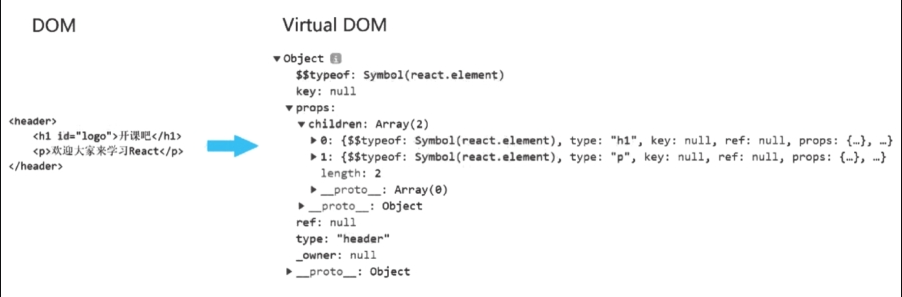
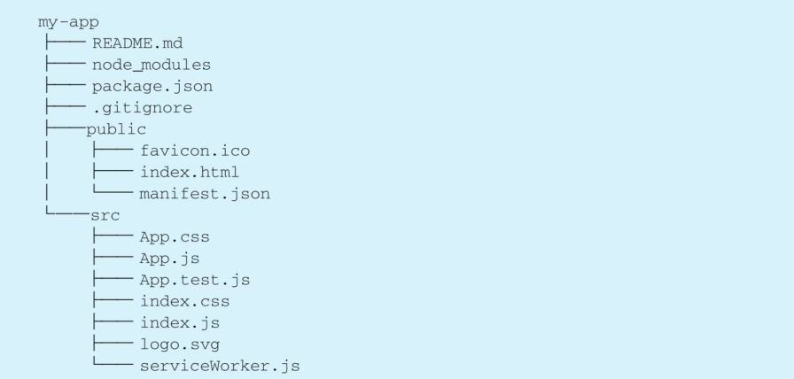
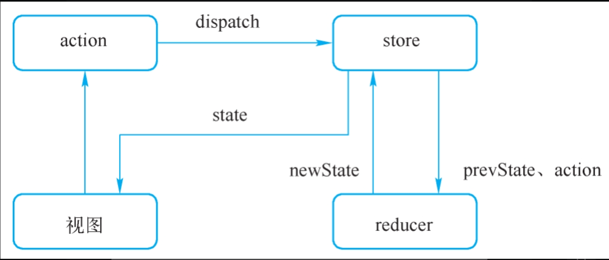



# 第 1 章 ES6 基础

## 1.1 let 及 const

### 1.1.1 let 命令

JS 中用“var”来声明变量会出现变量提升的情况

```js
console.log(a); //没有下面的声明，执行报错
var a = 10; // var导致变量提升，打印undefined
```

通过“var”声明的变量系统都会把声明隐式地升至顶部

let 命令

1. 没有变量提升
2. ES5 只有全局和函数作用域，ES6 有块级作用域{}。
3. let 禁止重复声明

### 1.1.2 const 命令

使用 const 声明的是常量，常量的值不能通过重新赋值来改变，并且不能重新声明，所以每次通过 const 来声明的常量必须进行初始化

**_const 在使用过程中如果声明的是对象，属性是可以修改的_**

可以用 Object.freeze 函数来冻结对象

deepFreeze 函数冻结多层对象

### 1.1.3 临时死区

let 及 const 声明的常量，会放在临时死区（temporaldead zone）

放在临时死区的变量，在声明前打印就会报错

### 1.1.4 循环中的 let 和 const

```js
let funArr = [];
for(var i=0; i<5;i++){
    funArr.push(function(){
        console.log(i);
    })
    //改成闭包可以创建独立作用域，让输出是1，2，3，4，5
    (function (i){
      funArr.push(function(){
          console.log(i);
      })
    })(i);
    //或者只要把var改成let
}
funArr.forEach(item = > {
    item();  //输出是5个5.因为i存在全局作用域中，输出时这个变量已经变成5
})


```

## 1.2 解构赋值

### 1.2.1 数组的解构

```js
let [a, b, c] = [10, 20, 30];
//两边数目可以不等
let [a, b] = [10, 20, 30];
let [, , c] = [10, 20, 30];
//用...放入数组
let [a, ...arr] = [10, 20, 30]; //arr = [20,30]
//变量互换
[a, b] = [b, a];
```

### 1.2.2 对象的解构

```js
let person = {
    name: "xx",
    age: 20,
    family: {
        father: "cc",
        mother: "dd",
    },
};
let {
    name,
    age,
    family: {father, mother},
} = person;
//所有变量名都可以修改，也可以设默认值
let {
    name: myname,
    age = 20,
    family: {father, mother},
} = person;
```

## 1.3 字符串扩展

### 1.3.1 Unicode 支持

ES6 增加了大括号来让字符串正确解读

```js
console.log("\uD842 \uDFB7"); //ES5的表示法
console.log("\u{D842}"); //ES6的表示法
```

### 1.3.2 新增字符串方法

indexOf(): 判断是否包含

includes()：返还布尔值，表示是否找到了字符串。

startsWith()：返还布尔值，表示被检测字符串是否在源字符串的头部。

endsWith():返还布尔值，表示被检测字符串是否在源字符串的结尾。

repeat()方法返回新的字符串将源字符串循环指定次数

### 1.3.3 模板字符串

ES5 用+号和""来拼接字符串。如果遇到多行字符串的情况需要通过“\n”来手动换行

ES6 通过反引号来表示“｀｀”模板字符串。如果要嵌入变量通过“${}”来实现

```js
str += "姓名：" + name + "年龄：" + age; //ES5写法
str += `姓名：${name} 年龄：${age}`; //ES6写法
```

模板字符串在使用过程中支持多行字符串，“${}”里可以接收三目运算符。遇到特殊字符同样需要通过“\”来进行转义

## 1.4 Symbol

ES6 中新增一种数据类型 Symbol 来表示唯一的值。每一个创建的 symbol 都是唯一的，这样在实际运用中可以创建一些唯一的属性及定义私有变量

每个 symbol 都是独一无二的，类型是 Symbol

```js
let s1 = Symbol();
let s2 = Symbol("Test");
let s3 = Symbol("Test");
console.log(s2 === s3); //false
```

用 Symbol 防止 export 的对象属性被覆盖

```js
//a.js
const NAME = Symbol("name");
let obj = {
    [NAME]: ”xxx“,
    age:20
}
export default obj;
//b.js
import Obj from './a.js';
const NAME = Symbol("name");
Obj[NAME] = "yyy";
consol.log(Obj); //age:20, Symobl:"xxx",Symbol:"yyy"
Object.keys(Obj); //不会返回Symbol
Object.getOwnPropertyNames(Obj); //不会返回Symbol
Object.getOwnPropertySymbol(Obj); //返回Symbol
Reflect.ownKeys(Obj); //返回Symbol
```

## 1.5 函数

### 1.5.1 函数形参默认值

ES6 可设置默认参数

### 1.5.2 函数形参不定参数

ES5 通过 arguments 来处理不定参数。每个函数只能声明一个剩余参数，且剩余参数必须在参数的末尾

```js
function fn() {
    console.log(arguments);
    console.log(arguments[0]);
    console.log(arguments[1]);
}

fn("aa", "bb"); //ES5的方法
//ES6 方法
function fn(...arg) {
    console.log(arg);
}
```

### 1.5.3 箭头函数

```js
//ES5 返还函数
let fn = function(arg){
    return arg;
}
//ES6
let fn = arg = > arg;
let fn = () = > "xxx"; //没有参数
let fn = (arg1,arg2) = > arg1 + arg2; //多个参数
let fn = () => ({
    name: "aaa",
    age: 20
}) //返回对象, 对象的大括号会被认为是函数的大括号，所以外面要加小括号

//箭头函数的this指针指向最近上层的this，这里就是Window
let obj={
    id:2,
    fn:() = > {
        console.log(this.id); //undefined
    }
}

```

## 1.6 类 Class

### 1.6.1 类基本语法

ES5 通过构造函数来模拟类

```js
function Person(name){
    this.name = name;
    this.age = 20;
}
Person.prototype.fn = function(){...}
let xxx = new Person("xxx");
xxx.fn();

//静态属性和方法
Person.age = 200;  //静态属性
Person.fn = function(){...} //静态方法

//类的继承
function Son(name){
    Person.call(this,name);
    Person.apply(this,[name]);
    Person.bind(this)(name);
}
```

ES6 提供了 class 关键字

```js
class Person{
    constructor(name){
        this.name = name;
        this.age = 20;
    }
    fn(){...}
    //支持getter,setter
    get age(){
        return 20;
    }
    set age(newValue){
        ...;
    }
    //静态属性和方法
    static num = 20;

    static fn() {...
    }
}

//类的继承
class Son extends Person {
    constructor(name){
        super(name);
    }
}

```

### 1.6.3 类继承

1）在访问 this 之前一定要调用 super()。

2）如果不调用 super()，可以让子类构造函数返还一个对象。

静态属性可以被子类所继承，但是如果是子类的实例化对象则不能被继承到

## 1.7 异步编程

### 1.7.1 ES5 中的异步

**_回调地狱_** : 过多的回调函数同时赋值，逻辑看起来很复杂

```js
//回调函数作为输入
function asyncFn(cb) {
    setTimeout(() => {
        cb && cb();
    }, 1000);
}

//输入参数是嵌套的回调函数的情况
asyncFn(function () {
    asyncFn(function () {
        asyncFn(function () {
            console.log("xxx");
        });
    });
});
```

### 1.7.2 Promise 基本语法

首先 Promise 是系统中预定义的类，通过实例化可以得到 Promise 对象。Promise 对象会有三种状态，分别是 pending、resolved、rejected

```js
let p1 = new Promise(function () {
});
console.log(p1); //Promise {<pending>}

let p2 = new Promise(function (resolve, reject) {
    resolve("xxx");
});
console.log(p2); //Promise {<resolved>:"xxx"}

let p3 = new Promise(function (resolve, reject) {
    reject("yyy");
});
console.log(p3); //Promise {<reject>:"yyy"}
```

Promise 用 then()来输入回调，用 catch()来捕捉错误。catch 的好处是有多个 then()的时候，可以第一时间先调用 catch()捕捉错误

```js
let p = new Promise(function(resolve,reject){
    resolve("xxx");
//    reject("xxx");
});

p.then(res = > {
    console.log(res);
}).catch(err = > {
    console.log(err);
})
```

调用 then 函数之后会有三种返还值。

1）then 里没有返还值，会默认返还一个 Promise 对象。

2）then 里如果有返还值会将返还值包装成一个 Promise 对象返还。

3）如果返还的是 Promise 对象，then 函数也会直接返还原本的 Promise 对象

### 1.7.3 Promise 处理异步问题

用多个 then()返回 Promise 的方式解决回调地狱

```js
function asyncFn(){
    return new Promise((resolve,reject) = > {
        setTimeout(()=> {
        resolve("xxx");
    }
,
    1000
)
    ;
})
}

asyncFn().then(res = > {
    console.log(res); //"xxx"
    return asyncFn();
}).then(res = > {
    console.log(res); //"xxx"
    return asyncFn();
}).catch(err = > {
    console.log(err);
})
//ES7 提供了await和async方法
async function fn(){
    let res1 = await asyncFn();//"xxx"
    let res2 = await asyncFn(); //"xxx"
    let res3 = await asyncFn();//"xxx"
}
fn();
```

### 1.7.4 Promise 的其他方法

Promise.resolve(); 创建一个 resolved 的 Promise 对象

Promise.reject(); 创建一个 reject 的 Promise 对象

Promise.all(p1,p2,p3).then(); 执行多个 Promise 对象。接收的参数是一个数组，当所有 Promise 对象都执行成功之后才会拿到执行结果的数组

Promise.race(p1,p2,p3).then(); 执行多个 Promise 对象。返回最先执行的结果

## 1.8 模块化

要使用 ES6 模块化工具，必须在 script 标签中声明 type="module"

```html
<script type="module"></script>
```

### 1.8.1 导入导出使用

```js
//a.js
let obj={
    name: "xx",
    age:20
}
export let a = 10;
export default obj;
export {
    obj as
        default
}; //和上句效果一样
export {a as c} //a 用 c变量名导出
//匿名变量导出
//c.js
export default {
    name: "xx",
    age:20,
};
//匿名函数导出
//d.js
export default () => {
  console.log("export");
};

//b.js
import A,{a} from "./a.js"
import {c as d} from "./a.js" //c 用 d 变量名导入
console.log(A,a); //{name:"xx",age:20} 10
//匿名导入, 任意名称
import XXX from c.js
console.log(c);  //{name:"xx",age:20}
//匿名函数导入
import xxxFun from d.js
xxxFun(); // export
```

### 1.8.2 export default 和 export 的区别

1. export default 1 个模块只能用 1 次
2. import 的时候，default 的要加{}

```js
//a.js
export default function crc32(){...}
export function crc1(){...}

import crc32 {crc1} from a.js
```

### 1.8.3 按需导入

使用 import()函数

```js
document.onclick = function(){
    import("./a.js").then(res = > {
        console.log(res);
    })
} //import 返回一个promise对象，所以可以用then赋值回调函数


```

## 1.9 Set 和 Map

### 1.9.1 Set 集合

```js
let set = new Set();
set.add(1); //添加
set.delete(1); //删除
set.clear(); //清空
//自动去重
let arr = [1, 2, 3, 3, 4, 5, 2, 6];
//数组转set
let set = new Set(arr);
console.log(set); //Set(6) {1,2,3,4,5,6}
//set转数组
let newArr = [...set];
console.log(newArr); // [1,2,3,4,5,6]
```

### 1.9.2 Map 集合

```js
let map = new Map();
map.set("name", "xxx");
map.set("age", 20);
map.delete("name");
map.clear();
```

## 1.10 扩展操作符...

### 1.10.1 数组转函数参数

它好比 rest 参数的逆运算，将一个数组转为多个函数参数

```js
function add(x, y) {
    return x + y;
}

var numbers = [4, 30];
add(...numbers); //4+30=34

//push用法
var arr1 = [1, 2, 3];
var arr2 = [4, 5, 6];
arr1.push(...arr2); //[1,2,3,4,5,6]
```

### 1.10.2 数组合并

```js
var arr1 = [1, 2, 3];
var arr2 = [4, 5, 6];
var arr3 = [...arr1, ...arr2]; //[1,2,3,4,5,6]
```

### 1.10.3 解构赋值和部分替换

扩展操作符（spread operator）并不是 ES6 语法的一部分，甚至都不是 ES Next 语法的一部分，但是因为 babel 的存在，被广泛使用

```js
return {...state, [counterCaption]: state[counterCaption] + 1};
//表示部分修改state上的成员，等同于如下代码。扩展操作符执行了一次浅拷贝
const newState = Object.assign({}, state);
newState[counterCaption]++;
return newState;
```

扩展操作符也可被用于去除掉某一部分数据

```js
const testObject={A:1,B:2,C:3};
const {A,..otherObject} = testObject; //otherObject就是其他数据
```

### 1.10.4 字符串转数组

```js
[..."hello"]; //["h","e",...]
```

# 第 2 章 React 详解

## 2.1 为什么使用 React

### 2.1.1 专注于视图

使用 React 的时候，只要告诉 React 需要的视图长什么样，或者告诉 React 在什么时间点，把视图更新成什么样就可以了，剩下的视图的渲染、性能的优化等一系列问题交给 React 搞定即可

### 2.1.2 组件化开发和声明式编程

传统 JS 采用命令式编程，告诉程序一步一步怎么做

声明式编程注重结果，直接告诉程序要什么

### 2.1.3 Virtual DOM

在 React 中，每一个组件都会生成一个虚拟 DOM 树。这个 DOM 树会以纯对象的方式来对视图（真实 DOM）进行描述



## 2.2 ReactDOM

### 2.2.1 React 引入方式

1. 模块化引入

2. <script>标签引入

```html
<script src="js/react.js"></script>
<script src="js/react-dom.js"></script>
```

react.js 是 React 的核心文件，如组件、Hooks、虚拟 DOM 等，都在这个文件中

react-dom.js 则是对真实 DOM 的相关操作

### 2.2.2 ReactDOM

ReactDOM 对象是 react-dom.js 提供的一个用于进行 DOM 操作的对象

#### 1 render

```js
ReactDOM.render(element,container[,callback])
```

render 方法用于将 React 生成的虚拟 DOM 生成到真实的 DOM 中去

参考示例

```html

<script src="js/react.js"></script>
<script src="js/react-dom.js"></script>
<div id="root"></div>

<script>
    ReactDOM.render(
            "Hello React",
            document.querySelector("#root"),
            () = > {
        console.log("Finsh");
    }
    )
    ;
</script>
```

## 2.3 React 视图渲染

### 2.3.1 ReactElement

当需要用 React 创建虚拟 DOM 时，React 专门提供了一个方法 createElement()

```js
React.createElement(type, config, children);
```

1. type: string 类型。 表示 html 标签，比如"div"
2. config: 对象类型。 表示该节点的属性
    1. 没有属性传 null
    2. 有两个固定参数 key 和 ref，比较重要
3. children:
4. 字符串类型。 表示改标签的文本内容
5. 数组。 表示把内容展开放进元素
6. ReactElement 类型。 子节点

### 2.3.2 JSX

JavaScript+XML，是一个看起来很像 XML 的 JavaScript 语法扩展

JSX 是 JS 的语法扩展，但是浏览器并不识别这些扩展，所以需要借助 babel.js 来对 JSX 进行编译，使其成为浏览器识别的语法，也就是 React.createElement

使用 JSX 时必须引用 babel 对代码进行编译；该 script 标签内的代码需要使用 babel 编译时，必须设置 type=＂text/babel＂

```html
<div id="root"></div>
<script src="js/babel.js"></script>
<script type="text/babel">
    ReactDOM.render(<div>...</div>, document.getElementById("root"));
</script>
```

JSX 本身是一个值，这个值是一个 ReactElement，而非字符串。如果是字符串加''

#### 1 插值表达式

要在视图中插入数据。就叫插值表达式。用{数据}

```js
let a = "aaa";
let b = "bbb";
ReactDOM.render{
  <h1>{a+b}</h1>,
  document.getElementById("root")
};
```

1. {}中，接收一个 JS 表达式，可以是运算式，变量或函数调用等。表达式的意思就是这个语句一定会有一个值返回，而插值的意思就是把表达式计算得到的值插入到视图中去
2. {}中，接收的是函数调用时，该函数需要有返回值。明确了{}中可以放什么样的代码之后，再来看看各种不同类型的数据，在插值之后去渲染视图的表现
3. 字符串、数字：原样输出
4. 布尔值、空、未定义：输出空值，也不会有错误
5. 数组：支持直接输出，默认情况下把数组的连接符“，”替换成空，然后直接输出
6. 对象：不能直接输出，但是可以通过其他方式，如 Object.values、Object.keys 等方法去解析对象，转换成数组之后进行输出

**特殊的渲染方法**

1. 列表渲染

   ```js
   let arr = {
       "li1",
       "li2",
       "li3"
   };
   ReactDOM.render{
     <ul>{arr.map(item = > <li>{item}</li>)}</ul>
     document.getElementById("root");
   };
   //输出结果
   <ul>
       <li>li1</li>
       <li>li2</li>
       <li>li3</li>
   </ul>
   ```

2. 条件渲染

    1. &&与运算符。&&运算有一个特征，左侧的运算结果为 true 时返回右侧内容

       ```js
       ReactDOM.render{
         <ul>{age > = 18 && <p>Adult</p>}</ul>
         document.getElementById("root");
       };
       ```

    2. ||或运算符。‖运算的特征和&&相反，左侧的运算结果为 false 时，返回右侧内容

    3. 三目运算符

   4. 逻辑特别复杂用函数

#### 2 JSX 属性书写

1. 所有的属性名都使用驼峰命名法。
2. 如果属性值是字符串并且是固定不变的，则可以直接写
3. 如果属性值是非字符串类型，或者是动态的，则必须用插值表单式
4. 有一些特殊的属性名并不能直接用
    1. class 属性改为 className
    2. for 属性改为 htmlFor
    3. colspan 属性改为 colSpan
5. style 在书写的时候要注意它接收的值是个对象

#### 3 JSX 注意事项

1. 浏览器并不支持 JSX，在使用时要使用 babel 编译。
2. JSX 不要写成字符串，否则标签会被当作文本直接输出。
3. JSX 是一个值，**在输出时只能有一个顶层标签**
4. 所有的标签名字都必须小写
5. 无论单标签还是双标签都必须闭合
6. JSX 并不是 HTML，在书写时很多属性的写法不一样
7. 在 JSX 中，插入数据需要用插值表达式{数据}

## 2.4 create-react-app

### 2.4.1 安装 create-react-app

npm i create-react-app-g

### 2.4.2 项目构建和启动

输入命令 create-react-app my-app

打开 my-app 目录，可以看到以下结构



1. README.md，这个文件用于编写项目介绍使用
2. node_modules，在项目中安装的依赖都会放在这个文件夹下
3. package.json，是整个项目的描述文件
    1. dependencies 项目安装的依赖名称及版本信息。可以看到在构建完的项目中，已经帮开发者安装好了一些基本的依赖：＂react＂:＂^16.13.1＂，＂react-dom＂:
       ＂^16.13.1＂，＂react-scripts＂:＂3.4.1＂。react 和 react-dom 不需要再复述了。react-scripts 是什么？create-react-app 会把
       webpack、Babel、ESLint 配置好合并在一个包里，方便开发人员使用，这个包就是 react-scripts
    2. scripts 中定义的是在命令行工具中可以使用到的一些命令。在当前目录 my-app 中，启动命令行工具
        1. npm start。这个命令用于启动项目。create-react-app 内置了一个热更新服务器，项目启动之后，默认会打开 http://localhost:3000，运行项目
        2. npm test。这个命令用于项目测试
        3. npm run build 打包命令。该命令会将项目中的代码打包编译到 build 文件夹中，它会将 React 正确地打包为生产模式中需要的代码并优化构建以获得最佳性能。将来要把项目发布在生成环境的时候，只需要把
           build 文件夹的内容发布上去即可
        4. npm run eject。该命令会把项目所有配置文件暴露出来，用于对项目构建重新配置
4. .gitignore 文件
5. public 文件夹。用来存放 html 模板。public 文件夹中的 index.html 就是项目的 html 模板
6. src 文件夹。该文件夹中 index.js 是整个项目的入口文件。为了加快重新构建的速度，webpack 只处理 src 中的文件。注意要将 JS 和 CSS 文件放在 src 中，否则该文件不会被 webpack 打包。

### 2.4.3 项目入口文件

src/index.js 里全部删除并修改如下

```js
import React from 'react';
import ReactDOM from 'react-dom';
import App from './App';
ReactDOM.render{
  <React.StrictMode>
      <App />
  </React.StrictMode>,
  document.getElementById('root');
};
```

src/App.js

```js
import React from "react";

function App() {
    return <h1>Hello World</h1>;
}

export default App;
```

**_index.js 作为项目的入口文件_**

### 2.4.4 React.StrictMode

1. 识别具有不安全生命周期的组件。
2. 有关旧式字符串 ref 用法的警告。
3. 关于已弃用的 findDOMNode 用法的警告。
4. 检测意外的副作用。
5. 检测遗留的 context API。

在 StrictMode 模式下，如果检测到代码有以上问题，React 会在控制台中打印出相应的警告。

## 2.5 定义 React 组件

类组件

```js
class App extends React.Component {
    render() {
        return <h1>Hello World</h1>;
    }
}
```

## 2.6 组件间通信

### 2.6.1 props

组件的 props 属性专门用于接收从父组件传递过来的数据。在调用组件时，可以把想传递进去的数据直接加在组件的属性上，然后在组件内部，通过 this.props 属性接收传递进来的数据

### 2.6.2 state

#### 1 定义 state

```js
import React, {Component} from 'react';
class App extends Component {
    state = {name: "xxx", age:9} //ES6的简写方式
    //如果要写在构造函数里
	Constructor(props){
        super(props);
        this.state = {
            name: "xxx",
            age: 9
        };
    }
	render(){
        ...
    }
}
export default App;
```

#### 2 修改 state

setState 方法： 参数可以是对象，也可以是有返回值的函数

1. 调用 setState 时，只需要传入要修改的状态，不需要传入所有状态，setState 会自动进行合并。如上边示例中，state 中有 name 和 age 两个字段，但修改时只传入 age，这时候 name 会保持不变合并到新的
   state 对象中。
2. setState 是一个异步方法，在调用 setState 之后直接打印 state，发现 state 并未修改
3. 多个 setState 会被合并，但只会引起一次视图渲染（render）

### 2.6.4 跨组件通信 Context

context.js

```js
const context = createContext();
//Provider 给子组件传数据
//Consumer 接收父组件数据
const {Provider, Consumer} = context;
export {Provider, Consumer};
export default context;
```

App.js

```js
class App extends Component {
    render() {
        <Provider value={{info: "xxx"}}>
            <Child/>
        </Provider>;
    }
}
```

child.js

```js
class Child extends Conponent {
    //或者用static属性接收
    static contextType = context;
    render() {
        return (
            <Consumer>
            	((val) = > {
                    return <p>{val.info}</p>
                })
            </Consumer>
        )
    }
}
```

## 2.7 组件的生命周期

React 组件的生命周期分为三个阶段，分别是：

1. 挂载阶段（Mounting），这个阶段会从组件的初始化开始，一直到组件创建完成并渲染到真实的 DOM 中。
2. 更新阶段（Updating），顾名思义组件发生了更新，这个阶段从组件开始更新，一直监测到组件更新完成并重新渲染完 DOM。
3. 卸载阶段（Unmounting），这个阶段监听组件从 DOM 中卸载。

### 2.7.1 挂载阶段的生命周期

1. constructor(props)
2. static getDerivedStateFromProps（props，state）
    1. static getDerivedStateFromProps 是一个静态方法，使用时其内部不能使用 this。
    2. static getDerivedStateFromProps 是 React 16.3 之后新增的，使用时一定要注意项目的 React 版本。
    3. static getDerivedStateFromProps 必须有返回值，其返回值是对 state 的修改。相当于其他地方调用 this.setState()时，传入的修改对象。
    4. static getDerivedStateFromProps 的作用是根据 props 来修改 state 的，所以组件初始时一定要定义 state 属性
3. componentWillMount
    1. componentWillMount 在 React 16.3 之后已经不建议使用，如果在 React 17.x 还想要使用 componentWillMount，React 建议写
       UNSAFE_componentWillMount。
    2. componentWillMount 和 getDerivedStateFromProps 不能同时使用
4. render()
5. componentDidMount

### 2.7.2 更新阶段的生命周期函数

三种不同原因会引起组件更新

1. 父组件更新
2. 当前组件自己更新
3. forceUpdate

#### 1. 父组件更新

React16.3 以后

1. static getDerivedStateFromProps（newProps，newState）
2. shouldComponentUpdate 判断组件是否更新。
3. render
4. getSnapshotBeforeUpdate（prevProps，prevState）
    1. 里面的 this.state 和 this.prop 已经更新为新的 props 和 state
    2. getSnapshotBeforeUpdate 必须有返回值，其返回值会传递给 componentDidUpdate
5. componentDidUpdate（prevPorps，prevState，snapshot）在 React 16.3 中，新增加了第 3 个参数 snapshot，用于接收 getSnapshotBeforeUpdate
   通过返回值传递过来的信息

#### 2 组件自己更新

在 React 16.3 中，由于生命周期函数有变化，所以组件自更新所调用的函数也跟着变化了，依次调用过程为：

shouldComponentUpdate→render→getSnapshotBeforeUpdate→componentDidUpdate。

在 React 16.4 及之后，为了方便开发者，FaceBook
官方又做了一个调整，把组件自更新和父组件更新带来的组件更新做了统一，顺序为：getDerivedStateFromProps→shouldComponentUpdate→render→getSnapshotBeforeUpdate→componentDidUpdate

#### 3 forceUpdate

forceUpdate 会强制视图进行更新，所以生命周期跟其他的更新略有不同，不会再调用 shouldComponentUpdate

### 2.7.3 卸载阶段的生命周期

卸载阶段的生命周期函数只有一个，即 componentWillUnmount

## 2.8 Ref

使用 ref 获取原生 DOM 节点

### 2.8.1 string ref

ref 可以帮助开发者获取到类组件的实例化对象或原生 DOM 节点。当 ref 绑定在组件上，渲染完成后就可以获取到组件实例。当 ref 绑定在标签上，渲染完成之后，可以获取到真实的 DOM 节点

```js
class Children extends Component {
    render() {
        return <p>xxxx</p>;
    }
}

class App extends Component {
    componentDidMount() {
        console.log(this.refs.parent);
        console.log(this.refs.children);
    }

    render() {
        return (
            <div>
                <p ref="parent">pppp</p>
                <Children ref="children"/>
            </div>
        );
    }
}
```

1. ref 的命名虽然可以自定义，但也要注意 JS 的命名规范，另外要遵循驼峰命名法。
2. 单个组件内，ref 不能重名。
3. 获取 ref 时，要在 componentDidMount 和 componentDidUpdate 中进行，否则 ref 是还没有赋值或还没有更新的。

### 2.8.2 createRef

React16.3 中对 ref 的使用做了更新，新增了 createRef 方法

使用 createRef 创建 ref 时，需要先把 ref 绑定在组件的属性或者变量中，然后和节点做绑定。获取 ref 时，需要通过 ref 的 current 属性来获取 ref 中具体存储的内容

```js
class Children extends Component {
    render() {
        return <p>xxxx</p>;
    }
}

class App extends Component {
    parent = createRef();
    children = createRef();

    componentDidMount() {
        console.log(this.parent.current);
        console.log(this.children.current);
    }

    render() {
        return (
            <div>
                <p ref={this.parent}>pppp</p>
                <Children ref={this.children}/>
            </div>
        );
    }
}
```

## 2.9 key

在 React 中，列表输出元素时，如果没有添加 key 属性，在开发环境中都会报出一个警告，要求加上 key 属性

设计原则

1）同一元素更新前后要保持 key 统一，也就是说元素 A 更新前 key 为 1，更新后 key 也要为 1。2）一组元素中 key 值不能重复。

使用原则

1. 默认不加 key 时，React 会以数组的索引来做每一项的 key 值。
2. 当列表元素更新前后，其顺序绝对不会发生变化时，也可以使用数组的索引来做 key 值。
3. 当列表元素的顺序会有变化时，建议读者一定不要使用数组的索引，最好使用数据的 id。否则会重复渲染

## 2.10 添加事件

React 通过 JSX 的插值放入事件

```js
class App extends Component {
    clickHandler() {...}
    render(){
        return <button onclick = {this.clickHandler}></button>
    }
}
```

**_事件处理函数的 this 默认为 undefined。如果希望 this 为组件实例的话，可以绑定函数的 this 或者使用箭头函数_**

### 1 使用 bind 对 this 绑定

```js
class App extends Component {
    constructor(props) {
        super(props);
        this.clickHandler = this.clickHandler.bind(this);
    }

    clickHandler() {
        console.log(this);
    }

    render() {
        return <button onclick={this.clickHandler}></button>;
    }
}
```

### 2 使用箭头函数获取父类的 this

```js
class App extends Component {
    clickHandler = (e) = > {
        console.log(this);
    }
    render(){
        return <button onclick = {this.clickHandler}></button>
    }
}
```

在 React 中阻止默认事件不能使用 return false，必须使用 event.preventDefault

## 2.11 表单

将表单输入和 state 连在一起，叫做受控组件

```js
class App extends Component {
    state = {val: ""}
	render(){
        let {val} = this.state;
        return <input type="text"
        		value = {value}
        		onChange = {(e) = > {
                  this.setState({
                    value: e.target.value
                })
                }}
        		/>
    }
}
```

## 2.13 React Hook

React 函数式组件，没·有 state，所以提供了一些 hook

```js
function App(props) {
    return <p>aaa</p>;
}
```

### 2.13.1 常用 Hooks

#### 1 useState

```js
//函数原型
const [state,setState] = useState(initialState);

//用法
import React. {useState} from 'react';
function App(){
    const [name,setName] = useState("xxx");
    //多个state
    const [person,setPerson] = useState({name:"xxx",age:20});
    return <div>
    	<p>{name}</p>
    	<button onClick={ () = > {
            setName("aaa");
            setPerson(...person,name:"aaa");
        }}>显示全称</button>
    </div>;
}
export default App;
```

1. setState 是个异步方法
2. 没有合并多个 state 功能，更新时所有 state 一同更新。参考上面多个 state 示例
3. 同一个组件中可以使用 useState 创建多个 state

#### 2 useRef

```js
import React. {useRef} from 'react';
function App(){
    let elf = useRef();//类似createRef
    return <div>
    	<p ref={elf}>XXX</p>
    	<button onClick={ () = > {
            console.log(elf.current);
        }}>显示全称</button>
    </div>;
}
export default App;
```

#### 3 useEffect

useEffect 就相当于 componentDidMount、componentDidUpdate 和 componentWillUnmount 的集合体

```js
import React. {useState,useEffect} from 'react';
function Course(){
    const [course,setCourse] = useState("课程");
    const [num,setNum] = useState(1);
    useEffect(() = > {
        console.log("xxx");
    	return () = > {
            console.log("yyy");//卸载时执行
        }
    },[num]);//只有num改动的时候，才会执行回调函数,在数组中放入依赖数据
	return <div>
        <select
		value = {course}
		onChange = {({target}) = > {setCourse(target.value);} }
		>
            <option value="xxx">xxx</option>
        </select>
		<input
		 type = "number"
		 value = {num}
		 onChange = {({target}) = > {setNum(target.value);}}
		/>
    </div>
}

function App(){
    let elf = useRef();//类似createRef
    return <div>
    	<p ref={elf}>XXX</p>
    	<button onClick={ () = > {
            console.log(elf.current);
        }}>显示全称</button>
    </div>;
}
export default App;
```

组件挂载 → 执行副作用（回调函数）→ 组件更新 → 执行清理函数（返还函数）→ 执行副作用（回调函数）→ 组件准备卸载 → 执行清理函数（返还函数）→ 组件卸载

1. componentDidMount。如果只想要在挂载后执行，可以把依赖参数置为空，这样在更新时就不会执行该副作用了。

2. componentWillUnmount。如果只想要在卸载前执行，同样把依赖参数置为空，该副作用的返还函数就会在卸载前执行。

3. componentDidUpdate

   需要判断值是否有更新，用 useRef

```js
function Course(){
    const [course,setCourse] = useState("课程");
    const [num,setNum] = useState(1);
    let preCourse = useRef(course);
    let preNum = useRef(num);
    useEffect( () = > {
        console.log("组件挂载阶段");
    	return () = > {
            console.log("组件卸载阶段");
        }
    },[]);//绑定的数组一定要是空，不传的话表示任意组件都会引起更新
	useEffect( () = > {
        if(course != prevCourse.current || num != preNum.current){
            console.log("组件更新");
            //ref不会自动更新，需要手动更新
            preCourse.current = course;
            preNum.current = num;
        }
    },[course,num]);
}
```

#### 4 useMemo/useCallback

都是有值变化的时候调用

```javascript
const renderButton = useCallback(
    () => <Button type="link">{buttonText}</Button>,
    [buttonText] // 当buttonText改变时才重新渲染renderButton
);
```

useMemo 返回的的是一个值，用于避免在每次渲染时都进行高开销的计算

```javascript
// 仅当num改变时才重新计算结果
const result = useMemo(() => {
    for (let i = 0; i < 100000; i++) {
        (num * Math.pow(2, 15)) / 9;
    }
    return i;
}, [num]);
```

### 2.13.2 Hook 使用规则

1. 只能在函数式组件和自定义 Hooks 之中调用 Hooks，普通函数或者类组件中不能使用 Hooks。
2. 只能在函数的第一层调用 Hooks

### 2.13.2 自定义 Hook

```js
function useScrollY(){
    let [scrollY,setScrollY] = setState(0);
    function scroll(){
        setScrollY(window.scrollY);
    }
    useEffect(() = > {
        window.addEventListener("scroll",scroll);
        return() =
>
    {
        window.removeEventListener("scroll", scroll);
    }
    ;
    },[]);
	return scrollY;
}
```

# 3 基于 Redux 状态管理

## 3.1 Redux 使用

1. store：一个数据容器，用来管理和保存这个项目的 state。在整个应用中只能有一个 store。
2. state：一个对象，在 state 中存储相应的数据，当开发者需要使用数据时，则可以通过 store 提供的方法来获取 state。
3. action：一个通知命令，用于对 state 进行修改。通过 store 提供的方法，可以发起 action 完成对 state 的修改。

### 3.1.1 action、createStore 和 reducer 函数

```js
import {createStore} from "redux";
function reducer(state={count:1},action){
    switch(action.type){
        case "PLUS":
            return {count:state.count+1};
        case "MINUS":
            return {count:state.count-1};
    }
    return state;
}
let store = createStore(reducer);
function render(){
    let state = store.getState(); //获取state
    ReactDOM.render(
        <button onClick = {()=>{
        store.dispatch({type:"PLUS"});
        }}>
            +++</button> //自增按钮
    <span>{state.count}</span> //显示
)
    ;
}
let unSubscribe = store.subscribe(render);
setTimeout(()=>{unSubscribe();},1000);//取消订阅
```

**_reducer 一定要是个纯函数_**

### 3.1.2 store

store 提供了 3 种方法

1. getState：该方法用于获取 state。dispatch（action）：该方法用于发起一个 action。
2. subscribe（listener）：该方法会注册一个监听器监听 state 发生的变化。另外该方法的返回值会返回一个注销监听器的方法，用于取消监听器。

流程图如下



1. reducer 创建 store
2. store 传 state => 视图
3. 视图被操作时通过 dispath 把 action 给 reducer
4. reducer 更新 state，并通过 store 再传给视图

## 3.2 React-Redux

### 3.2.1 安装和配置

store.js 里创建 store 和 reducer

```js
import {createStore} from "redux";

function reducer(state = {count: 1}, action) {
    switch (action.type) {
        case "PLUS":
            return {count: state.count + 1};
        case "MINUS":
            return {count: state.count - 1};
    }
    return state;
}

let store = createStore(reducer);
export default store;
```

在整个项目在外层使用 Provider 组件。 index.js

```js
import store from "store.js";

ReactDOM.render(
    <Provider store={store}>
        <App/>
    </Provider>,
    document.getElementById("root")
);
```

### 3.2.2 connect

React-Redux 中提供了一个 connect 方法用于接收 Provider 传递下来的 store 中的 state 和 dispatch

```js
connect((state) => newProps)(Component);
```

state 是 Redux 的 state，把 store 中的 state 作为 props 传给组件 Component

state => newProps 表示定义一个转换函数，把 state 转成 props

connect 返回一个新的组件给父组件调用

### 3.2.3 Hooks

1. const state = useSelector(state=>state) 返回 store 中的 state
2. const dispatch = useDispatch() 返回 store 的 dispatch 方法
3. const store = useStore() 返回 store

## 3.4 Reducer 拆分与合并

利用 combineReducers 合并分模块的 reducer

```js
function user(user={...},action){
	swtich(action.type){
     ...
	}
    return user;
}
function todo(todo={...},action){
	switch(action.type){
        ...
    }
    return todo;
}
const store = createStore(combineReducers({user,todo}));
```

# 4 React-Router

## 4.1 什么是 React-Router

为了让每次切换页面的时候，不要重新渲染整个页面，所以采用 SPA(单页面应用)。所有界面更新通过 AJAX+DOM 操作完成。

使用了 SPA 之后，视图都是在一个页面通过 JavaScript 动态处理的。这时就需要在前端建立一套路由规则，根据 URL 的在页面动态更新 DOM 来显示不同的视图

前端的路由其实就是 url 到 DOM 的路由

## 4.2 React-Router 安装与配置

WEB 端的 Router 中提供了两种不同的模式

1. HashRouter 是基于 hash 实现的一种路由方式，URL 变化时主要是 hash
   值进行变化。如http://127.0.0.1:3000/#/about、http://127.0.0.1:3000/#/user，可以看到URL里一定会有一个#号，也就是hash标识。hash模式的好处是一定不会向服务端发送请求，但URL里一定会有一个#号
2. BrowserRouter 则是基于 H5 history API 的一种路由方式。history 的 URL 切换基于 history 提供的 pushState 方法，好处是 URL 和之前直接请求后端的 URL
   没有什么区别，如http://127.0.0.1:3000/about、http://127.0.0.1:3000/user。当然问题也同样突出，在部署线上时，要注意直接输入URL还是会发起后端请求，所以后端一样也要做处理。

需要在最外层告诉 React 用哪种路由

```js
ReactDOM.render(
    <BrowserRouter>
        <App/>
    </BrowserRouter>,
    document.getElementById("root")
);
```

## 4.3 Route 组件

使用 Route 组件关联 path 和 UI。代码格式如下：＜ Route path=＂/user＂component={UserView}/＞。当 URL 和 path 匹配时，就会去渲染 UserView

### 4.3.1 路由匹配

默认是模糊匹配

```js
<Route path="/about" component={AboutView}/>
<Route path="/about" exact component={AboutView}/> //精确匹配
<Route path={["/about","/index"]} exact component={AboutView}/> //多路径匹配
<Route path="/about/:page" exact component={AboutView}/> //带参数匹配
```

### 4.3.2 路由渲染

一种是通过 component 声明对应的组件

一种是通过 render 直接输入函数

## 4.4 路由信息

用 Route 匹配路由时，会有以下参数作为 props 传入组件

### 1 history

1. length，该域下历史记录的条目数。
2. location，URL 中的信息，具体参考 location 对象。
3. push（path，[state]），将新条目推入历史记录堆栈
4. replace（path，[state]），替换历史记录上的当前条目。这同样会引发 URL 跳转，不同的是，此时会在历史记录中替换掉之前的记录。
5. go（n），跳转 n 步历史记录，正数前进 n 步，负数后退 n 步。
6. goBack()，等同于 go（-1）返回上一步。
7. goForward()，等同于 go（1）前进一步。

### 2 location

1. pathname，URL 的路径，格式为字符串。
2. search，URL 中的 search 片段，格式为字符串。
3. hash，URL 中的 hash 片段，格式为字符串。
4. state，路由跳转时传递的额外信息，如 push（path，state）推送过来的 state 信息，格式为对象。

### 3 match

1. params，接收 path 参数（:page）传递过来的相关信息，格式为对象。
2. isExact，指是否是精确匹配，格式为布尔值。
3. path，Route 中定义的 path 路径，格式为字符串。
4. URL，当前的 URL 路径，格式为字符串。

## 4.5withRouter 和 Router Hooks

### 4.5.1 Hooks

1）useHistory 调用该 Hook 会返回 history 对象。

2）useLocation 调用该 Hook 会返回 location 对象。

3）useRouteMatch 调用该 Hook 会返回 match 对象。

4）useParams 调用该 Hook 会返回 match 对象中的 params，也就是 path 传递的参数

## 4.6 链接跳转

不能用<a>标签，因为会引起整个页面重新渲染

### 4.6.1 Link 组件

to 属性可以是对象或者字符串

```js
<Link to="/about">About</Link>
<Link to={{
          pathname:"/about",
          search:"?search=xxx",
          hash:"#111",
          state:{info:"ohters"}
}}>About</Link>
```

### 4.6.2 NavLink 组件

用作导航栏中的组件

# ES6 其他书籍的内容

## 深入理解 ES6

## 8 迭代器 Iterator 和生成器 Generator

为了解决多个循环语句嵌套增加代码复杂性的问题，ES6 引入了 Iterator

### 8.1 迭代器

Iterator 特征

1. next()方法返回一个结果对象
2. 结果对象有两个属性， value 表示值，done 表示是否结束

### 8.2 生成器

生成器是一种**_返回迭代器_**的函数，通过 function 关键字后的星号（\*）来表示

```js
function* createIterator() {
    yield 1;
    yield 2;
    yield 3;
}

let iterator = createIterator();

console.log(iterator.next().value); //1
console.log(iterator.next().value); //2
console.log(iterator.next().value); //3
```

每当执行完一条 yield 语句后函数就会自动停止执行

#### yield 使用限制

yield 关键字只可在生成器内部使用，且只能在生成器函数最外层

不能用箭头函数来创建生成器

#### 对象的生成器函数

```js
let o = {
    * createIterator(items) {
        for (let i = 0; i < items.length; i++) {
            yield items[i];
        }
    },
};
let iterator = o.createIterator([1, 2, 3]);
```

### 8.3 可迭代对象

对象的 Symbol.iterator 属性为 true 的都是可迭代对象。(Set,数组，Map)

```js
let values = [1, 2, 3];
//使用for-of遍历
for (let num of values) {
    console.log(num);
}

//访问默认的迭代器
let iterator = values[Symbol.iterator]();
console.log(iterator.next());

//创建可迭代对象
let collection = {
    items: [],
    * [Symbol.iterator]() {
        for (let item of this.items) {
            yield item;
        }
    },
};
```

### 8.4 内建迭代器

#### 8.4.1 集合对象迭代器(Array,Set,Map)

1.  entries()　返回一个迭代器，其值为多个键值对。
2.  values()　返回一个迭代器，其值为集合的值。
3.  keys()　返回一个迭代器，其值为集合中的所有键名。

Array 和 Set 默认迭代器是 values()方法，Map 是 entries()方法

#### 8.4.2 字符串迭代器

当作字符数组遍历

### 8.5 高级迭代器功能

#### 8.5.1 给迭代器传参

如果给迭代器的 next()方法传递参数，则这个参数的值就会替代生成器内部上一条 yield 语句的返回值

```js
function* createIterator() {
    let first = yield 1;
    let second = yield first + 2;
    yield second + 3;
}

let iterator = createIterator();

console.log(iterator.next()); //{value: 1, done: false}
console.log(iterator.next(4)); //{value: 4+2=6, done: false}
console.log(iterator.next(5)); //{value: 5+3=8, done: false}
console.log(iterator.next()); //{value: undefined, done: true}
```

#### 8.5.2 在迭代器中抛出错误

将错误对象传给 throw()方法后，在迭代器继续执行时其会被抛出

throw()和 next()类似可以返回对象

```js
function* createIterator() {
    let first = yield 1;
    let second;
    try {
        second = yield first + 2;
    } catch (ex) {
        second = 6; //捕获到错误
    }
    yield second + 3;
}

let iterator = createIterator();

console.log(iterator.next()); //{value: 1, done: false}
console.log(iterator.next(4)); //{value: 4+2=6, done: false}
console.log(iterator.throw(new Error("Boom"))); //{value: 6+3=9, done: false}
console.log(iterator.next()); //{value: undefined, done: true}
```

#### 8.5.3 生成器返回语句

在生成器中，return 表示所有操作已经完成，属性 done 被设置为 true；如果同时提供了相应的值，则属性 value 会被设置为这个值

```js
function* createIterator() {
    yield 1;
    return 42;
    yield 2;
}

let iterator = createIterator();

console.log(iterator.next()); //{value: 1, done: false}
console.log(iterator.next()); //{value: 42, done: true}
console.log(iterator.next()); //{value: undefined, done: true}
```

#### 8.5.4 委托生成器

在生成器内部调用生成器

```js
function* createNumberIteration() {
    yield 1;
    yield 2;
}

function* createColorIterator() {
    yield "red";
    yield "green";
}

function* createCombinedIterator() {
    yield* createNumberIterator();
    yield* createColorIterator();
    yield true;
}

var iterator = createCombinedIterator();

console.log(iteartor.next()); //{value:1,done:false}
console.log(iteartor.next()); //{value:2,done:false}
console.log(iteartor.next()); //{value:"red",done:false}
console.log(iteartor.next()); //{value:"blue",done:false}
console.log(iteartor.next()); //{value:true,done:false}
console.log(iteartor.next()); //{value:undefined,done:true}
```

## ES6 的异步执行

### 基于 Promise 和 yield 的异步操作

因为是多个不同的 Promise 对象，也就是指不同参数输入的异步操作。又要保证每次上一个异步操作完成再执行下一个异步操作。如果不用 yield，直接调用 Promise 写起来就会很难懂。

```js
//Promise的异步对象
let tick = (duration) => {
    return new Promise((resolve) => {
        setTimeout(function () {
            console.log(duration, new Date());
            resolve(duration);
        }, duration);
    });
};

//产生器，用于以简单的同步写法，来写清楚异步调用的顺序
function* generator() {
    var result = yield tick(2000);
    console.log("result = ", result);
    result = yield tick(4000);
    console.log("result = ", result);
    result = yield tick(3000);
    console.log("result = ", result);
}

//运行器，循环执行所有产生器中的异步调用
let run = (generator, res) => {
    var result = generator.next(res);
    if (result.done) return;
    result.value.then((res) => {
        run(generator, res);
    });
};

run(generator());
//直接用Promise写,这样还是不能解决回调地狱的问题，因为还是长得像回调
//因为是不同的Promise，所以不能用Promise提供的不停地then().then()的方案
let tick1 = tick(2000);
let tick2 = tick(4000);
let tick3 = tick(3000);
tick1.then((res) => {
    tick2.then((res) => {
        tick3.then();
    });
});
```

### 基于 async 和 await 的异步操作

```js
let tick = (duration) => {
    return new Promise((resolve) => {
        setTimeout(function () {
            console.log(new Date());
            resolve(duration);
        }, duration);
    });
};

async function asyncFunc() {
    var result = await tick(1000);
    console.log(result);
  result = await tick(2000);
  console.log(result);
  result = await tick(3000);
  console.log(result);
}

asyncFunc(); //相当于在语言层面上，实现了run的函数。更简洁了
```


