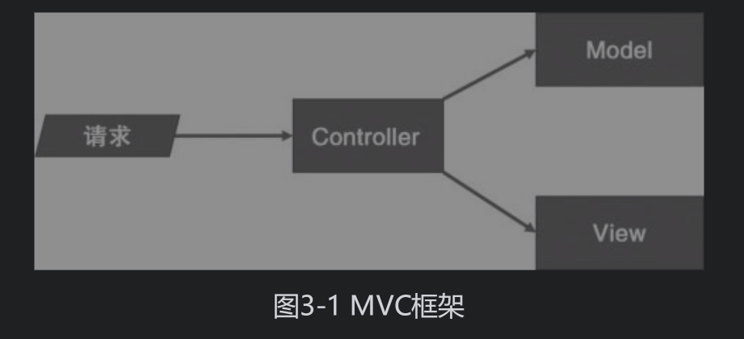
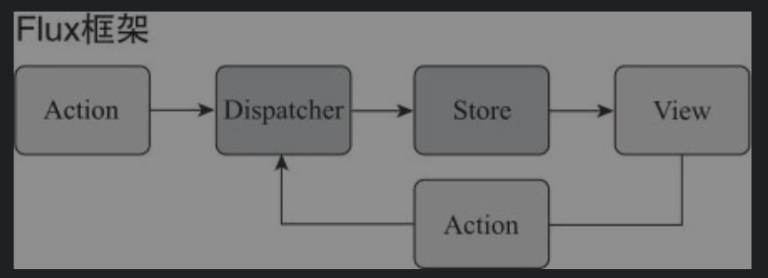



# 3 从Flux到Redux

## 3.1 Flux

Flux贯彻的最重要的观点——**单向数据流**

### 3.1.1 MVC的缺陷



MVC的架构，请求必须要全部经过controller。但是很多时候，为了简单，view和model直接会直接交互

FLUX架构



所有的交互都是单向的。Action触发Dispatcher, Dispatcher分发Action给Store。Store来更新View，View上的点击再产生Action来触发Dispatcher

### 3.1.2 Flux应用

#### 1 Dispatcher

src/AppDispatcher.js

```js
import {Dispatcher} from 'flux';
export default new Dispatcher();
```

#### 2 Action

src/ActionType.js

```js
export const INCREMENT = 'increment';
export const DECREMENT = 'decrement';
```

src/Action.js  定义的是可以dispatch该Action的函数

```js
import * as ActionTypes from './ActionType.js';
import AppDispatcher from './AppDispatcher.js';
export const increment = (conterCaption) =>{
  AppDispatcher.dispatch({
      type: ActionTypes.INCREMENT,
      counterCaption 
  });  
};
export const decrement = (conterCaption) =>{
  AppDispatcher.dispatch({
      type: ActionTypes.DECREMENT,
      counterCaption 
  });  
};
```

#### 3 Store

需要2个store，一个存3个counter组件的数据，一个存3个counter组件的总和

src/stores/CounterStore.js

```js
const counterValues = {
    'First':0,
    'Second': 10,
    'Third': 30
};
//为了不依赖view，store是一个EventEmitter的子类，这样可以通过emit发送event
const CounterStore = Object.assign({},EventEmitter.prototype,{
    getCounterValues: ()=>({counterValues}), //应该要返回一个immutable数据，这样就可以保证不让view修改
    emitChange: ()=>{this.emit(CHANGE_EVENT)},
    addChangeListener: (callback)=>{this.on(CHANGE_EVENT,callback)},
    removeChangeListener: (callback)=>			  
                    {this.removeListener(CHANGE_EVENT,callback)},
});
//注册到Dispatcher实例上
import AppDispatcher from '../AppDispatcher.js';
//这个回调才是dispatch真正的操作
CounterStore.dispatchToken = AppDipatcher.register(
    (action) => {
        if(action.type === ActionTypes.INCREMENT){
            counterValues[action.counterCaption] ++;
            CounterStore.emitChange();
        }else if(action.type === ActionTypes.DECREMENT){
            counterValues[action.counterCaption] --;
            CounterStore.emitChange();
        }
    }
);
```

src/stores/SummaryStore.js的emitChange/addChangeListener/removeChangeListener和Counter类似

```js
import CounterStore from './CounterStore.js'
import AppDispatcher from '../AppDispatcher.js';

function computeSummary(counterValues){
    let summary = 0;
    for (const key in counterValues){
        if(counterValues.hasOwnProperty(key)){
            summary += counterValues[key];
        }
    }
    return summary;
}

const SummaryStore = Object.assign({},EventEmitter.prototype,{
    //计算总和
   getSummary: ()=>({computeSummary(CounterStore.getCounterValues())}) ,
   emitChange: ()=>{this.emit(CHANGE_EVENT)},
   addChangeListener: (callback)=>{this.on(CHANGE_EVENT,callback)},
   removeChangeListener: (callback)=>			  
                    {this.removeListener(CHANGE_EVENT,callback)},
});

SummaryStore.dispatchToken = AppDispatcher.register(
    (action) => {
        if((action.type === ActionTypes.INCREMENT)||
          (action.type === ActionTypes.DECREMENT)){
            //确认先发给CounterStore
            AppDispatcher.waitFor([CounterStore.dispatchToken]);
            SummaryStore.emitChange();
        }
    }
);
```

***JavaScript是单线程的语言，不可能有线程之间的等待这回事***

Store上只是存储View获取数据的方法，还有Dispatcher如何更新数据的回调函数

#### 4 View

src/views/ControlPanel.js

```js
function CountrolPanel(props){
    return (
        <div>
        	<Counter caption="First"/>
	        <Counter caption="Second"/>
     	    <Counter caption="Third"/>
            <hr/>
            <Summary/>
        </div>
    );
}
```

src/view/Counter.js

```js
class Counter extend React.Component {
    state = {
        //显示只和Store有关
        count: CounterStore.getCounterValues()[this.props.caption],
    };
    
    componentDidMount(){
        CounterStore.addChangeListener(this.onChange);
    }
    
    onChange = ()=>{
        //显示只和Store有关
        const newCount = CounterStore.getCounterValues()[this.props.caption];
        this.setState({count:newCount});
    };
    
    onClickIncrementBtn = ()=>{
      //更新只和Actions有关
      Actions.increment(this.props.caption);  
    };
    
    onClickDecrementBtn = ()=>{
      //更新只和Actions有关  
      Actions.decrement(this.props.caption);  
    };
    
    render() {
        const {caption} = this.props;
        return (
            <div>
            	<button onClick = {this.onClickIncrement}>+</button>
                <button onClick = {this.onClickDecrement}>-</button>
    			<span>{caption} count: {this.state.count}</span>
            </div>
        );
    }
}
```

### 3.1.3 Flux的好处

总的来说就是单向数据流，禁止了view层去修改model层的数据

## 3.2 Redux

### 3.2.1 Redux的基本原则

Redux在Flux基础上强调三个基本原则：

1. 唯一数据源（Single Source of Truth）；只有1个store

2. 保持状态只读（State is read-only）；不允许view改变state

3. 数据改变只能通过纯函数完成（Changes are madewith pure functions）。

   view通过reducer来返回一个新的state，然后让redux框架来改变state

Reducer表示一种函数类型，输入时上一次的state和这一次更新的要求，返回一个新的state。但是不改变输入的上一次state

```js
//Redux规定的Reducer
Reducer(state,action)
```

### 3.2.2 Redux实例

#### 1 Action

1. ActionTypes.js 和 flux一样
2. Actions.js 返回的是一个Action对象。flux是调用Dispatcher.dispatch()

```js
import * as ActionTypes from './ActionTypes.js'

export const increment = (counterCaption) => {
  return {
      type: ActionTypes.INCREMENT,
      counterCaption: counterCaption
  }  
};
//decrement 类似
```

因为Redux只有1个store，所以不需要Dispatcher分发action对象给多个store

#### 2 Store

store.js

```js
import {createStore} from 'redux';
import reducer from './Reducer.js';

const initValues = {
    'First':0,
    'Second': 10,
    'Third': 20
};

const store = createStore(reducer,initValues);
export default store;
```

#### 3 Reducer

reducer.js

```js
import * as ActionTypes from './ActionTypes.js';

export default (state,action) => {
    const {counterCaption} = action;
    
    swtich(action.type){
        case ActionTypes.INCREMENT:
	        return {...state,[counterCaption]: state[counterCaption]+1};
        case ActionTypes.DECREMENT:
	        return {...state,[counterCaption]: state[counterCaption]-1};
        default:
        	return state;
    }
}
```

纯函数，不修改state状态。类似的代码Flux放在store中store.dispatchToken = AppDipatcher.register((action)=>{...})

#### 4 View

views/Counter.js

```js
import store from '../Store.js';

class Counter extends Component {
    constructor(props){
        super(props);
        ...
        this.state = this.getOwnState();
    }
    //获取状态
    getOwnState(){
        return {
            value: store.getState()[this.props.caption];//显示
        };
    }
    
    //保持更新
    onChange(){
        this.setState(this.getOwnState());
    }
    componentDidMount() {
        store.subscribe(this.onChange);
    }
    componentWillUnmount(){
        store.unsubscribe(this.onChange);
    }
    //更新状态
    onIncrement(){
        store.dispatch(Actions.increment(this.props.caption));
    }
    onDecrement(){...}
    
    render(){
        const value = this.state.value;
        const {caption} = this.props;
        
        return(
            <div>
            	<button onClick = {this.onIncrement}> + </button>
                <button onClick = {this.onDecrement}> - </button>
            </div>
        );
    }
}
```

### 3.2.3 容器组件和傻瓜组件

容器组件 - 负责和Redux Store交互

傻瓜(展示)组件 - 只单纯赋值渲染

### 3.2.4 组件Context

因为一个应用只有一个Store，最好有个方法把Store传递个各个需要的子组件。而不是通过props一层层传递

React提供Context，可以让树状组件上所有组件能访问同一个对象

Provider.js来提供Context

```js
import {PropTypes,Component} from 'react';

class Provider extends Component {
    getChildContext(){
        return {
          store: this.props.store  //提供获取store的方法
        };
    }
    
    render(){
        return this.props.children; //渲染子组件
    }
}
//让Provider能够被React认可为一个Context的提供者
Provider.childContextTypes = {
  store: PropTyoes.object  
};
//表示props里store一定要输入
Provider.propTypes = {
  store: PropTypes.object.isRequired
}
export default Provider;
```

index.js

```js
ReactDOM.render(
  <Provider store={store}>
    <ControlPanel />
  </Provider>,
  document.getElementById('root')
);
```

view/Counter.js

```js
class CounterContainer extends Component {
    ...
    onIncrement() {
    	this.context.store.dispatch(Actions.increment(this.props.caption));
	}
	...    
}
CounterContainer.propTypes = {
  caption: PropTypes.string.isRequired //proptype用于类型检查
};

CounterContainer.contextTypes = {
  store: PropTypes.object//使用的时候要先声明要用
}

export default CounterContainer;
```

### 3.2.5 React-Redux

主要提供1了两个功能

1. connect：连接容器组件和傻瓜组件；
2. Provider：提供包含store的context。

#### connect

```js
export default connnect(mapStateToProps, mapDispatchToProps)(Counter);
```

connect参数：

​			mapStateToProps -  把store上的state转成prop传给傻瓜组件

​			mapDispatchToProps - 把组件内部的用户动作转成dispatch给store

connect返回值： 还是一个函数。再输入counter作为参数，并立即执行。这个函数返回一个新的Counter组件

Counter的对应函数

```js
function mapStateToProps(state,ownProps){
    return {
        value: state[ownProps.caption]
    }
}

function mapDispatchToProps(dispatch,ownProps){
    return {
        onIncrement: ()=>{
          dispatch(Actions.increment(ownProps.caption));
        },
    }
}
```

#### Provider

检查Store是否提供了3个函数

subscribe

dispatch

getState

# 4 模块化React和Redux应用

## 4.3 模块接口

import整个目录，然后在目录中建立index.js，所有该目录下想要export的接口都只在在index.js中定义

## 4.4 状态树设计

1. 一个模块控制一个状态节点
2. 避免冗余数据
3. 树形结构扁平。

## 4.5 Todo应用实例

分todos和filter两个目录

### 4.5.1 最外层代码

index.js

```js
ReactDOM.render(
  <Provider store={store}>
    <TodoApp />
  </Provider>,
  document.getElementById('root')
);
```

TodoApp.js

```js
function TodoApp() {
  return (
    <div>
      <Todos />
      <Filter />
    </div>
  );
}

export default TodoApp;
```

### 4.5.2 action构造函数

todo/actions.js

```js
import {ADD_TODO, TOGGLE_TODO, REMOVE_TODO} from './actionTypes.js';

let nextTodoId = 0;

export const addTodo = (text) => ({
  type: ADD_TODO,
  completed: false,
  id: nextTodoId ++,
  text: text
});

export const toggleTodo = (id) => ({
  type: TOGGLE_TODO,
  id: id
});

export const removeTodo = (id) => ({
  type: REMOVE_TODO,
  id: id
});
```

### 4.5.3 组合reducer

Store.js

```js
const win = window;
win.Perf = Perf

const reducer = combineReducers({
  todos: todoReducer,
  filter: filterReducer
}); //组合两个reducer

const middlewares = [];
if (process.env.NODE_ENV !== 'production') {
  middlewares.push(require('redux-immutable-state-invariant')());
}

const storeEnhancers = compose(
  applyMiddleware(...middlewares),
  (win && win.devToolsExtension) ? win.devToolsExtension() : (f) => f,
);

export default createStore(reducer, {}, storeEnhancers);
```

todos/reducer.js

```js
export default (state = [], action) => {
  switch(action.type) {
    case ADD_TODO: {
      return [
        {
          id: action.id,
          text: action.text,
          completed: false
        },
        ...state
      ]
    }
    case TOGGLE_TODO: {
      return state.map((todoItem) => {
        if (todoItem.id === action.id) {
           return {...todoItem, completed: !todoItem.completed};
        } else {
          return todoItem;
        }
      })
    }
    case REMOVE_TODO: {
      return state.filter((todoItem) => {
        return todoItem.id !== action.id;
      })
    }
    default: {
      return state;
    }
  }
}
```

### 4.5.4 Todo视图

#### 1 todos视图

todos/views/todos.js

```js
export default () => {
  return (
    <div className="todos">
      <AddTodo />
      <TodoList />
    </div>
  );
}
```

todos/views/addTodo.js

```js
class AddTodo extends Component {

  constructor(props, context) {
    super(props, context);

    this.onSubmit = this.onSubmit.bind(this);
    this.refInput = this.refInput.bind(this);
  }

  onSubmit(ev) {
    ev.preventDefault(); //取消post form引发的网页跳转

    const input = this.input;
    if (!input.value.trim()) {
      return;
    }

    this.props.onAdd(input.value); //绑定dispatch
    input.value = '';
  }

  refInput(node) {
    this.input = node; //使用ref
  }

  render() {
    return (
      <div className="add-todo">
        <form onSubmit={this.onSubmit}>
          <input className="new-todo" ref={this.refInput} />
          <button className="add-btn" type="submit">
            添加
          </button>
        </form>
      </div>
    )
  }
}

AddTodo.propTypes = {
  onAdd: PropTypes.func.isRequired
};


const mapDispatchToProps = (dispatch) => {
  return {
    onAdd: (text) => {
      dispatch(addTodo(text)); //分发action
    }
  }
};

export default connect(null, mapDispatchToProps)(AddTodo);
```

todos/views/todoList.js 傻瓜组件

```js
const TodoList = ({todos, onToggleTodo, onRemoveTodo}) => {
  return (
    <ul className="todo-list">
    {
      todos.map((item) => (
        <TodoItem
          key={item.id}
          text={item.text}
          completed={item.completed}
          onToggle={() => onToggleTodo(item.id)}
          onRemove={() => onRemoveTodo(item.id)}
        />
        ))
    }
    </ul>
  );
};
TodoList.propTypes = {
  todos: PropTypes.array.isRequired
};

const selectVisibleTodos = (todos, filter) => {
  switch (filter) {
    case FilterTypes.ALL:
      return todos;
    case FilterTypes.COMPLETED:
      return todos.filter(item => item.completed);
    case FilterTypes.UNCOMPLETED:
      return todos.filter(item => !item.completed);
    default:
      throw new Error('unsupported filter');
  }
}

const mapStateToProps = (state) => {
  return {
    todos: selectVisibleTodos(state.todos, state.filter)
  };
}

const mapDispatchToProps = (dispatch) => {
  return {
    onToggleTodo: (id) => {
      dispatch(toggleTodo(id));
    },
    onRemoveTodo: (id) => {
      dispatch(removeTodo(id));
    }
  };
};

/*
const mapDispatchToProps = (dispatch) => bindActionCreators({
  onToggleTodo: toggleTodo,
  onRemoveTodo: removeTodo
}, dispatch);
*/

export default connect(mapStateToProps, mapDispatchToProps)(TodoList);
```




