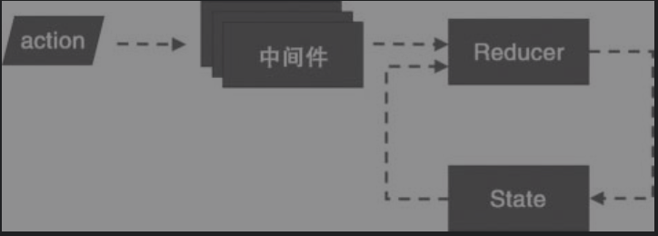



# 深入浅出React和Redux

## 3 从Flux到Redux

### 3.1 Flux

Flux贯彻的最重要的观点——**单向数据流**

#### 3.1.1 MVC的缺陷


MVC的架构，请求必须要全部经过controller。但是很多时候，为了简单，view和model直接会直接交互

FLUX架构


所有的交互都是单向的。Action触发Dispatcher, Dispatcher分发Action给Store。Store来更新View，View上的点击再产生Action来触发Dispatcher

**其实不考虑名字，就是把MVC改成如下形式了**

request => controller => model => view => controller

#### 3.1.2 Flux应用

##### 1 Dispatcher

src/AppDispatcher.js

```js
import {Dispatcher} from 'flux';
export default new Dispatcher();
```

##### 2 Action

src/ActionType.js

```js
export const INCREMENT = 'increment';
export const DECREMENT = 'decrement';
```

src/Action.js  定义的是可以dispatch该Action的函数

```js
import * as ActionTypes from './ActionType.js';
import AppDispatcher from './AppDispatcher.js';
export const increment = (conterCaption) =>{
  AppDispatcher.dispatch({
      type: ActionTypes.INCREMENT,
      counterCaption 
  });  
};
export const decrement = (conterCaption) =>{
  AppDispatcher.dispatch({
      type: ActionTypes.DECREMENT,
      counterCaption 
  });  
};
```

##### 3 Store

需要2个store，一个存3个counter组件的数据，一个存3个counter组件的总和

src/stores/CounterStore.js

```js
const counterValues = {
    'First':0,
    'Second': 10,
    'Third': 30
};
//为了不依赖view，store是一个EventEmitter的子类，这样可以通过emit发送event
const CounterStore = Object.assign({},EventEmitter.prototype,{
    getCounterValues: ()=>({counterValues}), //应该要返回一个immutable数据，这样就可以保证不让view修改
    emitChange: ()=>{this.emit(CHANGE_EVENT)},
    addChangeListener: (callback)=>{this.on(CHANGE_EVENT,callback)},
    removeChangeListener: (callback)=>			  
                    {this.removeListener(CHANGE_EVENT,callback)},
});
//注册到Dispatcher实例上
import AppDispatcher from '../AppDispatcher.js';
//这个回调才是dispatch真正的操作
CounterStore.dispatchToken = AppDipatcher.register(
    (action) => {
        if(action.type === ActionTypes.INCREMENT){
            counterValues[action.counterCaption] ++;
            CounterStore.emitChange();
        }else if(action.type === ActionTypes.DECREMENT){
            counterValues[action.counterCaption] --;
            CounterStore.emitChange();
        }
    }
);
```

src/stores/SummaryStore.js的emitChange/addChangeListener/removeChangeListener和Counter类似

```js
import CounterStore from './CounterStore.js'
import AppDispatcher from '../AppDispatcher.js';

function computeSummary(counterValues){
    let summary = 0;
    for (const key in counterValues){
        if(counterValues.hasOwnProperty(key)){
            summary += counterValues[key];
        }
    }
    return summary;
}

const SummaryStore = Object.assign({},EventEmitter.prototype,{
    //计算总和
   getSummary: ()=>({computeSummary(CounterStore.getCounterValues())}) ,
   emitChange: ()=>{this.emit(CHANGE_EVENT)},
   addChangeListener: (callback)=>{this.on(CHANGE_EVENT,callback)},
   removeChangeListener: (callback)=>			  
                    {this.removeListener(CHANGE_EVENT,callback)},
});

SummaryStore.dispatchToken = AppDispatcher.register(
    (action) => {
        if((action.type === ActionTypes.INCREMENT)||
          (action.type === ActionTypes.DECREMENT)){
            //确认先发给CounterStore
            AppDispatcher.waitFor([CounterStore.dispatchToken]);
            SummaryStore.emitChange();
        }
    }
);
```

***JavaScript是单线程的语言，不可能有线程之间的等待这回事***

Store上只是存储View获取数据的方法，还有Dispatcher如何更新数据的回调函数

##### 4 View

src/views/ControlPanel.js

```js
function CountrolPanel(props){
    return (
        <div>
        	<Counter caption="First"/>
	        <Counter caption="Second"/>
     	    <Counter caption="Third"/>
            <hr/>
            <Summary/>
        </div>
    );
}
```

src/view/Counter.js

```js
class Counter extend React.Component {
    state = {
        //显示只和Store有关
        count: CounterStore.getCounterValues()[this.props.caption],
    };
    
    componentDidMount(){
        CounterStore.addChangeListener(this.onChange);
    }
    
    onChange = ()=>{
        //显示只和Store有关
        const newCount = CounterStore.getCounterValues()[this.props.caption];
        this.setState({count:newCount});
    };
    
    onClickIncrementBtn = ()=>{
      //更新只和Actions有关
      Actions.increment(this.props.caption);  
    };
    
    onClickDecrementBtn = ()=>{
      //更新只和Actions有关  
      Actions.decrement(this.props.caption);  
    };
    
    render() {
        const {caption} = this.props;
        return (
            <div>
            	<button onClick = {this.onClickIncrement}>+</button>
                <button onClick = {this.onClickDecrement}>-</button>
    			<span>{caption} count: {this.state.count}</span>
            </div>
        );
    }
}
```

#### 3.1.3 Flux的好处

总的来说就是单向数据流，禁止了view层去修改model层的数据

### 3.2 Redux

#### 3.2.1 Redux的基本原则

Redux在Flux基础上强调三个基本原则：

1. 唯一数据源（Single Source of Truth）；只有1个store

2. 保持状态只读（State is read-only）；不允许view改变state

3. 数据改变只能通过纯函数完成（Changes are made with pure functions）。

   view通过reducer来返回一个新的state，然后让redux框架来改变state

Reducer表示一种函数类型，输入时上一次的state和这一次更新的要求，返回一个新的state。但是不改变输入的上一次state

```js
//Redux规定的Reducer
Reducer(state,action)
```

Redux的流程

Store =^getState^=> View = ^Action^ => Store.dispatch => Reducer = ^state^ = > Store

#### 3.2.2 Redux实例

##### 1 Action

1. ActionTypes.js 和 flux一样
2. Actions.js 返回的是一个Action对象。flux是调用Dispatcher.dispatch()

```js
import * as ActionTypes from './ActionTypes.js'

export const increment = (counterCaption) => {
  return {
      type: ActionTypes.INCREMENT,
      counterCaption: counterCaption
  }  
};
//decrement 类似
```

因为Redux只有1个store，所以不需要Dispatcher分发action对象给多个store

##### 2 Store

store.js

```js
import {createStore} from 'redux';
import reducer from './Reducer.js';

const initValues = {
    'First':0,
    'Second': 10,
    'Third': 20
};

const store = createStore(reducer,initValues);
export default store;
```

##### 3 Reducer

reducer.js

```js
import * as ActionTypes from './ActionTypes.js';

export default (state,action) => {
    const {counterCaption} = action;
    
    swtich(action.type){
        case ActionTypes.INCREMENT:
	        return {...state,[counterCaption]: state[counterCaption]+1};
        case ActionTypes.DECREMENT:
	        return {...state,[counterCaption]: state[counterCaption]-1};
        default:
        	return state;
    }
}
```

纯函数，不修改state状态。类似的代码Flux放在store中store.dispatchToken = AppDipatcher.register((action)=>{...})

##### 4 View

views/Counter.js

```js
import store from '../Store.js';

class Counter extends Component {
    constructor(props){
        super(props);
        ...
        this.state = this.getOwnState();
    }
    //获取状态
    getOwnState(){
        return {
            value: store.getState()[this.props.caption];//显示
        };
    }
    
    //保持更新
    onChange(){
        this.setState(this.getOwnState());
    }
    componentDidMount() {
        store.subscribe(this.onChange);
    }
    componentWillUnmount(){
        store.unsubscribe(this.onChange);
    }
    //更新状态
    onIncrement(){
        store.dispatch(Actions.increment(this.props.caption));
    }
    onDecrement(){...}
    
    render(){
        const value = this.state.value;
        const {caption} = this.props;
        
        return(
            <div>
            	<button onClick = {this.onIncrement}> + </button>
                <button onClick = {this.onDecrement}> - </button>
            </div>
        );
    }
}
```

#### 3.2.3 容器组件和傻瓜组件

容器组件 - 负责和Redux Store交互

傻瓜(展示)组件 - 只单纯赋值渲染

#### 3.2.4 组件Context

因为一个应用只有一个Store，最好有个方法把Store传递个各个需要的子组件。而不是通过props一层层传递

React提供Context，可以让树状组件上所有组件能访问同一个对象

Provider.js来提供Context

```js
import {PropTypes,Component} from 'react';

class Provider extends Component {
    getChildContext(){
        return {
          store: this.props.store  //提供获取store的方法
        };
    }
    
    render(){
        return this.props.children; //渲染子组件
    }
}
//让Provider能够被React认可为一个Context的提供者
Provider.childContextTypes = {
  store: PropTyoes.object  
};
//表示props里store一定要输入
Provider.propTypes = {
  store: PropTypes.object.isRequired
}
export default Provider;
```

index.js

```js
ReactDOM.render(
  <Provider store={store}>
    <ControlPanel />
  </Provider>,
  document.getElementById('root')
);
```

view/Counter.js

```js
class CounterContainer extends Component {
    ...
    onIncrement() {
    	this.context.store.dispatch(Actions.increment(this.props.caption));
	}
	...    
}
CounterContainer.propTypes = {
  caption: PropTypes.string.isRequired //proptype用于类型检查
};

CounterContainer.contextTypes = {
  store: PropTypes.object//使用的时候要先声明要用
}

export default CounterContainer;
```

#### 3.2.5 React-Redux

主要提供1了两个功能

1. connect：连接容器组件和傻瓜组件；
2. Provider：提供包含store的context。

##### connect

```js
export default connnect(mapStateToProps, mapDispatchToProps)(Counter);
```

connect参数：

​			mapStateToProps -  把store上的state转成prop传给傻瓜组件

​			mapDispatchToProps - 把组件内部的用户动作转成dispatch给store

connect返回值： 还是一个函数。再输入counter作为参数，并立即执行。这个函数返回一个新的Counter组件

Counter的对应函数

```js
function mapStateToProps(state,ownProps){
    return {
        value: state[ownProps.caption]
    }
}

function mapDispatchToProps(dispatch,ownProps){
    return {
        onIncrement: ()=>{
          dispatch(Actions.increment(ownProps.caption));
        },
    }
}
```

##### Provider

检查Store是否提供了3个函数

subscribe

dispatch

getState

## 4 模块化React和Redux应用

### 4.3 模块接口

import整个目录，然后在目录中建立index.js，所有该目录下想要export的接口都只在在index.js中定义

### 4.4 状态树设计

1. 一个模块控制一个状态节点
2. 避免冗余数据
3. 树形结构扁平。

### 4.5 Todo应用实例

分todos和filter两个目录

#### 4.5.1 最外层代码

index.js

```js
ReactDOM.render(
  <Provider store={store}>
    <TodoApp />
  </Provider>,
  document.getElementById('root')
);
```

TodoApp.js

```js
function TodoApp() {
  return (
    <div>
      <Todos />
      <Filter />
    </div>
  );
}

export default TodoApp;
```

#### 4.5.2 action构造函数

todo/actions.js

```js
import {ADD_TODO, TOGGLE_TODO, REMOVE_TODO} from './actionTypes.js';

let nextTodoId = 0;

export const addTodo = (text) => ({
  type: ADD_TODO,
  completed: false,
  id: nextTodoId ++,
  text: text
});

export const toggleTodo = (id) => ({
  type: TOGGLE_TODO,
  id: id
});

export const removeTodo = (id) => ({
  type: REMOVE_TODO,
  id: id
});
```

#### 4.5.3 组合reducer

Store.js

```js
const win = window;
win.Perf = Perf

const reducer = combineReducers({
  todos: todoReducer,
  filter: filterReducer
}); //组合两个reducer

const middlewares = [];
if (process.env.NODE_ENV !== 'production') {
  middlewares.push(require('redux-immutable-state-invariant')());
}

const storeEnhancers = compose(
  applyMiddleware(...middlewares),
  (win && win.devToolsExtension) ? win.devToolsExtension() : (f) => f,
);

export default createStore(reducer, {}, storeEnhancers);
```

todos/reducer.js

```js
export default (state = [], action) => {
  switch(action.type) {
    case ADD_TODO: {
      return [
        {
          id: action.id,
          text: action.text,
          completed: false
        },
        ...state
      ]
    }
    case TOGGLE_TODO: {
      return state.map((todoItem) => {
        if (todoItem.id === action.id) {
           return {...todoItem, completed: !todoItem.completed};
        } else {
          return todoItem;
        }
      })
    }
    case REMOVE_TODO: {
      return state.filter((todoItem) => {
        return todoItem.id !== action.id;
      })
    }
    default: {
      return state;
    }
  }
}
```

#### 4.5.4 Todo视图

##### 1 todos视图

todos/views/todos.js

```js
export default () => {
  return (
    <div className="todos">
      <AddTodo />
      <TodoList />
    </div>
  );
}
```

todos/views/addTodo.js

```js
class AddTodo extends Component {

  constructor(props, context) {
    super(props, context);

    this.onSubmit = this.onSubmit.bind(this);
    this.refInput = this.refInput.bind(this);
  }

  onSubmit(ev) {
    ev.preventDefault(); //取消post form引发的网页跳转

    const input = this.input;//ref的DOM node记录在input里
    if (!input.value.trim()) {
      return;
    }

    this.props.onAdd(input.value); //绑定dispatch
    input.value = '';
  }

  refInput(node) {
    this.input = node; //使用ref
  }

  render() {
    return (
      <div className="add-todo">
        <form onSubmit={this.onSubmit}>
          //ref在这里引用
          <input className="new-todo" ref={this.refInput} />
          <button className="add-btn" type="submit">
            添加
          </button>
        </form>
      </div>
    )
  }
}

AddTodo.propTypes = {
  onAdd: PropTypes.func.isRequired
};


const mapDispatchToProps = (dispatch) => {
  return {
    onAdd: (text) => {
      dispatch(addTodo(text)); //分发action
    }
  }
};

export default connect(null, mapDispatchToProps)(AddTodo);
```

todos/views/todoList.js 傻瓜组件

```js
const TodoList = ({todos, onToggleTodo, onRemoveTodo}) => {
  return (
    <ul className="todo-list">
    {
      todos.map((item) => (
        <TodoItem
          key={item.id} //为了渲染加速
          text={item.text}
          completed={item.completed}
          onToggle={() => onToggleTodo(item.id)}
          onRemove={() => onRemoveTodo(item.id)}
        />
        ))
    }
    </ul>
  );
};
TodoList.propTypes = {
  todos: PropTypes.array.isRequired
};
//store的filter状态来影响显示
const selectVisibleTodos = (todos, filter) => {
  switch (filter) {
    case FilterTypes.ALL:
      return todos;
    case FilterTypes.COMPLETED:
      return todos.filter(item => item.completed);
    case FilterTypes.UNCOMPLETED:
      return todos.filter(item => !item.completed);
    default:
      throw new Error('unsupported filter');
  }
}

const mapStateToProps = (state) => {
  return {
    todos: selectVisibleTodos(state.todos, state.filter)
  };
}

const mapDispatchToProps = (dispatch) => {
  return {
    onToggleTodo: (id) => {
      dispatch(toggleTodo(id));
    },
    onRemoveTodo: (id) => {
      dispatch(removeTodo(id));
    }
  };
};

/* 简写
const mapDispatchToProps = (dispatch) => bindActionCreators({
  onToggleTodo: toggleTodo,
  onRemoveTodo: removeTodo
}, dispatch);
*/

export default connect(mapStateToProps, mapDispatchToProps)(TodoList);
```

todos/views/todoItem.js

```js
const TodoItem = ({onToggle, onRemove, completed, text}) => {
  const checkedProp = completed ? {checked: true} : {};
  return (
    <li
      className="todo-item"
      style={{
        textDecoration: completed ? 'line-through' : 'none'
      }}
    >
      <input className="toggle" type="checkbox" {...checkedProp} readOnly onClick={onToggle} />
      <label className="text">{text}</label>
      <button className="remove" onClick={onRemove}>×</button>
    </li>
  )
}
```


## 5 React组件的性能优化

### 5.1 单个组件的优化

以上组件如果有两个TodoItem，点击一个check的时候，会造成另一个组件重新渲染

因为点击check为引发TodoList重新渲染，即使传给子组件的prop没有更新，也会造成TodoList下所有子组件重新渲染

需要在todoItem.js中加入以下代码

```js
shouldComponentUpdate(nextProps,nextState) {
    return (nextProps.completed !== this.props.completed) ||
        (nextProps.text !== this.props.text);
}
```

connect会自动为这个组件添加以上方法，判断只有当props变化时，才会渲染

但上面即使在todoItem.js加入以下代码，还是每次都会被渲染

```js
export default connect()(TodoItem);
```

原因在于shouldComponentUpdate做的是对于props的浅比较，只看props里是不是对同一个对象的引用。所以如下代码每次都会产生一个新的对象引用传递给props

```js
onToggle={() => onToggleTodo(item.id)}
onRemove={() => onRemoveTodo(item.id)}
```

为了每次传入同样的对象，修改如下

todolist.js

```js
 <TodoItem
    key={item.id} //为了渲染加速
    text={item.text}
    completed={item.completed}
    onToggle={onToggleTodo}
    onRemove={onRemoveTodo}
/>
```

todoItem.js

```js
const mapDispatchToProps = (dispatch, ownProps) => ({
   onToggleItem: () => ownProps.onToggle(ownProps.id)
});
```

### 5.2 多个组件的优化

#### 5.2.1 React的Reconciliation过程

React如何在virtual DOM 树中找到不同之处然后触发更新，这个过程叫做Reconciliation

React实际采用的算法需要的时间复杂度是O(N)

1. 如果根节点不同，直接重构根节点下所有DOM树
2. 子节点比较标签的属性和内容，有变化的才更新
3. 如果子节点是react组件，按如下方式引发组件更新
   1. shouldComponentUpdate  -  return false就不更新
   2. componentWillReceiveProps
   3. componentWillUpdate
   4. render
   5. componentDidUpdate
4. 多个子组件，如果子组件顺序变化，会导致全部更新。需要key来保证不做无效更新

#### 5.2.2 Key的用法

以下代码如果没有key值，就会需要全部更新

```jsx
<ul>
    <TodoItem key={0}></TodoItem> //添加这条不会引起下面两个组件更新
    <TodoItem key={1}></TodoItem>
    <TodoItem key={2}></TodoItem>
</ul>
```

不要把数组index作为key值，因为每次获取数组的顺序可能会变

key和ref是React保留的两个特殊prop，并没有预期让组件直接访问

### 5.3 用reselect提高数据获取性能

在之前的例子了，为了根据Store中提供的State更新view。通过mapStateToProps -> selectVisibleTodos来渲染数据

```js
const selectVisibleTodos = (todos, filter) => {
  switch (filter) {
    case FilterTypes.ALL:
      return todos;
    case FilterTypes.COMPLETED:
      return todos.filter(item => item.completed);//遍历所有todos，要优化
    case FilterTypes.UNCOMPLETED:
      return todos.filter(item => !item.completed);
    default:
      throw new Error('unsupported filter');
  }
}

const mapStateToProps = (state) => {
  return {
    todos: selectVisibleTodos(state.todos, state.filter)
  };
}

```

#### 5.3.1 两阶段选择过程

reselect库的工作原理：只要相关状态没有改变，那就直接使用上一次的缓存结果

reselect先比较和上次输入是否一致，不一致再继续计算

```js
import {createSelector} from 'reselect';
import {FilterTypes} from '../constants.js';

const getFilter = (state) => state.filter;
const getTodos = (state) => state.todos;

export const selectVisibleTodos = createSelector(
  [getFilter, getTodos],
  (filter, todos) => {
    switch (filter) {
      case FilterTypes.ALL:
        return todos;
      case FilterTypes.COMPLETED:
        return todos.filter(item => item.completed);
      case FilterTypes.UNCOMPLETED:
        return todos.filter(item => !item.completed);
      default:
        throw new Error('unsupported filter');
    }
  }
);
```

createSelector函数

第一个参数是一个函数数组，每个元素代表了选择器步骤一需要做的映射计算

第二个参数代表步骤二的计算过程

#### 5.3.2 范式化状态树

所谓范式化，就是遵照关系型数据库的设计原则，减少冗余数据

范式化的数据结构设计就是要让一份数据只存储一份

反范式化设计 - type 字段

```js
const item = {
  id:1,
  xx: xx,
  type:{
      name: "aaa",
      color: "red",
  }
};
```

范式化设计

```js
const item = {
  id: 1,
  xx: xx,
  typeId: 1,  
};

const type = {
    id:1,
    name: "aaa",
    color: "red",
}
```

## 6 React高级组件

如何复用代码

### 6.1 高阶组件(Higher Order Component)

一个函数，输入是个组件，输出也是个组件

简单例子，取消user props的传入

```js
import React from 'react';

function removeUserProp(WrappedComponent) {
  return class WrappingComponent extends React.Component {
      render(){
          const {user,...otherProps} = this.props;
          return <WrappedComponent {...otherProps}/>
      }
  }
}

export default removeUserProp;
```

#### 6.1.1 代理方式的高阶组件

代理方式的特点就是返回的是一个React.Component的子类

应用场景

1. 操纵prop

2. 访问ref

3. 抽取状态(connect)

   自己实现一个connect函数

   ```js
   import React from 'react';
   
   const doNothing = () => ({});
   
   function connect(mapStateToProps=doNothing, mapDispatchToProps=doNothing) {
       
     function getDisplayName(WrappedComponent) {
       return WrappedComponent.displayName ||
         WrappedComponent.name ||
         'Component';
     }
   
     return function(WrappedComponent) {
       class HOCComponent extends React.Component {
         constructor() {
           super(...arguments);
   
           this.onChange = this.onChange.bind(this); //注册onChange
   
           this.store = {};
         }
   
         componentDidMount() {
           //从context里获取Store，然后调用subscribe，保证Store变化会调用onChange
           this.context.store.subscribe(this.onChange); 
         }
   
         componentWillUnmount() {
           this.context.store.unsubscribe(this.onChange);
         }
   
         onChange() {
           this.setState({});//仅用于驱动整个组件更新
         }
   
         render() {
           const store = this.context.store;
           //作为props传入
           const newProps = {
             ...this.props,
             ...mapStateToProps(store.getState(), this.props),
             ...mapDispatchToProps(store.dispatch, this.props)
           }
           return <WrappedComponent {...newProps} />;
         }
       };
   	//要求的context type
       HOCComponent.contextTypes = {
         store: React.PropTypes.object
       }
   
       HOCComponent.displayName = `Connect(${getDisplayName(WrappedComponent)})`;
   
       return HOCComponent;
     };
   }
   
   export default connect;
   ```

   

4. 包装组件 

   给组件添加样式

   ```js
   const styleHOC = (WrappedComponent, style) => {
     return class HOCComponent extends React.Component {
       render() {
         return (
           <div style={style}>
             <WrappedComponent {...this.props}/>
           </div>
         );
       }
     };
   };
   
   ```

#### 6.1.2 继承方式的HOC

返回的组件就直接继承自WrappedComponent

简单示例

```js
function removeUserProp(WrappedComponent) {
  return class NewComponent extends WrappedComponent {
    render() {
      const {user, ...otherProps} = this.props;
      this.props = otherProps;
      return super.render();
    }
  };
}
```

和代理最大的区别在于如何使用被wrapper的组件

```js
//代理方式 在render函数中
return <WrappedComponent {...otherProps} />
//继承 render()中
return super.render();
```

代理是两个组件，两个生命周期。继承是一个

应用场景 - 操作声明函数

***“优先考虑组合，然后才考虑继承。”（Composition over Inheritance）***

#### 6.1.3 HOC的显示名

设置displayName属性给HOC赋值一个显示名

### 6.2 以函数为子组件

直接在render中调用this.props.children(parm)传入parm，而不是通过props

```js
class AddUserProp extends React.Component {
    render(){
        const user = "xxx";
        return this.props.children(user);
    }
}

AddUserProp.propTypes = {
    children: React.PropTypes.func.isRequired
}

//使用方法
<AddUserProp>
    {(user)=> <div>{user}</div>}
</AddUserProp>    
// 也可以通过子组件的props传入
<AddUserProp>
    {(user)=> <Foo user={user}/>}
</AddUserProp>    
```

但是这样用，每次渲染箭头函数都会重建，所以无法在子组件的shouldComponentUpdate中加判断来做性能优化

## 7 Redux和服务器通信

### 7.1 React组件访问服务器

在React应用中使用浏览器原生支持的fetch函数来访问网络资源，fetch函数返回的结果是一个Promise对象，Promise模式能够让需要异步处理的代码简洁清晰，这也是fetch函数让大家广为接受的原因。

对于不支持fetch的浏览器版本，也可以通过fetch的polyfill来增加对fetch的支持

#### 7.1.1 代理功能访问API

代码中调用

```js
fetch(http://xxx.com/yyy)
```

不能直接访问，因为相当于在本地网页访问另外一个域名。属于跨域访问，很多网站是不支持跨域访问API的。所以要用Proxy模式

先访问本地网站服务器，服务器再把这个请求转发到另一个域名

create-react-app创造的应用已经具备了代理功能。只需要在package.json加入下行

```json
"proxy": "http://xxx.com/",
```

#### 7.1.2 React组件访问服务器的生命周期

访问服务器的代码

```js
 componentDidMount() {
    const apiUrl = `/data/cityinfo/${cityCode}.html`;
    fetch(apiUrl).then((response) => { //fetch返回一个Promise,成功调用then，失败调用catch
      if (response.status !== 200) { //404也是返回成功，需要额外检查status
        throw new Error('Fail to get response with status ' + response.status);
      }

      response.json().then((responseJson) => { //json转换也是异步的
        this.setState({weather: responseJson.weatherinfo});
      }).catch((error) => {
        this.setState({weather: null});
      });
    }).catch((error) => {
      this.setState({weather: null});
    });
  }
```

这样做最大的问题就是通过组件内部的state来管理

### 7.2 Redux访问服务器

#### 7.2.1 redux-thunk中间件

回顾Redux流程

Store =^getState^=> View = ^Action^ => Store.dispatch => Reducer = ^state^ = > Store

Redux-thunk的插入时机

Store =^getState^=> View = ^AsyncAction^ => Redux-thunk => Store.dispatch => Reducer = ^state^ = > Store



> thunk的含义
>
> ​	辅助调用另一个子程序的子程序

```js
const f = (x) => (x()+5);
const g = ()=>(3+4);
f(g);
//函数g就是一个thunk
```

引入redux-thunk

```js
import thunkMiddleware from 'redux-thunk'
const middlewares = [thunkMiddleware];
```

#### 7.2.2 异步action对象

生成一个函数类型的action对象，redux-thunk会截取这个action不再发送给Reducer

一个计数器延时1s加一的例子

```js
const increment = () => ({type: Actiontypes.INCREMENT}); //同步
const incrementAsyn = () => {
    //返回的是一个箭头函数
    return (dispatch) => {
      setTimeout(()=>{
          dispatch(increment()); //超时后执行同步
      },1000);  
    };
}; //异步
```

#### 7.2.3 异步操作的模式

异步Action发起网络访问

actions.js

```js
export const fetchWeather = (cityCode) => {
  return (dispatch) => {
    const apiUrl = `/data/cityinfo/${cityCode}.html`;

    dispatch(fetchWeatherStarted()) //先进入start状态

    return fetch(apiUrl).then((response) => {
      if (response.status !== 200) {
        throw new Error('Fail to get response with status ' + response.status);
      }

      response.json().then((responseJson) => {
        dispatch(fetchWeatherSuccess(responseJson.weatherinfo)); //访问成功
      }).catch((error) => {
        dispatch(fetchWeatherFailure(error));//访问失败
      });
    }).catch((error) => {
      dispatch(fetchWeatherFailure(error));
    })
  };
}
```

#### 7.2.4 异步操作的中止

在ES6的标准中，Promise对象是不存在“中断”这样的概念的

如何中止一个已经发出的网络请求

```js
export const fetchWeather = (cityCode) => {
  return (dispatch) => {
    const apiUrl = `/data/cityinfo/${cityCode}.html`;

    const seqId = ++ nextSeqId; //对每次异步请求编号

    const dispatchIfValid = (action) => {
      if (seqId === nextSeqId) {
        return dispatch(action); //只有最新的异步请求才会dispatch
      }
    }

    dispatchIfValid(fetchWeatherStarted())

    fetch(apiUrl).then((response) => {
      if (response.status !== 200) {
        throw new Error('Fail to get response with status ' + response.status);
      }

      response.json().then((responseJson) => {
        dispatchIfValid(fetchWeatherSuccess(responseJson.weatherinfo));
      }).catch((error) => {
        dispatchIfValid(fetchWeatherFailure(error));
      });
    }).catch((error) => {
      dispatchIfValid(fetchWeatherFailure(error));
    })
  };
}

```

### 7.3 Redux异步操作的其他方法

辅助进行异步操作的库还有：

1. redux-saga
2. redux-effects
3. redux-side-effects
4. redux-loop
5. redux-observable

## 8 单元测试

### 8.1 单元测试的原则

测试的不同分类

1. 从人工操作还是写代码来操作的角度，可以分为手工测试和自动化测试
2. 从是否需要考虑系统的内部设计角度，可以分为白盒测试和黑盒测试
3. 从测试对象的级别，可以分为单元测试、集成测试和端到端测试
4. 从测试验证的系统特性，又可以分为功能测试、性能测试和压力测试

纯函数才容易测试

### 8.2 单元测试环境搭建

#### 8.2.1 单元测试框架

1. 用Mocha测试框架，但是Mocha并没有断言库，所以往往还要配合Chai断言库来使用，也就是Mocha+Chai的组合
2. 使用React的本家Facebook出品的Jest, Jest自带了断言等功能，相当于包含了Mocha和Chai的功能，不过Jest的语法和Chai并不一致。

在create-react-app创建的应用中自带了Jest库

## 9 扩展Redux

### 9.1 中间件

#### 9.1.1 中间件接口

dispatch - middleware - reducer

一个什么也不做的middleware

```js
//参数是个对象{dispatch,getState}，对应Redux Store上同名函数
function doNothingMiddleware({dispatch,getState}){
    return function(next){ //这个next是指下一个中间件，作为参数输入
        return function(action){ //处理action，真正的工作
            return next(action); //把控制器交给下一个中间件
        }
    }
}
```

为什么这个next不直接作为doNothingMiddleware的输入参数，因为Redux用了函数式编程思想。函数式编程的一个重要思想就是让每个函数的功能尽量小，然后通过函数的嵌套组合来实现复杂功能

Redux-thunk的实现

```js
function createThunkMiddleware(extraArgument){
    return ({dispatch,getState}) => next => action => {
        if(type of action === 'function'){
            return action(dispatch,getState,extraArgument); //执行异步action
        }
        return next(action);
    };
}
const thunk = createThunkMiddleware();
export default thunk;
```

使用了ES6的箭头方式表示函数，连续的=>符号表示的是返回函数的函数，比如下面的代码写法，实际效果和上面的doNothinigMiddleware一样

```js
({dispatch,getState}) => next => action => next(action)
```

#### 9.1.2 使用中间件

第一种方法

```js
//applyMiddleware(thunkMiddleware)产生一个函数，这个函数是一个StoreEnhancer
const configureStore = applyMiddleware(thunkMiddleware)(createStore);
const store = configureStore(reducer,initialState);
```

第二种方法，把applyMiddleware的结果和其他Enhancer一起作为参数传入createStore

```js
const win = window;
const storeEnhancers = compose(
  applyMiddleware(...middlewares),
  (win && win.devToolsExtension) ? win.devToolsExtensiont(): f=>f
);
const store = createStore(reducer,storeEnhancers);
```

#### 9.1.3 Promise中间件

```js
function isPromise(obj) {
  return obj && typeof obj.then === 'function';
}

export default function promiseMiddleware({dispatch}) {
  return (next) => (action) => {
    const {types, promise, ...rest} = action;
    if (!isPromise(promise) || !(action.types && action.types.length === 3)) {
      return next(action);
    }

    const [PENDING, DONE, FAIL] = types;

    dispatch({...rest, type: PENDING});
    return action.promise.then(
      (result) => dispatch({...rest, result, type: DONE}), //把fetch的调用简化了
      (error) => dispatch({...rest, error, type: FAIL})
    );
  };
}
```

### 9.2 Store Enhancer

#### 9.2.1 增强器接口

Redux提供的创建Store的函数叫createStore，这个函数除了可以接受reducer和初始状态（preloadedState）参数，还可以接受一个Store Enhancer作为参数，Store Enhancer是一个函数，这个函数接受一个createStore模样的函数为参数，返回一个新的createStore函数

一个什么都不做的Store Enhancer

```js
const doNothingEnhancer = (createStore) => (reducer, preloadedState, enhancer) => {
    const store = createStore(reducer,preloadedState, enhancer);
    return store;
}
```

实现一个Store Enhancer，功夫全在于如何定制产生的store对象

一个store对象中包含下列接口：

1. dispatch
2. subscribe
3. getState
4. replaceReducer

logEnhance增强器给每个dispatch函数的调用都输出一个日志

```js
const logEnhancer = (createStore) => (reducer,preloadedStore,enhancer) => {
    const store = createStore(reducer,preloadedStore,enhancer);
    const originalDispatch = store.dispatch;
    store.dispatch = (action) => {
        console.log('dispatch action:',action);
        originalDispatch(action);
    }
    return store;
}
```

## 10 动画

### 10.1 动画的实现方式

#### 10.1.1 CSS3方式

CSS性能好，可以用到GPU。但是交互感不行

#### 10.1.2 脚本方式

最原始的方法就是用setInterval和setTimeout实现

但是如果渲染时间比较长，setInterval和setTimeout并不能保证在指定时间间隔或者延迟的情况下准时调用指定函数

还有种方法是采用raf（request animation frame）的方法。根据时间间隔来确认本次是否渲染delay的时间

```html
<!DOCTYPE html>
<html>
  <head>
    <style>
#sample {
  position: absolute;
  background: red;
  width: 100px;
  height: 100px;
}
    </style>
  </head>
  <body>
    <div id="sample" />
    <script type="text/javascript">

        var lastTimeStamp = new Date().getTime();
        function raf(fn) {
          var currTimeStamp = new Date().getTime();
          var delay  = Math.max(0, 16 - (currTimeStamp - lastTimeStamp));
          var handle = setTimeout(function(){
            fn(currTimeStamp);
          }, delay);
          lastTimeStamp = currTimeStamp;
          return handle;
        }

        var left = 0;
        var animatedElement = document.getElementById("sample");
        var startTimestamp = new Date().getTime();
        function render(timestamp) {
          left += (timestamp - startTimestamp) / 16;
          animatedElement.style.left = left + 'px';
          if (left < 400) {
            raf(render); //通过raf计算时间间隔
          }
        }

        raf(render);


    </script>
  </body>
</html>
```

现代浏览器提供了一个新的函数requestAnimationFrame，采用的就是上面描述的思路，不是以固定16毫秒间隔的时间去调用渲染过程，而是让脚本通过requestAnimationFrame传入一个回调函数，表示想要渲染一帧画面，浏览器会决定在合适的时间来调用给定的回调函数，而回调函数的工作是要根据逝去的时间来决定将界面渲染成什么样子

### 10.2 ReactCSSTransitionGroup

导入库

```js
import TransitionGroup from 'react-addons-css-transition-group'
```

TransitionGroup的工作就是帮助组件实现装载过程和卸载过程的动画，而对于更新过程，并不是TransitionGroup要解决的问题。

#### 10.2.1 Todo应用动画

views/todoList.js

```jsx
import './todoItem.css';

const TodoList = ({todos}) => {
  return (
    <ul>
      //在动画开始时给Item组件加上fade-enter/fade-enter-active, 500ms后移除 
      <TransitionGroup transitionName="fade" transitionEnterTimeout={500} transitionLeaveTimeout={200}> //多了一个这个组件,所有相关类都以fade开头
    {
      todos.map((item) => (
        <TodoItem
          key={item.id}
          id={item.id}
          text={item.text}
          completed={item.completed}
        />
        ))
    }
      </TransitionGroup>
    </ul>
  );
};
```

todoItem.css

```css
.fade-enter{
  opacity: 0.01;
}

.fade-enter.fade-enter-active {
  opacity: 1;
  transition: opacity 500ms ease-in; //完成动画的时间500ms
}

.fade-leave {
  opacity: 1;
}

.fade-leave.fade-leave-active {
  opacity: 0.01;
  transition: opacity 200ms ease-in;
}
```

#### 10.2.2 ReactCSSTransitionGroup规则

##### 1 CSS类名规则

配合TransitionGroup中的transitionName属性，对应的CSS规则中类名遵从统一的规则。再类名由-符号把几个单词连接起来，除了transitionName的值，还可以有这几个单词：enter代表“装载”开始时的状态，leave代表“卸载”开始时的状态，active代表动画结束时的状态

##### 2 动画时间长度

使用TransitionGroup，动画持续的时间在两个地方都要指定，第一个是在Transition-Group中以Timeout为结尾的属性，比如transitionEnterTimeout和transitionLeave-Timeout，第二个地方是在CSS文件中的transition-duration规则。

##### 3 装载时机

TransitionGroup要先装载才能生效，所以要包住所有的子组件

##### 4 首次装载

TransitionGroup实例装载完成之后，新加入的TodoItem组件算是“进入”，但是随TransitionGroup实例一起装载的TodoItem组件不算“进入”

TransitionGroup的appear也有对应的transitionAppearTimout属性，对应的CSS类符合一样的模式，以-appear和-appear-active为结尾，对应Todo应用中的例子，就是fade-appear和fade-apppear-active类

### 10.3 React-Motion动画库

#### 10.3.1 React-Motion的设计原则

react-motion提出用另外两个参数来定义动画，一个是刚度（stiffness），另一个是阻尼（damping）

倒计时从100到0

```jsx
<Motion
	defaultStyle={{x:100}}
    style={
        {x:spring(0,{stiffness:100,damping:100})}
	}
>
    {value => <div>{Math.ceil(value.x)}</div>}
</Motion>
```

在Motion中，利用的是requestAnimationFrame函数来触发子组件函数

## 11 多页面应用

### 11.1 单页应用

传统的多页面实现方式

1. 浏览器的地址栏发生变化指向新的URL，于是浏览器发起一个HTTP请求到服务器获取页面的完整HTML
2. 浏览器获取到HTML内容后，解析HTML内容
3. 浏览器根据解析的HTML内容确定还需要下载哪些其他资源，包括JavaScript和CSS资源
4. 浏览器会根据HTML和其他资源渲染页面内容，然后等待用户的其他操作

单页应用要达到的目标

1. 不同页面之间切换不会造成网页的刷新
2. 页面内容和URL保持一致
   1. 当页面切换的时候，URL会对应改变，这通过浏览器的History API可以实现在不刷新网页的情况下修改URL
   2. 用户在地址栏直接输入某个正确的URL时，网页上要显示对应的正确内容。用户直接输入URL，该页应该显示所有内容。`“可收藏”（Bookmarkable）应用`

为了做到可收藏，React的做法是。服务器返回HTML没有可视内容，只是引入JS。所有页面都依赖浏览器渲染

### 11.2 React-Router

每个URL都包含域名部分和路径（path）部分，例如对于URLlocalhost:3000/home来说，路径部分是home。决定一个URL显示什么内容的只有路径部分。根据路径找到对应应用内容的过程

#### 11.2.1 路由

React-Router库提供了两个组件来完成路由功能，一个是Router，另一个是Route

Router在整个应用中只需要一个实例，代表整个路由器。后者Route则代表每一个路径对应页面的路由规则，一个应用中应该会有多个Route实例

一个包含home+about+notfound的例子

```jsx
// src/Routes.js
import {Router, Route, IndexRoute, browserHistory} from 'react-router';

const history = browserHistory;

const Routes = () => (
  <Router history={history} createElement={createElement}>
    <Route path="/" component={App}>
      <IndexRoute component={Home} />
      <Route path="home" component={Home} />
      <Route path="about" component={About} />
      <Route path="*" component={NotFound} />
    </Route>
  </Router>
);
export default Routes;

// src/index.js 入口要改一下
import Routes from './Routes.js';

ReactDOM.render(
  <Routes />,
  document.getElementById('root')
);
```

#### 11.2.2 路由链接和嵌套

不能直接用<a>标签来增加一个链接，这样就不是单页应用了

Route提供了Link组件

增加一个顶部栏的例子

```jsx
const view = () => {
  return (
    <div>
      <ul>
        <li style={liStyle}><Link to="/home">Home</Link></li> //指向一个路径，从根目录开始匹配
        <li style={liStyle}><Link to="/about">About</Link></li>
      </ul>
    </div>
  );
};
```

这个TopMenu组件，如果要在每个Home,About,NotFound组件中都添加很麻烦。所以Route提供了嵌套功能

```jsx
// App.js
const App = ({children}) => {
  return (
    <div>
      <TopMenu />
      <div>{children}</div>
    </div>
  );
};

export default App;

// Route.js
const Routes = () => (
  <Router history={history} createElement={createElement}>
    <Route path="/" component={App}> //将根路径映射到App组件上
      <IndexRoute component={Home} />  //默认链接
      <Route path="home" component={Home} />
      <Route path="about" component={About} />
      <Route path="*" component={NotFound} />
    </Route>
  </Router>
);
```

建立Route组件之间的父子关系，这种方式，就是路由的嵌套

#### 11.2.3 默认链接

```jsx
 <IndexRoute component={Home} /> 
```

#### 11.2.4 集成Redux

src/Store.js添加Redux Store

```js
import {createStore, combineReducers, compose} from 'redux';
import {routerReducer} from 'react-router-redux';


const reducer = combineReducers({
  routing: routerReducer  //在Redux Store的状态树上routing字段中保存当前路由信息
});

const win = window;
const storeEnhancers = compose(
  (win && win.devToolsExtension) ? win.devToolsExtension() : (f) => f,
);

const initialState = {};
export default createStore(reducer, initialState, storeEnhancers);
```

src/index.js

```jsx
ReactDOM.render(
  <Provider store={store} >
    <Routes />,
  </Provider>
  document.getElementById('root')
);
```

src/Routes.js中修改传给Router的history变量

```js
import {syncHistoryWithStore} from 'react-router-redux'

const history = syncHistoryWithStore(history,store);
```

react-router-redux库提供的syncHistoryWithStore方法将React-Router提供的browser-History和store关联起来，当浏览器的URL变化的时候，会向store派发action对象，同时监听store的状态变化，当状态树下routing字段发生变化时，反过来会更新浏览器URL

### 11.3 代码分片

在create-react-app创造的应用中，由webpack产生的唯一打包JavaScript文件被命名为bundle.js

对于大型应用，把所有应用逻辑打包在一个bundle.js文件中的做法就显得不大合适了，因为会影响用户感知的性能

理想情况下，当一个网页被加载时，它会获取一个应用本身的bundle.js文件，一个包含页面间共同内容的common.js文件，还有一个就是特定于这个页面内容的Java-Script文件

webpack可以自动分析js依赖，然后打包分片

#### 11.3.1 弹射和配置webpack

先要用弹射让应用从create-react-app制造的“安全舱”里弹射出来

```shell
npm run eject
```

应用目录下多了scripts和config两个目录，分别包含脚本和配置文件，同时应用目录下的package.json文件也发生了变化，包含了更多的内容

config/webpack.config.dev.js 添加如下代码

```js
module.exports = {
    ...
    output: {
        ...
         chunkFilename: 'static/js/[name].chunk.js',
        ...
    },
    plugins: [
        ...
        new webpack.optimize.CommonsChunkPlugin('common', 'static/js/common.js')
        ...
    ],
}
```

#### 11.3.2 动态加载分片

除了上述配置，还需要告诉webpack怎么按照页面分片

> 对ES语法有一个提议是增加import函数从而实现动态的import，注意动态import是函数形式，代码类似import('./pages/Home.js')，和不带括号的静态的import语句不同。目前这个动态import的提议处于ES的Stage3阶段，本书中的例子没有使用这种语法，读者可以尝试使用动态import修改本书的例子取代require.ensure

Route.js 修改如下。 利用require动态加载

```js
import App from './pages/App.js';
//import Home from './pages/Home.js';
//import About from './pages/About.js';
//import NotFound from './pages/NotFound.js';

const getHomePage = (nextState, callback) => {
  require.ensure([], function(require) {
    callback(null, require('./pages/Home.js').default);
  }, 'home');
};

const getAboutPage = (nextState, callback) => {
  require.ensure([], function(require) {
    callback(null, require('./pages/About.js').default);
  }, 'about');
};

const getNotFoundPage = (nextState, callback) => {
  require.ensure([], function(require) {
    callback(null, require('./pages/NotFound.js').default);
  }, '404');
};

const Routes = () => (
  <Router history={history} createElement={createElement}>
    <Route path="/" component={App}>
      <IndexRoute getComponent={getHomePage} />
      <Route path="home" getComponent={getHomePage} />
      <Route path="about" getComponent={getAboutPage} />
      <Route path="*" getComponent={getNotFoundPage} />
    </Route>
  </Router>
);
```

require.ensure, ensure是require对象的一个属性，实际是一个函数。当webpack在做静态代码分析时，除了特殊处理import和require，也会特殊处理require.ensure，当遇到require.ensure函数调用，就知道需要产生一个动态加载打包文件

require.ensure函数有三个参数，第一个参数是一个数组，第二个参数是一个函数，第三个参数是分片模块名r。equire.ensure所做的事情就是确保第二个函数参数被调用时，第一个参数数组中所有模块都已经被装载了

## 12 同构

一个React组件或者说功能组件既能够在浏览器端渲染也可以在服务器端渲染产生HTML，这种方式叫做“同构”（Isomorphic）

### 12.1 服务器端渲染vs浏览器端渲染

WWW的发展历史

1. HTML 

2. CGI 催生各种服务器端语言(JSP、ASP、PHP、Ruby on Rails、Python……)

   ***服务器端渲染***： 对于来自浏览器的HTTP请求，服务器通过访问存储器或者访问别的API服务之类的方式获得数据，然后根据数据渲染产生HTML返回给浏览器

3. AJAX 部分刷新数据 - Web 2.0

4. 完全用浏览器端渲染 

   2009 Twitter开始，但是用户反而感觉慢了，所以被放弃

一个浏览器端渲染的方案，一般要包含这几个部分

1. 一个应用框架，包含路由和应用结构功能，例如Backbone.js就是这样的MVC框架，当然Redux这样遵循单向数据流的框架配合React-Router也可以胜任
2. 一个模板库，比如mustache，通过模板库开发者可以定义模板，模板以数据为输入，输出的就是HTML字符串，可以插入到网页之中，React可以替换模板库的功能
3. 服务器端的API支持。Restful API

但是浏览器渲染首页性能有问题。有两个指标

1. TTFP（Time To First Paint）：指的是从网页HTTP请求发出，到用户可以看到第一个有意义的内容渲染出来的时间差
2. TTI（Time To Interactive）：指的是从网页HTTP请求发出，到用户可以对网页内容进行交互的时间

### 12.2 构建渲染动态内容服务器

要将React的JS代码在服务器先跑。使用Node.js+Express

#### 12.2.1 设置Node.js和Express

安装npm包

```shell
npm install --save express ejx
```

server/index.js

```js
const isProductionMode = (process.env.NODE_ENV === 'production');
//根据环境变量，选择用哪个js
const app = isProductionMode ? require('./app.prod.js'): require('./app.dev.js');

if (!isProductionMode) {
  process.env.NODE_ENV = 'development';
}

const PORT = process.env.PORT || 9000;

app.listen(PORT, function() {
  console.log('running in ' + (isProductionMode ? 'producition' : 'development') + ' mode');
  console.log('listening on port: ' + PORT);
});
```

server/app.prod.js

```js
const express = require('express');
const path = require('path');

const app = express();
//因为打包完的js文件会有个8位哈希在文件名里，所有要从asset-manifest.json读取对应名字
const assetManifest = require(path.resolve(__dirname, '../build/asset-manifest.json'));

app.use(express.static(path.resolve(__dirname, '../build')));

app.get('*', (req, res) => {
  return res.render('index', {
    title: 'Sample React App',
    PUBLIC_URL: '/',
    assetManifest: assetManifest
  });
});

app.set('view engine', 'ejs');
app.set('views', path.resolve(__dirname, 'views'));

module.exports = app;
```

build/asset-manifest.json

```json
{
    '404.js':'static/js/404.xdfsdfsdfs.chunk.js',
}
```

server/views/index.ejs文件中是模板文件

```ejs
<!doctype html>
<html lang="en">
  <head>
    <meta charset="utf-8">
    <meta name="viewport" content="width=device-width, initial-scale=1">
    <link rel="shortcut icon" href="<%= PUBLIC_URL %>favicon.ico">
    <title><%= title %></title>
  </head>
  <body>
    <div id="root"></div> //React的容器
    <script src="<%= PUBLIC_URL + assetManifest['common.js'] %>"></script>
    <script src="<%= PUBLIC_URL + assetManifest['main.js'] %>"></script>
  </body>
</html>
```

在package.json中的scripts部分增加一个指令

```json
{
    "start_prod": "NODE_ENV=production node server/index.js",
}
```

在命令行通过npm run start_prod来启动“产品模式”的应用了

#### 12.2.2 热加载

每次代码更改的时候，不要去刷新网页，而是让网页中的React组件渲染代码换成新的

安装中间件

```shell
npm install --save-dev webpack-dev-middleware wepack-hot-middleware react-hot-loader
```

设置JS打包文件路径。config/webpack.config.dev.js里

```js
var ManifestPlugin = require('webpack-manifest-plugin');
module.exports = {
    entry: [
        //require.resolve('react-dev-utils/webpackHotDevClient'),
   		'webpack-hot-middleware/client',
    ],

    plugins: [
        ...
       // generate manifest file
        new ManifestPlugin({
          fileName: 'asset-manifest.json'
        }), 
    ],
    module: {
        loaders: [
            // Process JS with Babel.
            {
                test: /\.js$/,
                include: paths.appSrc,
                loader: 'react-hot'
            },
        ],
    },
}

```

server/app.dev.js

```js
const express = require('express');
const path = require('path');

const webpack = require('webpack');
const webpackConfig = require('../config/webpack.config.dev.js');
const compiler = webpack(webpackConfig);
const webpackDevMiddleware = require('webpack-dev-middleware')(
  compiler,
  {
    noInfo: true,
    publicPath: webpackConfig.output.publicPath
  });
```

> 后续具体修改等学习到Node.js再看

### 12.3 React同构

#### 12.3.1 React服务器端渲染HTML

浏览器渲染代码模式

```jsx
import ReactDOM from 'react-dom';
React.render(<RootComponent />, document.getElementById('root'));
```

服务器端喧染

```js
import ReactDOMServer from 'react-dom/server';
const appHtml = ReactDOMServer.renderToString(<RootComponent/>)
```

服务器端渲染产生的React组件HTML被下载到浏览器网页之中，浏览器网页需要使用render函数重新渲染一遍React组件

服务器端在渲染React组件时会计算所生成HTML的校验和，并存放在根节点的属性data-react-checksum中。在浏览器渲染过程中，在重新计算出预期的DOM树之后，也会计算一遍校验和，和服务器计算的校验和做一个对比。如果发现二者相同，就没有必要做DOM操作了，如果不同，那就应用浏览器端产生的DOM树，覆盖掉服务器产生的HTML

所以要保证服务器端渲染的结果和浏览器一致

为了让两端数据一致，就要涉及“脱水”和“注水”的概念

#### 12.3.2 脱水和注水

服务器端渲染需要另外资料学习




