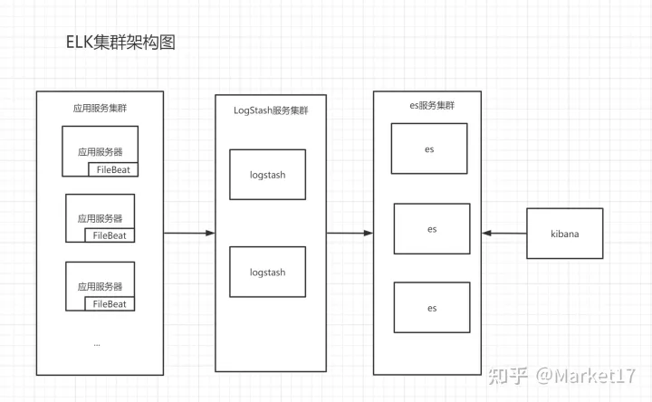
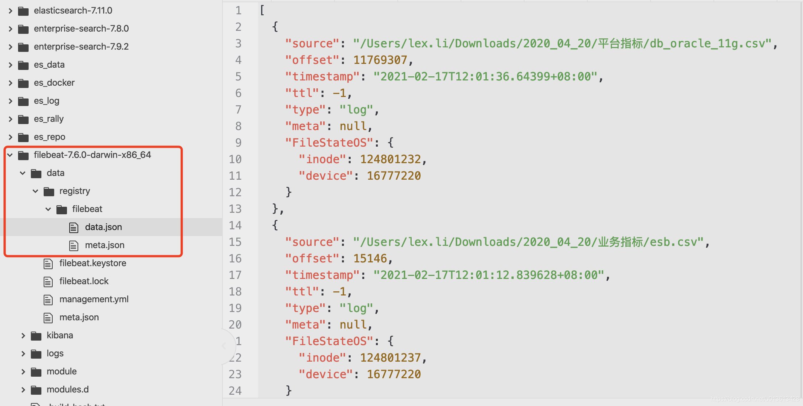
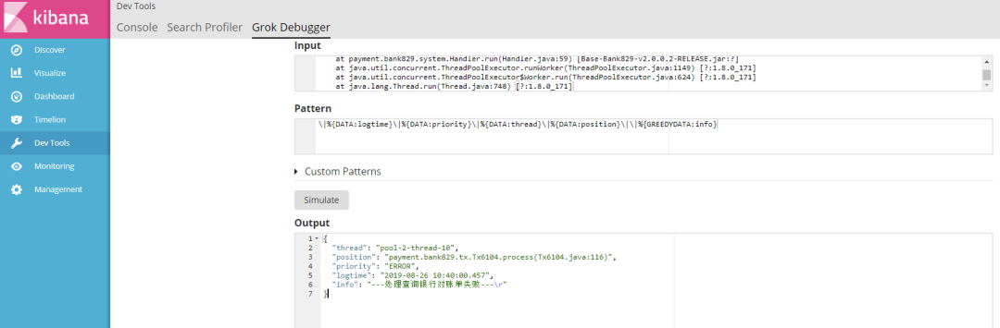



# ELK

## 1 整体架构



### FileBeat

> 官方描述：Filebeat是用于转发和集中日志数据的轻量级传送程序。作为服务器上的代理安装，Filebeat监视您指定的日志文件或位置，收集日志事件，并将它们转发到ElasticSearch或Logstash进行索引。

FileBeat是一个文本日志收集器，作用是可以收集本地的日志文件后传输给各个平台。类似于FileBeat的收集器有很多，方式都是基于收集服务器本地的文件后传输给各个平台。如PacketBeat(网络数据收集器)、HeartBeat(心跳探测收集器)等等，官方提供了大量的收集器，都可以根据自身需求进行部署。

FileBeat 就是把本地日志输出到logstash，主要用来设置log文件位置和输出的名称

### Logstash

> 官方描述： [Logstash](https://link.zhihu.com/?target=https%3A//www.elastic.co/guide/en/logstash/current/introduction.html)是具有实时流水线功能的开源数据收集引擎。Logstash可以动态统一来自不同来源的数据，并将数据标准化到您选择的目标位置。清除所有数据并使其民主化，以用于各种高级下游分析和可视化用例。 虽然Logstash最初推动了日志收集方面的创新，但其功能远远超出了该用例。可以使用各种输入，过滤器和输出插件来丰富和转换任何类型的事件，其中许多本机编解码器进一步简化了提取过程。Logstash通过利用更大数量和更多种类的数据来加快您的见解。

简单来说，Logstash的作用就是接收来自收集器的数据后，对数据进行过滤，然后将数据发送给es。

Logstash主要用来做数据过滤，通过gork语法，把需要的日志以不同的index输出到ES

### Elasticsearch

> 官方描述：[Elasticsearch](https://link.zhihu.com/?target=https%3A//www.elastic.co/guide/en/elasticsearch/reference/current/index.html)是位于Elastic Stack核心的分布式搜索和分析引擎。Logstash和Beats有助于收集，聚合和丰富您的数据并将其存储在Elasticsearch中。使用Kibana，您可以交互式地探索，可视化和共享对数据的见解，并管理和监视堆栈。Elasticsearch是发生索引，搜索和分析魔术的地方。 Elasticsearch为所有类型的数据提供近乎实时的搜索和分析。无论您是结构化文本还是非结构化文本，数字数据或地理空间数据，Elasticsearch都能以支持快速搜索的方式有效地对其进行存储和索引。您不仅可以进行简单的数据检索，还可以汇总信息来发现数据中的趋势和模式。随着数据和查询量的增长，Elasticsearch的分布式特性使您的部署可以随之顺畅地无缝增长

es是整个ELK的核心，它接收了Logstash发送过来的进行存储，并建立索引。可供kibana进行搜索获取数据。因此es为我们解决了大量的日志存储问题和搜索日志的问题。大大的简化我们对日志获取，日志搜索的工作。

ES是一个分布式的数据库，负责存储数据

### kibana

> 官方描述： - **搜索，观察和保护。** 从发现文档到分析日志再到发现安全漏洞，Kibana是您访问这些功能及其他功能的门户。 - **可视化和分析您的数据。** 搜索隐藏的见解，可视化您在图表，仪表，地图等中找到的内容，并将其组合在仪表板中。 - **管理，监视和保护弹性堆栈。** 管理索引和提取管道，监视Elastic Stack集群的运行状况，并控制哪些用户可以访问哪些功能。

kibana是一个web项目，部署后可通过浏览器进行访问，而这个项目提供了大量的操作和可视化解析功能，让你可以随意的组合，形成自己的一套可视化界面。

## 2 FileBeat

### 2.1 filebeat.yml 重要配置

#### bulk_max_size

```js
  # The maximum number of events to bulk in a single Elasticsearch bulk API index request.
  # The default is 50.
  bulk_max_size: 50
```

​	这个是`output.elasticsearch`的属性，控制发送给Elasticsearch的bulk API中，每批数据能包含多少条event，默认情况下，我们是每行数据一个document(或者说是event)，因此，每次filebeat默认只会发送50行数据，因此，当我们添加进来的数据由几十万行的时候，可以简单推算，我们需要推送多少次bulk request才能完成这个文件的数据录入

因此，我们可以综合考虑并发的环境来修改此参数。比如，我们所有的数据集中在几台机器上，只有几个filebeat实例在负责数据的录入时，我们可以把这个数据适当调大到500~1000的级别。

#### worker

```js
  # Number of workers per Elasticsearch host.
  worker: 1
```

这个也是`output.elasticsearch`的属性，我们可以指定filebeat使用多高的并发来往Elastic发送数据，我们也可以适当的增加这个值，比如我们的ES集群有3个data节点 `hosts: ["10.0.07:9200","10.0.08:9200","10.0.09:9200"]`，我们可以把这个worker设为 `3`。

结合上一个设置`bulk_max_size: 1000`，则我们可以达到更高的吞吐

#### harvester_buffer_size

```js
  # Defines the buffer size every harvester uses when fetching the file
  harvester_buffer_size: 16384
```

这个是`Log input`的属性，这个属性限定了单个文件采集器`harvester`每次读取文件的大小，默认的大小是16K。如果我们要增加某些文件的读取吞吐，可以调整这个值的大小

### 2.2 如何重新采集文件

在某些情景下，用户希望对同一个文件进行反复的采集。这时，就需要我们有能力告诉filebeat该采集哪些文件。

我们通过log input中的几个参数去定义这个能力，比如：

```js
filebeat.inputs:
- type: log
  paths:
  - '/Users/lex.li/Downloads/2020_04_20/平台指标/db_oracle_11g.csv'
  exclude_lines: ['^"?itemid"?,"?name"?,"?bomc_id"?,"?timestamp"?,"?value"?,"?cmdb_id"?']
  fields:
    index_name: "db_oracle_11g"
  harvester_buffer_size: 1638400
- type: log
  paths:
  - '/Users/lex.li/Downloads/2020_04_20/业务指标/esb.csv'
  fields:
    index_name: "esb"
- type: log
  paths:
  - '/Users/lex.li/Downloads/2020_04_20/调用链指标/trace_osb.csv'
  fields:
    index_name: "trace_osb"
    
output.elasticsearch:
  hosts: ["http://localhost:9200"]
  username: "elastic"
  password: "changeme"
  index: "%{[fields.index_name]}"
  ssl.verification_mode: "none"
  bulk_max_size: 1500
  worker: 3

setup:
  template.enabled: false
  ilm.enabled: false
```

这里，我们通过 input中的`fields`和output中的`%{[ ]}`

### 2.3 registry

然后，filebeat通过registry文件来进行被监控文件的管理，在registry目录下，（比如，在我的mac上是安装目录下的`data->registry->filebeat`)



我们可以看到如下的json数组，其中包含三个已经记录的文件对象，其中包含：

- source：被监控文件的地址
- offset：文件采集器（harvester）目前对于被监控文件的采集偏移（字节偏移，即已经采集到文件的哪个位置）
- FileStateOS：文件的标识

```js
[
  {
    "source": "/Users/lex.li/Downloads/2020_04_20/平台指标/db_oracle_11g.csv",
    "offset": 11769307,
    "timestamp": "2021-02-17T12:01:36.64399+08:00",
    "ttl": -1,
    "type": "log",
    "meta": null,
    "FileStateOS": {
      "inode": 124801232,
      "device": 16777220
    }
  },
  {
    "source": "/Users/lex.li/Downloads/2020_04_20/业务指标/esb.csv",
    "offset": 15146,
    "timestamp": "2021-02-17T12:01:12.839628+08:00",
    "ttl": -1,
    "type": "log",
    "meta": null,
    "FileStateOS": {
      "inode": 124801237,
      "device": 16777220
    }
  },
  {
    "source": "/Users/lex.li/Downloads/2020_04_20/调用链指标/trace_osb.csv",
    "offset": 16842764,
    "timestamp": "2021-02-17T12:01:37.760077+08:00",
    "ttl": -1,
    "type": "log",
    "meta": null,
    "FileStateOS": {
      "inode": 124801240,
      "device": 16777220
    }
  }
]
```

复制

**因此，如果要让某个文件重新被采集，我们需要在这个`data.json`文件中删除对应的监控文件的对象，或者把`offset`置为0，然后重启filebeat!**

### 2.4 filebeat或logstash修改规则之后重写记录到ElasticSearch

1. 删除es的index

   curl -X DELETE "http://10.20.130.43:9200/logstash-web-backend-2023.08.16"

2. 如果是单独使用logstash 删除.since文件

3. 如果使用filestash，删除registry文件

### 2.5 基本命令

详情见官网：https://www.elastic.co/guide/en/beats/filebeat/current/command-line-options.html

```bash
export   #导出
run      #执行（默认执行）
test     #测试配置
keystore #秘钥存储
modules  #模块配置管理
setup    #设置初始环境
```

例如：./filebeat test config #用来测试配置文件是否正确

### 2.6 filebeat.yml配置（log输入类型为例）

详情见官网：https://www.elastic.co/guide/en/beats/filebeat/current/filebeat-input-log.html

```yml
type: log #input类型为log
enable: true #表示是该log类型配置生效
paths：     #指定要监控的日志，目前按照Go语言的glob函数处理。没有对配置目录做递归处理，比如配置的如果是：
- /var/log/* /*.log  #则只会去/var/log目录的所有子目录中寻找以".log"结尾的文件，而不会寻找/var/log目录下以".log"结尾的文件。
recursive_glob.enabled: #启用全局递归模式，例如/foo/**包括/foo, /foo/*, /foo/*/*
encoding：#指定被监控的文件的编码类型，使用plain和utf-8都是可以处理中文日志的
exclude_lines: ['^DBG'] #不包含匹配正则的行
include_lines: ['^ERR', '^WARN']  #包含匹配正则的行
harvester_buffer_size: 16384 #每个harvester在获取文件时使用的缓冲区的字节大小
max_bytes: 10485760 #单个日志消息可以拥有的最大字节数。max_bytes之后的所有字节都被丢弃而不发送。默认值为10MB (10485760)
exclude_files: ['\.gz$']  #用于匹配希望Filebeat忽略的文件的正则表达式列表
ingore_older: 0 #默认为0，表示禁用，可以配置2h，2m等，注意ignore_older必须大于close_inactive的值.表示忽略超过设置值未更新的
文件或者文件从来没有被harvester收集
close_* #close_ *配置选项用于在特定标准或时间之后关闭harvester。 关闭harvester意味着关闭文件处理程序。 如果在harvester关闭
后文件被更新，则在scan_frequency过后，文件将被重新拾取。 但是，如果在harvester关闭时移动或删除文件，Filebeat将无法再次接收文件
，并且harvester未读取的任何数据都将丢失。
close_inactive  #启动选项时，如果在制定时间没有被读取，将关闭文件句柄
读取的最后一条日志定义为下一次读取的起始点，而不是基于文件的修改时间
如果关闭的文件发生变化，一个新的harverster将在scan_frequency运行后被启动
建议至少设置一个大于读取日志频率的值，配置多个prospector来实现针对不同更新速度的日志文件
使用内部时间戳机制，来反映记录日志的读取，每次读取到最后一行日志时开始倒计时使用2h 5m 来表示
close_rename #当选项启动，如果文件被重命名和移动，filebeat关闭文件的处理读取
close_removed #当选项启动，文件被删除时，filebeat关闭文件的处理读取这个选项启动后，必须启动clean_removed
close_eof #适合只写一次日志的文件，然后filebeat关闭文件的处理读取
close_timeout #当选项启动时，filebeat会给每个harvester设置预定义时间，不管这个文件是否被读取，达到设定时间后，将被关闭
close_timeout 不能等于ignore_older,会导致文件更新时，不会被读取如果output一直没有输出日志事件，这个timeout是不会被启动的，
至少要要有一个事件发送，然后haverter将被关闭
设置0 表示不启动
clean_inactived #从注册表文件中删除先前收获的文件的状态
设置必须大于ignore_older+scan_frequency，以确保在文件仍在收集时没有删除任何状态
配置选项有助于减小注册表文件的大小，特别是如果每天都生成大量的新文件
此配置选项也可用于防止在Linux上重用inode的Filebeat问题
clean_removed #启动选项后，如果文件在磁盘上找不到，将从注册表中清除filebeat
如果关闭close removed 必须关闭clean removed
scan_frequency #prospector检查指定用于收获的路径中的新文件的频率,默认10s
tail_files：#如果设置为true，Filebeat从文件尾开始监控文件新增内容，把新增的每一行文件作为一个事件依次发送，
而不是从文件开始处重新发送所有内容。
symlinks：#符号链接选项允许Filebeat除常规文件外,可以收集符号链接。收集符号链接时，即使报告了符号链接的路径，
Filebeat也会打开并读取原始文件。
backoff： #backoff选项指定Filebeat如何积极地抓取新文件进行更新。默认1s，backoff选项定义Filebeat在达到EOF之后
再次检查文件之间等待的时间。
max_backoff： #在达到EOF之后再次检查文件之前Filebeat等待的最长时间
backoff_factor： #指定backoff尝试等待时间几次，默认是2
harvester_limit：#harvester_limit选项限制一个prospector并行启动的harvester数量，直接影响文件打开数

tags #列表中添加标签，用过过滤，例如：tags: ["json"]
fields #可选字段，选择额外的字段进行输出可以是标量值，元组，字典等嵌套类型
默认在sub-dictionary位置
filebeat.inputs:
fields:
app_id: query_engine_12
fields_under_root #如果值为ture，那么fields存储在输出文档的顶级位置

multiline.pattern #必须匹配的regexp模式
multiline.negate #定义上面的模式匹配条件的动作是 否定的，默认是false
假如模式匹配条件'^b'，默认是false模式，表示讲按照模式匹配进行匹配 将不是以b开头的日志行进行合并
如果是true，表示将不以b开头的日志行进行合并
multiline.match # 指定Filebeat如何将匹配行组合成事件,在之前或者之后，取决于上面所指定的negate
multiline.max_lines #可以组合成一个事件的最大行数，超过将丢弃，默认500
multiline.timeout #定义超时时间，如果开始一个新的事件在超时时间内没有发现匹配，也将发送日志，默认是5smax_procs #设置可以同时执行的最大CPU数。默认值为系统中可用的逻辑CPU的数量。name #为该filebeat指定名字，默认为主机的hostname
```

## 3 LogStash

### 3.1 Gork语法

#### **Grok 是啥？**

Grok 是一种采用组合多个预定义的正则表达式。用来匹配分割文本，并且映射到关键字的工具。主要用来对[日志数据](https://cloud.tencent.com/solution/cloudlog?from_column=20065&from=20065)进行预处理。Logstash 的 filter 模块中  grok 插件就是其应用。其实主要思想就是用正则的方式匹配出字段，然后映射成某个字段。

例如：

```javascript
filter {
    grok {
     match => { 
    "message" => "\[%{DATA:logtime}\]\[%{DATA:priority}\]\[%{DATA:thread}\]\[%{DATA:position}\]%{GREEDYDATA:info}"
     }
        add_tag => "systemlog"
    }
}
```

Grock 预定义了 120 个预定义字段，可参考

https://github.com/logstash-plugins/logstash-patterns-core/tree/master/patterns

#### **Grok 匹配例子**

正则表达式说明

```javascript
\w （字母数字）和 \W （非字母数字） 
\b 匹配字母或数字边界
```

复制假设有如下一个日志

```javascript
localhost GET /index.html 1024 0.016
```

#### **参考 Grok 预定义字段**

- localhost 一般指的是主机名或者 ip  对应的预定义字段就是 IPORHOST
- WORD \b\w+\b   表示的是数字或者字母 能和 Get 匹配
- URIPATHPARAM %{URIPATH}(?:%{URIPARAM})?  能和 /index.html 匹配上。

对应的就可以写出 如下 grok语句

```javascript
%{IPORHOST:client} %{WORD:method} %{URIPATHPARAM:request} %{INT:size} %{NUMBER:duration}
```

logstash 收集这段日志的 filter 就可以写成如下

```javascript
filter {
  grok {
    match => { "message" => "%{IPORHOST:client} %{WORD:method} %{URIPATHPARAM:request} %{INT:size} %{NUMBER:duration}" }
  }
}
```

#### **GROCK 调试工具**

看个调试工具 是 Kibana 中自带的 Grok Debugger



**日志输入**

```javascript
|2019-08-26 10:40:00.457|ERROR|pool-2-thread-10|payment.bank829.tx.Tx6104.process(Tx6104.java:116)||---处理查询银行对账单失败---
java.lang.NullPointerException: null
    at com.singlee.BatchFile.AccountRequestDemo.AccountClient(AccountRequestDemo.java:40) ~[zxpayclient-1.0.jar:?]
    at payment.bank829.tx.Tx6104.process(Tx6104.java:65) [Base-Bank829-v2.0.0.2-RELEASE.jar:?]
    at payment.bank829.system.Handler.run(Handler.java:59) [Base-Bank829-v2.0.0.2-RELEASE.jar:?]
    at java.util.concurrent.ThreadPoolExecutor.runWorker(ThreadPoolExecutor.java:1149) [?:1.8.0_171]
    at java.util.concurrent.ThreadPoolExecutor$Worker.run(ThreadPoolExecutor.java:624) [?:1.8.0_171]
    at java.lang.Thread.run(Thread.java:748) [?:1.8.0_171]
```

格式匹配

```javascript
\|%{DATA:logtime}\|%{DATA:priority}\|%{DATA:thread}\|%{DATA:position}\|\|%{GREEDYDATA:info}
```

结果输出

```javascript
{
  "thread": "pool-2-thread-10",
  "position": "payment.bank829.tx.Tx6104.process(Tx6104.java:116)",
  "priority": "ERROR",
  "logtime": "2019-08-26 10:40:00.457",
  "info": "---处理查询银行对账单失败---\r"
}
```

由于换行，结果存在点偏差，可以发现，经过 grok 之后，结果就是一个个 key value 值。

#### **Grok 预定义匹配字段**

其实所谓的预定义字段，其实就是某个字段 表示的是某个正则表达式。

**预定义字段参考**

```javascript
USERNAME [a-zA-Z0-9._-]+
USER %{USERNAME}
INT (?:[+-]?(?:[0-9]+))
BASE10NUM (?<![0-9.+-])(?>[+-]?(?:(?:[0-9]+(?:\.[0-9]+)?)|(?:\.[0-9]+)))
NUMBER (?:%{BASE10NUM})
BASE16NUM (?<![0-9A-Fa-f])(?:[+-]?(?:0x)?(?:[0-9A-Fa-f]+))
BASE16FLOAT \b(?<![0-9A-Fa-f.])(?:[+-]?(?:0x)?(?:(?:[0-9A-Fa-f]+(?:\.[0-9A-Fa-f]*)?)|(?:\.[0-9A-Fa-f]+)))\b

POSINT \b(?:[1-9][0-9]*)\b
NONNEGINT \b(?:[0-9]+)\b
WORD \b\w+\b
NOTSPACE \S+
SPACE \s*
DATA .*?
GREEDYDATA .*
QUOTEDSTRING (?>(?<!\\)(?>"(?>\\.|[^\\"]+)+"|""|(?>'(?>\\.|[^\\']+)+')|''|(?>`(?>\\.|[^\\`]+)+`)|``))
UUID [A-Fa-f0-9]{8}-(?:[A-Fa-f0-9]{4}-){3}[A-Fa-f0-9]{12}

# Networking
MAC (?:%{CISCOMAC}|%{WINDOWSMAC}|%{COMMONMAC})
CISCOMAC (?:(?:[A-Fa-f0-9]{4}\.){2}[A-Fa-f0-9]{4})
WINDOWSMAC (?:(?:[A-Fa-f0-9]{2}-){5}[A-Fa-f0-9]{2})
COMMONMAC (?:(?:[A-Fa-f0-9]{2}:){5}[A-Fa-f0-9]{2})
IPV6 ((([0-9A-Fa-f]{1,4}:){7}([0-9A-Fa-f]{1,4}|:))|(([0-9A-Fa-f]{1,4}:){6}(:[0-9A-Fa-f]{1,4}|((25[0-5]|2[0-4]\d|1\d\d|[1-9]?\d)(\.(25[0-5]|2[0-4]\d|1\d\d|[1-9]?\d)){3})|:))|(([0-9A-Fa-f]{1,4}:){5}(((:[0-9A-Fa-f]{1,4}){1,2})|:((25[0-5]|2[0-4]\d|1\d\d|[1-9]?\d)(\.(25[0-5]|2[0-4]\d|1\d\d|[1-9]?\d)){3})|:))|(([0-9A-Fa-f]{1,4}:){4}(((:[0-9A-Fa-f]{1,4}){1,3})|((:[0-9A-Fa-f]{1,4})?:((25[0-5]|2[0-4]\d|1\d\d|[1-9]?\d)(\.(25[0-5]|2[0-4]\d|1\d\d|[1-9]?\d)){3}))|:))|(([0-9A-Fa-f]{1,4}:){3}(((:[0-9A-Fa-f]{1,4}){1,4})|((:[0-9A-Fa-f]{1,4}){0,2}:((25[0-5]|2[0-4]\d|1\d\d|[1-9]?\d)(\.(25[0-5]|2[0-4]\d|1\d\d|[1-9]?\d)){3}))|:))|(([0-9A-Fa-f]{1,4}:){2}(((:[0-9A-Fa-f]{1,4}){1,5})|((:[0-9A-Fa-f]{1,4}){0,3}:((25[0-5]|2[0-4]\d|1\d\d|[1-9]?\d)(\.(25[0-5]|2[0-4]\d|1\d\d|[1-9]?\d)){3}))|:))|(([0-9A-Fa-f]{1,4}:){1}(((:[0-9A-Fa-f]{1,4}){1,6})|((:[0-9A-Fa-f]{1,4}){0,4}:((25[0-5]|2[0-4]\d|1\d\d|[1-9]?\d)(\.(25[0-5]|2[0-4]\d|1\d\d|[1-9]?\d)){3}))|:))|(:(((:[0-9A-Fa-f]{1,4}){1,7})|((:[0-9A-Fa-f]{1,4}){0,5}:((25[0-5]|2[0-4]\d|1\d\d|[1-9]?\d)(\.(25[0-5]|2[0-4]\d|1\d\d|[1-9]?\d)){3}))|:)))(%.+)?
IPV4 (?<![0-9])(?:(?:25[0-5]|2[0-4][0-9]|[0-1]?[0-9]{1,2})[.](?:25[0-5]|2[0-4][0-9]|[0-1]?[0-9]{1,2})[.](?:25[0-5]|2[0-4][0-9]|[0-1]?[0-9]{1,2})[.](?:25[0-5]|2[0-4][0-9]|[0-1]?[0-9]{1,2}))(?![0-9])
IP (?:%{IPV6}|%{IPV4})
HOSTNAME \b(?:[0-9A-Za-z][0-9A-Za-z-]{0,62})(?:\.(?:[0-9A-Za-z][0-9A-Za-z-]{0,62}))*(\.?|\b)
HOST %{HOSTNAME}
IPORHOST (?:%{HOSTNAME}|%{IP})
HOSTPORT %{IPORHOST}:%{POSINT}

# paths
PATH (?:%{UNIXPATH}|%{WINPATH})
UNIXPATH (?>/(?>[\w_%!$@:.,-]+|\\.)*)+
TTY (?:/dev/(pts|tty([pq])?)(\w+)?/?(?:[0-9]+))
WINPATH (?>[A-Za-z]+:|\\)(?:\\[^\\?*]*)+
URIPROTO [A-Za-z]+(\+[A-Za-z+]+)?
URIHOST %{IPORHOST}(?::%{POSINT:port})?
# uripath comes loosely from RFC1738, but mostly from what Firefox
# doesn't turn into %XX
URIPATH (?:/[A-Za-z0-9$.+!*'(){},~:;=@#%_\-]*)+
#URIPARAM \?(?:[A-Za-z0-9]+(?:=(?:[^&]*))?(?:&(?:[A-Za-z0-9]+(?:=(?:[^&]*))?)?)*)?
URIPARAM \?[A-Za-z0-9$.+!*'|(){},~@#%&/=:;_?\-\[\]]*
URIPATHPARAM %{URIPATH}(?:%{URIPARAM})?
URI %{URIPROTO}://(?:%{USER}(?::[^@]*)?@)?(?:%{URIHOST})?(?:%{URIPATHPARAM})?

# Months: January, Feb, 3, 03, 12, December
MONTH \b(?:Jan(?:uary)?|Feb(?:ruary)?|Mar(?:ch)?|Apr(?:il)?|May|Jun(?:e)?|Jul(?:y)?|Aug(?:ust)?|Sep(?:tember)?|Oct(?:ober)?|Nov(?:ember)?|Dec(?:ember)?)\b
MONTHNUM (?:0?[1-9]|1[0-2])
MONTHNUM2 (?:0[1-9]|1[0-2])
MONTHDAY (?:(?:0[1-9])|(?:[12][0-9])|(?:3[01])|[1-9])

# Days: Monday, Tue, Thu, etc...
DAY (?:Mon(?:day)?|Tue(?:sday)?|Wed(?:nesday)?|Thu(?:rsday)?|Fri(?:day)?|Sat(?:urday)?|Sun(?:day)?)

# Years?
YEAR (?>\d\d){1,2}
HOUR (?:2[0123]|[01]?[0-9])
MINUTE (?:[0-5][0-9])
# '60' is a leap second in most time standards and thus is valid.
SECOND (?:(?:[0-5]?[0-9]|60)(?:[:.,][0-9]+)?)
TIME (?!<[0-9])%{HOUR}:%{MINUTE}(?::%{SECOND})(?![0-9])
# datestamp is YYYY/MM/DD-HH:MM:SS.UUUU (or something like it)
DATE_US %{MONTHNUM}[/-]%{MONTHDAY}[/-]%{YEAR}
DATE_EU %{MONTHDAY}[./-]%{MONTHNUM}[./-]%{YEAR}
ISO8601_TIMEZONE (?:Z|[+-]%{HOUR}(?::?%{MINUTE}))
ISO8601_SECOND (?:%{SECOND}|60)
TIMESTAMP_ISO8601 %{YEAR}-%{MONTHNUM}-%{MONTHDAY}[T ]%{HOUR}:?%{MINUTE}(?::?%{SECOND})?%{ISO8601_TIMEZONE}?
DATE %{DATE_US}|%{DATE_EU}
DATESTAMP %{DATE}[- ]%{TIME}
TZ (?:[PMCE][SD]T|UTC)
DATESTAMP_RFC822 %{DAY} %{MONTH} %{MONTHDAY} %{YEAR} %{TIME} %{TZ}
DATESTAMP_RFC2822 %{DAY}, %{MONTHDAY} %{MONTH} %{YEAR} %{TIME} %{ISO8601_TIMEZONE}
DATESTAMP_OTHER %{DAY} %{MONTH} %{MONTHDAY} %{TIME} %{TZ} %{YEAR}
DATESTAMP_EVENTLOG %{YEAR}%{MONTHNUM2}%{MONTHDAY}%{HOUR}%{MINUTE}%{SECOND}

# Syslog Dates: Month Day HH:MM:SS
SYSLOGTIMESTAMP %{MONTH} +%{MONTHDAY} %{TIME}
PROG (?:[\w._/%-]+)
SYSLOGPROG %{PROG:program}(?:\[%{POSINT:pid}\])?
SYSLOGHOST %{IPORHOST}
SYSLOGFACILITY <%{NONNEGINT:facility}.%{NONNEGINT:priority}>
HTTPDATE %{MONTHDAY}/%{MONTH}/%{YEAR}:%{TIME} %{INT}

# Shortcuts
QS %{QUOTEDSTRING}

# Log formats
SYSLOGBASE %{SYSLOGTIMESTAMP:timestamp} (?:%{SYSLOGFACILITY} )?%{SYSLOGHOST:logsource} %{SYSLOGPROG}:
COMMONAPACHELOG %{IPORHOST:clientip} %{USER:ident} %{USER:auth} \[%{HTTPDATE:timestamp}\] "(?:%{WORD:verb} %{NOTSPACE:request}(?: HTTP/%{NUMBER:httpversion})?|%{DATA:rawrequest})" %{NUMBER:response} (?:%{NUMBER:bytes}|-)
COMBINEDAPACHELOG %{COMMONAPACHELOG} %{QS:referrer} %{QS:agent}

# Log Levels
LOGLEVEL ([Aa]lert|ALERT|[Tt]race|TRACE|[Dd]ebug|DEBUG|[Nn]otice|NOTICE|[Ii]nfo|INFO|[Ww]arn?(?:ing)?|WARN?(?:ING)?|[Ee]rr?(?:or)?|ERR?(?:OR)?|[Cc]rit?(?:ical)?|CRIT?(?:ICAL)?|[Ff]atal|FATAL|[Ss]evere|SEVERE|EMERG(?:ENCY)?|[Ee]merg(?:ency)?)
```

#### Grok数据修改(mutate)

```ruby
mutate 
{
	add_field => { "log_type" => "STREAM" }  //添加
    convert => ["request_time", "float"]  //类型转换
    split => ["message", "|"]     //split 随意输入一串以|分割的字符，比如 "123|321|adfd|dfjld*=123"
    join => ["message", ","]    
    merge => ["message", "message"]
    rename => ["syslog_host", "host"]
}

```

#### Grok时间处理(date)

```ruby
filter {
    grok {
        match => ["message", "%{HTTPDATE:logdate}"]
    }
    date {
        match => ["logdate", "dd/MMM/yyyy:HH:mm:ss Z"]
    }
}	
```

实际项目使用

```ruby
date {
         #logdate 从上面过滤后取到的字段名，yyyy-MM-dd HH:mm:ss.SSS 日期格式条件
        match => ["datetime", "yyyy-MM-dd HH:mm:ss.SSS"]
        #赋值给那个key
        target => "@timestamp"
        #删除不需要的字段
        #remove_field => ["logdate"]
     }

```


### 3.2 logstash命令行

#### 测试config文件

sudo bin/logstash --config.test_and_exit -f <path_to_config_file>

## 4 Elasticsearch

### 4.1 常用的查询表达式

ES的例子使用的都是GET，但是很多JS库不支持GET带data的，这些调用也都可以用POST完成

GET \*index\*/_search   这种格式可以模糊查找index

#### 1 全查询

```sense
GET /_search
{
    "query": {
        "match_all": {}
    }
}
```

#### 2 分页

- **`size`**

  显示应该返回的结果数量，默认是 `10`

- **`from`**

  显示应该跳过的初始结果数量，默认是 `0`

如果每页展示 5 条结果，可以用下面方式请求得到 1 到 3 页的结果：

```sense
GET /_search?size=5
GET /_search?size=5&from=5
GET /_search?size=5&from=10
```

from/size也可以放在POST的data里

#### 3 多个查询条件

```sense
{
    "bool": {
        "must":     { "match": { "tweet": "elasticsearch" }},
        "must_not": { "match": { "name":  "mary" }},
        "should":   { "match": { "tweet": "full text" }},
        "filter":   { "range": { "age" : { "gt" : 30 }} }
    }
}
```

**`must`**

文档 *必须* 匹配这些条件才能被包含进来。

**`must_not`**

文档 *必须不* 匹配这些条件才能被包含进来。

**`should`**

如果满足这些语句中的任意语句，将增加 `_score` ，否则，无任何影响。它们主要用于修正每个文档的相关性得分。

**`filter`**

*必须* 匹配，但它以不评分、过滤模式来进行。这些语句对评分没有贡献，只是根据过滤标准来排除或包含文档。

#### 4 完整项目中用到的查询

```json
{"query":
 {"bool":
  {"must":[
      {
           "match": {"log_type":"HTTP"}
      },
      {
          "regexp":{"url":".*server.*"}		//使用正则做模糊查询
      },
      {
          "range": {						// 时间，一定要用logstash date过滤过
              "@timestamp": {
            		"gte": "2023-09-01T13:33:56.246Z",
		            "lte": "2023-09-04T13:33:59.246Z"
        	  }              
          }          
      }
  ]
  }
 },
 "sort":
 {"@timestamp":			//按时间排序
  {"order":"desc"}
 },
 "from":0,		//分页， antd是从1开始，es是从0开始
 "size":10		//分页
}
```

### 4.2 常用的在浏览器中查询ES的URL

http://10.20.130.43:9200/_cat/indices?v   //查index总数

http://10.20.130.43:9200/logstash-web-backend-2023.08.16  //查具体的index


