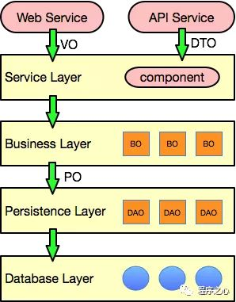
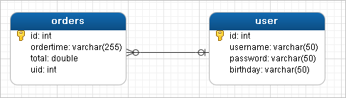
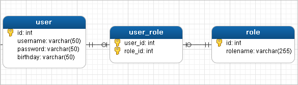



# Java项目实践笔记

## java对象：PO/POJO/VO/BO/DAO/DTO分析

### 1 PO(Persistant Object)/Entity

PO(Persistant Object，持久对象)是伴随O/R映射出现的概念，因此，想要链接PO必须先了解O/R映射。

#### 1.1 OR映射

OR映射(ORM,Obeject Releation Mapping)就是将对象与关系数据库进行绑定（或者说是把关系数据表进行对象(javabean值对象)映射）

操作过程中，根据不同的ORM Framework编写不同的映射文件，一般是以xml方式进行存储，将表与Javabean的值对象一一对应。
示例：
以前插入一条记录书写形式为：

- \- 建立连接...
- \- 建立操作对象
- \- 执行sql

现在可以如下书写：

- \- 读取映射配置
- \- javabean值对象.set字段名（字段值）
- \- save操作即可

#### 1.2 PO

PO(Persistant Object)可以看成是与数据库中的表相映射的java对象。

最简单的PO就是对应数据库中某个表中的一条记录，多个记录可以用PO的集合。PO中应该不包含任何对数据库的操作。

### 2.VO(Value Object)

VO值对象，通常用于业务层之间的数据传递，与PO一样仅包含数据，根据业务的需要与抽象出的业务对象实现对应或者非对应。
VO主要**对应界面显示的数据对象**。对于一个WEB页面，或者SWT/SWING的一个界面，用一个VO对象对应整个界面的值。

VO其实表示的就是和浏览器交互的json

#### 2.1 VO与PO异同点

##### 2.2.1 相同点

VO与PO均由一组属性和属性的get和set方法组成，结构上没有不同，但是本质上完全不同。

##### 2.2.2 创建方法差异

- VO是用new关键字创建，由GC回收。
- PO是向数据库中添加新数据时创建，删除数据库中数据时削除。并且PO只能存活在一个数据库连接中，断开连接就被销毁。

##### 2.2.3 意义不同

- VO是值对象，或者说是业务对象，是存活在业务层，是业务逻辑使用的，意义在于微数据提供一个生存的地方；
- PO是有状态的，每个属性代表其当前的状态，他是物理数据的对象表示。使用它，可以使我们的程序与物理数据解耦，并且可以简化对象数据与物理数据之间的转换。

##### 2.2.4 属性不同

- VO的属性是根据当前业务的不同而不同，即，它的每一个属性都一一对应当前业务逻辑所需要的数据的名称。
- PO属性是跟数据库表的字段一一对应的。PO对象需要实现序列化接口。

### 3 DAO(Data Access Object)

DAO(Data Access Object数据访问对象)，用于访问数据库，通常与PO结合使用，DAO包含了**各种数据库的操作方法**，通过方法结合PO对数据库进行相关操作，夹在业务层逻辑与数据库资源中间，配合VO，提供数据库的CRUD（增删改查）操作

### 4 BO(Business Object)

BO（Business Object)业务对象，封装**业务逻辑**的java对象,通过**调用DAO方法**,结合PO,VO进行业务操作。这个对象可以包括一个或多个其它的对象

比如一个简历，有教育经历、工作经历、 关系等等。

1. 教育经历对应一个PO
2. 工作经历对应一个PO
3.  关系对应一个PO
4. 建立一个对应简历的BO包含这些PO。处理业务逻辑时，我们就可以针对BO去处理

### 5 POJO((Plain Ordinary Java Objec)

POJO(Plain Ordinary Java Object简单无规则java对象)是纯粹的传统意义的java对象。就是说在一些Object/Relation Mapping工具中，能够做到维护数据库表记录的persisent object完全是一个符合Java Bean规范的纯Java对象，没有增加别的属性和方法，即，最基本的Java Bean，只有属性字段及setter和getter方法！

- \- 一个POJO持久化以后就是PO；
- \- 直接用它传递，传递过程中就是DTO；
- \- 直接用来对应表示层就是VO。

### 6 DTO(Data Transfer Object)

DTO(Data Transfer Object,数据传输对象)主要用于远程调用等需要大量传输对象的地方

比如说，我们一张表有100个字段，那么对应的PO就有100个属性。但是我们界面上只要显示10个字段， 客户端用WEB service来获取数据，没有必要把整个PO对象传递到客户端， 这时我们就可以用只有这10个属性的DTO来传递结果到客户端，这样也不会暴露服务端表结构.到达客户端以后，如果用这个对象来对应界面显示，那此时它的身份就转为VO

### 7 应用框图



### 8 阿里Java开发手册中的定义

分层领域模型规约：

- DO（ Data Object）：与数据库表结构一一对应，通过DAO层向上传输数据源对象。
- DTO（ Data Transfer Object）：数据传输对象，Service或Manager向外传输的对象。
- BO（ Business Object）：业务对象。 由Service层输出的封装业务逻辑的对象。
- AO（ Application Object）：应用对象。 在Web层与Service层之间抽象的复用对象模型，极为贴近展示层，复用度不高。
- VO（ View Object）：显示层对象，通常是Web向模板渲染引擎层传输的对象。
- POJO（ Plain Ordinary Java Object）：在本手册中， POJO专指只有setter/getter/toString的简单类，包括DO/DTO/BO/VO等。
- Query：数据查询对象，各层接收上层的查询请求。 注意超过2个参数的查询封装，禁止使用Map类来传输。

领域模型命名规约：

- 数据对象：xxxDO，xxx即为数据表名。
- 数据传输对象：xxxDTO，xxx为业务领域相关的名称。
- 展示对象：xxxVO，xxx一般为网页名称。
- POJO是DO/DTO/BO/VO的统称，禁止命名成xxxPOJO。

## Swagger3.0教程

http://localhost:8080/swagger-ui/index.html

### 1 Pom导入

```xml
<dependency>
    <groupId>io.springfox</groupId>
    <artifactId>springfox-boot-starter</artifactId>
    <version>3.0.0</version>
</dependency>
```

### 2 配置

```java
package com.example.demohelloworld.swagger3.config;

import org.springframework.context.annotation.Bean;
import org.springframework.context.annotation.Configuration;
import org.springframework.web.servlet.config.annotation.ResourceHandlerRegistry;
import org.springframework.web.servlet.config.annotation.WebMvcConfigurer;
import springfox.documentation.builders.ApiInfoBuilder;
import springfox.documentation.builders.PathSelectors;
import springfox.documentation.builders.RequestHandlerSelectors;
import springfox.documentation.oas.annotations.EnableOpenApi;
import springfox.documentation.service.Contact;
import springfox.documentation.spi.DocumentationType;
import springfox.documentation.spring.web.plugins.Docket;

import java.util.function.Predicate;

@Configuration
//@EnableOpenApi开启SWAGGER3.0
@EnableOpenApi
public class Swagger3Config implements WebMvcConfigurer {
    @Bean
    //同Swagger2相似,主要是配置一个Docket
    Docket docket(){
        //DocumentationType.OAS_30,原Swagger2选择DocumentationType.SWAGGER_2
        return new Docket(DocumentationType.OAS_30)
                .select()
                //通过apis方法配置要扫描的controller的位置
                .apis(RequestHandlerSelectors.basePackage("com.example.demohelloworld.swagger3.controller"))
                //通过paths方法配置路径
                .paths(PathSelectors.any())
                //设置需要排除的路径(如果需要)
                .paths(Predicate.not(PathSelectors.regex("/error.*")))
                .build().apiInfo(new ApiInfoBuilder()
                        //设置文档标题
                        .description("Swagger3测试API接口文档")
                        //设置联系人信息
                        .contact(new Contact("API作者","https://www.csdn.net","lulc@163.com"))
                        //设置版本号
                        .version("1.1")
                        //设置文档抬头
                        .title("API测试文档")
                        //设置授权
                        .license("License By lulu")
                        //设置授权访问网址
                        .licenseUrl("https://swagger.io")
                        .build());
    }
    @Override
    //swagger-ui/index.html在META-INF/resources下面,添加资源映射确保URL能够访问
    public void addResourceHandlers(ResourceHandlerRegistry registry){
        registry.addResourceHandler("/swagger-ui/**").addResourceLocations("classpath:/META-INF/resources/webjars/springfox-swagger-ui/")
            .resourceChain(false);
    }

}
```

### 3 常用注解

```java
@Api：用在类上，用来描述整个Controller接口信息。

@ApiOperation：用在方法上，用来描述方法的基本信息，value是对方法作用的简短描述，notes则是该方法的详细描述。

@ApiImplicitParam：用在方法上，用来描述方法的参数，paramType是指方法参数类型，可选值有path(参数获取方式@PathVariable)、query(参数获取方式@RequestParam)、header(参数获取方式@RequestHeader)、body(参数获取方式@RequestBody)以及form，name表示参数名字，和参数名字对应，value则是参数描述信息。required表示该字段是否必填，defaultValue表示该字段的默认值，注意，这里的required和defaultValue不具备真正的约束性仅为文档显示，真正的还需要在@RequestParam中设置。

@ApiImplicitParams：如果是多参数，可将多个参数放在@ApiImplicitParams中，格式为@ApiImplicitParams({@ApiImplicitParam(paramType="query",name="username"),@ApiImplicitParam(paramType="path",name="userid")})。

@ApiResponse：对响应结果的描述，code表示响应码，@message表示描述信息，如果有多个@ApiResponse，可以放在一个@ApiResponses中。

@ApiResponses：格式为@ApiResponses({@ApiResponse(code = 200,message = "删除成功！"),@ApiResponse(code = 500,message = "删除失败！")})。

@ApiModel：一般用于响应类上，表示一个返回响应数据的信息(如updateUse方法，请求参数无法使用@ApiImplicitParam注解进行描述的时候)。

@ApiModelProperty：用在属性上，描述响应类的属性。

@ApiIgnore：表述不对某个接口生成文档，即忽略这个接口。
```

### 4 遇到的问题

#### 4.1 SpringBoot启动错误

报错Failed to start bean ‘documentationPluginsBootstrapper

***原因***： 这是因为Springfox使用的路径匹配是基于AntPathMatcher的，而Spring Boot 2.6.X使用的是PathPatternMatcher。
***解决***：在application.properties里配置：spring.mvc.pathmatch.matching-strategy=ANT_PATH_MATCHER

#### 4.2 swagger提示No operations defined in spec

```java
.apis(RequestHandlerSelectors.basePackage("ca.netint.warehouse"))
//不能是
.apis(RequestHandlerSelectors.basePackage("ca.netint.warehouse.controller"))
```

#### 4.3 v3/api-docs无法访问

这个接口会返回json格式文档

```java
@Bean
//同Swagger2相似,主要是配置一个Docket
public Docket createRestApi(){
    //DocumentationType.OAS_30,原Swagger2选择DocumentationType.SWAGGER_2
    return new Docket(DocumentationType.OAS_30)
            .apiInfo(apiInfo())
            .groupName("all") //这个groupName只能是英文，不能中文
        ...
}
```

#### 4.4 关于@EnableWebMvc注解

1. 用户配置了`@EnableWebMvc`
2. Spring扫描所有的注解，再从注解上扫描到`@Import`，把这些`@Import`引入的bean信息都缓存起来
3. 在扫描到`@EnableWebMvc`时，通过`@Import`加入了 `DelegatingWebMvcConfiguration`，也就是`WebMvcConfigurationSupport`
4. spring再处理`@Conditional`相关的注解，判断发现已有`WebMvcConfigurationSupport`，就跳过了spring bootr的`WebMvcAutoConfiguration`

所以spring boot自己的静态资源配置不生效。

##### Spring Boot ResourceProperties的配置

在spring boot里静态资源目录的配置是在`ResourceProperties`里。

然后在 `WebMvcAutoConfigurationAdapter`里会初始始化相关的ResourceHandler。

[Spring 注解 @EnableWebMvc 工作原理](https://blog.csdn.net/andy_zhang2007/article/details/87357865)

##  关于Log

SLF4J是底层框架，logback、log4j挂在上面

[在IDEA的maven视图里查看包的依赖关系](https://blog.csdn.net/liumiaocn/article/details/108414583)

log4j-over-slf4j -> slf4j-api

##MyBatis注解开发

### 常用注解

@Insert：实现新增

@Update：实现更新

@Delete：实现删除

@Select：实现查询

@Result：实现结果集封装

@Results：可以与@Result一起使用，封装多个结果集

@One：实现一对一结果集封装

@Many：实现一对多结果集封装

实现复杂关系映射之前我们可以在映射文件中通过配置<resultMap>来实现，使用注解开发后，我们可以使用@Results注解，@Result注解，@One注解，@Many注解组合完成复杂关系的配置

| 注解            | 说明                                                         |
| --------------- | ------------------------------------------------------------ |
| @Results        | 代替的是标签<resultMap>，该注解中可以使用单个@Result注解，也可以使用@Result集合。使用格式：@Results({@Result(),@Result()})或@Results(@Result()) |
| @Result         | 代替了<id>标签和<result>标签@Result中属性介绍：column：数据库的列名property：需要装配的属性名one：需要使用的@One注解（@Result（one=@One）（））many：需要使用的@Many注解（@Result（many=@Many）（）） |
| @One（一对一）  | 代替了<assocation>标签，是多表查询的关键，在注解中用来指定子查询返回单一对象@One注解属性介绍：select：指定用来多表查询的sqlmapper使用格式：@Result（column=" "，property=" "，one=@One（select=" "）） |
| @Many（多对一） | 代替了<collection>标签，是多表查询的关键，在注解中用来指定子查询返回对象集合使用格式：@Result（property=" "，column=" "，many=@Many（select=" "）） |


### 1 一对一查询

#### 1.1 一对一查询模型

户表和订单表的关系为，一个用户有多个订单，一个订单只从属于一个用户
一对一查询的需求：查询一个订单，与此同时查询出该订单所属的用户。从order -> user



####  1.2一对一查询的sql语句

sql语句：

```sql
select * from orders;
select * from user where id=查询出订单的uid;
```

#### 1.3 Entity

```java
@Data
public class User {
    private int id;
    private String username;
    private String password;
    private LocalDateTime birthday;
}

@Data
public class Order {
    private int id;
    private LocalDate ordertime;
    private double total;
    //表示当前订单属于哪一个用户
    private User user;
}
```

#### 1.4 Mapper

```java
public interface OrderMapper {
    @Select("select *,o.id oid from test.orders o,test.user u where o.uid=u.id")
    @Results({
            @Result(column = "oid",property = "id"),
            @Result(column = "ordertime",property = "ordertime"),
            @Result(column = "total",property = "total"),
            @Result(
                    property = "user", //要封装的属性名称
                    column = "uid",  //根据哪个字段来查user表的信息
                    javaType = User.class, //要封装的实体类型
                    one = @One(select = "cn.seim.mapper.UserMapper.findUserById")
            )
    })
    public List<Order> findOrderALl();
}

public interface UserMapper {
    @Select("select * from test.user where id=#{id}")
    public User findUserById(int id);
}
```

#### 1.5 测试

```java
@Test
public void findOrderAll() {
    List<Order> orderALl = om.findOrderALl();
    for (Order order : orderALl) {
        log.debug(String.valueOf(order));
    }
}
```

### 2 一对多查询

#### 2.1 一对多模型

从user -> order。查询一个用户下所有orders

#### 2.2 SQL语句

```sql
select * from user;
select * from orders where uid=查询出用户的id;
```

#### 2.3 Entity

```java
@Data
public class User {
    private int id;
    private String username;
    private String password;
    private LocalDateTime birthday;
    //表示当前用户所拥有的订单数
    private List<Order> orderList;
}

@Data
public class Order {
    private int id;
    private LocalDate ordertime;
    private double total;
    //表示当前订单属于哪一个用户
    private User user;
}
```

#### 2.4 Mapper

```java
@Mapper
public interface UserMapper {
    @Select("select * from test.user")
    @Results({
            @Result(id = true,column = "id",property = "id"),
            @Result(column = "username",property = "username"),
            @Result(column = "password",property = "password"),
            @Result(column = "birthday",property = "birthday"),
            @Result(
                    property = "orderList",
                    column = "id",
                    javaType =List.class,
                    many = @Many(select = "cn.seim.mapper.OrderMapper.findByUid")
            )
    })
    public List<User> findUserAndOrderAll();
}

@Mapper
public interface OrderMapper{
    Select("select * from orders where uid=#{uid}")
	public List<Order> findByUid(int uid);
}
```

#### 2.5 测试

```java
@Test
public void findUserAndOrderAll(){
    List<User> all = sm.findUserAndOrderAll();
    for (User user : all) {
        log.debug(String.valueOf(user));
    }
}
```

### 3 多对多查询

#### 3.1 查询模型

用户表和角色表的关系为，一个用户有多个角色，一个角色被多个用户使用
多对多查询的需求：查询用户同时查询出该用户的所有角色



#### 3.2 SQL语句

```sql
select * from user;
select * from role r,user_role ur where r.id=ur.role_id and ur.user_id=用户的id
```

#### 3.3 Entity

```java
@Data
public class Role {
    private int id;
    private String roleName;
    private String roleDesc;
}

@Data
public class User {
    private int id;
    private String username;
    private String password;
    private LocalDateTime birthday;
    //表示当前用户所拥有的订单数
    private List<Order> orderList;
    //表示用户所拥有的角色
    private List<Role> roleList;
}
```

#### 3.4 Mapper

```java
public interface UserMapper {
    @Select("select * from user")
    @Results({
            @Result(id = true,column = "id",property = "id"),
            @Result(column = "username",property = "username"),
            @Result(column = "password",property = "password"),
            @Result(column = "birthday",property = "birthday"),
            @Result(
                    property = "roleList",
                    column = "id",
                    javaType = List.class,
                    many = @Many(select = "cn.seim.mapper.RoleMapper.findRoleByUid")
            )
    })
    public List<User> findUserAndRoleALl();
}

public interface RoleMapper {
    @Select("select * from user_role ur,role r where ur.roleId=r.id and ur.userId=#{uid}")
	public List<Role> findRoleByUid(int uid);
}
```

#### 3.5 测试

```java
@Test
public void findUserAndRoleALl(){
    List<User> all = sm.findUserAndRoleALl();
    for (User user : all) {
        log.debug(String.valueOf(user));
    }
}
```


## MySQL 使用

### 如何定义mysql函数

```sql
DROP PROCEDURE IF EXISTS insert_permission; -- 这句一定要加，否则每个connection，函数只能定义一次
DELIMITER $  -- 只是用来定义一个结束符号
create procedure insert_permission()	-- 定义函数
begin
    declare a1 int default 31;
    while a1<= 40 do	
		insert into warehouse.auth_permission(name,content_type_id,codename) 
			select concat('Can add ',model) as name, id as content_type_id, concat('add_',model) as codename 
				from warehouse.django_content_type where id = a1;
		insert into warehouse.auth_permission(name,content_type_id,codename) 
			select concat('Can change ',model) as name, id as content_type_id, concat('change_',model) as codename 
				from warehouse.django_content_type where id = a1;
		insert into warehouse.auth_permission(name,content_type_id,codename) 
			select concat('Can retrieve ',model) as name, id as content_type_id, concat('retrieve_',model) as codename 
				from warehouse.django_content_type where id = a1;
        set a1 = a1+1;
    end while;
end; $
call insert_permission();

```

使用insert into select 从一个表获取数据给另一个表添加

使用concat处理select来的数据


