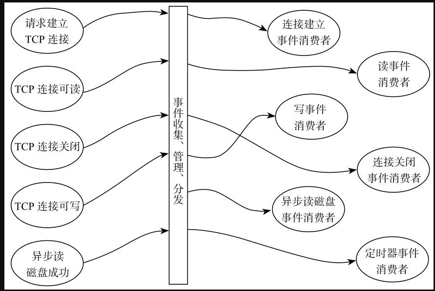
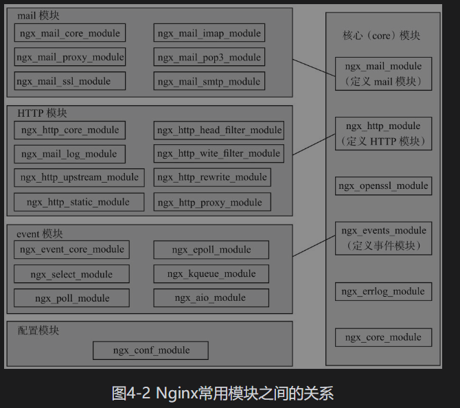
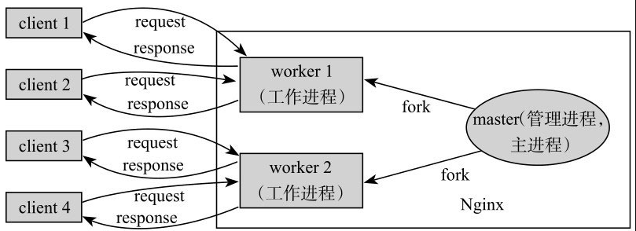



# Nginx Lua开发实战

## 第1章 Nginx高效服务器

### 1.1 Nginx的特点

1. 速度快
2. 扩展性好         -      核心+模块，  Epoll/Kqueue做分发， ngx_lua开发，lua的协程性能好
3. 高可靠性         -      管理进程master   +  若干个工作进程 worker
4. 低内存占用      -      10000个非活跃的HTTP保活连接仅占用2.5MB内存
5. 高并发
6. 热部署
7. 开源

### 1.2 Nginx的安装

#### 1 依赖库

1. GCC
2. PCRE       - Perl Compatible Regular Expressions, Perl兼容正则表达式
3. Zlib         - 用于对HTTP报文内容做gzip格式压缩，如果在nginx.conf中配置了gzip on，并指定某些Content-Type的HTTP应答包体使用gzip进行压缩，以减小网络传输量，那么就需要在编译Nginx时指定zlib，将其编译进Nginx
4. OpenSSL - 使用HTTPS在SSL上传输HTTP，就需要安装OpenSSL。另外，在ngx_lua中使用MD5、SHA1等散列函数时，也需要安装OpenSSL

#### 2 Linux内核参数优化

修改/etc/sysctl.conf，常用配置如下：[插图]执行sysctl -p命令，使修改生效。

```shell
    fs.file-max = 999999
    net.core.netdev_max_backlog = 8096
    net.core.rmem_default = 262144
    net.core.wmem_default = 262144
    net.core.rmem_max = 2097152
    net.core.wmem_max = 2097152
    net.ipv4.tcp_tw_reuse = 1
    net.ipv4.tcp_keepalive_time = 600
    net.ipv4.tcp_fin_timeout = 30
    net.ipv4.tcp_max_tw_buckets = 5000
    net.ipv4.ip_local_port_range = 102461000
    net.ipv4.tcp_rmem = 409632768262142
    net.ipv4.tcp_wmen = 409632768262142
    net.ipv4.tcp_syncookies = 1
    net.ipv4.tcp_max_syn_backlog = 1024
```

执行sysctl -p命令，使修改生效。

各内核参数的作用如下。

1. fs.file-max：表示进程（在Nginx里指一个工作进程）可以同时打开的最大句柄数。本参数影响最大并发连接数。
2. net.ipv4.tcp_syncookies：解决TCP的SYN攻击。
3. net.ipv4.tcp_tw_reuse：参数为1时表示允许将TIME_WAIT状态的套接字重新用于新的TCP连接。服务器上的TCP协议栈在工作时会有大量的TIME_WAIT状态连接，重新使用这些连接对于服务器处理大并发连接非常有用。
4. net.ipv4.tcp_keepalive_time：表示当keepalive启用时，TCP发送keepalive消息的频率。默认为2小时，如果本值变小，可以更快地清理无效的连接。
5. net.ipv4.tcp_fine_timeout：表示服务器主动关闭连接时，套接字的FIN_WAIT-2状态最大时间
6. net.ipv4.tcp_max_tw_buckets：表示操作系统允许的TIME_WAIT套接字数量的最大值。当超过这个值，TIME_WAIT状态的套接字被立即清除并输出警告消息，默认值为180000，过多的TIME_WAIT套接字会使服务器速度变慢。
7. net.ipv4.tcp_max_syn_backlog：表示TCP三次握手阶段SYN请求队列最大值，默认为1024。调置为更大的值可以使Nginx在非常繁忙的情况下，若来不及接收新的连接时，Linux不至于丢失客户端新创建的连接请求。
8. net.ipv4.ip_local_port_range：定义UDP和TCP连接中本地端口范围（不包括连接到远端的端口）。
9. net.ipv4.tcp_rmen：定义TCP接收缓存（TCP接收窗口）的最小值、默认值、最大值。
10. net.ipv4.tcp_wmen：定义TCP发送缓存（TCP发送窗口）的最小值、默认值、最大值。
11. net.core.netdev_max_backlog：当网卡接收报文速度大于内核处理速度时，本参数设置这个缓冲队列最大值
12. net.core.rmem_default：表示内核套接字接收缓冲区默认值。
13. net.core.wmem_default：表示内核套接字发送缓冲区默认值。
14. net.core.rmem_max：表示内核套接字接收缓冲区最大值。
15. net.core.wmem_max：表示内核套接字发送缓冲区最大值。

#### 3 启动、停止、重启

启动命令如下：

```shell
/opt/nginx/sbin/nginx -p /opt/nginx/
/opt/nginx/sbin/nginx -p /opt/nginx -s stop
/opt/nginx/sbin/nginx -p /opt/nginx -s reload
```

## 第3章 OpenResty

### 3.2 OpenResty的组成

1. 标准Lua 5.1解释器；
2. Drizzle Nginx模块；
3. Postgres Nginx模块；
4. Iconv Nginx模块

上面4个模块默认并未启用，需要分别加入--with-lua51、--with-http_drizzle_module、--with-http_postgres_module和--with-http_iconv_module编译选项开启它们

运行下面命令启动Nginx：

```shell
/usr/local/openresty/nginx/sbin/nginx -p /usr/local/openresty/nginx/
```

在浏览器里输入http://127.0.0.1（或主机IP），看到“Welcome to OpenResty！ ”表示已经启动成功。

可以进一步修改/usr/local/openresty/nginx/conf/nginx.conf，测试Lua是否正常工作，nginx.conf内容如下

```nginx
    worker_processes  1;
    error_log logs/error.log;
    events {
        worker_connections 1024;
    }
    http {
        server {
            listen 8080;
            location / {
                default_type text/html;
                content_by_lua '
                    ngx.say("<p>hello, world</p>")
                ';
            }
        }
    }
```

重载配置文件

```shell
/usr/local/openresty/nginx/sbin/nginx -p /usr/local/openresty/nginx/ -s reload
```

测试一下配置文件的正确性

```shell
    /usr/local/openresty/nginx/sbin/nginx -p /usr/local/openresty/nginx/ -t
```

### 3.4 Nginx多实例

只需要把OpenRestry中的Nginx目录复制一份就可以启动不同的实例：

```shell
cp -r /usr/local/openrestry/nginx  /usr/local/openrestry/nginx_9090
```

然后修改nginx_9090/conf/nginx.conf，把端口从8080修改为9090，把“hello world”修改为“hello world2”，修改完成后启动实例。

```shell
/usr/local/openrestry/nginx_9090/sbin/nginx -p /usr/local/openrestry/nginx_9090/
```

## 第4章 Nginx核心技术

### 4.2 Nginx架构

Nginx使用事件驱动的服务模型。把一个处理过得的过程（如HTTP请求）划分为7个、9个或11个阶段，每一个阶段都异步处理，将请求和处理结果异步化处理。

管理进程和工作进程的机制使Nginx可以充分利用多处理器机制，充分利用了SMP机制的硬件资源

对于高并发下的多工程进程容易引起的“惊群”以及负载均衡问题，Nginx都做了比较好的处理

#### 4.2.1 事件驱动

描述Nginx事件处理的模型，即事件、事件管理器和事件消费者之间的一个概貌



#### 4.2.2 异步多阶段处理

获取一个静态文件的HTTP请求可以划分为下面的几个阶段

1. 建立TCP连接阶段：收到TCP的SYN包。
2. 开始接收请求：接收到TCP中的ACK包表示连接建立成功。
3. 接收到用户请求并分析请求是否完整：接收到用户的数据包。
4. 接收到完整用户请求后开始处理：接收到用户的数据包。
5. 由静态文件读取部分内容：接收到用户数据包或接收到TCP中的ACK包，TCP窗口向前划动。这个阶段可多次触发，直到把文件完全读完。不一次性读完是为了避免长时间阻塞事件分发器。
6. 发送完成后：收到最后一个包的ACK。对于非keepalive请求，发送完成后主动关闭连接。
7. 用户主动关闭连接：收到TCP中的FIN报文

#### 4.2.3 模块化设计



#### 4.2.4 管理进程、工作进程设计



##### 1“惊群”问题

多个进程监听同一个端口，连接请求来的时候，开始抢夺事件   -     惊群

在epoll模式下，内核在收到了TCP的SYN包时，会激活所有休眠的工作进程，最先接收连接请求的工作进程可以成功建立新连接，其他工作进程的接收会失败。这些失败的唤醒是不必要的，引发了不必要的进程上下文切换，增加了系统开销，这就是“惊群”问题

Nginx应用层制定了一个机制解决这个问题：规定同一时刻只能有唯一一个工作进程监听Web端口，这样，新的连接事件只能唤醒唯一一个工作进程。内部的实现实际上是使用了一个进程间的同步锁，工作进程每次唤醒都先尝试这把锁，保证同一时间只有一个工作进程可以进入锁，获得锁的进程设置监听连接的读事件，以处理未来的新连接请求，并处理已连接上的事件；未能进入监听锁的工作进程则不监听新连接事件，只处理已连接上的事件，将唤醒的工作进程分为了两类，一类（只有1个）是可以监听新连接的，另一类是正常处理已有连接请求的。

就是有个队列，只有一个进程监听端口，被换醒后马上释放锁，让另一个进程监听

##### 2 负载均衡

**系统级的负载均衡**

1. 系统级的负载均衡，实现方法是使用一个Nginx服务通过upstream机制将请求分配到上游后端服务器，而这里可以使用模块内置的一些负载均衡机制将请求均衡地分配到服务器组中。
2. 使用一个单独的Nginx服务以自定义负载均衡算法实现代理模式，实现负载均衡集群。

**单Nginx服务内部工作进程间的负载均衡**

不让某个进程“累死”，其他的进程“闲死”，才能发挥系统的最佳性能

#### 4.2.11 keepalive

keepalive是HTTP长连接

请求 request：

POST的Content-Length表示body大小

应答 response:

HTTP 1.0 -  Content-Length 表示body长，如果响应头中没有Content-Length头，则客户端会一直接收数据，直到服务端主动断开连接，才表示body接收完

HTTP 1.1 -  

​		Transfer-encoding: chunked 表示是流式传输，body会被分成多个块，每块的开始会标识出当前块长度

​        Transfer-encoding != chunked，则按照Content-Length接收数据。如果Content-Length也没有，则是长连接

如果客户端的request header 中的connection: close，则表示客户端需要关掉长连接。如果客户端的请求头中的connection: keepalive，则客户端需要打开长连接

服务器response的header里Keep-Alive: timeout=60 表示超时时间, Connection: keep-alive 表示打开长连接

## 第9章 nginx.conf文件配置

### 9.1 默认nginx.conf文件

Nginx提供了一个默认的nginx.conf模板，里面包含了一个HTTP服务配置块、一个HTTPS配置块和主要的全局配置项

```nginx
    #user  nobody;
    worker_processes  1;


    #error_log  logs/error.log;
    #error_log  logs/error.log  notice;
    #error_log  logs/error.log  info;


    #pid logs/nginx.pid;


    events {
        worker_connections  1024;
    }


    http {
        include        mime.types;
        default_type  application/octet-stream;


        #log_format  main  '$remote_addr - $remote_user [$time_local] "$request" '
        #                     '$status $body_bytes_sent "$http_referer" '
        #                     '"$http_user_agent""$http_x_forwarded_for"';


        #access_log  logs/access.log  main;


        sendfile          on;
        #tcp_nopush      on;


        #keepalive_timeout  0;
        keepalive_timeout  65;


        #gzip  on;


        server {
            listen     80;
            server_name  localhost;


            #charset koi8-r;


            #access_log  logs/host.access.log  main;


            location / {
                root    html;
                index  index.html index.htm;
            }


            #error_page  404                 /404.html;


            # redirect server error pages to the static page /50x.html
            #
            error_page    500502 503504  /50x.html;
            location = /50x.html {
                root    html;
            }


            # proxy the PHP scripts to Apache listening on 127.0.0.1:80
            #
            #location ～ \.php$ {
            #     proxy_pass    http://127.0.0.1;
            #}


            # pass the PHP scripts to FastCGI server listening on 127.0.0.1:9000
            #
            #location ～ \.php$ {
            #     root            html;
            #     fastcgi_pass  127.0.0.1:9000;
            #     fastcgi_index index.php;
            #     fastcgi_param SCRIPT_FILENAME  /scripts$fastcgi_script_name;
            #     include        fastcgi_params;
            #}


            # deny access to .htaccess files, if Apache's document root
            # concurs with nginx's one
            #
            #location ～ /\.ht {
            #     deny  all;
            #}
        }


        # another virtual host using mix of IP-, name-, and port-based configuration
        #
        #server {
        #     listen     8000;
        #     listen     somename:8080;
        #     server_name  somename  alias  another.alias;


        #     location / {
        #          root    html;
        #          index  index.html index.htm;
        #     }
        #}


        # HTTPS server
        #
        #server {
        #     listen     443 ssl;
        #     server_name  localhost;


        #     ssl_certificate     cert.pem;
        #     ssl_certificate_key  cert.key;


        #     ssl_session_cache     shared:SSL:1m;
        #     ssl_session_timeout  5m;


        #     ssl_ciphers  HIGH:！ aNULL:！ MD5;
        #     ssl_prefer_server_ciphers  on;


        #     location / {
        #          root    html;
        #          index  index.html index.htm;
        #     }
        #}
}
```

### 9.2 nginx.conf示例

```nginx
    user  root;
    worker_processes  4;
    worker_rlimit_nofile 1000000;


    error_log  logs/error.log;
    #error_log  logs/error.log  notice;
    #error_log  logs/error.log  info;


    #pid          logs/nginx.pid;


    events {
        use  epoll;
        worker_connections  300000;
    }


    http {
        include        mime.types;
        default_type  text/html;


        #log_format  main  '$remote_addr - $remote_user [$time_local] "$request" '
        #                     '$status $body_bytes_sent "$http_referer" '
        #                     '"$http_user_agent""$http_x_forwarded_for"';


        access_log    off;
        server_tokens off;


        sendfile      on;
        tcp_nopush    on;
        tcp_nodelay  on;
        open_file_cache max=10240 inactive=60s;
        open_file_cache_valid 80s;
        open_file_cache_min_uses 1;
        lua_shared_dict gkey 50m;
        lua_shared_dict gpost 10m;
        lua_shared_dict gvar 80m;
        lua_shared_dict msg_queue 300m;
        lua_shared_dict gsqs 100m;
        lua_shared_dict gex_session 50m;


        keepalive_timeout  0;
        #keepalive_timeout  600s;
        #keepalive_requests 10000;
        chunked_transfer_encoding off;
        #gzip  on;
        lua_package_path "/usr/local/lib/lua/5.1/?.lua; ; ";


        upstream bk_mysql {
            drizzle_server 10.185.220.120:3306 protocol=mysql dbname=test user=he
            password=33Er3～#;
            drizzle_keepalive max=300 overflow=reject mode=single;
        }
        upstream bk_master_db {
                drizzle_server  127.0.0.1:3306  protocol=mysql  dbname=test  user=he password=33Er3～#;
            drizzle_keepalive max=100 overflow=reject mode=single;
        }
        upstream bk_redis {
            server 10.185.220.120:6009;
            # a pool with at most 1024 connections
            # and do not distinguish the servers:
            keepalive 1000;
        }


        upstream bk_svr_conf {
            server 10.195.194.47:9001;
            keepalive 1000;
        }


        server {
            listen        9500 default so_keepalive=on;
            server_name  10.185.194.47;
            set $pub_ip "120.26.57.240:9510";
            set $idm "121.40.249.246:8300";


            #charset koi8-r;
            charset utf-8;
            #chunked_transfer_encoding off;


            #access_log  logs/host.access.log  main;


            location /redis_set_ex {
                include /usr/local/ip_limit.conf;
                set $key $arg_key;
                set $expire $arg_expire;
                redis2_query set $key $request_body;
                redis2_query expire $key $expire;
                redis2_pass bk_redis;
            }


            location /redis_expire {
                include /usr/local/ip_limit.conf;
                set $key $arg_key;
                set $expire $arg_expire;
                redis2_query expire $key $expire;
                redis2_pass bk_redis;
            }


            location /redis_persist {
                include /usr/local/ip_limit.conf;
                set $key $arg_key;
                redis2_query persist $key;
                redis2_pass bk_redis;
            }


            location /redis_set1 {
                include /usr/local/ip_limit.conf;
                set $key $arg_key;
                redis2_query set $key $request_body;
                redis2_query expire $key 86400;
                redis2_pass bk_redis;
            }


            location /redis_get {
                include /usr/local/ip_limit.conf;
                set $key $arg_key;
                redis2_query get $key;
                #redis2_query expire $key 86400;
                redis2_pass bk_redis;
            }


            location /redis_del {
                include /usr/local/ip_limit.conf;
                set $key $arg_key;
                redis2_query del $key;
                redis2_pass bk_redis;
            }


            location /mt_redis_set_ex {
                include /usr/local/ip_limit.conf;
                #access_by_lua_file access.lua;
                content_by_lua_block {'
                    local val=ngx.unescape_uri(ngx.var.arg_val)
                    local resp = ngx.location.capture("/redis_set_ex?key=" .. ngx.var.arg_key .. "&expire=" .. ngx.var.arg_expire, {
                    	method = ngx.HTTP_POST, body = val
                    })
                    ngx.exit(resp.status)
                    }
            }


            location /user_status {
                include /usr/local/ip_limit.conf;
                default_type 'text/plain';
                lua_need_request_body on;
                client_max_body_size 50k;
                client_body_buffer_size 50k;
                content_by_lua "local srcid
                if ngx.var.arg_uid == nil then
                ngx.exit(ngx.HTTP_INTERNAL_SERVER_ERROR)
            else
                srcid=ngx.var.arg_uid
            end
            local gvar = ngx.shared.gvar
            local user_status = gvar:get('user_status_' .. srcid)
            if user_status == nil then
                ngx.print('0')
            else
                ngx.print(user_status)
            end
    ";
            }


            location /user_offline {
                include /usr/local/ip_limit.conf;
                default_type 'text/plain';
                lua_need_request_body on;
                client_max_body_size 50k;
                client_body_buffer_size 50k;
                content_by_lua "local srcid
                if ngx.var.arg_uid == nil then
                    local gvar = ngx.shared.gvar
                    local gex_session = ngx.shared.gex_session
                    local keys = gex_session:get_keys(0)
                    local k, v
                        for k, v in ipairs(keys) do
                        gvar:set('user_session_' .. v, nil)
                        gvar:set('user_status_' .. v, nil)
                        gex_session:set(v, nil)
                        local resp = ngx.location.capture('/redis_del?key=S_' .. v)
                        ngx.say('cleanup session:' .. v)
                    end
                    ngx.exit(ngx.HTTP_OK)
                else
                    srcid=ngx.var.arg_uid
                end
                local gvar = ngx.shared.gvar
                local session_key = gvar:get('user_session_' .. srcid)
                if session_key ～= nil then
                gvar:set('user_session_' .. srcid, nil)
                local resp = ngx.location.capture('/redis_del?key=S_' .. srcid)
                end
                local user_status = gvar:get('user_status_' .. srcid)
                if user_status ～= nil then
                gvar:set('user_status_' .. srcid, nil)
                end
                ";
            }


            location /msg_count {
                include /usr/local/ip_limit.conf;
                default_type 'text/plain';
                lua_need_request_body on;
                client_max_body_size 50k;
                client_body_buffer_size 50k;
                content_by_lua "local srcid
                if ngx.var.arg_uid == nil then
                ngx.exit(ngx.HTTP_INTERNAL_SERVER_ERROR)
                else
                srcid=ngx.var.arg_uid
                end
                local msg_queue = ngx.shared.msg_queue
                ngx.print('unread:' .. msg_queue:llen('user_msg_' .. srcid))
                ";
            }
    }
```

### 9.3 全局配置与顶层配置块

#### 9.3.1 main全局配置

##### 1．worker_processes 

工作进程数

```nginx
    worker_processes number | auto;   #语法
    worker_process 1;				 #示例
```

在配置文件的全局main部分，管理进程接收任务并将请求分配给工作进程处理，工作进程是实际的处理进程。工作进程的个数可以设置为CPU的核数

##### 2．worker_cpu_affinity 

绑定工作进程到指定的CPU内核

```nginx
    worker_cpu_affinity cpumask[cpumask…] #语法

    worker_processes 4;
    worker_cpu_affinity 1000010000100001; #示例
```

如果CPU非常繁忙，不一定会把每一个工作进程分配到一个核心上，通过本指令手工指定会得到真正的并发（仅对Linux有效）

##### 3．worker_rlimit_nofile

工作进程最大打开文件数

```nginx
    worker_rlimit_nofile number;
```

##### 4．worker_directory

工作进程的当前工作路径，主要用于生成coredump文件，工作进程所在用户和组需要对工作目录有写权限

```nginx
    worker_directory directory;
```

##### 5．worker_priority

工作进程优先级，取值范围为-20～+20

```nginx
    worker_priority number;
```

##### 6. worker_rlimit_core

coredump文件最大尺寸

```nginx
    worker_rlimit_core size;
```

##### 7．daemon

是否以守护进程方式运行Nginx

```nginx
    daemon on|off;
```

##### 8．master_process

是否以master_process方式工作, 指明工作进程是否马上启动，主要用于Nginx深度开发使用，不是常规配置功能项

```nginx
    master_process on|off;
```

##### 9. error_log

error日志设置, 设置日志文件路径名，还可以设置要写入的错误级别

```nginx
    error_log /path/file level;
    error_log logs/error.log err;
```

##### 10．env

定义环境变量

```nginx
    env VAR|VAR=Value;

    env MACCOC_OPTIONS;
    env PERL5LIB=/data/site/modules;
    env OPENSSL_ALLOW_PROXY_CERTS=1;
```

##### 11．include

引用其他配置文件，文件名可以是绝对路径，也可以是相对路径，如果是相对路径，就是nginx.conf所在的路径

```nginx
    include /path/file;
```

##### 12．lock_file

锁定文件，Nginx使用锁定文件实现accept_mutex。在多数系统上，这个锁用原子操作实现，则这个值就被忽略掉了。这个配置在使用lock file机制的系统上使用

```nginx
    lock_file file;
```

##### 13．pid

设置pid文件路径，设置保存管理进程ID的文件，用于使用进程ID操作Nginx的环境

```nginx
    pid path/file;
```

##### 14．user

设置工作进程运行时的用户及用户组

```nginx
    user username[groupname];
```

##### 16．thread_pool

工作进程中多线程读和写的线程池，定义工作进程中对文件读和写时用到的线程池。threads参数定义线程池中线程的数量。max_queue限制允许在队列中等待的任务，默认是65536个任务。队列超出时，任务将返回一个错误信息

```nginx
    thread_pool name threads=number [max_queue=number];

    thread_pool default threads=32 max_queue=65535;
```

#### 9.3.2 events配置块

events模块中包含Nginx中所有处理连接的设置。events是Nginx使用到的I/O事件模型，是最主要的进出交互部分。Nginx强大的部分就是在Linux上完美实现了epoll模型。

常用配置项如下：

```nginx
    events{
        use epoll;
        worker_connections 20000;
    }
```

#### 9.3.3 http服务器配置块

HTTP模块中一般使用HTTP全局配置参数控制整体行为，使用server配置虚拟主机，包含监听地址、文档路径和各种location

反向代理、负载均衡等都是在内部的server等模块实现的。同时在各个子配置块或location等内部划分了许多阶段（phase），这些阶段可以注册Lua代码或Lua文件，干预处理的过程

一个典型的Web服务器会包含全局配置、多个server块和多个location块

```nginx
    http{
        gzip on;


        upstream{
                …
        }
        …
        server{
            listen localhost:80;
            …
            location /webstatic {
                if … {
                    …
                }
                root /opt/webresource;
                …
            }
            location ～＊ .(jpg|jpeg|png|jpe|gif)${
                …
            }
        }
        server{
            …
        }
    }
```

##### 1．listen

监听端口

```nginx
    listen  address[:port]  [default_server]  [ssl]  [http2  |  spdy]  [proxy_protocol] [setfib=number]  [fastopen=number]  [backlog=number]  [rcvbuf=size]  [sndbuf=size] [accept_filter=filter] [deferred] [bind] [ipv6only=on|off] [reuseport] [so_keepalive=on|off|[keepidle]:[keepintvl]:[keepcnt]];
    listen port [default_server] [ssl] [http2 | spdy] [proxy_protocol] [setfib=number] [fastopen=number] [backlog=number] [rcvbuf=size] [sndbuf=size] [accept_filter=filter] [deferred] [bind] [ipv6only=on|off] [reuseport] [so_keepalive=on|off|[keepidle]:[kee pintvl]:[keepcnt]];
    listen  unix:path  [default_server]  [ssl]  [http2  |  spdy]  [proxy_protocol] [backlog=number] [rcvbuf=size] [sndbuf=size] [accept_filter=filter] [deferred] [bind] [so_keepalive=on|off|[keepidle]:[keepintvl]:[keepcnt]];

    listen *:80 | *:8000;
    listen [::]:8000;   #IPv6
    listen [::1];		#IPv6
    listen 127.0.0.1 default_server accept_filter=dataready backlog=1024;
```

主要参数的意义如下：

1. default：将所在的server块作为整个Web服务的默认server块。如果没有设置这个参数，将以找到的第一个server块为默认server块。
2. default_server：同default。
3. backlog=num：表示TCP中backlog队列大小，默认为-1，表示不设置。在TCP三次握手过程中，进程还没有开始处理监听句柄，backlog队列就会放置这些新连接。如果队列已满，新的客户尝试连接，则会失败。
4. rcvbuf=size：设置so_rcvbuf接收缓冲区大小。
5. sndbuf=size：设置so_sndbuf发送缓冲区大小。
6. accept_filter：设置accept过滤器，只对FreeBSD操作系统有用。
7. deferred：设置本参数后，客户端建立连接，并且完成了三次握手，也不会调度工作进程来处理，直到客户端实际请求数据到来才分配工作进程处理，适用于大并发情况下减轻工作进程负担。
8. bind：绑定当前ip/port对，只有在一个端口监听多个地址时才会生效。
9. ssl：在当前监听的端口上建立的连接必须使用SSL协议。

##### 2．server_name

主机名称，server_name后可以跟多个主机名称

```nginx
    server_name name[...];

    server_name www.google.com mail.google.com;
```

##### 3. location

```nginx
    location[=|～|～＊|^～|@]/uri/{...}
```

location尝试根据用户请求中的URI匹配上面的/uri表达式，如果匹配，就选择location中的配置处理用户请求

| 模式                | 含义                                                         |
| :------------------ | :----------------------------------------------------------- |
| location = /uri     | = 表示精确匹配，只有完全匹配上才能生效                       |
| location ^~ /uri    | ^~ 开头对URL路径进行前缀匹配，并且在正则之前。               |
| location ~ pattern  | 开头表示区分大小写的正则匹配                                 |
| location ~* pattern | 开头表示不区分大小写的正则匹配                               |
| location /uri       | 不带任何修饰符，也表示前缀匹配，但是在正则匹配之后           |
| location /          | 通用匹配，任何未匹配到其它location的请求都会匹配到，相当于switch中的default |

多个 location 配置的情况下匹配顺序为:

- 首先精确匹配 `=`
- 其次前缀匹配 `^~`
- 其次是按文件中顺序的正则匹配
- 然后匹配不带任何修饰的前缀匹配。
- 最后是交给 `/` 通用匹配
- 当有匹配成功时候，停止匹配，按当前匹配规则处理请求

前缀匹配，如果有包含关系时，按最大匹配原则进行匹配。比如在前缀匹配：`location /dir01` 与 `location /dir01/dir02`，如有请求 `http://localhost/dir01/dir02/file `将最终匹配到 `location /dir01/dir02`

##### 4．root

```nginx
    root path
    location /download/{
        root /opt/web/html/;
    }
```

定义资源文件相对于HTTP请求的根目录

如果有一个URI是/download/index/test.html，那么Web服务器会返回服务器上/opt/web/html/download/index/test.html文件的内容

##### 5．alias

以别名方式设置资源路径

alias是用来设置文件资源路径的，与root的不同点在于如何解读location后面的uri参数，alias和root会以不同的方式将用户请求映射到真正的磁盘文件上。例如，有一个请求的URI是/conf/nging.conf，而实际文件在/usr/local/nginx/conf/nginx.conf，那么可以使用下面的方式设置

```nginx
	# alias 方式
    location /conf{
        alias /usr/local/nginx/conf/;
    }
	# root 方式
    location /conf{
        root /usr/local/nginx
    }
	# alias添加正则
    location ～ ^/test/(\w+)\.(\w+)${
        alias /usr/local/nginx/$2/$1.$2;
    }
```

##### 6．index

首页，如果访问站点的URI是/，一般返回网站首页。index后面可以跟多个参数，Nginx按照顺序访问这些文件

```nginx
    index file ...;
    index index.html;
    location /{
        root path;
        index /index.html /html/index.php /index.asp;
    }
```

##### 7. error_page

根据HTTP返回码重定向页面

```nginx
    error_page code[code...][=|=answer-code]uri|@named_location

    error_page 404              /404.html;
    error_page 502503 504     /50x.html;
    error_page 403              http://example.com/forbidden.html;
    error_page 404              = @fetch;

    #虽然重定向了URI，但返回的HTTP错误码还是原来的值，可以使用=更改返回的错误码
    error_page 404 =200 /empty.gif;
    error_page 404 =403 /forbidden.gif;

	#如果不想修改URI，只想重定向到另外一个location中处理
    location / {
        error_page 404 @fallback;
    }


    location @fallback{
        proxy_pass http://backend;
    }
```

##### 9 try_files

```nginx
    try_files path1 [path2] uri;

    try_files /system/maintenance.html $uri $uri/index.html $uri.html @other;
    location @other{
        proxy_pass http://backend;
    }

    #与error_page配合使用
    location / {
        try_files $uri $uri/ /error.php?c=404 =404;
    }
```

说明：try_fies后要跟若干路径，最后必须要有uri参数，表示尝试按照顺序访问每一个path，如果可以有效地读取，就直接向用户返回这个path对应的文件并结束请求，否则继续向下访问。如果都找不到，就定向到最后的uri上，所以这个uri必须存在，而且应该是可以有效重定向的

##### 25 keepalive超时时间

```nginx
    keepalive_timeout time;
```

一个keepalive连接在闲置超过一定时间后，服务器和浏览器都会关闭这个连接。这个值是用于限制Nginx服务器的，Nginx会把这个值传给浏览器，但每个浏览器对待keepalive的策略可能是不同的


# Keepalived 主从环境部署

## Bare metal环境

### 1 安装keepavlived

```shell
sudo apt-get install keepalived
```

### 2 修改配置文件

```shell
# 在/home/test下
git clone git@cn-git.netint.ca:ojo-system/gateway.git
cp conf/keepalived.conf /etc/keepalived
```

修改keepalived.conf的本机网卡和虚拟IP

```json
vrrp_instance redis {    
    state BACKUP
    interface enp5s0		//这个改成本机网卡    
    priority 100
    advert_int 1
    virtual_ipaddress {
       10.20.130.94           //这行改成相应的虚拟地址
    }
}
```

### 3 修改mysql的设置

/etc/mysql/mysql.conf.d/mysqld.cnf

```
bind-address = 0.0.0.0
server-id = xxx  # 这个ID确保主从服务器要不一样
validate_password=off         #关闭密码安全策略
default_password_lifetime=0     #设置密码不过期
```

配置mysql免密登录

```shell
mysql_config_editor set --login-path=local --user=root --port=3306 --password
mysql_config_editor print --all
用root登录mysql
GRANT SYSTEM_USER ON *.* TO 'root'@'%';
```

### 4 配置主从机免密ssh访问

如果是裸机环境，以下ssh需要拷贝到/root/.ssh/下

```shell
# 在MachineA上
ssh-keygen -t rsa
# 在MachineB上
ssh-keygen -t rsa

# 在MachineA上
scp ~/.ssh/id_rsa.pub userB@MachineB:~/MachineA.pub
# 在MachineB上
scp ~/.ssh/id_rsa.pub userA@MachineA:~/MachineB.pub

# 在MachineA上
cat ~/MachineB.pub >> ~/.ssh/authorized_keys
# 在MachineB上
cat ~/MachineA.pub >> ~/.ssh/authorized_keys

# 在两台机器上执行
chmod 700 ~/.ssh
chmod 600 ~/.ssh/authorized_keys
```

### 5 修改运行脚本

scripts/.mysqlenv

```shell
REMOTE_IP=10.20.130.17  #这个改成另一台服务器IP
```

启动keepalived

```shell
service keepalived restart
```


## Mysql主从机制详解

### 1 实现原理

异步模式是一种基于偏移量的主从复制，**实现原理是:** 

1. 主库开启binlog功能并授权从库连接主库
2. 从库通过change master得到主库的相关同步信息然后连接主库进行验证，
3. 主库IO线程根据从库slave线程的请求，从master.info开始记录的位置点向下开始取信息，同时把取到的位置点和最新的位置与binlog信息一同发给从库IO线程,
4. 从库将相关的sql语句存放在relay-log里面，最终从库的sql线程将relay-log里的sql语句应用到从库上

所谓异步模式指的是MySQL 主服务器上I/O thread 线程将二进制日志写入binlog文件之后就返回客户端结果，不会考虑二进制日志是否完整传输到从服务器以及是否完整存放到从服务器上的relay日志中，这种模式一旦主服务(器)宕机，数据就可能会发生丢失。

### 2 三种复制模式

**从MySQL5.5开始，MySQL以插件的形式支持半同步复制**。先来区别下mysql几个同步模式概念：

**异步复制（Asynchronous replication）**
MySQL默认的复制即是异步的，主库在执行完客户端提交的事务后会立即将结果返给给客户端，并不关心从库是否已经接收并处理，这样就会有一个问题，主如果crash掉了，此时主上已经提交的事务可能并没有传到从上，如果此时，强行将从提升为主，可能导致新主上的数据不完整。

**全同步复制（Fully synchronous replication）**
指当主库执行完一个事务，所有的从库都执行了该事务才返回给客户端。因为需要等待所有从库执行完该事务才能返回，所以全同步复制的性能必然会收到严重的影响。

**半同步复制（Semisynchronous replication）**
介于异步复制和全同步复制之间，主库在执行完客户端提交的事务后不是立刻返回给客户端，而是等待至少一个从库接收到并写到relay log中才返回给客户端。相对于异步复制，半同步复制提高了数据的安全性，同时它也造成了一定程度的延迟，这个延迟最少是一个TCP/IP往返的时间。所以，**半同步复制最好在低延时的网络中使用**。

### 3 半同步机制具体特性

\- 从库会在连接到主库时告诉主库，它是不是配置了半同步。
\- 如果半同步复制在主库端是开启了的，并且至少有一个半同步复制的从库节点，那么此时主库的事务线程在提交时会被阻塞并等待，结果有两种可能，要么至少一个从库节点通知它已经收到了所有这个事务的Binlog事件，要么一直等待直到超过配置的某一个时间点为止，而此时，半同步复制将自动关闭，转换为异步复制。
\- 从库节点只有在接收到某一个事务的所有Binlog，将其写入并Flush到Relay Log文件之后，才会通知对应主库上面的等待线程。
\- 如果在等待过程中，等待时间已经超过了配置的超时时间，没有任何一个从节点通知当前事务，那么此时主库会自动转换为异步复制，当至少一个半同步从节点赶上来时，主库便会自动转换为半同步方式的复制。
\- 半同步复制必须是在主库和从库两端都开启时才行，如果在主库上没打开，或者在主库上开启了而在从库上没有开启，主库都会使用异步方式复制。

### 4 半同步复制的潜在问题

1. 事务还没发送到从库上
   此时，客户端会收到事务提交失败的信息，客户端会重新提交该事务到新的主上，当宕机的主库重新启动后，以从库的身份重新加入到该主从结构中，会发现，该事务在从库中被提交了两次，一次是之前作为主的时候，一次是被新主同步过来的。
2. 事务已经发送到从库上
   此时，从库已经收到并应用了该事务，但是客户端仍然会收到事务提交失败的信息，重新提交该事务到新的主上。

**无数据丢失的半同步复制**
针对上述潜在问题，MySQL 5.7引入了一种新的半同步方案：Loss-Less半同步复制。针对上面这个图，"Waiting Slave dump"被调整到"Storage Commit"之前。当然，之前的半同步方案同样支持，MySQL 5.7.2引入了一个新的参数进行控制: rpl_semi_sync_master_wait_point, 这个参数有两种取值：1) **AFTER_SYNC** , 这个是新的半同步方案，Waiting Slave dump在Storage Commit之前。2) AFTER_COMMIT, 这个是老的半同步方案。

### 5 半同步复制部署

要想使用半同步复制，必须满足以下几个条件：
1）MySQL 5.5及以上版本
2）变量have_dynamic_loading为YES （查看命令：show variables like "have_dynamic_loading";）
3）主从复制已经存在 (即提前部署mysql主从复制环境,主从同步要配置基于整个数据库的，不要配置基于某个库的同步，即同步时不要过滤库)

#### 5.1 加载插件

因用户需执行INSTALL PLUGIN, SET GLOBAL, STOP SLAVE和START SLAVE操作，所以用户需有SUPER权限。

半同步复制是一个功能模块，库要能支持动态加载才能实现半同步复制! (安装的模块存放路径为/usr/local/mysql/lib/plugin）
主数据库执行:

```mysql
mysql> INSTALL PLUGIN rpl_semi_sync_master SONAME 'semisync_master.so';

[要保证/usr/local/mysql/lib/plugin/目录下有semisync_master.so文件 (默认编译安装后就有)]
---------------------------------------------------------------------------------------
如果要卸载(前提是要关闭半同步复制功能)，就执行
mysql> UNINSTALL PLUGIN rpl_semi_sync_master;
```

从数据库执行:

```mysql
mysql> INSTALL PLUGIN rpl_semi_sync_slave SONAME 'semisync_slave.so';
[要保证/usr/local/mysql/lib/plugin/目录下有semisync_slave.so文件 (默认编译安装后就有)]
---------------------------------------------------------------------------------------
如果要卸载(前提是要关闭半同步复制功能)，就执行
mysql> UNINSTALL PLUGIN rpl_semi_sync_slave;
```

#### 5.2 查看插件是否加载成功

```mysql
mysql> show plugins;
........
| rpl_semi_sync_master    | ACTIVE  | REPLICATION    | semisync_master.so | GPL   |
```

#### 5.3 启动半同步复制

主数据库执行:

```mysql
mysql> SET GLOBAL rpl_semi_sync_master_enabled = 1;
```

从数据库执行:

```mysql
mysql> SET GLOBAL rpl_semi_sync_slave_enabled = 1;
```

主数据库的my.cnf配置文件中添加:

```mysql
plugin-load=rpl_semi_sync_master=semisync_master.so
rpl_semi_sync_master_enabled=1
```

从数据库的my.cnf配置文件中添加:

```mysql
plugin-load=rpl_semi_sync_slave=semisync_slave.so
rpl_semi_sync_slave_enabled=1
```

在个别高可用架构下，master和slave需同时启动，以便在切换后能继续使用半同步复制！即在主从数据库的my.cnf配置文件中都要添加:

```mysql
plugin-load = "rpl_semi_sync_master=semisync_master.so;rpl_semi_sync_slave=semisync_slave.so"
rpl-semi-sync-master-enabled = 1
rpl-semi-sync-slave-enabled = 1
```

#### 5.4 重启从数据库上的IO线程

```mysql
mysql> STOP SLAVE IO_THREAD;
mysql> START SLAVE IO_THREAD;
```

**特别注意:** 如果没有重启，则默认的还是异步复制模式！

#### 5.5 查看半同步是否在运行

主数据库:

```mysql
mysql> show status like 'Rpl_semi_sync_master_status';
+-----------------------------+-------+
| Variable_name               | Value |
+-----------------------------+-------+
| Rpl_semi_sync_master_status | ON    |
+-----------------------------+-------+
1 row in set (0.00 sec)
```

从数据库:

```mysql
mysql> show status like 'Rpl_semi_sync_slave_status';
+----------------------------+-------+
| Variable_name              | Value |
+----------------------------+-------+
| Rpl_semi_sync_slave_status | ON    |
+----------------------------+-------+
1 row in set (0.20 sec)
```

#### 5.6 其他变量说明

**环境变量（show variables like '%Rpl%';）**

`rpl_semi_sync_master_wait_for_slave_count` -MySQL 5.7.3引入的，该变量设置主需要等待多少个slave应答，才能返回给客户端，默认为1。

`rpl_semi_sync_master_wait_no_slave`
ON -  默认值，当状态变量Rpl_semi_sync_master_clients中的值小于rpl_semi_sync_master_wait_for_slave_count时，Rpl_semi_sync_master_status依旧显示为ON。

OFF - 当状态变量Rpl_semi_sync_master_clients中的值于rpl_semi_sync_master_wait_for_slave_count时，Rpl_semi_sync_master_status立即显示为OFF，即异步复制。

**状态变量（show status like '%Rpl_semi%';）**

`Rpl_semi_sync_master_clients`   -     当前半同步复制从的个数，如果是一主多从的架构，并不包含异步复制从的个数。

`Rpl_semi_sync_master_no_tx`  -  The number of commits that were not acknowledged successfully by a slave.

`Rpl_semi_sync_master_yes_tx`  -  The number of commits that were acknowledged successfully by a slave.

#### 5.7 简单总结

1.  在一主多从的架构中，如果要开启半同步复制，并不要求所有的从都是半同步复制。
2. MySQL 5.7极大的提升了半同步复制的性能。
     5.6版本的半同步复制，dump thread 承担了两份不同且又十分频繁的任务：传送binlog 给slave ，还需要等待slave反馈信息，而且这两个任务是串行的，dump thread 必须等待 slave 返回之后才会传送下一个 events 事务。dump thread 已然成为整个半同步提高性能的瓶颈。在高并发业务场景下，这样的机制会影响数据库整体的TPS 。
     5.7版本的半同步复制中，独立出一个 ack collector thread ，专门用于接收slave 的反馈信息。这样master 上有两个线程独立工作，可以同时发送binlog 到slave ，和接收slave的反馈

#### 5.8 mysql.cnf其他配置

```shell
主数据库172.16.60.205配置：
[root@mysql-master ~]# cat /usr/local/mysql/my.cnf
.......
server-``id``=1
log-bin=mysql-bin
sync_binlog = 1
binlog_checksum = none
binlog_format = mixed
plugin-load=rpl_semi_sync_master=semisync_master.so
rpl_semi_sync_master_enabled=ON         #或者设置为"1"，即开启半同步复制功能
rpl-semi-sync-master-timeout=1000       #超时时间为1000ms，即1s

```

 

```shell
从数据库172.16.60.206配置：
[root@mysql-slave ~]# cat /usr/local/mysql/my.cnf
.........
server-``id``=2
log-bin=mysql-bin
slave-skip-errors = all
plugin-load=rpl_semi_sync_slave=semisync_slave.so
rpl_semi_sync_slave_enabled=ON
```

 然后从库同步操作，不需要跟master_log_file 和 master_log_pos=120

如果从库不切换的确可以不设，这个时候默认从上次从库同步的位置开始





