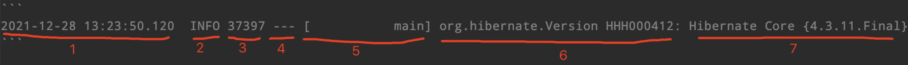



https://blog.didispace.com/spring-boot-learning-2x/

# Spring Boot 2.x 基础教程

## 1 环境搭建

### 1.1 典型package组织方式

```
com  
+- example   
	+- myproject      
		+- Application.java      
		|      
		+- domain      
		|  +- Customer.java      
		|  +- CustomerRepository.java      
		|      
		+- service      
		|  +- CustomerService.java      
		|      
		+- web      
		|  +- CustomerController.java      
```

- `com.example.myproject.domain`包：用于定义实体映射关系与数据访问相关的接口和实现
- `com.example.myproject.service`包：用于编写业务逻辑相关的接口与实现
- `com.example.myproject.web`：用于编写Web层相关的实现，比如：Spring MVC的Controller等 

## 2 配置详解

### 2.1 配置基础

#### 2.1.1 YAML

默认配置文件位置为： `src/main/resources/application.properties`

还支持YAML文件，YAML和properites的对比如下

YAML

```yaml
environments:   
	dev:       
		url: http://dev.bar.com        
		name: Developer Setup   
	prod:       
    	url: http://foo.bar.com       
        name: My Cool App
```

properties

```properties
environments.dev.url=http://dev.bar.com
environments.dev.name=Developer Setup
environments.prod.url=http://foo.bar.com
environments.prod.name=My Cool App
```

YAML还可以指定不同的环境用不同的配置

```yaml
server:
  port: 8881
---
spring:
  profiles: test
server:
  port: 8882
---
spring:
  profiles: prod
server:
  port: 8883
```

#### 2.1.2 自定义参数@Value和参数引用

YAML

```yaml
book:
	name: xxx
	author: yyy
	desc: ${book.name}
```

JAVA

```java
@Component
public class Book {
 
    @Value("${book.name}")
    private String name;
    @Value("${book.author}")
    private String author;
}
```

`@Value`注解加载属性值的时候可以支持两种表达式来进行配置：

- 一种是我们上面介绍的PlaceHolder方式，格式为 `${...}`，大括号内为PlaceHolder
- 另外还可以使用SpEL表达式（Spring Expression Language）， 格式为 `#{...}`，大括号内为SpEL表达式

#### 2.1.3 使用随机数

```yaml
${random.value}
${random.int}
${random.long}
```

#### 2.1.4 命令行参数输入

```shell
jave -jar xxx.jar --server.port=8888
```

#### 2.1.5 多环境配置

在resource下创建多个文件，文件名格式为

`application-{profile}.properties` 其实`{profile}`对应环境标识

在`application.properties`中通过`sprint.profiles.active`属性来设置不同的profile

#### 2.1.6 2.x新特性

##### 1 List类型

一定要连续赋值

```yaml
spring:
	example:
		url:
			- xxx
			- yyy
	example2:
		url: xxx, yyy
```

##### 2 Map类型

```yaml
spring:
	example:
		foo: bar
		hello: world
```

## 3 API开发

### 3.1 构建Restful API

- `@Controller`：修饰class，用来创建处理http请求的对象
- `@RestController`：Spring4之后加入的注解，原来在`@Controller`中返回json需要`@ResponseBody`来配合，如果直接用`@RestController`替代`@Controller`就不需要再配置`@ResponseBody`，默认返回json格式
- `@RequestMapping`：配置url映射。现在更多的也会直接用以Http Method直接关联的映射注解来定义，比如：`GetMapping`、`PostMapping`、`DeleteMapping`、`PutMapping`等

#### 1 定义实体类

```java
@Data
public class User {    
    private Long id;
    private String name;
    private Integer age;
}
```

这里使用`@Data`注解可以实现在编译器自动添加set和get函数的效果。该注解是lombok提供的

#### 2 定义Controller

```java
@RestController
@RequestMapping(value = "/users")     // 通过这里配置使下面的映射都在/users下
public class UserController {

    // 创建线程安全的Map，模拟users信息的存储
    static Map<Long, User> users = Collections.synchronizedMap(new HashMap<Long, User>());

    /**
     * 处理"/users/"的GET请求，用来获取用户列表
     *
     * @return
     */
    @GetMapping("/")
    public List<User> getUserList() {
        // 还可以通过@RequestParam从页面中传递参数来进行查询条件或者翻页信息的传递
        List<User> r = new ArrayList<User>(users.values());
        return r;
    }

    /**
     * 处理"/users/"的POST请求，用来创建User
     *
     * @param user
     * @return
     */
    @PostMapping("/")
    public String postUser(@RequestBody User user) {
        // @RequestBody注解用来绑定通过http请求中application/json类型上传的数据
        users.put(user.getId(), user);
        return "success";
    }

    /**
     * 处理"/users/{id}"的GET请求，用来获取url中id值的User信息
     *
     * @param id
     * @return
     */
    @GetMapping("/{id}")
    public User getUser(@PathVariable Long id) {
        // url中的id可通过@PathVariable绑定到函数的参数中
        return users.get(id);
    }

    /**
     * 处理"/users/{id}"的PUT请求，用来更新User信息
     *
     * @param id
     * @param user
     * @return
     */
    @PutMapping("/{id}")
    public String putUser(@PathVariable Long id, @RequestBody User user) {
        User u = users.get(id);
        u.setName(user.getName());
        u.setAge(user.getAge());
        users.put(id, u);
        return "success";
    }

    /**
     * 处理"/users/{id}"的DELETE请求，用来删除User
     *
     * @param id
     * @return
     */
    @DeleteMapping("/{id}")
    public String deleteUser(@PathVariable Long id) {
        users.remove(id);
        return "success";
    }

}
```

### 3.2 使用Swagger2构建文档

#### 1 整合Swagger2

在`pom.xml`中加入依赖

```xml
<dependency>
    <groupId>com.spring4all</groupId>
    <artifactId>swagger-spring-boot-starter</artifactId>
    <version>1.9.0.RELEASE</version>
</dependency>
```

应用主类中添加`@EnableSwagger2Doc`注解

```java
@EnableSwagger2Doc
@SpringBootApplication
public class Chapter22Application {

    public static void main(String[] args) {
        SpringApplication.run(Chapter22Application.class, args);
    }

}
```

配置文档

```yaml
swagger:
	title:	spring-boot-starter-swagger
	description: Starter for swagger 2.x
	version:	1.4.0.RELEASE
	license:	Apache License, Version 2.0
	licenseUrl:	https://www.apache.org/licenses/LICENSE-2.0.html
	termsOfServiceUrl:	https://github.com/dyc87112/spring-boot-starter-swagger
	contact:
		name:	didi
		url:	http://blog.didispace.com
		email:	dyc87112@qq.com
	base-package:	com.didispace
    base-path:	/**
```

访问接口：http://localhost:8080/swagger-ui.html

#### 2 完善文档内容

我们通过`@Api`，`@ApiOperation`注解来给API增加说明、通过`@ApiImplicitParam`、`@ApiModel`、`@ApiModelProperty`注解来给参数增加说明

```java
@Api(tags = "用户管理")
@RestController
@RequestMapping(value = "/users")     // 通过这里配置使下面的映射都在/users下
public class UserController {

    // 创建线程安全的Map，模拟users信息的存储
    static Map<Long, User> users = Collections.synchronizedMap(new HashMap<>());

    @GetMapping("/")
    @ApiOperation(value = "获取用户列表")
    public List<User> getUserList() {
        List<User> r = new ArrayList<>(users.values());
        return r;
    }

    @PostMapping("/")
    @ApiOperation(value = "创建用户", notes = "根据User对象创建用户")
    public String postUser(@RequestBody User user) {
        users.put(user.getId(), user);
        return "success";
    }

    @GetMapping("/{id}")
    @ApiOperation(value = "获取用户详细信息", notes = "根据url的id来获取用户详细信息")
    public User getUser(@PathVariable Long id) {
        return users.get(id);
    }

    @PutMapping("/{id}")
    @ApiImplicitParam(paramType = "path", dataType = "Long", name = "id", value = "用户编号", required = true, example = "1")
    @ApiOperation(value = "更新用户详细信息", notes = "根据url的id来指定更新对象，并根据传过来的user信息来更新用户详细信息")
    public String putUser(@PathVariable Long id, @RequestBody User user) {
        User u = users.get(id);
        u.setName(user.getName());
        u.setAge(user.getAge());
        users.put(id, u);
        return "success";
    }

    @DeleteMapping("/{id}")
    @ApiOperation(value = "删除用户", notes = "根据url的id来指定删除对象")
    public String deleteUser(@PathVariable Long id) {
        users.remove(id);
        return "success";
    }

}

@Data
@ApiModel(description="用户实体")
public class User {

    @ApiModelProperty("用户编号")
    private Long id;
    @ApiModelProperty("用户姓名")
    private String name;
    @ApiModelProperty("用户年龄")
    private Integer age;

}
```


### 3.3 JSR-303实现请求参数校验

#### 1 JSR-303标准

JSR是Java Specification Requests的缩写，意思是Java 规范提案。是指向JCP(Java Community Process)提出新增一个标准化技术规范的正式请求。任何人都可以提交JSR，以向Java平台增添新的API和服务。JSR已成为Java界的一个重要标准

JSR-303 是JAVA EE 6 中的一项子规范，叫做Bean Validation，Hibernate Validator 是 Bean Validation 的参考实现

**Bean Validation中内置的constraint**


**Hibernate Validator附加的constraint**


#### 2 基本用法

1. 在要校验的字段上添加上`@NotNull`注解

   ```java
   @Data
   @ApiModel(description="用户实体")
   public class User {
   
       @ApiModelProperty("用户编号")
       private Long id;
   
       @NotNull
       @ApiModelProperty("用户姓名")
       private String name;
   
       @NotNull
       @ApiModelProperty("用户年龄")
       private Integer age;
   
   }
   ```

2. 在需要校验的参数实体前添加`@Valid`注解

   ```java
   @PostMapping("/")
   @ApiOperation(value = "创建用户", notes = "根据User对象创建用户")
   public String postUser(@Valid @RequestBody User user) {
       users.put(user.getId(), user);
       return "success";
   }
   ```

3. 出错时回复

   - `timestamp`：请求时间
   - `status`：HTTP返回的状态码，这里返回400，即：请求无效、错误的请求，通常参数校验不通过均为400
   - `error`：HTTP返回的错误描述，这里对应的就是400状态的错误描述：Bad Request
   - `errors`：具体错误原因，是一个数组类型；因为错误校验可能存在多个字段的错误，比如这里因为定义了两个参数不能为`Null`，所以存在两条错误记录信息
   - `message`：概要错误消息，返回内容中很容易可以知道，这里的错误原因是对user对象的校验失败，其中错误数量为`2`，而具体的错误信息就定义在上面的`errors`数组中
   - `path`：请求路径

#### 3 依赖库

```xml
<dependency>
    <groupId>org.springframework.boot</groupId>
    <artifactId>spring-boot-starter-validation</artifactId>
</dependency>
```

也可以只依赖下面这个库

```xml
<dependency>
   <groupId>org.hibernate.validator</groupId>
    <artifactId>hibernate-validator</artifactId>
    <version>6.0.14.Final</version>
    <scope>compile</scope>
</dependency>
```


## 4 数据库操作

### 4.1 使用JdbcTemplate访问MySQL数据库

#### 1 数据源配置

1. 为了连接数据库需要引入jdbc支持，在`pom.xml`中引入如下配置

   ```xml
   <dependency>
       <groupId>org.springframework.boot</groupId>
       <artifactId>spring-boot-starter-jdbc</artifactId>
   </dependency>
   ```

2. 嵌入式数据库支持(H2，HSQL, Derby)

   ```xml
   <dependency>
       <groupId>org.hsqldb</groupId>
       <artifactId>hsqldb</artifactId>
       <scope>runtime</scope>
   </dependency>
   ```

3. 独立数据库MySql

   pom.xml

   ```xml
   <dependency>
       <groupId>mysql</groupId>
       <artifactId>mysql-connector-java</artifactId>
   </dependency>
   ```

   application.properties

   ```properties
   spring.datasource.url=jdbc:mysql://localhost:3306/test
   spring.datasource.username=dbuser
   spring.datasource.password=dbpass
   spring.datasource.driver-class-name=com.mysql.cj.jdbc.Driver
   ```

#### 2 使用JdbcTemplate

##### 1 领域对象

```java
@Data
@NoArgsConstructor
public class User {

    private String name;
    private Integer age;

}
```

使用了Lombok的`@Data`和`@NoArgsConstructor`注解来自动生成各参数的Set、Get函数以及不带参数的构造函数

##### 2 编写Service interface

```java
public interface UserService {

  
    int create(String name, Integer age);

    
    List<User> getByName(String name);

    
    int deleteByName(String name);

    
    int getAllUsers();

    
    int deleteAllUsers();

}
```

##### 3 编写Service的实现，注入JdbcTemplate

Spring Boot下访问数据库的配置依然秉承了框架的初衷：简单。`不需要像Spring应用中创建JdbcTemplate的Bean`，就可以直接在自己的对象中注入使用

```java
@Service
public class UserServiceImpl implements UserService {

    private JdbcTemplate jdbcTemplate;

    UserServiceImpl(JdbcTemplate jdbcTemplate) {
        this.jdbcTemplate = jdbcTemplate;
    }

    @Override
    public int create(String name, Integer age) {
        return jdbcTemplate.update("insert into USER(NAME, AGE) values(?, ?)", name, age);
    }

    @Override
    public List<User> getByName(String name) {
        List<User> users = jdbcTemplate.query("select NAME, AGE from USER where NAME = ?", (resultSet, i) -> {
            User user = new User();
            user.setName(resultSet.getString("NAME"));
            user.setAge(resultSet.getInt("AGE"));
            return user;
        }, name);
        return users;
    }

    @Override
    public int deleteByName(String name) {
        return jdbcTemplate.update("delete from USER where NAME = ?", name);
    }

    @Override
    public int getAllUsers() {
        return jdbcTemplate.queryForObject("select count(1) from USER", Integer.class);
    }

    @Override
    public int deleteAllUsers() {
        return jdbcTemplate.update("delete from USER");
    }
}
```

### 4.2 使用MyBatis访问MySQL

#### 1 整合MyBatis

pom.xml

```xml
<dependency>
    <groupId>org.mybatis.spring.boot</groupId>
    <artifactId>mybatis-spring-boot-starter</artifactId>
    <version>2.1.1</version>
</dependency>

<dependency>
    <groupId>mysql</groupId>
    <artifactId>mysql-connector-java</artifactId>
</dependency>
```

application.properties

```properties
spring.datasource.url=jdbc:mysql://localhost:3306/test
spring.datasource.username=root
spring.datasource.password=
spring.datasource.driver-class-name=com.mysql.cj.jdbc.Driver
```

#### 2 使用

##### 1 创建映射对象User

```java
@Data
@NoArgsConstructor
public class User {

    private Long id;

    private String name;
    private Integer age;

    public User(String name, Integer age) {
        this.name = name;
        this.age = age;
    }
}
```

##### 2 创建Mapper Interface

```java
@Mapper
public interface UserMapper {

    @Select("SELECT * FROM USER WHERE NAME = #{name}")
    User findByName(@Param("name") String name);

    @Insert("INSERT INTO USER(NAME, AGE) VALUES(#{name}, #{age})")
    int insert(@Param("name") String name, @Param("age") Integer age);

}
```

##### 3 创建Spring Boot 主类

```java
@SpringBootApplication
public class Chapter35Application {

	public static void main(String[] args) {
		SpringApplication.run(Chapter35Application.class, args);
	}

}
```

##### 4 单元测试

```java
@Slf4j
@RunWith(SpringRunner.class)
@SpringBootTest
public class Chapter35ApplicationTests {

    @Autowired
    private UserMapper userMapper;

    @Test
    @Rollback
    public void test() throws Exception {
        userMapper.insert("AAA", 20);
        User u = userMapper.findByName("AAA");
        Assert.assertEquals(20, u.getAge().intValue());
    }

}
```

#### 3 注解输入说明

##### 1 使用@Param

```java
@Insert("INSERT INTO USER(NAME, AGE) VALUES(#{name}, #{age})")
int insert(@Param("name") String name, @Param("age") Integer age);
```

`@Param`中定义的`name`对应了SQL中的`#{name}`，`age`对应了SQL中的`#{age}`

##### 2 使用Map

```java
@Insert("INSERT INTO USER(NAME, AGE) VALUES(#{name,jdbcType=VARCHAR}, #{age,jdbcType=INTEGER})")
int insertByMap(Map<String, Object> map);

//使用方法
Map<String, Object> map = new HashMap<>();
map.put("name", "CCC");
map.put("age", 40);
userMapper.insertByMap(map);
```

##### 3 使用对象

```java
@Insert("INSERT INTO USER(NAME, AGE) VALUES(#{name}, #{age})")
int insertByUser(User user);
```

`#{name}`、`#{age}`就分别对应了User对象中的`name`和`age`属性

##### 4 完整的增删改查

```java
public interface UserMapper {

    @Select("SELECT * FROM user WHERE name = #{name}")
    User findByName(@Param("name") String name);

    @Insert("INSERT INTO user(name, age) VALUES(#{name}, #{age})")
    int insert(@Param("name") String name, @Param("age") Integer age);

    @Update("UPDATE user SET age=#{age} WHERE name=#{name}")
    void update(User user);

    @Delete("DELETE FROM user WHERE id =#{id}")
    void delete(Long id);
}
```

#### 4 返回结果处理@Results

```java
@Results({
    @Result(property = "name", column = "name"),
    @Result(property = "age", column = "age")
})
@Select("SELECT name, age FROM user")
List<User> findAll();
```

`@Result`中的`property`属性对应User对象中的成员名，`column`对应SELECT出的字段名

### 4.3 使用MyBatis的XML配置方式

#### 1 在应用主类中增加mapper的扫描包配置

```java
@MapperScan("com.didispace.chapter36.mapper")
@SpringBootApplication
public class Chapter36Application {

	public static void main(String[] args) {
		SpringApplication.run(Chapter36Application.class, args);
	}

}
```

#### 2 创建Map Interface

```java
public interface UserMapper {

    User findByName(@Param("name") String name);

    int insert(@Param("name") String name, @Param("age") Integer age);

}
```

#### 3 application.properties指定xml配置

```properties
mybatis.mapper-locations=classpath:mapper/*.xml
```

####  4 创建xml文件

```xml
<?xml version="1.0" encoding="UTF-8" ?>
<!DOCTYPE mapper
        PUBLIC "-//mybatis.org//DTD Mapper 3.0//EN"
        "http://mybatis.org/dtd/mybatis-3-mapper.dtd">
<mapper namespace="com.didispace.chapter36.mapper.UserMapper">
    <select id="findByName" resultType="com.didispace.chapter36.entity.User">
        SELECT * FROM USER WHERE NAME = #{name}
    </select>

    <insert id="insert">
        INSERT INTO USER(NAME, AGE) VALUES(#{name}, #{age})
    </insert>
</mapper>
```

### 4.4 Mabatis事务用法

#### 1 @Options选项属性

```java
@Options(useGeneratedKeys = true, keyProperty = "userId")  //获得主键返回值
//其他属性
useCache=true
//为true时表示本条语句将进行二级缓存，仅在select下使用，select下默认为true
    
flushCache=false 
//为true时表示调用任何语句将清空本地缓存和耳机缓存，为flase时不会
//select时默认为false，insert、update、delete时默认为true
    
resultSetType=FORWARD_ONLY
//resultSetType设置结果集的游标怎么滚动
//FORWARD_ONLY表示结果集的游标只能向下移动 
//SCROLL_INSENSITIVE和SCROLL_SENSITIVE都能实现任意前后滚动，区别在于前者对于修改敏感，后者对于修改不敏感
    
statementType=PREPARED
//是否预编译
//STATEMENT 静态SQL
//PREPARED 动态SQL，一次编译，多次执行，可以防止SQL注入
//CALLABLE 动态SQL，支持调用存储过程（还提供了些其他的支持？） 	

fetchSize= -1
//每次读取多少行数据，-1或不设置：驱动来决定

timeout=-1 
//设置驱动程序等待数据库返回请求结果，并抛出异常时间的最大等待值，-1或不设置：驱动来决定

useGeneratedKeys=false
//(仅对 insert 有用)为true时会告诉 MyBatis 使用JDBC的 getGeneratedKeys 方法来取出由数据(比如:像 MySQL 和 SQL Server 这样的数据库管理系统的自动递增字段)内部生成的主键。


keyProperty="userId"
//(仅对 insert 有用)标记一个属性, MyBatis 会通过 getGeneratedKeys 或者通过 insert 语句的 selectKey 子元素设置它的值。默认: 不设置
```

#### 2 @MapperScan 和 @Mapper

在不使用@MapperScan前，我们需要直接在Mapper类上面添加注解@Mapper，这种方式要求每一个Mapper类都需要添加此注解，非常麻烦，属于重复劳动。通过使用@MapperScan注解，可以让我们不用为每个Mapper类都添加@Mapper注解。

```java
@SpringBootApplication
@MapperScan("cn.mybatis.mappers","cn.mybatis.mappers.student")
public class SpringbootMybatisDemoApplication {
 
    public static void main(String[] args) {
        SpringApplication.run(SpringbootMybatisDemoApplication.class, args);
    }
}
```

添加@MapperScan("cn.mybatis.mappers")注解以后，cn.mybatis.mappers包下面的接口类，在编译之后都会生成相应的实现类

另外，使用@MapperScan注解可以作用到多个包

#### 3 事务管理

添加mybatis-spring-boot-starter依赖时已经加入了事务处理的jar包：spring-tx.jar
在入口处添加@EnableTransactionManagement注解开始事务控制

```java
@Controller
 
@MapperScan("com.fc.mybatistest.mapper")
@EnableTransactionManagement
@SpringBootApplication
public class MybatistestApplication {
	
	@Autowired
	private UserService userService;
 
	public static void main(String[] args) {
		SpringApplication.run(MybatistestApplication.class, args);
	}
	
	@RequestMapping("/")
	public String findAll(Model model){
			...
	}
}
```

然后在业务逻辑层的实现类中添加注解@Transactional

```java

@Transactional(propagation = Propagation.REQUIRED,isolation = Isolation.DEFAULT,timeout=36000,rollbackFor=Exception.class)
public class UserServiceimpl implements UserService {
 
	@Autowired
	private UserMapper userMapper;
	
	@Override
	public List<User> findAll() {
		return userMapper.findAll();
	}
}
```

##### @Transactional各个属性含义

propagation --事务传播行为
含有以下值：

| PROPAGATION_REQUIRED      | 如果当前存在事务，则加入该事务；如果当前没有事务，则创建一个新的事务。这是默认值。 |
| ------------------------- | ------------------------------------------------------------ |
| PROPAGATION_REQUIRES_NEW  | 创建一个新的事务，如果当前存在事务，则把当前事务挂起。       |
| PROPAGATION_NOT_SUPPORTED | 以非事务方式运行，如果当前存在事务，则把当前事务挂起。       |
| PROPAGATION_NEVER         | 以非事务方式运行，如果当前存在事务，则抛出异常。             |
| PROPAGATION_MANDATORY     | 如果当前存在事务，则加入该事务；如果当前没有事务，则抛出异常。 |
| PROPAGATION_NESTED        | 如果当前存在事务，则创建一个事务作为当前事务的嵌套事务来运行；如果当前没有事务，则该取值等价于TransactionDefinition.PROPAGATION_REQUIRED。 |

isolation --事务隔离级别
含有以下值：

| ISOLATION_DEFAULT          | 这是默认值，表示使用底层数据库的默认隔离级别。对大部分数据库而言，通常这值就是READ_COMMITTED |
| -------------------------- | ------------------------------------------------------------ |
| ISOLATION_READ_UNCOMMITTED | 该隔离级别表示一个事务可以读取另一个事务修改但还没有提交的数据。该级别不能防止脏读，不可重复读和幻读，因此很少使用该隔离级别。比如PostgreSQL实际上并没有此级别 |
| ISOLATION_READ_COMMITTED   | 该隔离级别表示一个事务只能读取另一个事务已经提交的数据。该级别可以防止脏读，这也是大多数情况下的推荐值 |
| ISOLATION_REPEATABLE_READ  | 该隔离级别表示一个事务在整个过程中可以多次重复执行某个查询，并且每次返回的记录都相同。该级别可以防止脏读和不可重复读 |
| ISOLATION_SERIALIZABLE     | 所有的事务依次逐个执行，这样事务之间就完全不可能产生干扰，也就是说，该级别可以防止脏读、不可重复读以及幻读。但是这将严重影响程序的性能。通常情况下也不会用到该级别 |


timeout --事务超时


readOnly --读写或只读事务


rollbackFor --指定特定异常实例，遇到时数据回滚


rollbackForClassname--指定特定异常名，遇到时数据回滚


norollbackFor --指定特定异常实例，遇到时数据不会回滚

norollbackForClassname--指定特定异常名，遇到时数据不会回滚

## 5 Java开发神器Lombok的使用与原理

### 1 Lombok的简介

Lombok是一款Java开发插件，使得Java开发者可以通过其定义的一些注解来消除业务工程中冗长和繁琐的代码，尤其对于简单的Java模型对象（POJO）。在开发环境中使用Lombok插件后，Java开发人员可以节省出重复构建，诸如hashCode和equals这样的方法以及各种业务对象模型的accessor和ToString等方法的大量时间。对于这些方法，它能够在编译源代码期间自动帮我们生成这些方法，并没有如反射那样降低程序的性能

pom.xml

```xml
<dependency>
    <groupId>org.projectlombok</groupId>
    <artifactId>lombok</artifactId>
    <version>1.16.8</version>
</dependency>
```

IDEA里需要在设置中启用Build->Compiler->annotation processors

### 2 Lombok常用注解

#### 1 Val 

可以将变量申明是final类型

```java
public   static void main(String[] args) {

    val setVar = new HashSet<String>();
    val listsVar = new   ArrayList<String>();
    val mapVar = new HashMap<String,   String>();

    //=>上面代码相当于如下：
    final Set<String> setVar2 = new   HashSet<>();
    final List<String> listsVar2 = new   ArrayList<>();
    final Map<String, String> maps2 =   new HashMap<>();

}
```

#### 2 @NonNull 

注解能够为方法或构造函数的参数提供非空检查

```java
public void notNullExample(@NonNull String string) {
    //方法内的代码
}

//=>上面代码相当于如下：

public void notNullExample(String string) {
    if (string != null) {
        //方法内的代码相当于如下：
    } else {
        throw new NullPointerException("null");
    }
}
```

#### 3 @Cleanup 

能够自动释放资源

```java
public   void jedisExample(String[] args) {
    try {
        @Cleanup Jedis jedis =   redisService.getJedis();
    } catch (Exception ex) {
        logger.error(“Jedis异常:”,ex)
    }

    //=>上面代码相当于如下：
    Jedis jedis= null;
    try {
        jedis = redisService.getJedis();
    } catch (Exception e) {
        logger.error(“Jedis异常:”,ex)
    } finally {
        if (jedis != null) {
            try {
                jedis.close();
            } catch (Exception e) {
                e.printStackTrace();
            }
        }
    }
}
```

#### 4  @Getter/@Setter

可以针对类的属性字段自动生成Get/Set方法

```java
public class OrderCreateDemoReq{

    @Getter
    @Setter
    private String customerId;

    //其他代码……
}

//上面请求Req类的代码相当于如下：

public class OrderCreateDemoReq{
    private String customerId;    

    public String getCustomerId(){
         return customerId;
    }

    public void setCustomerId(String customerId){
         this.customerId = customerId;
    }
}
```

#### 5  @ToString 

为使用该注解的类生成一个toString方法，默认的toString格式为：ClassName(fieldName= fieleValue ,fieldName1=fieleValue)

```java
@ToString(callSuper=true,exclude="someExcludedField")
public   class Demo extends Bar {
    private boolean someBoolean = true;
    private String someStringField;
    private float someExcludedField;
}

//上面代码相当于如下：
public   class Demo extends Bar {
    private boolean someBoolean = true;
    private String someStringField;
    private float someExcludedField;
   
    @ Override
    public String toString() {
        return "Foo(super=" +   super.toString() +
            ", someBoolean=" +   someBoolean +
            ", someStringField=" +   someStringField + ")";
    }
}
```

#### 6 @EqualsAndHashCode

为使用该注解的类自动生成equals和hashCode方法

```java
@EqualsAndHashCode(exclude = {"id"}, callSuper =true)
public class LombokDemo extends Demo{
    private int id;
    private String name;
    private String gender;
}

//上面代码相当于如下：
public class LombokDemo extends Demo{

    private int id;
    private String name;
    private String gender;
    
    @Override
    public boolean equals(final Object o) {
        if (o == this) return true;
        if (o == null) return false;
        if (o.getClass() != this.getClass()) return false;
        if (!super.equals(o)) return false;
        final LombokDemo other = (LombokDemo)o;
        if (this.name == null ? other.name != null : !this.name.equals(other.name)) return false;
        if (this.gender == null ? other.gender != null : !this.gender.equals(other.gender)) return false;
        return true;
    }

    @Override
    public int hashCode() {
        final int PRIME = 31;
        int result = 1;
        result = result * PRIME + super.hashCode();
        result = result * PRIME + (this.name == null ? 0 : this.name.hashCode());
        result = result * PRIME + (this.gender == null ? 0 : this.gender.hashCode());
        return result;
    }

}
```

#### 7 @NoArgsConstructor/@RequiredArgsConstructor/@AllArgsConstructor

这几个注解分别为类自动生成了无参构造器、指定参数的构造器和包含所有参数的构造器

```java
@RequiredArgsConstructor(staticName = "of") 
@AllArgsConstructor(access = AccessLevel.PROTECTED) 
public class ConstructorExample<T> { 

  private int x, y; 
  @NonNull private T description; 
  
  @NoArgsConstructor 
  public static class NoArgsExample { 
    @NonNull private String field; 
  } 

}

//上面代码相当于如下：
@RequiredArgsConstructor(staticName = "of") 
@AllArgsConstructor(access = AccessLevel.PROTECTED) 
public class ConstructorExample<T> { 

  private int x, y; 
  @NonNull private T description; 

  @NoArgsConstructor 
  public static class NoArgsExample { 
    @NonNull private String field; 
  } 

}

public class ConstructorExample<T> { 
  private int x, y; 
  @NonNull private T description; 

  private ConstructorExample(T description) { 
    if (description == null) throw new NullPointerException("description"); 
    this.description = description; 
  } 

  public static <T> ConstructorExample<T> of(T description) { 
    return new ConstructorExample<T>(description); 
  } 

  @java.beans.ConstructorProperties({"x", "y", "description"}) 
  protected ConstructorExample(int x, int y, T description) { 
    if (description == null) throw new NullPointerException("description"); 
    this.x = x; 
    this.y = y; 
    this.description = description; 
  } 
  
  public static class NoArgsExample { 
    @NonNull private String field;
    
    public NoArgsExample() { 
    } 
  } 
}
```

#### 8 @Data

注解作用比较全，其包含注解的集合`@ToString`，`@EqualsAndHashCode`，所有字段的`@Getter`和所有非final字段的`@Setter`, `@RequiredArgsConstructor`

#### 9 @Builder

提供了一种比较推崇的构建值对象的方式

```java
@Data
@Builder(toBuilder = true)
public class Room {
    @NonNull
    private String id;
    private String name;
    private boolean active;
    private Date createTime;
    @Singular
    private Set<String> occupations;

    public static void main(String[] args) {
        Room room = Room.builder().active(true)
                .name("name")
                .id("id")
                .createTime(new Date())
                .occupation("1")	//@Singular可以用于并排添加成员
                .occupation("2")
                .build();

        Assert.assertEquals(2, room.getOccupations().size());

    }
}
```

#### 10 @Synchronized

类似Java中的Synchronized 关键字，但是可以隐藏同步锁

````java
public class SynchronizedExample { 

 private final Object readLock = new   Object(); 

 @Synchronized 
 public static void hello() { 
     System.out.println("world");   
 } 

 @Synchronized("readLock") 
 public void foo() { 
   System.out.println("bar"); 
 } 

//上面代码相当于如下：

 public class SynchronizedExample { 

  private static final Object $LOCK = new   Object[0]; 
  private final Object readLock = new   Object(); 

  public static void hello() { 
    synchronized($LOCK) { 
      System.out.println("world"); 
    } 
  }   

  public void foo() { 
    synchronized(readLock) { 
        System.out.println("bar");   
    } 
  } 

}
````

## 6 日志管理

### 6.1 使用Slf4j

英文全称：Simple Logging Facade for Java，即：简单日志门面，它并不是一个具体的日志解决方案，实际工作的还是Logback或Log4j这样的日志框架

```java
@Slf4j
@SpringBootApplication
public class Application {
    public static void main(String[] args) {
        SpringApplication.run(Application.class, args);

        log.error("Hello World");
        log.warn("Hello World");
        log.info("Hello World");
        log.debug("Hello World");
        log.trace("Hello World");
    }

}
```

这里我们通过在`pom.xml`中引入了Lombok，然后使用`@Slf4j`声明引入Slf4j的`log`日志记录对象。而这个日志具体是如何写到控制台或者文件的，则有Spring Boot项目中引入了什么具体的日志框架决定，默认情况下就是Logback

### 6.2 日志显示

启动任意一个Spring Boot项目，我们都可以在控制台看到很多日志信息，比如下面这样的一条日志：

[](https://blog.didispace.com/images/pasted-817.png)

日志的输出内容中一共有7种元素，具体如下：

1. 时间日期：精确到毫秒
2. 日志级别：ERROR, WARN, INFO, DEBUG or TRACE
3. 进程ID
4. 分隔符：`---` 标识实际日志的开始
5. 线程名：方括号括起来（可能会截断控制台输出）
6. Logger名：通常使用源代码的类名
7. 日志内容

### 6.3 日志输出

在Spring Boot应用中，日志会默认会输出到控制台中，默认的输出日志级别包含：`ERROR`、`WARN`和`INFO`

我们可以通过两种方式切换至`DEBUG`级别：

**第一种**：在运行命令后加入`--debug`标志，如：`$ java -jar myapp.jar --debug`

**第二种**：在配置文件`application.properties`中配置`debug=true`

### 6.4 日志配置

#### 1 多彩输出

通过在`application.properties`中设置`spring.output.ansi.enabled`参数来支持，该参数有三个选项：

- NEVER：禁用ANSI-colored输出
- DETECT：会检查终端是否支持ANSI，是的话就采用彩色输出（默认项）
- ALWAYS：总是使用ANSI-colored格式输出，若终端不支持的时候，会有很多干扰信息，不推荐使用

#### 2 文件输出

若要增加文件输出，需要在配置文件`application.properties`配置几个参数，比如这样：

```properties
logging.file.name=run.log
logging.file.path=./
```

- `logging.file.name`：设置文件名
- `logging.file.path`：设置文件路径

#### 3 文件滚动

一直把日志输出在一个文件里显然是不合适的，任何一个日志框架都会为此准备日志文件的滚动配置。由于本篇将默认配置，所以就是Logback的配置，具体有这几个：

- `logging.logback.rollingpolicy.file-name-pattern`：用于创建日志档案的文件名模式。
- `logging.logback.rollingpolicy.clean-history-on-start`：应用程序启动时是否对进行日志归档清理，默认为false，不清理
- `logging.logback.rollingpolicy.max-history`：要保留的最大归档日志文件数量，默认为7个
- `logging.logback.rollingpolicy.max-file-size`：归档前日志文件的最大尺寸，默认为10MB
- `logging.logback.rollingpolicy.total-size-cap`：日志档案在被删除前的最大容量，默认为0B

#### 4 级别控制

如果要对各个Logger做一些简单的输出级别控制，那么只需要在`application.properties`中进行配置就能完成。

配置格式：`logging.level.*=LEVEL`

- `logging.level`：日志级别控制前缀，`*`为包名或Logger名
- `LEVEL`：选项TRACE, DEBUG, INFO, WARN, ERROR, FATAL, OFF

### 6.5 使用Log4j2

#### 1 pom.xml

在`pom.xml`中引入Log4j2的Starter依赖`spring-boot-starter-log4j2`，同时排除默认引入的`spring-boot-starter-logging`

```xml
<dependency>
    <groupId>org.springframework.boot</groupId>
    <artifactId>spring-boot-starter-web</artifactId>
    <exclusions>
        <exclusion>
            <groupId>org.springframework.boot</groupId>
            <artifactId>spring-boot-starter-logging</artifactId>
        </exclusion>
    </exclusions>
</dependency>

<dependency>
    <groupId>org.springframework.boot</groupId>
    <artifactId>spring-boot-starter-log4j2</artifactId>
</dependency>
```

#### 2 application.properties

通过`logging.config`配置指定log4j2的配置文件位置

```properties
logging.config=classpath:log4j2.xml
```

#### 3 resource下新建log4j2.xml

```xml
<?xml version="1.0" encoding="UTF-8"?>
<Configuration status="INFO">
    <Appenders>
        <Console name="Console" target="SYSTEM_OUT">
            <PatternLayout pattern="%d{HH:mm:ss.SSS} [%t] %-5level %logger{36} - %msg%n"/>
        </Console>
    </Appenders>
    <Loggers>
        <Root level="INFO">
            <AppenderRef ref="Console"/>
        </Root>
    </Loggers>
</Configuration>
```

## 7 使用LDAP

### 7.1 LDAP简介

LDAP - entry - DN(key)

​					- 其他属性(type): value

LDAP的信息是以树型结构存储的，在树根一般定义国家(c=CN)或域名(dc=com)，在其下则往往定义一个或多个组织 (organization)(o=Acme)或组织单元(organizational units) (ou=People)

**LDAP简称对应**

- o：organization（组织-公司）
- ou：organization unit（组织单元-部门）
- c：countryName（国家）
- dc：domainComponent（域名）
- sn：surname（姓氏）
- cn：common name（常用名称）

### 7.2 入门示例

pom.xml

```xml
<dependency>
    <groupId>org.springframework.boot</groupId>
    <artifactId>spring-boot-starter-data-ldap</artifactId>
</dependency>

<dependency>
    <groupId>com.unboundid</groupId>
    <artifactId>unboundid-ldapsdk</artifactId>
    <scope>test</scope>
</dependency>
```

`spring-boot-starter-data-ldap`是Spring Boot封装的对LDAP自动化配置的实现，它是基于spring-data-ldap来对LDAP服务端进行具体操作的。

而`unboundid-ldapsdk`主要是为了在这里使用嵌入式的LDAP服务端来进行测试操作

src/test/resources/ldap-server.ldif

```ldif
dn: dc=didispace,dc=com
objectClass: top
objectClass: domain
objectclass: extensibleObject
dc: didispace

dn: ou=people,dc=didispace,dc=com
objectclass: top
objectclass: organizationalUnit
ou: people

dn: uid=ben,ou=people,dc=didispace,dc=com
objectclass: top
objectclass: person
objectclass: organizationalPerson
objectclass: inetOrgPerson
cn: didi
sn: zhaiyongchao
uid: didi
userPassword: {SHA}nFCebWjxfaLbHHG1Qk5UU4trbvQ=
```

`application.properties`中添加嵌入式LDAP的配置

```properties
spring.ldap.embedded.ldif=classpath:ldap-server.ldif
spring.ldap.embedded.base-dn=dc=didispace,dc=com
```

使用spring-data-ldap的基础用法，定义LDAP中属性与我们Java中定义实体的关系映射以及对应的Repository

```java
@Data
@Entry(base = "ou=people,dc=didispace,dc=com", objectClasses = "inetOrgPerson")
public class Person {

    @Id
    private Name id;
    @DnAttribute(value = "uid", index = 3)
    private String uid;
    @Attribute(name = "cn")
    private String commonName;
    @Attribute(name = "sn")
    private String userName;
    private String userPassword;

}

public interface PersonRepository extends CrudRepository<Person, Name> {
	
}
```

使用

```java
@Slf4j
@SpringBootTest
public class ApplicationTests {
    @Autowired
    private PersonRepository personRepository;

    @Test
    public void findAll() {
        personRepository.findAll().forEach(p -> {
            System.out.println(p);
        });

    }
}
```

其他使用

```java
Person person = new Person();
person.setUid("uid:1");
person.setSuerName("AAA");
person.setCommonName("aaa");
person.setUserPassword("123456");
personRepository.save(person);
```

连接LDAP服务器

```properties
spring.ldap.urls=ldap://localhost:1235
spring.ldap.base=dc=didispace,dc=com
spring.ldap.username=didispace
spring.ldap.password=123456
```




