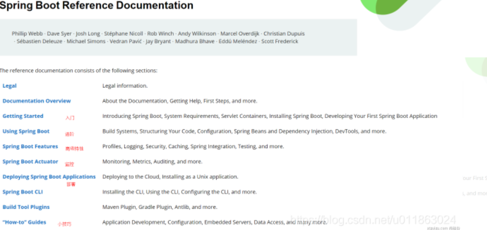
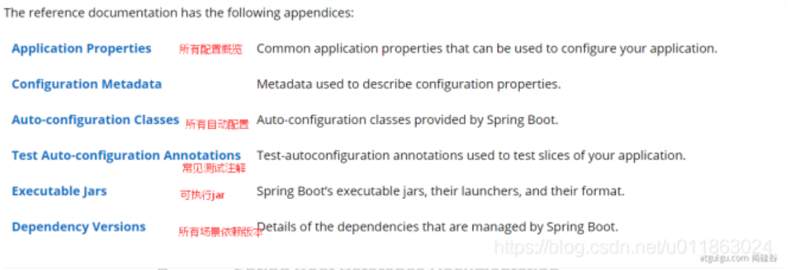



# 雷神 SpringBoot2 零基础入门 springboot 全套完整版

[B 站链接](https://www.bilibili.com/video/BV19K4y1L7MT?p=2&spm_id_from=pageDriver)

[笔记链接上](https://blog.csdn.net/u011863024/article/details/113667634)

[笔记链接下](https://blog.csdn.net/u011863024/article/details/113667946)

## 1 基础入门

### 1 SpringBoot2 课程介绍

- 学习资料
    - [Spring Boot 官网](https://spring.io/projects/spring-boot)
    - [Spring Boot 官方文档](https://docs.spring.io/spring-boot/docs/)
    - [本课程文档地址](https://www.yuque.com/atguigu/springboot)
    - [视频地址 1](http://www.gulixueyuan.com/)、[视频地址 2](https://www.bilibili.com/video/BV19K4y1L7MT?p=1)
    - [源码地址](https://gitee.com/leifengyang/springboot2)

### 2 Spring 生态圈

#### Spring 的生态

覆盖了：

- web 开发
- 数据访问
- 安全控制
- 分布式
- 消息服务
- 移动开发
- 批处理
- …

#### Spring5 重大升级

- 响应式编程

- 内部源码设计

基于 Java8 的一些新特性，如：接口默认实现。重新设计[源码](https://so.csdn.net/so/search?q=源码&spm=1001.2101.3001.7020)架构。

### 4 SpringBoot 官方文档架构

- [Spring Boot 官网](https://spring.io/projects/spring-boot)
- [Spring Boot 官方文档](https://docs.spring.io/spring-boot/docs/)

#### 官网文档架构





### 6 SpringBoot-依赖管理特性

#### 1 父项目做依赖管理

IDEA 用 Ctrl+Alt+左键鼠标跳转，但是 pom 没法调整，等着装上插件再试试看

```xml
依赖管理
<parent>
	<groupId>org.springframework.boot</groupId>
    <artifactId>spring-boot-starter-parent</artifactId>
    <version>2.3.4.RELEASE</version>
    这个版本号就定义了<dependency></dependency>的版本
</parent>

上面项目的父项目如下：
<parent>
	<groupId>org.springframework.boot</groupId>
	<artifactId>spring-boot-dependencies</artifactId>
	<version>2.3.4.RELEASE</version>
</parent>
它几乎声明了所有开发中常用的依赖的版本号，自动版本仲裁机制
```

#### 2 开发导入 starter 场景启动器

1. 见到很多 spring-boot-starter-* ： *就某种场景
2. 只要引入 starter，这个场景的所有常规需要的依赖我们都自动引入
3. 更多 SpringBoot 所有支持的场景
4. 见到的 \*-spring-boot-starter： 第三方为我们提供的简化开发的场景启动器。

```xml
所有场景启动器最底层的依赖
<dependency>
    <groupId>org.springframework.boot</groupId>
    <artifactId>spring-boot-starter</artifactId>
    <version>2.3.4.RELEASE</version>
    <scope>compile</scope>
</dependency>
```

####3 无需关注版本号，自动版本仲裁

引入依赖默认都可以不写版本 引入非版本仲裁的 jar，要写版本号。

#### 4 可以修改默认版本号

查看 spring-boot-dependencies 里面规定当前依赖的版本 用的 key。 在当前项目里面重写配置，如下面的代码

```xml

<properties>
    <mysql.version>5.1.43</mysql.version>
</properties>
```

### 7 自动配置

#### 7.1 自动配好 Tomcat

1. 引入 Tomcat 依赖。
2. 配置 Tomcat

```xml
<dependency>
	<groupId>org.springframework.boot</groupId>
	<artifactId>spring-boot-starter-tomcat</artifactId>
	<version>2.3.4.RELEASE</version>
	<scope>compile</scope>
</dependency>
```

#### 7.2 自动配好 SpringMVC

引入 SpringMVC 全套组件 自动配好 SpringMVC 常用组件（功能）

#### 7.3 自动配好 Web 常见功能，如：字符编码问题

SpringBoot 帮我们配置好了所有 web 开发的常见场景

```java
public static void main(String[] args) {
    //1、返回我们IOC容器
    ConfigurableApplicationContext run = SpringApplication.run(MainApplication.class, args);

    //2、查看容器里面的组件
    String[] names = run.getBeanDefinitionNames();
    for (String name : names) {
        System.out.println(name);
    }

}
```

#### 7.4 默认的包结构

- 主程序所在包及其下面的所有子包里面的组件都会被默认扫描进来

- 无需以前的包扫描配置

- 想要改变扫描路径

  - @SpringBootApplication(scanBasePackages=“com.lun”)
  - @ComponentScan 指定扫描路径

  ```java
  @SpringBootApplication
  等同于
  @SpringBootConfiguration
  @EnableAutoConfiguration
  @ComponentScan("com.lun")
  ```

#### 7.5 各种配置拥有默认值

- 默认配置最终都是映射到某个类上，如：MultipartProperties
- 配置文件的值最终会绑定每个类上，这个类会在容器中

#### 7.6 创建对象按需加载所有自动配置项

非常多的 starter 引入了哪些场景这个场景的自动配置才会开启 SpringBoot 所有的自动配置功能都在 spring-boot-autoconfigure 包里面

## 2、容器功能

###2.1 组件添加

`组件就是类，在Java里比较好听一点的说法，就是一个Bean`

#### 2.1.1 @Configuration

- 基本使用 - 在配置类里创建一个 java 方法来返回一个 Bean
- **Full 模式与 Lite 模式**

- 示例

-
    1. 配置类里面使用@Bean 标注在方法上给容器注册组件，默认也是单实例的

-
    2. 配置类本身也是组件

-
    3. proxyBeanMethods：代理 bean 的方法
        1. Full(proxyBeanMethods = true)（保证每个@Bean 方法被调用多少次返回的组件都是`单实例`的）（默认）
        2. Lite(proxyBeanMethods = false)（每个@Bean 方法被调用多少次返回的组件都是`新创建`的）

```java
@Configuration(proxyBeanMethods = false) //告诉SpringBoot这是一个配置类 == 配置文件
public class MyConfig {
    @Bean //给容器中添加组件。以方法名作为组件的id。返回类型就是组件类型。返回的值，就是组件在容器中的实例
    public User user01(){
        User zhangsan = new User("zhangsan", 18);
        //user组件依赖了Pet组件
        zhangsan.setPet(tomcatPet());
        return zhangsan;
    }

    @Bean("tom") //可以定义别名
    public Pet tomcatPet(){
        return new Pet("tomcat");
    }
}
###############@Configuration测试代码如下########################################
@SpringBootConfiguration
@EnableAutoConfiguration
@ComponentScan("com.atguigu.boot")
public class MainApplication {

    public static void main(String[] args) {
        //1、返回我们IOC容器
        ConfigurableApplicationContext run = SpringApplication.run(MainApplication.class, args);

        //2、查看容器里面的组件
        String[] names = run.getBeanDefinitionNames();
        for (String name : names) {
            System.out.println(name);
        }

        //3、从容器中获取组件

        Pet tom01 = run.getBean("tom", Pet.class);

        Pet tom02 = run.getBean("tom", Pet.class);

        System.out.println("组件："+(tom01 == tom02));


        //4、com.atguigu.boot.config.MyConfig$$EnhancerBySpringCGLIB$$51f1e1ca@1654a892
        MyConfig bean = run.getBean(MyConfig.class);
        System.out.println(bean);

        //如果@Configuration(proxyBeanMethods = true)代理对象调用方法。SpringBoot总会检查这个组件是否在容器中有。
        //保持组件单实例
        User user = bean.user01();
        User user1 = bean.user01();
        System.out.println(user == user1);


        User user01 = run.getBean("user01", User.class);
        Pet tom = run.getBean("tom", Pet.class);

        System.out.println("用户的宠物："+(user01.getPet() == tom));


    }
}
```

- 最佳实战

-
    -
        - 配置类组件之间无依赖关系用 Lite 模式加速容器启动过程，减少判断
        - 配置类组件之间有依赖关系，方法会被调用得到之前单实例组件，用 Full 模式

#### 2.1.2 @Bean、@Component、@Controller、@Service、@Repository

##### 定义

> 对于 Spring 容器来说，当我们把一个 Bean 标记为`@Component`后，它就会自动为我们创建一个单例（Singleton）。如果想每次都返回一个新的实例，用 Prototype

@Bean：表示一个方法实例化、配置或者初始化一个 Spring IoC 容器管理的新对象。 @Component: 自动被 comonent 扫描。 表示被注解的类会自动被 component 扫描 @Repository:
用于持久层，主要是数据库存储库。 @Service: 表示被注解的类是位于业务层的业务 component。 @Controller:表明被注解的类是控制 component，主要用于展现层 。

##### @Bean 与@Component 区别

@Component 是 spring 2.5 引入的，为了摆脱通过 classpath 扫描根据 xml 方式定义的 bean 的方式.

@Bean 是 spring 3.0 引入的，和 @Configuration 一起工作，为了摆脱原先的 xml 和 java config 方式。

Spring 管理 Bean 方式有两种，一种是注册 Bean，一种装配 Bean。 可以通过三种方式实现 bean 管理，一使用自动配置的方式、二使用 JavaConfig 的方式、三使用 XML 配置的方式。

@Compent 作用就相当于 XML 配置

```java
@Component
@Data
public class User{
    private String name = "tom";
}
```

> @Bean 需要在配置类中使用，即类上需要加上@Component 或者@Configuration 注解， 通常加上@Configuration。 @Bean 的用法在这里。

```java
@Configuration
public class AppConfig {

    @Bean
    public TransferServiceImpl transferService() {
        return new TransferServiceImpl();
    }
}
```

两者都可以通过@Autowired 装配

```java
@Autowired
private TransferService transferService;
```

##### @Component 与@Service 区别

目前基本没有区别

#### 2.1.3 @ComponentScan、@Import

给容器导入组件

@Import({User.class, DBHelper.class})

给容器中自动创建出这两个类型的组件（无参构造）、默认组件的名字就是全类名

```java
@Import({User.class, DBHelper.class})
@Configuration(proxyBeanMethods = false) //告诉SpringBoot这是一个配置类 == 配置文件
public class MyConfig {
}
```

#### 2.1.4 @Conditional

条件装配：满足 Conditional 指定的条件，则进行组件注入

```java
=====================测试条件装配==========================
@Configuration(proxyBeanMethods = false)
//@ConditionalOnBean(name = "tom")
@ConditionalOnMissingBean(name = "tom") //只有满足条件，类里注册的组件才能成功
public class MyConfig {
    @Bean
    public User user01(){
        User zhangsan = new User("zhangsan", 18);
        //user组件依赖了Pet组件
        zhangsan.setPet(tomcatPet());
        return zhangsan;
    }

    @Bean("tom22")
    public Pet tomcatPet(){
        return new Pet("tomcat");
    }
}

public static void main(String[] args) {
    //1、返回我们IOC容器
    ConfigurableApplicationContext run = SpringApplication.run(MainApplication.class, args);

    //2、查看容器里面的组件
    String[] names = run.getBeanDefinitionNames();
    for (String name : names) {
        System.out.println(name);
    }

    boolean tom = run.containsBean("tom");
    System.out.println("容器中Tom组件："+tom);

    boolean user01 = run.containsBean("user01");
    System.out.println("容器中user01组件："+user01);

    boolean tom22 = run.containsBean("tom22");
    System.out.println("容器中tom22组件："+tom22);
}
```

### 2.2 原生配置文件引入

#### 2.2.1 @ImportResource

负责引入 xml 里面定义的 Bean 组件

```xml
======================beans.xml=========================
<?xml version="1.0" encoding="UTF-8"?>
<beans xmlns="http://www.springframework.org/schema/beans"
       xmlns:xsi="http://www.w3.org/2001/XMLSchema-instance"
       xmlns:context="http://www.springframework.org/schema/context"
       xsi:schemaLocation="http://www.springframework.org/schema/beans http://www.springframework.org/schema/beans/spring-beans.xsd http://www.springframework.org/schema/context https://www.springframework.org/schema/context/spring-context.xsd">

    <bean id="haha" class="com.atguigu.boot.bean.User">
        <property name="name" value="zhangsan"></property>
        <property name="age" value="18"></property>
    </bean>

    <bean id="hehe" class="com.atguigu.boot.bean.Pet">
        <property name="name" value="tomcat"></property>
    </bean>
</beans>
```

```java
@ImportResource("classpath:beans.xml")
public class MyConfig {}
```

### 2.3 配置绑定

如何使用 Java 读取到 properties 文件中的内容，并且把它封装到 JavaBean 中，以供随时使用

Java 原生代码例子：

```java
public class getProperties {
     public static void main(String[] args) throws FileNotFoundException, IOException {
         Properties pps = new Properties();
         pps.load(new FileInputStream("a.properties"));
         Enumeration enum1 = pps.propertyNames();//得到配置文件的名字
         while(enum1.hasMoreElements()) {
             String strKey = (String) enum1.nextElement();
             String strValue = pps.getProperty(strKey);
             System.out.println(strKey + "=" + strValue);
             //封装到JavaBean。
         }
     }
 }
```

#### 2.3.1 @ConfigurationProperties + @Component

```java
/**
 * 只有在容器中的组件，才会拥有SpringBoot提供的强大功能
 */
@Component
@ConfigurationProperties(prefix = "mycar") //在properties里的名字
public class Car {
    ...
}
```

```properties
mycar.name="sss"
mycar.price=10000
```

#### 2.3.2 @ConfigurationProperties + @EnableConfigurationProperties

```java
@Configuration
@EnableConfigurationProperties(Car.class)
//1、开启Car配置绑定功能
//2、把这个Car这个组件自动注册到容器中
public class MyConfig {
}
```

## 3 自动配置原理入门

@SpringBootApplication 拆分成如下几条注解

### 3.1 引导加载自动配置类

```java
@SpringBootConfiguration
@EnableAutoConfiguration
@ComponentScan(excludeFilters = { @Filter(type = FilterType.CUSTOM, classes = TypeExcludeFilter.class),
		@Filter(type = FilterType.CUSTOM, classes = AutoConfigurationExcludeFilter.class) })
public @interface SpringBootApplication{}

```

#### 3.1.1 @SpringBootConfiguration

@Configuration。代表当前是一个配置类

#### 3.1.2 @ComponentScan

指定扫描哪些，Spring 注解；

#### 3.1.3 @EnableAutoConfiguration

包含下面两个注解

```java
@AutoConfigurationPackage
@Import(AutoConfigurationImportSelector.class)
public @interface EnableAutoConfiguration {}
```

##### 1 @AutoConfigurationPackage

自动配置包？指定了默认的包规则

```java
@Import(AutoConfigurationPackages.Registrar.class)  //给容器中导入一个组件
public @interface AutoConfigurationPackage {}

//利用Registrar给容器中导入一系列组件
//将指定的一个包下的所有组件导入进来？MainApplication 所在包下。
```

##### 2 @Import(AutoConfigurationImportSelector.class)

1、利用 getAutoConfigurationEntry(annotationMetadata);给容器中批量导入一些组件
2、调用`List<String> configurations = getCandidateConfigurations(annotationMetadata, attributes)`获取到所有需要导入到容器中的配置类 3、利用工厂加载
Map<String, List<String>> loadSpringFactories(@Nullable ClassLoader classLoader)；得到所有的组件 4、从 META-INF/spring.factories
位置来加载一个文件。 默认扫描我们当前系统里面所有 META-INF/spring.factories 位置的文件 spring-boot-autoconfigure-2.3.4.RELEASE.jar 包里面也有
META-INF/spring.factories

文件里面写死了 spring-boot 一启动就要给容器中加载的所有配置类 spring-boot-autoconfigure-2.3.4.RELEASE.jar/META-INF/spring.factories

### 3.2、按需开启自动配置项

虽然我们 127 个场景的所有自动配置启动的时候默认全部加载。xxxxAutoConfiguration 按照条件装配规则（@Conditional），最终会按需配置。

### 3.3、修改默认配置

```java
@Bean
@ConditionalOnBean(MultipartResolver.class)  //容器中有这个类型组件
@ConditionalOnMissingBean(name = DispatcherServlet.MULTIPART_RESOLVER_BEAN_NAME) //容器中没有这个名字 multipartResolver 的组件
public MultipartResolver multipartResolver(MultipartResolver resolver) {
    //给@Bean标注的方法传入了对象参数，这个参数的值就会从容器中找。
    //SpringMVC multipartResolver。防止有些用户配置的文件上传解析器不符合规范
    //Detect if the user has created a MultipartResolver but named it incorrectly
    return resolver;
}
给容器中加入了文件上传解析器MultipartResolver；

```

SpringBoot 默认会在底层配好所有的组件。但是如果用户自己配置了以用户的优先

```java
@Bean
@ConditionalOnMissingBean
public CharacterEncodingFilter characterEncodingFilter() {
}
```

总结：

- SpringBoot 先加载所有的自动配置类 xxxxxAutoConfiguration
- 每个自动配置类按照条件进行生效，默认都会绑定配置文件指定的值。xxxxProperties 里面拿。xxxProperties 和配置文件进行了绑定
- 生效的配置类就会给容器中装配很多组件
- 只要容器中有这些组件，相当于这些功能就有了
- 定制化配置

-
    - 用户直接自己@Bean 替换底层的组件
    - 用户去看这个组件是获取的配置文件什么值就去修改。

`xxxxxAutoConfiguration ---> 组件 --->** **xxxxProperties里面拿值 ----> application.properties`


