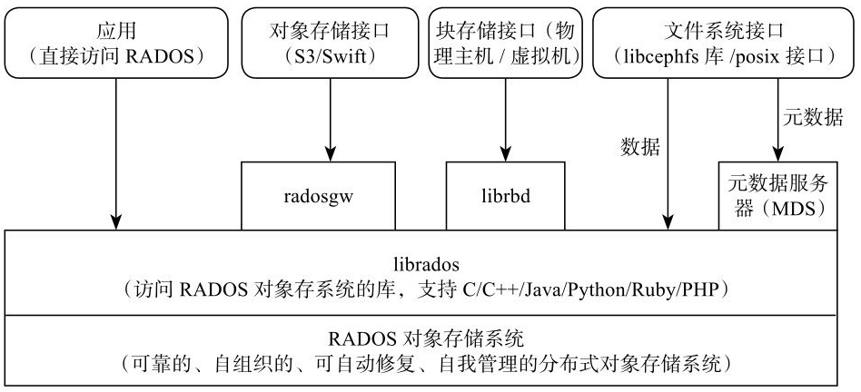
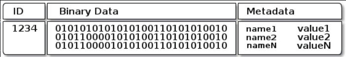
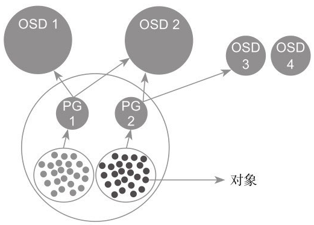
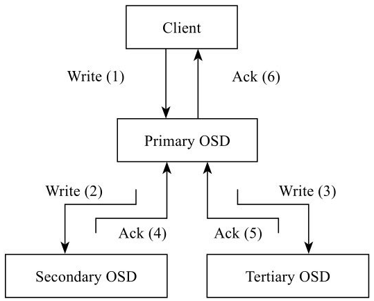
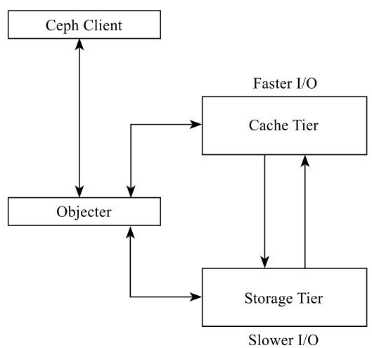

# Ceph 源码分析

# 第一章 Ceph 整体架构

## 1.1 Ceph 的发展历程


## 1.2 Ceph 的设计目标

通过集群优势来发挥高性能，通过软件的设计解决高可用性和可扩展性

## 1.3 Ceph 基本架构图



- 最底层是**RADOS**(reliable autonomous distributed object store)

  它是一个可靠的、自组织的、可自动修复、自我管理的分布式对象存储系统

  ceph-osd 后台服务进程 + cpeh-mon 监控进程

- 中间层 librados

  提供本地和远程接口。目前支持 C/C++语言、Java、Python、Ruby 和 PHP 语言的接口

- 面向应用提供了 3 种不同的存储接口

    - 块存储接口

      给虚拟机提供虚拟磁盘/ 通过内核映射给物理机提供磁盘

    - 对象存储接口

      AWS S3 接口 / OpenStack Swift 接口

    - 文件系统接口

      Posix 接口 / libcephfs 接口 / 文件系统的 meta data server (MDS) 提供 meta data 访问

## 1.4 Ceph 客户端接口

### 1.4.1 RBD(rados block device)

目前 RBD 提供了两个接口

一种是直接在用户态实现，通过 QEMU Driver 供 KVM 虚拟机使用。

另一种是在操作系统内核态实现了一个内核模块。通过该模块可以把块设备映射给物理主机，由物理主机直接访问

### 1.4.2 CephFS

CephFS 通过在 RADOS 基础之上增加了 MDS（Metadata Server）来提供文件存储。

它提供了 libcephfs 库和标准的 POSIX 文件接口。

CephFS 类似于传统的 NAS 存储，通过 NFS 或者 CIFS 协议提供文件系统或者文件目录服务。

### 1.4.3 RadosGW

RadosGW 基于 librados 提供了和 Amazon S3 接口以及 OpenStack Swift 接口兼容的对象存储接口

- RESTful 存储接口

- 扁平的数据组织形式

  无论是 S3 还是 Swift，都是分 3 级存储。S3 是 Accout/Bucket/Object，Swift 是 Account/Container/Object

## 1.5 RADOS

- Monitor 模块为整个存储集群提供全局的配置和系统信息
- 通过 CRUSH 算法实现对象的寻址过程
- 完成对象的读写以及其他数据功能
- 提供了数据均衡功能
- 通过 Peering 过程完成一个 PG 内存达成数据一致性的过程
- 提供数据自动恢复的功能
- 提供克隆和快照功能
- 实现了对象分层存储的功能
- 实现了数据一致性检查工具 Scrub

### 1.5.1 Monitor

Monitor 是一个独立部署的 daemon 进程。通过组成 Monitor 集群来保证自己的高可用。Monitor 集群通过 Paxos 算法实现了自己数据的一致性。它提供了整个存储系统的节点信息等全局的配置信息

Cluster Map 保存了系统的全局信息，主要包括：

- Monitor Map
    - 包括集群的 fsid
    - 所有 Monitor 的地址和端口
    - current epoch
- OSD Map：所有 OSD 的列表，和 OSD 的状态等
- MDS Map：所有的 MDS 的列表和状态

### 1.5.2 对象存储

对象是数据存储的基本单元，一般默认 4MB 大小



一个对象由 3 部分组成

- 对象标志(ID)
- 对象数据，保存至本地文件系统的文件里
- 对象的 metadata, key-value 形式保存至文件的扩展属性里。 也会以 leveldb 这样的 KV 来保持

### 1.5.3 pool 和 PG 的概念

pool 是个抽象的存储池。分 replicated 和 Erasure Code 两种

pool 有多个 PG(placement group)组成，PG 由多个对象租出，这些对象放在不同的 OSD 上



- PG1 和 PG2 同属于 1 个 pool，所以是 2 副本
- PG1 所有对象的主从副本都在 OSD1 和 OSD2 上。PG2 的对象在 OSD2 和 OSD3 上
- **一个对象只能属于一个 PG**
- OSD2 上有两个 PG 的对象

### 1.5.4 对象寻址过程

#### 1 Ojbect id 到 PG 的映射

静态 hash 映射

```C
pg_id = hash(object_id) % pg_num
```

#### 2 PG 到 OSD 的映射

使用了 CRUSH 算法，其本质是一个伪随机分布算法

### 1.5.5 数据读写过程

写操作如下



1. Client 向 PG 所在的主 OSD 发写
2. 主 OSD 一边写入本地，一边向 2 个从 OSD 发写副本请求
3. 主 OSD 收到从 OSD 的 Ack，并且确认自己写完，返回 Ack 给 Client

### 1.5.6 数据均衡

数据迁移的基本单位是 PG。

新加入一个 OSD，会改变 CRUSH Map。再引发 PG 到 OSD 列表的 map 改变

​ 数据迁移前 PG 分布

|     | OSD1 | OSD2 | OSD3 |
| --- | ---- | ---- | ---- |
| PGa | PGa1 | PGa2 | PGa3 |
| PGb | PGb3 | PGb1 | PGb2 |
| PGc | PGc2 | PGc3 | PGc1 |
| PGd | PGd1 | PGd2 | PGd3 |

​ 数据迁移后 PG 分布

|      | OSD1     | OSD2     | OSD3     | OSD4 |
| ---- | -------- | -------- | -------- | ---- |
| PGa  | ~~PGa1~~ | PGa2     | PGa3     | PGa1 |
| PGb  | PGb3     | PGb1     | ~~PGb2~~ | PGb2 |
| PGbc | PGc2     | ~~PGc3~~ | PGc1     | PGc3 |
| PGd  | PGd1     | PGd2     | PGd3     |      |

### 1.5.7 Peering

某个 OSD 失效时，这个 OSD 上的主 PG 会发起 Peering。

Peering 就是同步一个 PG 内所有副本，通过 PG 日志完成。Peering 完成后，改 PG 才可以对外进行读写服务

### 1.5.8 Recovery 和 Backfill

Recover 在 Peering 过程中完成。

如果某个 OSD 长期失效后重新加入集群，无法根据 PG 日志来修复。只能执行 Backfill(回填)

Backfill 过程是通过逐一对比两个 PG 的对象列表来修复。当新加入一个 OSD 产生了数据迁移，也需要通过 Backfill 过程来完成。

### 1.5.9 纠删码(Erasure Code)

N 份元数据，允许 M 份出错。一共存 M+N 份

### 1.5.10 快照和克隆

快照和克隆的区别在于快照只能读，而克隆可写

### 1.5.11 Cache Tier

RADOS 以 pool 为单位实现分层存储。Cache Pool 和 Data Pool。通过 Cache Tier 来管理热点数据。



### 1.5.12 Scrub

Scrub 用于检查数据一致性。后台定期扫描，比较一个 PG 内数据和副本来检查一致性。

- 一种是只比较各个副本 meta data
- 一种是 deep scrub，检查数据

# 第二章 Ceph 通用模块
