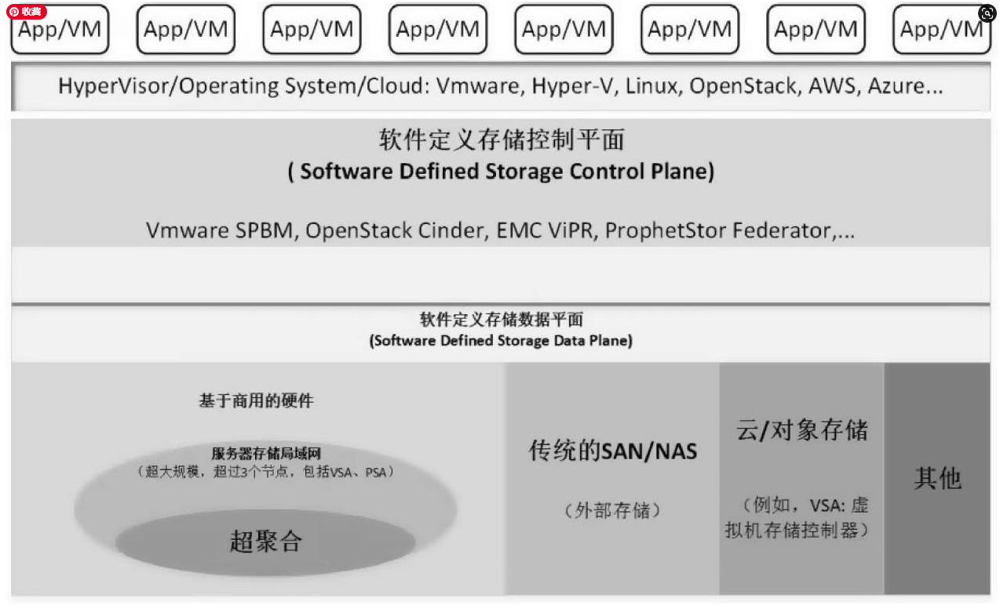
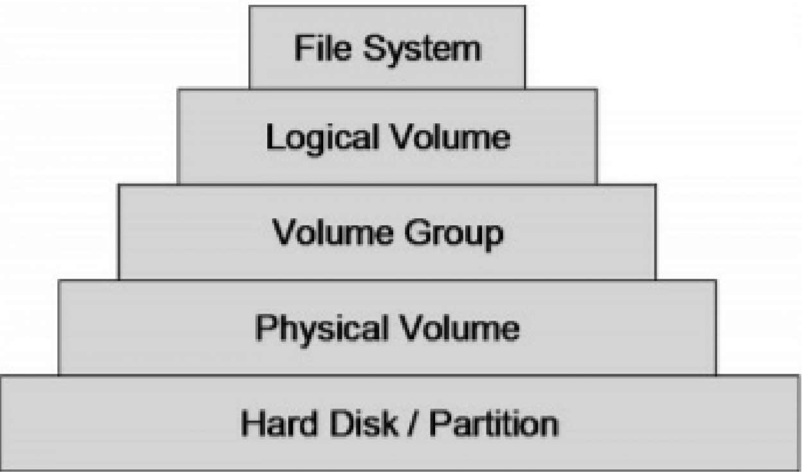
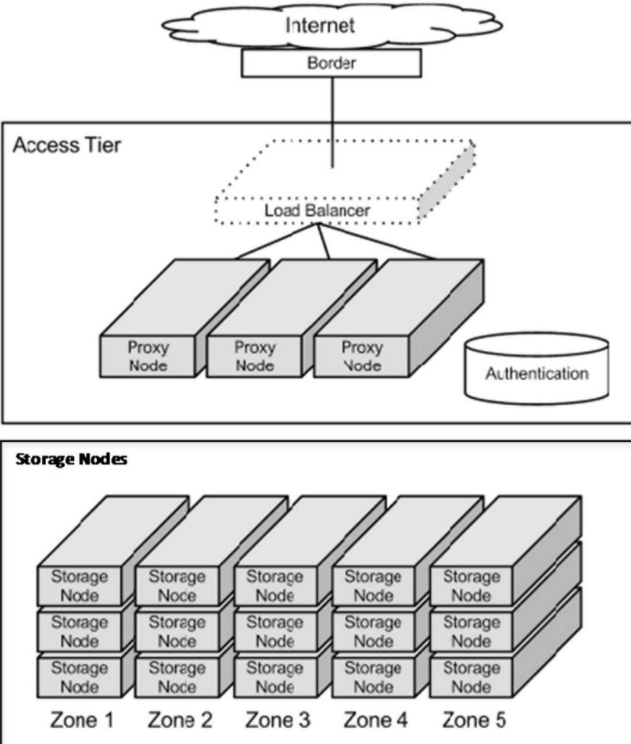
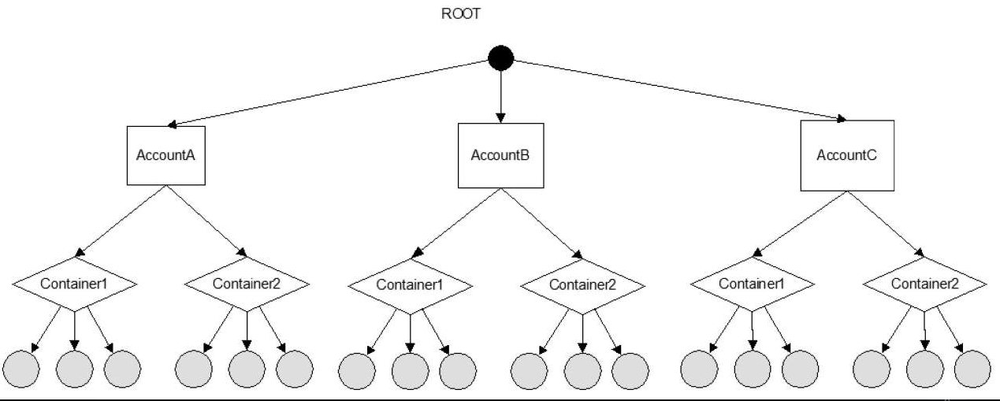
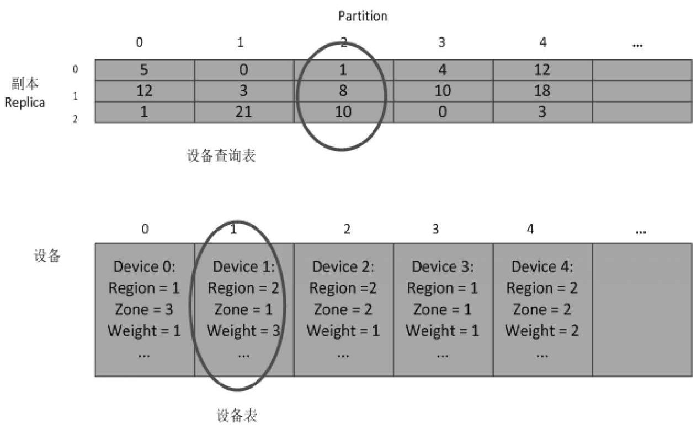
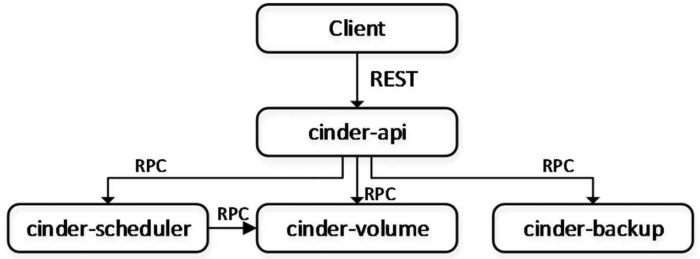

# 第一章 Linux开源存储

## 1.1 名字解释

* SCSI

　　SCSI是小型计算机系统接口(Small Computer System Interface)的简称，SCSI作为输入/输出接口，主要用于硬盘、光盘、磁带机、扫描仪、打印机等设备。

* FC

　　用于计算机设备之间数据传输，传输率达到2G（将来会达到4G）。光纤通道用于服务器共享存储设备的连接，存储控制器和驱动器之间的内部连接。

* DAS

　　DAS是直连式存储(Direct-Attached Storage)的简称，是指将存储设备通过SCSI接口或光纤通道直接连接到一台计算机上。当服务器在地理上比较分散，很难通过远程进行互连时，DAS是比较好的解决方案。但是这种式存储只能通过与之连接的主机进行访问，不能实现数据与其他主机的共享，同时，DAS会占用服务器操作系统资源，例如CPU资源、IO资源等，并且数据量越大，占用操作系统资源就越严重。


* NAS

　　网络接入存储(Network-Attached Storage)简称NAS，它通过网络交换机连接存储系统和服务器，建立专门用于数据存储的私有网络，用户通过TCP/IP协议访问数据，采用业界标准的文件共享协议如NFS、HTTP、CIFS来实现基于文件级(**非块级**)的数据共享。


* SAN

　　存储区域网络(Storage Area Network)简称SAN，它是一种通过光纤交换机、光纤路由器、光纤集线器等设备将磁盘阵列、磁带等存储设备与相关服务器连接起来的高速专用子网。

　　SAN由3个部分组成，分别是连接设备(如路由器、光纤交换机和Hub)、接口(如SCSI、FC)、通信协议(如IP和SCSI)。这3个部分再加上存储设备和服务器就构成了一个SAN系统。


　　这里我们注意一下SAN架构中的连接存储设备和服务器的**专用链路（SAN结构图中的绿色线条）**，早期是采用光纤链路的方式。目前的话已经是可以使用普通的TCP/IP链路（故存在FC SAN和IP SAN两种形式）。

* ISCSI

  通过TCP/IP传输SCSI命令。这样可以使用便宜的IP SAN来构建SAN。

  IP SAN存储需要专门的驱动和设备，幸运的是，一些传统的光纤适配器厂商都发布了iSCSI HBA设备，同时Inter也推出了专用的IP存储适配器，而Microsoft、HP、Novell、SUN、AIX、Linux也具有iSCSI Initiator软件，并且免费供用户使用

  iSCSI的组成

  　　一个简单的iSCSI系统大致由以下部分组成:

  　　iSCSI Initiator或者iSCSI HBA - 使用iSCSI的客户端

  　　iSCSI Target -  磁盘 

  　　以太网交换机

  　　一台或者多台服务器

  CentOS的tgt软件 scsi-target-utils/iscsi-initiator-utils

* ISCSI HBA/FC HBA

  HBA是host bus adapt, 表示存储接口和host接口的转换器。ISCSI就是把host的PCIe口转成iSCSI协议通过TCP/IP送出去。**iSCSI HBA是在Initiator上的**，也就是客户端发起访问的时候转成iSCSI协议，在target处只需要把SCSI协议直接发给磁盘让磁盘应答就好了，所以不需要额外硬件

## 1.2 Linux开源存储系统方案介绍

### 1.2.1 Linux单节点存储方案

#### 1 本地文件系统

#### 2 Linux远程存储服务

1. 块设备服务

   iSCSI和NVMe over Fabrics

2. 文件存储服务

   NFS/CIFS(Samba)/FTP/SSH

### 1.2.2 存储服务分类

 1. 块存储服务

    LVM

	2. 文件存储服务

    POSIX文件系统API

	3. 对象存储服务

    put/get/delete

    没有目录层次结构

    Metadata用于存储对象属性，有独立的metadata服务器

### 1.2.4 重复数据删除

Linux下的独立开源存储方案不太多，目前用得比较多的是OpenDedup。OpenDedup针对Linux的重复数据删除文件系统被称为SDFS

### 1.2.5 开源云计算数据存储平台


不同层次提供云计算

### 1.2.6 存储管理和软件定义存储



SNIA认为SDS应该包括：

- 自动化：简化管理，降低维护存储架构的成本；

- 标准接口：提供应用编程接口，用于管理、部署和维护存储设备和存储服务；

- 虚拟数据路径：提供块、文件和对象的接口，支持应用通过这些接口写入数据；

- 扩展性：无需中断应用，也能提供可靠性和性能的无缝扩展；

- 透明性：提供存储消费者对存储使用状况及成本的监控和管理。

  data path的虚拟化 + control path 抽象为存储服务

1. 控制平面控制平面常见的组件有以下几种。

* VMware SPBM（Storage Policy Base Management），基于存储策略的管理。
* OpenStack Cinder，用于提供块存储服务。
* EMC ViPR，其目标是实现EMC存储、异构存储、商用硬件本地存储资源的存储虚拟化（包括互操作性）。

2. 数据平面

* 商用硬件
  * HCI超融合架构： VMWARE VSAN、EMC ScaleIO   （超融合既分布式部署+分布式存储）
  * 非超融合架构：Dell Fluid Cache、HP StorVirtual
* 传统存储阵列 SAN+NAS
* 云和对象存储

#### SDS开源存储软件

* OpenSDS
* libvirt Storage Management.
* OHSM

### 1.2.7 开源分布式存储和大数据解决方案

分布式存储系统一般包括三大组件：元数据服务器（也称为主控服务器）、客户端及数据服务器。


#### 1 元数据（主控）服务器

* 命名空间管理

  分布式存储系统的元数据，包括对象和文件块的索引、文件之间的关系等

* 数据服务器管理

  管理各个数据节点，故障时恢复启动节点，管理备份节点。

* 主备份容灾

  元数据和数据都需要备份。基于内存的元数据管理方式，还需要启动日志系统持久化数据。

#### 2 数据服务器

* 数据的本地存储管理

  多个小文件存在同一块里。大文件分割成小文件存放在不同节点

* 状态维护

  数据服务器将自己的状态信息报告给元数据服务器，通常这些信息会包含当前的磁盘负载、I/O状态、CPU负载、网络情况等

* 副本管理

#### 3 客户端

提供操作系统接口，和虚拟文件系统对接

提供用户态的用户访问接口

Restful API 接口

#### 4 常见的开源分布式存储软件

##### Hadoop

Hadoop是由Apache基金会所发布的开源分布式计算平台，起源于Google Lab所开发的MapReduce和Google文件系统。准确来说，Hadoop是一个软件编程框架模型，利用计算机集群处理大规模的数据集进行分布式存储和分布式计算。

Hadoop由4个模块组成，即Hadoop Common、HDFS （Hadoop Distributed File System）、Hadoop YARN及HadoopMapReduce。其中，主要的模块是HDFS和Hadoop MapReduce。

HDFS是一个分布式存储系统，为海量数据提供存储服务。

Hadoop MapReduce是一个分布式计算框架，用来为海量数据提供计算服务。

##### HPCC

High Performance Computing Cluster。HPCC是一款开源的企业级大规模并行计算平台，主要用于大数据的处理与分析。HPCC提供了独有的编程语言、平台及架构，与Hadoop相比，在处理大规模数据时HPCC能够利用较少的代码和较少的节点达到更高的效率

##### ClusterFS

GlusterFS是一个开源分布式存储系统，具有强大的横向扩展能力，能够灵活地结合物理、虚拟的云资源实现高可用（HighAvailability,HA）的企业级性能存储，借助TCP/IP或InfiniBand RDMA网络将物理分布的网络存储资源聚集在一起，并使用统一的全局命名空间来管理数据。同时， GlusterFS基于可堆砌的用户空间设计，可以为各种不同的数据负载提供优质的性能。

##### Ceph

Ceph是一款开源分布式存储系统，起源于SageWeil在加州大学圣克鲁兹分校的一项博士研究项目，通过统一的平台提供对象存储、块存储及文件存储服务，具有强大的伸缩性，能够为用户提供PB乃至EB级的数据存储空间。Ceph的优点在于，它充分利用了集群中各个节点的存储能力与计算能力，在存储数据时会通过哈希算法计算出该节点的存储位置，从而使集群中负载均衡。同时，Ceph中采用了Crush、哈希环等方法，使它可以避免传统单点故障的问题，在大规模集群中仍然能保持稳态。目前，一些开源的云计算项目都已经开始支持Ceph。例如，在OpenStack中，Ceph的块设备存储可以对接OpenStack的Cinder后端存储、Glance的镜像存储和虚拟机的数据存储。

##### Sheepdog

Sheepdog是一个开源的分布式存储系统，于2009年由日本NTT实验室所创建，主要用于为虚拟机提供块设备服务。Sheepdog采用了完全对称的结构，没有类似元数据服务器的中心节点，没有单点故障，性能可线性扩展。当集群中有新节点加入时，Sheepdog会自动检测并将新节点加入集群中，数据自动实现负载均衡。目前QEMU/KVM、OpenStack及Libvirt等都很好地集成了对Sheepdog的支持。Sheepdog总体包括集群管理和存储管理两大部分，运行后将启动两种类型的进程：sheep与dog，其中，sheep进程作为守护进程兼备节点路由及对象存储功能；dog进程作为管理进程可管理整个集群。在Sheepdog对象存储系统中，getway负责从QEMU的块设备驱动上接收I/O请求，并通过哈希算法计算出目标节点，将I/O转发到相应的节点上。


# 第三章 Linux存储栈

## 3.1 Linux存储系统概述


POSIX文件接口 -> VFS -> Page Cache -> BIO -> (LVM/bdcache) -> 块层 -> 块设备 -> 不同协议 -> 物理设备

## 3.2 系统调用

pmap 进程号 或者  /proc/<pid>/maps查看当前进程的内存分布

```shell
pmap 4855
4855:   -bash
0000000000400000    976K r-x-- bash
00000000006f3000      4K r---- bash
00000000006f4000     36K rw--- bash
00000000006fd000     24K rw---   [ anon ]
00000000015c6000   5600K rw---   [ anon ]
00007ff7c56f0000     44K r-x-- libnss_files-2.23.so
00007ff7c56fb000   2044K ----- libnss_files-2.23.so
00007ff7c58fa000      4K r---- libnss_files-2.23.so
00007ff7c58fb000      4K rw--- libnss_files-2.23.so
00007ff7c58fc000     24K rw---   [ anon ]
00007ff7c5902000     44K r-x-- libnss_nis-2.23.so
00007ff7c590d000   2044K ----- libnss_nis-2.23.so
00007ff7c5b0c000      4K r---- libnss_nis-2.23.so
00007ff7c5b0d000      4K rw--- libnss_nis-2.23.so
00007ff7c5b0e000     88K r-x-- libnsl-2.23.so
00007ff7c5b24000   2044K ----- libnsl-2.23.so
00007ff7c5d23000      4K r---- libnsl-2.23.so
00007ff7c5d24000      4K rw--- libnsl-2.23.so
00007ff7c5d25000      8K rw---   [ anon ]
00007ff7c5d27000     32K r-x-- libnss_compat-2.23.so
00007ff7c5d2f000   2044K ----- libnss_compat-2.23.so
00007ff7c5f2e000      4K r---- libnss_compat-2.23.so
00007ff7c5f2f000      4K rw--- libnss_compat-2.23.so
00007ff7c5f30000   4652K r---- locale-archive
00007ff7c63bb000   1792K r-x-- libc-2.23.so
00007ff7c657b000   2048K ----- libc-2.23.so
00007ff7c677b000     16K r---- libc-2.23.so
00007ff7c677f000      8K rw--- libc-2.23.so
00007ff7c6781000     16K rw---   [ anon ]
00007ff7c6785000     12K r-x-- libdl-2.23.so
00007ff7c6788000   2044K ----- libdl-2.23.so
00007ff7c6987000      4K r---- libdl-2.23.so
00007ff7c6988000      4K rw--- libdl-2.23.so
00007ff7c6989000    148K r-x-- libtinfo.so.5.9
00007ff7c69ae000   2044K ----- libtinfo.so.5.9
00007ff7c6bad000     16K r---- libtinfo.so.5.9
00007ff7c6bb1000      4K rw--- libtinfo.so.5.9
00007ff7c6bb2000    152K r-x-- ld-2.23.so
00007ff7c6dac000     16K rw---   [ anon ]
00007ff7c6dd0000     28K r--s- gconv-modules.cache
00007ff7c6dd7000      4K r---- ld-2.23.so
00007ff7c6dd8000      4K rw--- ld-2.23.so
00007ff7c6dd9000      4K rw---   [ anon ]
00007ffc23556000    132K rw---   [ stack ]
00007ffc23595000     12K r----   [ anon ]
00007ffc23598000      4K r-x--   [ anon ]
ffffffffff600000      4K r-x--   [ anon ]
 total            28256K
```

如果映射的文件名为［anon］，则表示匿名的内存映射，指动态生成的内容所占用的内存

注意一下最后一个［anon］区域，它的地址在内核地址空间，这是VDSO（Virtual Dynamic Shared Object）技术的应用，相当于将一个内核动态库共享给应用进程。

> VDSO - vsyscall是老的系统调用加速方法，vdso是新的。vsyscall固定一段内核地址，系统调用时用这段地址做函数调用。vdso不用固定地址
>
> https://vvl.me/2019/06/linux-syscall-and-vsyscall-vdso-in-x86/

一般属性为“r-x”（只读并可执行的）的是程序的代码段，而具有可写属性的可能是数据段、未初始化的全局变量段、堆、栈等

## 3.3 文件系统

### 3.3.1 文件系统概述

虚拟文件系统主要有如下4个对象类型

* 超级块 super block
* 索引节点 inode
* 目录项 Dentry
* 文件

### 3.3.2 Btrfs

#### 1 B-Tree

Btrfs所有元数据使用B-Tree管理，ext4才开始对目录索引超过一定数量的使用B-Tree管理，否则都是线性查找

B-Tree和2叉树比，减少了树的高度，也就降低了磁盘IO的访问次数

#### 2基于extent的文件存储

ext2的时候，每个4K块都有一个指针，大文件需要很多指针。ext4、Btrfs都支持extent功能，用extent取代block来管理磁盘，能有效地减少元数据开销。extent由一些连续的block组成，由起始的block加上长度进行定义。

#### 3 动态inode分配

在ext2/3/4系列的文件系统中，索引节点的数量都是固定的，如果存储很多小文件的话，就有可能造成索引节点已经用完。不过它也有一个好处，就是磁盘一旦损坏，恢复起来要相对简单，因为数据在磁盘上的布局是相对固定的。

为了解决磁盘剩余空间无法被使用的问题，需要对索引节点进行动态分配：每一个索引节点作为B-Tree中的一个节点，用户可以无限制地任意插入新的索引节点，索引节点的物理存储位置是动态分配的，所以Btrfs没有对文件个数进行限制。

#### 4 固态硬盘优化

#### 5 元数据的CRC校验

Btrfs采用crc32算法计算校验和

ext4也有校验

#### 6 写时复制

对Btrfs来说，所谓的写时复制，是指每次将数据写入磁盘时，先将更新的数据写入一个新的block，当新数据写入成功之后，再更新相关的数据结构指向新block。写时复制只能保证单一数据更新的原子性

#### 7 子分区subvolume

subvolume可以作为根目录，挂载到任意挂载点。假如管理员只希望用户访问文件系统的一部分，如希望用户只能访问/var/test/下面的内容，而不能访问/var/目录下的其他内容，那么便可以将/var/test做成一个subvolume。/var/test的这个subvolume便是一个完整的文件系统，可以用mount命令挂载。如果挂载到/test目录下，给用户访问/test的权限，那么用户便只能访问/var/test下面的内容。

#### 8 软件RAID

Btrfs很好地支持了软件磁盘阵列，包括RAID0、RAID1和RAID10。

#### 9 压缩

Btrfs已经能够支持zlib、LZO与zstd等方式进行压缩。

## 3.4 Page Cache

应用层对文件的访问一般有两种方法：一是通过系统调用mmap()创建直接访问的虚拟地址空间，程序执行；二是利用系统调用read()/write())进行寻址访问。

一个文件通过mmap()映射到虚拟内存空间后，对这个内存区域进行第一次访问时，页表还没有建立，必然会出现一个内存访问的缺页错误。内核在处理这个缺页错误时，通过页面预读函数分配内存页面，然后将对应的文件块读入。当程序再次访问这个文件块的时候，由于它已经在内存缓存中了，因此就不需要再次访问文件了。

通过系统调用read()来访问文件时，最终也是通过页面预读函数分配PageCache的。而对文件缓存的写操作，使用写时复制机制，等到要同步或清理缓存时再把文件同步回去，这种情况一般会有延迟效应。

在早期版本的内核中，Page Cache和Buffer Cache是两个独立的缓存，前者缓存页，后者缓存块，从2.4.10版本内核开始，Buffer Cache不再是一个独立的缓存了，它被包含在Page Cache中，通过PageCache来实现。对于4KB大小的page来说，根据不同的块大小，它可以包含1～8个缓冲区。

``` shell
free
              total        used        free      shared  buff/cache   available
Mem:       16259400     6617064     3143312     1028100     6499024     5175976
Swap:             0           0           0
```

“buffers”表示块设备所占用的缓存页，包括直接读/写块设备，以及文件系统元数据，如SuperBlock所使用的缓存页；“cached”表示普通文件所占用的缓存页。

## 3.6 块层

### 3.6.1 bio与request

**bio描述了磁盘里要真实操作的位置与Page Cache中页的映射关系**

每个bio对应磁盘里面一块连续的位置，对应Page Cache的多页或一页，所以磁盘里面会有一个structbio_vec*bi_io_vec的表

``` c
struct bio_vec {
	struct page *bv_page;
	unsigned int bv_len;
	unsigned int bv_offst;
}
```


bio在块层会被转化为request，多个连续的bio可以合并到一个request中，生成的request会继续进行合并、排序，并最终调用块设备驱动的接口将request从块层的request队列（request_queue）中移到驱动层进行处理，以完成I/O请求在通用块层的整个处理流程。

**request用来描述单次I/O请求**

## 3.7 LVM

在2.6内核，基于device mapper机制实现了第二个版本LVM2。

 

  									LVM分层

 

​														device mapper架构

整个device mapper机制由两部分组成：内核空间的devicemapper驱动，用户空间的device mapper库

device mapper在内核中被注册为一个块设备驱动，它包含3个重要的对象概念：

* Mapped device是一个逻辑抽象，可以理解为内核向外提供的逻辑设备，它通过Mapping table描述的映射关系和Target device建立映射。
* Target device表示的是Mapped device所映射的物理空间段，对Mapped device所表示的逻辑设备来说，就是该逻辑设备映射到的一个物理设备。
* Mapping table里有mapped device逻辑上的起始地址、范围和表示在Target device上的地址偏移量及Target类型等信息

device mapper中的逻辑设备Mapped device不但可以映射一个或多个物理设备Target device，还可以映射另一个Mapped device

## 3.8 bcache

bcache是Linux内核的块层缓存，它使用固态硬盘作为硬盘驱动器的缓存

bcache从3.10版本开始被集成进内核，支持3种缓存策略，分别是写回（writeback）、写透（writethrough）、writearoud，默认使用writethrough，缓存策略可被动态修改

bucket是bcache最关键的结构，缓存设备按照一定的大小划分成很多bucket,bucket的默认大小是512KB，不过最好将其与缓存设备固态硬盘的擦除大小设置一致，如图3-14所示的每个小的方框都代表一个bucket，缓存数据与元数据都是按bucket来管理。

bcache采用写时复制的方式以bucket为单位进行空间的分配，对已经在固态硬盘中的数据与元数据进行覆盖写操作时，是写到新的bucket空间中的，这样无效的旧数据就会在其所在的bucket内形成“空洞”。因此需要一个异步的垃圾回收（GC）线程对这些数据进行标记与清理，并将含有较多无效数据的多个bucket压缩成一个bucket。

Linux开源社区有多个通用的块级缓存解决方案，其中包括bcache、dm-cache、flashcache、enhanceIO等。其中，dm-cache与bcache分别于3.9、3.10版本合并进内核，flashcache虽然没有引入内核，但在某些生产环境中也有使用。enhanceIO衍生于flashcache项目。

作为Linux内核的一部分，dm-cache也是基于device mapper实现的。dm-cache可以采用一个或多个快速设备作为后端慢速存储设备的缓存。dm-cache采用3个物理存储设备混合成1个逻辑卷的形式。其中，原始设备通常是硬盘或SAN，提供主要的慢速存储；缓存设备通常是指固态硬盘；元数据设备记录了原始数据块在缓存中的位置、脏标志，以及执行缓存策略所需的内部数据。  

## 3.9 DRBD

分布式块设备复制（Distributed Relicated Block Device,DRBD）用于通过网络在服务器之间对块设备（硬盘、分区、逻辑卷等）进行镜像，以解决磁盘单点故障的问题。可以将DRBD视作一种网络磁盘阵列，允许用户在远程服务器上建立一个本地块设备的实时镜像。

# 第八章 OpenStack 存储

OpenStack比较重要的组件有计算、对象存储、认证、用户界面、块存储、网络和镜像服务

1. 计算

   计算的项目代号是Nova，它根据需求提供虚拟机服务，如创建虚拟机或对虚拟机做热迁移等。从概念上看，它对应于AWS的EC2服务

2. 对象存储

   对象存储的项目代号是Swift，它允许存储或检索对象，也可以认为它允许存储或检索文件，它能以低成本的方式通过RESTful API管理大量无结构数据。它对应于AWS的S3服务

3. 认证

   认证的项目代号是Keystone，为所有OpenStack提供身份验证和授权服务

4. 用户界面

   用户界面的项目代号是Horizon

5. 块存储

   块存储的项目代号是Cinder，提供块存储服务。Cinder最早是由Nova中的nova-volume服务演化而来的。Cinder对应于AWS EBS块存储服务

6. 网络

   网络的项目代号是Neutron，用于提供网络连接服务，允许用户创建自己的虚拟网络并连接各种网络设备接口。

7. 镜像服务

   镜像服务的项目代号是Glance，它是OpenStack的镜像服务组件

## 8.1 Swift

### 8.1.1 Swift 体系结构

作为对象存储的一种，Swift比较适合存放静态数据。

如下图所示，Swift = 访问层(Access Tier) + 存储层(Storage Node)



Access Tier = Proxy Node + Authentication

在Proxy Node上运行的Proxy Server用来负责处理用户的RESTful请求，在接收到用户请求时，需要对用户的身份进行认证，此时用户所提供的身份资料会被转发给认证服务进行处理。Proxy Server可以使用Memcached进行数据和对象的缓存，来减少数据库读取的次数，提高用户的访问速度。

#### 1 存储层分层

存储层在物理上又分为如下一些层次

* Region:  地理上隔绝的区域
* Zone：在每个Region的内部又划分了不同的Zone来实现硬件上的隔绝。一个Zone可以是一个硬盘、一台主机、一个机柜或一个交换机，我们可以简单理解为一个Zone代表了一组独立的存储节点
* Storage Node：存储对象数据的物理节点，基于通用标准的硬件设备提供的对象存储服务
* Device：可以简单理解为磁盘
* Partition：这里的Partition仅仅是指在Device上的文件系统中的目录

#### 2 Storage Node分层

每个Storage Node上存储的对象在逻辑上又由3个层次组成：Account、Container及Object。



Account在对象的存储过程中实现顶层的隔离，代表的并不是个人账户，而是租户，一个Account可以被多个个人账户共同使用；Container代表了一组对象的封装，类似文件夹或目录，但是Container不能嵌套。

#### 3 Storage Node的服务

Storage Node上运行了3种服务。

* Account Server：提供Account相关服务，包括Container列表及Account的元数据等。Account的信息被存储在一个SQLite数据库中。
* Container Server：提供Container相关服务，包括Object的列表及Container的元数据等。与Account一样，Container的信息也被存储在一个SQLite数据库中。
* Object Server：提供对象的存取和元数据服务，每个对象的内容会以二进制文件的形式存储在文件系统中，元数据会作为文件的扩展属性来存储，也就是说，存储对象的物理节点上，本地文件系统必须支持文件的扩展属性，有些文件系统（如ext3）的文件扩展属性默认是关掉的。

#### 4 如何管理副本

为了保证数据在某个存储硬件损坏的情况下也不会丢失，Swift为每个对象建立了一定数量的副本（默认为3个），并且每个副本存放在不同的Zone中，这样即使某个Zone发生故障，Swift仍然可以通过其他Zone继续提供服务。

Swift管理副本的粒度是Partition，并非是单个对象

#### 5 数据一致性

Swift通过以下3种服务来解决数据一致性的问题

* Auditor：通过持续扫描磁盘来检查Account、Container和Object的完整性，如果发现数据有损坏的情况，Auditor就会对文件进行隔离，然后通过Replicator从其他节点上获取对应的副本用以恢复本地数据。
* Updater：在创建一个Container的时候需要对包含该Container的Account的信息进行更新，使得该Account数据库里面的Container列表包含这个新创建的Container。同样在创建一个新的Object的时候，需要对包含该Object的Container的信息进行更新。对于那些没有成功更新的操作，Swift会使用Updater服务继续处理这些失败的更新操作。
* Replicator：负责检测各个节点上的数据及其副本是否一致。当发现不一致时会将过时的副本更新为最新版本，并且负责将标记为删除的数据真正从物理介质上删除。

#### 6 存储对象和物理位置的映射

Swift引入了环的概念

环通过Zone、Device、Partition和Replica的概念来维护映射信息。每个Partition的位置由环来维护，并存储在映射中。环需要在Swift部署时使用“swift-ring-builder”工具手动进行构建，之后每次增减存储节点时，都需要重新平衡环文件中的项目，以保证系统因此而发生迁移的文件数量最少。

### 8.1.2 环

#### 1 一致性Hash算法

* 计算每个对象名称的哈希值并将它们均匀地分布到一个虚拟空间上，一般用2^32^标识该虚拟空间。
* 假设有2^m^个存储节点，那么将虚拟空间均匀分成2^m^份，每一份长度为2^(32-m)^。
* 假设一个对象名称哈希之后的结果是n，那么该对象对应的存储节点即为n/2^(32-m)^，转换为二进制位移操作，就是将哈希之后的结果向右位移(32-m)位

#### 2 环数据结构

环包括以下3种重要的数据结构

* 设备表：Swift将所有Device进行编号，设备表中的每一项都对应一个Device，其中记录了该Device的具体位置信息，包括Device ID，所在的Region、Zone、IP地址及端口号，以及用户为该Device定义的权重等。

* 当Device的容量大小不一致时，可以通过权重保证Partition均匀分布，容量较大的Device拥有更大的权重，也容纳更多的Partition。例如，一个1TB大小的Device有100的权重而一个2TB大小的Device将有200的权重。

* 设备查询表（Device Lookup Table）：存储Partition的各个副本（默认为3个）与具体Device的映射信息。设备查询表中的每1列对应1个Partition，每1行对应Partition的1个副本，每个表格中的信息为设备表中Device的编号，根据这个编号，可以在设备表中检索到该Device的具体信息（Device ID、IP地址及端口号等信息）。

* Partition移位值（Partition Shift Value）：表示在哈希之后将Object名字进行二进制位移的位数。

  

每个Partition有3个副本，每个单元格数字表示节点名称。

对象到Partition这层映射是通过哈希算法及二进制位移操作的，Partition到存储节点的映射是通过设备查询表完成的

#### 3 构建环

Swift使用swift-ring-builder工具构建一个环，所谓构建环就是构建设备查询表的过程。构建过程分为3个步骤

* 创建环

```shell
swift-ring-builder <builder_file> create <part_power> <replicase> <min_part_hours>
```

* 添加设备

  ```shell
  swift-ring-builder <builder_file> add [r<region>] z<zone>-<ip>:<port>/<device_name>_<meta> <weight
  ```

* 分配Partition

  ```shell
  swift-ring-builder <buidler_file> rebalance
  ```

### 8.1.6 数据一致性

#### 1.NWR策略

Swift保证数据一致性的理论依据是NWR策略（又称为Quorum仲裁协议），其中，N为数据的副本总数，W为更新一个数据对象时需要确保成功更新的份数，R为读取一个数据时需要读取的副本个数。

如果W+ R> N，那么就可以保证某个数据不能被两个不同的事务同时读/写。否则，如果有两个事务同时对同一数据进行读/写，那么在W+ R> N的情况下，至少会有一个副本发生读/写冲突。如果W> N/2，那么可以保证两个事务不能并发写同一个数据，否则，至少会有一个副本发生写冲突。

Swift默认采用了N=3、W=2、R=2的设置，表示一个对象默认有3个副本，至少需要更新2个副本才算写成功，至少读2个副本才算读成功。如果R=1，则可能会读取到旧版本的数据。

### 2.Auditor、Updater与Replicator

Auditor负责数据的审计，检查完整性

Replicator负责数据迁移

Updater对那些因为负荷不足而导致失败的Account或Container进行更新操作

## 8.2 Cinder

### 8.2.1 Cinder体系结构

Cinder则是在虚拟机与具体存储设备之间引入了一层“逻辑存储卷”的抽象。Cinder提供的RESTful API则主要是针对逻辑存储卷的管理



* cinder-api是进入Cinder的HTTP接口
* cinder-volume是运行在存储节点上管理具体存储设备的存储空间，每个存储节点上都会运行一个cinder-volume服务，多个这样的节点便构成了一个存储资源池。
* cinder-scheduler会根据预定的策略（如不同的调度算法）选择合适的cinder-volume节点来处理用户的请求

Cinder只提供了对逻辑卷的抽象，但不提供存储服务。比如备份，快照这些。

Cinder默认使用LVM作为后端存储，也可以使用其他存储系统

