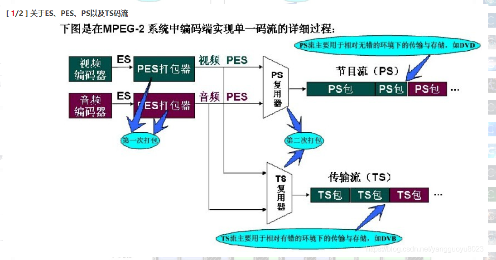
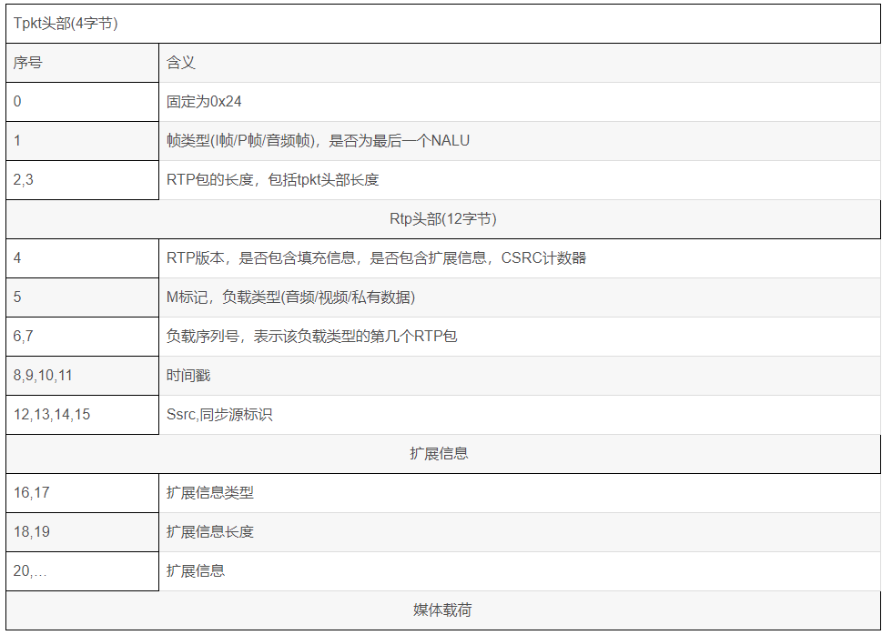
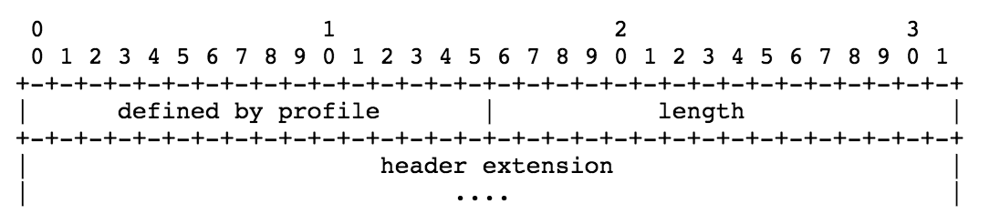
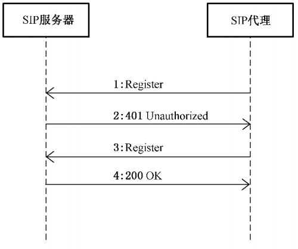
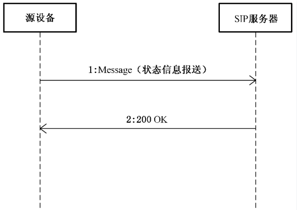
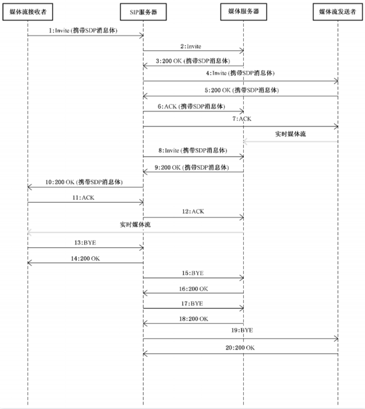



# 各种协议之间的关系

## MPEG2/TS/PS/262

一部分－ISO/IEC13818-1，System：系统，描述多个视频，[音频](https://so.csdn.net/so/search?q=音频&spm=1001.2101.3001.7020)和数据基本码流合成传输码流和节目码流的方式。 *TS/PS流在这里描述*

二部分－ISO/IEC13818-2，Video：视频，描述视频编码方法。 -*262*
三部分－ISO/IEC13818-3，Audio：音频，描述与MPEG-1音频标准反向兼容的音频编码方法。

## MPEG4/264/MP4

第一部分（ISO/IEC 14496-1）：系统：描述视频和音频数据流的控制、同步以及混合方式（即**混流**Multiplexing，简写为**MUX**）

第二部分（ISO/IEC 14496-2）：视频：定义一个对各种视觉信息（包括自然视频、静止纹理、计算机合成图形等等）的[编解码器](https://zh.wikipedia.org/wiki/编解码器)。（例如[XviD](https://zh.wikipedia.org/wiki/XviD)[编码](https://zh.wikipedia.org/wiki/编码)就属于MPEG-4 Part 2）

第十部分（ISO/IEC 14496-10）：[高级视频编码](https://zh.wikipedia.org/wiki/進階視訊編碼)或称高级视频编码（Advanced Video Coding，缩写为AVC）：定义一个视频编解码器（[codec](https://zh.wikipedia.org/wiki/Codec)）。AVC和XviD都属于MPEG-4编码，但由于AVC属于MPEG-4 Part 10，在技术特性上比属于MPEG-4 Part2的XviD要先进。另外，它和[ITU-T](https://zh.wikipedia.org/wiki/ITU-T) [H.264](https://zh.wikipedia.org/wiki/H.264)标准是一致的，故又称为[H.264](https://zh.wikipedia.org/wiki/H.264)

第十四部分（ISO/IEC 14496-14）：MPEG-4（即[MP4](https://zh.wikipedia.org/wiki/MP4)）文件格式：定义基于第十二部分的用于存储MPEG-4内容的[视频文档格式](https://zh.wikipedia.org/wiki/視訊檔案格式)

#流媒体协议

## 流媒体基本概念

### 1 各种格式的流

编码器 -> ES流(H264/mjpeg/aac) 

-> PES打包流 （将ES流分组、打包、加入包头信息等操作） head+payload

-> PS流 （PS包的包头中包含了同步信息与时钟恢复信息）16视频PES+32音频PES

-> TS流 用固定大小（188字节打包PES流）




### 2 PS流

[来源](https://blog.csdn.net/yangguoyu8023/article/details/97613434)

#### 2.1 简介

`视频流` = 多个NALU, **视频PS格式码流以NALU为单位进行打包**。**若当前为I帧或P帧的第一个NALU则需加PSH头部**。**若当前为I帧的第一个NALU还需要加PSM头部**，每个NALU分为若干段，每段前需加PES头部,每段数据与PES头部组成PES包

 [音频](https://so.csdn.net/so/search?q=音频&spm=1001.2101.3001.7020)PS格式码流以帧为单位进行打包。音频PS格式码流PSH头部可选。**音频关键帧包含PSM头部。**每个音频帧可分为若干段，每段前需加PES头部，每段数据与PES头部组成PES包。一般情况下音频流只包含PES包

 **私有数据PS格式码流以帧为单位进行打包。私有数据PS格式码流不包含PSH头部。私有数据关键帧包含PSM头部。**每个私有数据帧可分为若干段，每段前需加PES头部，每段数据与PES头部组成PES包。一般情况下私有数据流只包含PES包

| PSH  | PSM  | PES0 | DATA0 | PES1 | DATA1 | PESn | DATAn |
| ---- | ---- | ---- | ----- | ---- | ----- | ---- | ----- |
|      |      |      |       |      |       |      |       |

 I帧PS包格式，P帧没有PSM

#### 2.2 PSH 头部分析

 PSH：Program Stream pack Header ，是PS包的包头，主要包含系统时间信息。
 若当前码流类型为音频流则可选择是否包含PSH头部。若当前码流类型为视频流，且为当前帧的第1个NALU,则包含PSH头部。若为I帧，PSH头部长度为44个字节。若为P帧，PSH头部长度为20个字节。PSH头部主要包含时间戳,最大比特率,帧号信息
 **00 00 01 BA** PSH头部标志。**00 00 01 BB** I帧附加信息头部

| 字节号 | 含义                                              |
| ------ | ------------------------------------------------- |
| 3      | 为0xba，表示当前为PSH头部                         |
| 4~8    | 含有当前帧45K时间戳                               |
| 10~12  | 当前设置的最大比特率                              |
| 16~19  | 若set_frame_end_flg置为1，则16~19中存放当前帧帧号 |
|        | I帧附加信息                                       |
| 23     | 为0xbb,表示当前为I帧附件信息                      |
| 24~25  | 为18,等于I帧附加信息长度-2,I帧附加信息长度为20    |
| 26~28  | 表示当前设置的最大比特率                          |

#### 2.3 PSM头部分析
PS system Map 节目映射流(PSM)
当前为音频流/私有数据流的关键帧需要加PSM头部。`当前为视频流且为I帧的第一个NALU时需要加PSM头部`。主要包含BASIC信息、DEVICE信息、加密信息、视频流信息、音频流信息、私有数据信息。视频流信息分为VIDEO信息、VIDEO_CLIP信息、TIMING_HRD信息长度。音频流信息分为AUDIO信息。
00 00 01 BC PSM头部标志。

| 字节号      | 含义                                                         |
| ----------- | ------------------------------------------------------------ |
| 3           | 为0xbc，表示当前为PSM头部                                    |
| 8~9         | BASIC信息长度+DEVICE信息长度+加密信息长度                    |
|             | BASIC信息                                                    |
| AA          | 为0x40,表示当前为BASIC信息                                   |
| AA+1        | 为14,等于BASIC信息长度-2,BASIC信息长度为16                   |
| AA+2~AA+3   | 公司描述符                                                   |
| AA+6~AA+11  | 当前时间年月日时分秒及加密类型                               |
| AA+12       | 相机类型                                                     |
|             | DEVICE信息                                                   |
| BB          | 为0x41,表示当前为DEVICE信息                                  |
| BB+1        | 为18,DEVICE信息长度-2,DEVICE信息长度为20                     |
| BB+4~BB+19  | 为设备ID号                                                   |
|             | 加密信息                                                     |
| CC          | 为0x80,表示当前为加密信息                                    |
| CC+1        | 为6,加密信息长度-2,加密信息长度为8                           |
| CC+4        | 打包方式，加密算法                                           |
| CC+5        | 加密轮数,秘钥长度                                            |
| CC+6        | 加密类型                                                     |
| DD          | 视频流信息长度+音频流信息长度+私有数据信息长度               |
|             | 视频流信息                                                   |
| EE          | 视频编码类型，如H264、H265等                                 |
| EE+1        | 码流类型, 此处为0xe0,表示视频码流                            |
| EE+2~EE+3   | VIDEO信息长度+VIDEO_CLIP信息长度+TIMING_HRD信息长度          |
|             | VIDEO信息                                                    |
| aa          | 为0x42,表示当前为VIDEO信息                                   |
| aa+1        | 为14,VIDEO长度-2,VIDEO长度为16                               |
| aa+2~aa+3   | 编码器版本                                                   |
| aa+4~aa+5   | 编码年月日                                                   |
| aa+6~aa+9   | 原始图片宽高                                                 |
| aa+10       | 是否隔行扫描,b帧数目,是否为SVC码流,是否使用e帧,最大参考帧数目 |
| aa+11       | 水印类型,显示时是否需要反隔行                                |
| aa+12       | JPEG的Q值                                                    |
| aa+13~aa+15 | 以1/90000s为单位的两帧间时间间隔,是否使用固定帧率            |
|             | VIDEO_CLIP信息                                               |
| bb          | 为0x44,表示当前为VIDEO_CLIP信息                              |
| bb+1        | 为10,VIDEO_CLIP信息长度-2,VIDEO_CLIP长度为12                 |
| bb+2~bb+3   | 裁剪起始x坐标                                                |
| bb+4~bb+5   | 裁剪起始y坐标                                                |
| bb+6~bb+7   | 裁剪宽度                                                     |
| bb+8~bb+9   | 裁剪高度                                                     |
|             | TIMING_HRD信息                                               |
| cc          | 为0x2A,表示当前为TIMING_HRD信息                              |
| cc+1        | 为10,TIMING_HRD信息的长度-2,TIMING_HRD的长度为12             |
| cc+4~cc+7   | 以1/45000s为单位的两帧间的时间间隔                           |
| cc+10       | 图片宽度                                                     |
| cc+11       | 图片高度                                                     |
|             | 音频流信息                                                   |
| FF          | 音频编码类型,如AAC等                                         |
| FF+1        | 码流类型,此处为0xc0表示音频码流类型                          |
| FF+2~FF+3   | AUDIO信息长度                                                |
|             | AUDIO信息                                                    |
| dd          | 为0x43,表示当前为AUDIO信息                                   |
| dd+1        | 为10,AUDIO信息长度-2,AUDIO信息长度为12                       |
| dd+2~dd+3   | 音频帧长度                                                   |
| dd+4        | 音频声道数                                                   |
| dd+5~dd+7   | 音频采样率                                                   |
| dd+8~dd+10  | 音频比特率                                                   |
|             | 私有数据信息                                                 |
| GG          | 私有数据类型                                                 |
| GG+1        | 码流类型,此处为0xbd表示私有数据码流                          |
| GG+2~GG+3   | 0                                                            |
| HH          | CRC校验                                                      |

#### 2.4 PES包分析

 视频流/音频流/私有数据流都包含若干PES包。每个PES包由PES头部和码流数据两部分组成。**PES头部第4个字节用于判断码流类型,视频流为0xe0,音频流为0xc0,私有数据流为0xbd。**

每个NALU分为若干个段，每个段需加一个PES头部。第一个NALU的第一段的PES头部中可包含pts信息和user_data信息

对于音频流/私有数据流,每帧数据分为若干段,每段需加一个PES头部。第一段的PES头部中可包含pts信息和user_data信息。
      00 00 01 E0 PES头部标志，表示当前码流为视频流。 00 00 01 C0 PES头部标志，表示当前码流为音频流。 00 00 01 BD PES头部标志，表示当前码流为私有数据

| 字节号 | 含义                                                     |
| ------ | -------------------------------------------------------- |
|        | 基本信息                                                 |
| 3      | 码流类型，视频流或音频流或私有数据流                     |
| 4~5    | 基本信息长度+附加信息长度+媒体数据长度-6,基本信息长度为9 |
| 6      | 是否加密，PES优先级                                      |
| 7      | 用于判断PES头部中是否包含时间戳信息和用户数据信息        |
| 8      | 附加信息长度                                             |
|        | 附加信息                                                 |
| 9~13   | 时间戳信息                                               |
| 15~30  | 用户数据信息                                             |


byte 0-2 0x000001

byte 3 stream id (0xe0)

byte 4-5  PES length

byte 6

| 7-6  | 5-4        | 3        | 2              | 1         | 0        |
| ---- | ---------- | -------- | -------------- | --------- | -------- |
| 10   | scrambling | priority | data_alignment | copyright | original |

byte 7

| 7-6          | 5    | 4       | 3    | 2          | 1       | 0         |
| ------------ | ---- | ------- | ---- | ---------- | ------- | --------- |
| PTS_DTS_flag | ESCR | ES_rate | DSM  | additional | PES_CRS | extension |

Byte 7 PES header data length


## SIP协议

### 1 介绍

SIP（Session Initiation Protocol，会话初始协议）是一个控制发起、修改和终结交互式多媒体（音视频、聊天、游戏等）会话的信令协议（RFC 3261）。SIP是一个基于文本的协议，已为即时消息、列席和事件通知等定义了扩展。

为建立会话，SIP一般需要使用以下协议：

DNS：解析主机或域名；

SDP（会话描述协议）：描述、协商多媒体会话参数；

RTP（实时传输协议）： 传输实时数据（音视频媒体包）到端点；

RSVP（资源预留协议）：在建立媒体会话前预留出所需的带宽；

TLS（安全传输层协议）：可基于此提供SIP的隐私性和完整性；

STUN（NAT的UDP简单穿透）：发现是否有地址转换；

### 2 消息方式

SIP消息可分为`SIP请求`和`响应`

SIP地址被称为SIP URI，有类似EMail的地址格式：

sip:user@domain:port -  port是可选的，若没有则使用默认5060

#### 2.1 SIP请求

Request-Line  =  Method + SP + Request-URI + SP + SIP-Version + CRLF

SP是空格的意思

6种Method

1. `INVITE`：表明接收用户或服务被邀请加入一个会话；也可以使用这种方式来修改先前建立会话的特性；成功响应（200 OK）表明被叫方愿意参与会话；
2. `ACK`：确认UAC已经接收到了INVITE请求的最终响应（只与INVITE请求一起使用）；用于结束一个200 OK响应；若INVITE请求中不含有会话描述信息，ACK可以包含一个最终会话描述的消息体；
3. `OPTION`：UA用此向UAS查询它的功能；
4. `BYE`：用于终结一个先前建立的会话；
5. `CANCEL`：使UAC和网络服务器取消一个正在进行的请求（如INVITE）；
6. `REGISTER`：客户端注册其目前的位置信息；

#### 2.2 SIP响应

Status-Line := SIP-Version + SP + Status-Code + SP + Reason-Phrase + CRLF

`Status-Code`是100-699间的3位正整数

* 1xx：临时响应 （Provisional）；之前的请求消息已经收到，并准备接着处理后面的请求消息。
* 2xx：成功响应 （Success）； 操作成功，请求消息已被收到并且成功地处理。
* 3xx：重定向响应 （Redirection）； 服务器向客户端返回其它可能的位置，客户端应当根据响应中包含的地址信息向另一个服务器重发请求消息。
* 4xx： 客户端错误 （Client Error）； 请求由于客户端的错误而失败，客户端可以根据响应状态码修改并重发刚才的请求消息。
* 5xx：服务器错误 （Server Error） ；请求由于服务器的错误而失败，客户端可以向另一个服务器重发请求消息。
* 6xx：全局错误（Global Failure）； 请求失败，客户端不应该再向任何服务器重发该请求消息。

#### 2.3 SIP Message Header

标题头(头域)：字段

SIP常见头域（header）说明

* `From`：定义请求发起者（通常是发送者AOR），包含SIP或SIP URI和一个可选的显示名字；
* `To`：定义了请求的接收者（通常是接收者AOR），包含SIP或SIP URI和一个可选的显示名字；因重定向和转移，SIP请求不一定发送给‘希望的’接收者；
* `Call-ID`：定义了一系列的SIP消息，对所有由对话中的UA发送的所有SIP请求和响应，Call-ID必须唯一；
* `Cseq`：由一个整数值和一个方式名称组成，在一个对话中标识和序列SIP请求，也区分重传和新消息；
* `Via`：定义请求路径和响应要发送的地址；
* `Contact`：定义US希望接收新SIP请求的SIP或SIPS URI（实际地址）；
* `Allow`：列出产生SIP消息的UA所支持的功能集合；
* `Supported`：列出所有UA支持的SIP扩展（RFC3262）；
* `Require`：包含远端UA必须支持的SIP扩展；
* `Content-Type`：请求或响应的消息体类型；
* `Content-Length`：请求或响应的消息体的大小（十进制）；

### 3 Transaction(事务)和Session(会话)

**Transaction事务**

是指***一个请求消息***以及这个请求对应的所有响应消息的集合。

一个transaction由5个必要部分组成：from、to、Via头中的branch参数、call-id和cseq

**Session会话**

是一次通信过程中所有参与者之间的关联关系以及他们之间的媒体流的集合。只有当媒体协商成功后，会话才能被建立起来。

## SDP**会话描述协议**

###1 介绍

SIP使用SDP（RFC4566）进行媒体会话实际参数的描述，包括：媒体类型、编码、比特率（bit rate）、以及会话相关的地址与端口号

SDP会话描述由多行=组成。其中是一个字符。是一个字符串，其格式视而定。整个协议区分大小写。“=”两侧不允许有空格

***SDP在SIP的Message Body里***

### 2 SDP description

SDP desc = session level desc + media level desc

session level desc 从`v=`行开始到第一个media desc

media level desc从`m=`开始

#### 2.1 Session Description

```csharp
v=  (protocol version)
o= (owner/creator and session identifier).
s= (session name)
i=* (session information)
u=* (URI of description)
e=* (email address)
p=* (phone number)
c=* (connection information - notrequired if included in all media)
b=* (bandwidth information)

One or more time descriptions (seebelow)

z=* (time zone adjustments)
k=* (encryption key)
a=* (zero or more session attributelines)
Zero or more media descriptions (seebelow)
```

#### 2.2 Time desctiption

```swift
  t=  (time the session is active)

    r=* (zero or more repeat times)
```

#### 2.3 Media description

```swift
  m= (media name and transport address)

    i=* (media title)

    c=* (connection information - optionalif included at session-level)

    b=* (bandwidth information)

    k=* (encryption key)

    a=* (zero or more media attributelines)
```

上面的有些行是必需有的，有些行是可选的。可选的行有*号标记。必需的是v,o,s,t,m（这是对于会话级描述和媒体及描述总体而言的，对于媒体级描述而言只有m=是必须的）。注意所有的描述项必须按照上面的顺序给出

### 3 各字段描述

####3.1 Version（必选）

v=0  SDP的版本号，不包括次版本号。

####3.2 origion（必选）

o=<username> <sessionid> <version> <network type> <address type> <address>

o=<用户名> <session id> <会话版本> <网络类型><地址类型> <地址>

“o=”项对会话的发起者进行了描述。

<username>是用户的登录名。如果主机不支持<username>，则为 ”－”。注意：<username>不能含空格。

<session id>：是一个数字串。在整个会话中，必须是唯一的。为了确保其唯一，建议使用[NTP]。

<version>：该会话公告的版本,供公告代理服务器检测同一会话的若干个公告哪个是最新公告.基本要求是会话数据修改后该版本值递增,建议用NTP时戳。
<networktype>：网络类型，一般为”IN”,表示”internet”
<addresstype>：地址类型，一般为IP4

<address>: 地址


####3.3 Session Name（必选）

s=<sessionname>

会话名，在整个会话中有且只有一个”s=”。

####3.4 Connection Data（可选）

c=<networktype> <address type> <connection address>


```swift
 表示媒体连接信息。

 一个会话声明中，会话级描述中必须有”c=”项或者在每个媒体级描述中有一个”c=”项。可能在会话级描述和每个媒体级描述中都有”c=”项。

 <network type>：网络类型，一般为”IN”,表示”internet”

 <address type>：地址类型，一般为IP4。

 <connection address>：应用程序必须处理域名和ip地址两种情形。单播时，为域名或ip地址，推荐使用域名；多播，为ip地址，且ip后面必须有TTL（取值范围是0－255），地址和TTL决定了多播包被传播的范围。例：
```

c=IN IP4 224.2.1.1/127


```undefined
分层编码方案是一个数据流被分为多层，接受者能够通过申请不同层的流选择流的质量（包括带宽）如下：
```

<base multicastaddress>/<ttl>/<number of addresses>

如果<number of addresses>没有给定，则默认为1。

c=INIP4 224.2.1.1/127/3

等价于：

c=IN IP4 224.2.1.1/127

c=IN IP4 224.2.1.2/127

c=IN IP4 224.2.1.3/127

####3.5 Bandwidth（可选）

```ruby
  b=<modifier>:<bandwidth-value>

  描述了建议的带宽，单位kilobits per second，可选。
```

<modifier>：包括两种CT和AS。CT：ConferenceTotal，总带宽。AS：Application-SpecificMaximum，单个媒体带宽的最大值。

扩展机制：<modifier>以”X－”开始。建议modifier越短越好。例

b=X-YZ:128

####3.6 Times（必选）, RepeatTimesand Time Zones

```xml
 t=<start time>  <stop time>

 描述了会话的开始时间和结束时间。

 <start time> 和<stop time> 为NTP时间，单位是秒。假如<stop time>为零表示过了<start time>时间后会话一直持续。当<start time> 和<stoptime>均为零时表示持久会话。

 建议start time和stoptime不要设为0。因为不知道此会话的开始和结束时间，增加了调度（scheduling）的难度。
```

####3.7 Media Announcements （必选）

```cpp
m=<media><port> <transport> <fmt list>

一个会话描述包括几个媒体描述。一个媒体描述以”m=”开始到下一个”m=”结束。

<media>：表示媒体类型。有"audio", "video","application"（例白板信息）, "data"（不向用户显示的数据） 和"control"（描述额外的控制通道）。
```

<port>：媒体流发往传输层的端口。取决于c=行规定的网络类型和接下来的传送层协议：对UDP为1024-65535；对于RTP为偶数。当分层编码流被发送到一个单播地址时，需要列出多个端口。方式如下：

m=<media><port>/<number of ports> <transport> <fmt list>

对于RTP，偶数端口被用来传输数据，奇数端口用来传输RTCP包。例：

m=video49170/2 RTP/AVP 31

端口49170和49171为第一对RTP/RTCP端口，49172和49173为第二对的端口。传输协议是RTP/AVP，媒体格式为31（媒体格式是rtp头中payload参数对应的）。


```cpp
<transport>：传输协议，与c=行的地址类型有关。两种： RTP/AVP，表示RealtimeTransport Protocol using the Audio/Video profile carried over UDP；UDP。
```

<fmt list>：媒体格式。对于音频和视频就是在RTP Audio/Video Profile定义的负载类型(payload type)。但第一个为缺省值，分为静态绑定和动态绑定：静态绑定即媒体编码方式与RTP负载类型有确定的一一对应关系，动态绑定即媒体编码方式（如时钟频率，音频信道数等）没有完全确定，需要进一步的属性说明（用rtpmap）。分别举例如下，静态绑定的例子：u_law的PCM编码单信道Audio，采样率8KHZ。在RTPAudio/Video profile中对应的payload type为0。即：

m=audio49232 RTP/AVP 0

动态绑定的例子：16位线形编码，采样率为16KHZ，假如我们希望动态RTP/AVP 类型98表示此此流，写法如下：

m=video49232 RTP/AVP 98

a=rtpmap:98 L16/16000/2

####3.8 rtpmap（可选）

a=rtpmap:<payload type><encoding name>/<clock rate>[/<encodingparameters>]

a=rtpmap:<负载类型><编码名>/<时钟速率>[/<编码参数>]

对于音频流，<编码参数>说明了音频的通道数。通道数默认缺省值为1。对于视频流，现阶段没有<编码参数>。


```objectivec
              m=audio 49230 RTP/AVP 96 97 98          m=audio 8888 RTP/AVP 0     m=video 1234 RTP/AVP 96

              a=rtpmap:96 L8/8000                               a=rtpmap:0 pcma/8000/1        a=rtpmap:96 H264

              a=rtpmap:97 L16/8000

              a=rtpmap:98 L16/11025/2
```

在rtpmap中，实验性的编码方案也可以用。其格式名前一定为”X－”例：一种新的实验性的被称为GSMLPC的音频流，使用的动态负载类型为99。

m=video 49232 RTP/AVP 99


```undefined
                         a=rtpmap:99 X-GSMLPC/8000
```

####3.9 SuggestedAttributes（可选）

```ruby
a=<TYPE>或 a=<TYPE>:<VALUES>
```

a=framerate:<帧速率>//单位:帧/秒        1s播放几个rtp包  倒数为一个rtp包承载的数据播放的时间单位s


```go
                                音频的话       a=framerate:50        1byte*8000hz*20ms=160B

                                则每个rtp包的音频数据量为160B  时间戳增值为160
```

a=lang:<语言标记>//会话描述的缺省语言或媒体描述的语言

**注：**  如果SDP语法分析器不能识别某一类型(Type),则整个描述丢失。

## RTP协议

### 1 介绍

- 实时传输协议(RTP)，传输具有实时特性的数据
- RTP控制协议(RTCP)，监控QOS和传递会话中参与者的信息

### 2 定义

- RTP payload：RTP包中传输的数据，比如音频采样数据或者压缩过的视频数据。
- RTP packet：由定长RTP头部，数据来源者的列表，RTP payload组成的数据包。一些下层协议可能会自己定义RTP的封装格式。一般来说，一个下层协议包只包含一个RTP包，但是也有可能多个RTP包被合并到一起。
- RTCP packet：RTP控制报文，由定长的RTC头部开始，之后会跟着一些结构化的元素，它们在RTCP发挥不同功能时，会有不同的结构。通常多个RTCP包会被合在一起，通过一个下层协议包一起发送。
- Port：传输层协议中用来区分某一主机下不同应用的抽象。RTP协议依赖更底层网络提供端口机制，继而提供多播的RTP和RTCP报文。
- Transport address：网络地址和端口的组合，用来定位传输层的节点。
- RTC media type：一个RTP Session中所用到的所有payload类型的合集。
- Multimedia session： 视频会议组中同时工作的一组RTP session。例如，视频会议中的Audio session和Video session。
- RTP session：一组参与者利用RTP来通讯的组合。一个参与者可以同时加入到多个RTP session中。在Multimedia session中，除非特意将多媒体编码进同一数据流，否则，每个数据流会通过不同的RTP Session传输。与会者通过Transport address来区分不同的RTP session。同一RTP session的不同与会者会共享同一个Transport address，也可能每个与会者都有自己的Transport address。在单播的情况时，一个与会者可能用同一对端口（RTP&RTCP）来接受所有其他与会者的数据，也可能对不同的与会者采用不同的端口对（RTP&RTCP）。
- Synchronization source (SSRC)：RTP报文流的一个Source，由RTP头中定义的32-bit的SSRC identifier来标识，这样做是为了不依赖网络地址。同一个SSRC中发送的所有包都具有同一时序和序列号间隔，因此接收者可以通过SSRC将收到的数据包分组并排序。一个信号源（麦克风，摄像头，Mixer）的报文流会有由一个SSRC的发送器发送。一个SSRC可能会随着时间的变化，改变其数据格式，例如音频编码。SSRC的身份识别码都是随机生成的，但是必须保证整个RTP session中该身份识别码不会重复，这些工作是通过RTCP来完成的。如果一个与会者在一个RTP session中发送不同的媒体数据流，那么每个流的SSRC必须不同。
- `Contributing source (CSRC)`：RTP Mixer所混合的所有数据对应的SSRC的列表。Mixer会将一个SSRC列表写入RTP头中，该列表包含了这个混合报文中包含的所有来源SSRC。
- End system：一个生成RTP payload和消费收到的RTP payload的应用。一个End system可以扮演一个或者多个SSRC角色，但是通常是一个。
- Mixer：一个中介系统，它接受一个或多个Source的数据，随后它可能会改变这些数据的格式，并将它们合并为一个新的RTP packet。因为，多个输入源的时序通常来说都不一致，所以Mixer通常会同步不同源的时间，并生成一个自己的时序来处理合并数据流。所有从Mixer输出的数据包都会标记上该Mixer的SSRC。
- Translator：一个中介系统，它会转发RTP packet但是不改变其原本的SSRC。
- Monitor：一个在RTP session中接收RTCP报文的应用，它会总结数据被接受的报告，并为当前分发系统评估QOS，诊断错误，长期统计。Monitor可以集成进会议应用中，也可以是独立的第三方应用，只接受RTCP报文，但是什么都不发送。
- Non-RTP means：为了让RTP提供可用服务而加入的协议或者机制。特别是在多媒体会议中，需要一种控制协议来分发组播地址和加密密钥，协调加密算法，定义RTP payload格式和RTP payload类型的动态映射。

### 3 字节序，数据对齐，时间格式

大端序

16-bit的数据会对齐到偶数偏移，32-bit的数据会对齐到可被4整除的偏移。此外，用0来作为填充字节

用网络时间协议（NTP）的时间格式来表示，即从1900年一月一日0点到现在的秒数

### 4 RTP数据传输协议

#### 4.1 RTP码流格式

以NALU为单位打包视频流，若NALU的长度大于MTU（一次网传能够传输的最大字节数），则这个NALU需要拆分为多个RTP包。
如表1所示为RTP包的格式，RTP包由tpkt头部、rtp头部、扩展信息以及媒体流载荷组成

​											表1 RTP包格式

| tpkt头部              | rtp头部 | 扩展信息 | 媒体流载荷 |
| --------------------- | ------- | -------- | ---------- |
| 不是标准RTP协议中定义 |         | 可选     | 可选       |

如表2所示为基本信息RTP包，基本信息属于RTP包格式中的扩展信息。基本信息包括：公司标记、当前时间（年月日时分秒毫秒）、加密类型、相机标记、视频流类型、音频流类型、视频帧号。

​										表2 基本信息RTP包

| tpkt头部 | rtp头部 | 基本信息              |
| -------- | ------- | --------------------- |
|          |         | I帧的第一个NALU RTP包 |

如表3所示为媒体流描述信息RTP包，媒体流描述信息属于RTP包格式中的扩展信息。I媒体流描述信息包括：编码版本号、编码年月日、原始图片宽高、是否隔行扫描、b帧数目、是否为SVC码流、是否使用e帧、最大参考帧数目、水印类型,显示时是否需要反隔行、JPEG的Q值、以1/90000s为单位的两帧间时间间隔,是否使用固定帧率、裁剪起始x坐标、裁剪起始y坐标、裁剪宽度、裁剪高度、音频帧长度、音频声道数、音频采样率、音频比特率。

​								表3 媒体流描述信息RTP包

| tpkt头部 | rtp头部 | 媒体流描述信息          |
| -------- | ------- | ----------------------- |
|          |         | I帧的第一个NALU RTP包前 |

如表4所示为媒体流RTP包，加密信息包括：打包方式、加密算法、加密轮数、秘钥长度、加密类型。

​									表4 媒体流RTP包

| tpkt头部 | rtp头部 | 加密信息         | 媒体流载荷 |
| -------- | ------- | ---------------- | ---------- |
|          |         | 若媒体流加密则需 |            |

#### 4.2 Tpkt头部




#### 4.1 定长头字段

RTP头的格式如下：


- Version（V）：2 bits RTP版本号，现在用的是2。（第一个RTP草案用的1）
- Padding（P）：1 bit 如果设置了该字段，报文的末尾会包含一个或多个填充字节，这些填充字节不是payload的内容。最后一个填充字节标识了总共需要忽略多少个填充字节（包括自己）。Padding可能会被一些加密算法使用，因为有些加密算法需要定长的数据块。Padding也可能被一些更下层的协议使用，用来一次发送多个RTP包。
- Extension（X）：1 bit 如果设置了该字段，那么头数据后跟着一个拓展数据。
- CSRC count（CC）：4 bits CSRC列表的长度。
- Marker（M）：1 bit Marker会在预设中进行定义（预设和RTP的关系可以参考[rfc3551](https://link.zhihu.com/?target=https%3A//tools.ietf.org/html/rfc3551)，我的理解是预设是对RTP的补充，以达到某一类实际使用场景的需要），在报文流中用它来划分每一帧的边界。预设中可能会定义附加的marker，或者移除Marker来拓展payload type字段的长度。
- Payload type（PT）: 7 bits 该字段定义RTP payload的格式和他在预设中的意义。上层应用可能会定义一个（静态的类型码<->payload格式）映射关系。也可以用RTP协议外的方式来动态地定义payload类型。在一个RTP session中payload类型可能会改变，但是不应该用payload类型来区分不同的媒体流，正如之前所说，不同的媒体流应该通过不同session分别传输。
- Sequence number：16 bits 每发送一个RTP包该序列号+1，RTP包的接受者可以通过它来确定丢包情况并且利用它来重排包的顺序。这个字段的初始值应该是随机的，这会让[known-plaintext](https://link.zhihu.com/?target=https%3A//zh.wikipedia.org/wiki/%E5%B7%B2%E7%9F%A5%E6%98%8E%E6%96%87%E6%94%BB%E5%87%BB)更加困难。
- Timestamp：32 bits 时间戳反映了RTP数据包生成第一块数据时的时刻。这个时间戳必须恒定地线性增长，因为它会被用来同步数据包和计算网络抖动，此外这个时钟解决方案必须有足够的精度，像是一个视频帧只有一个时钟嘀嗒这样是肯定不够的。如果RTP包是周期性的生成的话，通常会使用采样时钟而不是系统时钟，例如音频传输中每个RTP报文包含20ms的音频数据，那么相邻的下一个RTP报文的时间戳就是增加20ms而不是获取系统时间。 和序列号一样时间戳的初始值也应该是随机的，而且如果多个RTP包是一次性生成的，那它们就会有相同的时间戳。 不同媒体流的时间戳可能以不同的步幅增长，它们通常都是独立的，具有随机的偏移。这些时间戳虽然足以重建单一媒体流的时序，但是直接比较多个媒体流的时间戳是没办法进行同步的。每一时间戳都会和参考时钟（wallclock）组成时间对，而且需要同步的不同流会共用同一个参考时钟，通过对比不同流的时间对，就能计算出不同流的时间戳偏移量。这个时间对并不是和每个RTP包一同发送，而是通过RTCP协议，以一个相对较低的频率进行共享。
- ***SSRC***：32 bits 该字段用来确定数据的`发送源`。这个身份标识应该随机生成，并且要保证同一个RTP session中没有重复的SSRC。虽然SSRC冲突的概率很小，但是每个RTP客户端都应该时刻警惕，如果发现冲突就要去解决。
- CSRC list：0 ~ 15 items， 32 bits each CSRC list表示对该payload数据做出贡献的所有SSRC。这个字段包含的SSRC数量由CC字段定义。如果有超过15个SSRC，只有15个可以被记录。

#### 4.2 RTP Session多路复用

在RTP中，多路复用由目标传输地址（address：port）提供，不同的RTP session有不同的传输地址。 独立的音频和视频流不应该包含在同一个RTP session中，也不应该通过payload类型和SSRC来区分不同的流

#### 4.3 RTP头扩展



### 5 RTP控制协议

#### 5.1 RTCP包格式

RTCP定义了许多包类型来传输不同的控制信息：

- SR：发送者报告，发送者数据发送和接受的统计。
- RR：接收者报告，只接受数据的节点的接受统计。
- SDES：Source描述，包括CNAME
- BYE：表示退出
- APP：上层应用自定义


## GB28181协议

### 1 协议介绍

GB28181 = SIP(会话通道) + RTP/RTCP(媒体流通道)

SIP = UAC(客户端)  +  UAS (服务端)

#### 1.1 注册



请求信息范例

> 1 REGISTER sip:34020000002000000001@3402000000 SIP/2.0
>
> 2 Via: SIP/2.0/UDP 192.168.137.11:5060;rport;branch=z9hG4bK1371463273
>
> 3 From: sip:34020000001320000003@3402000000;tag=2043466181
>
> 4 To: sip:34020000001320000003@3402000000
>
> 5 Call-ID: 1011047669
>
> 6 CSeq: 1 REGISTER
>
> 7 Contact: sip:34020000001320000003@192.168.137.11:5060
>
> 8 Max-Forwards: 70
>
> 9 User-Agent: IP Camera
>
> 10 Expires: 3600
>
> 11 Content-Length: 0

- 第1行表明这条SIP消息的方法（Method）是REGISTER，34020000002000000001是SIP服务器的国标ID，国标ID指的是由中心编码(8位) 、行业编码(2位) 、类型编码(3位)和序号(7位)四个码段共20位十进制数字字符构成，具体国标ID的编码方法可以参考GB/T 28181—2016中的附录D。3402000000指的是SIP服务器的域国标ID，SIP/2.0指的是SIP协议版本。
- 第2行为Via头，Via头中包含了发送请求方的相关信息，后续需要使用这些信息进行回复。SIP/2.0/UDP表示使用的是2.0版本的SIP协议，使用的传输协议是UDP，也可以使用TCP协议。192.168.137.11:5060为请求发送方的IP地址和端口号。Via头中必须包含branch参数，具体值是一个在整个SIP通信过程中不重复的数值。branch是一个事务ID（Transaction ID），用于区分同一个UA所发起的不同Transaction，它不会对未来的request或者是response造成影响，对于遵循IETF RFC3261规范的实现，这个branch参数的值必须用”z9hG4bK”打头. 其它部分是对To， From, Call-ID头域和Request-URI按一定的算法加密后得到。rport字段表示使用rport机制路由响应，即发送的响应时，按照rport中的端口发送SIP响应，也就是说IP和端口均完全遵照从哪里来的，发回哪里去的原则，如果没有rport字段时，服务端的策略是IP使用UDP包中的地址，即从哪里来回哪里去，但是端口使用的是via中的端口，详情见IETF RFC35818。
- 第3行为From头，From头中包含了请求发送方的逻辑标识，在GB28181协议中是发送请求的设备国标ID和域国标ID信息。tag参数是为了身份认证的，值为随机数字字符。
- 第4行为To头，To头在SIP协议中是为了标明请求接收方的逻辑标识的，在GB28181协议中填写的是发送请求的设备国标ID和域国标ID信息。
- 第5行为Call-ID头，Call-ID头是全局唯一的，在同一个session中保持一致，在不同session中不同。
- 第6行为CSeq头，CSeq头又叫Command Seqence（命令队列），用于标识命令顺序，值为序号+Method，序号部分为无符号整数，最大值为2^31。序号起始值是随机的，后续在同一个session中依次递增，比如发1 REGISTER没返回--->再发2 REGISTER--->没返回--->再发3 REGISTER--->这时返回了2 REGISTER就知道是第2个请求得到了响应。对于ACK和CANCLE中的CSeq与INVITE中的Cseq保持一致。
- 第7行为Contact头，Contact头包含源的URI信息，用来给响应消息直接和源建立连接用。在GB28181协议中为SIP设备编码@源IP地址端口。
- 第8行为Max-Forwards头，Max-Forwards头用于设置包最大中转次数，默认是70。
- 第9行为User-Agent头，User-Agent头用于设置关于UA的信息，用户可以自定义。
- 第10行为Expires头，Expires头表示超时时间。
- 第11行为Content-Length头，Content-Length头表示SDP消息的长度，因为REGISTER消息不需要SDP，因此为0。

注册的回复消息内容范例如下：

> 1 SIP/2.0 200 OK
>
> 2 Via: SIP/2.0/UDP 192.168.137.11:5060;rport;branch=z9hG4bK1371463273
>
> 3 From: sip:34020000001320000003@3402000000
>
> 4 To: sip:34020000001320000003@3402000000
>
> 5 CSeq: 1 REGISTER
>
> 6 Call-ID: 1011047669
>
> 7 Contact: sip:34020000001320000003@192.168.137.11:5060
>
> 8 User-Agent: FFmpeg GB28181 v1.0
>
> 9 Expires: 3600
>
> 10 Content-Length: 0

#### 1.2 保活



保活消息内容范例如下：

> 1 MESSAGE sip:34020000002000000001@3402000000 SIP/2.0
>
> 2 Via: SIP/2.0/UDP 192.168.137.11:5060;rport;branch=z9hG4bK1066375804
>
> 3 From: sip:34020000001320000003@3402000000;tag=1925919231
>
> 4 To: sip:34020000002000000001@3402000000
>
> 5 Call-ID: 1185236415
>
> 6 CSeq: 20 MESSAGE
>
> 7 Content-Type: Application/MANSCDP+xml
>
> 8 Max-Forwards: 70
>
> 9 User-Agent: IP Camera
>
> 10 Content-Length: 175
>
> 11 <?xml version="1.0" encoding="UTF-8"?>
>
> 12 <Notify>
>
> 13 <CmdType>Keepalive
>
> 14 <SN>1
>
> 15 <DeviceID>34020000001320000003
>
> 16 <Status>OK
>
> 17 <Info>
>
> 18 </Info>
>
> 19 </Notify>

Message回复消息内容范例如下：

> 1 SIP/2.0 200 OK
>
> 2 Via: SIP/2.0/UDP 192.168.137.11:5060;rport;branch=z9hG4bK1066375804
>
> 3 From: sip:34020000001320000003@3402000000
>
> 4 To: sip:34020000002000000001@3402000000
>
> 5 CSeq: 20 MESSAGE
>
> 6 Call-ID: 1185236415
>
> 7 User-Agent: FFmpeg GB28181 v1.0
>
> 8 Content-Length: 0

#### 1.3 实时视频播放



#### 1.4 invite流程：

向下级域发送invite请求

1. 下级域回复100
2. 下级域回复200
3. 上级域回复ack
   信令流程：

向下级域发送invite请求：

注：此时目的域id不再是下级平台的域id，而是要预览的设备id了。

> INVITE sip:34020000001320000003@3402000000 SIP/2.0
> Via: SIP/2.0/UDP 192.168.30.173:5060;rport;branch=SrsGbB87213477
> From: <sip:34020000002000000001@3402000000>;tag=SrsGbF30139209
> To: <sip:34020000001320000003@3402000000>
> Call-ID: 202096464045
> CSeq: 101 INVITE
> Content-Type: Application/SDP
> Contact: <sip:34020000002000000001@3402000000>
> Max-Forwards: 70
> User-Agent: SRS/4.0.26(Leo)
> Subject: 34020000001320000003:0009880078,34020000002000000001:0
> Content-Length: 216
>
> v=0
> o=34020000002000000001 0 0 IN IP4 192.168.30.173
> s=Play
> u=34020000001320000003:0
> c=IN IP4 192.168.30.173
> t=0 0
> m=video 9000 RTP/AVP 96
> a=recvonly
> a=rtpmap:96 PS/90000
> y=0009880078

下级域回复100：

> SIP/2.0 100 Trying
> Via: SIP/2.0/UDP 192.168.30.173:5060;rport;branch=SrsGbB87213477
> From: <sip:34020000002000000001@3402000000>;tag=SrsGbF30139209
> To: <sip:34020000001320000003@3402000000>
> Call-ID: 202096464045
> CSeq: 101 INVITE
> User-Agent: IP Camera
> Content-Length: 0

下级域回复200：

> SIP/2.0 200 OK
> Via: SIP/2.0/UDP 192.168.30.173:5060;rport=5060;branch=SrsGbB87213477
> From: <sip:34020000002000000001@3402000000>;tag=SrsGbF30139209
> To: <sip:34020000001320000003@3402000000>;tag=1263794727
> Call-ID: 202096464045
> CSeq: 101 INVITE
> Contact: <sip:34020000001320000003@192.168.30.228:5060>
> Content-Type: application/SDP
> User-Agent: Embedded Net DVR/NVR/DVS
> Content-Length:   264
>
> v=0
> o=34020000001110000001 0 0 IN IP4 192.168.30.228
> s=EZVIZ X5S
> c=IN IP4 192.168.30.228
> t=1591259324 1591269113
> m=video 62172 RTP/AVP 96
> a=sendonly
> a=rtpmap:96 PS/90000
> a=username:34020000001110000001
> a=password:12345678
> a=filesize:1
> y=0009880078
> f=

上级域回复ack：

> ACK sip:34020000001320000003@3402000000 SIP/2.0
> Via: SIP/2.0/UDP 192.168.30.173:5060;rport;branch=SrsGbB87213477
> From: <sip:34020000002000000001@3402000000>;tag=SrsGbF30139209
> To: <sip:34020000001320000003@3402000000>;tag=1263794727
> Call-ID: 202096464045
> CSeq: 101 ACK
> Max-Forwards: 70
> User-Agent: SRS/4.0.26(Leo)
> Content-Length: 0

invite流程走完后，会根据sdp中协商的传输协议，ip，端口发送音视频数据



