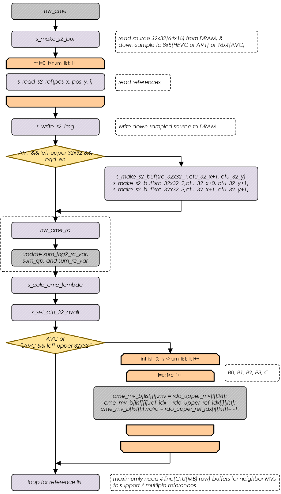



# Ranger C Model

## 1 Common Interface

## 2 Host Interface

入口

```c
main -> host_enc()
```

host_enc 流程

```c
int host_enc ( CMD_ARG* cmd_arg )
{
    host_param_t         *p_param = &enc_info.host_param;    //编码文件信息
    host_enc_seq_t       *p_seq = &enc_info.seq;             //编码参数，GOP，rc信息
    host_enc_result_t    *p_result = &enc_info.enc_result;	 //编码结果

    //从config文件读取编码参数
    if (host_cfg_parse_config_file(cfg_file_name, p_param, p_seq) == 0) {
        fprintf(stderr, "Config. File Error <%s>\n", cfg_file_name);
        return 1;
    }

    // 读取各种文件
    // 1. 原始YUV文件
    fp_in = s_fopen_file(src_yuv_file, "rb");
    // 2. fbc文件，用于放压缩帧
    if (recon_fbc_file[0])
    {
        fp_fbc = fopen(recon_fbc_file, "wb");
    }

    // 3. output文件
    fp_out = fopen(out_stream_file_name, "wb");

    // 4. sei文件
    if ( p_seq->enc_prefix_sei_nal )
    {
        fp_pre_sei = s_fopen_file ( p_param->prefix_sei_file, "rb" );
    }

    // 5. hrd文件
    if ( p_seq->enc_hrd_rbsp )
    {
        fp_hrd_rbsp = s_fopen_file ( p_param->hrd_file, "rb" );
    }

    // 6. VUI文件
    if ( p_seq->enc_vui_rbsp )
    {
        fp_vui_rbsp = s_fopen_file ( p_param->vui_file, "rb" );
    }


}
```

### Host 编码命令流程

CMD_INIT_VPU

CMD_CREATE_INSTANCE

CMD_ENC_SET_PARAM

CMD_SET_FB //设置 frame buffer

CMD_ENC_PIC //只编码头

CMD_ENC_PIC //编帧

## 3 FW Interface

### 主要编码流程

fw_com_enc_codec_enc_pic_one_pic_vcore

fw_hevc_enc_codec_enc_pic_one_pic_vcpu

fw_com_enc_pic s_cmd_run_pic fw_com_main_entry_func HOST_CMD_REG_WR host_api_cmd_enc_header host_enc main

fw_com_main.c

```c
static int  s_cmd_run_pic(void)
{
    // pic in
    fw_com_enc_pic_in(enc_pic_in);

    while(1){

        "fw_com_enc_pic 在下面"
        release_core_id = fw_com_enc_pic(inst);

        if (release_core_id >= 0){
            s_release_core(release_core_id);
            break;
        }
    }

    fw_com_enc_pic_out(enc_pic_out, &inst->wtl, codec_enc->codec_std);
}
```

fw_com_enc.c

```c
int fw_com_enc_pic(instance_t* inst)
{
    ...
    if (core_info->pic_init == 0){
        ...
        fw_com_spp_enc_init((void*) active_inst);    //初始化寄存器
        // HEADER ENCODING
        "fw_com_enc_codec_enc_pic 在下面"
        header_only = fw_com_enc_codec_enc_pic(codec_enc,
                                               &enc_pic_in->codec_enc_in,
                                               enc_pic_out);
    }
    ...
    if (!header_only && codec_enc->encoded_flag != ENC_FLAG_DELAY && (codec_enc->encoded_flag != ENC_FLAG_LAST_PIC)) {
        // 帧编码
        ...
        // 运行一帧编码
        "fw_com_enc_vce_run 在编码帧数据一节"
        ret_core_id = fw_com_enc_vce_run(active_inst, codec_enc, wtl);
        if (ret_core_id >= 0)
        {
            // set frame level stats: poc, ref_poc
            lkad_set_frame_level_stats(codec_enc);
            //码控
            s_com_enc_rc_end_pic(codec_enc, stream_size + codec_enc->seq.header_stream_size);
        }

    }else{
        if(header_only){
            ...
            fw_com_spp_enc_flush();  //刷wbuf -> nal, nal -> 外部memory
            ...
        }
    }
}
```

### 初始化编码头和参数

fw_hevc_enc_codec_enc_pic.c/fw_com_enc_codec_enc_pic()

```c
uint32_t fw_hevc_enc_codec_enc_pic_one_pic_vcpu(codec_enc_t* codec)
{
    uint32_t    ret = RET_SUCCESS;
    dpb_t*      dpb = &codec->dpb;

    // calculate poc of current picture 计算POC
    s_hevc_enc_calc_poc(codec);

    // generate new rps set  产生RPS set
    fw_com_enc_codec_enc_pic_gen_new_rps(codec);

    // derive picture parameters 计算PPS
    fw_com_enc_codec_enc_pic_derive_pic_param(codec);

    // frame buffer management
    fw_hevc_enc_codec_rps_mng_ref(codec);

    // 参考帧队列
    codec->ref_idc = fw_hevc_enc_codec_ref_get_ref_idc(codec);

    //DPB管理
    codec->pic_idx = fw_com_dpb_alloc(dpb);
    if(codec->pic_idx < 0) // frame buffer full
        return RET_FAIL;

    //s_set_hw_model_reg_hevc(codec);

    return ret;
}

int fw_com_enc_codec_enc_pic(codec_enc_t* codec_enc, codec_enc_in_t* codec_in, enc_pic_out_t* out)
{
    ...
    fw_com_enc_codec_enc_pic_init_pic(codec_enc);

    fw_com_dpb_set_size(dpb, 31);

    if(header_only) // 只编头
    {
        //配置BPU的寄存器，写PPS/SPS/VPS。 BPU是内部一个DSP
        if (codec_std == STD_HEVC_ENC)
            ret = fw_hevc_enc_codec_header(codec_enc, code_option, 1, out);
        else if (codec_std == STD_AVC_ENC)
            ret = fw_avc_enc_codec_header(codec_enc, code_option, 1, out);
        else if (codec_std == STD_AV1_ENC)
            ret = fw_av1_enc_codec_header(codec_enc, code_option, 1, out);
    }else{	//编码
        do{
            // get pic param buffer for source pic
            s_enc_pic_param_buf_mng(codec_enc, codec_in->src_pic_idx);

            // set pic params of source pic
            s_set_src_pic_param(codec_enc, codec_in);

            if ((seq->max_latency_pictures[ENC_MAX_NUM_SUB_LAYER - 1] <= codec_enc->delay_pic_cnt) || codec_enc->low_delay == 1) // encoding pic
            {
                // get pic param to be encoded from pic param buffer
                codec_enc->pic = s_get_enc_pic_param_buf(codec_enc);
                ...
                fw_hevc_enc_codec_enc_pic_init_gop(codec_enc);
                // encode slice_header & slice_data
                // code_option = 3
                if (code_option & CMD_ENC_PIC_CODE_VCL)
                {
                    if (codec->pic_idx_gop <= 0 && codec_enc->change_param_enable == 1) // first picture in GOP
                    {
                        code_option |= fw_com_enc_codec_enc_pic_apply_change_param(codec_enc);
                        codec_enc->change_param_enable = 0;

                        enc_header_flag |= (code_option & CMD_ENC_PIC_CODE_PPS);
                    }
                    ...
                    ret = fw_hevc_enc_codec_enc_pic_one_pic_vcpu(codec_enc); //初始化参数
                    ...
                    //是否在IDR帧前要加header
                    enc_header_flag |= fw_com_enc_codec_enc_pic_header_before_idr(codec_enc, &code_option, codec_std);
                }

                // encode header
                if (enc_header_flag)
                {
                    ...
                    ret = fw_hevc_enc_codec_header(codec_enc, code_option, 0, out);
                    encoded_flag |= ENC_FLAG_HEADER;
                }

                // encode slice_header & slice_data
                if (code_option & CMD_ENC_PIC_CODE_VCL)
                {
                    "fw_com_enc_codec_enc_pic_one_pic_vcore 在下面"
                    ret = fw_com_enc_codec_enc_pic_one_pic_vcore(codec_enc, codec_in, out); //真正编码一帧在这里

                    encoded_flag |= ENC_FLAG_VLC;
                }

            }else{ //如果是B帧，就不编
                encoded_flag |= ENC_FLAG_DELAY;
                codec_enc->delay_pic_cnt++;

                codec_enc->encode_last_pic = codec_enc->delay_pic_cnt;

            }

        }while(0);
    }
}
```

fw_hevc_enc_codec_enc_pic_gen_pic_param

s_codec_enc_one_picture

fw_com_enc_codec_enc_pic_one_pic_vcore

```c
static uint32_t s_codec_enc_one_picture(codec_enc_t* codec)
{
    // generate slice header parameters
    ...
    fw_hevc_enc_codec_enc_pic_gen_sh_param(codec);  //初始化rc
    "fw_hevc_enc_codec_enc_pic_gen_pic_param 在下面"
    fw_hevc_enc_codec_enc_pic_gen_pic_param(codec); //真正设置VCE
    ...
    return RET_SUCCESS;
}

uint32_t fw_com_enc_codec_enc_pic_one_pic_vcore(codec_enc_t* codec, codec_enc_in_t* enc_in, enc_pic_out_t* out)
{

    // encode one picture
    ret = s_codec_enc_one_picture(codec);
    frm_cnt++;

    if (codec_std == STD_HEVC_ENC)
    {
        if (codec->pic_idx >= 0)
            fw_hevc_enc_codec_ref_add(codec, codec->pic_idx, pic->poc);

        s_set_col_rps_poc(codec);
    }

    codec->frame_num++;

    return ret;
}
```

真正设置编码参数, 这里都是设置在每个 instance 的 handle 里面

```c
void fw_hevc_enc_codec_enc_pic_gen_pic_param ( codec_enc_t* codec )
{
    fw_core_t* core_info = fw_com_get_core_info(core_id);
    int handle_idx = core_info->handle_idx;

    // OUTPUT
    // SAME AS HEVC/AVC/AV1
    vce_param_t* vce = &codec->handle[handle_idx].vce_param; //所有的寄存器配置都存在这个结构体里面

    {
        // VCE COMMON PARAM GEN
        ...
    }
    {
        // SET CTL PARAM
        ctl->pic_init = 1; // SET AFTER pic param register setting done
    }
    {
        // SRC PARAM GEN
        if (p_pic->pvric_ctrl & 0x80000000)  //pvric en
        {
            ...
        }else{
            ...
        }
        ...
    }
    {
        // CME PARAM GEN
        ...
    }
    {
        // SET IMD PARAM
        ...
    }
    {
     	// SET RHU PARAM
        ...
    }
    {
        // SET REC PARAM
        ...
    }
    {
        // RDO PARAM GEN
        ...
    }
    {
        // SET ENT PARAM
        ...
    }
    // set lf,rdo Param
    fw_com_enc_codec_enc_pic_alloc_tmp ( codec->inst->addr_temp_buf, codec->inst->addr_sec_axi,
                                        p_seq->pic_width, p_seq->pic_height, p_seq->bit_depth,
                                        lf, rdo, p_pic->use_sec_axi, STD_HEVC_ENC);

}
```

### 编码帧数据

s_encoder_vce_run fw_com_enc_vce_run fw_com_enc_pic s_cmd_run_pic fw_com_main_entry_func HOST_CMD_REG_WR
host_api_cmd_enc_pic host_enc main

```c
int fw_com_enc_vce_run(instance_t* inst, codec_enc_t* codec, wtl_t* wtl)
{
    //初始化slice header,还是写DSP
    if (codec_std == STD_HEVC_ENC)
        fw_hevc_enc_codec_slice_header(codec, 0, 0);
    else if (codec_std == STD_AVC_ENC)
    {
        if(codec->seq.max_temporal_id > 0)
            fw_avc_enc_codec_ps_gen_prefix_nal(codec);
        fw_avc_enc_codec_slice_header(codec, 0);
    }

    "s_encoder_vce_run 在下面"
    ret_core_id = s_encoder_vce_run(codec); //配置vce寄存器

    if (ret_core_id >= 0)
    {
        fw_com_enc_vce_wait_pic_done(ret_core_id); //C MOdel里啥都没做，因为等的事情都是在s_encoder_vce_run里面完成的

        if (inst->use_num_core == MAX_NUM_CORE)
        {
            core_info = fw_com_get_core_info(ret_core_id);
            handle_idx = core_info->handle_idx;
            s_enc_mcs_wait_pic_done(ret_core_id, &codec->handle[handle_idx].vce_param);
        }
    }

    return ret_core_id;
}
```

s_encoder_vce_run

```c
static int s_encoder_vce_run(codec_enc_t* codec)
{
    handle = &codec->handle[handle_idx];
    vce = &handle->vce_param;
    pic_out = &handle->enc_pic_out;

    if (active_core_info->pic_init == 0)
    {
        //没初始化
        s_set_vce_reg(active_core_id, vce, pic_out, codec_std); //根据vce的配置，设置fio寄存器
        //更新g_fw_vpu
    }else{
        ...
    }
    while (1) // 多个tile
    {
        if (active_core_info->sub_pic_init == 0 && active_core_info->pic_init)
        {
            s_set_hw_reg_tile(...);
        }
        while (1) // slice
        {
            if (active_core_info->sub_pic_init == 0 && active_core_info->pic_init)
            {
                //配置slice寄存器
                active_core_info->slice_ctu_num = s_set_hw_reg_slice(...);
				//FW_REG_WR(base_offset + REG_CTL_TILE_START, 1);
                //启动tile编码
                s_run_sub_pic(active_core_id, codec_std, active_codec->slice_addr[active_core_id]);
                active_core_info->sub_pic_init = 1;
            }
            while (1) // sub_pic_done check
            {
                if (s_enc_vce_check_sub_pic_done(sub_pic_done_core_id, codec_std) || s_enc_check_pend_pic_done(sub_pic_done_core_id))
                {
                    ...
                    break;
                }
            }
            if (codec_std != STD_AV1_ENC)
            {
                if (active_codec->slice_addr[active_core_id] >= p_seq->width_in_ctu * p_seq->height_in_ctu)
                {
                    if (g_fw_vpu.curr_pic_done_core_id == active_core_id)
                    {
                        g_fw_vpu.curr_pic_done_core_id = g_fw_vpu.next_pic_done_core_id;
                        g_fw_vpu.next_pic_done_core_id = -1;
                        active_core_info->pic_init = 0;
                        break;
                    }
                    else
                        ...
                }else{
                    if (codec_std == STD_HEVC_ENC)
                    {
                        fw_com_spp_enc_flush_rbsp();
                        fw_hevc_enc_codec_slice_header(codec, active_codec->slice_addr[active_core_id], 0);
                    }
                    else if (codec_std == STD_AVC_ENC)
                    {
                        fw_com_spp_enc_flush_rbsp();
                        fw_avc_enc_codec_slice_header(codec, active_codec->slice_addr[active_core_id]);
                    }
                }
            }
            else
                break;
        }
        break;
    }

}
```

### Rate Control

#### 主要数据结构

```c
struct {...} fw_rc_para_t;   //用来存放所有rc相关的信息


typedef struct {
    cnm_float_t dqp;            //delta qp from intra qp
    cnm_float_t a;              //RQ model : QP = a * log2(bpp) + b
    cnm_float_t b;
    cnm_float_t bpp;            //from alloc_gop_bit()
} rq_model_t;

typedef struct {
    int count;
    int max_count;
    int data[4]; //max 4 cores
} rc_queue_t;				//这是一个安装显示顺序排列的数组，data[i]存的是编码的order

//这个是把一个输入变成2的指数，比如1920x1080=2073600 转成 32400*2^6
cnm_float_t FINIT(int32_t sig, int32_t exp)
{
    return normalize(sig, exp);
}

```

#### 公式

每帧计算 QP 的公式如下，不同的帧类型，a,b 的取值都不一样。计算目标码率的公式如下，

$QP = a * \log_2(bpp) +b$

B：buf_zize L: buf_level I: init_buf_level A: avg_pic_bit

bpp: 每一个像素的 bit 占用 num_pixel_in_pic： 一整帧有多少像素

$taretBit = bpp*numPixelInPic*\frac{B-L}{B-I}$ （0.1B- L+ A <= targetBit <= 0.9B）

更新的时候，根据每一帧实际的 bpp 和 QP 倒退出 b，然后不停地按$b += ((b_{new}- b) >> rqUpdateSpeed)$更新 b

#### 初始化

s_init_rq_model_a_b s_seq_init_rq_model fw_com_enc_rc_init_seq fw_com_enc_init_rc s_codec_enc_init_seq
s_codec_enc_set_param fw_com_enc_codec_set_param fw_com_enc_set_param s_cmd_set_param fw_com_main_entry_func
HOST_CMD_REG_WR host_enc_cmd_set_param host_enc main

```c
void fw_com_enc_init_rc(codec_enc_t* codec, int num_cores)
{
    seq_t*      seq         = &codec->seq;
    int dqp[MAX_GOP_SIZE]   = { 0 };
    int num_pixel_in_pic    = 0;
    int intra_period        = 0;
    int init_intra_b        = (codec->codec_std == STD_AVC_ENC) ? 33 : 30; //30 for hevc/av1, 33 for avc
    int init_qp             = (seq->rc_init_qp == 0) ? 1 : seq->rc_init_qp & 0x3F;  //not support QP=0(lossless),  signed 6bit -->  unsigned 6 bit

    num_pixel_in_pic = seq->pic_height * seq->pic_width;
    intra_period = seq->intra_period;

    fw_com_enc_rc_init_inst(&codec->rc, num_cores, init_qp, init_intra_b);

    //调用s_init_rc_buf初始化rc buffer, 调用s_seq_init_rq_model初始化rq模型
    fw_com_enc_rc_init_seq(&codec->rc,
        seq->rate_control_mode,
        seq->gop_size,
        dqp,
        seq->target_rate,
        seq->max_bitrate,
        seq->vbv_buffer_size,
        seq->rc_init_level,
        seq->rc_update_speed,
        seq->pic_rc_max_dqp,
        seq->frame_rate,
        num_pixel_in_pic,
        intra_period, ENC_SET_PARAM_COMMON);
    com_util_queue_init(&codec->avg_qp_queue, num_cores);
}

void fw_com_enc_rc_init_seq(．．．)
{
    rc->seq_init_called = 1;
    rc->seq_rc_mode = rc_mode;
    rc->num_pixel_in_pic = FINIT(num_pixel_in_pic, 0);
    rc->gop_size = s_int_max(1, gop_size);
    rc->intra_period = intra_period;
    rc->avg_pic_bit = enc_bps / frame_rate;
    rc->avg_bpp = FDIV(FINIT(rc->avg_pic_bit, 0), rc->num_pixel_in_pic);

    rc->rq_update_speed_inter = s_int_max(rq_update_speed, 1000 * 256 / (buf_size_ms * frame_rate));
    rc->rq_update_speed_intra = s_int_min(128, rc->rq_update_speed_inter * rc->intra_period / rc->gop_size);

    rc->max_dqp = max_dqp;
    rc->prev_qp = option == ENC_CHANGE_PARAM ? rc->prev_qp : -1;   //-1 means previous QP is not present

    max_bps = s_int_max(enc_bps, max_bps);
    s_init_rc_buf(rc, max_bps, buf_size_ms, init_buf_level);　//初始化buffer
    s_seq_init_rq_model(rc, dqp);	//初始化RQ模型

    rc->first_seq_init = 0;
}

static void s_seq_init_rq_model(fw_rc_para_t* rc,int dqp[PIC_RC_MAX_GOP_SIZE])
{
    int i;
    int min_dqp = 51;

    //set anchor model
    for (i = 0; i < rc->gop_size; i++)
    {
        if (dqp[i] < min_dqp)
        {
            min_dqp = dqp[i];
            rc->anchor_model = &rc->inter_model[i];
        }
    }

    //set dqp, bpp
    //intra
    rc->intra_model.dqp = FINIT(0, 0);
    rc->intra_model.bpp = rc->avg_bpp;
    //inter
    for (i = 0; i < rc->gop_size; i++)
    {
        rc->inter_model[i].dqp = FINIT(dqp[i], 0);
        rc->inter_model[i].bpp = rc->avg_bpp;
    }

    //set a, b
    if (rc->first_seq_init)
        s_init_rq_model_a_b(rc);
}

static void s_init_rq_model_a_b(fw_rc_para_t* rc)
{
    int i;
    //"-5","13" experimentally derived from E2 test sequences
    const cnm_float_t model_a = FINIT(-5, 0);　// -5
    cnm_float_t intra_b = { 0 };
    cnm_float_t inter_b = { 0 };
    int initial_qp = rc->initial_qp;

    if (initial_qp < 0 || initial_qp > 51)
    {
        initial_qp = s_calc_initial_qp(rc); //41
    }

    if (rc->intra_period == 1) //all intra
    {
        ...
    }
    else
    {
        const int dqp = FINT(rc->anchor_model->dqp); //4
        inter_b = calc_rq_model_b(model_a, FINIT(initial_qp + dqp, 0), rc->avg_bpp); //b = qp - a*log2(bpp)  11.52
        intra_b = FADD(inter_b, FINIT(13, 0)); // inter_b + 13
    }

    // a,b are experimentally derived from E2 test conditions.
    rc->intra_model.a = model_a;
    rc->intra_model.b = intra_b;

    for (i = 0; i < PIC_RC_MAX_GOP_SIZE; i++)
    {
        rc->inter_model[i].a = model_a;
        rc->inter_model[i].b = inter_b;
    }
}
```

fw_com_enc_codec_enc_pic()

​ --> fw_com_enc_codec_enc_pic_one_pic_vcore()

​ -> s_codec_enc_one_picture()

​ -> fw_hevc_enc_codec_enc_pic_gen_sh_param()

​ -> fw_com_enc_rc_init_pic()

```c
int fw_com_enc_rc_init_pic(fw_rc_para_t* rc, int is_intra, int enc_order_in_gop, int min_qp, int max_qp)
{
    //选用哪种模型
    if (is_intra)
    {
        model = &rc->intra_model;
    }
    else
    {
        model = &rc->inter_model[enc_order_in_gop];
    }
    //更新rc队列
    s_rc_queue_put(&rc->model_id_queue, is_intra ? -1 : enc_order_in_gop);

    is_anchor = is_intra || (model == rc->anchor_model);

    //init gop
    if (is_anchor || rc->seq_init_called) //after seq_init(), gop bpp should be recalculated.
    {
        s_alloc_gop(rc);
        rc->seq_init_called = 0;
    }

    //计算目标bit
    rc->pic_target_bit = s_alloc_pic_bits(rc, model);
    rc->pic_qp = s_calc_pic_qp(rc, model, rc->pic_target_bit, min_qp, max_qp);

    if (rc->initial_qp >= 0 && rc->initial_qp <= 51)
    {
        rc->pic_qp = s_int_min_max(min_qp, max_qp, rc->initial_qp);
        rc->initial_qp = -1;
    }

    //set previous QP
    rc->prev_qp = rc->pic_qp - FINT(model->dqp);
    return rc->pic_qp;  //返回当前下一帧的QP
}
//这个返回值会放在pic->pic_y_qp里面，然后在fw_hevc_enc_codec_slice_header()的时候设置到slice header里面
```

#### 设置 rc 参数

```c
static uint32_t s_codec_enc_one_picture(codec_enc_t* codec)
{
    // generate slice header parameters

    switch (codec->codec_std)
    {
    case STD_HEVC_ENC :
        //调用fw_com_enc_rc_init_pic初始化rc参数
        //如果cu_level_rc使能，fw_com_enc_rc_cu_parameters
        fw_hevc_enc_codec_enc_pic_gen_sh_param(codec);
        fw_hevc_enc_codec_enc_pic_gen_pic_param(codec); //把rc参数设置到CME中
        break;
    case STD_AVC_ENC :
        fw_avc_enc_codec_enc_pic_gen_sh_param(codec);
        fw_avc_enc_codec_enc_pic_gen_pic_param(codec);
        break;
    case STD_AV1_ENC :
		fw_av1_enc_codec_enc_pic_gen_pic_param(codec);
        break;
    }

    return RET_SUCCESS;
}

```

#### 帧级别更新

s_com_enc_rc_end_pic -> s_com_enc_rc_end_pic

每一帧编完更新 RC

```c
static void s_com_enc_rc_end_pic(codec_enc_t* codec, int32_t stream_size)
{
    if (codec->seq.en_rate_control)
    {
        enc_handle_t* handle;
        int frm_skip_flag;
        int avg_qp;
        int core_id = codec->inst->core_id;
        fw_core_t* core_info = fw_com_get_core_info(core_id);
        int handle_idx = core_info->handle_idx;

        handle = &codec->handle[handle_idx];

        frm_skip_flag = codec->pic->pic_skip_flag;
        avg_qp = handle->enc_pic_out.pic_avg_cu_qp;

        com_util_queue_put(&codec->avg_qp_queue, avg_qp);
        com_util_queue_put(&codec->pic_bit_queue, stream_size * 8);
        com_util_queue_put(&codec->frm_skip_queue, frm_skip_flag);
        if (fw_rc_queue_is_full(&codec->rc.model_id_queue))
        {
            int delayed_pic_bit = com_util_queue_get(&codec->pic_bit_queue);
            int delayed_frm_skip = com_util_queue_get(&codec->frm_skip_queue);
            int delayed_avg_qp = com_util_queue_get(&codec->avg_qp_queue);
			// 最主要两个函数
            // s_update_rc_buf() 更新buf_level
            // update_rq_model() 更新RQ模型
            fw_com_enc_rc_end_pic(&codec->rc, delayed_avg_qp, delayed_pic_bit, delayed_frm_skip);
        }
    }
}
```

```c
static void update_rq_model(
    fw_rc_para_t* rc,
    rq_model_t* model,
    cnm_float_t bpp,
    int qp)
{
    cnm_float_t new_b = calc_rq_model_b(model->a, FINIT(qp, 0), bpp);    //b = qp - a*log2(bpp)
    cnm_float_t min_b, max_b;

    //b += ((new_b - b) >> rq_update_speed)
    int update_speed_div256 = (model == &rc->intra_model) ? rc->rq_update_speed_intra : rc->rq_update_speed_inter;
    cnm_float_t delta_b = FSUB(new_b, model->b);
    model->b = FADD(model->b, FMUL(delta_b, FINIT(update_speed_div256, -8)));

    //clip b to [-min_b, +max_b]
    min_b = FINIT(RQ_MODEL_MIN_B, 0);
    max_b = FINIT(RQ_MODEL_MAX_B, 0);
    model->b = FMINMAX(min_b, max_b, model->b);
}
```

### CRF 算法

#### 公式

1 复杂度计算

​ $complexity[i] = \frac{cplxsum[i]}{colxcount[i]} $

​ $cplxsum[i+1] = cplxsum[i]*0.5 + SATD[i]$ 这一次的复杂度和等于之前累积的\*0.5 + SATD

​ $cplxcount[i+1] = cplxcount[i]*0.5 + 1$ 复杂度计数也是类似算法

2 qscale 计算

​ $qscale = complexity^{(1-qComp)}$ 其中 qcomp, 0 - CBR, 1-CQP, 0.6-ABR/CRF

​ $qscale = \frac{qscale}{rate\_factor}$

3 qscale2Qp 公式

​ $qp = 12 + 6\log_2{\frac{qpscale}{0.85}}$

4 rate_factor_constant 初始化 , base_cplx 有帧的话是$mb\_cnt*120$,没有是$mb\_cnt*80$

​ $rate\_fact= \frac{base\_cplx^{(1-qcomp)}}{qscale\_init}$

​ 这里的 qscale_init 就是拿 CRF 设定的 QP 转换出来的

5 不同帧类型的区别，最后算出来的 qp 要再+0.5 才是最终值

​ P 帧完全按照以上公式

​ I 帧 qscale 不通过复杂度计算，直接取之前累计值 qpsum/qpnorm 再转出来

​ $qpsum[i+1] = qpsum[i]*0.95 + qp[i]$ - 如果第 i 帧是 I 帧，再加上 ip_offset , 默认 1.4\*6=8.4

​ $qpnorm[i+1] = qpnorm[i]*0.95 + 1$

​ B 帧需要根据和先后参考帧的 poc 距离来计算

$$ qp = \left\{ \begin{aligned} & \frac{prev\_ref\_qp+next\_ref\_qp}{2} + ip\_offset & &(前后参考帧都是I帧)  \\ & next\_ref\_qp
& &(prev\_ref\_is\_I = 1 )  \\ & prev\_ref\_qp & &(next\_ref\_is\_I = 1)  \\ & \frac{prev\_ref\_qp*
next\_ref\_delta\_poc+next\_ref\_qp*prev\_ref\_delta\_poc}{prev\_ref\_delta\_poc+next\_ref\_delta\_poc} & \\
\end{aligned} \right. $$

​ 其中如果参考帧是 B 帧，那么对应的

​ $ref\_qp = ref\_qp - \frac{pb\_offset}{2}$ pb_offset 默认 1.3

#### 初始化

```c
void netint_crf_init(codec_enc_t* codec)
{
     crfCtl->first_gop_qp = FINIT(-1, 0);
    //按照8x8计算mb个数
    mb_count = ((codec->seq.pic_width/2 + 7) / 8) * ((codec->seq.pic_height/2 + 7) / 8);

    //有B帧的话是mb_cnt*120,没有是mb_cnt*80
    base_cplx = FINIT(mb_count * (b_type_cnt ? 120 : 80), 0);

    base_cnt = FLOG2(base_cplx);

    //初始的rate_factor
    crfCtl->rate_factor_constant = FDIV(FPOW2(FMUL(base_cnt, FSUB(FINIT(1, 0), crfCtl->qcompress))), qp2qscale(crfCtl, crfCtl->f_rf_constant));

    //每次累加qp=0.011*qp
    crfCtl->accum_p_norm = FINIT(3, -8);      // 0.011
    crfCtl->accum_p_qp = FMUL(crf_qp, crfCtl->accum_p_norm);

    //不同帧的最大最小qscale
    crfCtl->lmin[0] = qp2qscale(crfCtl, FINIT(codec->seq.min_qp_b, 0));
    crfCtl->lmax[0] = qp2qscale(crfCtl, FINIT(codec->seq.max_qp_b, 0));
    crfCtl->lmin[1] = qp2qscale(crfCtl, FINIT(codec->seq.min_qp_p, 0));
    crfCtl->lmax[1] = qp2qscale(crfCtl, FINIT(codec->seq.max_qp_p, 0));
    crfCtl->lmin[2] = qp2qscale(crfCtl, FINIT(codec->seq.min_qp, 0));
    crfCtl->lmax[2] = qp2qscale(crfCtl, FINIT(codec->seq.max_qp, 0));

    //设置ip_factor，默认1.4
    if((crf_ip_ratio_int == 0) && (crf_ip_ratio_frac == 0))
    {
        crfCtl->f_ip_factor = FINIT(358, -8);       // 1.4
    }
    else
    {
        tmp = crf_ip_ratio_int*100 + crf_ip_ratio_frac;
        crfCtl->f_ip_factor = FDIV(FINIT(tmp, 0), FINIT(100, 0));
    }

    //ip_offset = 6 * ip_factor
	crfCtl->ip_offset = FMUL(FINIT(6, 0), FLOG2(crfCtl->f_ip_factor));

    //pb_offset 默认 1.3
    if((crf_pb_ratio_int == 0) && (crf_pb_ratio_frac == 0))
    {
        crfCtl->pb_offset = FMUL(FINIT(6, 0), FLOG2(FINIT(332, -8)));    // 1.2 (307, -8)  // 1.1 (281, -8)   // 6.0    1.3  (332, -8)
    }
    else
    {
        tmp = crf_pb_ratio_int*100 + crf_pb_ratio_frac;
        crfCtl->pb_offset = FMUL(FINIT(6, 0), FLOG2(FDIV(FINIT(tmp, 0), FINIT(100, 0))));
    }

    crfCtl->short_term_cplxsum = FINIT(0, 0);
    crfCtl->short_term_cplxcount = FINIT(0, 0);

    crfCtl->pic_type = -1;
    crfCtl->first_pic = 1;
}

```

#### 更新 crf

```c
int netint_crf_estimate(codec_enc_t* codec)
{
	/*
     * For GOP preset 8 with B frames only,
     * we want to treat the B anchor frame as a P frame for blurred complexity calculation
     */
    if(crfCtl->pic_type == SLICE_TYPE_B)
    {
        //根据参考帧确认QP
    }else{
        //标准QP crf算法
    }
    tmpType = (crfCtl->pic_type < 3) ? crfCtl->pic_type : SLICE_TYPE_P;
    qscale = FMINMAX(crfCtl->lmin[tmpType], crfCtl->lmax[tmpType], qscale);
    qp = qscale2qp(crfCtl, qscale);

    crfCtl->accum_p_qp   = FMUL(crfCtl->accum_p_qp, FINIT(243, -8));            // 0.95
    crfCtl->accum_p_norm = FMUL(crfCtl->accum_p_norm, FINIT(243, -8));            // 0.95
    crfCtl->accum_p_norm = FADD(crfCtl->accum_p_norm, FINIT(1, 0));
    if(crfCtl->pic_type == SLICE_TYPE_I)
        crfCtl->accum_p_qp = FADD(crfCtl->accum_p_qp, FADD(qp, crfCtl->ip_offset));
    else
        crfCtl->accum_p_qp = FADD(crfCtl->accum_p_qp, qp);

    qp = FADD(qp, FINIT(128, -8));      // 0.5

    return FINT(qp);
}
```

## 4 HW Interface

### 4.1 整体流程


1. SRC(Source image loader) 从外部 memory 读 YUV
2. CME(Coarse Motion Estimation) 写下采样数据(1/2 长宽)作为参考帧。 CME 把参考帧数据填入内部的搜索 buffer，输出粗略的 MV 给 RHU 来做下一级的向量搜索。 CME 也会读取
   custom mode map 信息，然后一个宏块一个宏块输出
3. RHU(Reference Handling Unit) 读压缩的参考帧，解压缩然后存入内部宏块级别的参考 buffer
4. RME(Refined Motion Estimation) and FME(Fractional Motion Estimation) 用解压后的 Y 向量做 ME. RDO 使用解压后的 YUV 数据。RME ->
   32x32/16x16/8x8 MV -> FME ， FME-> 32x32/16x16/8x8 MV -> RDO
5. IMD(Intra Mode Decision) 确定 intra 模式， IMD -> 32x32/16x16/8x8 intra mode -> RDO
6. RDO 发送 reconstructed 数据给 LF 做 deblock filter，RDO -> 量化 coeff 和 mode -> ENT_ENC。
7. LF 包含几个模块： Deblock filter, CDEF(AV1)/SAO(HEVC) filter, LR(Wiener filter of AV1) filter, CDEF/SAO parameter generator,
   and Wiener filter parameter generator
8. ENT_ENC(Entropy Encoder) 熵编码

### 4.2 输入 YUV 的数据流


### 4.3 硬件码控种类


### 4.4 ME

#### 4.4.1 输入输出

输入

```python
typedef struct {
    int         ctu_32_pos_x        ;
    int         ctu_32_pos_y        ;
    int         src_64_buf_lum[4][32*32]    ;    		// HEVC的CTU是64x64，这里划成4块，每块用 ctu_32_pos_x 和 ctu_32_pos_y 表示
    int         src_64_buf_chr[4][2][16*16] ;
    int         ent_bit_cnt         ;                   //     [15:0] : for RC
    xy_t        rdo_upper_mv[5][2]  ;                   // [idx][list], idx=0(upper), 1(upper-right), 2,3,4(upper-right 2/3/4 AVC)
    int         rdo_upper_ref_idx[5][2];
} cme_ctu_in_t;
```

输出

```python
typedef struct {
    xy_t        s2_mv[2]            ;                   // [list]
    int         shared_buf_lum[2][74][74];              // AV1 74x74, HEVC 74x74, AVC 88x40
    int         shared_buf_chr[2][2][40][40];           // AV1 40x40, HEVC 36x36, AVC 42x18
    // RC
    int         ctu_qp_idx          ;                   // [ 7:0] : 0 ~ 255
    int         lambda_ssd          ;                   // [13:0] : 1 ~ 8191
    int         lambda_sad          ;                   // [ 6:0] : 1 ~ 127
    int         forced_mode         ;
	// mode map
	int         dqp                 ;
    // reporting
    int         log2_rc_var;
    int         rc_var;

    int         lkad_option         ;                   // LKAD
} cme_ctu_out_t;
```

#### 4.4.2 CME, Flow-chart

- [hw_cme](#hw_cme)
- [make_s2_buf](#make_s2_buf)
- [read_s2_ref](#read_s2_ref)
- [s2_me, CME IME, Search window/range](#s2_me-cme-ime-search-windowrange)
- [s2_me, CME FME, Search range / 2x2 bilinear](#s2_me-cme-fme-search-range-2x2-bilinear)
- [s2_me, cme_ime, MVs](#s2_me-cme_ime-mvs)
- [s0_me, cme_fme, MVs](#s0_me-cme_fme-mvs)

##### _hw_cme_




---

##### _make_s2_buf_

HEVC 每个 Sub CTU 是 32x32，4x4 取均值转成 8x8 的 s_s2_src_buf


##### _read_s2_ref_

读参考帧的搜索范围像素

如果 HEVC 的，搜索的范围 x 方向是-256-+256，因为是缩小 4 倍，所以变成 64\*2，同时再加上自己的 8 个像素，所以就是 64x2+8

因为有两个参考帧队列，所以 s_read_s2_ref(x,y,0),s_read_s2_ref(x,y,1)读进来 2 帧。放到 s_s2_rd_buf 里面


---

##### _s2_me, CME IME, Search window/range_


---

##### _s2_me, CME FME, Search range / 2x2 bilinear_


##### _s2_me, cme_ime, MVs_


##### _s0_me, cme_fme, MVs_



