

# SVT-AV1 笔记

# 1 整体流程

## 1.1 源流的分层

时域分层 （Temproal Layers）

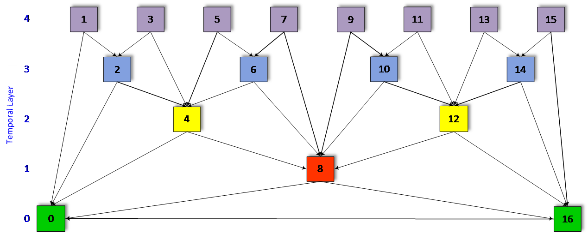

空间分层 （spartial layers）

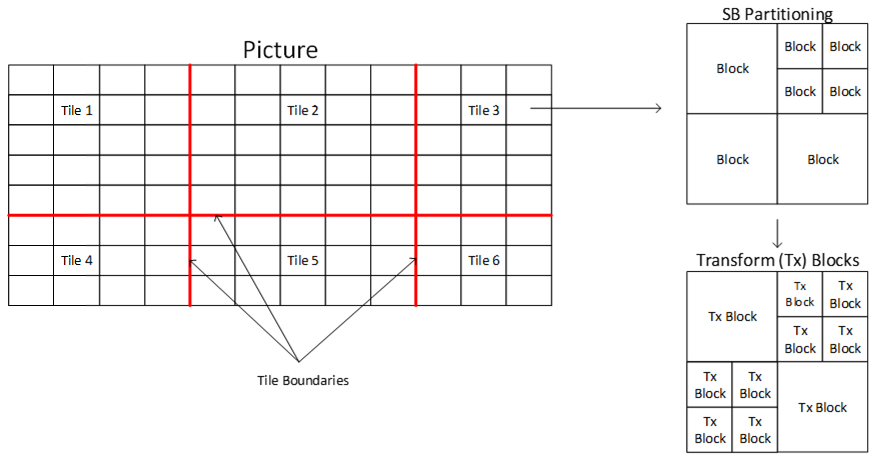

## 1.2 流程图

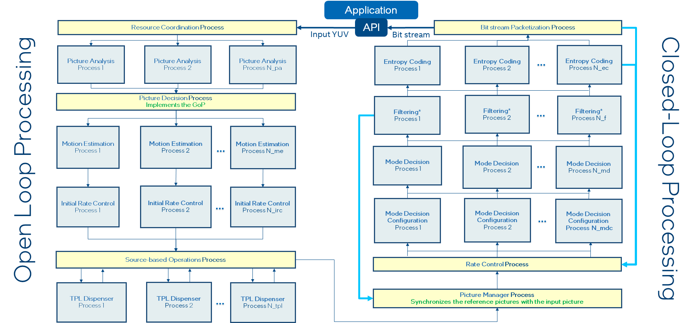

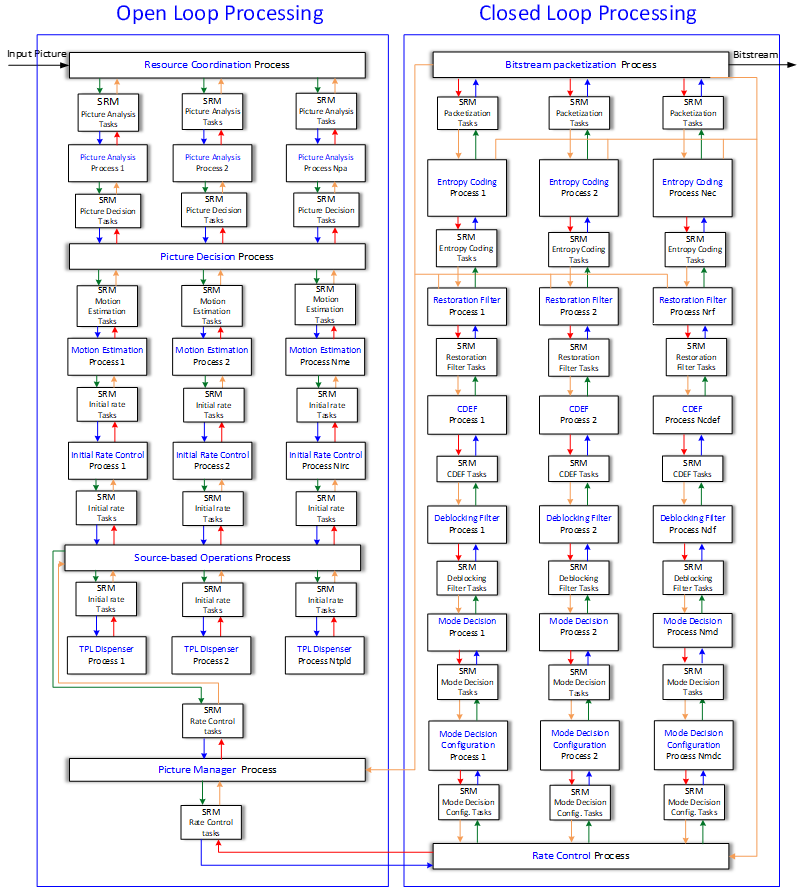

编码处理顺序

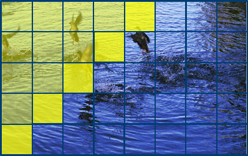

浅黄色是已经处理的，蓝色是还没处理的。亮黄色是正在处理的

## 1.3 System Resource Manager (SRM)

是用来管理进程间通信的模块

## 1.4 编码进程和算法

### 1 Resource Coordination Process

收集输入数据，在编码的 pipeline 里分配编码设置

### 2 Picture Analysis Process

做 1 次编码的 pre-processing analysis

也做帧内图像转换，包括 resampling, color space conversion 和 tone mapping

创建用于场景检测的直方图

多线程

### 3 Picture Decision Process

确认预测结构，帧类型，场景切换。

维护 reoder 队列，一直到 ME 进程启动

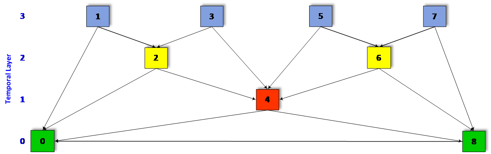

上图 GOP 结构的队列维护，注意 DPB 的变化

| **PicNumber** | **Show_frame** | **Show_existing_frame** | **DPB**    |
| ------------- | -------------- | ----------------------- | ---------- |
| 0             | 1              | 0                       | 0          |
| 8             | 0              | 0                       | 8-0        |
| 4             | 0              | 0                       | 4-8-0      |
| 2             | 0              | 0                       | 2-4-8-0    |
| 1             | 1              | 0                       | 2-4-8-0    |
| 2e            | 0              | 1                       | 2-4-8-0    |
| 3             | 1              | 0                       | 2-4-8-0    |
| 4e            | 0              | 1                       | 2-4-8-0    |
| 6             | 0              | 0                       | 6-2-4-8-0  |
| 5             | 1              | 0                       | 6-2-4-8-0  |
| 6e            | 0              | 1                       | 6-2-4-8-0  |
| 7             | 1              | 0                       | 6-2-4-8-0  |
| 8e            | 0              | 1                       | 6-2-4-8-0  |
| 16            | 0              | 0                       | 6-2-4-8-16 |

### 4 Motion Estimation Process

多线程做 ME

### 5 Initial Rate Control Process

确认每一帧能够分配到多少 bit。也会维护一个滑动窗口

### 6 Source-based Operations Process

用于分析输入帧的时空特性。使用了 Temporal Dependency Model (TPL) 算法

### 7 Picture Manager Process

输入加强的输入帧+参考帧。将输入帧分成 tiles，形成参考帧队列

### 8 Rate Control Process

设置每帧的 QP 和 bit

### 9 Mode Decision Configuration Process

### 10 Deblocking Loop Filter Process

# 2 Open-Loop Motion Estimation

ME 进程处理所有正方形块，从 8x8 到 SB。全像素预测。

## 2.1 算法描述

### 2.1.1 Pre-Hierarchical Motion Estimation (pre-HME)

是为了在水平和垂直方向，抓取比较大的移动

4x4 的下采样

如果 pre-HME 结果比 HME-level-0 好，就替代掉最差的 HME-level-0 结果。这个时候 HME-level-1 也一定要是能 pre-HME


搜索范围就是这个水平和垂直的一条

### 2.1.2 Hierarchical Motion Estimation (HME)

输出： SB 的搜索中心

分 3 个阶段

1. 1/16 像素 Level-0 full search
2. 1/4 像素 Level-1 refinement search
3. 正常像素 Level-2 refinement search

搜索区域被划分成了 N 个搜索区域，每一个 level 都会独立搜索产生 N 个搜索中心。 多个搜索中心可以避免出现局部最小值

目前 N 是 4。搜索都是基于 SAD

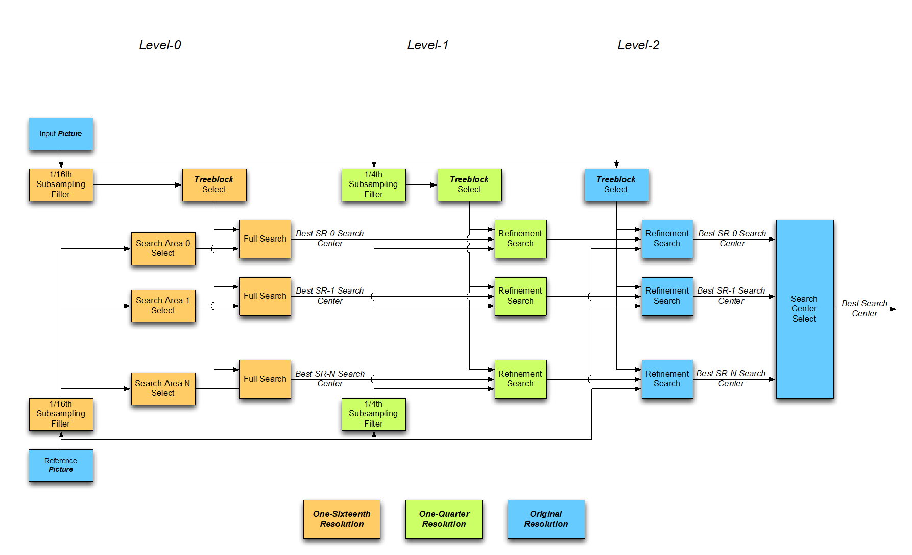

HME 的不同级别关系

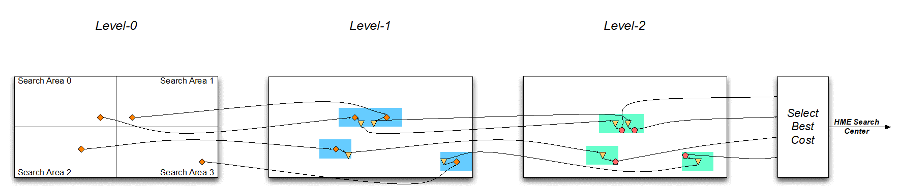

### 2.1.3 搜索中心选择

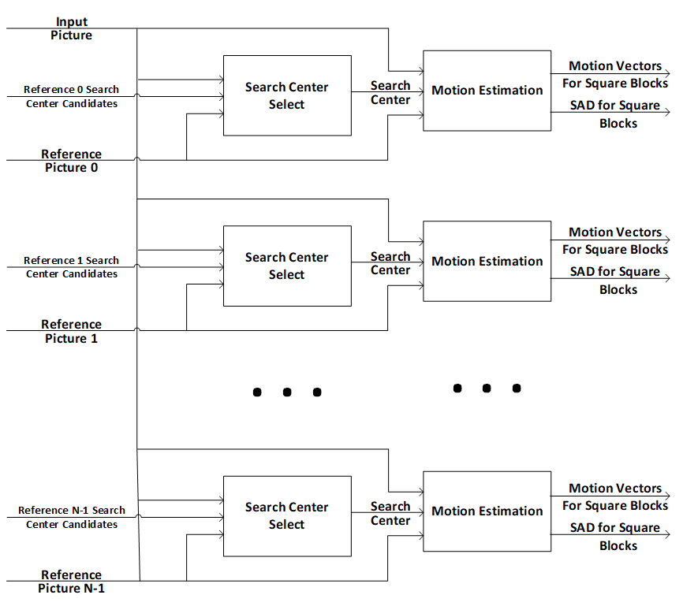

通过 SAD 判断选择哪个搜索中心

### 2.1.4 Motion Estimation (ME)

输入： enhanced 输入帧， 参考帧， 每个 SB 的搜索中心

输出：MVs - 每个 8x8 或者更大的块

在搜索中心周围，进行整型的全像素图片的全搜索

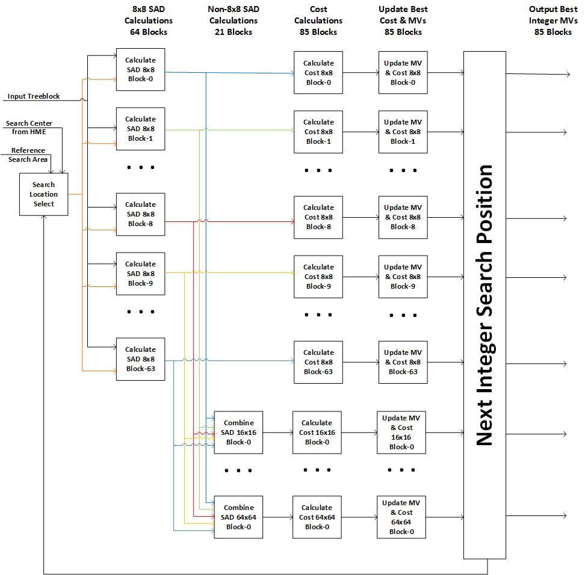

先各自算每个 8x8，然后再看是否 combine 16x16 或者 64x64 有更低的 cost

## 2.2 算法实现

输入： 当前帧，所有参考帧 1/16 像素，1/4 像素，和基础像素

输出： MVx 和每个 SB 的 SAD

函数调用图

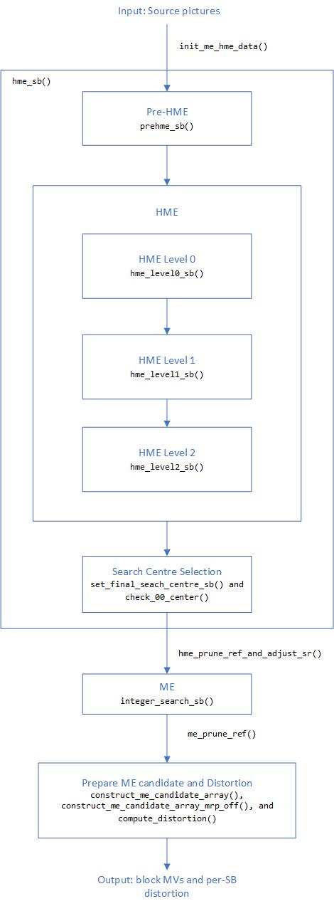

## 2.3 优化

### Pre-HME Optimization

| **Signal**       | **
Description**                                                                                                    |
| ---------------- | ------------------------------------------------------------------------------------------------------------------ |
| skip_search_line | If true, skips every other search region line                                                                      |
| l1_early_exit    | Skip pre-HME search for list 1 references if the SAD from list 0 is low, or the list 0 MVs are small               |
| use_tf_motion    | Use TF motion to direct prehme searches (if TF motion is horizontal (vertical), search only horizontal (vertical)) |

### Search Area Sizes

可以指定最大和最小的搜索区域

越是距离近的帧，搜索区域越大

#### 1） HME Level 0 Search Area Adjustment

根据 reduce_hme_l0_sr_th_min`and`reduce_hme_l0_sr_th_max 这两个变量判断是垂直还是水平移动

#### 2）ME Search Area Adjustment

如果 HME 的结果，移动很少。那么 ME 就不需要很大的搜索范围

#### 3）基于 HME/ME 的参考帧裁减

在 HME 和 ME 后，进行基于 SB 的参考帧裁减。裁减的原则是基于每一个参考帧的 SAD。基于以下公式

$\frac{`Curr\_frame\_SAD - Best\_frame\_SAD`}{Best\_frame\_SAD}>TH$

# 3 Mode Decision and Encode Pass

## 3.1 整体描述

MD 包含了 partitioning decision, mode decisions 和 AV1 编码

1. partitioning decision（PD）输出每个 SB 的最终分割
2. 每个 PD 阶段都会做 MD
3. 最终结果都传给 Encode Pass，这里会产生重构样本并传递给环路滤波和熵编码

MD 输入： ME 输出的 MV 和失真估计 + rate control 输出的帧级 QP

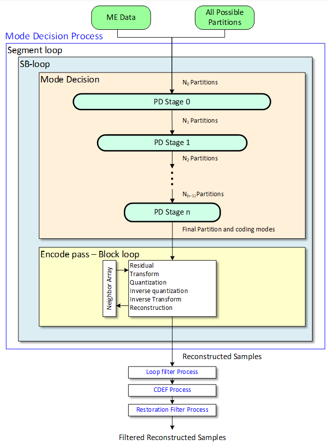

### 1 Partitioning Decision

还是分阶段，每个阶段先用简单的工具，然后一步一步用复杂的工具

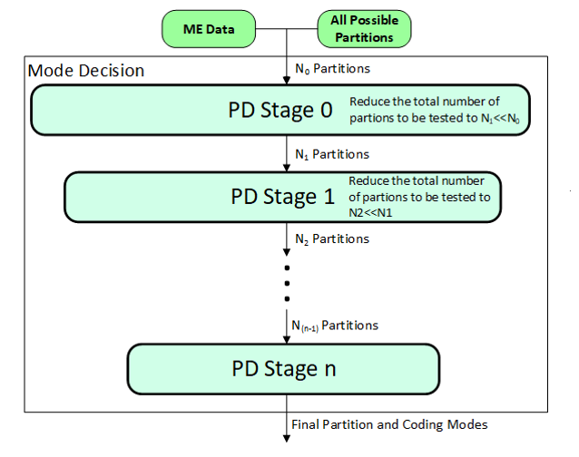

### 2 Mode Decision

每个 PD 阶段都会做多个 MD，每次如果有必要会淘汰掉一种

不同的 MD 分成不同的 class，目前实现一共有 4 种 Class。Intra,inter(NewMV/NEW_NEWMV), MV Pred(Nearest, Near...)，Palette 预测。

除了最终阶段，MD 不需要产生 bitstream

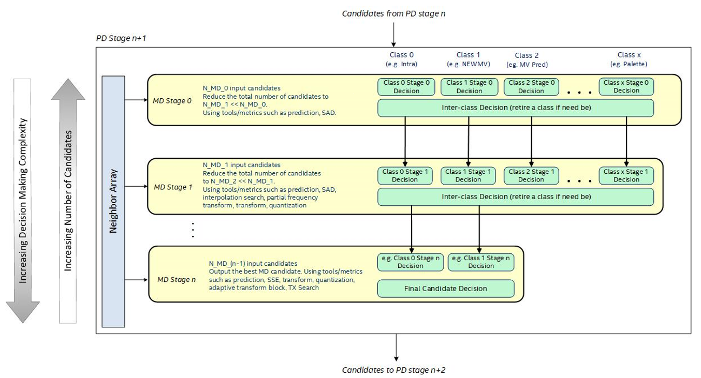

### 3 Encode Pass

通过 intra prediction, motion compensation, transform, quantization, inverse quantization, inverse transform, and
reconstruction 产生 bitstream

## 3.2 优化

限制允许的块大小，和降低非正方形(NSQ non-sqare)的数量都可以优化 PD

### 1 深度限制 Depth Refinement

限制每个 PD 阶段 partition 的数目

| **Depth** | **SQ block size** |
| --------- | ----------------- |
| 0         | 128x128           |
| 1         | 64x64             |
| 2         | 32x32             |
| 3         | 16x16             |
| 4         | 8x8               |
| 5         | 4x4               |

### 2 Depth Removal

就是在 PD0 的时候，降低 partition 的 depth

### 3 Light MD Paths

一些比较简单的 SB，可以用一些轻量级的 MD 预测工具

### 4 Bypass Encode Pass

## 3.3 Neighbor Array

有 3 个 buffer，让 MD 可以使用。这样就可以不用整帧。 上面一行，左上，还有左边

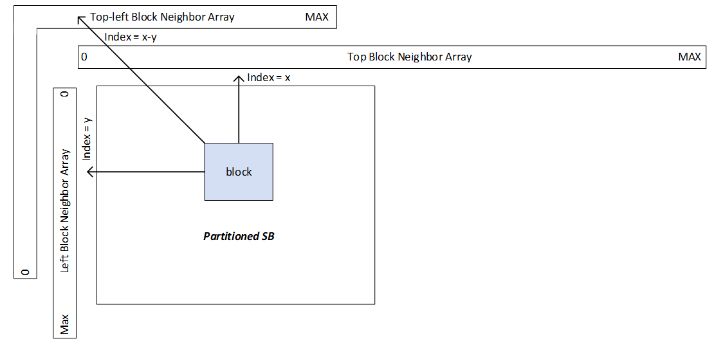

# 4 Compound Mode Prediction

## 4.1 算法描述

用两个预测块加权来计算一个块

$p(i,j) = m(i,j)p1(i,j) + (1-m(i,j))p2(i,j)$

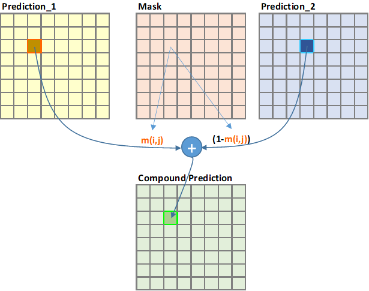

有 4 中类型

1. Inter-Intra prediction: 根据和块边界的距离确定权重
2. Wedge prediction: 可以是 inter-inter 或 inter-intra
3. Distance-weighted compound prediction: 权重是根据当前帧和参考帧的距离
4. Difference-weighted compound prediction: 根据 2 个帧间预测的差异确定权重

# 5 Picture Decision 源码分析

## 5.1 代码入口

Source/Lib/Encoder/Codec/EbPictureDecisionProcess.c

```c
void* svt_aom_picture_decision_kernel(void *input_ptr) {
}
```

PD 用于帧级选择，包括预测结构，设置帧类型和场景切换检测

因为输入的帧可能不是按照显示顺序的，所以添加了一个 reordering queue 来重排帧为显示顺序。PD 会一直在 reorder queue 里保存输入帧，一直到 ME 开始使用

输入： 帧( Pictures )

输出： Picture Control Set

对于带 B 帧的序列，为了确认场景切换和 I 帧，会最多保持 PredictionStructurePeriod 帧。

## 5.2 数据流

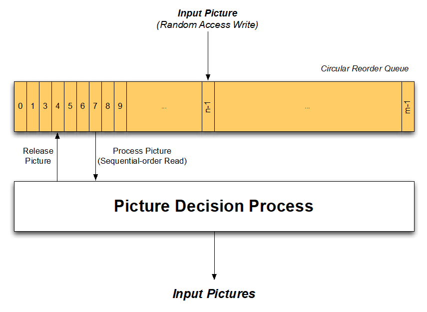

pre_assignment_buffer -> picture_decision_reorder_queue -> pred_struct_position

## 5.3 Prediction Structure

数据结构源码

SVT-AV1 通过 C 来模拟 C++，所以每个类有个 dctor 表示析构函数，ctor 表示构造函数。用 EB_xx 宏来构造结构体

```c++

typedef struct PredictionStructureEntry {
    uint32_t temporal_layer_index;  //temporal层次
    uint32_t decode_order;			//解码顺序
} PredictionStructureEntry;


typedef struct PredictionStructure {
    EbDctor                    dctor;
    uint32_t                   pred_struct_entry_count;	//有多少个pred的entry
    PredictionStructureEntry **pred_struct_entry_ptr_array;//初始值从PredictionStructureConfigEntry拷过来
    SvtAv1PredStructure        pred_type;			//只有 SVT_AV1_PRED_LOW_DELAY_B / SVT_AV1_PRED_RANDOM_ACCESS
    uint32_t                   pred_struct_period;
    // Section Indices
    uint32_t init_pic_index;
} PredictionStructure;


typedef struct PredictionStructureGroup {
    EbDctor               dctor;
    PredictionStructure **prediction_structure_ptr_array;//这个是个二维数组[temporal level][pred_type]，放置的内容就是不同type的PredictionStructure
    uint32_t              prediction_structure_count; //这个值是MAX_TEMPORAL_LAYERS * SVT_AV1_PRED_TOTAL_COUNT，6*3=18
    void                 *priv; /* 这个放的是PredictionStructureConfigArray*/
} PredictionStructureGroup;

/************************************************
     * Prediction Structure Config
     *   Contains a collection of basic control data
     *   for the basic prediction structure.
     ************************************************/
typedef struct PredictionStructureConfig {
    uint32_t                        entry_count;
    PredictionStructureConfigEntry *entry_array;//不同的temporal_levels用下面不同的数组
} PredictionStructureConfig;

/************************************************
 * Prediction Structure Config Array
 * 这个是所有的prediction_structure的格式。数字表示有几帧
 * 后面那个表示每一帧的temporal level和decoder ，按照显示顺序
 ************************************************/
static const PredictionStructureConfig g_prediction_structure_config_array[] = {
    {1, flat_pred_struct},
    {2, two_level_hierarchical_pred_struct},
    {4, three_level_hierarchical_pred_struct},
    {8, four_level_hierarchical_pred_struct},
    {16, five_level_hierarchical_pred_struct},
    {32, six_level_hierarchical_pred_struct},
    {0, (PredictionStructureConfigEntry *)NULL} // Terminating Code, must always come last!
};

```

## 5.4 代码概略

```c++
for (;;) {
    // 获取输入帧
    EB_GET_FULL_OBJECT(
        ctx->picture_analysis_results_input_fifo_ptr,
        &in_results_wrapper_ptr);
    。。。
    // 按显示顺序重排序
    if (!pcs->is_overlay) {
        //在enc_ctx->picture_decision_reorder_queue中
        //index在pcs->pic_decision_reorder_queue_idx里
    }
    //从picture_decision_reorder_queue的head里获取帧并处理
    queue_entry_ptr = enc_ctx->picture_decision_reorder_queue[enc_ctx->picture_decision_reorder_queue_head_index];
    while (queue_entry_ptr->ppcs_wrapper != NULL) {
        //这里做ME的1st pass，是为了获取帧的统计信息
    	if (scs->static_config.pass == ENC_FIRST_PASS || scs->lap_rc) {
            process_first_pass(scs, enc_ctx, ctx);
        }

        pcs = (PictureParentControlSet*)queue_entry_ptr->ppcs_wrapper->object_ptr;
        bool window_avail, eos_reached;
        //确认是否有足够的帧来做scene change判断
        check_window_availability(scs, enc_ctx, pcs, queue_entry_ptr, &window_avail, &eos_reached);

        // 如果有做scene change判断
        if (window_avail == TRUE && queue_entry_ptr->picture_number > 0) {
            perform_scene_change_detection(scs, pcs, ctx);
        }

        //pre_assignment_buffer用来放pre-structure
        enc_ctx->pre_assignment_buffer[enc_ctx->pre_assignment_buffer_count] = queue_entry_ptr->ppcs_wrapper;
        ...
        //做完scene change就可以释放reorder queue里的前一帧
        release_prev_picture_from_reorder_queue(enc_ctx);

        //确定帧类型
        // 如果Intra period length is 0, 设I帧
        if (scs->static_config.intra_period_length == 0)
            pcs->cra_flag = TRUE;
        // If an #IntraPeriodLength has passed since the last Intra, then introduce a CRA or IDR based on Intra Refresh type
        else if (scs->static_config.intra_period_length != -1) {

            pcs->cra_flag =
                (scs->static_config.intra_refresh_type != SVT_AV1_FWDKF_REFRESH) ?
                pcs->cra_flag :
            ((enc_ctx->intra_period_position == (uint32_t)scs->static_config.intra_period_length) || (pcs->scene_change_flag == TRUE)) ?
                TRUE :
            pcs->cra_flag;

            pcs->idr_flag =
                (scs->static_config.intra_refresh_type != SVT_AV1_KF_REFRESH) ?
                pcs->idr_flag :
            ((enc_ctx->intra_period_position == (uint32_t)scs->static_config.intra_period_length) ||
             (pcs->scene_change_flag == TRUE) ||
             (scs->static_config.force_key_frames && pcs->input_ptr->pic_type == EB_AV1_KEY_PICTURE)) ?
                TRUE :
            pcs->idr_flag;
        }
        。。。
        // Histogram data to be used at the next input (N + 1)
        if (scs->calc_hist) {
           copy_histograms(pcs, ctx);
        }

        // Increment the Pre-Assignment Buffer Intra Count
        。。。

        // Increment the Intra Period Position
        。。。

        // 确认是否可以从pre-assignment buffer删除帧
        if ((enc_ctx->pre_assignment_buffer_intra_count > 0) ||
            (enc_ctx->pre_assignment_buffer_count == (uint32_t)(1 << next_mg_hierarchical_levels)) ||
            (enc_ctx->pre_assignment_buffer_eos_flag == TRUE) ||
            (pcs->pred_structure == SVT_AV1_PRED_LOW_DELAY_P) ||
            (pcs->pred_structure == SVT_AV1_PRED_LOW_DELAY_B))
        {
             // Once there are enough frames in the pre-assignement buffer, we can setup the mini-gops
             set_mini_gop_structure(scs, enc_ctx, pcs, ctx); //在这里面根据gop结构设了pred structure

            // Loop over Mini GOPs
            for (unsigned int mini_gop_index = 0; mini_gop_index < ctx->total_number_of_mini_gops; ++mini_gop_index) {

                // 1st Loop over Pictures in the Pre-Assignment Buffer
                // Setup the pred strucutre and picture types for all frames in the mini-GOP (including overlay pics)
                for (pic_idx = ctx->mini_gop_start_index[mini_gop_index]; pic_idx <= ctx->mini_gop_end_index[mini_gop_index]; ++pic_idx) {
                    ...
                }

                // 2nd Loop over Pictures in the Pre-Assignment Buffer
                // Init picture settings
                // Add 1 to the loop for the overlay picture. If the last picture is alt ref, increase the loop by 1 to add the overlay picture
                const uint32_t has_overlay = ((PictureParentControlSet*)enc_ctx->pre_assignment_buffer[ctx->mini_gop_end_index[mini_gop_index]]->object_ptr)->is_alt_ref ? 1 : 0;
                for (pic_idx = ctx->mini_gop_start_index[mini_gop_index]; pic_idx <= ctx->mini_gop_end_index[mini_gop_index] + has_overlay; ++pic_idx) {
                    ...
                }
            }
            // Store pics in ctx->mg_pictures_array in decode order
            // and pics in ctx->mg_pictures_array_disp_order in display order
            store_mg_picture_arrays(ctx);

            for (uint32_t pic_i = 0; pic_i < mg_size; ++pic_i) {
                // Loop over pics in decode order
                pcs = (PictureParentControlSet*)ctx->mg_pictures_array[pic_i];
                // 产生参考帧队列
                av1_generate_rps_info(
                    pcs,
                    enc_ctx,
                    ctx,
                    pcs->pic_idx_in_mg,
                    mini_gop_index);

                if (scs->static_config.sframe_dist != 0 || !pcs->is_not_scaled) {
                    update_sframe_ref_order_hint(pcs, ctx);
                }
				//更新DPB
                update_dpb(pcs, ctx);

                // Set picture settings, incl. normative frame header fields and feature levels in signal_derivation function
                init_pic_settings(scs, pcs, ctx);
            }

        }

    }
}
```


