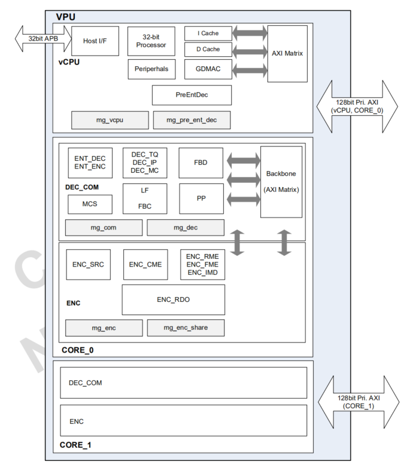
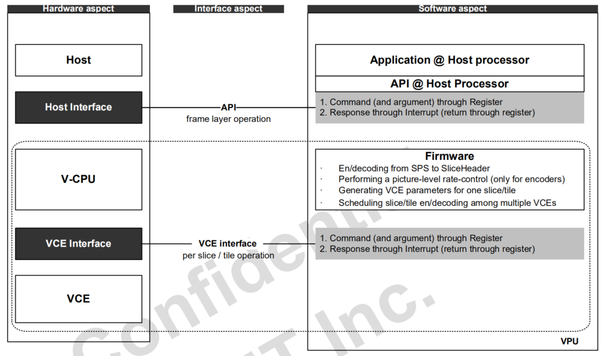
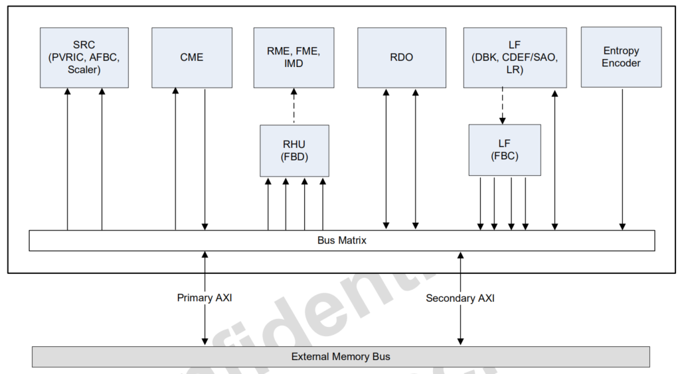



# Wave677 datasheet

## 1 Overview

V-CPU 控制 VCE (video coding engine) 做编码

entropy engine

CFrame - 压缩帧

VCE 的作用

1. motion estimation
2. intra prediction
3. RDO
4. loopfilter
5. entropy coding
6. motion compensation
7. intra prediction

### 1.3 Block Diagram

### 1.4 固件

host 软件通过 host interface 和 VCPU 交互，是一组 host 的 Host Interface Registers

VCPU 调用 firmware 来控制 VCE

## 3 外部 memory

### 3.1 外部 memory 类型

1. Code buffer: 代码
2. Temporal buffer: 相邻像素信息。Encoder 用于 RDO 和 loop filter. 每个 VCE 有 1 个。
3. Work buffer: 每个 instance 一个
4. Bitstream Buffer: CPB(Coded Picture Buffer)
5. Frame Buffer: DPB (Decoded Picture Buffer)
6. Linear buffer: 参考帧队列（Compressed Frame Buffer）/ 显示的 YUV (不压缩)
7. User data and report buffer

## 4 数据流

### 4.2 编码数据流

1. SRC(Source image loader) 从外部 memory 读 YUV
2. CME(Coarse Motion Estimation) 写下采样数据(1/2 长宽)作为参考帧。 CME 把参考帧数据填入内部的搜索 buffer，输出粗略的 MV 给 RHU 来做下一级的向量搜索。 CME 也会读取
   custom mode map 信息，然后一个宏块一个宏块输出
3. RHU(Reference Handling Unit) 读压缩的参考帧，解压缩然后存入内部宏块级别的参考 buffer
4. RME(Refined Motion Estimation) and FME(Fractional Motion Estimation) 用解压后的 Y 向量做 ME. RDO 使用解压后的 YUV 数据。RME ->
   32x32/16x16/8x8 MV -> FME ， FME-> 32x32/16x16/8x8 MV -> RDO
5. IMD(Intra Mode Decision) 确定 intra 模式， IMD -> 32x32/16x16/8x8 intra mode -> RDO
6. RDO 发送 reconstructed 数据给 LF 做 deblock filter，RDO -> 量化 coeff 和 mode -> ENT_ENC。
7. LF 包含几个模块： Deblock filter, CDEF(AV1)/SAO(HEVC) filter, LR(Wiener filter of AV1) filter, CDEF/SAO parameter generator,
   and Wiener filter parameter generator
8. ENT_ENC(Entropy Encoder) 熵编码


