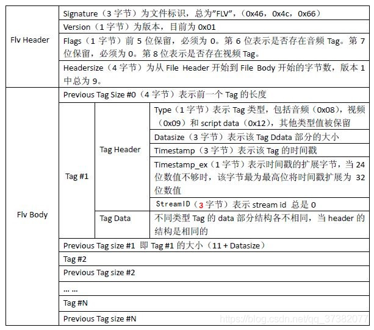
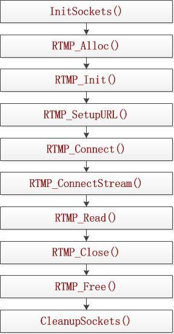
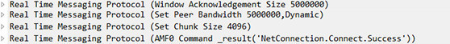
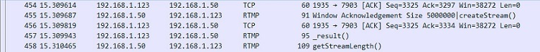
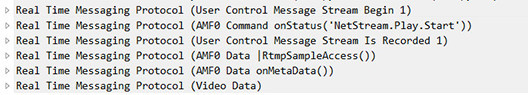
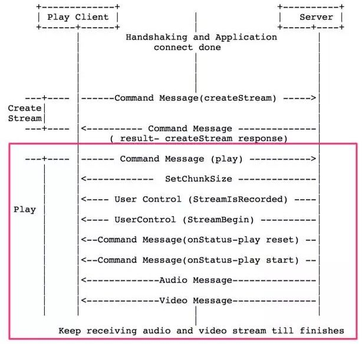



#流媒体协议

## http-flv

FLV（Flash Video）由于其视频文件体积轻巧、封装简单等特点，使其很适合在互联网上进行应用。此外，FLV可以使用Flash Player进行播放，而Flash Player插件已经安装在全世界绝大部分浏览器上，这使得通过网页播放FLV视频十分容易。目前主流的视频网站如优酷网，土豆网，乐视网等网站无一例外地使用了FLV格式。FLV封装格式的文件后缀通常为“.flv”。

总体上看，FLV包括文件头（File Header）和文件体（File Body)两部分，其中文件体由一系列的Tag组成。因此一个FLV文件是如下图结构。
其中，每个Tag前面还包含了Previous Tag Size字段，表示前面一个Tag的大小。Tag的类型可以是视频、音频和Script，每个Tag只能包含以上三种类型的数据中的一种。下图展示了FLV文件的详细结构。

上表中的Tag Header -> Tag Data表示 Tag的值 在Tag#1和Previous Tag size中间还有实际的码流数据，那个叫tag body

### Audio tags

| 字段        | 字段类型                | 字段含义                                                     |
| :---------- | :---------------------- | :----------------------------------------------------------- |
| SoundFormat | UB[4]                   | 音频格式，重点关注 **10 = AAC ** 0 = Linear PCM, platform endian 1 = ADPCM 2 = MP3 3 = Linear PCM, little endian 4 = Nellymoser 16-kHz mono 5 = Nellymoser 8-kHz mono 6 = Nellymoser 7 = G.711 A-law logarithmic PCM 8 = G.711 mu-law logarithmic PCM 9 = reserved 10 = AAC 11 = Speex 14 = MP3 8-Khz 15 = Device-specific sound |
| SoundRate   | UB[2]                   | 采样率，对AAC来说，永远等于3 0 = 5.5-kHz 1 = 11-kHz 2 = 22-kHz 3 = 44-kHz |
| SoundSize   | UB[1]                   | 采样精度，对于压缩过的音频，永远是16位 0 = snd8Bit 1 = snd16Bit |
| SoundType   | UB[1]                   | 声道类型，对Nellymoser来说，永远是单声道；对AAC来说，永远是双声道； 0 = sndMono 单声道 1 = sndStereo 双声道 |
| SoundData   | UI8[size of sound data] | 如果是AAC，则为 AACAUDIODATA； 其他请参考规范；              |

### Video tags

| 字段      | 字段类型      | 字段含义                                                     |
| :-------- | :------------ | :----------------------------------------------------------- |
| FrameType | UB[4]         | 重点关注1、2： 1: keyframe (for AVC, a seekable frame) —— 即H.264的IDR帧； 2: inter frame (for AVC, a non- seekable frame) —— H.264的普通I帧； 3: disposable inter frame (H.263 only) 4: generated keyframe (reserved for server use only) 5: video info/command frame |
| CodecID   | UB[4]         | 编解码器，主要关注 7（AVC） 1: JPEG (currently unused) 2: Sorenson H.263 3: Screen video 4: On2 VP6 5: On2 VP6 with alpha channel 6: Screen video version 2 **7: AVC** |
| VideoData | 取决于CodecID | 实际的媒体类型，主要关注 7:AVCVIDEOPACKE 2: H263VIDEOPACKET 3: SCREENVIDEOPACKET 4: VP6FLVVIDEOPACKET 5: VP6FLVALPHAVIDEOPACKET 6: SCREENV2VIDEOPACKET **7: AVCVIDEOPACKE** |

#### AVCVIDEOPACKE

当 CodecID 为 7 时，VideoData 为 AVCVIDEOPACKE，也即 H.264媒体数据。

AVCVIDEOPACKE 的定义如下：

| 字段                 | 字段类型 | 字段含义                                                     |
| :------------------- | :------- | :----------------------------------------------------------- |
| AVCPacketType        | UI8      | 0: AVC sequence header 1: AVC NALU 2: AVC end of sequence    |
| CompositionTime  CTS | SI24     | 如果AVCPacketType=1，则为时间**cts**偏移量；否则，为0        |
| Data                 | UI8[n]   | 1、如果如果AVCPacketType=1，则为AVCDecoderConfigurationRecord(SPS/PPS) 2、如果AVCPacketType=1=2，则为NALU（一个或多个） 3、如果AVCPacketType=2，则为空 |

NALU包括了SPS/PPS

CTS：当B帧的存在时，视频解码呈现过程中，dts、pts可能不同，cts的计算公式为 pts - dts/90，单位为毫秒；如果B帧不存在，则cts固定为0

### 金山推出支持HEVC的标准

| Field           | Type                                                         | Comment                                                      |
| --------------- | ------------------------------------------------------------ | ------------------------------------------------------------ |
| Frame Type      | UB [4]                                                       | Frame Type Type of video frame. The following values are defined: 1 = key frame (for AVC and HEVC, a seekable frame) 2 = inter frame (for AVC and HEVC, a non-seekable frame) 3 = disposable inter frame (H.263 only) 4 = generated key frame (reserved for server use only) 5 = video info/command frame |
| CodecID         | UB [4]                                                       | Codec Identifier. The following values are defined: 2 = Sorenson H.263 3 = Screen video 4 = On2 VP6 5 = On2 VP6 with alpha channel 6 = Screen video version 2 7 = AVC 12=HEVC |
| HVCPacketType   | IF CodecID == 12 UI8                                         | The following values are defined: 0 = HEVC sequence header 1 = HEVC NALU 2 = HEVC end of sequence (lower level NALU sequence ender is not required or supported |
| CompositionTime | IF CodecID==7 OR CodecID == 12 SI24                          | IF AVCPacketType == 1 OR HVCPacketType == 1 Composition time offset ELSE 0 See ISO 14496-12, 8.15.3 for an explanation of composition times. The offset in an FLV file is always in milliseconds. |
| VideoTagBody    | IF FrameType == 5 UI8 ELSE ( IF CodecID == 2 H263VIDEOPACKET IF CodecID == 3 SCREENVIDEOPACKET IF CodecID == 4 VP6FLVVIDEOPACKET IF CodecID == 5 VP6FLVALPHAVIDEOPACKET IF CodecID == 6 SCREENV2VIDEOPACKET IF CodecID == 7 AVCVIDEOPACKET IF CodecID == 12 HVCVIDEOPACKET ) | Video frame payload or frame info If FrameType == 5, instead of a video payload, the Video Data Body contains a UI8 with the following meaning: 0 = Start of client-side seeking video frame sequence 1 = End of client-side seeking video frame sequence For all but AVCVIDEOPACKET or HVCVIDEOPACKET, see the SWF File Format Specification for details |

## RTMP

### 概述

`RTMP(Real Time Messaging Protocol)`实时消息传送协议是[Adobe](https://link.jianshu.com?t=https://baike.baidu.com/item/Adobe) Systems公司为Flash播放器和服务器之间音频、视频和数据传输 开发的开放协议。
 它有多种变种：

- `RTMP`工作在TCP之上，默认使用端口1935；
- `RTMPE`在RTMP的基础上增加了加密功能；
- `RTMPT`封装在[HTTP请求](https://link.jianshu.com?t=https://baike.baidu.com/item/HTTP请求)之上，可穿透[防火墙](https://link.jianshu.com?t=https://baike.baidu.com/item/防火墙)；
- `RTMPS`类似RTMPT，增加了`TLS/SSL`的安全功能。

### 建立连接过程

RTMP协议规定，播放一个流媒体有两个前提步骤：

第一步，建立一个网络连接（NetConnection）；

第二步，建立一个网络流（NetStream）。

其中，网络连接代表服务器端应用程序和客户端之间基础的连通关系。网络流代表了发送多媒体数据的通道。服务器和客户端之间只能建立一个网络连接，但是基于该连接可以创建很多网络流。

播放一个RTMP协议的流媒体需要经过以下几个步骤：握手，建立连接，建立流，播放。RTMP连接都是以握手作为开始的。建立连接阶段用于建立客户端与服务器之间的“网络连接”；建立流阶段用于建立客户端与服务器之间的“网络流”；播放阶段用于传输视音频数据。

### 使用librtmp接收流的过程

### 具体抓包分析

#### 1 握手

1.RTMP协议是TCP协议的上层协议，所以必须要先建立TCP连接，所以就看到了1-4这几个TCP三次握手的包。

2.客户端发送的是C0+C1块，直接告诉服务器我发的版本我自己确认了。

3.服务器更狠，一个大嘴巴子就抽回来了（发送S0+S1+S2）。

4.客户端收到后，发送C2，握手完成！

#### 2 建立网络连接

1.客户端在发送C2的时候，顺带还发了一个请求连接的命令，要求与服务器应用建立网络连接，这就是RTMP URL中的的Application。soga，是不是恍然大悟？

2.服务器在收到客户端发送的连接请求后发送如下信息：

主要是告诉客户端确认窗口大小，设置节点带宽，然后服务器把“连接”连接到指定的应用并返回结果，“网络连接成功”。并且返回流开始的的消息（Stream Begin 0）。

3.客户端在收到服务器发来的消息后，返回确认窗口大小，此时网络连接创建完成。

#### 3 建立一个网络流（NetStream）

提示：网络流代表了发送多媒体数据的通道。服务器和客户端之间只能建立一个网络连接，且多个网络流可以复用这一个网络连接。

接着看抓包：

现在地洞挖好了，就差铺铁轨了！

1.客户端向服务器发送请求创建流（createStream）。

2.服务器收到请求后向客户端发送_result()，对创建流的消息进行响应。此时NetStream创建完成。

#### 4 播放

1.客户端向服务器发送播放命令，请求播放stream，并设置Buffer Length 1，3000ms。

2.服务器收到请求后，向客户端发送设置块大小的协议消息，并且还附加了一堆其他的消息一起发送：

包括 Stream Begin（告知客户端流ID为0）、NetStream.Play.Start（ 告知客户端播放成功）等。

3. 服务器向客户端发送推流通知，并附带元数据信息（分辨率、帧率、音频采样率、音频码率等等）和视频、音频数据。此时客户端就可以开始正常播放rtmp流了。 协议流程图：

### RTMP包结构

#### 1 Chunk/Message的概念

RTMP的一个Message就是一帧，一帧分成多个Chunk来传输

#### 2 Message(消息)

这里的Message是指满足该协议格式的、可以切分成Chunk发送的消息，消息包含的字段如下：

- Timestamp（时间戳）：消息的时间戳（但不一定是当前时间，后面会介绍），4个字节
- Length(长度)：是指Message Payload（消息负载）即音视频等信息的数据的长度，3个字节
- TypeId(类型Id)：消息的类型Id，1个字节
- Message Stream ID（消息的流ID）：每个消息的唯一标识，划分成Chunk和还原Chunk为Message的时候都是根据这个ID来辨识是否是同一个消息的Chunk的，4个字节，并且以小端格式存储

#### 3  Chunk Format（块格式）

##### 1 Basic Header

chunk stream ID（流通道Id）

chunk type（chunk的类型）

##### 2 Message Header

chunk type=0时Message Header占用11个字节

- timestamp（时间戳）：占用3个字节，因此它最多能表示到16777215=0xFFFFFF=2 24-1, 当它的值超过这个最大值时，这三个字节都置为1，这样实际的timestamp会转存到Extended Timestamp字段中，接受端在判断timestamp字段24个位都为1时就会去Extended timestamp中解析实际的时间戳。
- message length（消息数据的长度）：占用3个字节，表示实际发送的消息的数据如音频帧、视频帧等数据的长度，单位是字节。注意这里是Message的长度，也就是chunk属于的Message的总数据长度，而不是chunk本身Data的数据的长度。
- message type id(消息的类型id)：占用1个字节，表示实际发送的数据的类型，如8代表音频数据、9代表视频数据。
- msg stream id（消息的流id）：占用4个字节，表示该chunk所在的流的ID，和Basic Header的CSID一样，它采用小端存储的方式， Type = 1:

type=1时Message Header占用7个字节，省去了表示msg stream id的4个字节

type=2时Message Header占用3个字节，相对于type＝1格式又省去了表示消息长度的3个字节和表示消息类型的1个字节

Type = 3 0字节！！！好吧，它表示这个chunk的Message Header和上一个是完全相同的，自然就不用再传输一遍了。

##### 3 **Extended Timestamp（扩展时间戳）**

上面我们提到在chunk中会有时间戳timestamp和时间戳差timestamp delta，并且它们不会同时存在，只有这两者之一大于3个字节能表示的最大数值0xFFFFFF＝16777215时，才会用这个字段来表示真正的时间戳，否则这个字段为0。扩展时间戳占4个字节，能表示的最大数值就是0xFFFFFFFF＝4294967295。当扩展时间戳启用时，timestamp字段或者timestamp delta要全置为1，表示应该去扩展时间戳字段来提取真正的时间戳或者时间戳差。注意扩展时间戳存储的是完整值，而不是减去时间戳或者时间戳差的值。

#### 4 协议控制消息（Protocol Control Message）

Message Stream ID必须为0, Message Type ID可以为1，2，3，5，6

- Set Chunk Size(Message Type ID=1):设置chunk中Data字段所能承载的最大字节数，默认为128B，通信过程中可以通过发送该消息来设置chunk Size的大小（不得小于128B），而且通信双方会各自维护一个chunkSize，两端的chunkSize是独立的。比如当A想向B发送一个200B的Message，但默认的chunkSize是128B，因此就要将该消息拆分为Data分别为128B和72B的两个chunk发送，如果此时先发送一个设置chunkSize为256B的消息，再发送Data为200B的chunk，本地不再划分Message，B接受到Set Chunk Size的协议控制消息时会调整的接受的chunk的Data的大小，也不用再将两个chunk组成为一个Message。 以下为代表Set Chunk Size消息的chunk的Data：

其中第一位必须为0，chunk Size占31个位，最大可代表2147483647＝0x7FFFFFFF＝231-1，但实际上所有大于16777215=0xFFFFFF的值都用不上，因为chunk size不能大于Message的长度，表示Message的长度字段是用3个字节表示的，最大只能为0xFFFFFF。

- Abort Message(Message Type ID=2):当一个Message被切分为多个chunk，接受端只接收到了部分chunk时，发送该控制消息表示发送端不再传输同Message的chunk，接受端接收到这个消息后要丢弃这些不完整的chunk。Data数据中只需要一个CSID，表示丢弃该CSID的所有已接收到的chunk。

- Acknowledgement(Message Type ID=3):当收到对端的消息大小等于窗口大小（Window Size）时接受端要回馈一个ACK给发送端告知对方可以继续发送数据。窗口大小就是指收到接受端返回的ACK前最多可以发送的字节数量，返回的ACK中会带有从发送上一个ACK后接收到的字节数。

- Window Acknowledgement Size(Message Type ID=5):发送端在接收到接受端返回的两个ACK间最多可以发送的字节数。

- Set Peer Bandwidth(Message Type ID=6):限制对端的输出带宽。接受端接收到该消息后会通过设置消息中的Window ACK Size来限制已发送但未接受到反馈的消息的大小来限制发送端的发送带宽。如果消息中的Window ACK Size与上一次发送给发送端的size不同的话要回馈一个Window Acknowledgement Size的控制消息。

- Hard(Limit Type＝0):接受端应该将Window Ack Size设置为消息中的值
- Soft(Limit Type=1):接受端可以讲Window Ack Size设为消息中的值，也可以保存原来的值（前提是原来的Size小与该控制消息中的Window Ack Size）
- Dynamic(Limit Type=2):如果上次的Set Peer Bandwidth消息中的Limit Type为0，本次也按Hard处理，否则忽略本消息，不去设置Window Ack Size。

#### 5 Command Message (Message Type ID＝17或20)

##### 1 Command Message(命令消息，Message Type ID＝17或20) 

 发送端发送时会带有命令的名字，如connect，TransactionID表示此次命令的标识，Command Object表示相关参数。接受端收到命令后，会返回以下三种消息中的一种：_result 消息表示接受该命令，对端可以继续往下执行流程，_error消息代表拒绝该命令要执行的操作，method name消息代表要在之前命令的发送端执行的函数名称。这三种回应的消息都要带有收到的命令消息中的TransactionId来表示本次的回应作用于哪个命令。 可以认为发送命令消息的对象有两种，一种是NetConnection，表示双端的上层连接，一种是NetStream，表示流信息的传输通道，控制流信息的状态，如Play播放流，Pause暂停。 

##### 2 NetConnection Commands(连接层的命令)

 用来管理双端之间的连接状态，同时也提供了异步远程方法调用（RPC）在对端执行某方法，以下是常见的连接层的命令：  

connect:用于客户端向服务器发送连接请求，消息的结构如下：

第三个字段中的Command Object中会涉及到很多键值对，这里不再一一列出，使用时可以参考协议的官方文档。 消息的回应有两种，_result表示接受连接，_error表示连接失败

Call:用于在对端执行某函数，即常说的RPC：远程进程调用，消息的结构如下：

如果消息中的TransactionID不为0的话，对端需要对该命令做出响应，响应的消息结构如下：

Create Stream：创建传递具体信息的通道，从而可以在这个流中传递具体信息，传输信息单元为Chunk。

##### 3 NetStream Commands(流连接上的命令)

Netstream建立在NetConnection之上，通过NetConnection的createStream命令创建，用于传输具体的音频、视频等信息。在传输层协议之上只能连接一个NetConnection，但一个NetConnection可以建立多个NetStream来建立不同的流通道传输数据。 以下会列出一些常用的NetStream Commands，服务端收到命令后会通过onStatus的命令来响应客户端，表示当前NetStream的状态。 onStatus命令的消息结构如下：

用于客户端向服务器发送连接请求，消息的结构如下：如果Pause为true即表示客户端请求暂停的话，服务端暂停对应的流会返回NetStream.Pause.Notify的onStatus命令来告知客户端当前流处于暂停的状态，当Pause为false时，服务端会返回NetStream.Unpause.Notify的命令来告知客户端当前流恢复。如果服务端对该命令响应失败，返回_error信息。

4.1.2.1 play(播放):由客户端向服务器发起请求从服务器端接受数据（如果传输的信息是视频的话就是请求开始播流），可以多次调用，这样本地就会形成一组数据流的接收者。注意其中有一个reset字段，表示是覆盖之前的播流（设为true）还是重新开始一路播放（设为false）。

4.1.2.2 play2（播放）：和上面的play命令不同的是，play2命令可以将当前正在播放的流切换到同样数据但不同比特率的流上，服务器端会维护多种比特率的文件来供客户端使用play2命令来切换。

4.1.2.3 deleteStream(删除流)：用于客户端告知服务器端本地的某个流对象已被删除，不需要再传输此路流。

4.1.2.4 receiveAudio(接收音频)：通知服务器端该客户端是否要发送音频

receiveAudio命令结构如下：

4.1.2.5 receiveVideo(接收视频)：通知服务器端该客户端是否要发送视频

receiveVideo命令结构如下：

4.1.2.6 publish(推送数据)：由客户端向服务器发起请求推流到服务器。

publish命令结构如下：

4.1.2.7 seek(定位流的位置)：定位到视频或音频的某个位置，以毫秒为单位。

seek命令的结构如下：

4.1.2.8 pause（暂停）：客户端告知服务端停止或恢复播放。

pause命令的结构如下：

如果Pause为true即表示客户端请求暂停的话，服务端暂停对应的流会返回NetStream.Pause.Notify的onStatus命令来告知客户端当前流处于暂停的状态，当Pause为false时，服务端会返回NetStream.Unpause.Notify的命令来告知客户端当前流恢复。如果服务端对该命令响应失败，返回_error信息。

